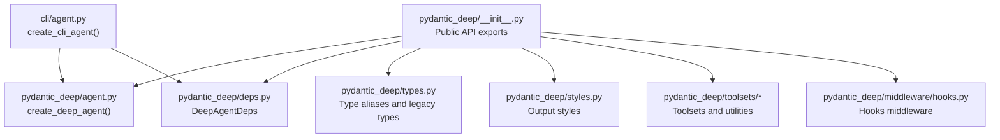
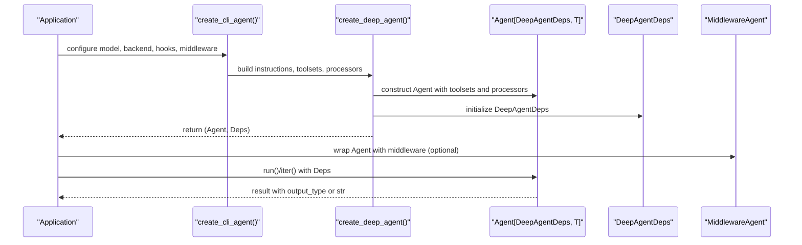
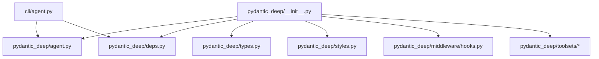

# API Reference

<cite>
**Referenced Files in This Document**
- [pydantic_deep/__init__.py](file://pydantic_deep/__init__.py)
- [pydantic_deep/agent.py](file://pydantic_deep/agent.py)
- [pydantic_deep/deps.py](file://pydantic_deep/deps.py)
- [pydantic_deep/types.py](file://pydantic_deep/types.py)
- [pydantic_deep/prompts.py](file://pydantic_deep/prompts.py)
- [pydantic_deep/styles.py](file://pydantic_deep/styles.py)
- [pydantic_deep/toolsets/__init__.py](file://pydantic_deep/toolsets/__init__.py)
- [pydantic_deep/toolsets/context.py](file://pydantic_deep/toolsets/context.py)
- [pydantic_deep/toolsets/memory.py](file://pydantic_deep/toolsets/memory.py)
- [pydantic_deep/toolsets/checkpointing.py](file://pydantic_deep/toolsets/checkpointing.py)
- [pydantic_deep/toolsets/teams.py](file://pydantic_deep/toolsets/teams.py)
- [pydantic_deep/toolsets/web.py](file://pydantic_deep/toolsets/web.py)
- [pydantic_deep/middleware/hooks.py](file://pydantic_deep/middleware/hooks.py)
- [cli/agent.py](file://cli/agent.py)
- [cli/config.py](file://cli/config.py)
</cite>

## Table of Contents
1. [Introduction](#introduction)
2. [Project Structure](#project-structure)
3. [Core Components](#core-components)
4. [Architecture Overview](#architecture-overview)
5. [Detailed Component Analysis](#detailed-component-analysis)
6. [Dependency Analysis](#dependency-analysis)
7. [Performance Considerations](#performance-considerations)
8. [Troubleshooting Guide](#troubleshooting-guide)
9. [Conclusion](#conclusion)
10. [Appendices](#appendices)

## Introduction
This API reference documents the public interfaces of the pydantic-deep framework. It covers agent factory functions, dependency injection, type definitions, toolsets, middleware, and callback signatures. The guide organizes content by functional areas, provides parameter and return specifications, describes exceptions, and includes usage guidance with cross-references between related components.

## Project Structure
The framework exposes a cohesive public API surface through a central module that re-exports key types, factories, and toolsets. The CLI provides a convenience wrapper around the agent factory with sensible defaults.

**Diagram sources**
- [pydantic_deep/__init__.py:214-376](file://pydantic_deep/__init__.py#L214-L376)
- [pydantic_deep/agent.py:196-472](file://pydantic_deep/agent.py#L196-L472)
- [pydantic_deep/deps.py:18-50](file://pydantic_deep/deps.py#L18-L50)
- [pydantic_deep/styles.py:46-121](file://pydantic_deep/styles.py#L46-L121)
- [pydantic_deep/toolsets/__init__.py:15-24](file://pydantic_deep/toolsets/__init__.py#L15-L24)
- [pydantic_deep/middleware/hooks.py:243-372](file://pydantic_deep/middleware/hooks.py#L243-L372)
- [cli/agent.py:51-295](file://cli/agent.py#L51-L295)

**Section sources**
- [pydantic_deep/__init__.py:214-376](file://pydantic_deep/__init__.py#L214-L376)
- [cli/agent.py:51-295](file://cli/agent.py#L51-L295)

## Core Components
This section summarizes the primary public APIs grouped by functional area.

- Agent factory
  - create_deep_agent(): Creates a configured Agent with toolsets, history processors, and middleware.
  - create_cli_agent(): Convenience factory for CLI environments with defaults and hooks.

- Dependencies
  - DeepAgentDeps: Dependency container holding backend, files, todos, subagents, uploads, and context middleware.

- Types and legacy compatibility
  - ResponseFormat, UploadedFile, SkillDirectory, SkillFrontmatter, Skill, CompiledSubAgent, SubAgentConfig, Todo.
  - Legacy types marked as deprecated with migration guidance.

- Toolsets
  - TodoToolset, SubAgentToolset, SkillsToolset, create_plan_toolset, create_team_toolset.
  - Console toolset via create_console_toolset and get_console_system_prompt.
  - ContextToolset, AgentMemoryToolset, CheckpointToolset, Web toolset.

- Middleware and callbacks
  - Hooks middleware and lifecycle hooks (Hook, HookEvent, HookInput, HookResult).
  - Cost tracking middleware and decorators (before_run, after_run, before_model_request, before_tool_call, after_tool_call, on_tool_error, on_error).
  - Permission handling and exceptions (InputBlocked, ToolBlocked, OutputBlocked, BudgetExceededError).

- Output styles
  - OutputStyle, built-in styles, discovery, resolution, and formatting.

- Prompts
  - BASE_PROMPT: Default system prompt for agents.

**Section sources**
- [pydantic_deep/agent.py:196-472](file://pydantic_deep/agent.py#L196-L472)
- [cli/agent.py:51-295](file://cli/agent.py#L51-L295)
- [pydantic_deep/deps.py:18-50](file://pydantic_deep/deps.py#L18-L50)
- [pydantic_deep/types.py:34-99](file://pydantic_deep/types.py#L34-L99)
- [pydantic_deep/toolsets/__init__.py:15-24](file://pydantic_deep/toolsets/__init__.py#L15-L24)
- [pydantic_deep/middleware/hooks.py:243-372](file://pydantic_deep/middleware/hooks.py#L243-L372)
- [pydantic_deep/styles.py:46-121](file://pydantic_deep/styles.py#L46-L121)
- [pydantic_deep/prompts.py:5-66](file://pydantic_deep/prompts.py#L5-L66)

## Architecture Overview
The agent factory composes toolsets, history processors, and middleware into a pydantic-ai Agent. The CLI factory builds on top with environment-aware defaults, hooks, and middleware.

**Diagram sources**
- [cli/agent.py:236-295](file://cli/agent.py#L236-L295)
- [pydantic_deep/agent.py:196-472](file://pydantic_deep/agent.py#L196-L472)
- [pydantic_deep/deps.py:18-50](file://pydantic_deep/deps.py#L18-L50)

## Detailed Component Analysis

### Agent Factory Functions
- create_deep_agent(model, instructions, output_style, styles_dir, tools, toolsets, subagents, skills, skill_directories, backend, include_* toggles, history_processors, eviction_token_limit, image_support, edit_format, context_manager, context_manager_max_tokens, on_context_update, summarization_model, context_files, context_discovery, include_memory, memory_dir, retries, hooks, patch_tool_calls, include_checkpoints, checkpoint_frequency, max_checkpoints, checkpoint_store, include_teams, include_web, web_search_provider, include_history_archive, history_messages_path, cost_tracking, cost_budget_usd, on_cost_update, middleware, permission_handler, middleware_context, plans_dir, model_settings, instrument, **agent_kwargs)
  - Purpose: Builds a fully configured Agent with planning, filesystem, subagents, skills, context, memory, checkpoints, teams, and optional web tools.
  - Parameters:
    - Model selection and settings, instructions, output style and styles directory, tool and toolset lists, subagent configurations, skills and skill directories, backend selection, include toggles for features, history processors, eviction thresholds, image support, edit format, context manager settings, summarization model, context files and discovery, memory inclusion and directory, retries, hooks, tool call patching, checkpointing options, teams, web tools, cost tracking, middleware, permissions, and model settings.
  - Returns: Agent[DeepAgentDeps, OutputDataT] if output_type is specified, otherwise Agent[DeepAgentDeps, str].
  - Exceptions: Raises runtime errors when hooks require sandbox execution but backend is not a SandboxProtocol; raises BudgetExceededError when cost tracking is enabled and budget is exceeded.
  - Usage: Configure via keyword arguments; combine with DeepAgentDeps for runtime state.

- create_cli_agent(model, working_dir, shell_allow_list, on_cost_update, on_context_update, summarization_model, extra_middleware, backend, permission_handler, include_skills, include_plan, include_memory, include_subagents, include_todo, include_local_context, include_web, context_discovery, non_interactive, lean, config_path, model_settings, session_id, skills_dir, extra_instructions)
  - Purpose: Provides CLI-friendly defaults and hooks for safe execution.
  - Parameters: Model, working directory, shell allow-list, callbacks, middleware, backend override, include flags, lean mode, config path, model settings, session id, skills directory, and extra instructions.
  - Returns: Tuple of (agent, deps) ready for agent.run().
  - Usage: Integrates with CLI configuration and environment; applies non-interactive and lean defaults.

**Section sources**
- [pydantic_deep/agent.py:196-472](file://pydantic_deep/agent.py#L196-L472)
- [cli/agent.py:51-295](file://cli/agent.py#L51-L295)

### Dependency Injection Container
- DeepAgentDeps
  - Attributes: backend, files, todos, subagents, uploads, ask_user, context_middleware, share_todos.
  - Methods:
    - get_todo_prompt(): Generates system prompt section for todos.
    - get_files_summary(): Summarizes in-memory files.
    - get_subagents_summary(): Lists available subagents.
    - upload_file(name, content, upload_dir): Uploads file to backend and tracks metadata.
    - get_uploads_summary(): Summarizes uploaded files for system prompt.
    - clone_for_subagent(max_depth): Clones deps for subagents with isolation or sharing.
  - Notes: Initializes backend files for StateBackend; supports shared references and cloning.

**Section sources**
- [pydantic_deep/deps.py:18-50](file://pydantic_deep/deps.py#L18-L50)
- [pydantic_deep/deps.py:90-173](file://pydantic_deep/deps.py#L90-L173)
- [pydantic_deep/deps.py:174-196](file://pydantic_deep/deps.py#L174-L196)

### Type Definitions and Legacy Compatibility
- ResponseFormat: Alias for OutputSpec[object] for structured output.
- UploadedFile: TypedDict for uploaded file metadata.
- SkillDirectory: Legacy TypedDict for skill directory configuration.
- SkillFrontmatter: Legacy TypedDict for SKILL.md frontmatter.
- Skill: Re-exported Skill dataclass from skills types.
- CompiledSubAgent, SubAgentConfig, Todo: Re-exported from subagents_pydantic_ai.
- Legacy types: Marked deprecated with migration guidance to new Skill dataclass.

**Section sources**
- [pydantic_deep/types.py:34-99](file://pydantic_deep/types.py#L34-L99)

### Toolsets APIs
- Console toolset
  - create_console_toolset(id, include_execute, require_write_approval, require_execute_approval, image_support, edit_format)
  - get_console_system_prompt()

- Todo toolset
  - TodoToolset (alias to create_todo_toolset)

- Subagent toolset
  - SubAgentToolset (alias to subagents_pydantic_ai SubAgentToolset)

- Skills toolset
  - SkillsToolset(id, skills, directories)
  - Handles legacy SkillDirectory dicts and converts to BackendSkillsDirectory as needed.

- Plan toolset
  - create_plan_toolset(plans_dir)

- Context toolset
  - ContextToolset(context_files, context_discovery, is_subagent, max_chars)
  - Functions: load_context_files, discover_context_files, format_context_prompt
  - Constants: DEFAULT_CONTEXT_FILENAMES, DEFAULT_MAX_CONTEXT_CHARS, SUBAGENT_CONTEXT_ALLOWLIST

- Memory toolset
  - AgentMemoryToolset(agent_name, memory_dir, max_lines, descriptions)
  - Tools: read_memory, write_memory, update_memory
  - Functions: get_memory_path, load_memory, format_memory_prompt
  - Constants: DEFAULT_MEMORY_DIR, DEFAULT_MEMORY_FILENAME, DEFAULT_MAX_MEMORY_LINES

- Checkpoint toolset
  - CheckpointToolset(store, id, descriptions)
  - Tools: save_checkpoint, list_checkpoints, rewind_to
  - Classes: Checkpoint, RewindRequested
  - Store protocols: CheckpointStore, InMemoryCheckpointStore, FileCheckpointStore
  - Middleware: CheckpointMiddleware
  - Utility: fork_from_checkpoint

- Team toolset
  - create_team_toolset(id, descriptions)
  - Tools: spawn_team, assign_task, check_teammates, message_teammate, dissolve_team
  - Entities: SharedTodoItem, SharedTodoList, TeamMessage, TeamMessageBus, TeamMember, TeamMemberHandle, AgentTeam

- Web toolset
  - create_web_toolset(id, search_provider, include_search, include_fetch, include_http, require_approval, user_agent, descriptions)
  - Tools: web_search, fetch_url, http_request
  - Protocols: SearchProvider, SearchResult
  - Provider: TavilySearchProvider

**Section sources**
- [pydantic_deep/toolsets/__init__.py:15-24](file://pydantic_deep/toolsets/__init__.py#L15-L24)
- [pydantic_deep/toolsets/context.py:19-208](file://pydantic_deep/toolsets/context.py#L19-L208)
- [pydantic_deep/toolsets/memory.py:69-231](file://pydantic_deep/toolsets/memory.py#L69-L231)
- [pydantic_deep/toolsets/checkpointing.py:59-603](file://pydantic_deep/toolsets/checkpointing.py#L59-L603)
- [pydantic_deep/toolsets/teams.py:21-533](file://pydantic_deep/toolsets/teams.py#L21-L533)
- [pydantic_deep/toolsets/web.py:28-408](file://pydantic_deep/toolsets/web.py#L28-L408)

### Middleware Protocols and Callbacks
- Hooks middleware
  - Hook, HookEvent, HookInput, HookResult
  - HooksMiddleware: Executes shell commands or Python handlers on tool lifecycle events.
  - Exit code conventions: EXIT_ALLOW, EXIT_DENY.

- Cost tracking middleware
  - CostTrackingMiddleware, CostInfo, CostCallback, BudgetExceededError
  - Decorators: before_run, after_run, before_model_request, before_tool_call, after_tool_call, on_tool_error, on_error

- Permission handling
  - PermissionHandler, ToolDecision, ToolPermissionResult
  - Exceptions: InputBlocked, ToolBlocked, OutputBlocked

**Section sources**
- [pydantic_deep/middleware/hooks.py:48-372](file://pydantic_deep/middleware/hooks.py#L48-L372)

### Output Styles
- OutputStyle: name, description, content
- Built-in styles: concise, explanatory, formal, conversational
- Functions: load_style_from_file, discover_styles, resolve_style, format_style_prompt

**Section sources**
- [pydantic_deep/styles.py:46-295](file://pydantic_deep/styles.py#L46-L295)

### Prompts
- BASE_PROMPT: Default system prompt for agents.

**Section sources**
- [pydantic_deep/prompts.py:5-66](file://pydantic_deep/prompts.py#L5-L66)

## Dependency Analysis
The public API is composed through a central module that re-exports symbols from internal modules and external libraries. The agent factory composes toolsets and middleware, while the CLI factory builds on top with environment-aware defaults.

**Diagram sources**
- [pydantic_deep/__init__.py:214-376](file://pydantic_deep/__init__.py#L214-L376)
- [pydantic_deep/agent.py:196-472](file://pydantic_deep/agent.py#L196-L472)
- [pydantic_deep/deps.py:18-50](file://pydantic_deep/deps.py#L18-L50)
- [pydantic_deep/styles.py:46-121](file://pydantic_deep/styles.py#L46-L121)
- [pydantic_deep/toolsets/__init__.py:15-24](file://pydantic_deep/toolsets/__init__.py#L15-L24)
- [pydantic_deep/middleware/hooks.py:243-372](file://pydantic_deep/middleware/hooks.py#L243-L372)
- [cli/agent.py:51-295](file://cli/agent.py#L51-L295)

**Section sources**
- [pydantic_deep/__init__.py:214-376](file://pydantic_deep/__init__.py#L214-L376)

## Performance Considerations
- History processors: Use eviction and summarization processors to manage token budgets and reduce latency for long conversations.
- Retries: Configure tool call retries to balance robustness and cost.
- Image support: Enabling image handling increases token usage; use judiciously.
- Middleware: Cost tracking and context manager middleware add overhead; disable in constrained environments.
- Checkpointing: Choose checkpoint frequency to balance safety and storage overhead.

## Troubleshooting Guide
- Budget exceeded: When cost tracking is enabled, BudgetExceededError is raised upon exceeding the configured budget.
- Hook execution failures: Command hooks require a SandboxProtocol backend; otherwise, a runtime error is raised. Background hooks log failures without propagating.
- Web tool dependencies: Installing the optional web-tools extras resolves import errors for web tools.
- CLI provider configuration: Missing provider environment variables produce warnings; ensure correct configuration.

**Section sources**
- [pydantic_deep/middleware/hooks.py:204-211](file://pydantic_deep/middleware/hooks.py#L204-L211)
- [pydantic_deep/toolsets/web.py:278-286](file://pydantic_deep/toolsets/web.py#L278-L286)
- [cli/agent.py:116-125](file://cli/agent.py#L116-L125)

## Conclusion
The pydantic-deep framework provides a comprehensive, extensible API for building intelligent agents with planning, file operations, subagents, skills, context, memory, checkpoints, teams, and web capabilities. The agent factory and CLI factory offer flexible configuration, while middleware and hooks enable secure and observable execution.

## Appendices

### Version Compatibility and Deprecations
- Legacy types: SkillFrontmatter, _LegacySkill, and SkillDirectory are deprecated; migrate to the Skill dataclass.
- Output styles: Built-in styles are provided; custom styles can be loaded from files or directories.

**Section sources**
- [pydantic_deep/types.py:45-84](file://pydantic_deep/types.py#L45-L84)
- [pydantic_deep/styles.py:61-121](file://pydantic_deep/styles.py#L61-L121)

### Configuration and Environment
- CLI configuration precedence: CLI arguments > config file > defaults.
- Environment variables: PYDANTIC_DEEP_* overrides for model, working directory, theme, charset.

**Section sources**
- [cli/config.py:96-154](file://cli/config.py#L96-L154)
- [cli/config.py:113-130](file://cli/config.py#L113-L130)