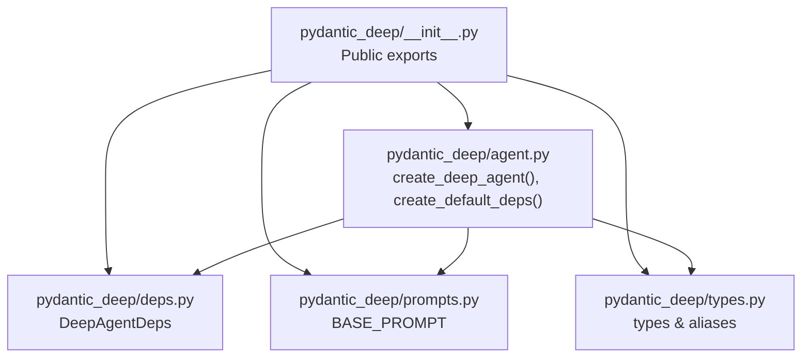
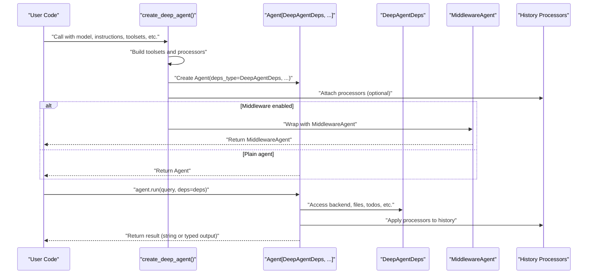
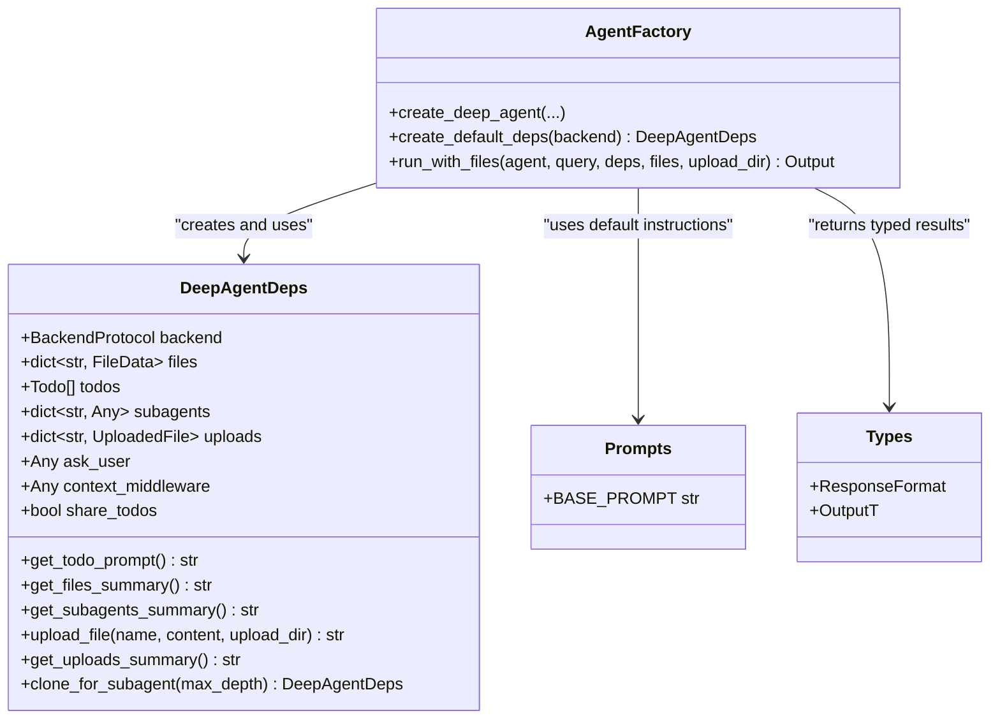

# Core API

<cite>
**Referenced Files in This Document**
- [pydantic_deep/__init__.py](file://pydantic_deep/__init__.py)
- [pydantic_deep/agent.py](file://pydantic_deep/agent.py)
- [pydantic_deep/deps.py](file://pydantic_deep/deps.py)
- [pydantic_deep/prompts.py](file://pydantic_deep/prompts.py)
- [pydantic_deep/types.py](file://pydantic_deep/types.py)
- [examples/basic_usage.py](file://examples/basic_usage.py)
- [docs/examples/basic-usage.md](file://docs/examples/basic-usage.md)
- [docs/concepts/backends.md](file://docs/concepts/backends.md)
- [docs/advanced/structured-output.md](file://docs/advanced/structured-output.md)
</cite>

## Table of Contents
1. [Introduction](#introduction)
2. [Project Structure](#project-structure)
3. [Core Components](#core-components)
4. [Architecture Overview](#architecture-overview)
5. [Detailed Component Analysis](#detailed-component-analysis)
6. [Dependency Analysis](#dependency-analysis)
7. [Performance Considerations](#performance-considerations)
8. [Troubleshooting Guide](#troubleshooting-guide)
9. [Conclusion](#conclusion)
10. [Appendices](#appendices)

## Introduction
This document provides comprehensive API documentation for the core framework interfaces of pydantic-deep. It focuses on the primary agent factory functions, dependency injection system, and configuration options for different backends. It explains how to create agents, configure toolsets, manage state via DeepAgentDeps, and integrate with various backends. It also covers structured output, middleware, and practical usage patterns.

## Project Structure
The core API surface is primarily exposed via the main package module and a few key modules:
- pydantic_deep/__init__.py: Public exports and re-exports from submodules
- pydantic_deep/agent.py: Agent factory functions and dynamic instruction composition
- pydantic_deep/deps.py: Dependency injection container (DeepAgentDeps)
- pydantic_deep/prompts.py: Default system prompts
- pydantic_deep/types.py: Type aliases and shared type definitions

**Diagram sources**
- [pydantic_deep/__init__.py:214-376](file://pydantic_deep/__init__.py#L214-L376)
- [pydantic_deep/agent.py:196-935](file://pydantic_deep/agent.py#L196-L935)
- [pydantic_deep/deps.py:18-207](file://pydantic_deep/deps.py#L18-L207)
- [pydantic_deep/prompts.py:5-66](file://pydantic_deep/prompts.py#L5-L66)
- [pydantic_deep/types.py:1-99](file://pydantic_deep/types.py#L1-L99)

**Section sources**
- [pydantic_deep/__init__.py:1-377](file://pydantic_deep/__init__.py#L1-L377)

## Core Components
- create_deep_agent(): Factory for creating fully configured agents with planning, filesystem, subagents, skills, and optional structured output.
- create_default_deps(): Convenience function to construct a minimal DeepAgentDeps with a default backend.
- DeepAgentDeps: Dependency injection container holding backend, files, todos, subagents, uploads, and contextual helpers.
- BASE_PROMPT: Default system prompt template used when instructions are not provided.
- ResponseFormat: Type alias for structured output specification.

Key responsibilities:
- create_deep_agent(): Assembles toolsets, middleware, history processors, and dynamic system prompts; returns either a plain Agent or a MiddlewareAgent depending on configuration.
- create_default_deps(): Provides a quick way to instantiate DeepAgentDeps with a default StateBackend.
- DeepAgentDeps: Central state holder for agent runtime data and utilities for managing files, todos, and subagents.

**Section sources**
- [pydantic_deep/agent.py:196-935](file://pydantic_deep/agent.py#L196-L935)
- [pydantic_deep/deps.py:18-207](file://pydantic_deep/deps.py#L18-L207)
- [pydantic_deep/prompts.py:5-66](file://pydantic_deep/prompts.py#L5-L66)
- [pydantic_deep/types.py:37-42](file://pydantic_deep/types.py#L37-L42)

## Architecture Overview
The agent creation pipeline composes multiple subsystems:
- Toolsets: Todo, Console (filesystem), SubAgent, Skills, Context, Memory, Checkpoint, Team, Web
- Middleware: ContextManagerMiddleware (token tracking and summarization), CostTrackingMiddleware, HooksMiddleware, and user-provided AgentMiddleware
- History processors: EvictionProcessor, PatchToolCallsProcessor, and optional summarization processors
- Dynamic instructions: Generated at runtime based on current state (uploaded files, todos, toolset instructions, subagents)

**Diagram sources**
- [pydantic_deep/agent.py:196-935](file://pydantic_deep/agent.py#L196-L935)
- [pydantic_deep/deps.py:18-207](file://pydantic_deep/deps.py#L18-L207)

## Detailed Component Analysis

### create_deep_agent()
Primary factory for constructing agents with extensive capabilities.

Parameters (selected highlights):
- model: Model identifier or Model instance (default: openai:gpt-4.1)
- instructions: Custom system prompt (default: BASE_PROMPT)
- output_type: Structured output type (Pydantic model, dataclass, TypedDict); enables typed return
- tools/toolsets: Additional tools and toolsets to register
- subagents: List of SubAgentConfig entries for delegation
- skills/skill_directories: Preloaded skills or directories to discover skills
- backend: BackendProtocol instance (default: StateBackend)
- include_* flags: Control inclusion of Todo, Console, SubAgent, Skills, Plan, Memory, Checkpoints, Teams, Web
- interrupt_on: Map of tool names to approval requirements
- history_processors: Sequence of history processors (e.g., summarization)
- eviction_token_limit: Threshold for tool output eviction
- context_manager/context_manager_max_tokens/on_context_update: Token tracking and auto-compression
- summarization_model: Model for summarization middleware
- context_files/context_discovery: Inject context files into system prompt
- include_memory/memory_dir: Persistent memory toolset
- retries: Max retries for tool calls
- hooks: Lifecycle hooks for tool events
- patch_tool_calls: Fix orphaned tool calls in history
- include_checkpoints/checkpoint_frequency/max_checkpoints/checkpoint_store: Conversation checkpointing
- include_teams: Team management toolset
- include_web/web_search_provider: Web search toolset
- include_history_archive/history_messages_path: Persist full history for later retrieval
- cost_tracking/cost_budget_usd/on_cost_update: Cost tracking middleware
- middleware/permission_handler/middleware_context: Custom middleware stack
- model_settings/instrument: Provider-specific settings and instrumentation
- **agent_kwargs: Additional arguments passed to Agent constructor

Return type:
- Agent[DeepAgentDeps, str] if no output_type specified
- Agent[DeepAgentDeps, OutputDataT] if output_type is provided

Behavior highlights:
- Builds toolsets conditionally based on flags and parameters
- Applies history processors (eviction, patch, summarization)
- Wraps agent with middleware (ContextManagerMiddleware, CostTrackingMiddleware, HooksMiddleware, user middleware) when enabled
- Generates dynamic system prompts from current state (uploaded files, todos, toolset instructions, subagents)
- Supports structured output via output_type and DeferredToolRequests when approvals are required

Usage examples:
- Basic agent with string output and StateBackend
- Structured output with Pydantic model
- Context management with token tracking and summarization
- Composite backend routing for mixed storage

**Section sources**
- [pydantic_deep/agent.py:67-193](file://pydantic_deep/agent.py#L67-L193)
- [pydantic_deep/agent.py:196-935](file://pydantic_deep/agent.py#L196-L935)
- [pydantic_deep/prompts.py:5-66](file://pydantic_deep/prompts.py#L5-L66)
- [docs/examples/basic-usage.md:18-90](file://docs/examples/basic-usage.md#L18-L90)
- [docs/advanced/structured-output.md:9-32](file://docs/advanced/structured-output.md#L9-L32)

### create_default_deps()
Convenience function to create a DeepAgentDeps with a default backend.

Parameters:
- backend: BackendProtocol instance (default: StateBackend)

Returns:
- DeepAgentDeps instance

Typical usage:
- Initialize dependencies quickly for testing or demos
- Provide a backend that persists across runs (e.g., LocalBackend) or remains ephemeral (StateBackend)

**Section sources**
- [pydantic_deep/agent.py:938-950](file://pydantic_deep/agent.py#L938-L950)

### DeepAgentDeps
Dependency injection container for agents and their tools.

Attributes:
- backend: BackendProtocol (file storage)
- files: In-memory file cache (used with StateBackend)
- todos: Task list for planning
- subagents: Pre-configured subagents available for delegation
- uploads: Metadata for uploaded files
- ask_user: Callback for interactive questions
- context_middleware: Reference to ContextManagerMiddleware (if used)
- share_todos: Controls whether subagents share parent’s todo list

Methods:
- get_todo_prompt(): Generate system prompt section for todos
- get_files_summary(): Generate summary of files in memory
- get_subagents_summary(): Generate summary of available subagents
- upload_file(name, content, upload_dir="/uploads"): Upload a file to backend and track metadata
- get_uploads_summary(): Generate summary of uploaded files for system prompt
- clone_for_subagent(max_depth=0): Create a new deps instance for a subagent with controlled sharing

State management:
- __post_init__ synchronizes files with StateBackend if applicable
- Provides shared references for files and uploads across subagents when configured

**Section sources**
- [pydantic_deep/deps.py:18-207](file://pydantic_deep/deps.py#L18-L207)

### Dynamic Instructions and Prompt Composition
The agent’s system prompt is dynamically composed at runtime based on current state:
- Uploaded files summary
- Todo list prompt
- Console toolset system prompt
- Toolset-specific instructions (skills, context, memory)
- Subagent configuration prompts

This ensures the agent always has the most relevant context for its current task.

**Section sources**
- [pydantic_deep/agent.py:836-883](file://pydantic_deep/agent.py#L836-L883)

### Backends and Storage Options
Supported backends (from pydantic-ai-backend):
- LocalBackend: Persistent storage on local filesystem
- StateBackend: In-memory storage (ephemeral)
- DockerSandbox: Isolated execution environment
- CompositeBackend: Route operations by path prefix to different backends

Configuration patterns:
- Single backend: LocalBackend for persistent files, StateBackend for ephemeral scratch space
- CompositeBackend: Route specific paths to different backends (e.g., /project/ to disk, /scratch/ to memory)
- DockerSandbox: Execute code safely with isolated environments

**Section sources**
- [docs/concepts/backends.md:8-120](file://docs/concepts/backends.md#L8-L120)

### Structured Output and Type Safety
Structured output is enabled via the output_type parameter:
- Accepts Pydantic models, dataclasses, or TypedDict
- When output_type is provided, the agent returns typed results
- Works with tools and history processors
- Can be combined with DeferredToolRequests when approvals are required

Best practices:
- Keep models focused and specific
- Use Field descriptions to guide the LLM
- Provide examples in instructions
- Handle validation errors gracefully

**Section sources**
- [docs/advanced/structured-output.md:9-32](file://docs/advanced/structured-output.md#L9-L32)
- [pydantic_deep/agent.py:434-436](file://pydantic_deep/agent.py#L434-L436)

### Middleware and Cost Tracking
- ContextManagerMiddleware: Token tracking, auto-compression, and persistence of full conversation history
- CostTrackingMiddleware: Tracks token usage and USD costs; supports budget limits
- HooksMiddleware: Executes lifecycle hooks for tool events (requires pydantic-ai-middleware)
- User middleware: Custom AgentMiddleware instances can be provided

Integration:
- MiddlewareAgent wraps the agent when middleware is enabled
- Cost tracking can be toggled and configured with budget limits and callbacks

**Section sources**
- [pydantic_deep/agent.py:797-931](file://pydantic_deep/agent.py#L797-L931)

### Toolsets and Capabilities
- TodoToolset: Task planning and tracking
- ConsoleToolset: Filesystem operations (read, write, edit, execute, grep, glob)
- SubAgentToolset: Task delegation to specialized subagents
- SkillsToolset: Modular skills loaded from directories or preloaded
- ContextToolset: Inject context files into system prompt
- AgentMemoryToolset: Persistent memory for agents and subagents
- CheckpointToolset: Save, list, and rewind checkpoints
- TeamToolset: Team management and collaboration
- WebToolset: Web search and HTTP operations (optional)

**Section sources**
- [pydantic_deep/agent.py:506-717](file://pydantic_deep/agent.py#L506-L717)

### run_with_files()
Convenience function to upload files and run an agent in one step.

Parameters:
- agent: Agent instance
- query: User prompt
- deps: DeepAgentDeps instance
- files: List of (filename, content) tuples to upload
- upload_dir: Directory to store uploads (default: "/uploads")

Returns:
- Agent output (type depends on agent’s output_type)

**Section sources**
- [pydantic_deep/agent.py:953-1000](file://pydantic_deep/agent.py#L953-L1000)

## Dependency Analysis
High-level dependencies among core components:

**Diagram sources**
- [pydantic_deep/deps.py:18-207](file://pydantic_deep/deps.py#L18-L207)
- [pydantic_deep/agent.py:196-950](file://pydantic_deep/agent.py#L196-L950)
- [pydantic_deep/prompts.py:5-66](file://pydantic_deep/prompts.py#L5-L66)
- [pydantic_deep/types.py:37-42](file://pydantic_deep/types.py#L37-L42)

**Section sources**
- [pydantic_deep/__init__.py:105-106](file://pydantic_deep/__init__.py#L105-L106)
- [pydantic_deep/agent.py:196-950](file://pydantic_deep/agent.py#L196-L950)

## Performance Considerations
- History processors: EvictionProcessor reduces tool output size; ContextManagerMiddleware compresses context when nearing token limits
- Retry configuration: Adjust retries to balance robustness and latency
- Middleware overhead: Enable only what is needed (e.g., disable cost tracking in constrained environments)
- Toolset selection: Include only required toolsets to reduce prompt size and tool availability
- Structured output: Validation occurs post-generation; consider simpler models for faster iteration

[No sources needed since this section provides general guidance]

## Troubleshooting Guide
Common issues and resolutions:
- Missing API keys: Ensure environment variables for selected providers are set
- Backend routing confusion: Verify CompositeBackend routes and path prefixes
- Cost budget exceeded: Configure cost_budget_usd or disable cost tracking middleware
- Structured output validation errors: Simplify model or provide clearer instructions
- Tool permissions: Use interrupt_on and permission_handler to control approvals

**Section sources**
- [docs/concepts/backends.md:64-120](file://docs/concepts/backends.md#L64-L120)
- [docs/advanced/structured-output.md:212-213](file://docs/advanced/structured-output.md#L212-L213)

## Conclusion
The core API centers around create_deep_agent() and DeepAgentDeps, enabling flexible, configurable agents with planning, filesystem operations, subagent delegation, skills, and structured output. By composing toolsets, middleware, and history processors, developers can tailor agents to diverse use cases while maintaining strong defaults and type safety.

[No sources needed since this section summarizes without analyzing specific files]

## Appendices

### API Definitions and Examples

- create_deep_agent()
  - Parameters: model, instructions, output_type, tools, toolsets, subagents, skills, skill_directories, backend, include flags, interrupt_on, history_processors, eviction_token_limit, context_manager, summarization_model, context_files, context_discovery, include_memory, memory_dir, retries, hooks, patch_tool_calls, include_checkpoints, checkpoint_frequency, max_checkpoints, checkpoint_store, include_teams, include_web, web_search_provider, include_history_archive, history_messages_path, cost_tracking, cost_budget_usd, on_cost_update, middleware, permission_handler, middleware_context, plans_dir, model_settings, instrument, **agent_kwargs
  - Returns: Agent[DeepAgentDeps, str] or Agent[DeepAgentDeps, OutputDataT]
  - Example: [examples/basic_usage.py:14-53](file://examples/basic_usage.py#L14-L53), [docs/examples/basic-usage.md:27-90](file://docs/examples/basic-usage.md#L27-L90)

- create_default_deps()
  - Parameters: backend
  - Returns: DeepAgentDeps
  - Example: [docs/advanced/structured-output.md:22-26](file://docs/advanced/structured-output.md#L22-L26)

- DeepAgentDeps
  - Attributes: backend, files, todos, subagents, uploads, ask_user, context_middleware, share_todos
  - Methods: get_todo_prompt(), get_files_summary(), get_subagents_summary(), upload_file(), get_uploads_summary(), clone_for_subagent()
  - Example: [examples/basic_usage.py:27-48](file://examples/basic_usage.py#L27-L48)

- run_with_files()
  - Parameters: agent, query, deps, files, upload_dir
  - Returns: Output (typed if output_type is set)
  - Example: [pydantic_deep/agent.py:953-1000](file://pydantic_deep/agent.py#L953-L1000)

**Section sources**
- [pydantic_deep/agent.py:67-193](file://pydantic_deep/agent.py#L67-L193)
- [pydantic_deep/agent.py:196-950](file://pydantic_deep/agent.py#L196-L950)
- [pydantic_deep/deps.py:18-207](file://pydantic_deep/deps.py#L18-L207)
- [examples/basic_usage.py:14-53](file://examples/basic_usage.py#L14-L53)
- [docs/examples/basic-usage.md:27-90](file://docs/examples/basic-usage.md#L27-L90)
- [docs/advanced/structured-output.md:22-26](file://docs/advanced/structured-output.md#L22-L26)