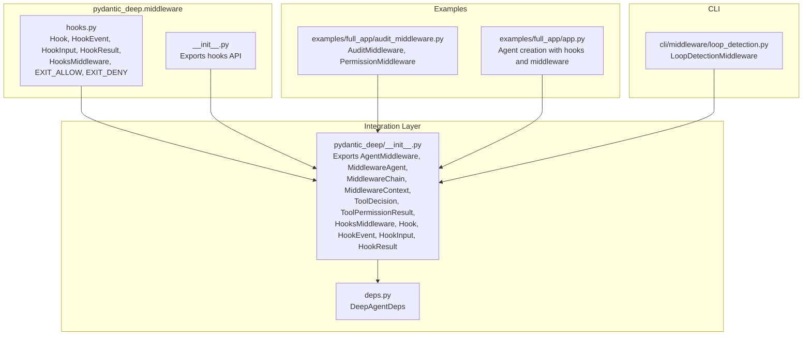
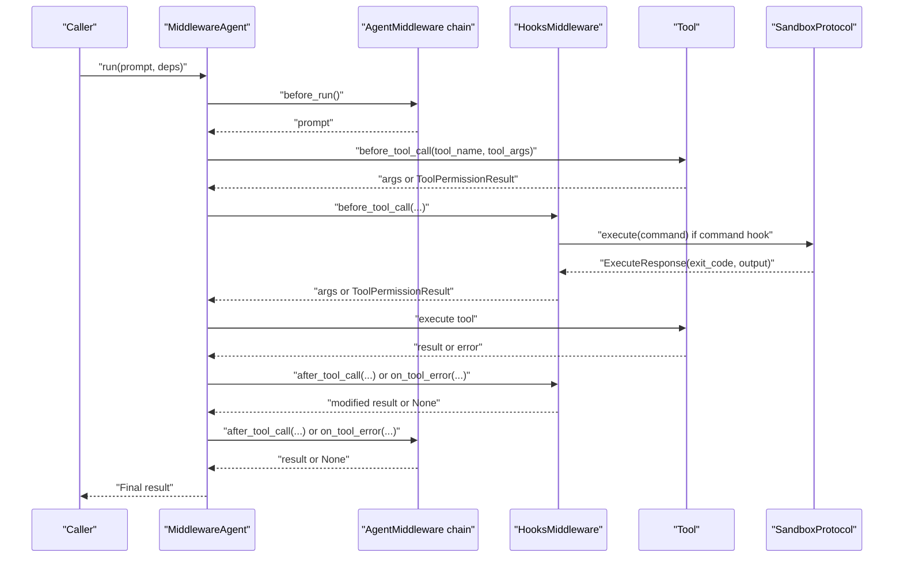
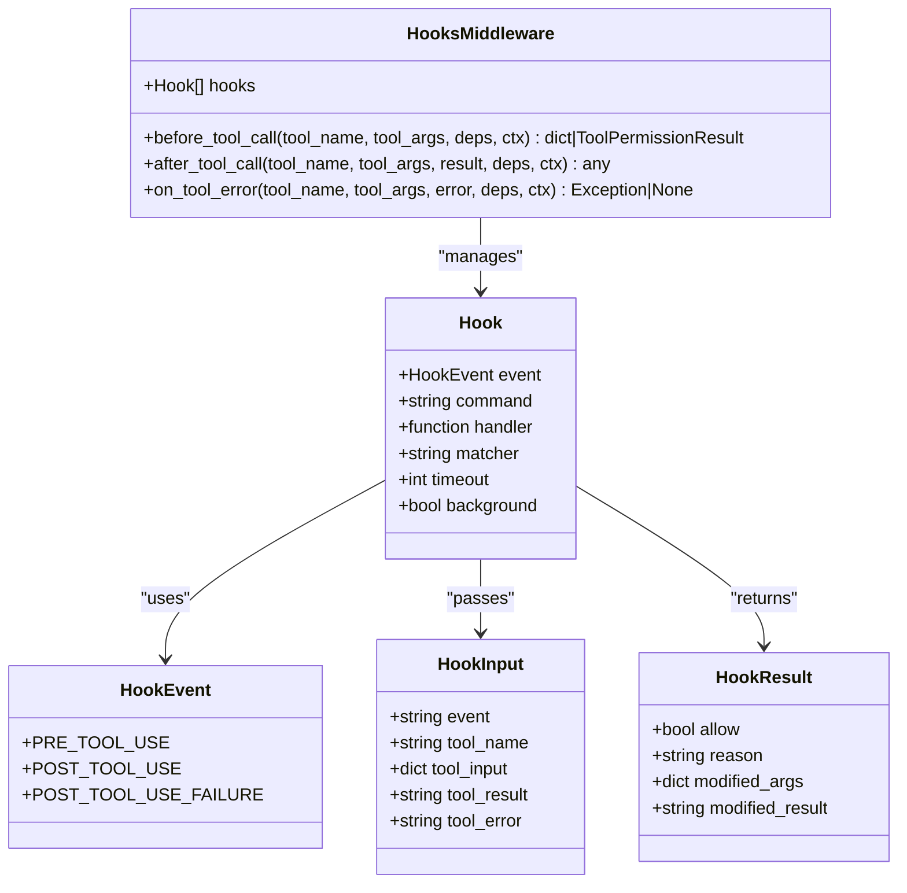
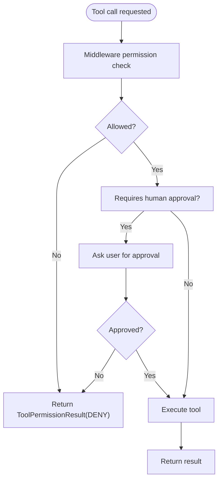
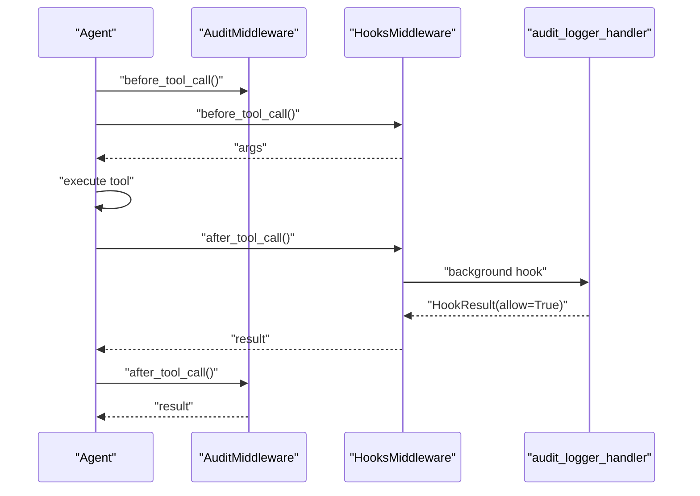
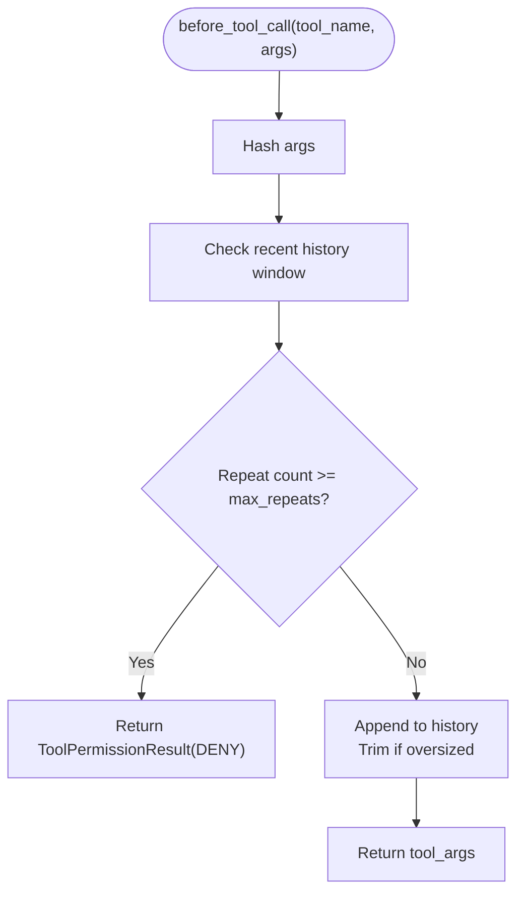
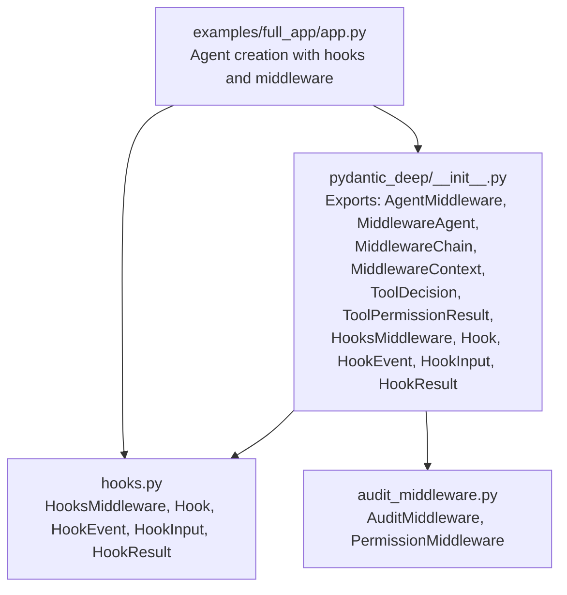

# Middleware APIs

<cite>
**Referenced Files in This Document**
- [hooks.py](file://pydantic_deep/middleware/hooks.py)
- [__init__.py](file://pydantic_deep/middleware/__init__.py)
- [__init__.py](file://pydantic_deep/__init__.py)
- [deps.py](file://pydantic_deep/deps.py)
- [middleware.md](file://docs/advanced/middleware.md)
- [hooks.md](file://docs/advanced/hooks.md)
- [audit_middleware.py](file://examples/full_app/audit_middleware.py)
- [app.py](file://examples/full_app/app.py)
- [loop_detection.py](file://cli/middleware/loop_detection.py)
- [test_middleware_integration.py](file://tests/test_middleware_integration.py)
- [test_hooks.py](file://tests/test_hooks.py)
</cite>

## Table of Contents
1. [Introduction](#introduction)
2. [Project Structure](#project-structure)
3. [Core Components](#core-components)
4. [Architecture Overview](#architecture-overview)
5. [Detailed Component Analysis](#detailed-component-analysis)
6. [Dependency Analysis](#dependency-analysis)
7. [Performance Considerations](#performance-considerations)
8. [Troubleshooting Guide](#troubleshooting-guide)
9. [Conclusion](#conclusion)

## Introduction
This document provides comprehensive API documentation for the middleware system and security hooks in the project. It covers:
- Hook interfaces and lifecycle events
- Permission management APIs and approval workflows
- Audit logging systems
- Middleware lifecycle, execution order, and error handling
- Integration patterns with external security systems and sandbox backends

The documentation is designed for both technical and non-technical readers, with diagrams and practical examples mapped to actual source files.

## Project Structure
The middleware and hooks system spans several modules:
- Core hook definitions and middleware live under pydantic_deep/middleware
- Integration with pydantic-ai-middleware enables lifecycle hooks, permissions, and cross-cutting concerns
- Examples demonstrate audit logging, permission enforcement, and human-in-the-loop approval workflows
- CLI middleware provides loop detection to prevent infinite retries

**Diagram sources**
- [hooks.py:1-373](file://pydantic_deep/middleware/hooks.py#L1-L373)
- [__init__.py:1-22](file://pydantic_deep/middleware/__init__.py#L1-L22)
- [__init__.py:105-115](file://pydantic_deep/__init__.py#L105-L115)
- [deps.py:1-207](file://pydantic_deep/deps.py#L1-L207)
- [audit_middleware.py:1-140](file://examples/full_app/audit_middleware.py#L1-L140)
- [app.py:579-654](file://examples/full_app/app.py#L579-L654)
- [loop_detection.py:1-71](file://cli/middleware/loop_detection.py#L1-L71)

**Section sources**
- [hooks.py:1-373](file://pydantic_deep/middleware/hooks.py#L1-L373)
- [__init__.py:1-22](file://pydantic_deep/middleware/__init__.py#L1-L22)
- [__init__.py:105-115](file://pydantic_deep/__init__.py#L105-L115)
- [deps.py:1-207](file://pydantic_deep/deps.py#L1-L207)
- [audit_middleware.py:1-140](file://examples/full_app/audit_middleware.py#L1-L140)
- [app.py:579-654](file://examples/full_app/app.py#L579-L654)
- [loop_detection.py:1-71](file://cli/middleware/loop_detection.py#L1-L71)

## Core Components
This section documents the primary APIs for middleware and hooks.

- Hook lifecycle and execution
  - PRE_TOOL_USE: can deny or modify arguments
  - POST_TOOL_USE: can modify results
  - POST_TOOL_USE_FAILURE: observe failures
- Hook types
  - Command hooks: executed via SandboxProtocol.execute() with exit code conventions
  - Handler hooks: async Python functions receiving HookInput and returning HookResult
- Permission management
  - ToolPermissionResult with ToolDecision.DENY for blocking
  - Middleware-based permission checks and human-in-the-loop approvals
- Audit logging
  - Background hooks for non-blocking auditing
  - Middleware for usage statistics and sensitive path blocking

Key exports and types:
- Hook, HookEvent, HookInput, HookResult, HooksMiddleware
- AgentMiddleware, MiddlewareAgent, MiddlewareChain, MiddlewareContext
- ToolDecision, ToolPermissionResult
- EXIT_ALLOW, EXIT_DENY

**Section sources**
- [hooks.py:48-116](file://pydantic_deep/middleware/hooks.py#L48-L116)
- [hooks.py:173-224](file://pydantic_deep/middleware/hooks.py#L173-L224)
- [__init__.py:71-94](file://pydantic_deep/__init__.py#L71-L94)
- [__init__.py:105-115](file://pydantic_deep/__init__.py#L105-L115)
- [hooks.md:21-28](file://docs/advanced/hooks.md#L21-L28)

## Architecture Overview
The middleware system integrates with pydantic-ai-middleware to wrap the base Agent in a MiddlewareAgent. HooksMiddleware and custom AgentMiddleware instances intercept lifecycle events to enforce policies, audit actions, and manage approvals.

**Diagram sources**
- [hooks.py:243-362](file://pydantic_deep/middleware/hooks.py#L243-L362)
- [__init__.py:71-94](file://pydantic_deep/__init__.py#L71-L94)
- [app.py:614-654](file://examples/full_app/app.py#L614-L654)

**Section sources**
- [middleware.md:91-107](file://docs/advanced/middleware.md#L91-L107)
- [hooks.py:243-362](file://pydantic_deep/middleware/hooks.py#L243-L362)
- [app.py:614-654](file://examples/full_app/app.py#L614-L654)

## Detailed Component Analysis

### HooksMiddleware and Hook System
HooksMiddleware implements the AgentMiddleware interface to run lifecycle hooks. It supports:
- Matching hooks by event and tool_name regex
- Command hooks via SandboxProtocol.execute() with exit code conventions
- Handler hooks as async Python functions
- Background hooks for non-blocking operations
- Argument modification on PRE_TOOL_USE and result modification on POST_TOOL_USE

**Diagram sources**
- [hooks.py:48-116](file://pydantic_deep/middleware/hooks.py#L48-L116)
- [hooks.py:118-224](file://pydantic_deep/middleware/hooks.py#L118-L224)
- [hooks.py:243-362](file://pydantic_deep/middleware/hooks.py#L243-L362)

**Section sources**
- [hooks.py:118-224](file://pydantic_deep/middleware/hooks.py#L118-L224)
- [hooks.py:243-362](file://pydantic_deep/middleware/hooks.py#L243-L362)
- [hooks.md:144-156](file://docs/advanced/hooks.md#L144-L156)

### Permission Management and Approval Workflows
Two complementary mechanisms enforce permissions:
- Middleware-based checks (e.g., PermissionMiddleware) that return ToolPermissionResult(DENY) for sensitive operations
- Human-in-the-loop approvals for tools requiring explicit consent

**Diagram sources**
- [audit_middleware.py:104-139](file://examples/full_app/audit_middleware.py#L104-L139)
- [app.py:649-654](file://examples/full_app/app.py#L649-L654)

**Section sources**
- [audit_middleware.py:104-139](file://examples/full_app/audit_middleware.py#L104-L139)
- [app.py:649-654](file://examples/full_app/app.py#L649-L654)
- [middleware.md:40-56](file://docs/advanced/middleware.md#L40-L56)

### Audit Logging Systems
AuditMiddleware and background hooks provide non-intrusive logging:
- AuditMiddleware tracks tool usage statistics and durations
- Background hooks (e.g., audit_logger_handler) log tool calls without blocking execution

**Diagram sources**
- [audit_middleware.py:34-84](file://examples/full_app/audit_middleware.py#L34-L84)
- [app.py:313-322](file://examples/full_app/app.py#L313-L322)
- [app.py:355-370](file://examples/full_app/app.py#L355-L370)

**Section sources**
- [audit_middleware.py:34-84](file://examples/full_app/audit_middleware.py#L34-L84)
- [app.py:313-322](file://examples/full_app/app.py#L313-L322)
- [app.py:355-370](file://examples/full_app/app.py#L355-L370)

### Loop Detection Middleware (CLI)
LoopDetectionMiddleware prevents infinite retries by detecting repeated identical tool calls within a rolling window.

**Diagram sources**
- [loop_detection.py:23-68](file://cli/middleware/loop_detection.py#L23-L68)

**Section sources**
- [loop_detection.py:14-21](file://cli/middleware/loop_detection.py#L14-L21)
- [loop_detection.py:23-68](file://cli/middleware/loop_detection.py#L23-L68)

## Dependency Analysis
The middleware system relies on pydantic-ai-middleware for lifecycle hooks and permission handling. The integration ensures:
- AgentMiddleware instances are chained and ordered
- HooksMiddleware participates alongside custom middleware
- SandboxProtocol is required for command hooks

**Diagram sources**
- [__init__.py:71-94](file://pydantic_deep/__init__.py#L71-L94)
- [__init__.py:105-115](file://pydantic_deep/__init__.py#L105-L115)
- [hooks.py:243-362](file://pydantic_deep/middleware/hooks.py#L243-L362)
- [audit_middleware.py:34-139](file://examples/full_app/audit_middleware.py#L34-L139)
- [app.py:614-654](file://examples/full_app/app.py#L614-L654)

**Section sources**
- [__init__.py:71-94](file://pydantic_deep/__init__.py#L71-L94)
- [__init__.py:105-115](file://pydantic_deep/__init__.py#L105-L115)
- [hooks.py:243-362](file://pydantic_deep/middleware/hooks.py#L243-L362)
- [audit_middleware.py:34-139](file://examples/full_app/audit_middleware.py#L34-L139)
- [app.py:614-654](file://examples/full_app/app.py#L614-L654)

## Performance Considerations
- Background hooks avoid blocking tool execution, improving responsiveness
- Argument/result modifications are applied incrementally; minimize expensive operations in hooks
- Use matchers to limit hook scope and reduce overhead
- Prefer handler hooks for Python-only logic; reserve command hooks for external security tools that require sandbox isolation

[No sources needed since this section provides general guidance]

## Troubleshooting Guide
Common issues and resolutions:
- Command hooks failing due to missing SandboxProtocol backend
  - Ensure the agent uses a backend supporting execute() (e.g., DockerSandbox)
- Hook execution order and denials
  - PRE_TOOL_USE: first deny wins; argument modifications accumulate
  - POST_TOOL_USE: all matching hooks run; result modifications propagate
- Permission denials
  - Middleware returning ToolPermissionResult(DENY) blocks tool execution
  - Human-in-the-loop approvals must be explicitly handled by the caller
- Loop detection false positives
  - Adjust max_repeats and window_size to fit your workload patterns

**Section sources**
- [hooks.md:144-156](file://docs/advanced/hooks.md#L144-L156)
- [audit_middleware.py:104-139](file://examples/full_app/audit_middleware.py#L104-L139)
- [loop_detection.py:23-68](file://cli/middleware/loop_detection.py#L23-L68)
- [test_hooks.py:516-633](file://tests/test_hooks.py#L516-L633)
- [test_middleware_integration.py:41-54](file://tests/test_middleware_integration.py#L41-L54)

## Conclusion
The middleware and hooks system provides a robust, extensible framework for enforcing security policies, auditing actions, managing approvals, and integrating with external systems. By leveraging AgentMiddleware, HooksMiddleware, and sandbox-backed command hooks, applications can achieve strong safety guarantees while maintaining flexibility and performance.