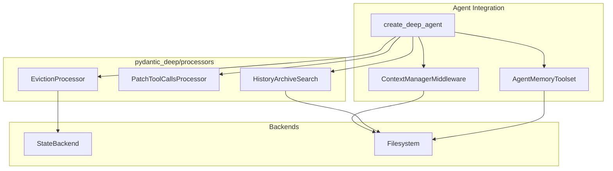
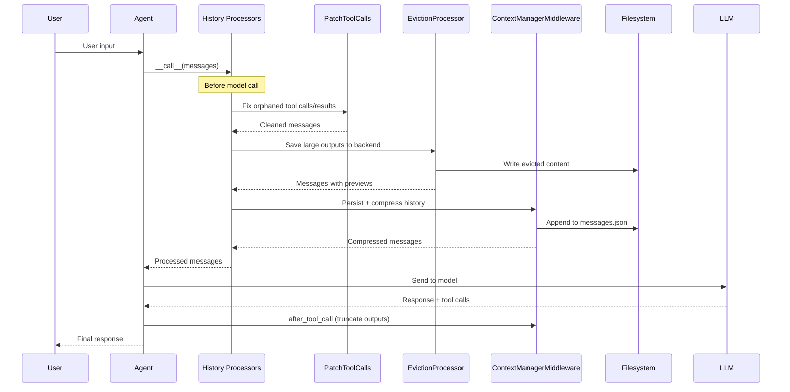
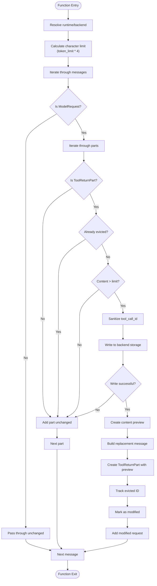
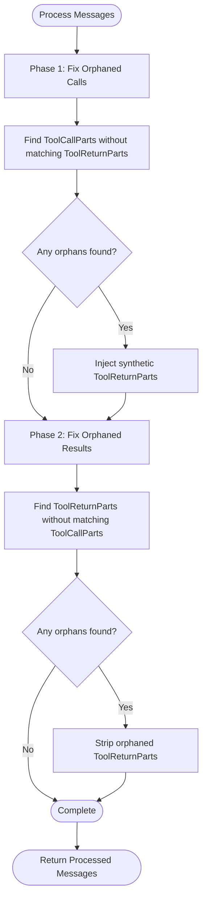
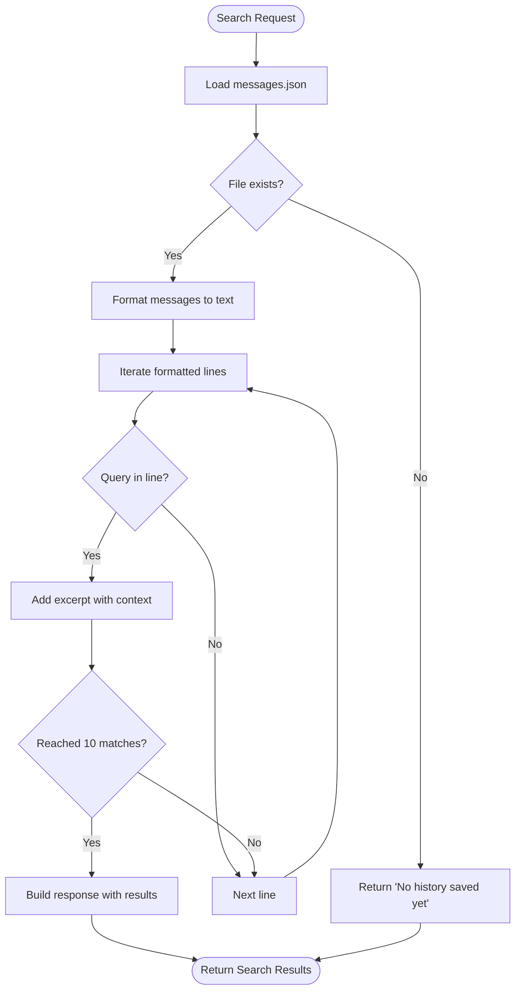
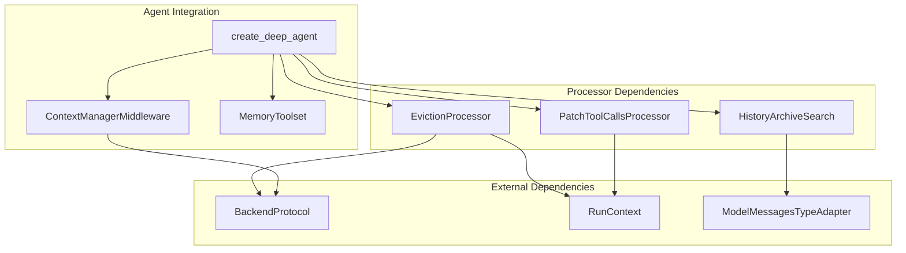

# Processor APIs

<cite>
**Referenced Files in This Document**
- [processors/__init__.py](file://pydantic_deep/processors/__init__.py)
- [processors/eviction.py](file://pydantic_deep/processors/eviction.py)
- [processors/history_archive.py](file://pydantic_deep/processors/history_archive.py)
- [processors/patch.py](file://pydantic_deep/processors/patch.py)
- [agent.py](file://pydantic_deep/agent.py)
- [memory.py](file://pydantic_deep/toolsets/memory.py)
- [processors.md](file://docs/advanced/processors.md)
- [processors_api.md](file://docs/api/processors.md)
- [memory_and_context_architecture.md](file://docs/architecture/memory-and-context.md)
- [test_eviction.py](file://tests/test_eviction.py)
- [test_history_archive.py](file://tests/test_history_archive.py)
- [test_patch_tool_calls.py](file://tests/test_patch_tool_calls.py)
</cite>

## Table of Contents
1. [Introduction](#introduction)
2. [Project Structure](#project-structure)
3. [Core Components](#core-components)
4. [Architecture Overview](#architecture-overview)
5. [Detailed Component Analysis](#detailed-component-analysis)
6. [Dependency Analysis](#dependency-analysis)
7. [Performance Considerations](#performance-considerations)
8. [Troubleshooting Guide](#troubleshooting-guide)
9. [Conclusion](#conclusion)

## Introduction
This document provides comprehensive API documentation for the processor system used for history management and context optimization in pydantic-deep. It covers eviction policies for large tool outputs, history archiving mechanisms, patch processing APIs for fixing orphaned tool calls, and context compression tools. The guide includes processor configuration examples, custom processor implementation patterns, and integration with the agent's memory system for efficient context management.

## Project Structure
The processor system is organized under the pydantic_deep/processors package and integrates with the agent factory and middleware ecosystem. Key components include:
- EvictionProcessor: Saves large tool outputs to backend storage and replaces them with previews
- PatchToolCallsProcessor: Fixes orphaned tool calls and results in message history
- HistoryArchiveSearch: Provides a read-only tool to search through archived conversation history
- Integration points: Agent factory, ContextManagerMiddleware, and memory toolset

**Diagram sources**
- [processors/__init__.py:1-28](file://pydantic_deep/processors/__init__.py#L1-L28)
- [agent.py:750-795](file://pydantic_deep/agent.py#L750-L795)
- [processors/eviction.py:110-271](file://pydantic_deep/processors/eviction.py#L110-L271)
- [processors/patch.py:118-202](file://pydantic_deep/processors/patch.py#L118-L202)
- [processors/history_archive.py:134-188](file://pydantic_deep/processors/history_archive.py#L134-L188)

**Section sources**
- [processors/__init__.py:1-28](file://pydantic_deep/processors/__init__.py#L1-L28)
- [agent.py:750-795](file://pydantic_deep/agent.py#L750-L795)

## Core Components
This section documents the primary processor APIs and their capabilities.

### EvictionProcessor
The EvictionProcessor scans message histories for large tool outputs and saves them to backend storage while replacing them with previews and file references. It prevents context pollution by intercepting ToolReturnPart content before model requests.

Key features:
- Token-based eviction threshold (default ~20K tokens)
- Configurable preview head/tail line counts
- Automatic filename sanitization for tool call IDs
- Runtime backend resolution (prefers ctx.deps.backend)
- Idempotent operation (prevents re-eviction of the same tool call)

Configuration parameters:
- backend: BackendProtocol for file storage
- token_limit: Maximum tokens before eviction (default: 20,000)
- eviction_path: Directory path for evicted files (default: "/large_tool_results")
- head_lines: Lines from start to include in preview (default: 5)
- tail_lines: Lines from end to include in preview (default: 5)

Processing behavior:
1. Iterates through ModelRequest messages
2. Identifies ToolReturnPart content exceeding threshold
3. Writes content to backend storage with sanitized filenames
4. Replaces content with preview + file reference message
5. Preserves metadata and timestamps

**Section sources**
- [processors/eviction.py:110-315](file://pydantic_deep/processors/eviction.py#L110-L315)
- [processors/__init__.py:3-11](file://pydantic_deep/processors/__init__.py#L3-L11)

### PatchToolCallsProcessor
The PatchToolCallsProcessor fixes orphaned tool calls and results in message histories. It handles two scenarios:
1. ModelResponse with ToolCallParts not followed by matching ToolReturnParts → injects synthetic ToolReturnParts with "Tool call was cancelled."
2. ModelRequest with ToolReturnParts not preceded by matching ToolCallParts → removes orphaned ToolReturnParts

Processing phases:
Phase 1: Fix orphaned tool calls (missing results)
- Scans ModelResponse messages for unmatched ToolCallParts
- Injects synthetic ToolReturnParts into next ModelRequest or creates new request

Phase 2: Fix orphaned tool results (missing calls)
- Identifies ToolReturnParts without corresponding ToolCallParts
- Removes orphaned parts while preserving valid content

**Section sources**
- [processors/patch.py:118-202](file://pydantic_deep/processors/patch.py#L118-L202)
- [processors/__init__.py:12-15](file://pydantic_deep/processors/__init__.py#L12-L15)

### HistoryArchiveSearch
The HistoryArchiveSearch provides a read-only tool to search through the persistent messages.json file maintained by ContextManagerMiddleware. It enables retrieval of details from before context compression.

Key capabilities:
- Case-insensitive keyword search across all message parts
- Returns up to 10 matching excerpts with 5 lines of context
- Formats messages as readable text (User/Assistant/Tool labels)
- Reads from the same messages.json file written by middleware

**Section sources**
- [processors/history_archive.py:134-188](file://pydantic_deep/processors/history_archive.py#L134-L188)

## Architecture Overview
The processor system integrates with the agent factory and middleware to provide efficient context management. The processing order ensures clean message structure, prevents context bloat, and maintains persistent history.

**Diagram sources**
- [memory_and_context_architecture.md:67-119](file://docs/architecture/memory-and-context.md#L67-L119)
- [agent.py:750-795](file://pydantic_deep/agent.py#L750-L795)

## Detailed Component Analysis

### EvictionProcessor Implementation
The EvictionProcessor implements a robust pipeline for handling large tool outputs:

**Diagram sources**
- [processors/eviction.py:184-271](file://pydantic_deep/processors/eviction.py#L184-L271)

Key implementation details:
- Runtime backend resolution prioritizes ctx.deps.backend for consistency
- Filename sanitization replaces special characters with underscores
- Preview generation shows head and tail lines with truncation markers
- Metadata preservation ensures ToolReturnPart retains tool_name, metadata, and timestamps

**Section sources**
- [processors/eviction.py:166-271](file://pydantic_deep/processors/eviction.py#L166-L271)

### PatchToolCallsProcessor Logic
The processor handles both orphaned calls and results through distinct phases:

**Diagram sources**
- [processors/patch.py:141-202](file://pydantic_deep/processors/patch.py#L141-L202)

Processing specifics:
- Orphaned calls detection scans ModelResponse messages for unmatched ToolCallParts
- Synthetic ToolReturnParts use "Tool call was cancelled." as content
- Orphaned results removal filters ModelRequest messages containing ToolReturnParts without corresponding ToolCallParts
- Deterministic ordering ensures consistent processing across iterations

**Section sources**
- [processors/patch.py:36-202](file://pydantic_deep/processors/patch.py#L36-L202)

### History Archive Search Implementation
The search tool provides comprehensive keyword search across archived conversation history:

**Diagram sources**
- [processors/history_archive.py:152-187](file://pydantic_deep/processors/history_archive.py#L152-L187)

Search capabilities:
- Case-insensitive substring matching across all message parts
- Context lines (5 lines before/after) for each match
- Up to 10 matching excerpts returned
- Automatic truncation of long content in formatted output

**Section sources**
- [processors/history_archive.py:115-187](file://pydantic_deep/processors/history_archive.py#L115-L187)

## Dependency Analysis
The processor system integrates with multiple components through well-defined interfaces:

**Diagram sources**
- [agent.py:750-795](file://pydantic_deep/agent.py#L750-L795)
- [processors/eviction.py:21-23](file://pydantic_deep/processors/eviction.py#L21-L23)
- [processors/history_archive.py:26-38](file://pydantic_deep/processors/history_archive.py#L26-L38)

Integration patterns:
- BackendProtocol abstraction enables StateBackend, Docker sandbox, or local filesystem usage
- RunContext provides runtime access to deps.backend and model instances
- ModelMessagesTypeAdapter ensures consistent message serialization/deserialization
- Processor chaining through history_processors parameter

**Section sources**
- [agent.py:750-795](file://pydantic_deep/agent.py#L750-L795)
- [processors/eviction.py:21-23](file://pydantic_deep/processors/eviction.py#L21-L23)

## Performance Considerations
The processor system is designed for efficiency and scalability:

### Memory Management
- EvictionProcessor uses streaming writes to backend storage, avoiding memory bloat
- Preview generation processes content in chunks (head/tail lines)
- Idempotent operation prevents redundant processing of already-evicted content

### Processing Order Benefits
- PatchToolCallsProcessor runs first to ensure clean message structure
- EvictionProcessor runs before ContextManagerMiddleware to prevent premature compression
- ContextManagerMiddleware optimizes token counting after eviction

### Storage Efficiency
- Sanitized filenames prevent filesystem conflicts
- Preview content minimizes storage overhead while preserving context
- messages.json provides continuous persistence without separate checkpoint files

## Troubleshooting Guide
Common issues and solutions when working with processor APIs:

### EvictionProcessor Issues
**Problem**: Large tool outputs not being evicted
- Verify token_limit setting is appropriate for your content
- Check backend write permissions and available storage
- Ensure tool_call_id is properly sanitized

**Problem**: Evicted content not accessible via read_file
- Verify eviction_path configuration matches read_file parameters
- Check backend connectivity and file existence
- Confirm tool_call_id matches sanitized filename

**Problem**: Performance degradation with large histories
- Adjust head_lines and tail_lines to balance preview usefulness vs. processing time
- Consider increasing token_limit for less aggressive eviction

### PatchToolCallsProcessor Issues
**Problem**: Tool call mismatches not detected
- Verify tool_call_id consistency across related messages
- Check for timing issues in message ordering
- Ensure both ToolCallPart and ToolReturnPart use identical tool_call_id

**Problem**: Synthetic parts not appearing as expected
- Confirm processor is inserted at position 0 in history_processors
- Verify ModelResponse contains ToolCallParts before ModelRequest with ToolReturnParts

### History Archive Search Issues
**Problem**: Search returns no results despite existing history
- Verify messages.json path is correct and accessible
- Check file permissions and encoding
- Ensure search query matches expected case sensitivity

**Problem**: Slow search performance
- Consider indexing strategies for very large histories
- Limit search scope to recent sessions when appropriate
- Monitor file system performance for large messages.json files

**Section sources**
- [test_eviction.py:224-604](file://tests/test_eviction.py#L224-L604)
- [test_patch_tool_calls.py:24-322](file://tests/test_patch_tool_calls.py#L24-L322)
- [test_history_archive.py:365-608](file://tests/test_history_archive.py#L365-L608)

## Conclusion
The processor system in pydantic-deep provides a comprehensive solution for history management and context optimization. Through EvictionProcessor, PatchToolCallsProcessor, and HistoryArchiveSearch, it addresses key challenges in maintaining efficient conversation context while preserving important historical information. The architecture emphasizes backend abstraction, runtime flexibility, and seamless integration with the agent factory and middleware ecosystem. Proper configuration and understanding of processing order ensure optimal performance and reliability for diverse use cases.