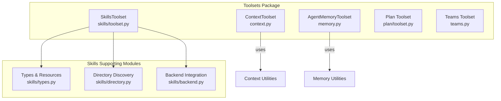
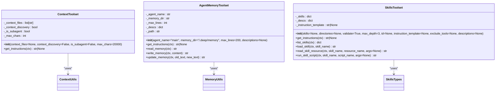
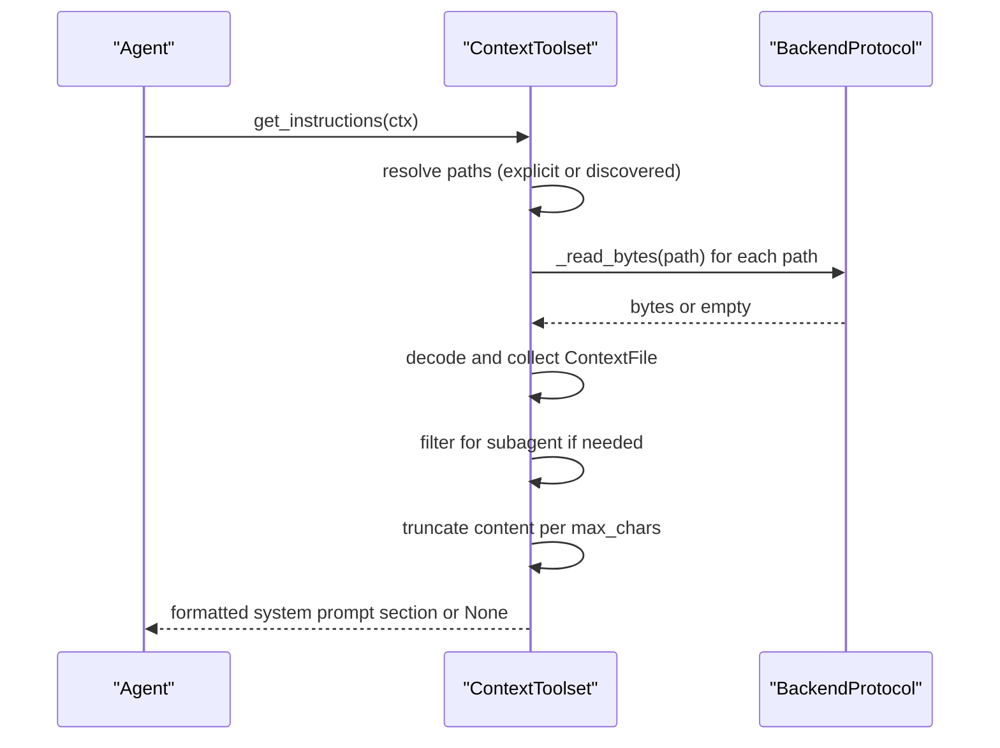
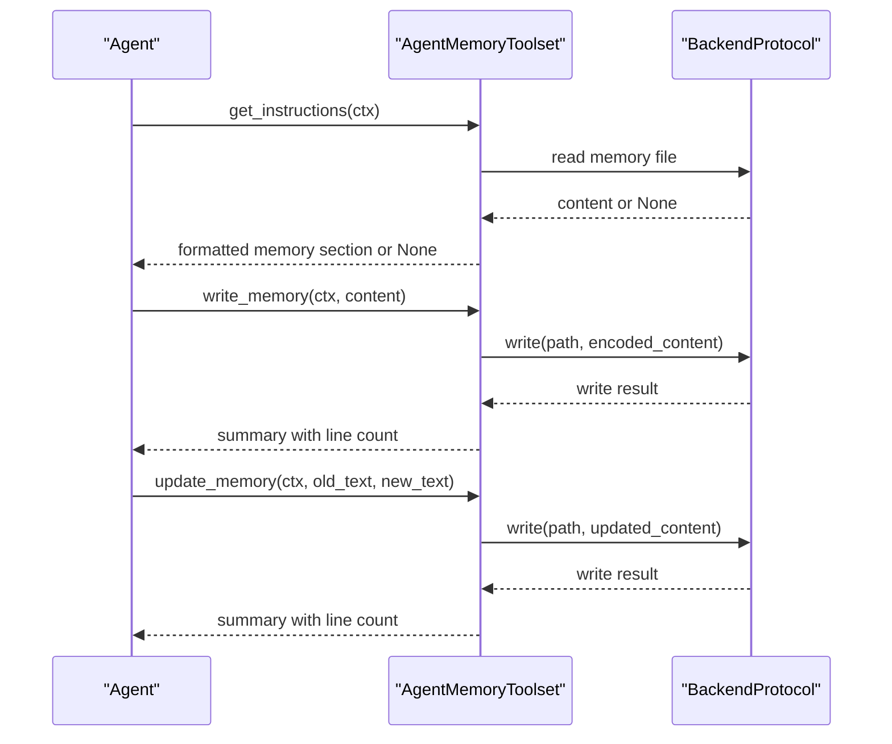
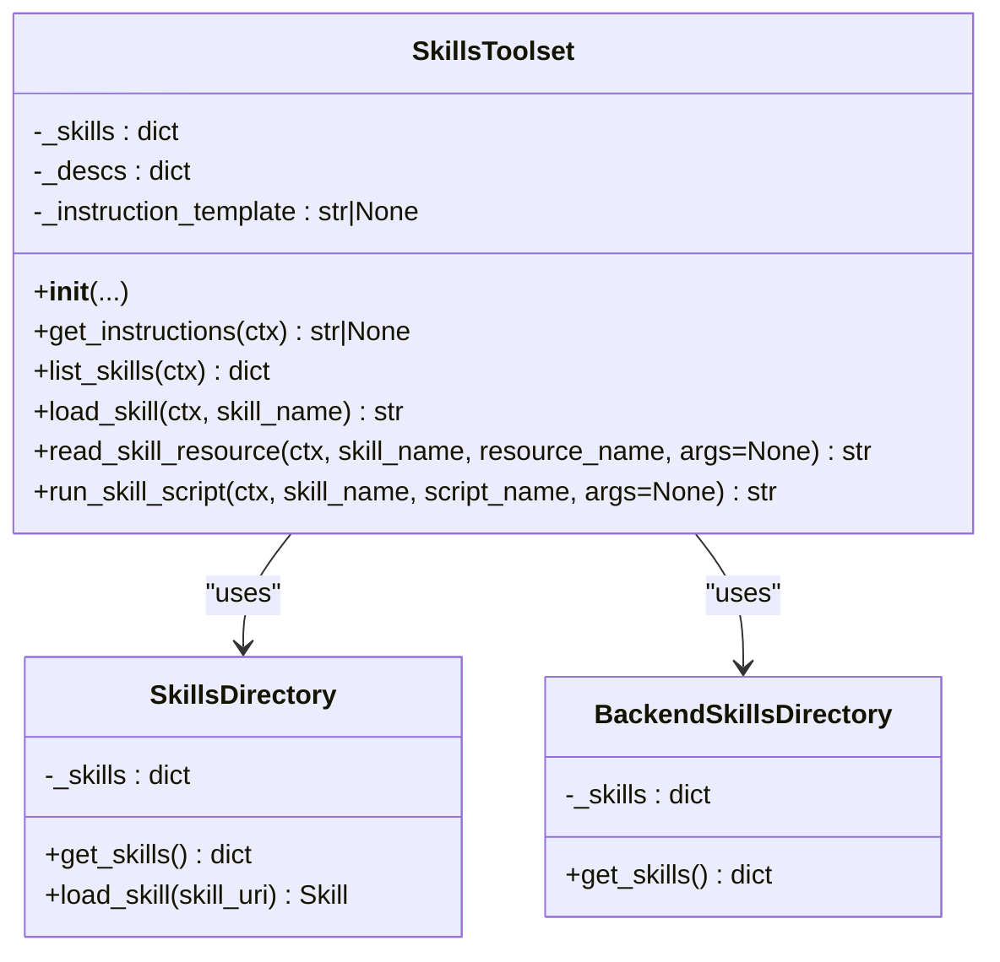
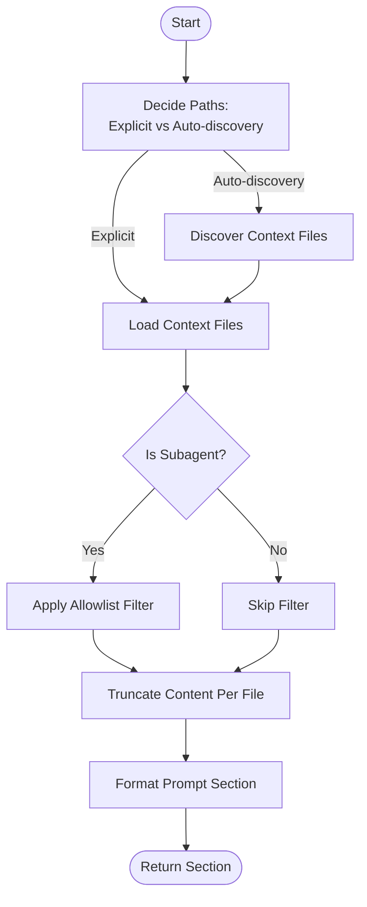
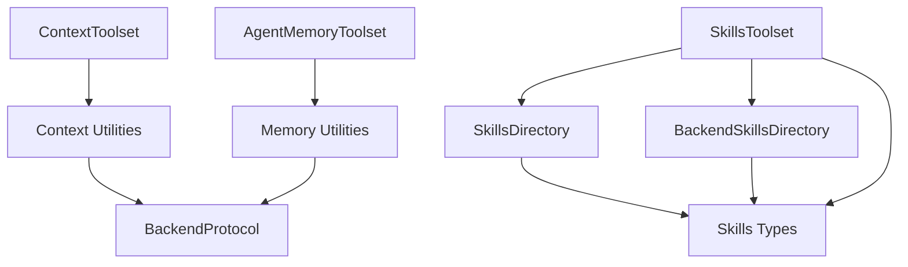

# Context Toolset API

<cite>
**Referenced Files in This Document**
- [context.py](file://pydantic_deep/toolsets/context.py)
- [memory.py](file://pydantic_deep/toolsets/memory.py)
- [toolset.py](file://pydantic_deep/toolsets/skills/toolset.py)
- [types.py](file://pydantic_deep/toolsets/skills/types.py)
- [backend.py](file://pydantic_deep/toolsets/skills/backend.py)
- [directory.py](file://pydantic_deep/toolsets/skills/directory.py)
- [__init__.py](file://pydantic_deep/toolsets/__init__.py)
- [toolset.py](file://pydantic_deep/toolsets/plan/toolset.py)
- [teams.py](file://pydantic_deep/toolsets/teams.py)
</cite>

## Table of Contents
1. [Introduction](#introduction)
2. [Project Structure](#project-structure)
3. [Core Components](#core-components)
4. [Architecture Overview](#architecture-overview)
5. [Detailed Component Analysis](#detailed-component-analysis)
6. [Dependency Analysis](#dependency-analysis)
7. [Performance Considerations](#performance-considerations)
8. [Troubleshooting Guide](#troubleshooting-guide)
9. [Conclusion](#conclusion)

## Introduction
This document provides comprehensive API documentation for the context toolset interface within the pydantic-deep ecosystem. It focuses on:
- Automatic context injection mechanisms for project context files
- Context file management APIs
- Summarization and truncation utilities
- Context retrieval patterns integrated with agent memory
- Integration with the agent's memory system
- Examples of configuration workflows, file formats, and expansion strategies
- Maintaining optimal context size and relevance for agent decision-making

The documentation covers the ContextToolset for project context injection, the AgentMemoryToolset for persistent memory, and supporting utilities for skills and toolset composition.

## Project Structure
The context toolset resides in the toolsets package alongside other toolsets such as skills, plan, and teams. The relevant modules are:
- ContextToolset and context utilities for project context injection
- AgentMemoryToolset and memory utilities for persistent memory
- Skills toolset for capability discovery and integration
- Plan and Teams toolsets for collaborative workflows

**Diagram sources**
- [context.py:150-208](file://pydantic_deep/toolsets/context.py#L150-L208)
- [memory.py:130-231](file://pydantic_deep/toolsets/memory.py#L130-L231)
- [toolset.py:112-484](file://pydantic_deep/toolsets/skills/toolset.py#L112-L484)
- [types.py:75-521](file://pydantic_deep/toolsets/skills/types.py#L75-L521)
- [directory.py:444-532](file://pydantic_deep/toolsets/skills/directory.py#L444-L532)
- [backend.py:397-565](file://pydantic_deep/toolsets/skills/backend.py#L397-L565)
- [toolset.py:139-220](file://pydantic_deep/toolsets/plan/toolset.py#L139-L220)
- [teams.py:252-533](file://pydantic_deep/toolsets/teams.py#L252-L533)

**Section sources**
- [__init__.py:1-25](file://pydantic_deep/toolsets/__init__.py#L1-L25)

## Core Components
- ContextToolset: Loads and formats project context files (e.g., AGENT.md) for injection into the agent’s system prompt. Supports explicit paths, auto-discovery, subagent filtering, and per-file truncation.
- AgentMemoryToolset: Manages persistent agent memory via MEMORY.md, injecting recent lines into the system prompt and providing tools to read, append, and update memory.
- SkillsToolset: Integrates skill discovery and management, providing tools to list, load, read resources, and run scripts. Supplies system prompt instructions summarizing available skills.
- Supporting Utilities: Context file discovery, truncation, and formatting; memory path computation and prompt formatting; skills directory and backend discovery.

Key responsibilities:
- ContextToolset: load_context_files, discover_context_files, _truncate_content, format_context_prompt, get_instructions
- AgentMemoryToolset: get_memory_path, load_memory, format_memory_prompt, get_instructions, read_memory, write_memory, update_memory
- SkillsToolset: get_instructions, list_skills, load_skill, read_skill_resource, run_skill_script

**Section sources**
- [context.py:47-208](file://pydantic_deep/toolsets/context.py#L47-L208)
- [memory.py:82-231](file://pydantic_deep/toolsets/memory.py#L82-L231)
- [toolset.py:112-484](file://pydantic_deep/toolsets/skills/toolset.py#L112-L484)

## Architecture Overview
The context toolset integrates with pydantic-ai’s FunctionToolset to provide:
- get_instructions(): Inject formatted context or memory into the system prompt
- Toolset-specific tools: read_memory, write_memory, update_memory (memory toolset), and skills-related tools (skills toolset)

**Diagram sources**
- [context.py:150-208](file://pydantic_deep/toolsets/context.py#L150-L208)
- [memory.py:130-231](file://pydantic_deep/toolsets/memory.py#L130-L231)
- [toolset.py:112-484](file://pydantic_deep/toolsets/skills/toolset.py#L112-L484)

## Detailed Component Analysis

### ContextToolset API
Purpose: Automatically load and inject project context files into the agent’s system prompt. Supports explicit paths, auto-discovery, subagent filtering, and per-file truncation.

Key methods and configuration:
- __init__(context_files=None, context_discovery=False, is_subagent=False, max_chars=20000)
  - context_files: list[str] | None – explicit file paths to load
  - context_discovery: bool – whether to auto-discover context files
  - is_subagent: bool – applies subagent allowlist filtering
  - max_chars: int – maximum characters per file before truncation
- get_instructions(ctx) -> str | None
  - Loads context files via backend, formats them, and returns a system prompt section or None if no files

Context file management utilities:
- load_context_files(backend, paths) -> list[ContextFile]
  - Reads bytes from backend and decodes to UTF-8; returns list of ContextFile(name, path, content)
- discover_context_files(backend, search_path="/", filenames=None) -> list[str]
  - Scans for default filenames (e.g., AGENT.md) under a root path
- _truncate_content(content, max_chars) -> str
  - Truncates preserving head (~70%) and tail (~30%) with a truncation marker
- format_context_prompt(files, is_subagent=False, subagent_allowlist=frozenset, max_chars=20000) -> str
  - Builds a formatted section for the system prompt; filters subagent-visible files

Context file model:
- ContextFile: name, path, content

Integration with agent memory:
- The system prompt can combine context and memory sections via separate toolsets’ get_instructions()

**Diagram sources**
- [context.py:181-208](file://pydantic_deep/toolsets/context.py#L181-L208)
- [context.py:47-96](file://pydantic_deep/toolsets/context.py#L47-L96)
- [context.py:98-148](file://pydantic_deep/toolsets/context.py#L98-L148)

**Section sources**
- [context.py:35-208](file://pydantic_deep/toolsets/context.py#L35-L208)

### AgentMemoryToolset API
Purpose: Provide persistent memory for agents via MEMORY.md, inject recent lines into the system prompt, and expose tools to manage memory.

Key methods and configuration:
- __init__(agent_name="main", memory_dir="/.deep/memory", max_lines=200, descriptions=None)
  - agent_name: str – identifies the agent (e.g., "main", "code-reviewer")
  - memory_dir: str – base directory for memory files in backend
  - max_lines: int – maximum lines injected into system prompt
  - descriptions: dict[str, str] | None – custom tool descriptions
- get_instructions(ctx) -> str | None
  - Loads memory and returns a formatted system prompt section or None if no memory exists
- read_memory(ctx) -> str
  - Returns full memory content
- write_memory(ctx, content) -> str
  - Appends new content to memory and returns a summary
- update_memory(ctx, old_text, new_text) -> str
  - Replaces exact text occurrences and returns a summary

Memory utilities:
- get_memory_path(memory_dir, agent_name) -> str
  - Computes backend path for MEMORY.md
- load_memory(backend, path, agent_name="main") -> MemoryFile | None
  - Loads memory content or None if not found
- format_memory_prompt(memory, max_lines) -> str
  - Formats memory for system prompt with optional truncation marker

**Diagram sources**
- [memory.py:217-231](file://pydantic_deep/toolsets/memory.py#L217-L231)
- [memory.py:170-216](file://pydantic_deep/toolsets/memory.py#L170-L216)
- [memory.py:69-128](file://pydantic_deep/toolsets/memory.py#L69-L128)

**Section sources**
- [memory.py:57-231](file://pydantic_deep/toolsets/memory.py#L57-L231)

### SkillsToolset API (for context expansion)
While not a context toolset itself, SkillsToolset contributes to context expansion by:
- Providing system prompt instructions summarizing available skills
- Enabling agents to load detailed skill instructions and access resources/scripts
- Supporting both local and backend-based discovery

Key methods and configuration:
- __init__(skills=None, directories=None, validate=True, max_depth=3, id=None, instruction_template=None, exclude_tools=None, descriptions=None)
- get_instructions(ctx) -> str | None
- list_skills(ctx) -> dict[str, str]
- load_skill(ctx, skill_name) -> str
- read_skill_resource(ctx, skill_name, resource_name, args=None) -> str
- run_skill_script(ctx, skill_name, script_name, args=None) -> str

Skills data model:
- Skill, SkillResource, SkillScript, SkillWrapper
- BackendSkillResource, BackendSkillScript, BackendSkillsDirectory
- SkillsDirectory for filesystem discovery

**Diagram sources**
- [toolset.py:112-484](file://pydantic_deep/toolsets/skills/toolset.py#L112-L484)
- [directory.py:444-532](file://pydantic_deep/toolsets/skills/directory.py#L444-L532)
- [backend.py:397-565](file://pydantic_deep/toolsets/skills/backend.py#L397-L565)

**Section sources**
- [toolset.py:112-484](file://pydantic_deep/toolsets/skills/toolset.py#L112-L484)
- [types.py:75-521](file://pydantic_deep/toolsets/skills/types.py#L75-L521)
- [directory.py:444-532](file://pydantic_deep/toolsets/skills/directory.py#L444-L532)
- [backend.py:397-565](file://pydantic_deep/toolsets/skills/backend.py#L397-L565)

### Context Expansion Strategies
- Auto-discovery: Use discover_context_files to locate context files (e.g., AGENT.md) under a root path
- Explicit paths: Provide context_files to load specific files
- Subagent filtering: Restrict visible files via subagent allowlist
- Truncation: Use _truncate_content to cap per-file size and preserve head/tail
- Memory integration: Combine context and memory sections in the system prompt via separate toolsets

**Diagram sources**
- [context.py:73-96](file://pydantic_deep/toolsets/context.py#L73-L96)
- [context.py:159-180](file://pydantic_deep/toolsets/context.py#L159-L180)
- [context.py:136-148](file://pydantic_deep/toolsets/context.py#L136-L148)

## Dependency Analysis
- ContextToolset depends on:
  - BackendProtocol for reading bytes and writing memory
  - ContextFile dataclass for representing loaded files
  - Constants for default filenames, subagent allowlist, and max characters
- AgentMemoryToolset depends on:
  - BackendProtocol for reading/writing memory files
  - MemoryFile dataclass for representing memory content
  - Constants for memory directory, filename, and max lines
- SkillsToolset depends on:
  - SkillsDirectory and BackendSkillsDirectory for discovery
  - Skill, SkillResource, SkillScript types
  - Tool registration via FunctionToolset

**Diagram sources**
- [context.py:150-208](file://pydantic_deep/toolsets/context.py#L150-L208)
- [memory.py:130-231](file://pydantic_deep/toolsets/memory.py#L130-L231)
- [toolset.py:112-484](file://pydantic_deep/toolsets/skills/toolset.py#L112-L484)
- [directory.py:444-532](file://pydantic_deep/toolsets/skills/directory.py#L444-L532)
- [backend.py:397-565](file://pydantic_deep/toolsets/skills/backend.py#L397-L565)

**Section sources**
- [context.py:150-208](file://pydantic_deep/toolsets/context.py#L150-L208)
- [memory.py:130-231](file://pydantic_deep/toolsets/memory.py#L130-L231)
- [toolset.py:112-484](file://pydantic_deep/toolsets/skills/toolset.py#L112-L484)

## Performance Considerations
- Context truncation: _truncate_content preserves head and tail to maintain contextual integrity while limiting token usage
- Memory truncation: format_memory_prompt caps injected lines to stay within token budgets
- Discovery depth: SkillsDirectory supports max_depth to avoid scanning very large trees
- Backend I/O: Batch reads via backend._read_bytes and efficient glob_info usage in backend discovery minimize overhead

[No sources needed since this section provides general guidance]

## Troubleshooting Guide
Common issues and resolutions:
- Missing context files: discover_context_files silently skips missing files; verify search_path and filenames
- Empty system prompt: get_instructions returns None if no files are found; enable context_discovery or provide context_files
- Memory not found: load_memory returns None; use write_memory to create initial memory
- Update failures: update_memory checks exact text presence; ensure old_text matches exactly
- Skills validation: SkillsToolset validates skill metadata; adjust names/descriptions or disable validation as needed

**Section sources**
- [context.py:73-96](file://pydantic_deep/toolsets/context.py#L73-L96)
- [memory.py:82-104](file://pydantic_deep/toolsets/memory.py#L82-L104)
- [toolset.py:194-206](file://pydantic_deep/toolsets/skills/toolset.py#L194-L206)

## Conclusion
The context toolset interface provides robust mechanisms for automatic context injection, memory persistence, and capability expansion:
- ContextToolset ensures relevant project context is injected efficiently with truncation and subagent filtering
- AgentMemoryToolset maintains persistent memory with safe read/write/update operations
- SkillsToolset expands agent capabilities through discovery and integration
Together, these components help maintain optimal context size and relevance for agent decision-making while supporting scalable, backend-aware workflows.