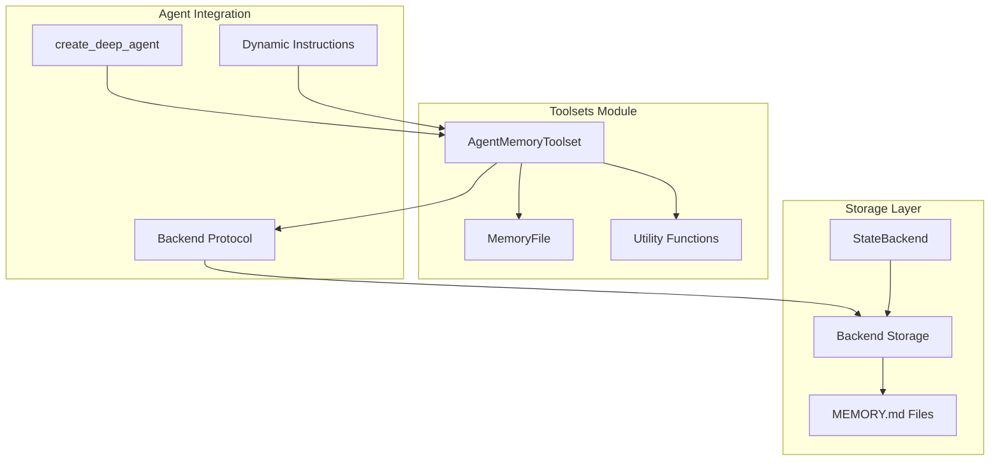
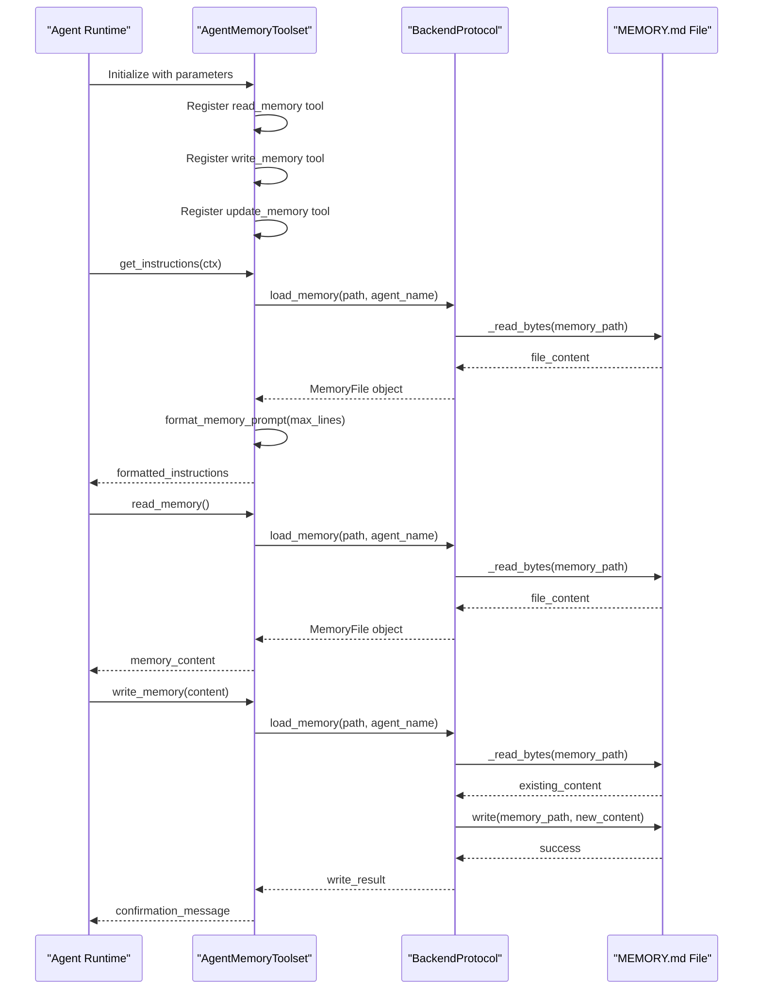
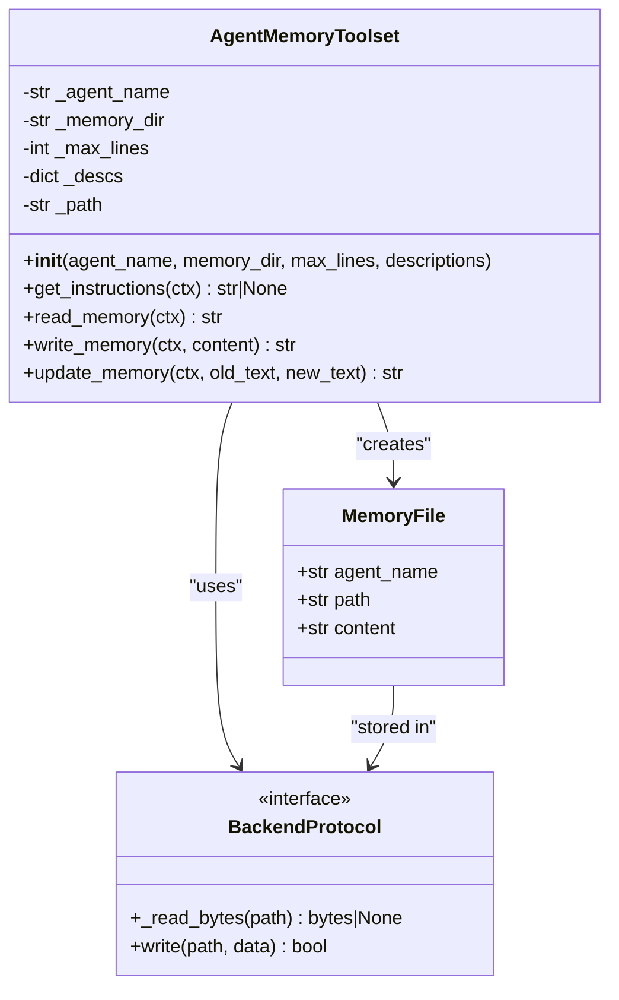
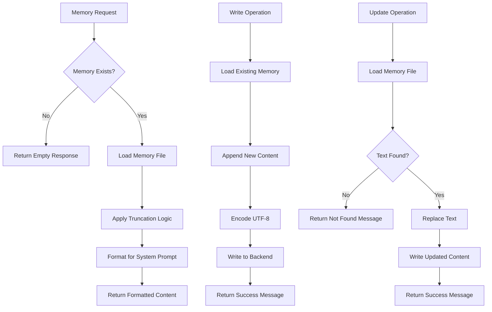
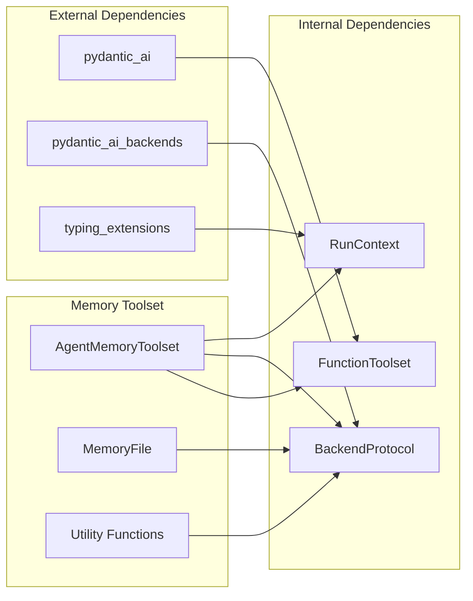

# Memory Toolset API

<cite>
**Referenced Files in This Document**
- [memory.py](file://pydantic_deep/toolsets/memory.py)
- [__init__.py](file://pydantic_deep/toolsets/__init__.py)
- [agent.py](file://pydantic_deep/agent.py)
- [test_memory.py](file://tests/test_memory.py)
- [memory.md](file://docs/advanced/memory.md)
- [toolsets.md](file://docs/api/toolsets.md)
- [memory-and-context.md](file://docs/architecture/memory-and-context.md)
</cite>

## Table of Contents
1. [Introduction](#introduction)
2. [Project Structure](#project-structure)
3. [Core Components](#core-components)
4. [Architecture Overview](#architecture-overview)
5. [Detailed Component Analysis](#detailed-component-analysis)
6. [Dependency Analysis](#dependency-analysis)
7. [Performance Considerations](#performance-considerations)
8. [Troubleshooting Guide](#troubleshooting-guide)
9. [Conclusion](#conclusion)

## Introduction
This document provides comprehensive API documentation for the memory toolset interface that enables persistent agent memory with read/write tools. The memory toolset integrates seamlessly with the pydantic-deep agent framework, providing:
- Persistent memory storage across sessions via MEMORY.md files
- Automatic system prompt injection with configurable truncation
- Three core tools: read_memory, write_memory, and update_memory
- Support for both main agents and subagents with per-agent isolation
- Integration with long-term memory systems and conversation history management

The memory toolset represents a critical component in maintaining conversation continuity and enabling contextual awareness across interactions, allowing agents to retain important information beyond the scope of a single conversation turn.

## Project Structure
The memory toolset is implemented as part of the pydantic-deep toolsets collection, with the core implementation residing in the memory module. The toolset integrates with the broader agent framework through the create_deep_agent factory function and supports both standalone usage and integration with other toolsets.



**Diagram sources**
- [memory.py:130-231](file://pydantic_deep/toolsets/memory.py#L130-L231)
- [agent.py:196-400](file://pydantic_deep/agent.py#L196-L400)

**Section sources**
- [memory.py:1-231](file://pydantic_deep/toolsets/memory.py#L1-231)
- [__init__.py:1-25](file://pydantic_deep/toolsets/__init__.py#L1-L25)

## Core Components

### AgentMemoryToolset Class
The primary component providing persistent memory functionality through a FunctionToolset implementation. This class encapsulates all memory-related operations and integrates with the agent's dynamic instruction system.

**Key Features:**
- **Persistent Storage**: Uses BackendProtocol for cross-session memory persistence
- **Automatic Injection**: System prompt injection via get_instructions() method
- **Configurable Limits**: Adjustable maximum lines for system prompt truncation
- **Multi-Agent Support**: Per-agent memory isolation with customizable paths

**Method Signatures:**
```python
class AgentMemoryToolset(FunctionToolset[Any]):
    def __init__(
        self,
        *,
        agent_name: str = "main",
        memory_dir: str = DEFAULT_MEMORY_DIR,
        max_lines: int = DEFAULT_MAX_MEMORY_LINES,
        descriptions: dict[str, str] | None = None,
    ) -> None
    
    def get_instructions(self, ctx: RunContext[Any]) -> str | None
```

**Section sources**
- [memory.py:130-169](file://pydantic_deep/toolsets/memory.py#L130-L169)
- [memory.py:217-231](file://pydantic_deep/toolsets/memory.py#L217-L231)

### MemoryFile Data Structure
Represents a loaded memory file with metadata for agent identification and content management.

**Attributes:**
- `agent_name`: String identifier for the agent owner
- `path`: Full backend path to the memory file
- `content`: Raw memory content as string

**Section sources**
- [memory.py:57-67](file://pydantic_deep/toolsets/memory.py#L57-L67)

### Utility Functions
Support functions for memory path construction, file loading, and system prompt formatting.

**Functions:**
- `get_memory_path(memory_dir: str, agent_name: str) -> str`
- `load_memory(backend: BackendProtocol, path: str, agent_name: str = "main") -> MemoryFile | None`
- `format_memory_prompt(memory: MemoryFile, max_lines: int) -> str`

**Section sources**
- [memory.py:69-128](file://pydantic_deep/toolsets/memory.py#L69-L128)

## Architecture Overview

The memory toolset architecture integrates three primary layers: the toolset interface, the storage abstraction, and the agent integration layer.



**Diagram sources**
- [memory.py:145-216](file://pydantic_deep/toolsets/memory.py#L145-L216)
- [memory.py:82-104](file://pydantic_deep/toolsets/memory.py#L82-L104)

The architecture ensures loose coupling between the toolset and storage backend through the BackendProtocol abstraction, enabling support for various storage backends including local filesystem, in-memory state, and sandbox environments.

**Section sources**
- [memory.py:130-231](file://pydantic_deep/toolsets/memory.py#L130-L231)
- [memory-and-context.md:224-246](file://docs/architecture/memory-and-context.md#L224-L246)

## Detailed Component Analysis

### Memory Toolset Implementation

The AgentMemoryToolset extends FunctionToolset to provide specialized memory operations with robust error handling and integration capabilities.



**Diagram sources**
- [memory.py:130-216](file://pydantic_deep/toolsets/memory.py#L130-L216)
- [memory.py:57-67](file://pydantic_deep/toolsets/memory.py#L57-L67)

**Section sources**
- [memory.py:130-216](file://pydantic_deep/toolsets/memory.py#L130-L216)

### Memory Storage Patterns

The memory toolset implements a hierarchical storage pattern that ensures data isolation and scalability across multiple agents and sessions.



**Diagram sources**
- [memory.py:171-216](file://pydantic_deep/toolsets/memory.py#L171-L216)
- [memory.py:82-128](file://pydantic_deep/toolsets/memory.py#L82-L128)

**Section sources**
- [memory.py:69-128](file://pydantic_deep/toolsets/memory.py#L69-L128)

### Integration with Agent Framework

The memory toolset integrates deeply with the pydantic-deep agent framework through the create_deep_agent factory function and dynamic instruction system.

**Integration Points:**
- **Initialization**: Memory toolset can be enabled via `include_memory=True` parameter
- **Configuration**: Customizable memory directory and line limits per agent
- **Subagent Support**: Automatic memory toolset assignment to subagents
- **Dynamic Instructions**: System prompt injection via get_instructions()

**Section sources**
- [agent.py:232-356](file://pydantic_deep/agent.py#L232-L356)
- [memory.py:217-231](file://pydantic_deep/toolsets/memory.py#L217-L231)

## Dependency Analysis

The memory toolset maintains minimal external dependencies while providing comprehensive functionality through strategic abstractions.



**Diagram sources**
- [memory.py:12-20](file://pydantic_deep/toolsets/memory.py#L12-L20)

**Section sources**
- [memory.py:12-20](file://pydantic_deep/toolsets/memory.py#L12-L20)

### Memory Configuration Workflow

The memory toolset supports flexible configuration through multiple integration points:

**Basic Configuration:**
```python
from pydantic_deep.toolsets.memory import AgentMemoryToolset

memory_toolset = AgentMemoryToolset(
    agent_name="main",
    memory_dir="/.deep/memory",
    max_lines=200
)
```

**Advanced Configuration:**
```python
from pydantic_deep.toolsets.memory import AgentMemoryToolset

memory_toolset = AgentMemoryToolset(
    agent_name="code-reviewer",
    memory_dir="/workspace/.memory",
    max_lines=50,
    descriptions={
        "write_memory": "Save important findings to persistent memory",
        "read_memory": "Recall previously saved findings from memory",
        "update_memory": "Correct outdated information in memory"
    }
)
```

**Section sources**
- [toolsets.md:469-480](file://docs/api/toolsets.md#L469-L480)
- [memory.md:132-141](file://docs/advanced/memory.md#L132-L141)

## Performance Considerations

The memory toolset is designed with performance optimization in mind, implementing several strategies to minimize overhead and maximize efficiency:

### Memory Management
- **Lazy Loading**: Memory files are only loaded when needed or during system prompt injection
- **Truncation Strategy**: Automatic line truncation prevents excessive token usage in system prompts
- **UTF-8 Encoding**: Efficient text encoding with error recovery for international content

### Storage Optimization
- **Minimal I/O Operations**: Memory files are read once per agent run and cached in memory
- **Efficient Path Resolution**: Precomputed memory paths avoid repeated string operations
- **Backend Abstraction**: Leverages BackendProtocol for optimized storage operations

### Scalability Features
- **Per-Agent Isolation**: Memory files are separated by agent name to prevent conflicts
- **Configurable Limits**: Adjustable maximum lines per agent based on specific requirements
- **Flexible Storage Backends**: Support for various storage backends including in-memory for testing

**Section sources**
- [memory.py:27-28](file://pydantic_deep/toolsets/memory.py#L27-L28)
- [memory.py:106-127](file://pydantic_deep/toolsets/memory.py#L106-L127)

## Troubleshooting Guide

### Common Issues and Solutions

**Memory File Not Found**
- **Symptom**: `read_memory` returns "No memory saved yet."
- **Cause**: MEMORY.md file doesn't exist in the expected location
- **Solution**: Use `write_memory` to create the initial memory file

**Text Not Found During Update**
- **Symptom**: `update_memory` returns "Text not found in memory"
- **Cause**: Exact text match not found in memory content
- **Solution**: Verify the exact text content or use `read_memory` to confirm current content

**Encoding Issues**
- **Symptom**: Garbled characters in memory content
- **Cause**: Non-UTF-8 encoded content
- **Solution**: Memory toolset uses UTF-8 with error replacement for compatibility

**Permission Denied Errors**
- **Symptom**: Storage operations fail with permission errors
- **Cause**: Insufficient permissions for the configured memory directory
- **Solution**: Verify backend permissions and directory existence

**Section sources**
- [test_memory.py:264-346](file://tests/test_memory.py#L264-L346)

### Testing and Validation

The memory toolset includes comprehensive test coverage for all major functionality:

**Unit Tests Coverage:**
- MemoryFile dataclass creation and validation
- Path resolution for different agent names and directories
- Memory loading with various content types including UTF-8
- System prompt formatting with truncation
- Toolset initialization and parameter validation
- Individual tool operations (read, write, update)
- Integration with create_deep_agent factory

**Section sources**
- [test_memory.py:41-587](file://tests/test_memory.py#L41-L587)

## Conclusion

The memory toolset API provides a robust, scalable solution for persistent agent memory management within the pydantic-deep framework. Key strengths include:

**Technical Excellence:**
- Clean separation of concerns through FunctionToolset inheritance
- Flexible backend abstraction supporting multiple storage implementations
- Comprehensive error handling and edge case management
- Configurable parameters for diverse use cases

**Integration Capabilities:**
- Seamless integration with agent factory functions
- Automatic system prompt injection for contextual awareness
- Support for both main agents and subagents
- Extensible description customization for workflow integration

**Operational Benefits:**
- Cross-session persistence enabling conversation continuity
- Configurable memory limits for token budget management
- UTF-8 encoding support for international content
- Minimal performance overhead through lazy loading and caching

The memory toolset represents a foundational component for building intelligent, context-aware AI agents that can maintain long-term knowledge and improve interaction quality over time. Its design principles of flexibility, scalability, and reliability make it suitable for production deployments across various domains and use cases.