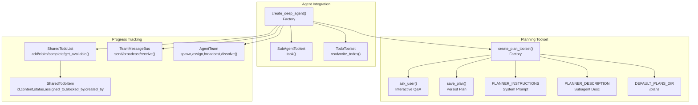
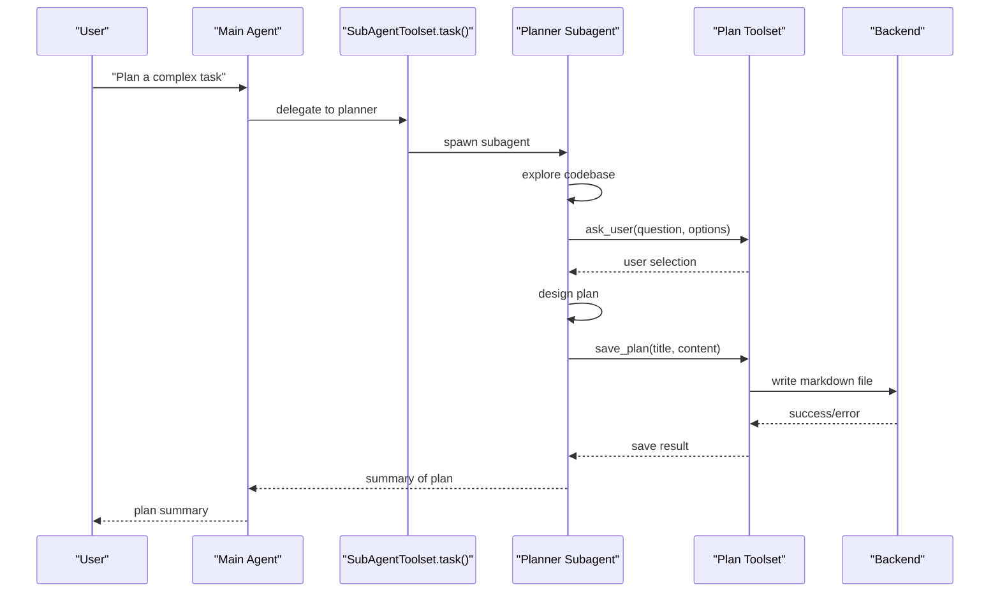
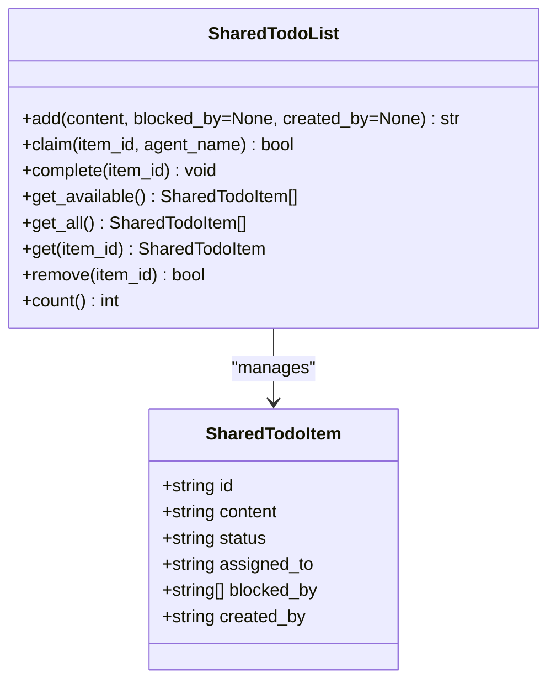
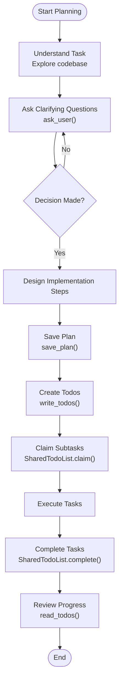
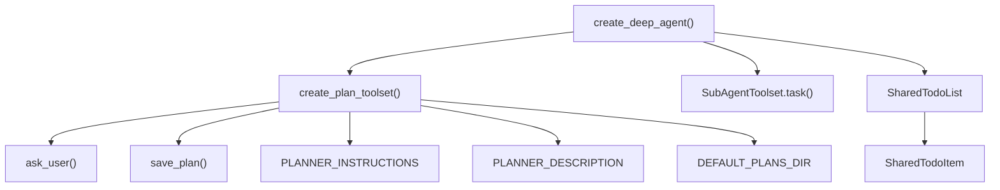

# Planning Toolset API

<cite>
**Referenced Files in This Document**
- [toolset.py](file://pydantic_deep/toolsets/plan/toolset.py)
- [__init__.py](file://pydantic_deep/toolsets/plan/__init__.py)
- [__init__.py](file://pydantic_deep/toolsets/__init__.py)
- [agent.py](file://pydantic_deep/agent.py)
- [teams.py](file://pydantic_deep/toolsets/teams.py)
- [types.py](file://pydantic_deep/types.py)
- [teams.md](file://docs/advanced/teams.md)
- [plan-mode.md](file://docs/advanced/plan-mode.md)
- [toolsets.md](file://docs/concepts/toolsets.md)
- [test_teams.py](file://tests/test_teams.py)
</cite>

## Table of Contents
1. [Introduction](#introduction)
2. [Project Structure](#project-structure)
3. [Core Components](#core-components)
4. [Architecture Overview](#architecture-overview)
5. [Detailed Component Analysis](#detailed-component-analysis)
6. [Dependency Analysis](#dependency-analysis)
7. [Performance Considerations](#performance-considerations)
8. [Troubleshooting Guide](#troubleshooting-guide)
9. [Conclusion](#conclusion)
10. [Appendices](#appendices)

## Introduction
This document provides comprehensive API documentation for the planning toolset interface used by pydantic-deep agents. It focuses on the planner subagent that enables Claude Code-style plan mode, including the Todo class structure, task decomposition methods, dependency tracking mechanisms, and progress reporting APIs. The documentation covers method signatures, parameter specifications, return value formats, error handling patterns, and integration with the agent’s decision-making process. It also explains how the planning toolset breaks down complex tasks into executable subtasks and manages task dependencies.

## Project Structure
The planning toolset resides under the pydantic_deep.toolsets.plan package and integrates with the broader agent ecosystem. The main components include:
- Plan toolset factory and tools (ask_user, save_plan)
- Planner subagent configuration and instructions
- Integration with the main agent factory and subagents
- Shared TODO list and team collaboration utilities for progress tracking and task dependencies

**Diagram sources**
- [toolset.py:139-220](file://pydantic_deep/toolsets/plan/toolset.py#L139-L220)
- [agent.py:477-495](file://pydantic_deep/agent.py#L477-L495)
- [teams.py:38-129](file://pydantic_deep/toolsets/teams.py#L38-L129)

**Section sources**
- [toolset.py:1-220](file://pydantic_deep/toolsets/plan/toolset.py#L1-L220)
- [__init__.py:1-21](file://pydantic_deep/toolsets/plan/__init__.py#L1-L21)
- [agent.py:477-495](file://pydantic_deep/agent.py#L477-L495)
- [teams.md:1-177](file://docs/advanced/teams.md#L1-L177)

## Core Components
This section documents the primary building blocks of the planning toolset and related progress tracking utilities.

- Plan toolset factory
  - create_plan_toolset(plans_dir: str = DEFAULT_PLANS_DIR, id: str | None = None, descriptions: dict[str, str] | None = None) -> FunctionToolset[Any]
  - Purpose: Creates a FunctionToolset containing ask_user and save_plan tools for plan mode.
  - Behavior: Registers two tools with descriptions and returns the toolset.

- Interactive question tool
  - ask_user(ctx: RunContext[Any], question: str, options: list[dict[str, str]]) -> str
  - Purpose: Asks the user a question with predefined options during planning.
  - Behavior: If a callback is provided on ctx.deps.ask_user, it invokes the callback; otherwise, it auto-selects the recommended option (or first option) in headless mode.

- Plan persistence tool
  - save_plan(ctx: RunContext[Any], title: str, content: str) -> str
  - Purpose: Saves the implementation plan to a markdown file in the backend.
  - Behavior: Generates a filename from the title, writes to plans_dir, and returns a success or error message.

- Planner subagent configuration
  - PLANNER_DESCRIPTION: Subagent description for plan mode.
  - PLANNER_INSTRUCTIONS: System prompt guiding the planner’s workflow.
  - DEFAULT_PLANS_DIR: Default directory for plan files.

- Agent integration
  - create_deep_agent(..., include_plan: bool = True, plans_dir: str | None = None, ...)
  - Behavior: When include_plan is True and include_subagents is True, the planner subagent is registered with the task tool, enabling plan mode.

- Progress tracking and dependencies
  - SharedTodoList: Asyncio-safe shared TODO list supporting add, claim, complete, get_available, get_all, get, remove, and count.
  - SharedTodoItem: Task item with id, content, status, assigned_to, blocked_by, created_by.
  - TeamMessageBus: Peer-to-peer messaging between registered agents.
  - AgentTeam: Coordinates team members with shared state and tools.

**Section sources**
- [toolset.py:139-220](file://pydantic_deep/toolsets/plan/toolset.py#L139-L220)
- [agent.py:477-495](file://pydantic_deep/agent.py#L477-L495)
- [teams.py:21-129](file://pydantic_deep/toolsets/teams.py#L21-L129)
- [teams.md:43-80](file://docs/advanced/teams.md#L43-L80)

## Architecture Overview
The planning toolset integrates with the agent’s subagent system to provide a structured planning workflow. The main agent delegates complex tasks to the planner subagent, which explores the codebase, asks clarifying questions via ask_user, and saves a structured plan via save_plan. The agent factory conditionally registers the planner subagent when plan mode is enabled.

**Diagram sources**
- [agent.py:477-495](file://pydantic_deep/agent.py#L477-L495)
- [toolset.py:167-218](file://pydantic_deep/toolsets/plan/toolset.py#L167-L218)

**Section sources**
- [plan-mode.md:26-42](file://docs/advanced/plan-mode.md#L26-L42)
- [toolsets.md:182-194](file://docs/concepts/toolsets.md#L182-L194)

## Detailed Component Analysis

### Plan Toolset API
This section documents the plan toolset factory and its tools in detail.

- create_plan_toolset
  - Parameters:
    - plans_dir: Directory to save plan files (default: DEFAULT_PLANS_DIR)
    - id: Toolset ID (default: "deep-plan")
    - descriptions: Optional mapping of tool name to custom description
  - Returns: FunctionToolset with ask_user and save_plan tools
  - Notes: Descriptions can override built-in defaults for ask_user and save_plan

- ask_user
  - Parameters:
    - ctx: RunContext[Any]
    - question: str (specific and concise)
    - options: list[dict[str, str]] (required, 2-4 options)
  - Options structure:
    - label: Short option text (1-5 words)
    - description: What this option means or implies
    - recommended: Set to "true" to highlight as recommended (optional)
  - Returns: str (selected option label or auto-selection indicator)
  - Behavior:
    - If ctx.deps.ask_user callback exists, it is awaited and its result is returned
    - Otherwise, selects the recommended option if present, else the first option; returns a deterministic indicator

- save_plan
  - Parameters:
    - ctx: RunContext[Any]
    - title: str (used to generate filename)
    - content: str (full markdown content)
  - Returns: str (success message with path or error message)
  - Behavior:
    - Generates filename from title (slugified, truncated, suffixed with UUID)
    - Writes to plans_dir using ctx.deps.backend.write
    - Returns success or error message based on write result

**Section sources**
- [toolset.py:139-220](file://pydantic_deep/toolsets/plan/toolset.py#L139-L220)

### Planner Subagent Configuration
- PLANNER_DESCRIPTION: Describes the planner’s role for task delegation
- PLANNER_INSTRUCTIONS: Defines the planner’s workflow, including asking questions, designing plans, and saving plans
- DEFAULT_PLANS_DIR: Default directory for plan files

**Section sources**
- [toolset.py:26-114](file://pydantic_deep/toolsets/plan/toolset.py#L26-L114)

### Agent Integration and Registration
- create_deep_agent:
  - When include_plan and include_subagents are True, the planner subagent is appended to the subagents list
  - The planner subagent uses PLANNER_DESCRIPTION, PLANNER_INSTRUCTIONS, and a plan toolset created with create_plan_toolset
  - plans_dir can be customized; defaults to "/plans"

**Section sources**
- [agent.py:477-495](file://pydantic_deep/agent.py#L477-L495)

### Shared TODO List and Dependencies
The SharedTodoList and SharedTodoItem provide asynchronous, thread-safe task tracking with claiming and dependency resolution.

- SharedTodoItem fields:
  - id: str (auto-generated)
  - content: str
  - status: str ("pending", "in_progress", "completed")
  - assigned_to: str | None
  - blocked_by: list[str]
  - created_by: str | None

- SharedTodoList methods:
  - add(content, blocked_by=None, created_by=None) -> str
  - claim(item_id: str, agent_name: str) -> bool
  - complete(item_id: str) -> None
  - get_available() -> list[SharedTodoItem]
  - get_all() -> list[SharedTodoItem]
  - get(item_id: str) -> SharedTodoItem | None
  - remove(item_id: str) -> bool
  - count() -> int

- Dependency tracking:
  - An item is claimable only if it is pending, unclaimed, and all items in blocked_by are completed
  - get_available filters out claimed items and items blocked by incomplete dependencies

**Diagram sources**
- [teams.py:21-129](file://pydantic_deep/toolsets/teams.py#L21-L129)

**Section sources**
- [teams.py:21-129](file://pydantic_deep/toolsets/teams.py#L21-L129)
- [teams.md:43-80](file://docs/advanced/teams.md#L43-L80)
- [test_teams.py:61-256](file://tests/test_teams.py#L61-L256)

### Team Messaging and Coordination
TeamMessageBus and AgentTeam provide peer-to-peer messaging and team coordination.

- TeamMessage fields:
  - id: str
  - sender: str
  - receiver: str (empty string indicates broadcast)
  - content: str
  - timestamp: datetime

- TeamMessageBus methods:
  - register(agent_name: str) -> None
  - unregister(agent_name: str) -> None
  - send(sender: str, receiver: str, content: str) -> None
  - broadcast(sender: str, content: str) -> None
  - receive(agent_name: str, timeout: float = 0.0) -> list[TeamMessage]
  - registered_agents() -> list[str]

- AgentTeam methods:
  - spawn() -> dict[str, TeamMemberHandle]
  - assign(member_name: str, task_content: str) -> str
  - broadcast(message: str) -> None
  - wait_all() -> dict[str, str]
  - dissolve() -> None

**Section sources**
- [teams.py:136-307](file://pydantic_deep/toolsets/teams.py#L136-L307)
- [teams.md:81-141](file://docs/advanced/teams.md#L81-L141)

### Task Decomposition and Progress Reporting
The planning toolset supports task decomposition and progress reporting through:
- Planner subagent workflow: Understand task → Ask questions → Design plan → Save plan
- TodoToolset: read_todos and write_todos for progress tracking
- SharedTodoList: Breaking tasks into subtasks with dependencies and claiming

**Diagram sources**
- [toolset.py:33-114](file://pydantic_deep/toolsets/plan/toolset.py#L33-L114)
- [toolsets.md:11-31](file://docs/concepts/toolsets.md#L11-L31)
- [teams.py:66-92](file://pydantic_deep/toolsets/teams.py#L66-L92)

**Section sources**
- [plan-mode.md:26-42](file://docs/advanced/plan-mode.md#L26-L42)
- [toolsets.md:11-31](file://docs/concepts/toolsets.md#L11-L31)
- [teams.md:43-80](file://docs/advanced/teams.md#L43-L80)

## Dependency Analysis
This section analyzes the dependencies between components and their relationships.

**Diagram sources**
- [agent.py:477-495](file://pydantic_deep/agent.py#L477-L495)
- [toolset.py:139-220](file://pydantic_deep/toolsets/plan/toolset.py#L139-L220)
- [teams.py:38-129](file://pydantic_deep/toolsets/teams.py#L38-L129)

**Section sources**
- [__init__.py:1-25](file://pydantic_deep/toolsets/__init__.py#L1-L25)
- [agent.py:477-495](file://pydantic_deep/agent.py#L477-L495)

## Performance Considerations
- Asyncio safety: SharedTodoList uses asyncio.Lock to ensure thread-safe access to shared state.
- Headless mode: ask_user auto-selects options when no callback is provided, avoiding blocking and enabling automated workflows.
- File I/O: save_plan writes plan files to the backend; ensure appropriate plans_dir permissions and backend capacity.
- Scalability: TeamMessageBus uses asyncio.Queue for efficient message passing; consider timeouts and queue sizes for high-throughput scenarios.

[No sources needed since this section provides general guidance]

## Troubleshooting Guide
Common issues and resolutions:
- Planner not invoked:
  - Ensure include_plan and include_subagents are True when creating the agent.
  - Verify the task tool is used to delegate to the planner subagent.
- ask_user callback missing:
  - In headless environments, ask_user auto-selects the recommended option; confirm options include a recommended label.
- save_plan errors:
  - Check backend write permissions and plans_dir availability; inspect returned error messages for details.
- SharedTodoList claims failing:
  - Confirm dependencies are completed; get_available filters out blocked items.
- Team messaging failures:
  - Ensure the receiver is registered; send/receive methods raise KeyError for unregistered agents.

**Section sources**
- [toolset.py:182-192](file://pydantic_deep/toolsets/plan/toolset.py#L182-L192)
- [teams.py:166-212](file://pydantic_deep/toolsets/teams.py#L166-L212)
- [test_teams.py:162-180](file://tests/test_teams.py#L162-L180)

## Conclusion
The planning toolset provides a robust framework for interactive planning, task decomposition, and progress tracking. By integrating with the agent’s subagent system and leveraging shared state utilities, it enables structured workflows for complex tasks. The ask_user tool facilitates clarifying questions, while save_plan persists actionable plans. SharedTodoList and related components manage dependencies and progress, ensuring reliable execution of decomposed subtasks.

[No sources needed since this section summarizes without analyzing specific files]

## Appendices

### API Reference Summary
- Plan toolset factory
  - create_plan_toolset(plans_dir: str = "/plans", id: str | None = None, descriptions: dict[str, str] | None = None) -> FunctionToolset[Any]
- Tools
  - ask_user(ctx: RunContext[Any], question: str, options: list[dict[str, str]]) -> str
  - save_plan(ctx: RunContext[Any], title: str, content: str) -> str
- Planner configuration
  - PLANNER_DESCRIPTION: str
  - PLANNER_INSTRUCTIONS: str
  - DEFAULT_PLANS_DIR: str
- Agent integration
  - create_deep_agent(..., include_plan: bool = True, plans_dir: str | None = None, ...)
- Progress tracking
  - SharedTodoList: add, claim, complete, get_available, get_all, get, remove, count
  - SharedTodoItem: id, content, status, assigned_to, blocked_by, created_by
  - TeamMessageBus: register, unregister, send, broadcast, receive, registered_agents
  - AgentTeam: spawn, assign, broadcast, wait_all, dissolve

**Section sources**
- [toolset.py:139-220](file://pydantic_deep/toolsets/plan/toolset.py#L139-L220)
- [agent.py:477-495](file://pydantic_deep/agent.py#L477-L495)
- [teams.py:21-307](file://pydantic_deep/toolsets/teams.py#L21-L307)
- [toolsets.md:182-194](file://docs/concepts/toolsets.md#L182-L194)