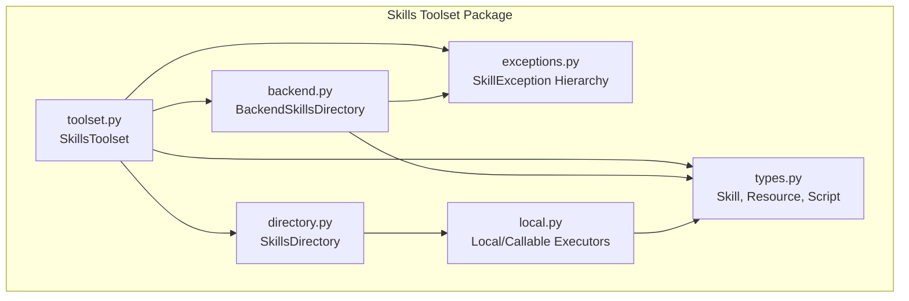
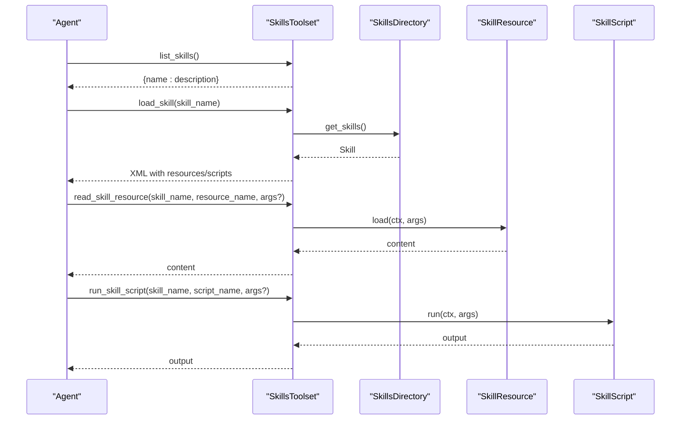
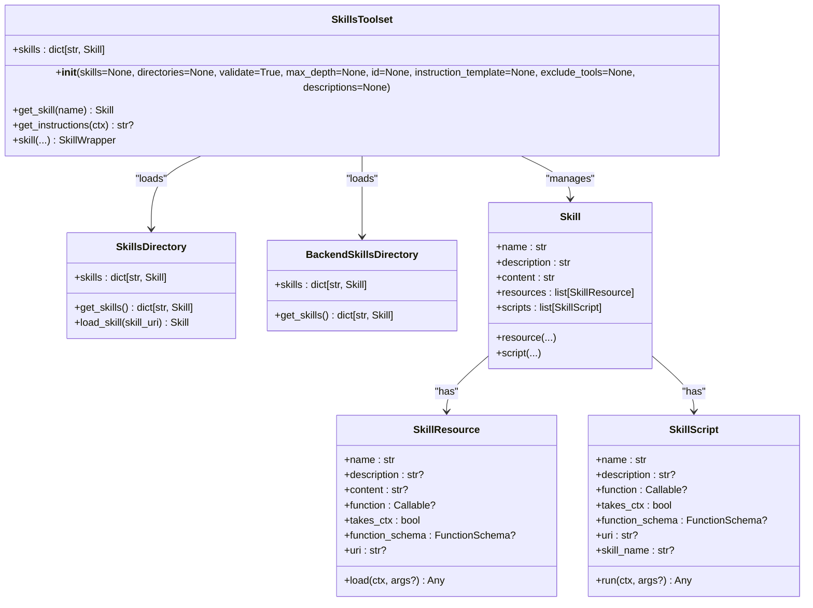
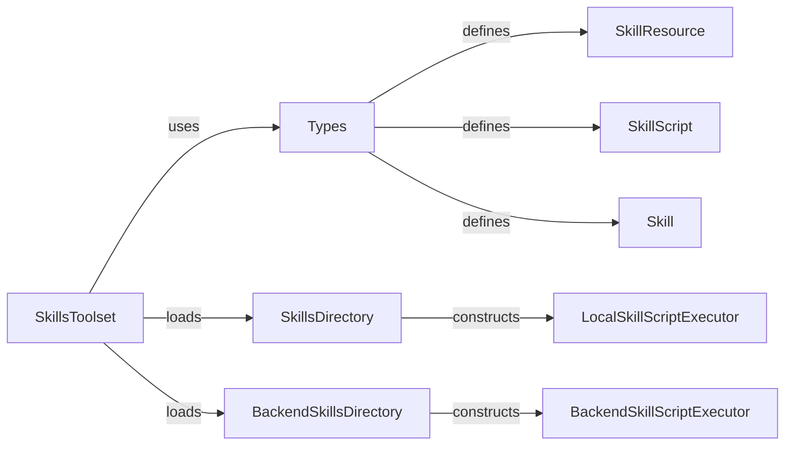

# Skills Toolset API

<cite>
**Referenced Files in This Document**
- [toolset.py](file://pydantic_deep/toolsets/skills/toolset.py)
- [directory.py](file://pydantic_deep/toolsets/skills/directory.py)
- [backend.py](file://pydantic_deep/toolsets/skills/backend.py)
- [local.py](file://pydantic_deep/toolsets/skills/local.py)
- [types.py](file://pydantic_deep/toolsets/skills/types.py)
- [exceptions.py](file://pydantic_deep/toolsets/skills/exceptions.py)
- [__init__.py](file://pydantic_deep/toolsets/skills/__init__.py)
- [SKILL.md (code-review)](file://cli/skills/code-review/README.md)
- [SKILL.md (data-formats)](file://cli/skills/data-formats/README.md)
- [SKILL.md (build-and-compile)](file://pydantic_deep/bundled_skills/build-and-compile/README.md)
</cite>

## Table of Contents
1. [Introduction](#introduction)
2. [Project Structure](#project-structure)
3. [Core Components](#core-components)
4. [Architecture Overview](#architecture-overview)
5. [Detailed Component Analysis](#detailed-component-analysis)
6. [Dependency Analysis](#dependency-analysis)
7. [Performance Considerations](#performance-considerations)
8. [Troubleshooting Guide](#troubleshooting-guide)
9. [Conclusion](#conclusion)
10. [Appendices](#appendices)

## Introduction
This document provides comprehensive API documentation for the skills toolset interface used to extend agent capabilities through modular skill implementations. It covers skill loading mechanisms, skill execution APIs, skill resource management, and skill directory configuration. It also documents method signatures for skill registration, skill invocation patterns, parameter validation, and result processing. Practical examples demonstrate skill development workflows, configuration patterns, and integration with the agent’s capability system.

## Project Structure
The skills toolset is implemented in the pydantic_deep.toolsets.skills package. Key modules include:
- Toolset orchestration and agent integration
- Filesystem-based discovery and management
- Backend-aware discovery and execution
- Local script execution and resource loading
- Shared type definitions and validation
- Public exports and exception taxonomy

**Diagram sources**
- [toolset.py:112-598](file://pydantic_deep/toolsets/skills/toolset.py#L112-L598)
- [directory.py:444-532](file://pydantic_deep/toolsets/skills/directory.py#L444-L532)
- [backend.py:397-565](file://pydantic_deep/toolsets/skills/backend.py#L397-L565)
- [local.py:35-313](file://pydantic_deep/toolsets/skills/local.py#L35-L313)
- [types.py:75-521](file://pydantic_deep/toolsets/skills/types.py#L75-L521)
- [exceptions.py:20-42](file://pydantic_deep/toolsets/skills/exceptions.py#L20-L42)

**Section sources**
- [__init__.py:10-83](file://pydantic_deep/toolsets/skills/__init__.py#L10-L83)

## Core Components
- SkillsToolset: Primary integration point for agents. Provides tools to list skills, load skill details, read resources, and run scripts. Supports programmatic skill definition and directory-based discovery.
- SkillsDirectory: Discovers skills from a filesystem directory, parses SKILL.md, validates metadata, and builds Skill objects with resources and scripts.
- BackendSkillsDirectory: Discovers skills from a backend filesystem using BackendProtocol and executes scripts via SandboxProtocol.
- Local/Callable Executors: Execute file-based scripts locally or wrap custom callables for script execution.
- Types: Defines Skill, SkillResource, SkillScript, SkillWrapper, and supporting utilities for naming and validation.
- Exceptions: Centralized exception hierarchy for skill-related errors.

**Section sources**
- [toolset.py:112-598](file://pydantic_deep/toolsets/skills/toolset.py#L112-L598)
- [directory.py:444-532](file://pydantic_deep/toolsets/skills/directory.py#L444-L532)
- [backend.py:397-565](file://pydantic_deep/toolsets/skills/backend.py#L397-L565)
- [local.py:35-313](file://pydantic_deep/toolsets/skills/local.py#L35-L313)
- [types.py:75-521](file://pydantic_deep/toolsets/skills/types.py#L75-L521)
- [exceptions.py:20-42](file://pydantic_deep/toolsets/skills/exceptions.py#L20-L42)

## Architecture Overview
The skills toolset integrates with Pydantic AI agents by registering four tools: list_skills, load_skill, read_skill_resource, and run_skill_script. Agents can load skills from:
- Programmatic Skill instances
- Filesystem directories (SkillsDirectory)
- Backend filesystems (BackendSkillsDirectory)

Discovery and execution are decoupled: discovery populates Skill objects with resources and scripts, while execution uses appropriate executors.

**Diagram sources**
- [toolset.py:336-456](file://pydantic_deep/toolsets/skills/toolset.py#L336-L456)
- [directory.py:490-532](file://pydantic_deep/toolsets/skills/directory.py#L490-L532)
- [types.py:75-177](file://pydantic_deep/toolsets/skills/types.py#L75-L177)

## Detailed Component Analysis

### SkillsToolset API
SkillsToolset is the central integration point for agents. It initializes from programmatic skills and/or directory-based sources, registers tools, and provides system prompt integration.

Key capabilities:
- Initialization with skills, directories, validation, depth limits, instruction template, tool exclusions, and custom descriptions
- Tool registration for list_skills, load_skill, read_skill_resource, run_skill_script
- System prompt generation with available skills
- Decorator-based skill creation (skills.skill) and resource/script attachment

Method signatures and behavior:
- Constructor: Initializes toolset with programmatic skills and/or directories, applies validation and depth limits, and registers tools
- list_skills: Returns a mapping of skill name to description
- load_skill: Returns a structured XML representation of a skill including resources and scripts
- read_skill_resource: Loads a resource (file-based or callable) with optional arguments
- run_skill_script: Executes a script (file-based or callable) with optional arguments
- get_instructions: Builds a system prompt snippet listing available skills
- skill decorator: Creates a SkillWrapper for programmatic skill definition
- get_skill: Retrieves a registered skill by name

Validation and error handling:
- Duplicate skill names trigger warnings
- Excluding critical tools (e.g., load_skill) triggers warnings
- SkillNotFoundError raised when skills/resources/scripts are not found

Integration with agents:
- Injects system prompt via get_instructions
- Registers tools with descriptions and schemas

**Section sources**
- [toolset.py:151-598](file://pydantic_deep/toolsets/skills/toolset.py#L151-L598)

#### Class Diagram: SkillsToolset and Related Types

**Diagram sources**
- [toolset.py:112-598](file://pydantic_deep/toolsets/skills/toolset.py#L112-L598)
- [directory.py:444-532](file://pydantic_deep/toolsets/skills/directory.py#L444-L532)
- [backend.py:397-565](file://pydantic_deep/toolsets/skills/backend.py#L397-L565)
- [types.py:75-521](file://pydantic_deep/toolsets/skills/types.py#L75-L521)

### SkillsDirectory: Filesystem Discovery and Management
SkillsDirectory discovers skills from a filesystem path, parses SKILL.md, validates metadata, and constructs Skill objects with associated resources and scripts.

Key behaviors:
- Depth-limited discovery with glob patterns
- YAML frontmatter parsing (with fallback regex parser)
- Resource discovery for supported extensions (.md, .json, .yaml, .yml, .csv, .xml, .txt)
- Script discovery for Python files in root and scripts/ subdirectory
- Validation of skill metadata (name, description, compatibility, instruction length)
- Security checks against symlink escapes

Public API:
- get_skills: Returns a dictionary mapping skill URIs to Skill objects
- skills property: Access loaded skills
- load_skill: Retrieves a skill by URI

**Section sources**
- [directory.py:444-532](file://pydantic_deep/toolsets/skills/directory.py#L444-L532)

### BackendSkillsDirectory: Backend-Aware Discovery and Execution
BackendSkillsDirectory discovers skills from a backend filesystem using BackendProtocol and executes scripts via SandboxProtocol when available.

Key behaviors:
- Glob-based discovery of SKILL.md files
- Frontmatter parsing and metadata validation
- Resource discovery via backend glob_info
- Script discovery and wrapping with BackendSkillScript
- Script execution via BackendSkillScriptExecutor with argument-to-command conversion

Public API:
- get_skills: Returns a dictionary mapping skill name to Skill objects
- skills property: Access loaded skills

**Section sources**
- [backend.py:397-565](file://pydantic_deep/toolsets/skills/backend.py#L397-L565)

### Local and Callable Script Execution
LocalSkillScriptExecutor executes file-based scripts via subprocess with timeout control and argument marshalling. CallableSkillScriptExecutor wraps arbitrary callables to conform to the executor interface.

Key behaviors:
- Argument handling: booleans emit flags, lists repeat flags, others stringify
- Timeout and cancellation
- Stdout/stderr capture and exit code reporting
- Async callable support via wrapper

**Section sources**
- [local.py:88-232](file://pydantic_deep/toolsets/skills/local.py#L88-L232)

### Types and Validation
Shared type definitions and validation utilities:
- Skill: Metadata, content, resources, scripts, and decorators for attaching resources/scripts
- SkillResource: Static content, callable resources, or file-based resources
- SkillScript: Programmatic or file-based scripts
- SkillWrapper: Decorator-based skill builder with typed dependencies
- normalize_skill_name: Validates and normalizes skill names
- SKILL_NAME_PATTERN: Regex pattern for valid skill names

Validation rules:
- Skill name length <= 64 characters
- Skill name matches lowercase letters, digits, and hyphens (no consecutive hyphens)
- Description length <= 1024 characters
- Compatibility length <= 500 characters
- Instruction body recommended ≤ 500 lines

**Section sources**
- [types.py:34-73](file://pydantic_deep/toolsets/skills/types.py#L34-L73)
- [types.py:75-521](file://pydantic_deep/toolsets/skills/types.py#L75-L521)
- [directory.py:44-121](file://pydantic_deep/toolsets/skills/directory.py#L44-L121)

### Exceptions
Centralized exception hierarchy:
- SkillException (base)
- SkillNotFoundError
- SkillValidationError
- SkillResourceNotFoundError
- SkillResourceLoadError
- SkillScriptExecutionError

**Section sources**
- [exceptions.py:20-42](file://pydantic_deep/toolsets/skills/exceptions.py#L20-L42)

## Dependency Analysis
The skills toolset composes several subsystems with clear separation of concerns:
- Toolset orchestrates discovery and tool registration
- Directory and backend modules handle discovery and resource/script construction
- Local and backend executors encapsulate execution semantics
- Types define shared contracts and validation rules
- Exceptions unify error handling

**Diagram sources**
- [toolset.py:112-598](file://pydantic_deep/toolsets/skills/toolset.py#L112-L598)
- [directory.py:444-532](file://pydantic_deep/toolsets/skills/directory.py#L444-L532)
- [backend.py:397-565](file://pydantic_deep/toolsets/skills/backend.py#L397-L565)
- [local.py:88-313](file://pydantic_deep/toolsets/skills/local.py#L88-L313)
- [types.py:75-521](file://pydantic_deep/toolsets/skills/types.py#L75-L521)

**Section sources**
- [toolset.py:112-598](file://pydantic_deep/toolsets/skills/toolset.py#L112-L598)
- [directory.py:444-532](file://pydantic_deep/toolsets/skills/directory.py#L444-L532)
- [backend.py:397-565](file://pydantic_deep/toolsets/skills/backend.py#L397-L565)
- [local.py:35-313](file://pydantic_deep/toolsets/skills/local.py#L35-L313)
- [types.py:75-521](file://pydantic_deep/toolsets/skills/types.py#L75-L521)

## Performance Considerations
- Discovery depth limits: max_depth prevents excessive traversal and improves startup performance
- YAML availability: When pyyaml is unavailable, a regex-based parser is used as a fallback
- Script timeouts: Local and backend executors enforce timeouts to avoid hanging executions
- Resource parsing: JSON/YAML resources are parsed on load; consider caching for repeated reads
- System prompt size: Instructions are generated per run; keep skill counts reasonable to avoid long prompts

[No sources needed since this section provides general guidance]

## Troubleshooting Guide
Common issues and resolutions:
- Skill not found: Verify skill name casing and hyphenation; ensure directory discovery includes the skill path
- Resource/script not found: Confirm exact names from load_skill output; names are authoritative
- Validation errors: Ensure SKILL.md includes required fields and follows naming rules
- Execution failures: Check script arguments and environment; confirm backend permissions and timeouts
- Duplicate skills: Override behavior is warned; consolidate duplicates or adjust discovery paths

Relevant exceptions:
- SkillNotFoundError: Raised when skills/resources/scripts are missing
- SkillValidationError: Raised on invalid metadata or parsing failures
- SkillResourceLoadError: Raised on resource read failures
- SkillScriptExecutionError: Raised on script execution failures

**Section sources**
- [toolset.py:254-257](file://pydantic_deep/toolsets/skills/toolset.py#L254-L257)
- [toolset.py:410-455](file://pydantic_deep/toolsets/skills/toolset.py#L410-L455)
- [directory.py:380-441](file://pydantic_deep/toolsets/skills/directory.py#L380-L441)
- [backend.py:152-189](file://pydantic_deep/toolsets/skills/backend.py#L152-L189)
- [exceptions.py:24-41](file://pydantic_deep/toolsets/skills/exceptions.py#L24-L41)

## Conclusion
The skills toolset provides a robust, extensible framework for modular skill integration. It supports programmatic and directory-based skill definitions, safe discovery and validation, flexible resource and script execution, and seamless agent integration. By leveraging the provided APIs and patterns, developers can build powerful, maintainable skills that enhance agent capabilities across diverse domains.

[No sources needed since this section summarizes without analyzing specific files]

## Appendices

### API Reference: SkillsToolset
- Constructor: Initializes toolset with skills and/or directories, validation, depth limits, instruction template, tool exclusions, and custom descriptions
- list_skills: Returns a mapping of skill name to description
- load_skill: Returns structured XML with resources and scripts
- read_skill_resource: Loads resource content (file-based or callable)
- run_skill_script: Executes script (file-based or callable)
- get_instructions: Builds system prompt snippet
- skill: Decorator for programmatic skill creation
- get_skill: Retrieves a registered skill by name

**Section sources**
- [toolset.py:151-598](file://pydantic_deep/toolsets/skills/toolset.py#L151-L598)

### API Reference: SkillsDirectory
- get_skills: Returns dictionary of skill URIs to Skill objects
- skills property: Access loaded skills
- load_skill: Retrieves a skill by URI

**Section sources**
- [directory.py:490-532](file://pydantic_deep/toolsets/skills/directory.py#L490-L532)

### API Reference: BackendSkillsDirectory
- get_skills: Returns dictionary of skill names to Skill objects
- skills property: Access loaded skills

**Section sources**
- [backend.py:446-565](file://pydantic_deep/toolsets/skills/backend.py#L446-L565)

### API Reference: Local/Callable Executors
- LocalSkillScriptExecutor.run: Executes scripts via subprocess with timeout and argument marshalling
- CallableSkillScriptExecutor.run: Wraps arbitrary callables for script execution

**Section sources**
- [local.py:88-232](file://pydantic_deep/toolsets/skills/local.py#L88-L232)

### Skill Development Workflow Examples
- Programmatic skills: Use the skills.skill decorator to define skills and attach resources/scripts
- Directory-based skills: Place SKILL.md with YAML frontmatter and optional resources/scripts in a directory tree
- Backend-based skills: Store SKILL.md and related files in a backend filesystem and configure BackendSkillsDirectory
- Integration with agents: Instantiate SkillsToolset and pass it to the agent’s toolsets

Example SKILL.md patterns:
- Code review skill: Includes YAML frontmatter and Markdown instructions
- Data formats skill: Comprehensive guide with format detection and parsing strategies
- Build and compile skill: Multi-language build strategies and dependency resolution

**Section sources**
- [SKILL.md (code-review):1-47](file://cli/skills/code-review/README.md#L1-L47)
- [SKILL.md (data-formats):1-83](file://cli/skills/data-formats/README.md#L1-L83)
- [SKILL.md (build-and-compile):1-58](file://pydantic_deep/bundled_skills/build-and-compile/README.md#L1-L58)