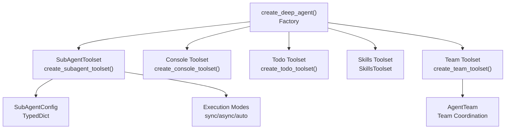
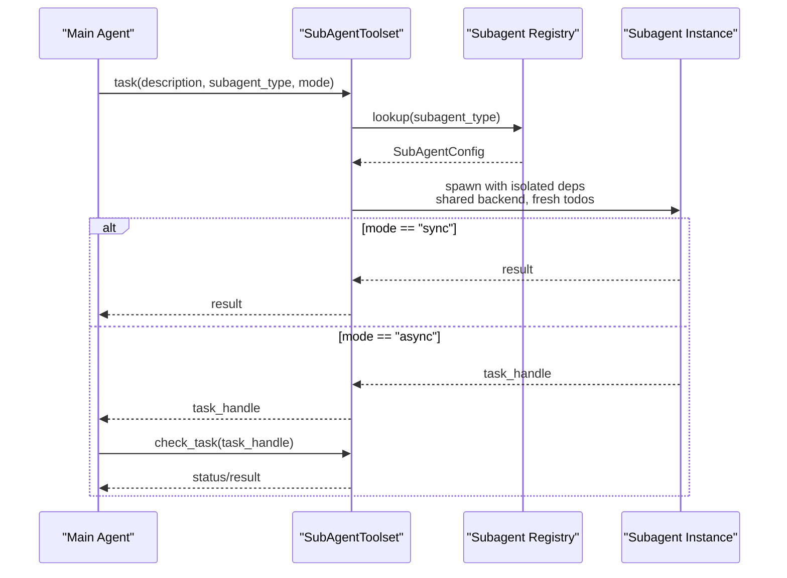
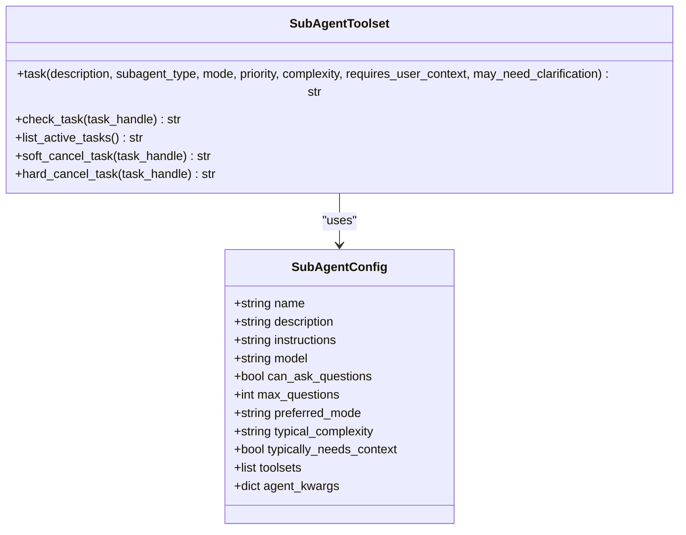
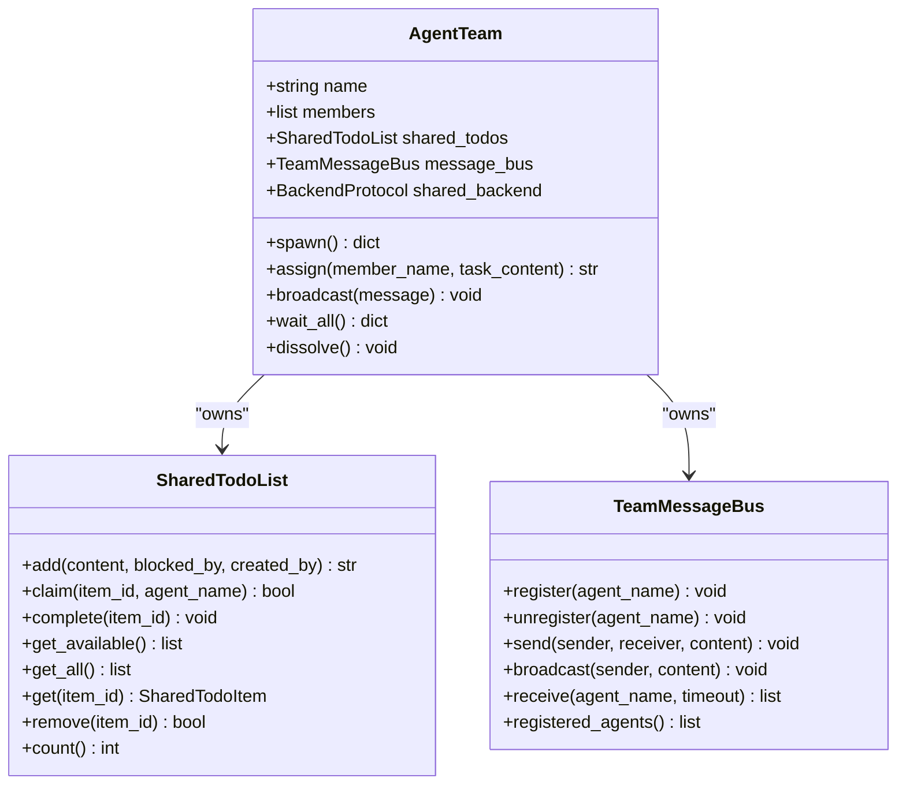
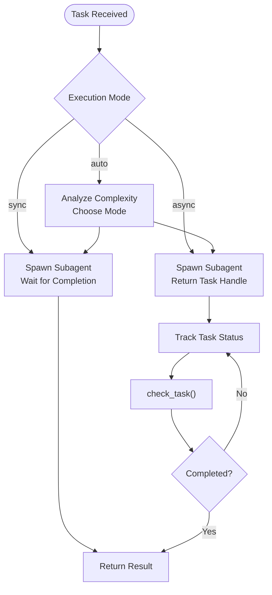
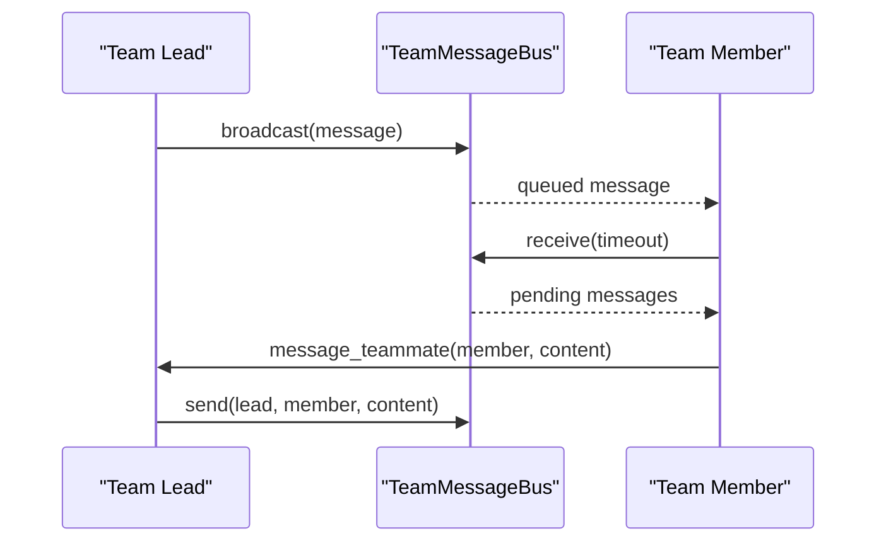
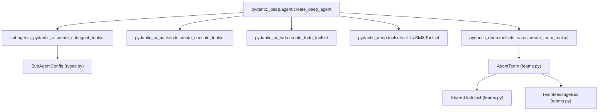

# Subagent Toolset API

<cite>
**Referenced Files in This Document**
- [agent.py](file://pydantic_deep/agent.py)
- [types.py](file://pydantic_deep/types.py)
- [teams.py](file://pydantic_deep/toolsets/teams.py)
- [toolsets.md](file://docs/api/toolsets.md)
- [subagents.md](file://docs/advanced/subagents.md)
- [agents.md](file://docs/concepts/agents.md)
- [subagents.py](file://examples/subagents.py)
</cite>

## Table of Contents
1. [Introduction](#introduction)
2. [Project Structure](#project-structure)
3. [Core Components](#core-components)
4. [Architecture Overview](#architecture-overview)
5. [Detailed Component Analysis](#detailed-component-analysis)
6. [Dependency Analysis](#dependency-analysis)
7. [Performance Considerations](#performance-considerations)
8. [Troubleshooting Guide](#troubleshooting-guide)
9. [Conclusion](#conclusion)

## Introduction
This document provides comprehensive API documentation for the subagent toolset interface within the pydantic-deep ecosystem. It covers subagent creation and management APIs, parallel execution mechanisms, task delegation interfaces, and inter-agent communication patterns. The documentation includes detailed method signatures for subagent configuration, task distribution algorithms, parallel execution controls, and team coordination protocols. It also presents practical examples of subagent orchestration workflows, team management patterns, and distributed task execution strategies, emphasizing the toolset's role in enabling multi-agent collaboration and scalable task processing.

## Project Structure
The subagent toolset is integrated into the main agent factory and leverages external libraries for subagent orchestration. The primary integration points are:
- Agent factory that constructs toolsets and injects subagent capabilities
- Subagent configuration types
- Team toolset for multi-agent collaboration
- Documentation that defines the API surface and usage patterns

**Diagram sources**
- [agent.py:196-621](file://pydantic_deep/agent.py#L196-L621)
- [types.py:30-31](file://pydantic_deep/types.py#L30-L31)
- [teams.py:252-307](file://pydantic_deep/toolsets/teams.py#L252-L307)

**Section sources**
- [agent.py:196-621](file://pydantic_deep/agent.py#L196-L621)
- [types.py:30-31](file://pydantic_deep/types.py#L30-L31)
- [teams.py:252-307](file://pydantic_deep/toolsets/teams.py#L252-L307)

## Core Components
This section documents the core APIs and data structures used by the subagent toolset.

- SubAgentToolset API
  - Tools: task, check_task, list_active_tasks, soft_cancel_task, hard_cancel_task
  - Factory: create_subagent_toolset with parameters including id, subagents, default_model, include_general_purpose, toolsets_factory
  - Tool signature: task(description: str, subagent_type: str = "general-purpose", mode: ExecutionMode = "sync", priority: TaskPriority = NORMAL, complexity: Literal["simple","moderate","complex"] | None = None, requires_user_context: bool = False, may_need_clarification: bool = False) -> str

- SubAgentConfig
  - Keys: name (required), description (required), instructions (required), model (optional), can_ask_questions (optional), max_questions (optional), preferred_mode (optional), typical_complexity (optional), typically_needs_context (optional), toolsets (optional), agent_kwargs (optional)

- TeamToolset API
  - Tools: spawn_team, assign_task, check_teammates, message_teammate, dissolve_team
  - Factory: create_team_toolset with parameters id and descriptions
  - Data structures: SharedTodoList, TeamMessageBus, TeamMember, TeamMemberHandle, AgentTeam

- Agent factory integration
  - create_deep_agent integrates subagent toolset with configurable subagents, general-purpose subagent inclusion, and nested delegation depth

**Section sources**
- [toolsets.md:158-244](file://docs/api/toolsets.md#L158-L244)
- [toolsets.md:416-451](file://docs/api/toolsets.md#L416-L451)
- [agent.py:196-621](file://pydantic_deep/agent.py#L196-L621)
- [types.py:30-31](file://pydantic_deep/types.py#L30-L31)

## Architecture Overview
The subagent toolset architecture centers on task delegation and parallel execution. The main agent exposes a task tool that spawns subagents with isolated contexts while sharing backend storage. Subagents can operate in synchronous, asynchronous, or automatic modes. The team toolset extends collaboration to multi-agent scenarios with shared task lists and peer-to-peer messaging.

**Diagram sources**
- [agent.py:538-621](file://pydantic_deep/agent.py#L538-L621)
- [toolsets.md:197-226](file://docs/api/toolsets.md#L197-L226)

**Section sources**
- [agent.py:538-621](file://pydantic_deep/agent.py#L538-L621)
- [toolsets.md:197-226](file://docs/api/toolsets.md#L197-L226)

## Detailed Component Analysis

### SubAgentToolset API
The SubAgentToolset provides task delegation and lifecycle management for subagents.

- task
  - Purpose: Spawn a subagent for a task with configurable execution mode
  - Parameters: description, subagent_type, mode, priority, complexity, requires_user_context, may_need_clarification
  - Behavior: Creates subagent with isolated context, executes, and returns result or task handle
  - Returns: String result (sync) or task handle information (async)

- check_task
  - Purpose: Check status and retrieve results for background tasks
  - Parameters: task handle
  - Returns: Status and result information

- list_active_tasks
  - Purpose: Enumerate running and pending tasks
  - Returns: List of active task identifiers

- soft_cancel_task / hard_cancel_task
  - Purpose: Request graceful or forceful cancellation of tasks
  - Returns: Confirmation or error message

- Configuration
  - SubAgentConfig: name, description, instructions, model, can_ask_questions, max_questions, preferred_mode, typical_complexity, typically_needs_context, toolsets, agent_kwargs
  - Execution modes: sync (blocking), async (non-blocking), auto (heuristic)

**Diagram sources**
- [toolsets.md:228-243](file://docs/api/toolsets.md#L228-L243)
- [toolsets.md:197-226](file://docs/api/toolsets.md#L197-L226)

**Section sources**
- [toolsets.md:158-244](file://docs/api/toolsets.md#L158-L244)
- [toolsets.md:197-226](file://docs/api/toolsets.md#L197-L226)

### TeamToolset API
The TeamToolset coordinates multi-agent collaboration with shared task management and messaging.

- spawn_team
  - Purpose: Create and initialize a team with member registration
  - Parameters: team_name, members (list of dicts with name, role, description, instructions)
  - Returns: Confirmation with member list

- assign_task
  - Purpose: Add a task to shared list and claim it for a member
  - Parameters: member_name, task_description
  - Returns: Task assignment confirmation with ID

- check_teammates
  - Purpose: Inspect team status and shared tasks
  - Returns: Formatted summary of members and tasks

- message_teammate
  - Purpose: Send targeted messages to team members
  - Parameters: member_name, message
  - Returns: Delivery confirmation

- dissolve_team
  - Purpose: Shutdown team and cleanup resources
  - Returns: Dissolution confirmation

**Diagram sources**
- [teams.py:21-129](file://pydantic_deep/toolsets/teams.py#L21-L129)
- [teams.py:147-217](file://pydantic_deep/toolsets/teams.py#L147-L217)
- [teams.py:252-307](file://pydantic_deep/toolsets/teams.py#L252-L307)

**Section sources**
- [teams.py:354-533](file://pydantic_deep/toolsets/teams.py#L354-L533)
- [teams.py:21-129](file://pydantic_deep/toolsets/teams.py#L21-L129)
- [teams.py:147-217](file://pydantic_deep/toolsets/teams.py#L147-L217)
- [teams.py:252-307](file://pydantic_deep/toolsets/teams.py#L252-L307)

### Parallel Execution Controls
Parallel execution is achieved through asynchronous subagent tasks and team-based coordination.

- Asynchronous task execution
  - Mode selection: sync (immediate result), async (immediate handle), auto (heuristic)
  - Task management: check_task, list_active_tasks, soft/hard cancellation
  - Scalability: independent subagent instances with shared backend

- Team-based parallelism
  - Shared task list with dependency tracking
  - Peer-to-peer messaging for coordination
  - Independent execution with periodic status checks

**Diagram sources**
- [toolsets.md:363-387](file://docs/api/toolsets.md#L363-L387)
- [subagents.md:363-387](file://docs/advanced/subagents.md#L363-L387)

**Section sources**
- [toolsets.md:363-387](file://docs/api/toolsets.md#L363-L387)
- [subagents.md:363-387](file://docs/advanced/subagents.md#L363-L387)

### Inter-Agent Communication Patterns
Communication between agents occurs through explicit delegation and team messaging.

- Parent-child delegation
  - Main agent delegates tasks to subagents via task tool
  - Subagents inherit shared backend but have isolated todo lists
  - Clarification mechanism: ask_parent tool with configurable question limits

- Team messaging
  - Broadcast announcements to all members
  - Direct messaging for specific coordination
  - Message queuing with registration/unregistration

**Diagram sources**
- [teams.py:166-213](file://pydantic_deep/toolsets/teams.py#L166-L213)

**Section sources**
- [teams.py:166-213](file://pydantic_deep/toolsets/teams.py#L166-L213)

### Subagent Configuration and Orchestration
Subagents are configured with specialized instructions and can be customized per task or agent.

- Configuration options
  - Model selection per subagent for cost/performance balance
  - Custom toolsets and agent kwargs for extended capabilities
  - Output type specification for structured results
  - Question handling for clarification workflows

- Orchestration patterns
  - Static configuration via SubAgentConfig list
  - Dynamic registration via DynamicAgentRegistry
  - Nested delegation with controlled depth
  - Context isolation with shared backend

**Section sources**
- [subagents.md:108-135](file://docs/advanced/subagents.md#L108-L135)
- [subagents.md:136-187](file://docs/advanced/subagents.md#L136-L187)
- [subagents.md:347-361](file://docs/advanced/subagents.md#L347-L361)
- [agents.md:503-536](file://docs/concepts/agents.md#L503-L536)

### Team Management Patterns
Team management enables coordinated multi-agent workflows with shared state and communication.

- Team lifecycle
  - Creation with member registration
  - Task assignment with dependency awareness
  - Ongoing coordination via messaging
  - Cleanup and dissolution

- Shared state management
  - Thread-safe shared todo list with locking
  - Dependency resolution and auto-unblocking
  - Status tracking and result aggregation

**Section sources**
- [teams.py:268-307](file://pydantic_deep/toolsets/teams.py#L268-L307)
- [teams.py:49-129](file://pydantic_deep/toolsets/teams.py#L49-L129)

### Distributed Task Execution Strategies
Distributed execution combines subagent parallelism with team coordination for scalable processing.

- Strategy selection
  - Simple delegation for independent tasks
  - Team-based coordination for interdependent workflows
  - Mixed mode combining subagents and team members

- Scalability considerations
  - Shared backend minimizes data duplication
  - Asynchronous execution maximizes throughput
  - Context isolation prevents interference

**Section sources**
- [subagents.md:18-26](file://docs/advanced/subagents.md#L18-L26)
- [teams.py:252-307](file://pydantic_deep/toolsets/teams.py#L252-L307)

## Dependency Analysis
The subagent toolset integrates with external libraries and internal components to provide comprehensive multi-agent capabilities.

**Diagram sources**
- [agent.py:196-621](file://pydantic_deep/agent.py#L196-L621)
- [types.py:30-31](file://pydantic_deep/types.py#L30-L31)
- [teams.py:252-307](file://pydantic_deep/toolsets/teams.py#L252-L307)

**Section sources**
- [agent.py:196-621](file://pydantic_deep/agent.py#L196-L621)
- [types.py:30-31](file://pydantic_deep/types.py#L30-L31)
- [teams.py:252-307](file://pydantic_deep/toolsets/teams.py#L252-L307)

## Performance Considerations
- Model selection: Use cost-effective models for routine subagent tasks and reserve powerful models for complex analysis
- Execution mode: Prefer async mode for long-running tasks to maximize throughput
- Context isolation: Leverage shared backend to avoid redundant data transfer
- Team coordination: Minimize message overhead by batching communications
- Scaling: Control nesting depth to prevent exponential resource consumption

## Troubleshooting Guide
Common issues and resolutions:
- Task timeouts: Use soft/hard cancellation tools to manage stuck subagents
- Resource conflicts: Ensure proper task assignment and dependency resolution in team workflows
- Communication failures: Verify team member registration and message bus configuration
- Configuration errors: Validate SubAgentConfig fields and model availability
- Performance bottlenecks: Adjust execution modes and model selection based on task complexity

**Section sources**
- [toolsets.md:390-399](file://docs/api/toolsets.md#L390-L399)
- [teams.py:166-213](file://pydantic_deep/toolsets/teams.py#L166-L213)

## Conclusion
The subagent toolset provides a robust framework for multi-agent collaboration and scalable task processing. Through explicit delegation interfaces, parallel execution controls, and team coordination protocols, it enables complex workflows that leverage specialized agents while maintaining system reliability and performance. The integration with the agent factory ensures seamless configuration and deployment, while the documented APIs and patterns facilitate extensibility and customization for diverse use cases.