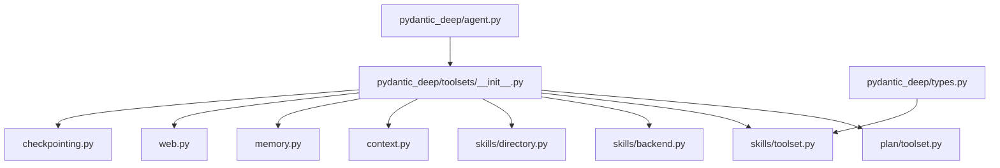
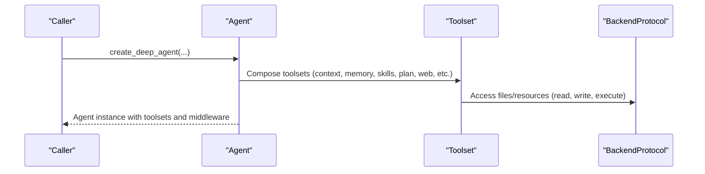
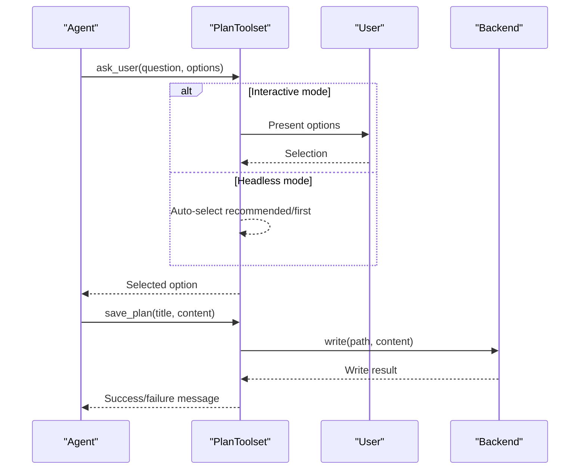
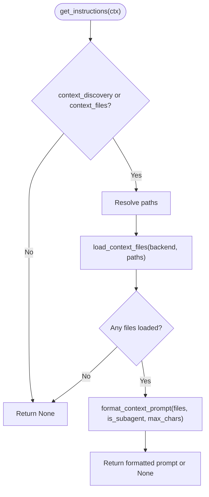
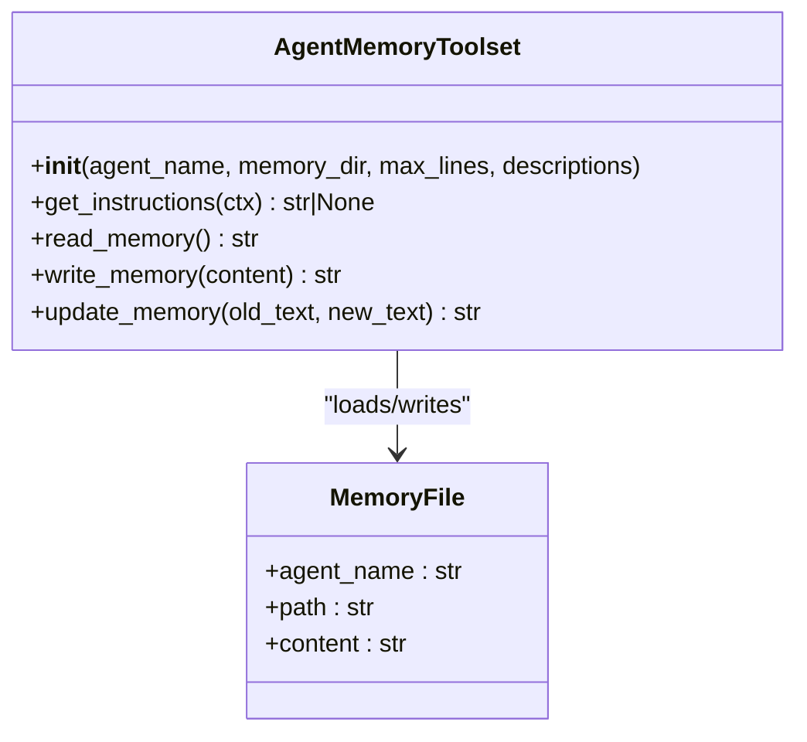
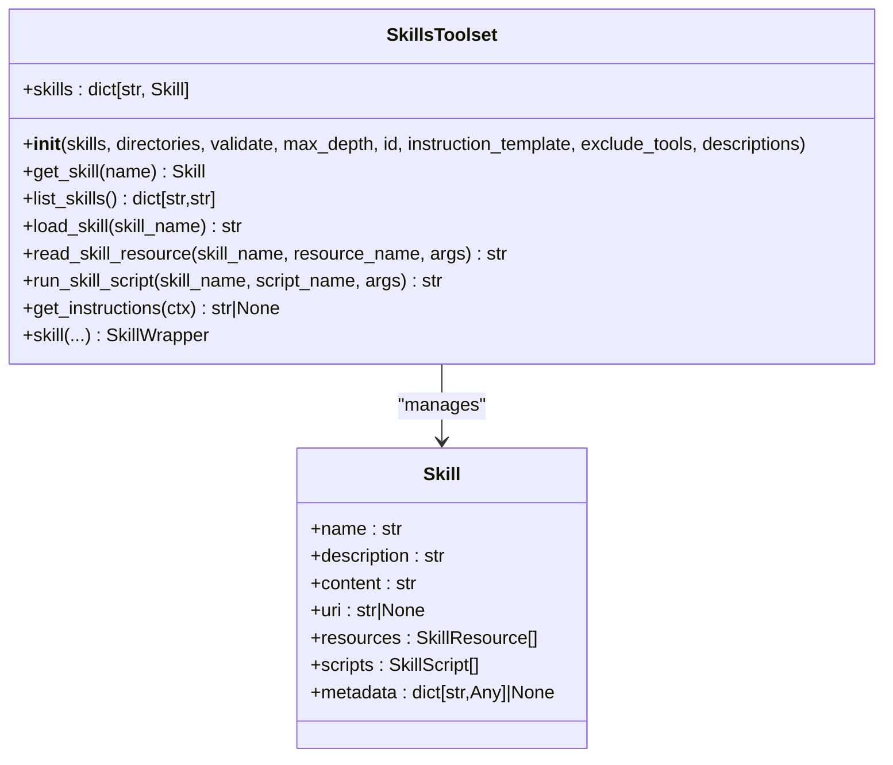
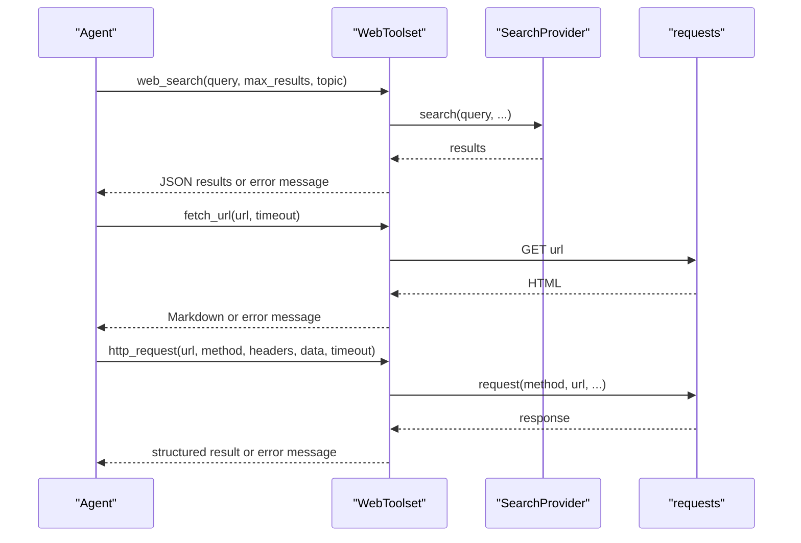
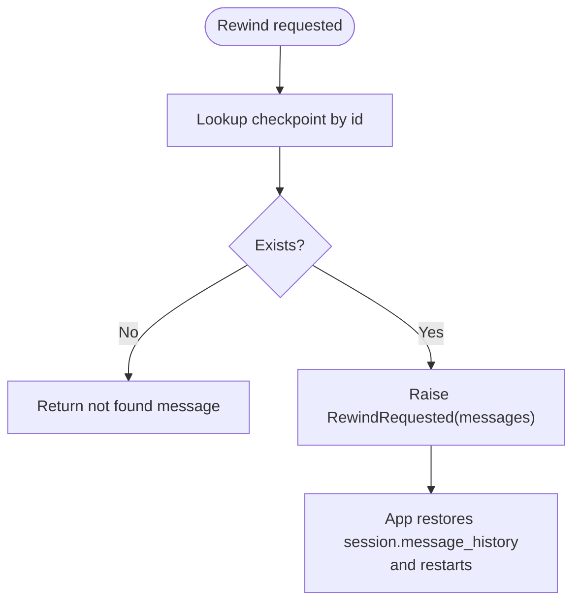
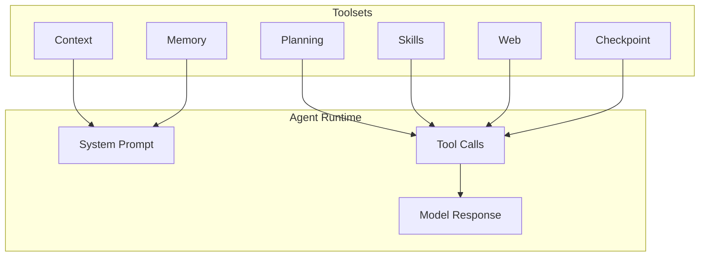
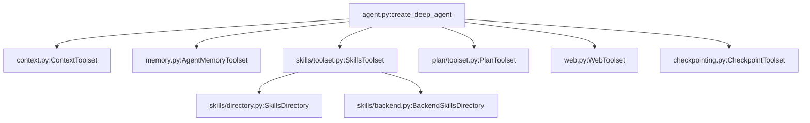

# Toolset APIs

<cite>
**Referenced Files in This Document**
- [__init__.py](file://pydantic_deep/toolsets/__init__.py)
- [context.py](file://pydantic_deep/toolsets/context.py)
- [memory.py](file://pydantic_deep/toolsets/memory.py)
- [plan/toolset.py](file://pydantic_deep/toolsets/plan/toolset.py)
- [skills/toolset.py](file://pydantic_deep/toolsets/skills/toolset.py)
- [skills/backend.py](file://pydantic_deep/toolsets/skills/backend.py)
- [skills/directory.py](file://pydantic_deep/toolsets/skills/directory.py)
- [web.py](file://pydantic_deep/toolsets/web.py)
- [checkpointing.py](file://pydantic_deep/toolsets/checkpointing.py)
- [agent.py](file://pydantic_deep/agent.py)
- [types.py](file://pydantic_deep/types.py)
</cite>

## Table of Contents
1. [Introduction](#introduction)
2. [Project Structure](#project-structure)
3. [Core Components](#core-components)
4. [Architecture Overview](#architecture-overview)
5. [Detailed Component Analysis](#detailed-component-analysis)
6. [Dependency Analysis](#dependency-analysis)
7. [Performance Considerations](#performance-considerations)
8. [Troubleshooting Guide](#troubleshooting-guide)
9. [Conclusion](#conclusion)
10. [Appendices](#appendices)

## Introduction
This document provides comprehensive API documentation for the toolset interfaces and tool implementations in the pydantic-deep agent framework. It covers the planning toolset for task decomposition, the context toolset for automatic context injection, the memory toolset for persistent storage, the skills toolset for capability extensions, and the subagent toolset for multi-agent orchestration. For each toolset, we describe base classes, method signatures, parameter specifications, return value formats, examples, parameter validation, error handling, and integration patterns with the agent framework.

## Project Structure
The toolsets are organized under pydantic_deep/toolsets, with dedicated modules for each toolset family. The main entry point for toolsets is the package initializer, which re-exports commonly used toolsets and factories.

**Diagram sources**
- [__init__.py:1-25](file://pydantic_deep/toolsets/__init__.py#L1-L25)
- [plan/toolset.py:1-220](file://pydantic_deep/toolsets/plan/toolset.py#L1-L220)
- [skills/toolset.py:1-598](file://pydantic_deep/toolsets/skills/toolset.py#L1-L598)
- [skills/backend.py:1-565](file://pydantic_deep/toolsets/skills/backend.py#L1-L565)
- [skills/directory.py:1-532](file://pydantic_deep/toolsets/skills/directory.py#L1-L532)
- [context.py:1-208](file://pydantic_deep/toolsets/context.py#L1-L208)
- [memory.py:1-231](file://pydantic_deep/toolsets/memory.py#L1-L231)
- [web.py:1-408](file://pydantic_deep/toolsets/web.py#L1-L408)
- [checkpointing.py:1-603](file://pydantic_deep/toolsets/checkpointing.py#L1-L603)
- [agent.py:1-1001](file://pydantic_deep/agent.py#L1-L1001)
- [types.py:1-99](file://pydantic_deep/types.py#L1-L99)

**Section sources**
- [__init__.py:1-25](file://pydantic_deep/toolsets/__init__.py#L1-L25)

## Core Components
- Planning toolset: Provides ask_user and save_plan tools for interactive planning and plan persistence.
- Context toolset: Loads and injects project context files into the system prompt.
- Memory toolset: Manages persistent agent memory with read, write, and update operations.
- Skills toolset: Integrates skill discovery and management with agent capabilities.
- Web toolset: Provides web search, URL fetching, and HTTP request tools.
- Checkpoint toolset: Enables conversation checkpointing, listing, and rewinding.

Integration with the agent framework is handled by the agent factory, which composes toolsets and middleware according to configuration flags and parameters.

**Section sources**
- [plan/toolset.py:139-220](file://pydantic_deep/toolsets/plan/toolset.py#L139-L220)
- [context.py:150-208](file://pydantic_deep/toolsets/context.py#L150-L208)
- [memory.py:130-231](file://pydantic_deep/toolsets/memory.py#L130-L231)
- [skills/toolset.py:112-598](file://pydantic_deep/toolsets/skills/toolset.py#L112-L598)
- [web.py:214-408](file://pydantic_deep/toolsets/web.py#L214-L408)
- [checkpointing.py:448-603](file://pydantic_deep/toolsets/checkpointing.py#L448-L603)
- [agent.py:196-800](file://pydantic_deep/agent.py#L196-L800)

## Architecture Overview
The agent factory constructs a toolset list and passes it to the Agent constructor. Each toolset contributes tools and/or system prompt instructions. Middleware and processors augment behavior (e.g., context management, eviction, history archiving).

**Diagram sources**
- [agent.py:196-800](file://pydantic_deep/agent.py#L196-L800)
- [context.py:150-208](file://pydantic_deep/toolsets/context.py#L150-L208)
- [memory.py:130-231](file://pydantic_deep/toolsets/memory.py#L130-L231)
- [skills/toolset.py:112-598](file://pydantic_deep/toolsets/skills/toolset.py#L112-L598)
- [plan/toolset.py:139-220](file://pydantic_deep/toolsets/plan/toolset.py#L139-L220)
- [web.py:214-408](file://pydantic_deep/toolsets/web.py#L214-L408)
- [checkpointing.py:448-603](file://pydantic_deep/toolsets/checkpointing.py#L448-L603)

## Detailed Component Analysis

### Planning Toolset
The planning toolset enables interactive planning with ask_user and save_plan tools. It is integrated into the agent as a built-in planner subagent when enabled.

- Toolset factory: create_plan_toolset
- Tools:
  - ask_user(question: str, options: list[dict[str, str]]) -> str
  - save_plan(title: str, content: str) -> str

Parameters and validation:
- ask_user requires 2–4 options with label, description, and optional recommended flag. Options list must not be empty.
- save_plan generates a slugified filename from title and appends a UUID segment; writes to plans_dir.

Return values:
- ask_user returns either the selected option label (auto-selected in headless mode) or a callback result.
- save_plan returns a success message with the saved path or an error message.

Error handling:
- Headless mode auto-selects recommended or first option if none provided.
- Backend write errors are surfaced as error messages.

Integration:
- The agent factory conditionally adds the planner subagent with predefined description and instructions.

**Diagram sources**
- [plan/toolset.py:139-220](file://pydantic_deep/toolsets/plan/toolset.py#L139-L220)

**Section sources**
- [plan/toolset.py:139-220](file://pydantic_deep/toolsets/plan/toolset.py#L139-L220)
- [agent.py:477-495](file://pydantic_deep/agent.py#L477-L495)

### Context Toolset
The context toolset loads project context files and injects them into the system prompt. It supports explicit file lists, auto-discovery, subagent filtering, and content truncation.

Key functions and classes:
- load_context_files(backend, paths) -> list[ContextFile]
- discover_context_files(backend, search_path, filenames) -> list[str]
- format_context_prompt(files, is_subagent, subagent_allowlist, max_chars) -> str
- ContextToolset.__init__(context_files=None, context_discovery=False, is_subagent=False, max_chars=DEFAULT_MAX_CONTEXT_CHARS)
- ContextToolset.get_instructions(ctx) -> str | None

Parameters:
- context_files: explicit list of file paths
- context_discovery: whether to auto-discover context files
- is_subagent: applies subagent filtering rules
- max_chars: per-file truncation threshold

Return values:
- get_instructions returns formatted context prompt or None if no files.

Validation and error handling:
- Missing files are silently skipped during loading.
- Truncation preserves head and tail with a truncation marker.
- Subagent filtering restricts visible files to an allowlist.

**Diagram sources**
- [context.py:181-208](file://pydantic_deep/toolsets/context.py#L181-L208)

**Section sources**
- [context.py:47-208](file://pydantic_deep/toolsets/context.py#L47-L208)
- [agent.py:561-570](file://pydantic_deep/agent.py#L561-L570)

### Memory Toolset
The memory toolset provides persistent memory per agent/subagent with read, append, and update operations. It auto-injects memory into the system prompt.

Key classes and functions:
- get_memory_path(memory_dir, agent_name) -> str
- load_memory(backend, path, agent_name) -> MemoryFile | None
- format_memory_prompt(memory, max_lines) -> str
- AgentMemoryToolset.__init__(agent_name="main", memory_dir=DEFAULT_MEMORY_DIR, max_lines=DEFAULT_MAX_MEMORY_LINES, descriptions=None)
- AgentMemoryToolset.get_instructions(ctx) -> str | None

Tools:
- read_memory() -> str
- write_memory(content: str) -> str
- update_memory(old_text: str, new_text: str) -> str

Parameters:
- agent_name: identifies the agent owner
- memory_dir: base directory for memory files
- max_lines: truncation threshold for system prompt injection

Return values:
- read_memory returns full memory content or a message indicating no memory exists
- write_memory returns a summary of updated line count
- update_memory returns a summary or a not-found message

Validation and error handling:
- write_memory appends with proper newlines
- update_memory replaces only the first occurrence and checks for presence of old_text

**Diagram sources**
- [memory.py:130-231](file://pydantic_deep/toolsets/memory.py#L130-L231)

**Section sources**
- [memory.py:69-231](file://pydantic_deep/toolsets/memory.py#L69-L231)
- [agent.py:584-611](file://pydantic_deep/agent.py#L584-L611)

### Skills Toolset
The skills toolset integrates skill discovery and management with Pydantic AI agents. It supports programmatic skills, filesystem-based discovery, backend-based discovery, and dynamic system prompt injection.

Key classes and functions:
- SkillsToolset.__init__(skills=None, directories=None, validate=True, max_depth=3, id=None, instruction_template=None, exclude_tools=None, descriptions=None)
- list_skills() -> dict[str, str]
- load_skill(skill_name: str) -> str
- read_skill_resource(skill_name: str, resource_name: str, args: dict[str, Any] | None = None) -> str
- run_skill_script(skill_name: str, script_name: str, args: dict[str, Any] | None = None) -> str
- get_instructions(ctx) -> str | None
- skill(...) -> SkillWrapper (decorator)
- get_skill(name: str) -> Skill

Parameters and validation:
- exclude_tools must be a subset of ["list_skills", "load_skill", "read_skill_resource", "run_skill_script"]
- Skill name validation enforces lowercase, numbers, and hyphens; length limit; uniqueness warnings on duplicates
- Directory-based discovery supports depth limits and resource/script discovery with safety checks

Return values:
- list_skills returns a mapping of skill name to description
- load_skill returns a structured XML-like skill document
- read_skill_resource returns resource content or error message
- run_skill_script returns script output or error message
- get_instructions returns a skills header with available skills

Integration:
- The agent factory constructs SkillsToolset with provided skills and/or directories and injects system prompt instructions.

**Diagram sources**
- [skills/toolset.py:112-598](file://pydantic_deep/toolsets/skills/toolset.py#L112-L598)
- [types.py:34-39](file://pydantic_deep/types.py#L34-L39)

**Section sources**
- [skills/toolset.py:112-598](file://pydantic_deep/toolsets/skills/toolset.py#L112-L598)
- [skills/backend.py:397-565](file://pydantic_deep/toolsets/skills/backend.py#L397-L565)
- [skills/directory.py:444-532](file://pydantic_deep/toolsets/skills/directory.py#L444-L532)
- [agent.py:623-662](file://pydantic_deep/agent.py#L623-L662)
- [types.py:34-39](file://pydantic_deep/types.py#L34-L39)

### Web Toolset
The web toolset provides pluggable web search, URL fetching, and HTTP request tools. It returns strings and avoids raising exceptions, surfacing errors as messages.

Factory and tools:
- create_web_toolset(id=None, search_provider=None, include_search=True, include_fetch=True, include_http=True, require_approval=True, user_agent=DEFAULT_USER_AGENT, descriptions=None)
- web_search(query: str, max_results: int = 5, topic: str = "general") -> str
- fetch_url(url: str, timeout: int = 30) -> str
- http_request(url: str, method: str = "GET", headers: dict[str, str] | None = None, data: str | None = None, timeout: int = 30) -> str

Parameters:
- search_provider: pluggable provider implementing SearchProvider protocol
- require_approval: approval gating for tools
- user_agent: default User-Agent header
- max_results: capped at 10

Return values:
- web_search returns JSON of results or error message
- fetch_url returns markdown content or error message
- http_request returns a structured result with success, status_code, url, and content

Validation and error handling:
- Imports guarded with descriptive error messages
- Requests exceptions caught and returned as messages
- fetch_url truncates long content with a marker

**Diagram sources**
- [web.py:214-408](file://pydantic_deep/toolsets/web.py#L214-L408)

**Section sources**
- [web.py:214-408](file://pydantic_deep/toolsets/web.py#L214-L408)
- [agent.py:709-718](file://pydantic_deep/agent.py#L709-L718)

### Checkpoint Toolset
The checkpoint toolset enables conversation checkpointing, listing, and rewinding. It integrates with middleware for auto-saving and provides manual controls.

Classes and functions:
- Checkpoint(id, label, turn, messages, message_count, created_at, metadata)
- RewindRequested(checkpoint_id, label, messages) -> Exception
- CheckpointStore protocol (save, get, get_by_label, list_all, remove, remove_oldest, count, clear)
- InMemoryCheckpointStore, FileCheckpointStore
- CheckpointMiddleware(before_model_request, after_tool_call)
- CheckpointToolset.__init__(store=None, id="deep-checkpoints", descriptions=None)
- save_checkpoint(label: str) -> str
- list_checkpoints() -> str
- rewind_to(checkpoint_id: str) -> str

Parameters:
- store: fallback store; resolved from ctx.deps.checkpoint_store at runtime
- frequency: "every_turn", "every_tool", "manual_only"
- max_checkpoints: pruning limit

Return values:
- save_checkpoint returns a labeled checkpoint summary or a message indicating no checkpoint is available
- list_checkpoints returns a formatted list of checkpoints
- rewind_to raises RewindRequested to signal app-level rewind

Validation and error handling:
- RewindRequested bubbles up from rewind_to to allow application-level restoration
- Store operations guarded by existence checks and descriptive messages

**Diagram sources**
- [checkpointing.py:533-556](file://pydantic_deep/toolsets/checkpointing.py#L533-L556)

**Section sources**
- [checkpointing.py:448-603](file://pydantic_deep/toolsets/checkpointing.py#L448-L603)
- [agent.py:691-701](file://pydantic_deep/agent.py#L691-L701)

### Conceptual Overview
The toolsets collectively extend the agent’s capabilities:
- Planning: decompose tasks and persist plans
- Context: inject project context into system prompts
- Memory: maintain persistent agent memory
- Skills: modular capabilities with resources and scripts
- Web: external knowledge and API access
- Checkpointing: reliable session recovery

[No sources needed since this diagram shows conceptual workflow, not actual code structure]

[No sources needed since this section doesn't analyze specific source files]

## Dependency Analysis
The agent factory composes toolsets and middleware based on configuration flags. Skills toolset depends on skills types and directory/backend discovery modules. Context and memory toolsets depend on the backend protocol. Web toolset depends on optional external libraries. Checkpoint toolset depends on middleware and storage protocols.

**Diagram sources**
- [agent.py:196-800](file://pydantic_deep/agent.py#L196-L800)
- [context.py:150-208](file://pydantic_deep/toolsets/context.py#L150-L208)
- [memory.py:130-231](file://pydantic_deep/toolsets/memory.py#L130-L231)
- [skills/toolset.py:112-598](file://pydantic_deep/toolsets/skills/toolset.py#L112-L598)
- [skills/directory.py:444-532](file://pydantic_deep/toolsets/skills/directory.py#L444-L532)
- [skills/backend.py:397-565](file://pydantic_deep/toolsets/skills/backend.py#L397-L565)
- [plan/toolset.py:139-220](file://pydantic_deep/toolsets/plan/toolset.py#L139-L220)
- [web.py:214-408](file://pydantic_deep/toolsets/web.py#L214-L408)
- [checkpointing.py:448-603](file://pydantic_deep/toolsets/checkpointing.py#L448-L603)

**Section sources**
- [agent.py:196-800](file://pydantic_deep/agent.py#L196-L800)

## Performance Considerations
- Context and memory toolsets support truncation to manage token budgets.
- Skills toolset supports depth-limited discovery and resource/script safety checks.
- Web toolset caps max_results and truncates fetch_url output.
- Checkpoint toolset prunes older checkpoints to limit storage growth.
- Eviction processor can reduce tool output size before summarization.

[No sources needed since this section provides general guidance]

## Troubleshooting Guide
Common issues and resolutions:
- Missing API keys or packages: web toolset requires TAVILY_API_KEY and optional dependencies; errors are returned as messages.
- Invalid skill names or duplicates: skills toolset validates names and warns on duplicates.
- Backend read/write failures: context and memory toolsets return descriptive messages; web toolset handles request exceptions gracefully.
- Checkpoint not found: rewind_to returns a not-found message; ensure correct checkpoint_id.

**Section sources**
- [web.py:278-287](file://pydantic_deep/toolsets/web.py#L278-L287)
- [skills/toolset.py:194-206](file://pydantic_deep/toolsets/skills/toolset.py#L194-L206)
- [context.py:62-70](file://pydantic_deep/toolsets/context.py#L62-L70)
- [memory.py:176-192](file://pydantic_deep/toolsets/memory.py#L176-L192)
- [checkpointing.py:540-550](file://pydantic_deep/toolsets/checkpointing.py#L540-L550)

## Conclusion
The toolset APIs provide a cohesive extension mechanism for pydantic-deep agents. Planning, context, memory, skills, web, and checkpoint toolsets integrate seamlessly with the agent factory and middleware pipeline. Their documented interfaces, parameter specifications, return formats, validation, and error handling enable robust multi-agent workflows and reliable session management.

## Appendices
- Integration patterns:
  - Enable planner subagent via include_plan and include_subagents flags.
  - Configure context and memory per agent/subagent using ContextToolset and AgentMemoryToolset.
  - Supply skills via programmatic Skill instances or directory/backend discovery.
  - Gate sensitive tools with require_approval and interrupt_on settings.
  - Use checkpoint middleware and toolset for reliable recovery and forking.

**Section sources**
- [agent.py:256-800](file://pydantic_deep/agent.py#L256-L800)
- [plan/toolset.py:139-220](file://pydantic_deep/toolsets/plan/toolset.py#L139-L220)
- [context.py:150-208](file://pydantic_deep/toolsets/context.py#L150-L208)
- [memory.py:130-231](file://pydantic_deep/toolsets/memory.py#L130-L231)
- [skills/toolset.py:112-598](file://pydantic_deep/toolsets/skills/toolset.py#L112-L598)
- [web.py:214-408](file://pydantic_deep/toolsets/web.py#L214-L408)
- [checkpointing.py:448-603](file://pydantic_deep/toolsets/checkpointing.py#L448-L603)