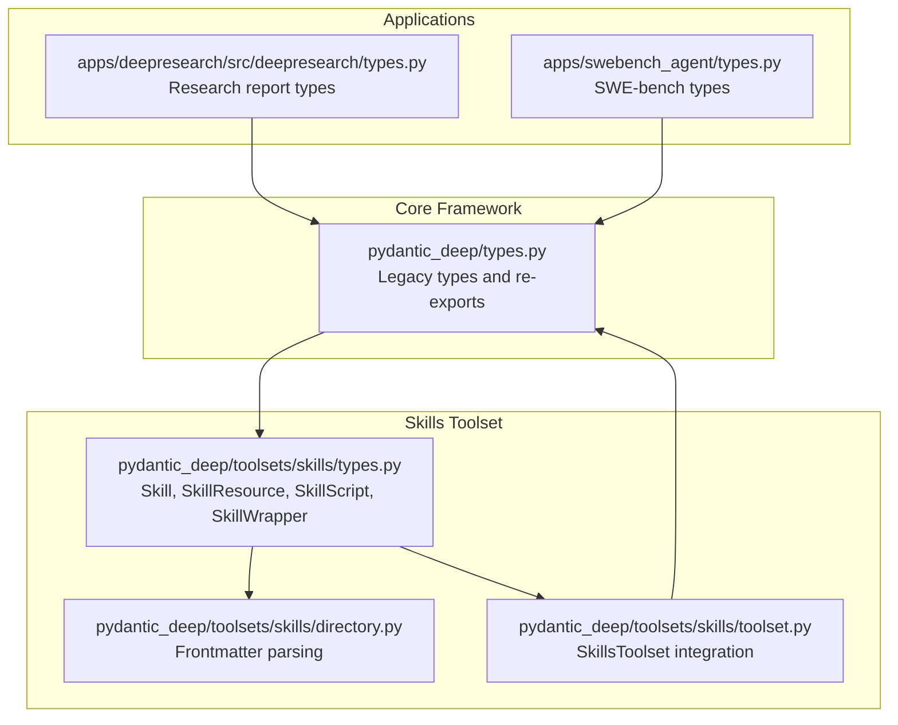
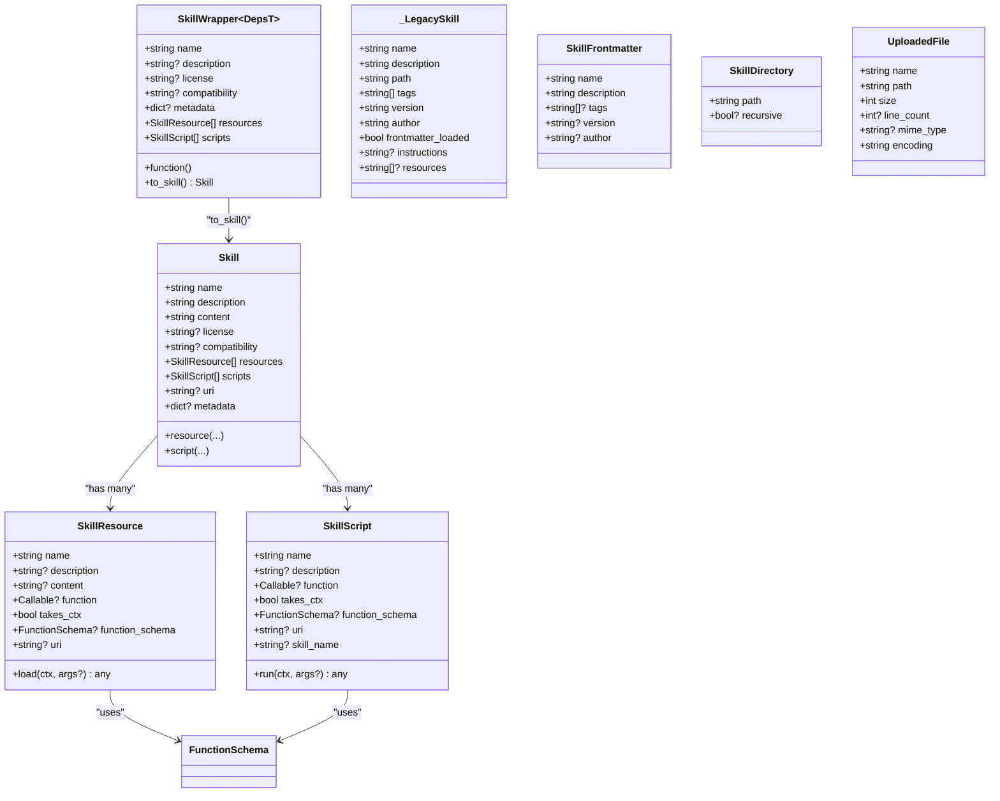
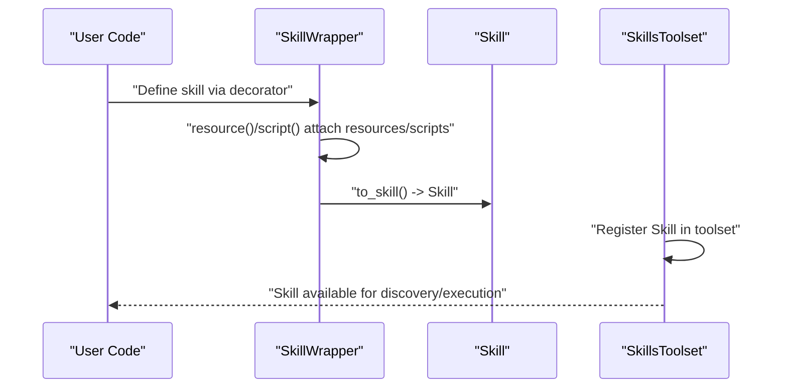
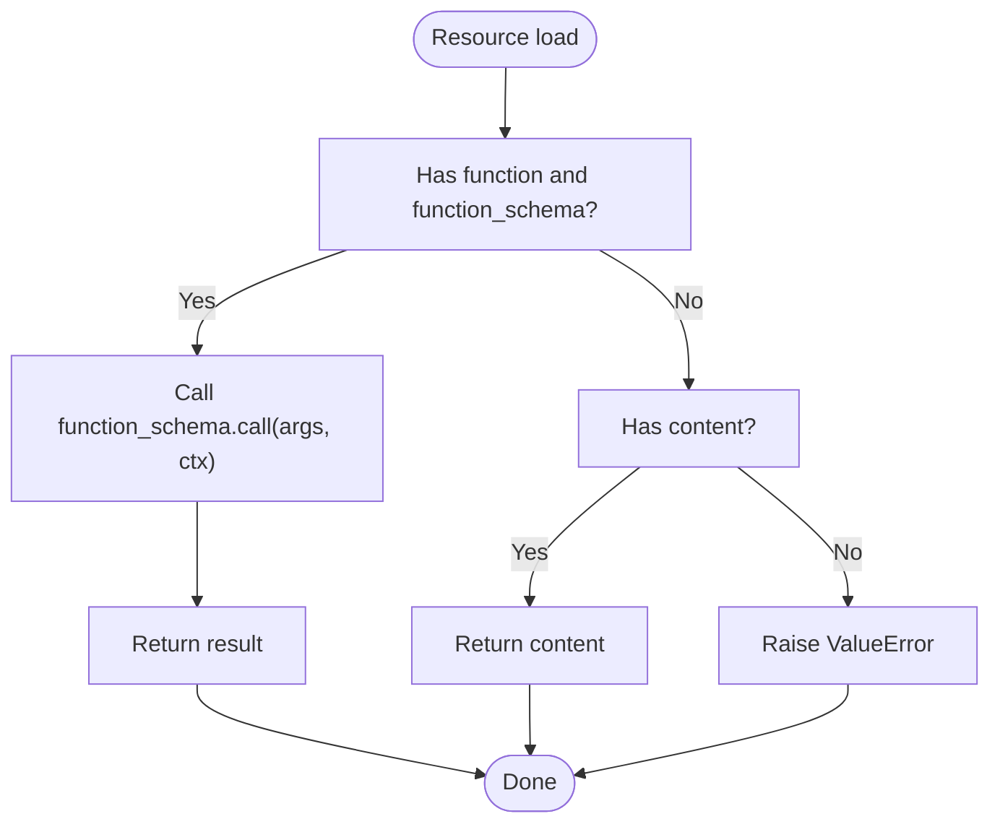
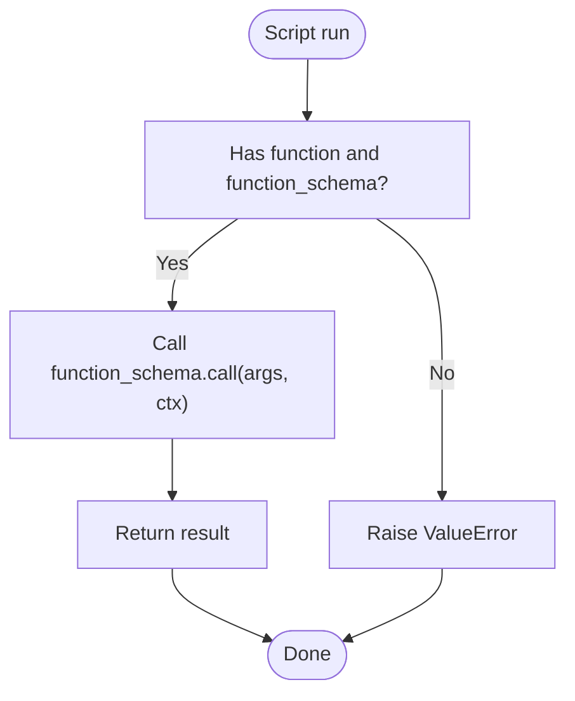
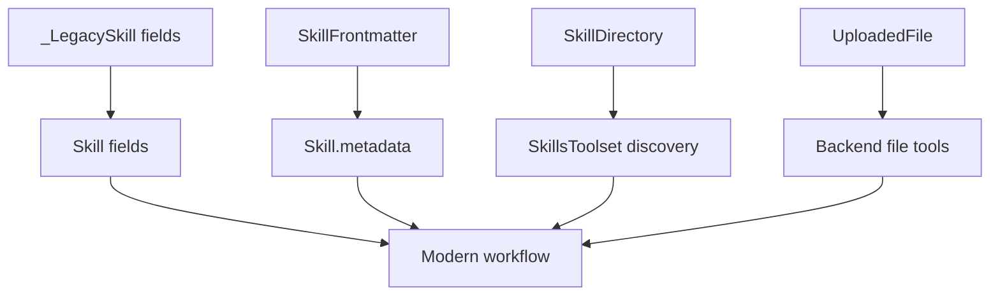
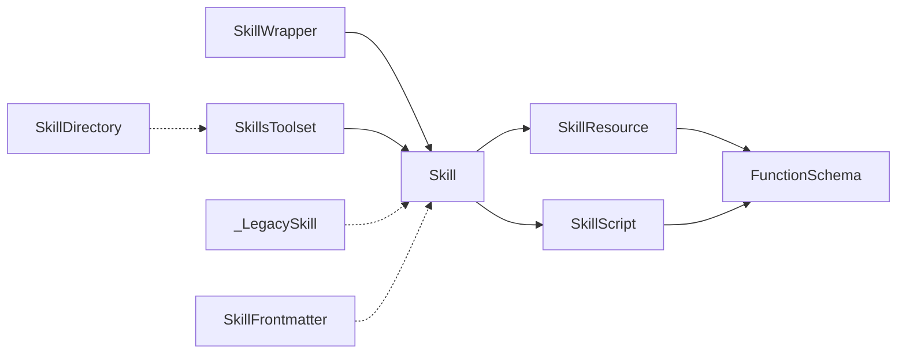

# Type Definitions

<cite>
**Referenced Files in This Document**
- [pydantic_deep/types.py](file://pydantic_deep/types.py)
- [pydantic_deep/toolsets/skills/types.py](file://pydantic_deep/toolsets/skills/types.py)
- [pydantic_deep/toolsets/skills/directory.py](file://pydantic_deep/toolsets/skills/directory.py)
- [pydantic_deep/toolsets/skills/toolset.py](file://pydantic_deep/toolsets/skills/toolset.py)
- [apps/deepresearch/src/deepresearch/types.py](file://apps/deepresearch/src/deepresearch/types.py)
- [apps/swebench_agent/types.py](file://apps/swebench_agent/types.py)
- [tests/test_skills.py](file://tests/test_skills.py)
- [examples/skills_usage.py](file://examples/skills_usage.py)
</cite>

## Table of Contents
1. [Introduction](#introduction)
2. [Project Structure](#project-structure)
3. [Core Components](#core-components)
4. [Architecture Overview](#architecture-overview)
5. [Detailed Component Analysis](#detailed-component-analysis)
6. [Dependency Analysis](#dependency-analysis)
7. [Performance Considerations](#performance-considerations)
8. [Troubleshooting Guide](#troubleshooting-guide)
9. [Conclusion](#conclusion)

## Introduction
This document provides a comprehensive guide to the public type definitions and data structures used across the framework. It focuses on:
- Skill dataclass and related types for skills toolset
- Legacy and modern frontmatter and directory types
- Uploaded file metadata
- Supporting types used in research and evaluation contexts

It explains field definitions, type annotations, required versus optional fields, validation rules, serialization patterns, and migration guidance between legacy and modern formats. Practical usage examples and diagrams illustrate how these types are used in real-world scenarios.

## Project Structure
The type definitions span several modules:
- Core framework types (legacy and modern): pydantic_deep/types.py
- Skills toolset types: pydantic_deep/toolsets/skills/types.py
- Skills directory and frontmatter parsing: pydantic_deep/toolsets/skills/directory.py
- Skills toolset composition: pydantic_deep/toolsets/skills/toolset.py
- Application-specific types (research and SWE-bench): apps/deepresearch/src/deepresearch/types.py and apps/swebench_agent/types.py
- Tests and examples demonstrate usage and validation

**Diagram sources**
- [pydantic_deep/types.py:1-99](file://pydantic_deep/types.py#L1-L99)
- [pydantic_deep/toolsets/skills/types.py:1-521](file://pydantic_deep/toolsets/skills/types.py#L1-L521)
- [pydantic_deep/toolsets/skills/directory.py:124-213](file://pydantic_deep/toolsets/skills/directory.py#L124-L213)
- [pydantic_deep/toolsets/skills/toolset.py:465-499](file://pydantic_deep/toolsets/skills/toolset.py#L465-L499)
- [apps/deepresearch/src/deepresearch/types.py:1-72](file://apps/deepresearch/src/deepresearch/types.py#L1-L72)
- [apps/swebench_agent/types.py:1-77](file://apps/swebench_agent/types.py#L1-L77)

**Section sources**
- [pydantic_deep/types.py:1-99](file://pydantic_deep/types.py#L1-L99)
- [pydantic_deep/toolsets/skills/types.py:1-521](file://pydantic_deep/toolsets/skills/types.py#L1-L521)
- [pydantic_deep/toolsets/skills/directory.py:124-213](file://pydantic_deep/toolsets/skills/directory.py#L124-L213)
- [pydantic_deep/toolsets/skills/toolset.py:465-499](file://pydantic_deep/toolsets/skills/toolset.py#L465-L499)
- [apps/deepresearch/src/deepresearch/types.py:1-72](file://apps/deepresearch/src/deepresearch/types.py#L1-L72)
- [apps/swebench_agent/types.py:1-77](file://apps/swebench_agent/types.py#L1-L77)

## Core Components
This section summarizes the primary types and their roles.

- Skill (dataclass)
  - Purpose: Represents a skill with metadata, content, resources, and scripts.
  - Fields: name, description, content, license (optional), compatibility (optional), resources (list), scripts (list), uri (optional), metadata (optional).
  - Validation: Enforced by decorators and post-init checks; name normalization enforced separately.
  - Serialization: Used as-is; integrates with toolset and backend systems.

- SkillResource (dataclass)
  - Purpose: A skill resource that can be static content, a callable, or a URI-backed file.
  - Fields: name, description (optional), content (optional), function (optional), takes_ctx (bool), function_schema (optional), uri (optional).
  - Validation: Post-init ensures either content, function, or uri is set; function requires function_schema.

- SkillScript (dataclass)
  - Purpose: An executable script within a skill, either callable or file-based.
  - Fields: name, description (optional), function (optional), takes_ctx (bool), function_schema (optional), uri (optional), skill_name (optional).
  - Validation: Post-init ensures either function or uri is set; function requires function_schema.

- SkillWrapper (Generic)
  - Purpose: Decorator-based wrapper to assemble a Skill with typed resources/scripts.
  - Methods: resource(), script(), to_skill().
  - Serialization: Converts to Skill via to_skill().

- Legacy types (deprecated)
  - _LegacySkill (TypedDict): Legacy representation of a loaded skill.
  - SkillFrontmatter (TypedDict): YAML frontmatter from SKILL.md.
  - SkillDirectory (TypedDict): Legacy skills directory configuration.
  - UploadedFile (TypedDict): Metadata for uploaded files.

- Modern re-exports
  - Skill is re-exported from the skills package for unified access.

**Section sources**
- [pydantic_deep/toolsets/skills/types.py:75-339](file://pydantic_deep/toolsets/skills/types.py#L75-L339)
- [pydantic_deep/toolsets/skills/types.py:341-521](file://pydantic_deep/toolsets/skills/types.py#L341-L521)
- [pydantic_deep/types.py:45-99](file://pydantic_deep/types.py#L45-L99)

## Architecture Overview
The type system supports two complementary workflows:
- Modern skills: Skill, SkillResource, SkillScript, SkillWrapper
- Legacy compatibility: _LegacySkill, SkillFrontmatter, SkillDirectory, UploadedFile

**Diagram sources**
- [pydantic_deep/toolsets/skills/types.py:75-339](file://pydantic_deep/toolsets/skills/types.py#L75-L339)
- [pydantic_deep/toolsets/skills/types.py:341-521](file://pydantic_deep/toolsets/skills/types.py#L341-L521)
- [pydantic_deep/types.py:45-99](file://pydantic_deep/types.py#L45-L99)

## Detailed Component Analysis

### Skill (dataclass)
- Purpose: Central representation of a skill with metadata, content, and extensible resources/scripts.
- Required fields: name, description, content.
- Optional fields: license, compatibility, resources, scripts, uri, metadata.
- Validation:
  - Name normalization enforced by normalize_skill_name (regex pattern allows lowercase letters, digits, and hyphens; no consecutive hyphens; max length 64).
  - Decorators (resource, script) auto-generate function_schema and detect takes_ctx.
- Usage patterns:
  - Programmatic construction with fields.
  - Decorator-based assembly via SkillWrapper.to_skill().
  - Integration with skills toolset for discovery and execution.

**Diagram sources**
- [pydantic_deep/toolsets/skills/types.py:341-521](file://pydantic_deep/toolsets/skills/types.py#L341-L521)
- [pydantic_deep/toolsets/skills/toolset.py:485-499](file://pydantic_deep/toolsets/skills/toolset.py#L485-L499)

**Section sources**
- [pydantic_deep/toolsets/skills/types.py:180-339](file://pydantic_deep/toolsets/skills/types.py#L180-L339)
- [tests/test_skills.py:169-227](file://tests/test_skills.py#L169-L227)

### SkillResource (dataclass)
- Purpose: Encapsulates a skill resource that can be static content, a callable, or a file-backed resource.
- Required fields: name.
- Optional fields: description, content, function, takes_ctx, function_schema, uri.
- Validation:
  - Post-init enforces that at least one of content, function, or uri is present.
  - If function is provided, function_schema must also be provided.
- Execution:
  - load(ctx, args?): resolves content from function_schema.call(args, ctx) if callable; otherwise returns content; raises error if none available.

**Diagram sources**
- [pydantic_deep/toolsets/skills/types.py:97-125](file://pydantic_deep/toolsets/skills/types.py#L97-L125)

**Section sources**
- [pydantic_deep/toolsets/skills/types.py:75-125](file://pydantic_deep/toolsets/skills/types.py#L75-L125)
- [tests/test_skills.py:106-136](file://tests/test_skills.py#L106-L136)

### SkillScript (dataclass)
- Purpose: Encapsulates a skill script that can be a callable or a file-backed script.
- Required fields: name.
- Optional fields: description, function, takes_ctx, function_schema, uri, skill_name.
- Validation:
  - Post-init enforces that at least one of function or uri is present.
  - If function is provided, function_schema must also be provided.
- Execution:
  - run(ctx, args?): resolves output via function_schema.call(args, ctx) if callable; otherwise raises error.

**Diagram sources**
- [pydantic_deep/toolsets/skills/types.py:151-177](file://pydantic_deep/toolsets/skills/types.py#L151-L177)

**Section sources**
- [pydantic_deep/toolsets/skills/types.py:127-177](file://pydantic_deep/toolsets/skills/types.py#L127-L177)
- [tests/test_skills.py:143-162](file://tests/test_skills.py#L143-L162)

### SkillWrapper (Generic)
- Purpose: Provides a typed, decorator-driven way to assemble a Skill with resources and scripts.
- Methods:
  - resource(...): registers a callable resource with automatic schema generation.
  - script(...): registers a callable script with automatic schema generation.
  - to_skill(): converts wrapper to Skill.
- Serialization: to_skill() produces a Skill suitable for toolset registration.

**Section sources**
- [pydantic_deep/toolsets/skills/types.py:341-521](file://pydantic_deep/toolsets/skills/types.py#L341-L521)
- [tests/test_skills.py:234-358](file://tests/test_skills.py#L234-L358)

### Legacy Types and Migration Guidance
- _LegacySkill (TypedDict)
  - Deprecated in favor of Skill dataclass.
  - Fields: name, description, path, tags, version, author, frontmatter_loaded, instructions (optional), resources (optional).
  - Migration: Convert to Skill with equivalent fields; use resource/script decorators to migrate dynamic content.

- SkillFrontmatter (TypedDict)
  - Deprecated in favor of parsing frontmatter into Skill metadata.
  - Fields: name, description, tags (optional), version (optional), author (optional).
  - Migration: Parse frontmatter into Skill metadata and resources.

- SkillDirectory (TypedDict)
  - Deprecated in favor of SkillsDirectory class from skills module.
  - Fields: path (required), recursive (optional).
  - Migration: Use SkillsToolset and directory discovery APIs.

- UploadedFile (TypedDict)
  - Represents uploaded file metadata for backend access.
  - Fields: name, path, size, line_count (optional), mime_type (optional), encoding.
  - Migration: Continue using as-is; integrates with backend file tools.

**Diagram sources**
- [pydantic_deep/types.py:45-99](file://pydantic_deep/types.py#L45-L99)
- [pydantic_deep/toolsets/skills/types.py:180-234](file://pydantic_deep/toolsets/skills/types.py#L180-L234)

**Section sources**
- [pydantic_deep/types.py:45-99](file://pydantic_deep/types.py#L45-L99)

### Application-Specific Types

#### DeepResearch Types
- Source: Pydantic BaseModel-based types for research citations and reports.
  - Source: id (int), title (str), url (str), author (str?), date (str?), source_type (str default "web").
  - Finding: claim (str), evidence (str), source_ids (list[int]), confidence (str default "medium").
  - ReportSection: title (str), content (str), findings (list[Finding] default_factory).
  - ReportMetadata: totals and durations.
  - ResearchReport: title, question, executive_summary, sections, conclusions, sources, metadata.

**Section sources**
- [apps/deepresearch/src/deepresearch/types.py:8-72](file://apps/deepresearch/src/deepresearch/types.py#L8-L72)

#### SWE-bench Types
- SWEBenchInstance: Mirrors dataset columns for evaluation instances.
- Prediction: Output format for predictions (JSONL).
- InstanceResult: Per-instance run metrics and trajectory.
- RunConfig: Evaluation run configuration.

**Section sources**
- [apps/swebench_agent/types.py:9-77](file://apps/swebench_agent/types.py#L9-L77)

## Dependency Analysis
- Skill depends on SkillResource and SkillScript; both rely on function_schema for callable resources/scripts.
- SkillWrapper composes Skill and delegates resource/script registration.
- Legacy types are re-exported for backward compatibility but deprecated in favor of modern types.
- Skills toolset integrates Skill via toolset.skill() and instruction templates.

**Diagram sources**
- [pydantic_deep/toolsets/skills/types.py:75-339](file://pydantic_deep/toolsets/skills/types.py#L75-L339)
- [pydantic_deep/toolsets/skills/types.py:341-521](file://pydantic_deep/toolsets/skills/types.py#L341-L521)
- [pydantic_deep/toolsets/skills/toolset.py:485-499](file://pydantic_deep/toolsets/skills/toolset.py#L485-L499)
- [pydantic_deep/types.py:45-99](file://pydantic_deep/types.py#L45-L99)

**Section sources**
- [pydantic_deep/toolsets/skills/types.py:75-339](file://pydantic_deep/toolsets/skills/types.py#L75-L339)
- [pydantic_deep/toolsets/skills/types.py:341-521](file://pydantic_deep/toolsets/skills/types.py#L341-L521)
- [pydantic_deep/toolsets/skills/toolset.py:485-499](file://pydantic_deep/toolsets/skills/toolset.py#L485-L499)
- [pydantic_deep/types.py:45-99](file://pydantic_deep/types.py#L45-L99)

## Performance Considerations
- Prefer programmatic Skill construction for predictable performance; avoid heavy dynamic content in resources/scripts.
- Use file-backed resources/scripts (uri) for large content to reduce memory overhead.
- Normalize skill names early to prevent repeated validation failures.
- When serializing, keep metadata minimal; avoid large nested structures in metadata.

## Troubleshooting Guide
Common validation errors and resolutions:
- SkillResource validation
  - Error: Missing content, function, or uri.
  - Resolution: Provide at least one; if using function, ensure function_schema is set.
- SkillScript validation
  - Error: Missing function or uri.
  - Resolution: Provide function with function_schema or uri.
- Skill name normalization
  - Error: Invalid characters, consecutive hyphens, or length exceeded.
  - Resolution: Use normalize_skill_name or choose a valid name.
- Frontmatter parsing
  - Error: YAML parsing failure or missing frontmatter.
  - Resolution: Ensure valid YAML frontmatter; fallback parser handles simple cases.

**Section sources**
- [pydantic_deep/toolsets/skills/types.py:97-103](file://pydantic_deep/toolsets/skills/types.py#L97-L103)
- [pydantic_deep/toolsets/skills/types.py:151-157](file://pydantic_deep/toolsets/skills/types.py#L151-L157)
- [pydantic_deep/toolsets/skills/directory.py:184-213](file://pydantic_deep/toolsets/skills/directory.py#L184-L213)
- [tests/test_skills.py:64-87](file://tests/test_skills.py#L64-L87)

## Conclusion
The framework’s type system balances modern, validated dataclasses (Skill, SkillResource, SkillScript, SkillWrapper) with legacy compatibility (TypedDict-based types). Migrating to the modern types improves safety, clarity, and maintainability. The provided validation rules, serialization patterns, and usage examples enable robust integration with skills toolsets and application-specific workflows.