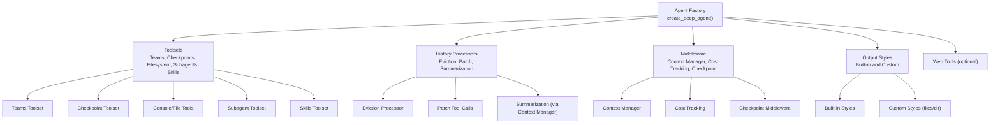
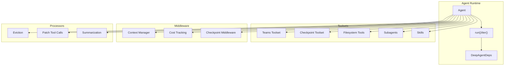
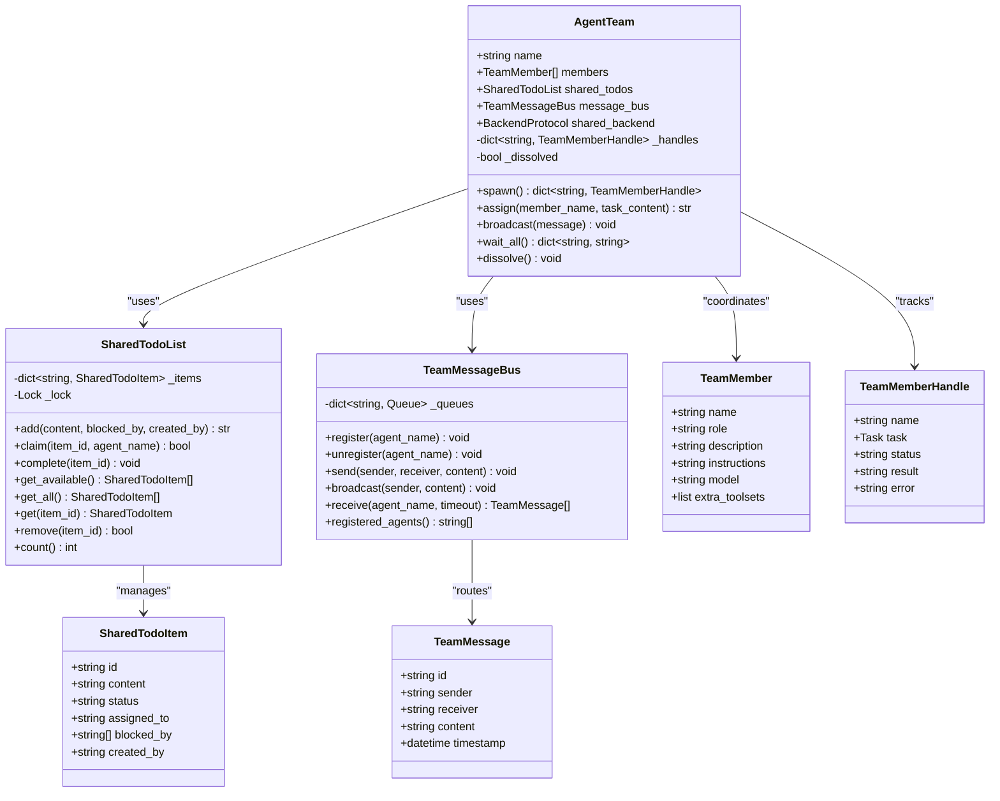
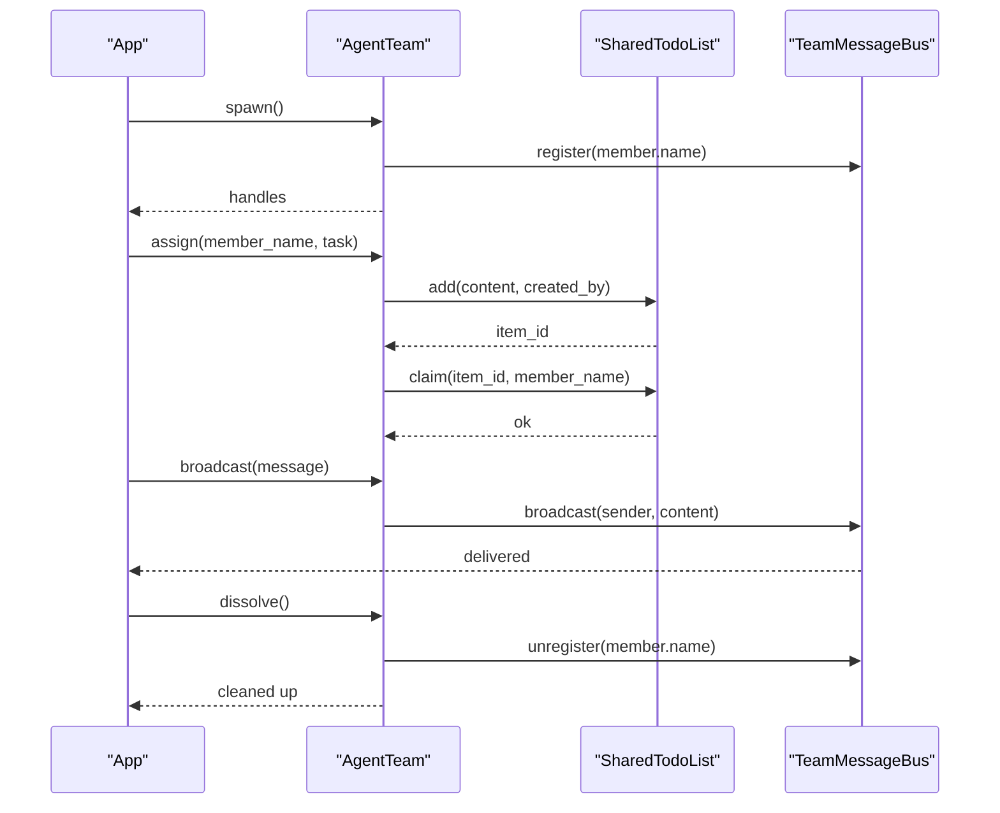
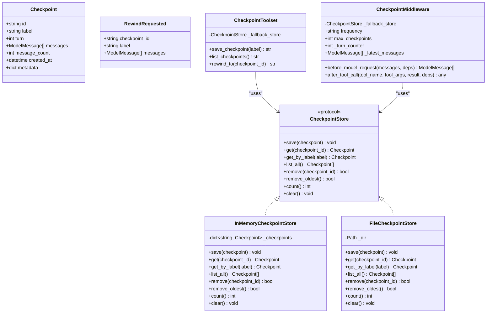
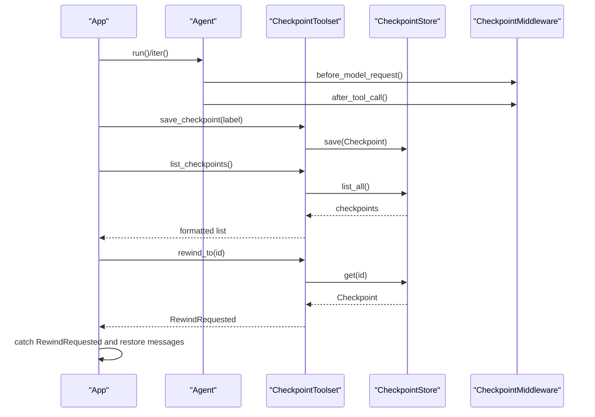
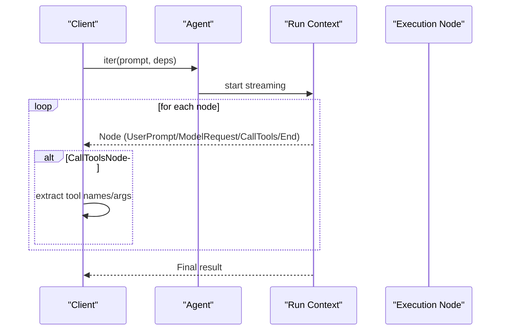
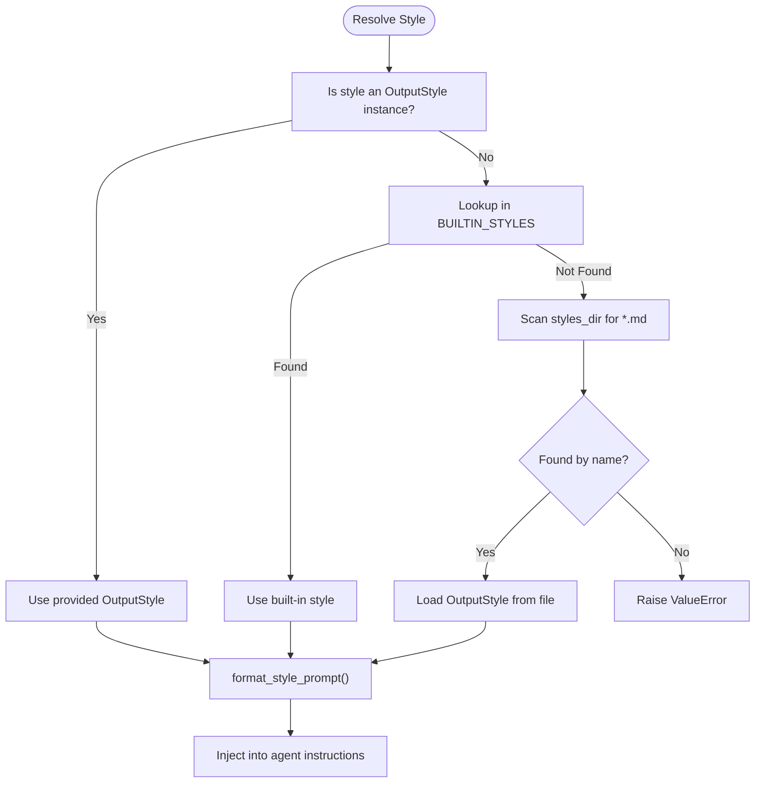
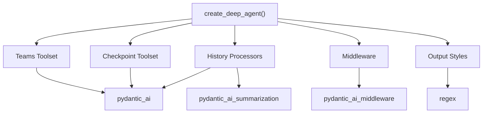

# Advanced Features

<cite>
**Referenced Files in This Document**
- [teams.md](file://docs/advanced/teams.md)
- [teams.py](file://pydantic_deep/toolsets/teams.py)
- [checkpointing.md](file://docs/advanced/checkpointing.md)
- [checkpointing.py](file://pydantic_deep/toolsets/checkpointing.py)
- [streaming.md](file://docs/advanced/streaming.md)
- [streaming.py](file://examples/streaming.py)
- [structured-output.md](file://docs/advanced/structured-output.md)
- [output-styles.md](file://docs/advanced/output-styles.md)
- [styles.py](file://pydantic_deep/styles.py)
- [agent.py](file://pydantic_deep/agent.py)
- [history_archive.py](file://pydantic_deep/processors/history_archive.py)
</cite>

## Table of Contents
1. [Introduction](#introduction)
2. [Project Structure](#project-structure)
3. [Core Components](#core-components)
4. [Architecture Overview](#architecture-overview)
5. [Detailed Component Analysis](#detailed-component-analysis)
6. [Dependency Analysis](#dependency-analysis)
7. [Performance Considerations](#performance-considerations)
8. [Troubleshooting Guide](#troubleshooting-guide)
9. [Conclusion](#conclusion)
10. [Appendices](#appendices)

## Introduction
This document covers advanced capabilities that extend beyond basic agent operations, enabling sophisticated collaboration, persistence, real-time interaction, structured outputs, and customizable presentation. These features include:
- Team collaboration with shared task management and peer-to-peer messaging
- Conversation checkpointing and state management for rewind/fork
- Streaming responses and real-time progress monitoring
- Structured output processing with Pydantic models
- Output styling options for tone and formatting

Each feature is explained with implementation patterns, configuration options, integration points, and practical use cases.

## Project Structure
The advanced features are implemented as modular toolsets and middleware integrated into the agent factory. The agent factory composes toolsets, middleware, and processors based on flags and parameters.

**Diagram sources**
- [agent.py:196-935](file://pydantic_deep/agent.py#L196-L935)

**Section sources**
- [agent.py:196-935](file://pydantic_deep/agent.py#L196-L935)

## Core Components
- Team Collaboration: Shared TODO list and peer-to-peer messaging for multi-agent coordination.
- Checkpointing: Auto-save and manual controls for conversation snapshots with rewind/fork support.
- Streaming: Real-time iteration over agent execution nodes for progress and live output.
- Structured Output: Type-safe responses via Pydantic models with validation and constraints.
- Output Styles: Built-in and custom formatting directives injected into the system prompt.

**Section sources**
- [teams.md:1-177](file://docs/advanced/teams.md#L1-L177)
- [checkpointing.md:1-198](file://docs/advanced/checkpointing.md#L1-L198)
- [streaming.md:1-243](file://docs/advanced/streaming.md#L1-L243)
- [structured-output.md:1-219](file://docs/advanced/structured-output.md#L1-L219)
- [output-styles.md:1-130](file://docs/advanced/output-styles.md#L1-L130)

## Architecture Overview
The agent integrates advanced features through:
- Toolsets: Feature-specific functions exposed to the model (e.g., team management, checkpoint controls).
- Middleware: Cross-cutting concerns like context management, cost tracking, and checkpointing.
- Processors: History transformations (e.g., eviction, patching tool calls).
- Styles: Prompt augmentation for output formatting.

**Diagram sources**
- [agent.py:691-935](file://pydantic_deep/agent.py#L691-L935)

## Detailed Component Analysis

### Team Collaboration: Shared Tasks and Messaging
Teams enable multi-agent collaboration with:
- Shared TODO list supporting claiming, dependencies, and auto-unblocking
- Peer-to-peer messaging with registration, direct messages, broadcasts, and inbox retrieval
- AgentTeam orchestration for spawning, assigning tasks, broadcasting, and dissolution

Implementation highlights:
- SharedTodoList: Async-safe task tracker with lock-based concurrency
- TeamMessageBus: Queue-based message routing for registered agents
- AgentTeam: Coordinates shared state and lifecycle
- create_team_toolset: Registers spawn, assign, check, message, and dissolve tools

**Diagram sources**
- [teams.py:21-307](file://pydantic_deep/toolsets/teams.py#L21-L307)

**Diagram sources**
- [teams.py:268-307](file://pydantic_deep/toolsets/teams.py#L268-L307)

Practical usage:
- Enable teams via agent factory flag and use the provided tools to manage collaborators and tasks.
- For subagents sharing the same TODO list, configure shared state through dependencies.

**Section sources**
- [teams.md:1-177](file://docs/advanced/teams.md#L1-L177)
- [teams.py:21-533](file://pydantic_deep/toolsets/teams.py#L21-L533)

### Checkpointing: Persistence and Rewind/Fork
Checkpointing captures conversation snapshots to support:
- Auto-saving at configurable frequencies (every tool, every turn, manual)
- Manual labeling, listing, and rewinding to a checkpoint
- Session forking from a checkpoint into a new session

Implementation highlights:
- Checkpoint dataclass with immutable snapshot attributes
- InMemoryCheckpointStore and FileCheckpointStore backends
- CheckpointMiddleware for auto-save hooks
- CheckpointToolset for save/list/rewind tools
- RewindRequested exception to signal app-level rewind
- fork_from_checkpoint utility for session forking

**Diagram sources**
- [checkpointing.py:59-603](file://pydantic_deep/toolsets/checkpointing.py#L59-L603)

**Diagram sources**
- [checkpointing.py:448-603](file://pydantic_deep/toolsets/checkpointing.py#L448-L603)

Operational guidance:
- Choose checkpoint_frequency based on desired granularity and cost/performance trade-offs.
- Use per-session stores for multi-user scenarios to avoid cross-user visibility.
- Combine with streaming to provide progress feedback during rewind/fork operations.

**Section sources**
- [checkpointing.md:1-198](file://docs/advanced/checkpointing.md#L1-L198)
- [checkpointing.py:59-603](file://pydantic_deep/toolsets/checkpointing.py#L59-L603)

### Streaming: Real-Time Execution and Live Output
Streaming enables real-time monitoring of agent execution by iterating over execution nodes as they occur. This supports:
- Node-by-node progress reporting (user prompt, model request, tool calls, completion)
- Live output display for long-running operations
- Web SSE integration for server-side streaming
- Cancellation and usage statistics collection

Implementation highlights:
- agent.iter() yields execution nodes
- Rich progress integrations supported
- Tool call details extraction for targeted UI updates

**Diagram sources**
- [streaming.py:16-82](file://examples/streaming.py#L16-L82)

**Section sources**
- [streaming.md:1-243](file://docs/advanced/streaming.md#L1-L243)
- [streaming.py:1-82](file://examples/streaming.py#L1-L82)

### Structured Output: Type-Safe Responses
Structured output leverages Pydantic models to produce validated, type-safe responses:
- Define models with fields, validators, and constraints
- Combine with tools for richer outputs (e.g., file analysis)
- Automatic validation and inference of agent return types

Best practices:
- Keep models focused and granular
- Use Field descriptions and examples to guide the LLM
- Handle validation errors gracefully

**Section sources**
- [structured-output.md:1-219](file://docs/advanced/structured-output.md#L1-L219)

### Output Styles: Formatting and Tone Control
Output styles inject formatting directives into the system prompt to control agent tone and presentation:
- Built-in styles: concise, explanatory, formal, conversational
- Custom styles via OutputStyle instances or markdown files with frontmatter
- Resolution order: direct instance, built-ins, styles_dir discovery
- Formatting helper for injecting style into system prompt

**Diagram sources**
- [styles.py:236-295](file://pydantic_deep/styles.py#L236-L295)

**Section sources**
- [output-styles.md:1-130](file://docs/advanced/output-styles.md#L1-L130)
- [styles.py:46-295](file://pydantic_deep/styles.py#L46-L295)

## Dependency Analysis
Advanced features integrate through the agent factory and middleware pipeline. Key dependencies:
- Toolsets depend on pydantic_ai toolsets and function toolsets
- Middleware depends on pydantic_ai_middleware and summarization packages
- Processors depend on pydantic_ai and pydantic_ai_summarization
- Styles depend on frontmatter parsing and markdown files

**Diagram sources**
- [agent.py:691-935](file://pydantic_deep/agent.py#L691-L935)

**Section sources**
- [agent.py:691-935](file://pydantic_deep/agent.py#L691-L935)

## Performance Considerations
- Streaming overhead: Each node iteration introduces event dispatch; use selectively for long-running tasks.
- Checkpointing cost: Higher frequency auto-save increases IO and CPU; balance granularity vs. performance.
- Middleware stacking: Multiple middleware and processors add latency; profile and tune as needed.
- Output styles: Larger system prompts may increase token usage; keep styles concise.
- Teams: Async queues and locks add synchronization overhead; scale agents accordingly.

[No sources needed since this section provides general guidance]

## Troubleshooting Guide
Common issues and resolutions:
- RewindRequested propagation: Catch the exception at the application level and restore message_history to the checkpoint snapshot.
- Multi-user checkpoint collisions: Ensure per-session stores; avoid shared in-memory stores across users.
- Streaming timeouts: Use cancellation contexts to abort long runs; collect usage stats afterward.
- Structured output validation failures: Wrap agent calls in try/except and refine model prompts/examples.
- Output style resolution errors: Verify style name exists in built-ins or styles_dir; ensure markdown files have required frontmatter.

**Section sources**
- [checkpointing.py:87-108](file://pydantic_deep/toolsets/checkpointing.py#L87-L108)
- [checkpointing.md:111-137](file://docs/advanced/checkpointing.md#L111-L137)
- [streaming.md:164-181](file://docs/advanced/streaming.md#L164-L181)
- [structured-output.md:212-213](file://docs/advanced/structured-output.md#L212-L213)
- [output-styles.md:91-99](file://docs/advanced/output-styles.md#L91-L99)

## Conclusion
These advanced features collectively transform the agent from a reactive assistant into a collaborative, persistent, and transparent system. Teams streamline multi-agent workflows; checkpointing enables safe experimentation; streaming improves UX; structured output ensures reliability; and output styles tailor communication. Integrate them incrementally, align configuration with use cases, and monitor performance to achieve robust, production-ready deployments.

[No sources needed since this section summarizes without analyzing specific files]

## Appendices

### Enabling Advanced Features: Checklist
- Teams: Set include_teams=True; use spawn_team, assign_task, check_teammates, message_teammate, dissolve_team.
- Checkpointing: Set include_checkpoints=True; choose frequency; select store; handle RewindRequested.
- Streaming: Use agent.iter(); process nodes; integrate with UI or SSE.
- Structured Output: Provide output_type; validate responses; combine with tools.
- Output Styles: Provide output_style or styles_dir; resolve and inject into instructions.

**Section sources**
- [teams.md:5-22](file://docs/advanced/teams.md#L5-L22)
- [checkpointing.md:5-26](file://docs/advanced/checkpointing.md#L5-L26)
- [streaming.md:5-27](file://docs/advanced/streaming.md#L5-L27)
- [structured-output.md:5-33](file://docs/advanced/structured-output.md#L5-L33)
- [output-styles.md:5-14](file://docs/advanced/output-styles.md#L5-L14)