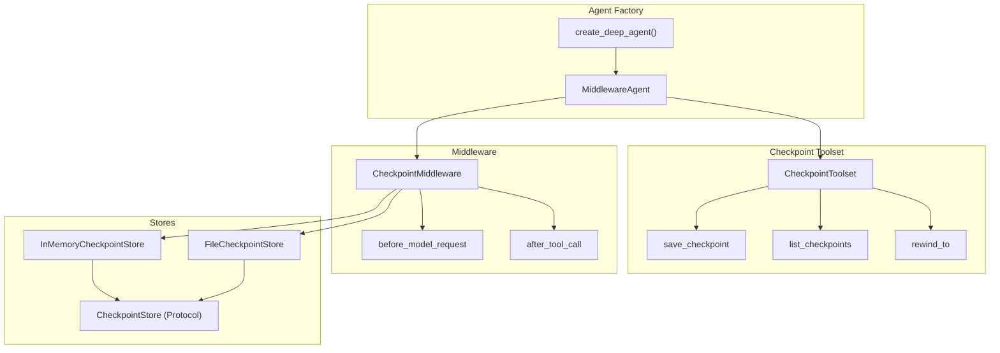
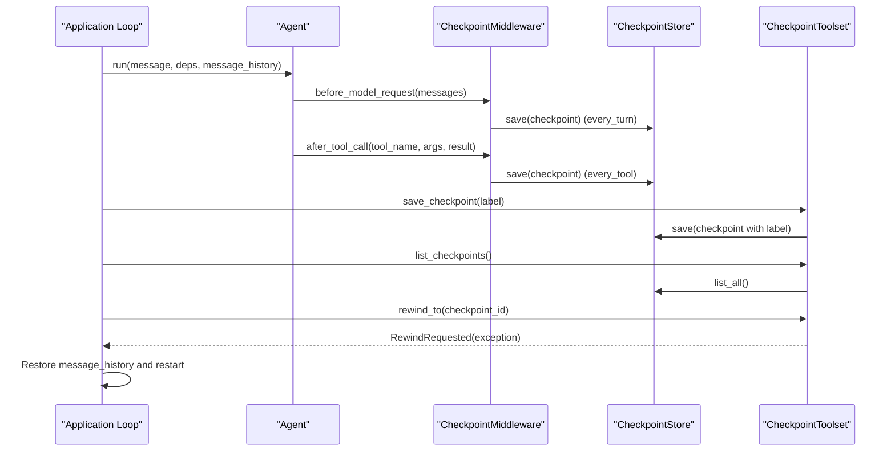
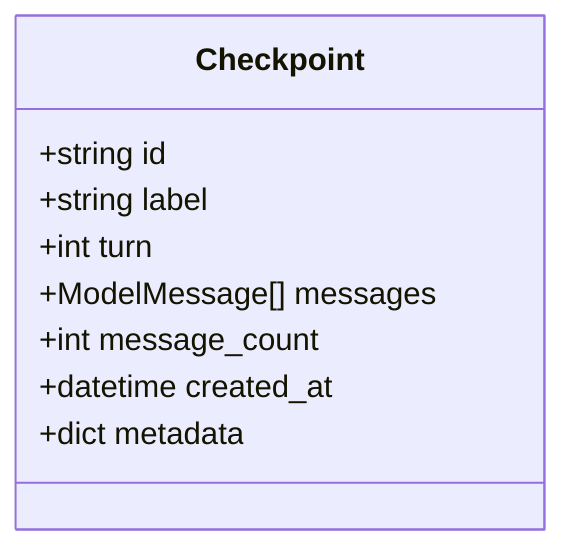
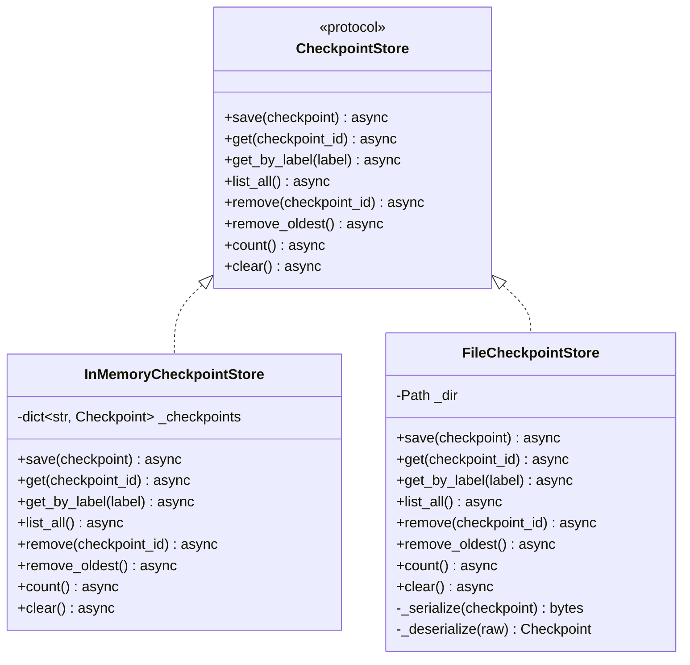
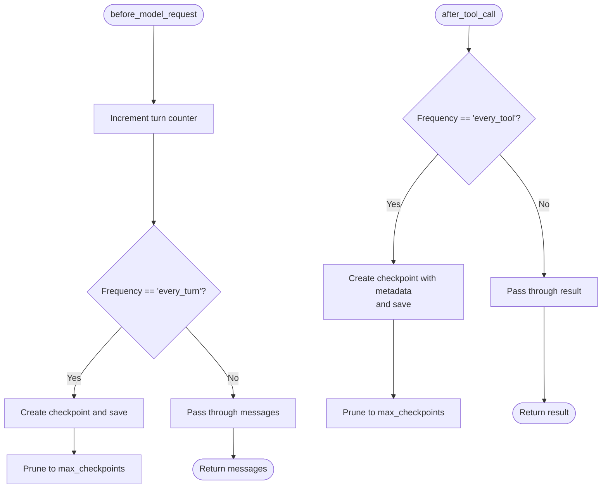
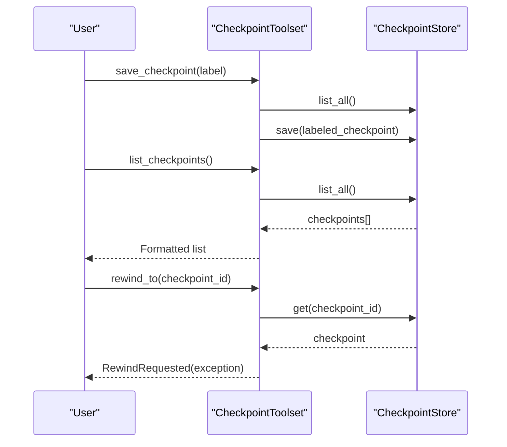
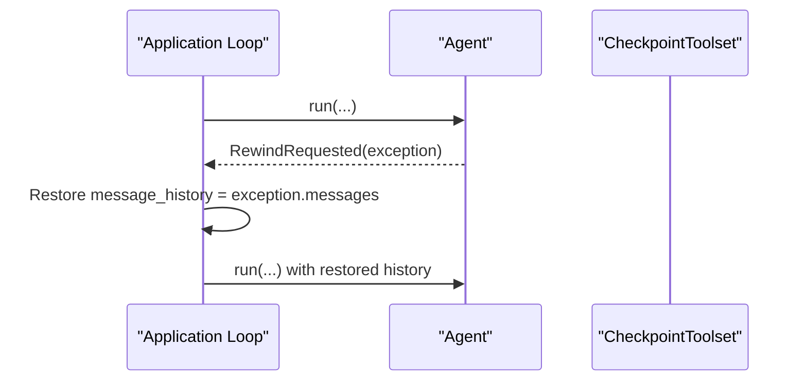
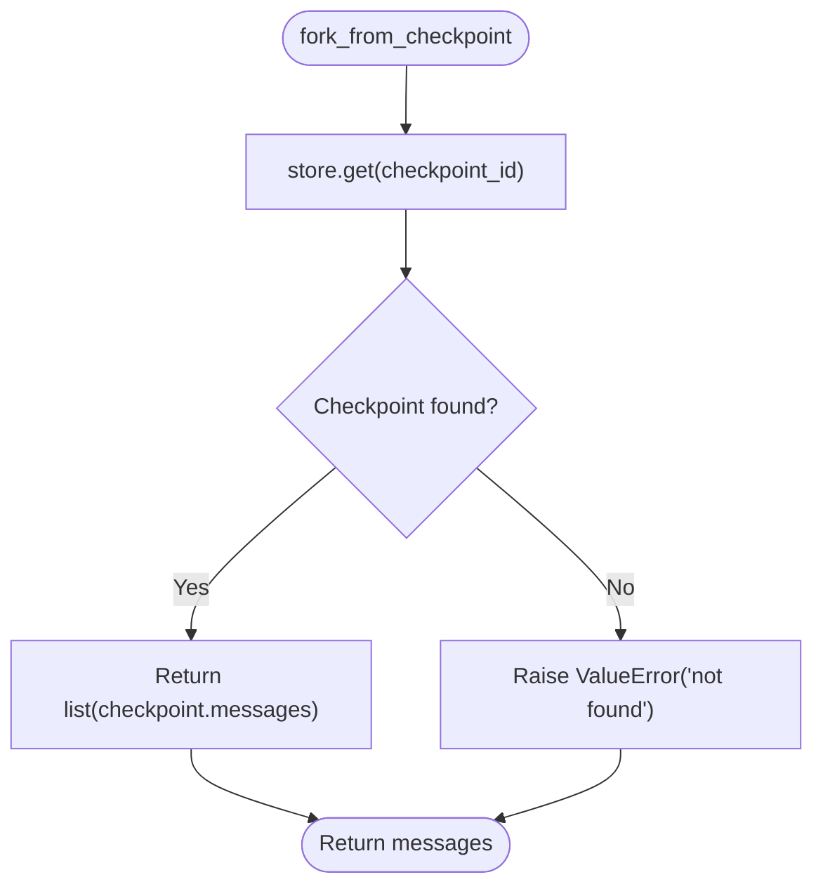
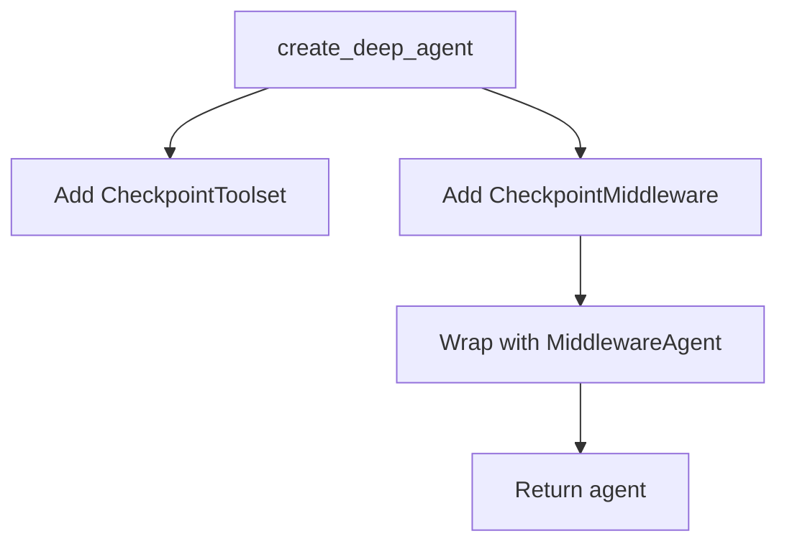
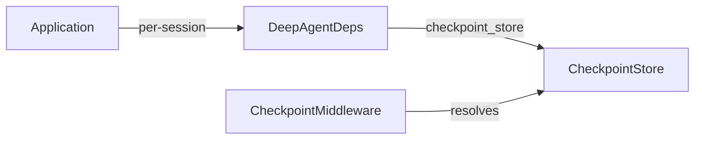

# Checkpointing and State Management

<cite>
**Referenced Files in This Document**
- [checkpointing.py](file://pydantic_deep/toolsets/checkpointing.py)
- [test_checkpointing.py](file://tests/test_checkpointing.py)
- [checkpointing.md](file://docs/advanced/checkpointing.md)
- [agent.py](file://pydantic_deep/agent.py)
- [deps.py](file://pydantic_deep/deps.py)
- [app.py](file://apps/deepresearch/src/deepresearch/app.py)
- [app.py](file://examples/full_app/app.py)
</cite>

## Table of Contents
1. [Introduction](#introduction)
2. [Project Structure](#project-structure)
3. [Core Components](#core-components)
4. [Architecture Overview](#architecture-overview)
5. [Detailed Component Analysis](#detailed-component-analysis)
6. [Dependency Analysis](#dependency-analysis)
7. [Performance Considerations](#performance-considerations)
8. [Troubleshooting Guide](#troubleshooting-guide)
9. [Conclusion](#conclusion)
10. [Appendices](#appendices)

## Introduction
This document explains the Checkpointing and State Management feature that enables conversation persistence and state restoration. It covers the checkpoint system architecture, state serialization mechanisms, and conversation rewinding functionality. You will learn how checkpoints are created, stored, retrieved, and deleted; how to integrate with external storage systems; and how to use checkpoints for conversation continuity, multi-user scenarios, and session forking.

## Project Structure
The checkpointing feature is implemented as a standalone toolset with middleware and storage backends. It integrates with the agent factory to add automatic checkpointing and manual tools for managing checkpoints.

**Diagram sources**
- [agent.py:691-935](file://pydantic_deep/agent.py#L691-L935)
- [checkpointing.py:448-565](file://pydantic_deep/toolsets/checkpointing.py#L448-L565)
- [checkpointing.py:341-421](file://pydantic_deep/toolsets/checkpointing.py#L341-L421)
- [checkpointing.py:152-204](file://pydantic_deep/toolsets/checkpointing.py#L152-L204)
- [checkpointing.py:206-298](file://pydantic_deep/toolsets/checkpointing.py#L206-L298)

**Section sources**
- [agent.py:691-935](file://pydantic_deep/agent.py#L691-L935)
- [checkpointing.py:152-298](file://pydantic_deep/toolsets/checkpointing.py#L152-L298)

## Core Components
- Checkpoint: Immutable snapshot of conversation state at a point in time, including id, label, turn, messages, message_count, created_at, and optional metadata.
- CheckpointStore (Protocol): Defines the interface for checkpoint storage backends (save, get, get_by_label, list_all, remove, remove_oldest, count, clear).
- InMemoryCheckpointStore: Default in-memory store backed by a dict keyed by ID.
- FileCheckpointStore: Persistent store using JSON files; serializes messages via ModelMessagesTypeAdapter.
- CheckpointMiddleware: Auto-checkpointing middleware that triggers on turns or tool calls.
- CheckpointToolset: Manual tools for labeling, listing, and rewinding to checkpoints.
- RewindRequested: Exception raised by rewind_to to signal application-level rewind.
- fork_from_checkpoint: Utility to retrieve messages from a checkpoint for forking into a new session.

**Section sources**
- [checkpointing.py:59-107](file://pydantic_deep/toolsets/checkpointing.py#L59-L107)
- [checkpointing.py:115-149](file://pydantic_deep/toolsets/checkpointing.py#L115-L149)
- [checkpointing.py:152-204](file://pydantic_deep/toolsets/checkpointing.py#L152-L204)
- [checkpointing.py:206-298](file://pydantic_deep/toolsets/checkpointing.py#L206-L298)
- [checkpointing.py:341-421](file://pydantic_deep/toolsets/checkpointing.py#L341-L421)
- [checkpointing.py:448-565](file://pydantic_deep/toolsets/checkpointing.py#L448-L565)
- [checkpointing.py:87-107](file://pydantic_deep/toolsets/checkpointing.py#L87-L107)
- [checkpointing.py:572-602](file://pydantic_deep/toolsets/checkpointing.py#L572-L602)

## Architecture Overview
The checkpointing architecture combines middleware-driven automation with manual tooling and pluggable storage backends. The agent factory conditionally wraps the agent in MiddlewareAgent and injects CheckpointMiddleware and CheckpointToolset. Stores are resolved from deps at runtime, enabling per-session isolation.

**Diagram sources**
- [agent.py:900-935](file://pydantic_deep/agent.py#L900-L935)
- [checkpointing.py:341-421](file://pydantic_deep/toolsets/checkpointing.py#L341-L421)
- [checkpointing.py:448-565](file://pydantic_deep/toolsets/checkpointing.py#L448-L565)

## Detailed Component Analysis

### Checkpoint Data Model
- Purpose: Immutable snapshot capturing the conversation state at a specific turn.
- Fields: id, label, turn, messages, message_count, created_at, metadata.
- Behavior: Shallow copy of messages; metadata is optional and preserved.

**Diagram sources**
- [checkpointing.py:59-80](file://pydantic_deep/toolsets/checkpointing.py#L59-L80)

**Section sources**
- [checkpointing.py:59-80](file://pydantic_deep/toolsets/checkpointing.py#L59-L80)

### CheckpointStore Protocol and Implementations
- Protocol defines CRUD and listing operations plus pruning and counting.
- InMemoryCheckpointStore: Dict-backed store with insertion-order removal of oldest.
- FileCheckpointStore: JSON file-based store; uses ModelMessagesTypeAdapter for serialization.

**Diagram sources**
- [checkpointing.py:115-149](file://pydantic_deep/toolsets/checkpointing.py#L115-L149)
- [checkpointing.py:152-204](file://pydantic_deep/toolsets/checkpointing.py#L152-L204)
- [checkpointing.py:206-298](file://pydantic_deep/toolsets/checkpointing.py#L206-L298)

**Section sources**
- [checkpointing.py:115-149](file://pydantic_deep/toolsets/checkpointing.py#L115-L149)
- [checkpointing.py:152-204](file://pydantic_deep/toolsets/checkpointing.py#L152-L204)
- [checkpointing.py:206-298](file://pydantic_deep/toolsets/checkpointing.py#L206-L298)

### CheckpointMiddleware
- Triggers on:
  - before_model_request: increments turn counter and optionally saves on “every_turn”.
  - after_tool_call: optionally saves on “every_tool”.
- Resolves store from deps.checkpoint_store first, then fallback store.
- Prunes to max_checkpoints after saving.

**Diagram sources**
- [checkpointing.py:341-421](file://pydantic_deep/toolsets/checkpointing.py#L341-L421)

**Section sources**
- [checkpointing.py:341-421](file://pydantic_deep/toolsets/checkpointing.py#L341-L421)

### CheckpointToolset
- Tools:
  - save_checkpoint: Relabel the most recent auto-checkpoint.
  - list_checkpoints: List all checkpoints with labels and metadata.
  - rewind_to: Raise RewindRequested with checkpoint messages.
- Resolves store from ctx.deps.checkpoint_store or fallback.

**Diagram sources**
- [checkpointing.py:448-565](file://pydantic_deep/toolsets/checkpointing.py#L448-L565)

**Section sources**
- [checkpointing.py:448-565](file://pydantic_deep/toolsets/checkpointing.py#L448-L565)

### RewindRequested Exception and Application Integration
- rewind_to raises RewindRequested with checkpoint_id, label, and messages.
- Application loop catches the exception and restores message_history, then restarts.

**Diagram sources**
- [checkpointing.py:533-555](file://pydantic_deep/toolsets/checkpointing.py#L533-L555)

**Section sources**
- [checkpointing.py:533-555](file://pydantic_deep/toolsets/checkpointing.py#L533-L555)

### Session Forking
- fork_from_checkpoint retrieves messages from a checkpoint for a new session.
- Raises ValueError if checkpoint not found.

**Diagram sources**
- [checkpointing.py:572-602](file://pydantic_deep/toolsets/checkpointing.py#L572-L602)

**Section sources**
- [checkpointing.py:572-602](file://pydantic_deep/toolsets/checkpointing.py#L572-L602)

### Agent Integration and Middleware Wrapping
- create_deep_agent adds CheckpointToolset and CheckpointMiddleware when include_checkpoints=True.
- MiddlewareAgent is used to wrap the agent with middleware stack.
- Per-session stores are supported via deps.checkpoint_store.

**Diagram sources**
- [agent.py:691-935](file://pydantic_deep/agent.py#L691-L935)

**Section sources**
- [agent.py:691-935](file://pydantic_deep/agent.py#L691-L935)

## Dependency Analysis
- Middleware resolution: CheckpointMiddleware resolves the store from ctx.deps.checkpoint_store first, then falls back to the store provided at initialization.
- Multi-user isolation: Each user session should have its own CheckpointStore instance to avoid cross-session visibility.
- External storage integration: Implement CheckpointStore protocol to integrate with databases, cloud storage, or custom backends.

**Diagram sources**
- [checkpointing.py:373-377](file://pydantic_deep/toolsets/checkpointing.py#L373-L377)
- [deps.py:18-40](file://pydantic_deep/deps.py#L18-L40)

**Section sources**
- [checkpointing.py:373-377](file://pydantic_deep/toolsets/checkpointing.py#L373-L377)
- [deps.py:18-40](file://pydantic_deep/deps.py#L18-L40)

## Performance Considerations
- Serialization overhead: FileCheckpointStore uses JSON serialization via ModelMessagesTypeAdapter; consider the cost of large message histories.
- Pruning strategy: max_checkpoints prevents unbounded growth; oldest checkpoints are removed first.
- Frequency tuning:
  - every_turn: More frequent snapshots, finer-grained rewinds, higher I/O.
  - every_tool: Balanced granularity, fewer snapshots than every_turn.
  - manual_only: Minimal overhead; rely on save_checkpoint for critical moments.
- Memory footprint: InMemoryCheckpointStore is fast but ephemeral; FileCheckpointStore persists across process restarts but incurs disk I/O.

[No sources needed since this section provides general guidance]

## Troubleshooting Guide
Common issues and resolutions:
- No checkpoints available when calling save_checkpoint: Ensure at least one tool call has occurred so an auto-checkpoint exists.
- RewindRequested not caught by application: Ensure your run loop catches RewindRequested and restores message_history.
- Cross-session checkpoint visibility: Create a fresh CheckpointStore per session; do not share InMemoryCheckpointStore across users.
- FileCheckpointStore errors: Verify directory permissions and existence; ensure UTF-8 encoding and valid JSON.

**Section sources**
- [test_checkpointing.py:574-587](file://tests/test_checkpointing.py#L574-L587)
- [test_checkpointing.py:616-642](file://tests/test_checkpointing.py#L616-L642)
- [checkpointing.md:175-178](file://docs/advanced/checkpointing.md#L175-L178)

## Conclusion
The checkpointing system provides robust conversation persistence and restoration. By combining automatic middleware-driven snapshots with manual tools and pluggable storage backends, it supports flexible usage patterns—from fine-grained rewinds to persistent session forking. Proper configuration of store backends, pruning limits, and middleware frequencies ensures reliable performance and scalability.

[No sources needed since this section summarizes without analyzing specific files]

## Appendices

### Practical Usage Patterns
- Fine-grained rewinds: Use every_tool with moderate max_checkpoints.
- Turn-based snapshots: Use every_turn for deterministic checkpoints at each model request.
- Manual checkpoints: Use manual_only and call save_checkpoint before risky operations.
- Conversation continuity: After a run completes, persist message_history and reuse it across sessions.

**Section sources**
- [checkpointing.md:26-67](file://docs/advanced/checkpointing.md#L26-L67)

### State Persistence Strategies
- In-memory for development and testing.
- File-based for production with process restart resilience.
- Custom store for enterprise-grade persistence (e.g., database-backed).

**Section sources**
- [checkpointing.md:69-110](file://docs/advanced/checkpointing.md#L69-L110)

### Integration with External Storage Systems
- Implement CheckpointStore protocol to integrate with databases, cloud storage, or custom backends.
- Ensure thread-safety and atomicity for concurrent access.

**Section sources**
- [checkpointing.py:115-149](file://pydantic_deep/toolsets/checkpointing.py#L115-L149)
- [checkpointing.md:93-109](file://docs/advanced/checkpointing.md#L93-L109)

### Multi-User and Session Isolation
- Create a dedicated CheckpointStore per user session.
- Avoid sharing InMemoryCheckpointStore across users.

**Section sources**
- [checkpointing.md:159-178](file://docs/advanced/checkpointing.md#L159-L178)
- [app.py:681-689](file://examples/full_app/app.py#L681-L689)

### Example Integrations
- Web endpoints for listing and rewinding checkpoints.
- WebSocket notifications for checkpoint events.

**Section sources**
- [app.py:1500-1541](file://apps/deepresearch/src/deepresearch/app.py#L1500-L1541)
- [app.py:1044-1061](file://apps/deepresearch/src/deepresearch/app.py#L1044-L1061)