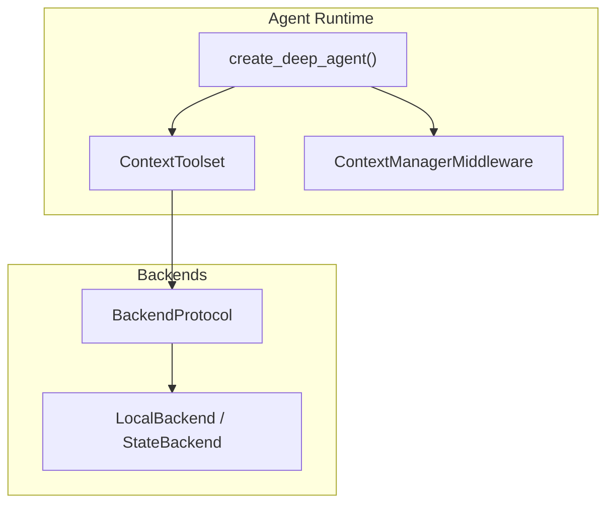
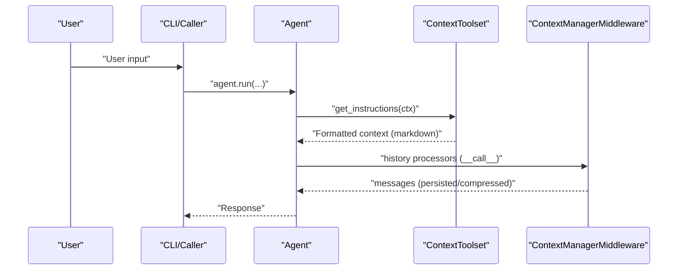
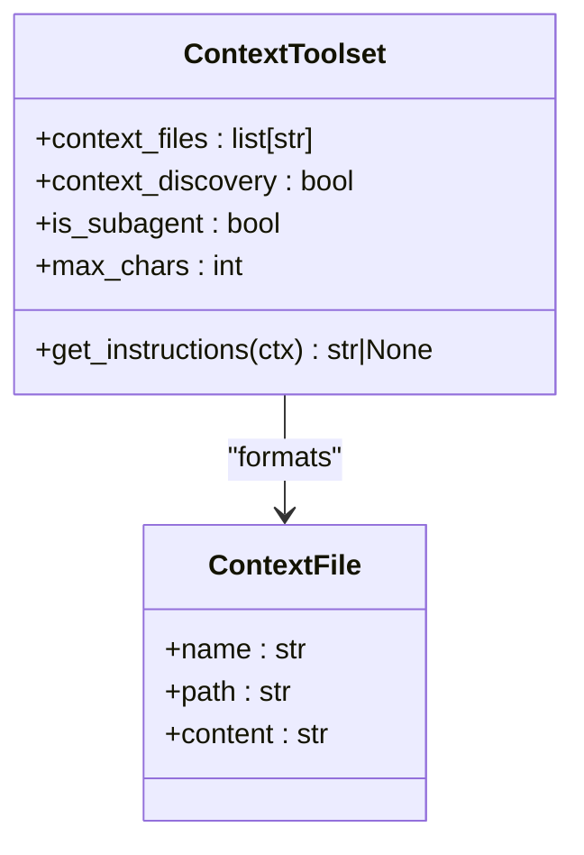
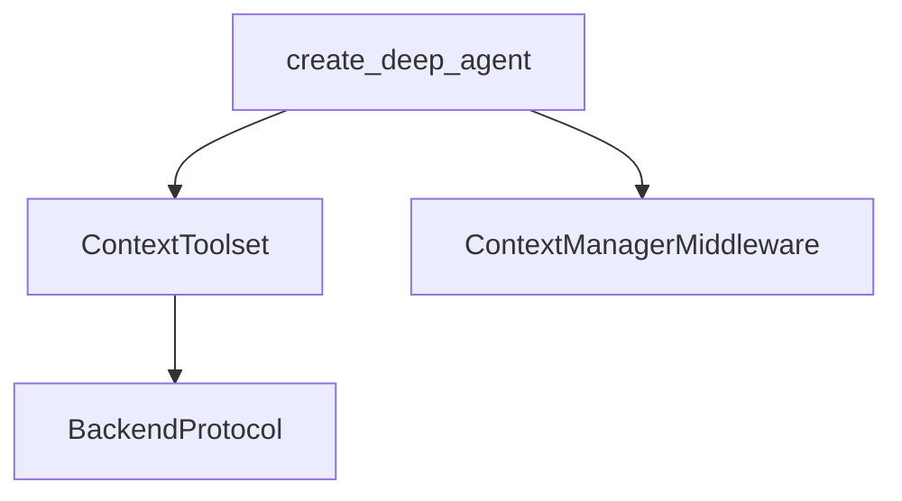

# Context Files

<cite>
**Referenced Files in This Document**
- [context.py](file://pydantic_deep/toolsets/context.py)
- [local_context.py](file://cli/local_context.py)
- [context-files.md](file://docs/advanced/context-files.md)
- [memory-and-context.md](file://docs/architecture/memory-and-context.md)
- [test_context.py](file://tests/test_context.py)
- [test_context_manager.py](file://tests/test_context_manager.py)
- [agent.py](file://pydantic_deep/agent.py)
- [DEEP.md](file://apps/deepresearch/workspace/DEEP.md)
- [MEMORY.md](file://apps/deepresearch/workspace/MEMORY.md)
</cite>

## Table of Contents
1. [Introduction](#introduction)
2. [Project Structure](#project-structure)
3. [Core Components](#core-components)
4. [Architecture Overview](#architecture-overview)
5. [Detailed Component Analysis](#detailed-component-analysis)
6. [Dependency Analysis](#dependency-analysis)
7. [Performance Considerations](#performance-considerations)
8. [Troubleshooting Guide](#troubleshooting-guide)
9. [Conclusion](#conclusion)
10. [Appendices](#appendices)

## Introduction
This document explains the Context Files feature: how project-level context files are automatically discovered, loaded, formatted, and injected into agent system prompts. It covers supported file formats, naming conventions, discovery mechanisms, subagent filtering, truncation behavior, and integration with the broader memory and context management architecture. Practical guidance is included for organizing context, managing large files, optimizing performance, resolving conflicts, and maintaining security.

## Project Structure
Context Files are implemented as a dedicated toolset that participates in the agent’s instruction pipeline. The feature integrates with:
- The agent factory to configure context injection
- The backend abstraction to read files
- The context manager middleware to manage token budgets and compression

**Diagram sources**
- [agent.py:196-200](file://pydantic_deep/agent.py#L196-L200)
- [context.py:150-208](file://pydantic_deep/toolsets/context.py#L150-L208)
- [memory-and-context.md:12-58](file://docs/architecture/memory-and-context.md#L12-L58)

**Section sources**
- [context-files.md:1-146](file://docs/advanced/context-files.md#L1-L146)
- [memory-and-context.md:1-58](file://docs/architecture/memory-and-context.md#L1-L58)

## Core Components
- ContextToolset: Loads and formats context files for injection into the system prompt. Supports explicit paths and auto-discovery, with truncation and subagent filtering.
- ContextFile: Lightweight data structure holding filename, path, and content.
- Discovery and loading helpers: discover_context_files, load_context_files, format_context_prompt.
- Integration points: create_deep_agent parameters and per-subagent configuration.

Key behaviors:
- Default filenames scanned during auto-discovery
- Subagent filtering to restrict sensitive files
- Head/tail truncation with a configurable per-file cap
- Integration with ContextManagerMiddleware for token budgeting and compression

**Section sources**
- [context.py:19-33](file://pydantic_deep/toolsets/context.py#L19-L33)
- [context.py:35-70](file://pydantic_deep/toolsets/context.py#L35-L70)
- [context.py:73-95](file://pydantic_deep/toolsets/context.py#L73-L95)
- [context.py:118-148](file://pydantic_deep/toolsets/context.py#L118-L148)
- [context.py:150-208](file://pydantic_deep/toolsets/context.py#L150-L208)
- [context-files.md:24-82](file://docs/advanced/context-files.md#L24-L82)

## Architecture Overview
Context Files participate in the agent lifecycle before each model call. The typical flow:
- Before model call: processors run in order (patch tool calls, eviction, user processors, context manager)
- ContextToolset runs during get_instructions to inject formatted context
- ContextManagerMiddleware manages token usage and compression

**Diagram sources**
- [memory-and-context.md:67-119](file://docs/architecture/memory-and-context.md#L67-L119)
- [context.py:181-207](file://pydantic_deep/toolsets/context.py#L181-L207)

**Section sources**
- [memory-and-context.md:354-383](file://docs/architecture/memory-and-context.md#L354-L383)
- [context.py:181-207](file://pydantic_deep/toolsets/context.py#L181-L207)

## Detailed Component Analysis

### ContextToolset and File Processing Pipeline
ContextToolset orchestrates discovery/loading/formatting and integrates with subagent filtering and truncation.

**Diagram sources**
- [context.py:150-208](file://pydantic_deep/toolsets/context.py#L150-L208)
- [context.py:35-45](file://pydantic_deep/toolsets/context.py#L35-L45)

Behavior highlights:
- Auto-discovery scans backend root for configured filenames
- Explicit paths skip discovery and load directly
- Missing files are silently skipped
- Formatting wraps content under a “Project Context” section with per-file headers
- Subagent mode filters to an allowlist; per-subagent context bypasses filtering

**Section sources**
- [context.py:73-95](file://pydantic_deep/toolsets/context.py#L73-L95)
- [context.py:47-70](file://pydantic_deep/toolsets/context.py#L47-L70)
- [context.py:118-148](file://pydantic_deep/toolsets/context.py#L118-L148)
- [context.py:150-208](file://pydantic_deep/toolsets/context.py#L150-L208)
- [test_context.py:125-176](file://tests/test_context.py#L125-L176)
- [test_context.py:53-121](file://tests/test_context.py#L53-L121)
- [test_context.py:222-304](file://tests/test_context.py#L222-L304)

### Discovery and Naming Conventions
- Default filenames scanned during auto-discovery
- Discovery supports custom filenames and a custom search path
- Files are discovered at the backend root by default

Practical tips:
- Place context files at the backend root for reliable auto-discovery
- Use custom filenames to support multiple contexts or environments
- Use a custom search path to scope discovery to a subdirectory

**Section sources**
- [context.py:19-22](file://pydantic_deep/toolsets/context.py#L19-L22)
- [context.py:73-95](file://pydantic_deep/toolsets/context.py#L73-L95)
- [test_context.py:150-176](file://tests/test_context.py#L150-L176)

### Subagent Filtering and Allowlists
- Subagents only receive files in the allowlist by default
- Per-subagent context (explicitly configured) is not filtered by the allowlist
- Tests demonstrate filtering behavior and custom allowlists

Security note:
- Sensitive files are excluded from subagents by default to maintain isolation

**Section sources**
- [context.py:24-29](file://pydantic_deep/toolsets/context.py#L24-L29)
- [context.py:136-137](file://pydantic_deep/toolsets/context.py#L136-L137)
- [test_context.py:252-287](file://tests/test_context.py#L252-L287)
- [test_context.py:541-553](file://tests/test_context.py#L541-L553)

### Truncation and Size Limits
- Long files are truncated preserving 70% head and 30% tail
- Default per-file cap is applied; configurable via constructor
- Tests verify truncation behavior and ratios

Optimization tip:
- Keep frequently referenced files under the default cap to avoid truncation
- For very large documents, split into focused files and rely on discovery to include only relevant ones

**Section sources**
- [context.py:98-116](file://pydantic_deep/toolsets/context.py#L98-L116)
- [context.py:31-32](file://pydantic_deep/toolsets/context.py#L31-L32)
- [test_context.py:178-217](file://tests/test_context.py#L178-L217)
- [test_context.py:288-296](file://tests/test_context.py#L288-L296)

### Integration with create_deep_agent and Per-Subagent Context
- Agent factory supports context_files and context_discovery parameters
- Per-subagent configuration can include context_files; ContextToolset is injected into the subagent’s toolsets
- Existing toolsets are preserved when injecting

**Section sources**
- [agent.py:68-128](file://pydantic_deep/agent.py#L68-L128)
- [agent.py:566-583](file://pydantic_deep/agent.py#L566-L583)
- [test_context.py:418-456](file://tests/test_context.py#L418-L456)
- [test_context.py:460-553](file://tests/test_context.py#L460-L553)

### Local Context Injection (Complementary Feature)
While ContextToolset focuses on project context files, the CLI module provides LocalContextToolset to inject environment-aware context (git info, directory tree, runtime detection). This complements project context by grounding the agent in the current environment.

Highlights:
- Detects git branch, main branches, and uncommitted changes
- Builds a directory tree with ignore patterns
- Detects language, package manager, monorepo type, and runtime versions
- Formats a markdown block injected into the system prompt

**Section sources**
- [local_context.py:96-159](file://cli/local_context.py#L96-L159)
- [local_context.py:295-343](file://cli/local_context.py#L295-L343)
- [local_context.py:405-438](file://cli/local_context.py#L405-L438)

## Dependency Analysis
Context Files depend on:
- BackendProtocol for file access
- ContextManagerMiddleware for token budgeting and compression
- Agent factory for configuration and lifecycle integration

**Diagram sources**
- [context.py:181-207](file://pydantic_deep/toolsets/context.py#L181-L207)
- [memory-and-context.md:12-58](file://docs/architecture/memory-and-context.md#L12-L58)
- [agent.py:196-200](file://pydantic_deep/agent.py#L196-L200)

**Section sources**
- [context.py:181-207](file://pydantic_deep/toolsets/context.py#L181-L207)
- [memory-and-context.md:12-58](file://docs/architecture/memory-and-context.md#L12-L58)
- [agent.py:196-200](file://pydantic_deep/agent.py#L196-L200)

## Performance Considerations
- Prefer explicit context_files for deterministic, smaller context payloads
- Use context_discovery to include only necessary files; scope with custom filenames/search path
- Keep files under the default per-file cap to avoid truncation overhead
- Rely on ContextManagerMiddleware to compress history and keep working context fresh
- Use EvictionProcessor to prevent large tool outputs from inflating context before compression

[No sources needed since this section provides general guidance]

## Troubleshooting Guide
Common issues and resolutions:
- No context injected: Ensure context_files paths exist or enable context_discovery; verify backend contains the files
- Subagent receives no context: Confirm subagent filtering; use per-subagent context_files for targeted injection
- Truncated content: Increase max_chars or split content across multiple files
- Conflicts between files: Use explicit context_files to control inclusion order and content
- Large context causing compression churn: Tune ContextManagerMiddleware thresholds and consider per-subagent context scoping

**Section sources**
- [test_context.py:322-413](file://tests/test_context.py#L322-L413)
- [test_context.py:252-296](file://tests/test_context.py#L252-L296)
- [test_context_manager.py:31-133](file://tests/test_context_manager.py#L31-L133)

## Conclusion
Context Files provide a flexible, secure, and efficient way to inject project-specific knowledge into agents. By combining explicit paths, auto-discovery, truncation, and subagent filtering, teams can organize context effectively, optimize performance, and maintain strong isolation between main and subagents. Integrating with ContextManagerMiddleware ensures sustainable context budgets over long conversations.

[No sources needed since this section summarizes without analyzing specific files]

## Appendices

### Best Practices for Context File Organization
- Place frequently referenced files at the backend root for reliable auto-discovery
- Split large documents into focused files to reduce truncation and improve clarity
- Use per-subagent context_files for role-specific instructions
- Keep context concise and actionable; link to external artifacts rather than duplicating large datasets
- Version control context files alongside code to track changes and collaborate

[No sources needed since this section provides general guidance]

### Security Considerations
- Sensitive context files are filtered out for subagents by default
- Avoid embedding secrets in context files; prefer environment-backed configuration
- Review per-subagent context_files to ensure least privilege
- Treat context files as part of the agent’s system prompt; sanitize content appropriately

**Section sources**
- [context.py:24-29](file://pydantic_deep/toolsets/context.py#L24-L29)
- [context.py:136-137](file://pydantic_deep/toolsets/context.py#L136-L137)

### Example Workspaces and Context Patterns
- Research workspace demonstrates a focused DEEP.md for research workflow and file organization
- MEMORY.md illustrates persistent agent memory for continuity across sessions

**Section sources**
- [DEEP.md:1-12](file://apps/deepresearch/workspace/DEEP.md#L1-L12)
- [MEMORY.md:1-4](file://apps/deepresearch/workspace/MEMORY.md#L1-L4)