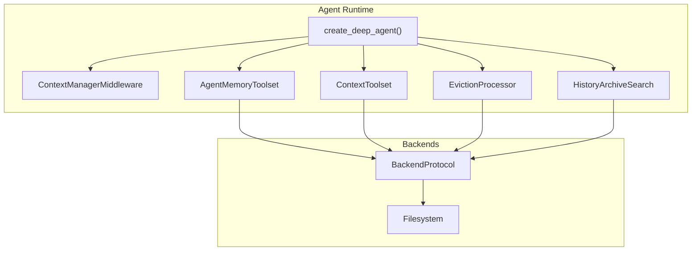
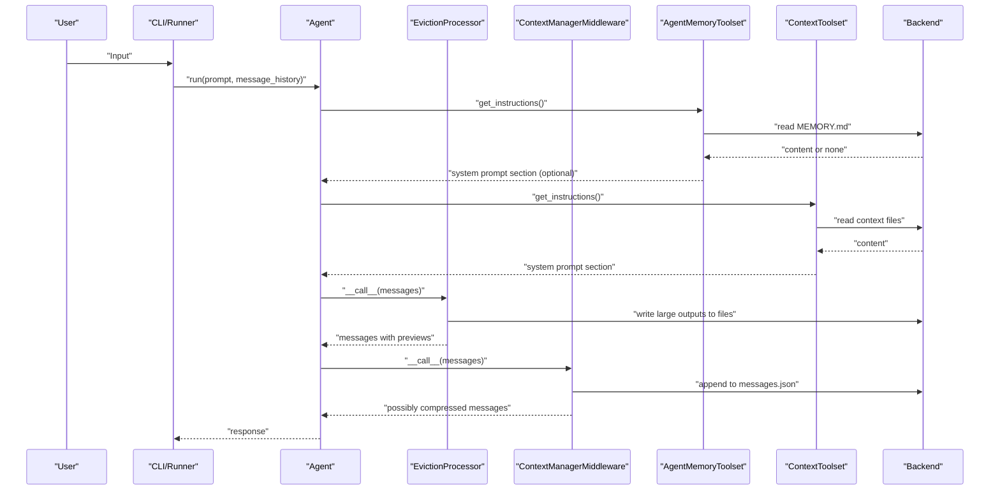
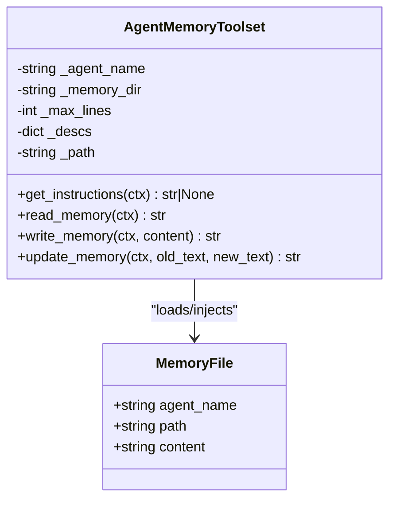
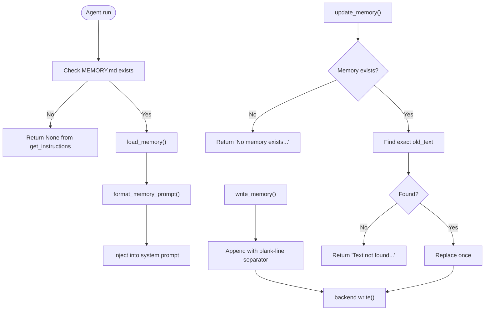
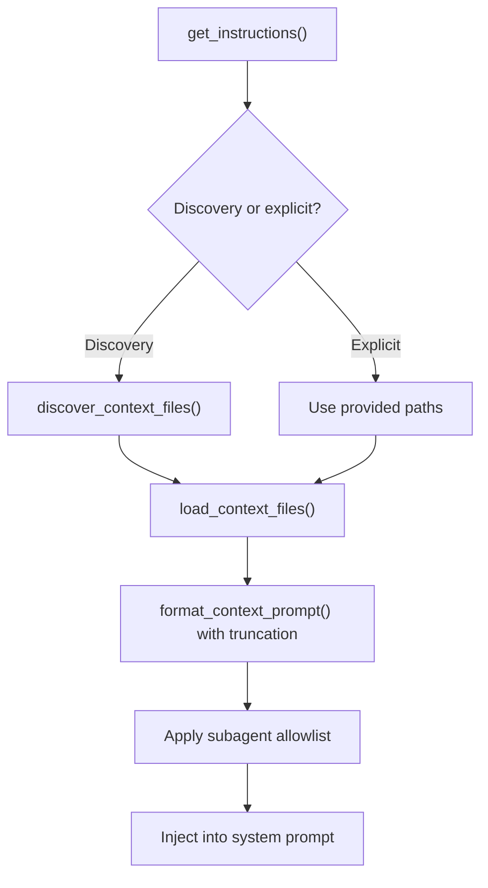
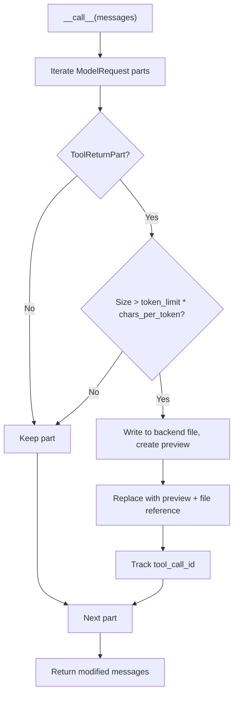
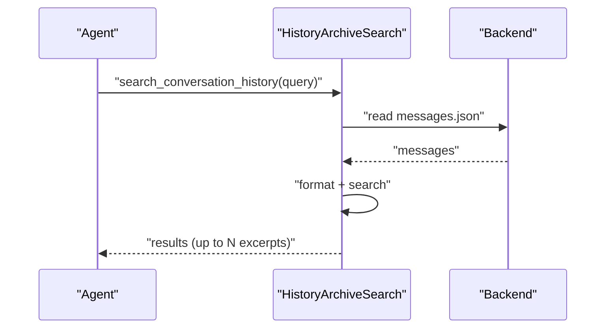
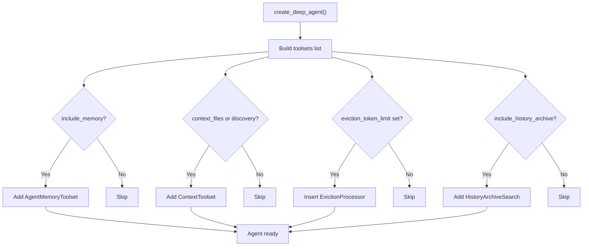
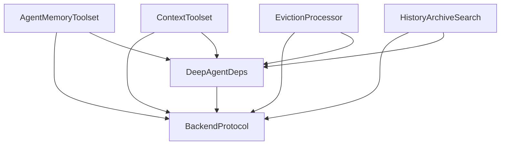

# Memory System

<cite>
**Referenced Files in This Document**
- [memory.py](file://pydantic_deep/toolsets/memory.py)
- [memory-and-context.md](file://docs/architecture/memory-and-context.md)
- [memory.md](file://docs/advanced/memory.md)
- [context-files.md](file://docs/advanced/context-files.md)
- [agent.py](file://pydantic_deep/agent.py)
- [history_archive.py](file://pydantic_deep/processors/history_archive.py)
- [eviction.py](file://pydantic_deep/processors/eviction.py)
- [deps.py](file://pydantic_deep/deps.py)
- [test_memory.py](file://tests/test_memory.py)
- [DEEP.md](file://examples/full_app/workspace/DEEP.md)
</cite>

## Table of Contents
1. [Introduction](#introduction)
2. [Project Structure](#project-structure)
3. [Core Components](#core-components)
4. [Architecture Overview](#architecture-overview)
5. [Detailed Component Analysis](#detailed-component-analysis)
6. [Dependency Analysis](#dependency-analysis)
7. [Performance Considerations](#performance-considerations)
8. [Troubleshooting Guide](#troubleshooting-guide)
9. [Conclusion](#conclusion)
10. [Appendices](#appendices)

## Introduction
This document explains the Memory System that powers persistent agent memory and context file management. It covers how agents maintain conversational memory across sessions, manage long-term context, and optimize memory usage. You will learn how persistent MEMORY.md files are organized, how memory is injected into system prompts, how to configure and manipulate memory, and how to scale and debug memory usage in production.

## Project Structure
The Memory System spans several modules:
- Memory toolset: persistent memory management and system prompt injection
- Context toolset: project-level context files injection
- History processors: eviction and compression of large tool outputs
- Agent factory: wiring memory and context into agents
- Tests: unit and integration coverage for memory behavior

**Diagram sources**
- [agent.py:196-800](file://pydantic_deep/agent.py#L196-L800)
- [memory.py:130-231](file://pydantic_deep/toolsets/memory.py#L130-L231)
- [context.py:150-208](file://pydantic_deep/toolsets/context.py#L150-L208)
- [eviction.py:110-315](file://pydantic_deep/processors/eviction.py#L110-L315)
- [history_archive.py:134-195](file://pydantic_deep/processors/history_archive.py#L134-L195)

**Section sources**
- [memory-and-context.md:1-429](file://docs/architecture/memory-and-context.md#L1-L429)
- [agent.py:196-800](file://pydantic_deep/agent.py#L196-L800)

## Core Components
- AgentMemoryToolset: provides read_memory, write_memory, update_memory and system prompt injection
- MemoryFile: loaded memory representation
- ContextToolset: loads and injects project context files (e.g., DEEP.md, AGENTS.md)
- EvictionProcessor: saves large tool outputs to files and replaces them with previews
- HistoryArchiveSearch: reads messages.json to search historical messages across compression boundaries
- DeepAgentDeps: dependency container holding backend, files, todos, and context middleware reference

Key behaviors:
- Memory is stored as MEMORY.md under a per-agent path in the backend
- Memory is auto-injected into the system prompt (first N lines) via get_instructions()
- Context files are loaded from the backend and injected into the system prompt with truncation and subagent filtering
- Large tool outputs are evicted to files to preserve context budget
- History is persisted to messages.json and can be searched even after compression

**Section sources**
- [memory.py:57-231](file://pydantic_deep/toolsets/memory.py#L57-L231)
- [context.py:35-208](file://pydantic_deep/toolsets/context.py#L35-L208)
- [eviction.py:110-315](file://pydantic_deep/processors/eviction.py#L110-L315)
- [history_archive.py:134-195](file://pydantic_deep/processors/history_archive.py#L134-L195)
- [deps.py:18-207](file://pydantic_deep/deps.py#L18-L207)

## Architecture Overview
The Memory System integrates with the broader context management pipeline. Memory is separate from conversation history, survives compression, and is writable via tools. Context files complement memory by providing project-level instructions and conventions.

**Diagram sources**
- [memory-and-context.md:67-119](file://docs/architecture/memory-and-context.md#L67-L119)
- [memory.py:217-231](file://pydantic_deep/toolsets/memory.py#L217-L231)
- [context.py:181-208](file://pydantic_deep/toolsets/context.py#L181-L208)
- [eviction.py:184-272](file://pydantic_deep/processors/eviction.py#L184-L272)
- [history_archive.py:152-188](file://pydantic_deep/processors/history_archive.py#L152-L188)

## Detailed Component Analysis

### AgentMemoryToolset
AgentMemoryToolset manages persistent memory for agents and subagents:
- Paths: {memory_dir}/{agent_name}/MEMORY.md
- Tools:
  - read_memory(): returns full memory content
  - write_memory(content): appends content with markdown-friendly separation
  - update_memory(old_text, new_text): exact find-and-replace
- System prompt injection: get_instructions() returns a formatted section with first N lines

**Diagram sources**
- [memory.py:57-231](file://pydantic_deep/toolsets/memory.py#L57-L231)

**Section sources**
- [memory.py:130-231](file://pydantic_deep/toolsets/memory.py#L130-L231)
- [memory.md:1-174](file://docs/advanced/memory.md#L1-L174)

### Memory Lifecycle and Storage
- Creation: write_memory creates MEMORY.md if absent
- Appending: write_memory separates new content from existing content with a blank line
- Updating: update_memory performs exact replacement; returns not-found if old_text is missing
- Loading: load_memory decodes UTF-8 with replacement for invalid sequences
- Prompt injection: format_memory_prompt truncates to max_lines and adds a marker when truncated

**Diagram sources**
- [memory.py:82-231](file://pydantic_deep/toolsets/memory.py#L82-L231)
- [test_memory.py:282-346](file://tests/test_memory.py#L282-L346)

**Section sources**
- [memory.py:82-231](file://pydantic_deep/toolsets/memory.py#L82-L231)
- [test_memory.py:95-346](file://tests/test_memory.py#L95-L346)

### Context Files Management
ContextToolset loads project context files (e.g., DEEP.md, AGENTS.md) and injects them into the system prompt:
- Explicit paths or auto-discovery supported
- Truncation preserves head and tail for large files
- Subagent filtering restricts sensitive files (e.g., CLAUDE.md, SOUL.md)

**Diagram sources**
- [context.py:73-208](file://pydantic_deep/toolsets/context.py#L73-L208)
- [context-files.md:1-146](file://docs/advanced/context-files.md#L1-L146)

**Section sources**
- [context.py:47-208](file://pydantic_deep/toolsets/context.py#L47-L208)
- [context-files.md:1-146](file://docs/advanced/context-files.md#L1-L146)

### Large Tool Output Eviction
To prevent context pollution, EvictionProcessor:
- Estimates content size by token limit × chars-per-token
- Writes large ToolReturnPart content to backend files
- Replaces content with a preview and file reference
- Prevents re-eviction of the same tool call ID

**Diagram sources**
- [eviction.py:184-272](file://pydantic_deep/processors/eviction.py#L184-L272)

**Section sources**
- [eviction.py:110-315](file://pydantic_deep/processors/eviction.py#L110-L315)

### History Archive Search
HistoryArchiveSearch reads messages.json (written by ContextManagerMiddleware) to search across compressed history:
- Case-insensitive substring search
- Returns up to a fixed number of excerpts with surrounding context
- Useful after compression when older messages are replaced by summaries

**Diagram sources**
- [history_archive.py:152-188](file://pydantic_deep/processors/history_archive.py#L152-L188)

**Section sources**
- [history_archive.py:134-195](file://pydantic_deep/processors/history_archive.py#L134-L195)

### Agent Factory Integration
create_deep_agent wires memory and context into agents:
- include_memory=True adds AgentMemoryToolset for main and subagents
- Subagent memory can be disabled or customized via extra fields
- ContextToolset is added when context_files or context_discovery is configured
- EvictionProcessor can be inserted early in the processor chain
- HistoryArchiveSearch is added when history archive is enabled

**Diagram sources**
- [agent.py:584-781](file://pydantic_deep/agent.py#L584-L781)

**Section sources**
- [agent.py:196-800](file://pydantic_deep/agent.py#L196-L800)

## Dependency Analysis
- AgentMemoryToolset depends on BackendProtocol for read/write operations
- ContextToolset depends on BackendProtocol for loading context files
- EvictionProcessor depends on BackendProtocol for writing evicted content
- HistoryArchiveSearch depends on reading messages.json produced by ContextManagerMiddleware
- DeepAgentDeps holds the backend reference and is passed to toolsets via RunContext

**Diagram sources**
- [memory.py:170-231](file://pydantic_deep/toolsets/memory.py#L170-L231)
- [context.py:181-208](file://pydantic_deep/toolsets/context.py#L181-L208)
- [eviction.py:166-183](file://pydantic_deep/processors/eviction.py#L166-L183)
- [history_archive.py:152-188](file://pydantic_deep/processors/history_archive.py#L152-L188)
- [deps.py:32-40](file://pydantic_deep/deps.py#L32-L40)

**Section sources**
- [memory.py:170-231](file://pydantic_deep/toolsets/memory.py#L170-L231)
- [context.py:181-208](file://pydantic_deep/toolsets/context.py#L181-L208)
- [eviction.py:166-183](file://pydantic_deep/processors/eviction.py#L166-L183)
- [history_archive.py:152-188](file://pydantic_deep/processors/history_archive.py#L152-L188)
- [deps.py:18-207](file://pydantic_deep/deps.py#L18-L207)

## Performance Considerations
- Memory injection truncation: limit lines injected into system prompt to reduce token usage
- Eviction threshold: tune token_limit to balance between saving large outputs and context budget
- Context file truncation: limit per-file content to avoid overwhelming system prompt
- Backend choice: use appropriate BackendProtocol for scale (local, in-memory, or sandbox)
- Compression: rely on ContextManagerMiddleware to summarize history and free context budget

Practical tips:
- Reduce DEFAULT_MAX_MEMORY_LINES for agents with very long memories
- Increase eviction_token_limit for domains generating large outputs
- Use subagent allowlists to minimize sensitive context exposure
- Monitor context usage via callbacks and adjust thresholds accordingly

[No sources needed since this section provides general guidance]

## Troubleshooting Guide
Common issues and resolutions:
- Memory file not found: read_memory returns a message indicating no memory; use write_memory to create it
- Update fails because text not found: ensure exact match of old_text; consider using write_memory to append
- Encoding problems: load_memory decodes with replacement; verify backend content encoding
- Memory not injected: get_instructions returns None when no memory exists; confirm path and permissions
- Large outputs polluting context: enable eviction and adjust token_limit; verify previews appear
- History search yields no results: ensure messages.json exists and is readable; check search query

Validation references:
- Unit tests cover read/write/update flows, truncation, and subagent behavior
- Integration tests verify agent creation with memory and subagent memory injection

**Section sources**
- [test_memory.py:261-346](file://tests/test_memory.py#L261-L346)
- [memory.py:82-231](file://pydantic_deep/toolsets/memory.py#L82-L231)
- [eviction.py:184-272](file://pydantic_deep/processors/eviction.py#L184-L272)
- [history_archive.py:152-188](file://pydantic_deep/processors/history_archive.py#L152-L188)

## Conclusion
The Memory System provides robust, backend-backed persistent memory and project context management. By combining per-agent MEMORY.md files, context file injection, eviction of large outputs, and history archiving, agents can maintain long-term knowledge, adhere to project conventions, and operate efficiently within token budgets. Proper configuration and monitoring ensure scalable and reliable memory usage in production.

[No sources needed since this section summarizes without analyzing specific files]

## Appendices

### Practical Examples and Configuration
- Enabling memory for main and subagents
  - Use include_memory=True in create_deep_agent
  - Subagent memory can be disabled or customized via extra fields
- Customizing memory storage and injection
  - memory_dir sets base directory for MEMORY.md files
  - max_lines controls how many lines are injected into system prompt
- Context files
  - Provide explicit paths or enable auto-discovery
  - Truncation and subagent filtering applied automatically
- Example context file
  - See DEEP.md for a workspace context example

**Section sources**
- [memory.md:1-174](file://docs/advanced/memory.md#L1-L174)
- [context-files.md:1-146](file://docs/advanced/context-files.md#L1-L146)
- [agent.py:584-781](file://pydantic_deep/agent.py#L584-L781)
- [DEEP.md:1-28](file://examples/full_app/workspace/DEEP.md#L1-L28)