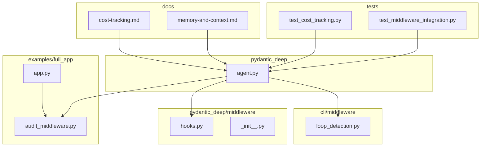
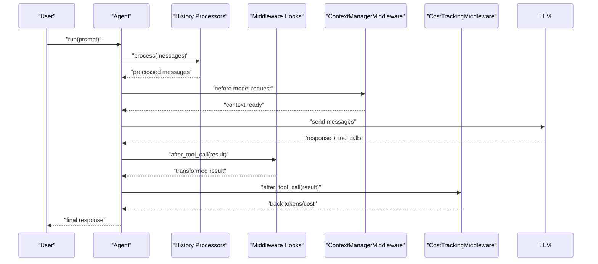
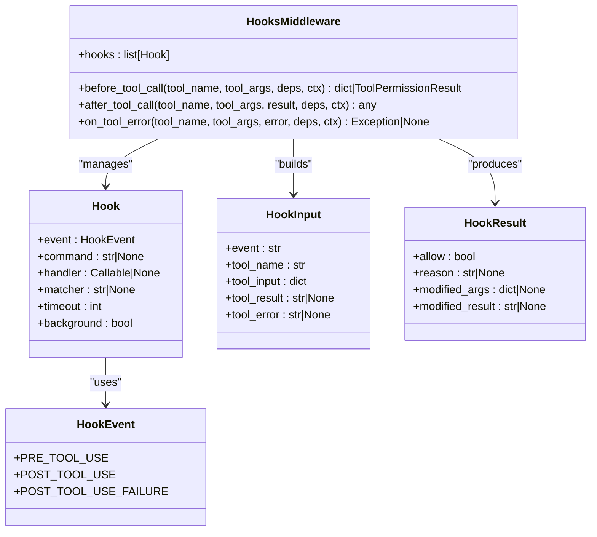
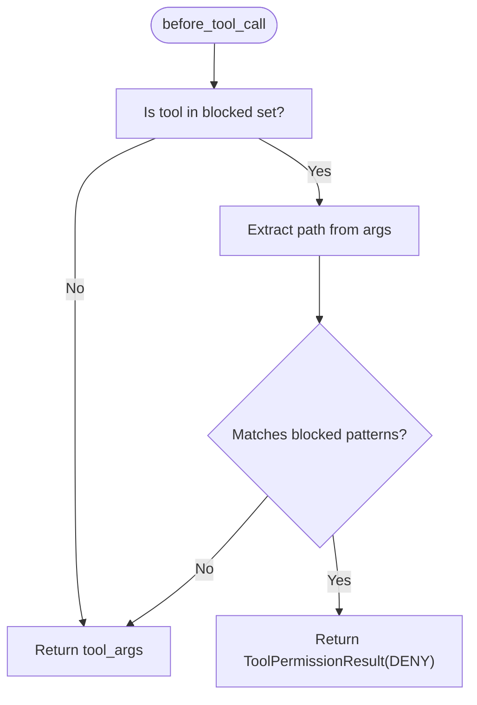
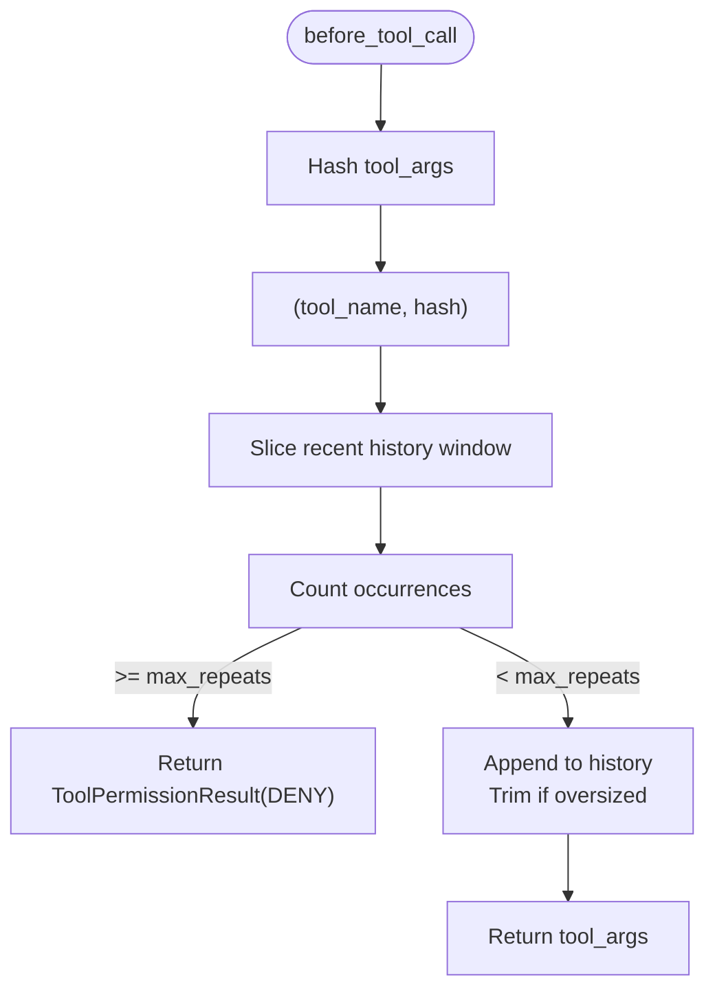
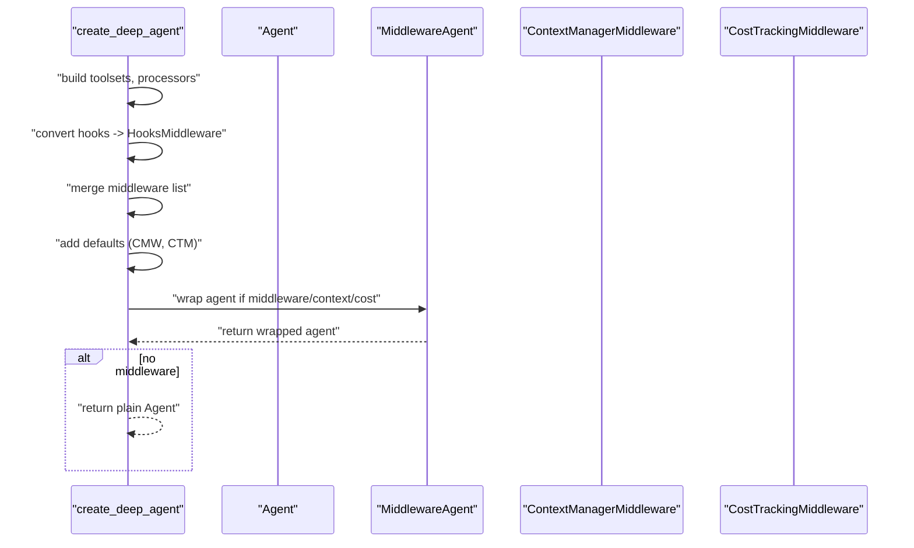
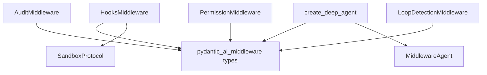

# Middleware System

<cite>
**Referenced Files in This Document**
- [hooks.py](file://pydantic_deep/middleware/hooks.py)
- [__init__.py](file://pydantic_deep/middleware/__init__.py)
- [agent.py](file://pydantic_deep/agent.py)
- [loop_detection.py](file://cli/middleware/loop_detection.py)
- [audit_middleware.py](file://examples/full_app/audit_middleware.py)
- [app.py](file://examples/full_app/app.py)
- [test_middleware_integration.py](file://tests/test_middleware_integration.py)
- [test_cost_tracking.py](file://tests/test_cost_tracking.py)
- [memory-and-context.md](file://docs/architecture/memory-and-context.md)
- [cost-tracking.md](file://docs/advanced/cost-tracking.md)
</cite>

## Table of Contents
1. [Introduction](#introduction)
2. [Project Structure](#project-structure)
3. [Core Components](#core-components)
4. [Architecture Overview](#architecture-overview)
5. [Detailed Component Analysis](#detailed-component-analysis)
6. [Dependency Analysis](#dependency-analysis)
7. [Performance Considerations](#performance-considerations)
8. [Troubleshooting Guide](#troubleshooting-guide)
9. [Conclusion](#conclusion)
10. [Appendices](#appendices)

## Introduction
This document explains the Middleware System used by pydantic-deep agents. It covers lifecycle hooks, cross-cutting concerns, middleware registration, and event-driven processing patterns. You will learn how middleware intercepts agent operations, applies transformations, and handles logging, security, and cost tracking. Practical examples show how to create custom middleware, implement security hooks, and extend agent functionality through layered middleware. We also address ordering, performance implications, debugging techniques, best practices, and integration patterns.

## Project Structure
The middleware system spans several modules:
- Core middleware types and lifecycle hooks live under pydantic_deep/middleware.
- Agent factory integrates middleware stacks and wraps agents with MiddlewareAgent when needed.
- CLI-specific middleware (e.g., loop detection) resides under cli/middleware.
- Examples demonstrate real-world middleware usage (audit and permission middleware) and integration with hooks.
- Tests validate middleware chaining, permission handling, and cost tracking integration.

**Diagram sources**
- [agent.py:893-935](file://pydantic_deep/agent.py#L893-L935)
- [hooks.py:243-372](file://pydantic_deep/middleware/hooks.py#L243-L372)
- [audit_middleware.py:34-140](file://examples/full_app/audit_middleware.py#L34-L140)
- [loop_detection.py:23-71](file://cli/middleware/loop_detection.py#L23-L71)
- [app.py:54-105](file://examples/full_app/app.py#L54-L105)

**Section sources**
- [agent.py:893-935](file://pydantic_deep/agent.py#L893-L935)
- [hooks.py:243-372](file://pydantic_deep/middleware/hooks.py#L243-L372)
- [audit_middleware.py:34-140](file://examples/full_app/audit_middleware.py#L34-L140)
- [loop_detection.py:23-71](file://cli/middleware/loop_detection.py#L23-L71)
- [app.py:54-105](file://examples/full_app/app.py#L54-L105)

## Core Components
- Lifecycle hooks (Claude Code-style): HooksMiddleware executes shell commands or Python handlers on PRE_TOOL_USE, POST_TOOL_USE, and POST_TOOL_USE_FAILURE. It supports matchers, timeouts, and background execution.
- Middleware stack: create_deep_agent builds a middleware stack and wraps the agent with MiddlewareAgent when middleware, permission handlers, or cost tracking are present. Defaults include ContextManagerMiddleware and CostTrackingMiddleware.
- Security and auditing: AuditMiddleware tracks tool usage; PermissionMiddleware blocks sensitive paths; LoopDetectionMiddleware prevents repeated tool calls; HooksMiddleware enforces pre/post actions and failures.
- Ordering guarantees: History processors run before model calls; middleware hooks run after tool calls; ContextManagerMiddleware truncates outputs and persists history; CostTrackingMiddleware accumulates token usage and cost.

**Section sources**
- [hooks.py:48-108](file://pydantic_deep/middleware/hooks.py#L48-L108)
- [hooks.py:243-372](file://pydantic_deep/middleware/hooks.py#L243-L372)
- [agent.py:893-935](file://pydantic_deep/agent.py#L893-L935)
- [audit_middleware.py:34-140](file://examples/full_app/audit_middleware.py#L34-L140)
- [loop_detection.py:23-71](file://cli/middleware/loop_detection.py#L23-L71)

## Architecture Overview
The middleware system integrates with the agent lifecycle through two axes:
- History processors and middleware hooks: Before model calls, processors transform messages; after tool calls, middleware hooks observe and modify outcomes.
- Middleware stack composition: Users can supply custom AgentMiddleware instances, Chains, or HooksMiddleware. The agent factory merges defaults and wraps with MiddlewareAgent.

**Diagram sources**
- [memory-and-context.md:67-119](file://docs/architecture/memory-and-context.md#L67-L119)
- [agent.py:893-935](file://pydantic_deep/agent.py#L893-L935)

## Detailed Component Analysis

### HooksMiddleware: Lifecycle Hooks and Cross-Cutting Concerns
HooksMiddleware implements Claude Code-style hooks:
- Events: PRE_TOOL_USE (permission and argument modification), POST_TOOL_USE (result modification), POST_TOOL_USE_FAILURE (failure-side effects).
- Execution modes: Shell commands via SandboxProtocol.execute() or async Python handlers.
- Matching: Tools are filtered by event and optional regex matcher.
- Background execution: Fire-and-forget hooks avoid blocking the agent.
- Denial and modification: PRE_TOOL_USE can deny with ToolPermissionResult; POST_TOOL_USE can replace results; handlers can return modified arguments/results.

**Diagram sources**
- [hooks.py:85-108](file://pydantic_deep/middleware/hooks.py#L85-L108)
- [hooks.py:130-144](file://pydantic_deep/middleware/hooks.py#L130-L144)
- [hooks.py:147-171](file://pydantic_deep/middleware/hooks.py#L147-L171)
- [hooks.py:243-372](file://pydantic_deep/middleware/hooks.py#L243-L372)

**Section sources**
- [hooks.py:48-108](file://pydantic_deep/middleware/hooks.py#L48-L108)
- [hooks.py:118-128](file://pydantic_deep/middleware/hooks.py#L118-L128)
- [hooks.py:173-224](file://pydantic_deep/middleware/hooks.py#L173-L224)
- [hooks.py:243-372](file://pydantic_deep/middleware/hooks.py#L243-L372)

### AuditMiddleware and PermissionMiddleware: Security and Observability
- AuditMiddleware: Tracks tool usage globally (call count, durations, breakdowns) and exposes stats for UI or analytics.
- PermissionMiddleware: Blocks access to sensitive paths by inspecting tool arguments and returning ToolPermissionResult(DENY).

**Diagram sources**
- [audit_middleware.py:104-140](file://examples/full_app/audit_middleware.py#L104-L140)

**Section sources**
- [audit_middleware.py:34-84](file://examples/full_app/audit_middleware.py#L34-L84)
- [audit_middleware.py:104-140](file://examples/full_app/audit_middleware.py#L104-L140)

### LoopDetectionMiddleware: Preventing Infinite Retries
LoopDetectionMiddleware detects repeated identical tool calls and denies them to prevent loops.

**Diagram sources**
- [loop_detection.py:14-21](file://cli/middleware/loop_detection.py#L14-L21)
- [loop_detection.py:40-67](file://cli/middleware/loop_detection.py#L40-L67)

**Section sources**
- [loop_detection.py:23-71](file://cli/middleware/loop_detection.py#L23-L71)

### Agent Factory Integration: Middleware Stack Composition
The agent factory composes middleware and processors:
- Converts hooks into HooksMiddleware and appends to middleware list.
- Adds default ContextManagerMiddleware and CostTrackingMiddleware when enabled.
- Wraps the agent with MiddlewareAgent when middleware, permission handlers, or cost tracking are present.

**Diagram sources**
- [agent.py:893-935](file://pydantic_deep/agent.py#L893-L935)

**Section sources**
- [agent.py:893-935](file://pydantic_deep/agent.py#L893-L935)

## Dependency Analysis
- HooksMiddleware depends on pydantic_ai_middleware types (AgentMiddleware, ToolDecision, ToolPermissionResult) and SandboxProtocol for command execution.
- Agent factory depends on pydantic_ai_middleware for MiddlewareAgent and default middleware creation.
- AuditMiddleware and PermissionMiddleware depend on pydantic_ai_middleware for AgentMiddleware and ToolPermissionResult.
- LoopDetectionMiddleware depends on pydantic_ai_middleware for AgentMiddleware and ToolPermissionResult.

**Diagram sources**
- [hooks.py:236-240](file://pydantic_deep/middleware/hooks.py#L236-L240)
- [agent.py:893-935](file://pydantic_deep/agent.py#L893-L935)
- [audit_middleware.py:17-19](file://examples/full_app/audit_middleware.py#L17-L19)
- [loop_detection.py:9-11](file://cli/middleware/loop_detection.py#L9-L11)

**Section sources**
- [hooks.py:236-240](file://pydantic_deep/middleware/hooks.py#L236-L240)
- [agent.py:893-935](file://pydantic_deep/agent.py#L893-L935)
- [audit_middleware.py:17-19](file://examples/full_app/audit_middleware.py#L17-L19)
- [loop_detection.py:9-11](file://cli/middleware/loop_detection.py#L9-L11)

## Performance Considerations
- Background hooks: Use background=True to avoid blocking tool calls; errors are logged but not propagated.
- Processor ordering: EvictionProcessor runs before ContextManagerMiddleware to prevent premature compression and ensure accurate token counting.
- Cost tracking: CostTrackingMiddleware reads usage after runs and can enforce budget limits; integrate callbacks for UI updates.
- Token counting: ContextManagerMiddleware supports async token counting to avoid blocking the event loop.

Practical tips:
- Prefer background hooks for non-critical tasks.
- Keep middleware chains short and focused.
- Use matchers to limit hook scope.
- Monitor middleware latency and adjust timeouts.

**Section sources**
- [hooks.py:107-108](file://pydantic_deep/middleware/hooks.py#L107-L108)
- [hooks.py:214-224](file://pydantic_deep/middleware/hooks.py#L214-L224)
- [memory-and-context.md:358-383](file://docs/architecture/memory-and-context.md#L358-L383)
- [cost-tracking.md:72-78](file://docs/advanced/cost-tracking.md#L72-L78)

## Troubleshooting Guide
Common issues and resolutions:
- Hooks require a SandboxProtocol backend: Command hooks fail if backend is not a SandboxProtocol; ensure backend supports execute().
- Permission denials: PermissionMiddleware returns ToolPermissionResult(DENY); check blocked patterns and tool argument extraction.
- Loop detection: If a tool keeps retrying, LoopDetectionMiddleware will deny repeated identical calls; adjust max_repeats or window_size.
- Middleware ordering: Verify middleware and processors are appended in the intended order; tests confirm chaining and wrapping behavior.
- Cost budget exceeded: CostTrackingMiddleware raises BudgetExceededError when cumulative cost exceeds budget; adjust budget or callbacks.

Debugging techniques:
- Use logging in middleware handlers.
- Inspect ToolPermissionResult reasons.
- Enable on_cost_update and on_context_update callbacks for visibility.
- Validate hook matchers and background flags.

**Section sources**
- [hooks.py:202-211](file://pydantic_deep/middleware/hooks.py#L202-L211)
- [audit_middleware.py:134-139](file://examples/full_app/audit_middleware.py#L134-L139)
- [loop_detection.py:52-61](file://cli/middleware/loop_detection.py#L52-L61)
- [test_middleware_integration.py:80-151](file://tests/test_middleware_integration.py#L80-L151)
- [test_cost_tracking.py:32-48](file://tests/test_cost_tracking.py#L32-L48)

## Conclusion
The Middleware System provides a flexible, layered approach to cross-cutting concerns in pydantic-deep agents. HooksMiddleware enables event-driven interception of tool lifecycles, while AuditMiddleware and PermissionMiddleware deliver security and observability. The agent factory composes a middleware stack and wraps agents with MiddlewareAgent when needed, ensuring consistent ordering and behavior. By following best practices—limiting scope, using background hooks, validating permissions, and monitoring costs—you can build robust, secure, and observable agent systems.

## Appendices

### Best Practices
- Keep middleware logic stateless or explicitly manage state.
- Use matchers to constrain hook scope and reduce overhead.
- Prefer background hooks for non-critical tasks.
- Centralize security checks in PermissionMiddleware or HooksMiddleware.
- Instrument with on_cost_update and on_context_update for observability.

### Common Use Cases
- Security gating: PRE_TOOL_USE hooks or PermissionMiddleware to block sensitive operations.
- Auditing: POST_TOOL_USE hooks or AuditMiddleware to track usage and durations.
- Cost control: CostTrackingMiddleware with budgets and callbacks.
- Loop prevention: LoopDetectionMiddleware to break infinite retries.

### Integration Patterns
- Combine middleware with processors: EvictionProcessor before ContextManagerMiddleware.
- Chain multiple AgentMiddleware instances; order matters.
- Use MiddlewareContext to share state across middleware.
- Integrate with human-in-the-loop approvals via permission_handler.

**Section sources**
- [memory-and-context.md:358-383](file://docs/architecture/memory-and-context.md#L358-L383)
- [test_middleware_integration.py:109-135](file://tests/test_middleware_integration.py#L109-L135)
- [agent.py:893-935](file://pydantic_deep/agent.py#L893-L935)