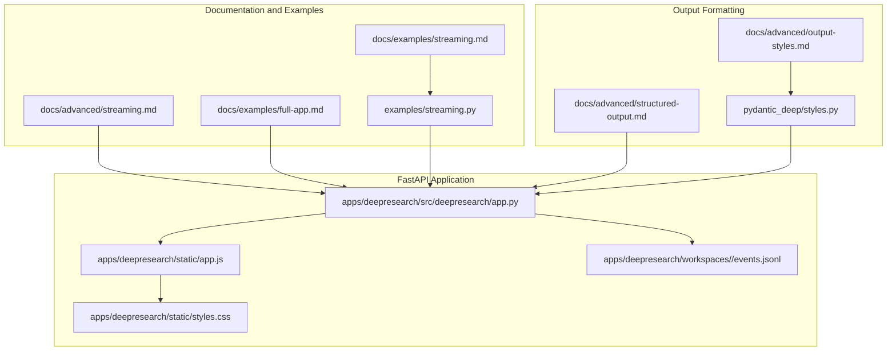
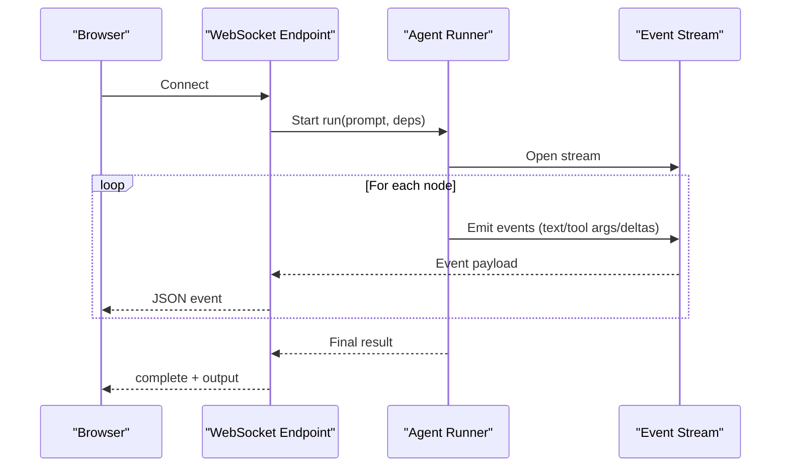
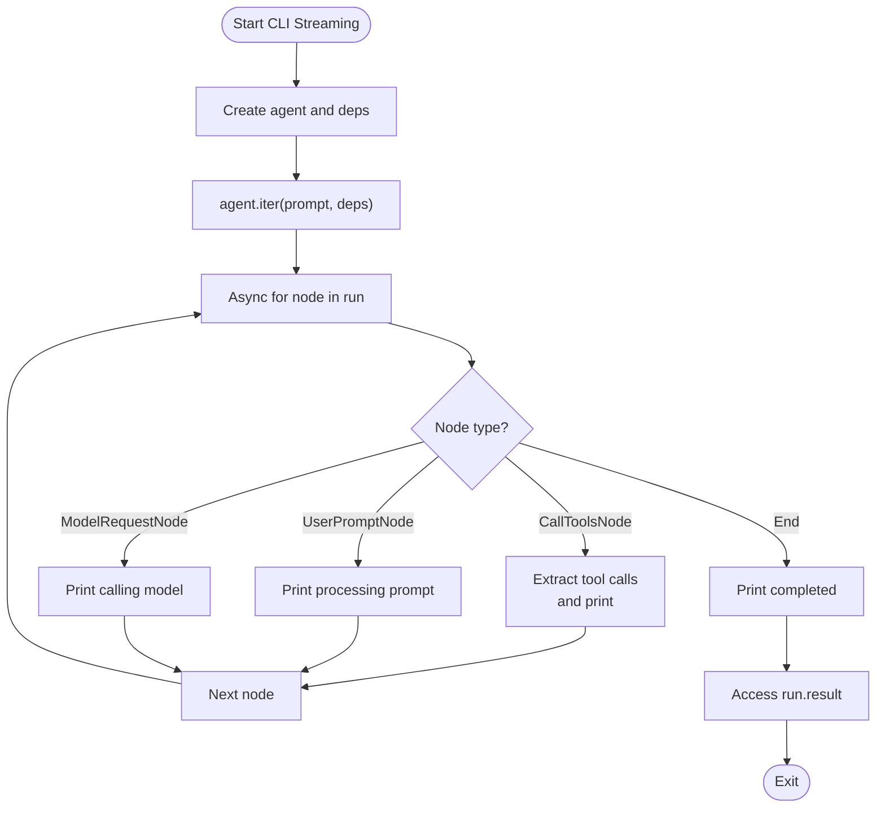
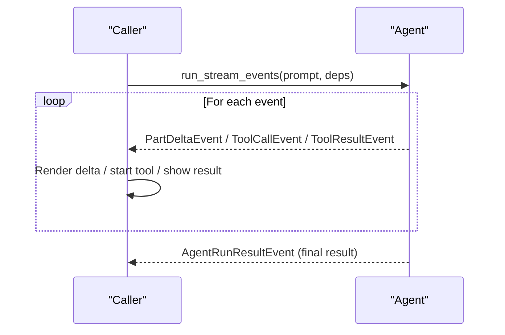
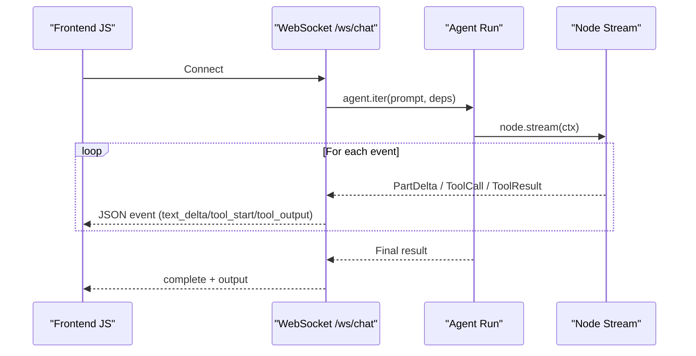
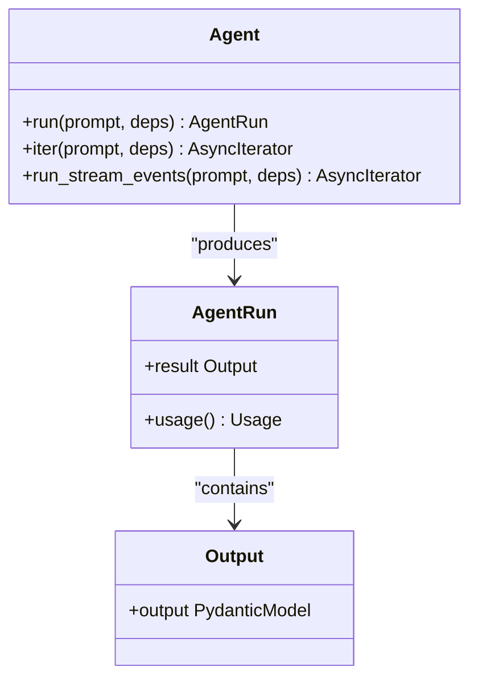
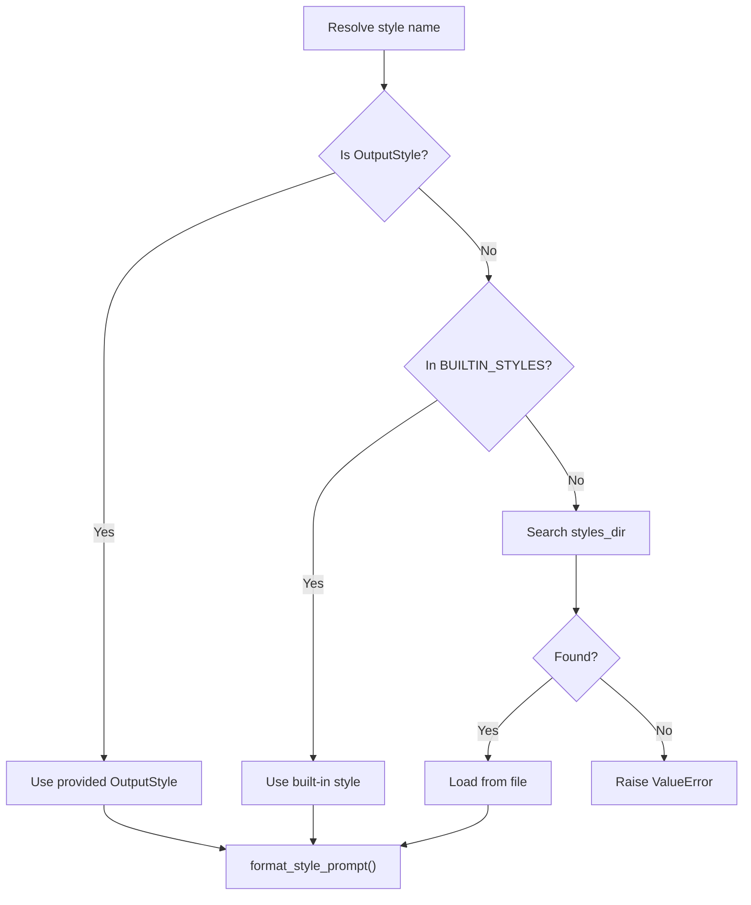
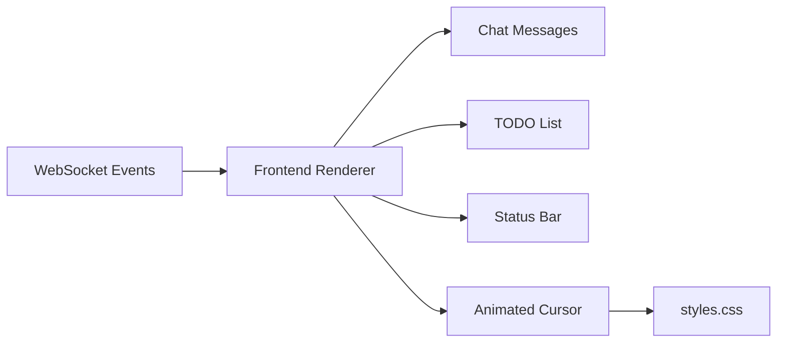
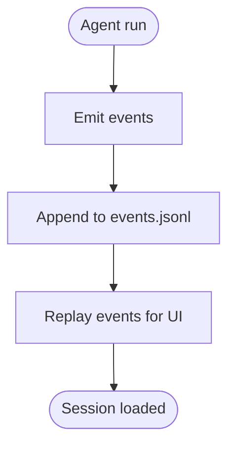
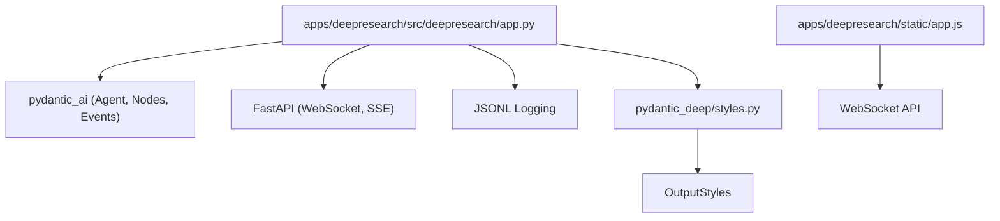

# Streaming and Real-time Communication

<cite>
**Referenced Files in This Document**
- [streaming.md](file://docs/advanced/streaming.md)
- [streaming_example.md](file://docs/examples/streaming.md)
- [streaming.py](file://examples/streaming.py)
- [app.py](file://apps/deepresearch/src/deepresearch/app.py)
- [app.js](file://apps/deepresearch/static/app.js)
- [styles.css](file://apps/deepresearch/static/styles.css)
- [structured-output.md](file://docs/advanced/structured-output.md)
- [output-styles.md](file://docs/advanced/output-styles.md)
- [styles.py](file://pydantic_deep/styles.py)
- [full-app.md](file://docs/examples/full-app.md)
- [events.jsonl](file://apps/deepresearch/workspaces/a9edd236-3c97-42ee-951f-34557dabf067/events.jsonl)
</cite>

## Table of Contents
1. [Introduction](#introduction)
2. [Project Structure](#project-structure)
3. [Core Components](#core-components)
4. [Architecture Overview](#architecture-overview)
5. [Detailed Component Analysis](#detailed-component-analysis)
6. [Dependency Analysis](#dependency-analysis)
7. [Performance Considerations](#performance-considerations)
8. [Troubleshooting Guide](#troubleshooting-guide)
9. [Conclusion](#conclusion)

## Introduction
This document explains how the project implements streaming and real-time communication for asynchronous response generation and live data transmission. It covers:
- Streaming response patterns using agent iterators and event streams
- Structured output processing and response formatting
- Real-time communication protocols via Server-Sent Events and WebSocket
- Output styling options and progressive content delivery
- Practical examples for implementing streaming responses, handling real-time updates, and managing bidirectional streams
- Performance considerations, memory management, and error handling strategies

## Project Structure
The streaming and real-time capabilities span documentation, examples, and a production FastAPI application with a browser frontend:
- Documentation and examples demonstrate CLI streaming and SSE/WS patterns
- The FastAPI application streams deltas and tool events over WebSocket
- Frontend JavaScript consumes WebSocket events and renders live UI updates
- Styles and CSS provide animated indicators for streaming UX

**Diagram sources**
- [streaming.md](file://docs/advanced/streaming.md)
- [streaming_example.md](file://docs/examples/streaming.md)
- [streaming.py](file://examples/streaming.py)
- [full-app.md](file://docs/examples/full-app.md)
- [app.py](file://apps/deepresearch/src/deepresearch/app.py)
- [app.js](file://apps/deepresearch/static/app.js)
- [styles.css](file://apps/deepresearch/static/styles.css)
- [structured-output.md](file://docs/advanced/structured-output.md)
- [output-styles.md](file://docs/advanced/output-styles.md)
- [styles.py](file://pydantic_deep/styles.py)
- [events.jsonl](file://apps/deepresearch/workspaces/a9edd236-3c97-42ee-951f-34557dabf067/events.jsonl)

**Section sources**
- [streaming.md](file://docs/advanced/streaming.md)
- [streaming_example.md](file://docs/examples/streaming.md)
- [streaming.py](file://examples/streaming.py)
- [full-app.md](file://docs/examples/full-app.md)
- [app.py](file://apps/deepresearch/src/deepresearch/app.py)
- [app.js](file://apps/deepresearch/static/app.js)
- [styles.css](file://apps/deepresearch/static/styles.css)
- [structured-output.md](file://docs/advanced/structured-output.md)
- [output-styles.md](file://docs/advanced/output-styles.md)
- [styles.py](file://pydantic_deep/styles.py)
- [events.jsonl](file://apps/deepresearch/workspaces/a9edd236-3c97-42ee-951f-34557dabf067/events.jsonl)

## Core Components
- Streaming execution with agent.iter(): Iterate over nodes to observe progress and tool calls
- Event-driven streaming: Use run_stream_events to receive fine-grained deltas and tool call events
- WebSocket streaming: Stream text deltas, tool call start/args deltas, and tool outputs over WebSocket
- Structured output: Define Pydantic models for type-safe responses
- Output styles: Inject markdown-based formatting directives into the system prompt

Key capabilities:
- Progressive content delivery via text deltas and cumulative text streaming
- Tool call lifecycle visibility: start, arguments deltas, and results
- Live UI updates: animated cursors, status indicators, and real-time lists
- Persistence: JSONL event logs for session replay and diagnostics

**Section sources**
- [streaming.md](file://docs/advanced/streaming.md)
- [streaming_example.md](file://docs/examples/streaming.md)
- [streaming.py](file://examples/streaming.py)
- [app.py](file://apps/deepresearch/src/deepresearch/app.py)
- [app.js](file://apps/deepresearch/static/app.js)
- [styles.css](file://apps/deepresearch/static/styles.css)
- [structured-output.md](file://docs/advanced/structured-output.md)
- [output-styles.md](file://docs/advanced/output-styles.md)
- [styles.py](file://pydantic_deep/styles.py)

## Architecture Overview
The system combines a FastAPI backend with a browser frontend to deliver real-time streaming:
- Backend: FastAPI routes accept WebSocket connections, run the agent, and stream events
- Frontend: JavaScript connects to WebSocket, renders deltas, and updates UI elements
- Persistence: Events logged to JSONL for session replay and debugging

**Diagram sources**
- [app.py](file://apps/deepresearch/src/deepresearch/app.py)
- [app.js](file://apps/deepresearch/static/app.js)
- [full-app.md](file://docs/examples/full-app.md)

**Section sources**
- [app.py](file://apps/deepresearch/src/deepresearch/app.py)
- [app.js](file://apps/deepresearch/static/app.js)
- [full-app.md](file://docs/examples/full-app.md)

## Detailed Component Analysis

### CLI Streaming with agent.iter()
- Demonstrates stepping through nodes, extracting tool calls, and printing progress
- Shows how to access usage statistics and created files after streaming completes

**Diagram sources**
- [streaming.py](file://examples/streaming.py)

**Section sources**
- [streaming.py](file://examples/streaming.py)
- [streaming_example.md](file://docs/examples/streaming.md)

### Event-Driven Streaming (run_stream_events)
- Emits PartDeltaEvent for text deltas, FunctionToolCallEvent for tool starts, and FunctionToolResultEvent for tool outputs
- Enables low-level control for UI rendering and analytics

**Diagram sources**
- [streaming_example.md](file://docs/examples/streaming.md)

**Section sources**
- [streaming_example.md](file://docs/examples/streaming.md)

### WebSocket Streaming in FastAPI
- Streams text deltas, tool call start, tool args deltas, and tool outputs
- Tracks streamed text for cancellation recovery and persists events to JSONL

**Diagram sources**
- [app.py](file://apps/deepresearch/src/deepresearch/app.py)
- [app.js](file://apps/deepresearch/static/app.js)

**Section sources**
- [app.py](file://apps/deepresearch/src/deepresearch/app.py)
- [app.js](file://apps/deepresearch/static/app.js)

### Structured Output Processing
- Define Pydantic models to enforce type-safe responses
- Combine with tools to produce validated, structured results
- Use field validators and examples to guide the model

**Diagram sources**
- [structured-output.md](file://docs/advanced/structured-output.md)

**Section sources**
- [structured-output.md](file://docs/advanced/structured-output.md)

### Output Styling Options
- Built-in styles: concise, explanatory, formal, conversational
- Custom styles via OutputStyle or markdown files with YAML frontmatter
- Style resolution order and injection into system prompt

**Diagram sources**
- [output-styles.md](file://docs/advanced/output-styles.md)
- [styles.py](file://pydantic_deep/styles.py)

**Section sources**
- [output-styles.md](file://docs/advanced/output-styles.md)
- [styles.py](file://pydantic_deep/styles.py)

### Real-time UI Updates and Animation
- Frontend listens to WebSocket events and updates chat, TODO list, and status
- CSS animations provide visual feedback for streaming activity

**Diagram sources**
- [app.js](file://apps/deepresearch/static/app.js)
- [styles.css](file://apps/deepresearch/static/styles.css)

**Section sources**
- [app.js](file://apps/deepresearch/static/app.js)
- [styles.css](file://apps/deepresearch/static/styles.css)

### Event Persistence and Replay
- Events logged to JSONL for session replay and diagnostics
- Supports robust debugging and post-run analysis

**Diagram sources**
- [app.py](file://apps/deepresearch/src/deepresearch/app.py)
- [events.jsonl](file://apps/deepresearch/workspaces/a9edd236-3c97-42ee-951f-34557dabf067/events.jsonl)

**Section sources**
- [app.py](file://apps/deepresearch/src/deepresearch/app.py)
- [events.jsonl](file://apps/deepresearch/workspaces/a9edd236-3c97-42ee-951f-34557dabf067/events.jsonl)

## Dependency Analysis
- Backend depends on pydantic-ai for agent graph, node types, and event streams
- Frontend depends on WebSocket APIs and DOM manipulation
- Styles depend on pydantic_deep styles module for resolution and injection
- Persistence depends on JSONL logging utilities

**Diagram sources**
- [app.py](file://apps/deepresearch/src/deepresearch/app.py)
- [app.js](file://apps/deepresearch/static/app.js)
- [styles.py](file://pydantic_deep/styles.py)

**Section sources**
- [app.py](file://apps/deepresearch/src/deepresearch/app.py)
- [app.js](file://apps/deepresearch/static/app.js)
- [styles.py](file://pydantic_deep/styles.py)

## Performance Considerations
- Streaming text deltas: Prefer delta-based updates to reduce UI churn and bandwidth
- Buffering: Batch small deltas for smoother rendering; flush when appropriate
- Memory management: Track streamed text for cancellation recovery without accumulating excessive buffers
- Event persistence: JSONL logging adds durability but consider rotation and retention policies
- Long-running tasks: Use timeouts and cancellation events to prevent resource leaks
- Tool call granularity: Stream tool args deltas incrementally to reflect argument construction in real time

[No sources needed since this section provides general guidance]

## Troubleshooting Guide
Common issues and remedies:
- WebSocket disconnects: Implement reconnection logic with exponential backoff
- Missing final result: Ensure the run completes and the final result is sent after streaming
- Tool call mismatches: Maintain tool name and ID mappings to correlate start and result events
- Cancellation recovery: Use tracked streamed text to reconstruct partial outputs on cancel
- Frontend errors: Gracefully handle malformed events and display user-friendly messages

**Section sources**
- [app.js](file://apps/deepresearch/static/app.js)
- [app.py](file://apps/deepresearch/src/deepresearch/app.py)

## Conclusion
The project provides a comprehensive foundation for streaming and real-time communication:
- Use agent.iter() and run_stream_events for flexible, low-level streaming control
- Implement WebSocket endpoints to deliver deltas and tool events to the browser
- Combine structured output and output styles for predictable, type-safe responses with customizable presentation
- Apply performance best practices and robust error handling to ensure reliable long-running streams

[No sources needed since this section summarizes without analyzing specific files]