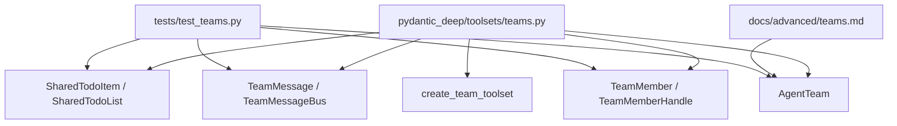
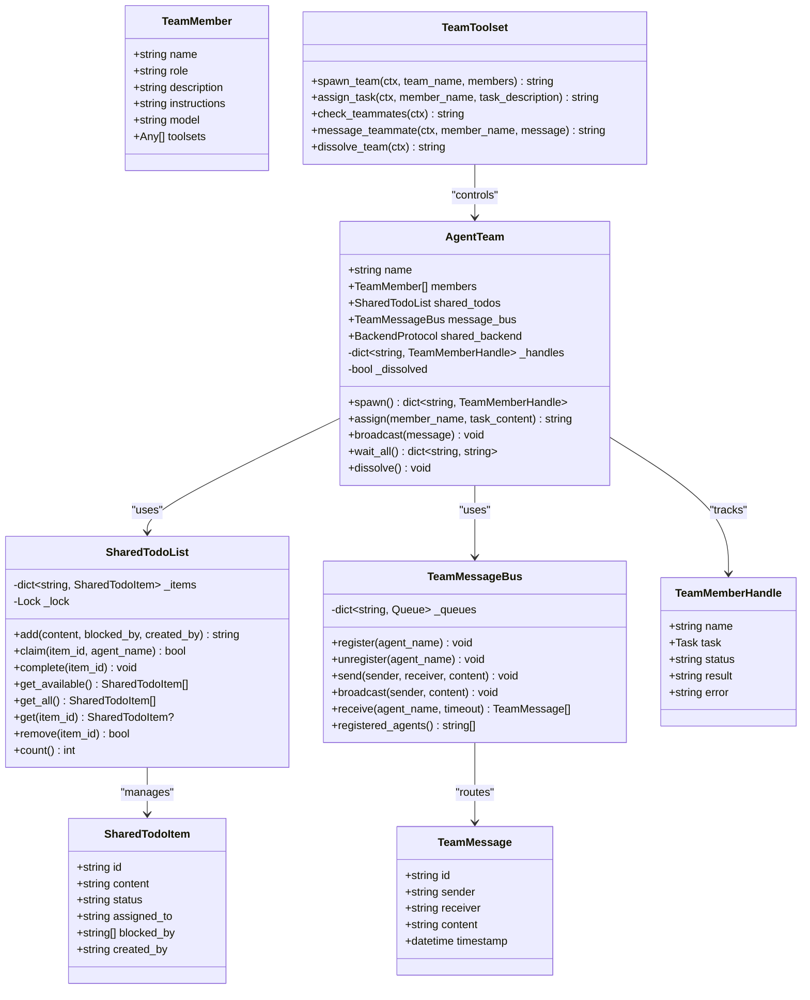
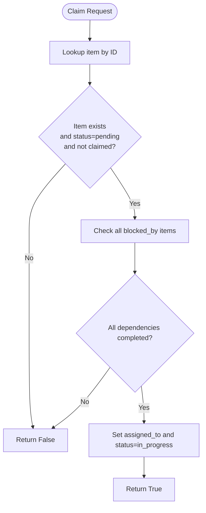
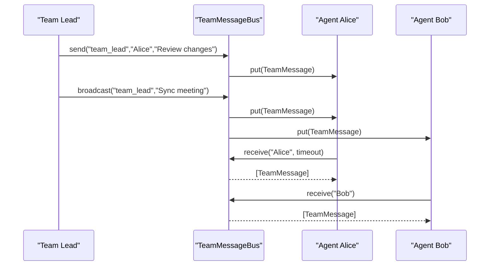
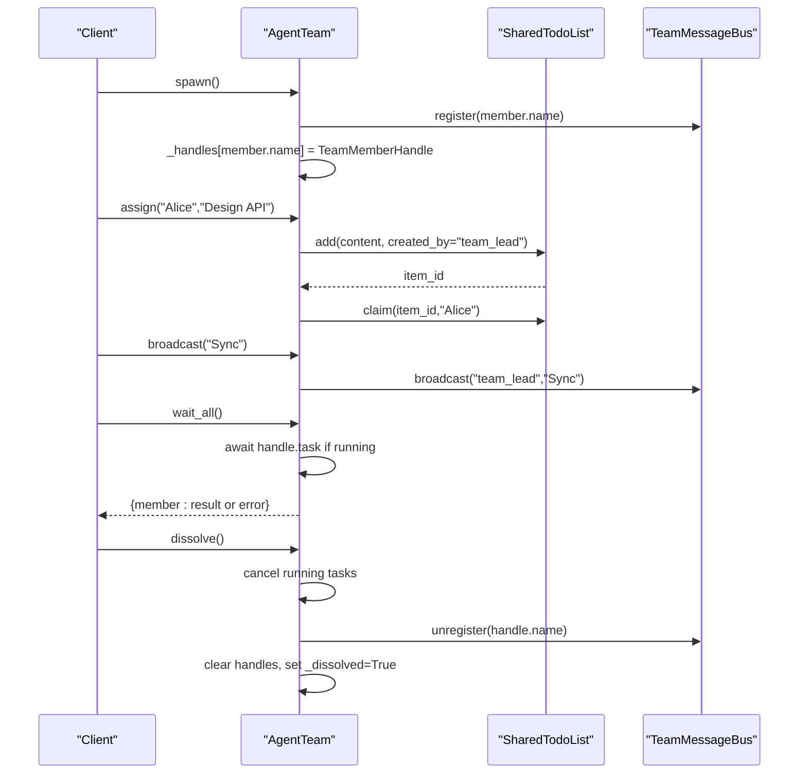
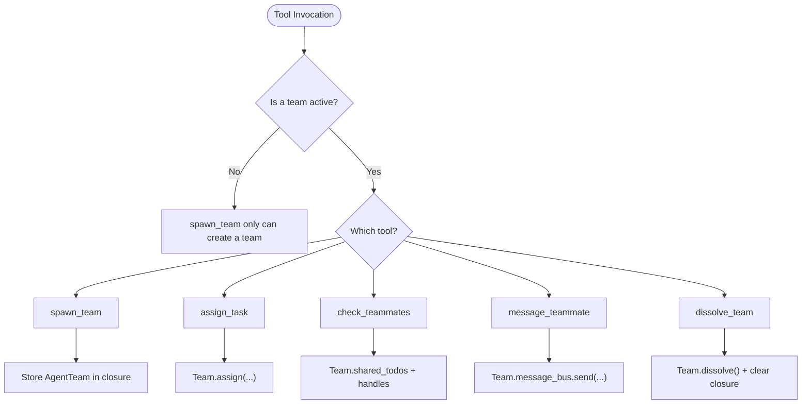
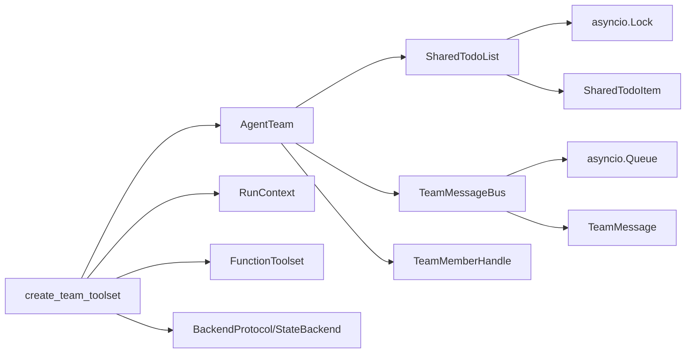

# Team Collaboration

<cite>
**Referenced Files in This Document**
- [teams.py](file://pydantic_deep/toolsets/teams.py)
- [teams.md](file://docs/advanced/teams.md)
- [test_teams.py](file://tests/test_teams.py)
</cite>

## Table of Contents
1. [Introduction](#introduction)
2. [Project Structure](#project-structure)
3. [Core Components](#core-components)
4. [Architecture Overview](#architecture-overview)
5. [Detailed Component Analysis](#detailed-component-analysis)
6. [Dependency Analysis](#dependency-analysis)
7. [Performance Considerations](#performance-considerations)
8. [Troubleshooting Guide](#troubleshooting-guide)
9. [Conclusion](#conclusion)
10. [Appendices](#appendices)

## Introduction
This document explains the Team Collaboration feature for multi-agent orchestration and parallel execution. It covers the AgentTeam class architecture, SharedTodoList for task management, TeamMessageBus for peer-to-peer communication, and team member coordination patterns. It documents the five team management tools—spawn_team, assign_task, check_teammates, message_teammate, and dissolve_team—along with their parameters, return values, and usage patterns. Practical examples demonstrate team setup, task assignment strategies, inter-agent communication, and team dissolution. Concurrency safety is addressed via asyncio locks and shared state management, with guidance on team composition, member roles, and optimal collaboration workflows.

## Project Structure
The Team Collaboration feature is implemented in a single module with supporting documentation and tests:
- Implementation: pydantic_deep/toolsets/teams.py
- Documentation: docs/advanced/teams.md
- Tests: tests/test_teams.py

**Diagram sources**
- [teams.py:17-307](file://pydantic_deep/toolsets/teams.py#L17-L307)
- [teams.md:1-177](file://docs/advanced/teams.md#L1-L177)
- [test_teams.py:1-907](file://tests/test_teams.py#L1-L907)

**Section sources**
- [teams.py:1-533](file://pydantic_deep/toolsets/teams.py#L1-L533)
- [teams.md:1-177](file://docs/advanced/teams.md#L1-L177)
- [test_teams.py:1-907](file://tests/test_teams.py#L1-L907)

## Core Components
- SharedTodoItem: Task entity with assignment, dependencies, and status.
- SharedTodoList: Asyncio-safe task tracker with claiming and dependencies.
- TeamMessage: Message between team members.
- TeamMessageBus: Peer-to-peer message routing with registration and delivery.
- TeamMember: Member definition (name, role, description, instructions, model, toolsets).
- TeamMemberHandle: Runtime handle to a team member (task, status, result, error).
- AgentTeam: Orchestrator coordinating shared state and member lifecycle.
- create_team_toolset: Factory providing five team management tools.

**Section sources**
- [teams.py:21-307](file://pydantic_deep/toolsets/teams.py#L21-L307)

## Architecture Overview
Teams are flat groups of agents that coordinate through shared state. AgentTeam composes SharedTodoList and TeamMessageBus, and manages TeamMember registration and lifecycle. The toolset exposes five tools that operate on a single active team instance.

**Diagram sources**
- [teams.py:21-307](file://pydantic_deep/toolsets/teams.py#L21-L307)

## Detailed Component Analysis

### SharedTodoList and SharedTodoItem
SharedTodoList provides an asyncio-safe task tracker with:
- Concurrency protection via asyncio.Lock.
- Adding tasks with optional dependencies (blocked_by) and creators (created_by).
- Claiming tasks for agents with preconditions (must be pending, not claimed, and dependencies must be completed).
- Completing tasks and retrieving available/unclaimed/unblocked items.
- Enumerating all items, fetching by ID, removing, and counting.

SharedTodoItem fields:
- id: Auto-generated short hex ID.
- content: Task description.
- status: pending, in_progress, or completed.
- assigned_to: Name of the agent that claimed this task.
- blocked_by: IDs of tasks that must complete first.
- created_by: Who created this task.

Concurrency safety:
- All public methods acquire the internal lock before accessing shared state.

**Diagram sources**
- [teams.py:66-83](file://pydantic_deep/toolsets/teams.py#L66-L83)

**Section sources**
- [teams.py:38-129](file://pydantic_deep/toolsets/teams.py#L38-L129)
- [test_teams.py:101-200](file://tests/test_teams.py#L101-L200)

### TeamMessage and TeamMessageBus
TeamMessage encapsulates a message with sender, receiver, content, and timestamp. TeamMessageBus supports:
- Registration/unregistration of agents.
- Direct send to a specific agent (raises KeyError if not registered).
- Broadcast to all registered agents except the sender.
- Receiving messages with optional timeout; returns all pending messages.

Concurrency safety:
- Uses asyncio.Queue per agent for thread-safe enqueue/dequeue.

**Diagram sources**
- [teams.py:136-216](file://pydantic_deep/toolsets/teams.py#L136-L216)

**Section sources**
- [teams.py:147-216](file://pydantic_deep/toolsets/teams.py#L147-L216)
- [test_teams.py:331-454](file://tests/test_teams.py#L331-L454)

### AgentTeam
AgentTeam orchestrates team members and shared state:
- spawn(): Registers all members on the message bus and prepares handles.
- assign(member_name, task_content): Adds a task to the shared todo list and claims it for the member.
- broadcast(message): Sends a message to all members.
- wait_all(): Waits for all running member tasks to complete, collecting results or errors.
- dissolve(): Cancels running tasks, unregisters members, clears handles, and marks the team as dissolved.

Member lifecycle:
- Handles track task references, status, result, and error.
- wait_all() awaits tasks if still running and aggregates outcomes.

**Diagram sources**
- [teams.py:268-306](file://pydantic_deep/toolsets/teams.py#L268-L306)

**Section sources**
- [teams.py:252-306](file://pydantic_deep/toolsets/teams.py#L252-L306)
- [test_teams.py:514-644](file://tests/test_teams.py#L514-L644)

### TeamMember and TeamMemberHandle
TeamMember defines a team member with:
- name, role, description, instructions.
- model (default model identifier) and toolsets (list of toolsets).

TeamMemberHandle tracks runtime state:
- name, task (asyncio.Task), status (idle, running, completed, failed), result, error.

These structures support the orchestration of parallel execution and status reporting.

**Section sources**
- [teams.py:224-245](file://pydantic_deep/toolsets/teams.py#L224-L245)

### create_team_toolset and Tools
create_team_toolset returns a FunctionToolset with five tools operating on a single active team instance stored in a closure:
- spawn_team(ctx, team_name, members): Creates and starts a team. Members must include name, role, description, instructions. Only one team can be active at a time.
- assign_task(ctx, member_name, task_description): Assigns a task to a specific team member.
- check_teammates(ctx): Returns a summary of member statuses and shared tasks.
- message_teammate(ctx, member_name, message): Sends a direct message to a team member.
- dissolve_team(ctx): Shuts down the team and cleans up resources.

Tool descriptions:
- Descriptions are customizable via a descriptions mapping for any of the five tools.

**Diagram sources**
- [teams.py:354-533](file://pydantic_deep/toolsets/teams.py#L354-L533)

**Section sources**
- [teams.py:313-533](file://pydantic_deep/toolsets/teams.py#L313-L533)
- [teams.md:13-21](file://docs/advanced/teams.md#L13-L21)

## Dependency Analysis
- SharedTodoList depends on asyncio.Lock for concurrency and internally stores SharedTodoItem instances.
- TeamMessageBus depends on asyncio.Queue per agent for message delivery.
- AgentTeam composes SharedTodoList and TeamMessageBus and maintains TeamMemberHandle mappings.
- create_team_toolset depends on pydantic_ai.tools.RunContext, pydantic_ai.toolsets.function.FunctionToolset, and pydantic_ai_backends.BackendProtocol/StateBackend.

**Diagram sources**
- [teams.py:38-307](file://pydantic_deep/toolsets/teams.py#L38-L307)

**Section sources**
- [teams.py:1-15](file://pydantic_deep/toolsets/teams.py#L1-L15)

## Performance Considerations
- Concurrency safety: Both SharedTodoList and TeamMessageBus use asyncio primitives to ensure safe concurrent access without explicit threading overhead.
- Queue-based messaging: TeamMessageBus uses asyncio.Queue per agent, enabling efficient asynchronous delivery and receiving with optional timeouts.
- Task awaiting: wait_all() awaits only running tasks and suppresses exceptions to collect results/errors, minimizing blocking.
- Distributed task execution: Tasks are independent agents with their own models and instructions; coordination occurs through shared state and messaging rather than centralized scheduling.

[No sources needed since this section provides general guidance]

## Troubleshooting Guide
Common issues and resolutions:
- No active team: Tools like assign_task, check_teammates, message_teammate, and dissolve_team require an active team. Use spawn_team first.
- Member not found: When assigning tasks or messaging, ensure the member name exists in the active team’s handles.
- Unregistered agent for messaging: TeamMessageBus.send requires the receiver to be registered; otherwise, a KeyError is raised.
- Timeout receiving messages: TeamMessageBus.receive supports a timeout; if no messages arrive, it returns an empty list.
- Double dissolution: Calling dissolve_team multiple times is safe; the second call will return a message indicating no team is active.
- Running tasks cancellation: dissolve() cancels any running tasks; ensure tasks handle cancellation gracefully.

**Section sources**
- [teams.py:382-533](file://pydantic_deep/toolsets/teams.py#L382-L533)
- [test_teams.py:331-644](file://tests/test_teams.py#L331-L644)

## Conclusion
The Team Collaboration feature enables robust multi-agent orchestration with shared state and peer-to-peer communication. SharedTodoList and TeamMessageBus provide concurrency-safe, dependency-aware task management and messaging. AgentTeam coordinates lifecycle and parallel execution, while create_team_toolset exposes intuitive tools for team management. By leveraging asyncio locks and queues, the system ensures safe shared-state access and efficient distributed task execution. Proper team composition and clear communication patterns lead to optimal collaboration workflows.

[No sources needed since this section summarizes without analyzing specific files]

## Appendices

### Practical Examples

- Team setup and task assignment:
  - Create a team with spawn_team.
  - Assign tasks with assign_task; tasks are added to the shared todo list and claimed for the member.
  - Monitor progress with check_teammates.
  - Communicate updates with message_teammate.
  - Clean up with dissolve_team.

- Inter-agent communication:
  - Use broadcast to announce updates to all members.
  - Use send for direct messages to specific members.
  - Receive messages with receive and process them asynchronously.

- Team dissolution:
  - Call dissolve_team to cancel running tasks, unregister members, and clear shared state.

**Section sources**
- [teams.md:5-141](file://docs/advanced/teams.md#L5-L141)
- [teams.py:382-533](file://pydantic_deep/toolsets/teams.py#L382-L533)

### Team Composition and Roles
- Define TeamMember with name, role, description, and instructions.
- Use roles to reflect specializations (e.g., designer, implementer, reviewer).
- Provide distinct models and toolsets per member when appropriate.

**Section sources**
- [teams.py:224-234](file://pydantic_deep/toolsets/teams.py#L224-L234)