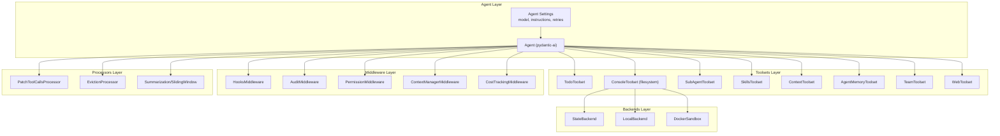
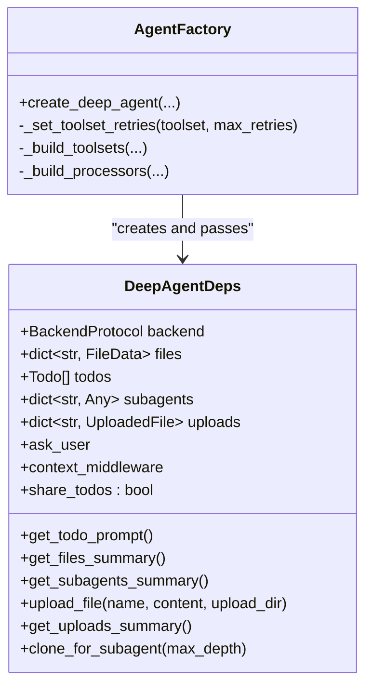
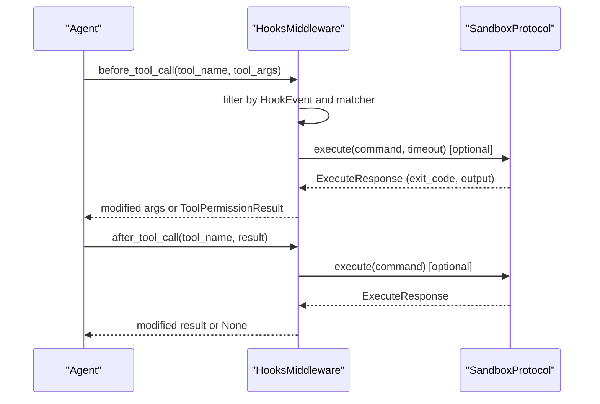
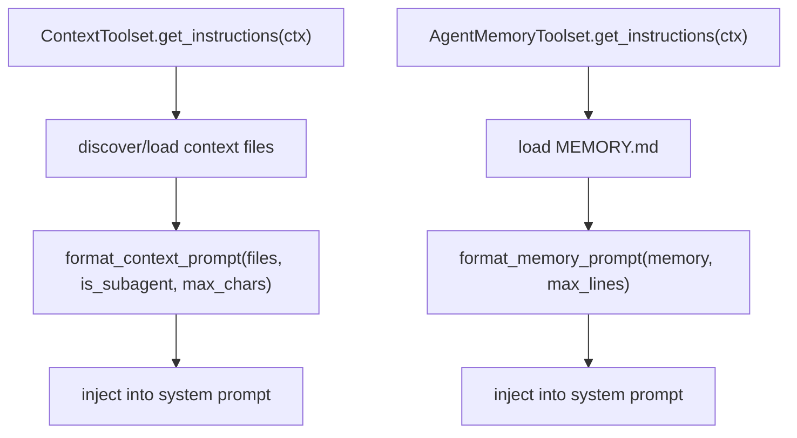
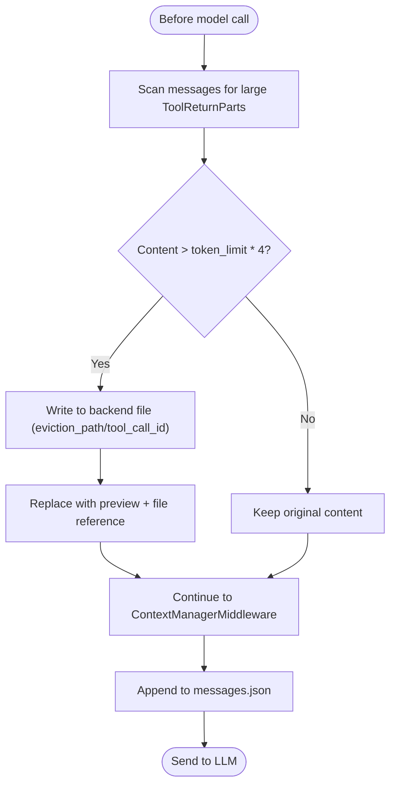
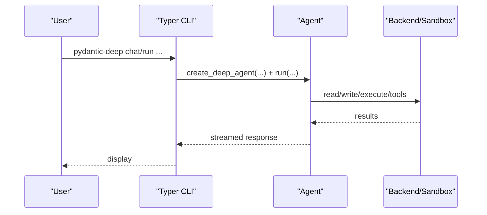
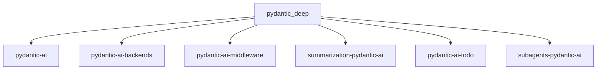
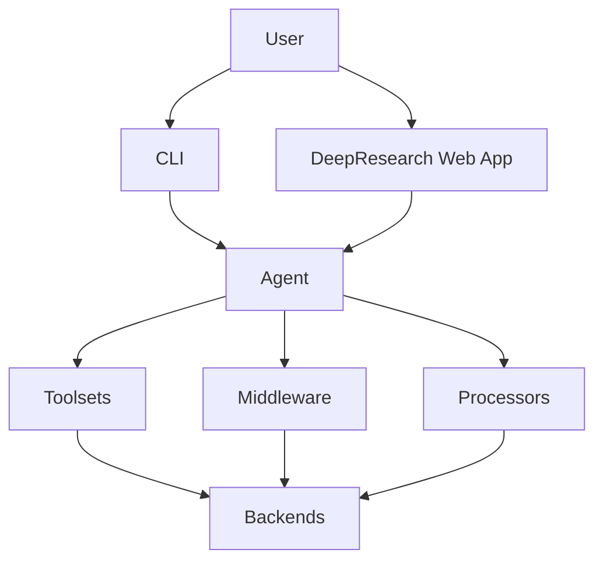

# Architecture and Design

<cite>
**Referenced Files in This Document**
- [README.md](file://README.md)
- [pyproject.toml](file://pyproject.toml)
- [pydantic_deep/__init__.py](file://pydantic_deep/__init__.py)
- [pydantic_deep/agent.py](file://pydantic_deep/agent.py)
- [pydantic_deep/deps.py](file://pydantic_deep/deps.py)
- [pydantic_deep/middleware/hooks.py](file://pydantic_deep/middleware/hooks.py)
- [pydantic_deep/toolsets/context.py](file://pydantic_deep/toolsets/context.py)
- [pydantic_deep/toolsets/memory.py](file://pydantic_deep/toolsets/memory.py)
- [pydantic_deep/processors/eviction.py](file://pydantic_deep/processors/eviction.py)
- [pydantic_deep/processors/history_archive.py](file://pydantic_deep/processors/history_archive.py)
- [pydantic_deep/types.py](file://pydantic_deep/types.py)
- [cli/main.py](file://cli/main.py)
- [apps/deepresearch/src/deepresearch/agent.py](file://apps/deepresearch/src/deepresearch/agent.py)
- [apps/deepresearch/src/deepresearch/app.py](file://apps/deepresearch/src/deepresearch/app.py)
- [apps/deepresearch/src/deepresearch/middleware.py](file://apps/deepresearch/src/deepresearch/middleware.py)
- [docs/architecture/memory-and-context.md](file://docs/architecture/memory-and-context.md)
</cite>

## Table of Contents
1. [Introduction](#introduction)
2. [Project Structure](#project-structure)
3. [Core Components](#core-components)
4. [Architecture Overview](#architecture-overview)
5. [Detailed Component Analysis](#detailed-component-analysis)
6. [Dependency Analysis](#dependency-analysis)
7. [Performance Considerations](#performance-considerations)
8. [Troubleshooting Guide](#troubleshooting-guide)
9. [Conclusion](#conclusion)
10. [Appendices](#appendices)

## Introduction
This document presents the architecture and design of the pydantic-deep agents platform. It explains the deep agent pattern, layered architecture with a plugin-like toolset system, data flow patterns, and component interaction models. It documents design decisions, architectural trade-offs, and technical constraints, and covers cross-cutting concerns such as security, monitoring, and scalability. Technology stack choices, third-party dependencies, and version compatibility are specified, along with extensibility patterns and customization points for enterprise deployments.

## Project Structure
The repository is organized into:
- Core framework: pydantic_deep (agent factory, toolsets, processors, middleware integrations)
- CLI: a Typer-based command-line interface for interactive and non-interactive runs
- Reference application: DeepResearch (FastAPI web app with MCP servers, sandboxed execution, and UI)
- Examples and documentation: examples and MkDocs-based docs

```mermaid
graph TB
subgraph "Core Framework"
PD["pydantic_deep"]
PD --> AG["agent.py"]
PD --> DP["deps.py"]
PD --> MW["middleware/hooks.py"]
PD --> TS["toolsets/*"]
PD --> PR["processors/*"]
PD --> TY["types.py"]
end
subgraph "CLI"
CLI["cli/main.py"]
end
subgraph "Reference App"
DR["apps/deepresearch/src/deepresearch"]
DR --> AGA["agent.py"]
DR --> APP["app.py"]
DR --> MID["middleware.py"]
end
CLI --> PD
DR --> PD
```

**Diagram sources**
- [pydantic_deep/agent.py:196-800](file://pydantic_deep/agent.py#L196-L800)
- [pydantic_deep/deps.py:18-207](file://pydantic_deep/deps.py#L18-L207)
- [pydantic_deep/middleware/hooks.py:243-373](file://pydantic_deep/middleware/hooks.py#L243-L373)
- [cli/main.py:1-705](file://cli/main.py#L1-L705)
- [apps/deepresearch/src/deepresearch/agent.py:376-430](file://apps/deepresearch/src/deepresearch/agent.py#L376-L430)
- [apps/deepresearch/src/deepresearch/app.py:636-800](file://apps/deepresearch/src/deepresearch/app.py#L636-L800)
- [apps/deepresearch/src/deepresearch/middleware.py:33-122](file://apps/deepresearch/src/deepresearch/middleware.py#L33-L122)

**Section sources**
- [README.md:252-288](file://README.md#L252-L288)
- [pyproject.toml:1-211](file://pyproject.toml#L1-L211)

## Core Components
- Deep Agent Factory: create_deep_agent builds a fully configured Agent with modular toolsets (planning, filesystem, subagents, skills, context, memory, teams, web), middleware, and processors.
- Dependency Injection Container: DeepAgentDeps carries backend, files, todos, subagents, uploads, ask_user callback, and context middleware reference.
- Plugin-like Toolsets: FunctionToolset-based modules expose capabilities (filesystem, todo, subagents, skills, context, memory, teams, web).
- Middleware Integrations: Hooks, Audit/Permission middleware, ContextManagerMiddleware, CostTrackingMiddleware.
- Processors: EvictionProcessor, PatchToolCallsProcessor, History Archive Search toolset.
- CLI and Reference App: Typer CLI for chat/run; DeepResearch FastAPI app with MCP servers, sandbox, and UI.

**Section sources**
- [pydantic_deep/agent.py:196-800](file://pydantic_deep/agent.py#L196-L800)
- [pydantic_deep/deps.py:18-207](file://pydantic_deep/deps.py#L18-L207)
- [pydantic_deep/__init__.py:105-206](file://pydantic_deep/__init__.py#L105-L206)
- [cli/main.py:1-705](file://cli/main.py#L1-L705)
- [apps/deepresearch/src/deepresearch/agent.py:376-430](file://apps/deepresearch/src/deepresearch/agent.py#L376-L430)
- [apps/deepresearch/src/deepresearch/app.py:636-800](file://apps/deepresearch/src/deepresearch/app.py#L636-L800)

## Architecture Overview
The system implements the deep agent pattern with:
- A layered architecture: Agent + Toolsets + Middleware + Processors + Backends
- A plugin-like system: toolsets are composable and can be toggled
- A strong separation of concerns: context management, memory, hooks, and processors operate independently
- Extensibility via skills, subagents, teams, and custom toolsets



**Diagram sources**
- [pydantic_deep/agent.py:506-718](file://pydantic_deep/agent.py#L506-L718)
- [pydantic_deep/middleware/hooks.py:243-373](file://pydantic_deep/middleware/hooks.py#L243-L373)
- [apps/deepresearch/src/deepresearch/middleware.py:33-122](file://apps/deepresearch/src/deepresearch/middleware.py#L33-L122)
- [pydantic_deep/processors/eviction.py:110-315](file://pydantic_deep/processors/eviction.py#L110-L315)
- [pydantic_deep/toolsets/context.py:150-208](file://pydantic_deep/toolsets/context.py#L150-L208)
- [pydantic_deep/toolsets/memory.py:130-231](file://pydantic_deep/toolsets/memory.py#L130-L231)

## Detailed Component Analysis

### Deep Agent Factory and Dependency Injection
- The agent factory composes toolsets, middleware, and processors based on configuration flags and runtime parameters.
- DeepAgentDeps encapsulates shared state and resources, enabling subagents to inherit or isolate state depending on configuration.
- The factory supports structured output, context management, hooks, cost tracking, and checkpointing.



**Diagram sources**
- [pydantic_deep/deps.py:18-207](file://pydantic_deep/deps.py#L18-L207)
- [pydantic_deep/agent.py:196-800](file://pydantic_deep/agent.py#L196-L800)

**Section sources**
- [pydantic_deep/agent.py:196-800](file://pydantic_deep/agent.py#L196-L800)
- [pydantic_deep/deps.py:18-207](file://pydantic_deep/deps.py#L18-L207)

### Hooks Middleware (Claude Code-style)
- Hooks execute shell commands or Python handlers on tool lifecycle events (pre/post tool use, post failure).
- Exit code conventions mirror Claude Code (0 allow, 2 deny). Background hooks run fire-and-forget.
- Requires a SandboxProtocol backend for command hooks.



**Diagram sources**
- [pydantic_deep/middleware/hooks.py:243-373](file://pydantic_deep/middleware/hooks.py#L243-L373)

**Section sources**
- [pydantic_deep/middleware/hooks.py:1-373](file://pydantic_deep/middleware/hooks.py#L1-L373)

### Context and Memory Toolsets
- ContextToolset injects project context files (e.g., AGENT.md) into the system prompt, with auto-discovery and truncation.
- AgentMemoryToolset provides read/write/update tools for persistent MEMORY.md files, injected into the system prompt with a configurable line limit.



**Diagram sources**
- [pydantic_deep/toolsets/context.py:150-208](file://pydantic_deep/toolsets/context.py#L150-L208)
- [pydantic_deep/toolsets/memory.py:130-231](file://pydantic_deep/toolsets/memory.py#L130-L231)

**Section sources**
- [pydantic_deep/toolsets/context.py:1-208](file://pydantic_deep/toolsets/context.py#L1-L208)
- [pydantic_deep/toolsets/memory.py:1-231](file://pydantic_deep/toolsets/memory.py#L1-L231)

### Eviction Processor and History Archive
- EvictionProcessor scans ToolReturnParts and saves large outputs to backend files, replacing them with previews to preserve context.
- HistoryArchiveSearch provides a read-only tool to search the persistent messages.json file for details lost during compression.



**Diagram sources**
- [pydantic_deep/processors/eviction.py:184-272](file://pydantic_deep/processors/eviction.py#L184-L272)
- [pydantic_deep/processors/history_archive.py:134-195](file://pydantic_deep/processors/history_archive.py#L134-L195)

**Section sources**
- [pydantic_deep/processors/eviction.py:1-315](file://pydantic_deep/processors/eviction.py#L1-L315)
- [pydantic_deep/processors/history_archive.py:1-195](file://pydantic_deep/processors/history_archive.py#L1-L195)

### CLI and Reference Application
- CLI provides chat, run, skills, config, providers, threads commands with model settings, sandbox, and streaming.
- DeepResearch FastAPI app integrates MCP servers (web search, URL reader, browser automation), sandboxed execution, WebSocket streaming, and UI.



**Diagram sources**
- [cli/main.py:121-292](file://cli/main.py#L121-L292)
- [apps/deepresearch/src/deepresearch/app.py:719-800](file://apps/deepresearch/src/deepresearch/app.py#L719-L800)

**Section sources**
- [cli/main.py:1-705](file://cli/main.py#L1-L705)
- [apps/deepresearch/src/deepresearch/app.py:1-800](file://apps/deepresearch/src/deepresearch/app.py#L1-L800)

## Dependency Analysis
The framework composes multiple libraries and integrates them via a thin orchestration layer:
- pydantic-ai: Agent, toolsets, messages, and middleware abstractions
- pydantic-ai-backends: BackendProtocol, LocalBackend, DockerSandbox, console toolset
- pydantic-ai-middleware: AgentMiddleware, CostTrackingMiddleware, permission handling
- summarization-pydantic-ai: ContextManagerMiddleware, SummarizationProcessor, SlidingWindowProcessor
- pydantic-ai-todo: TodoToolset and system prompt integration
- subagents-pydantic-ai: SubAgentToolset, dynamic agent registry, and task management



**Diagram sources**
- [pyproject.toml:25-34](file://pyproject.toml#L25-L34)
- [pydantic_deep/__init__.py:49-105](file://pydantic_deep/__init__.py#L49-L105)

**Section sources**
- [pyproject.toml:25-34](file://pyproject.toml#L25-L34)
- [pydantic_deep/__init__.py:49-105](file://pydantic_deep/__init__.py#L49-L105)

## Performance Considerations
- Context compression: ContextManagerMiddleware compresses history when approaching token thresholds, minimizing LLM context size.
- Large output eviction: EvictionProcessor preemptively saves large tool outputs to files, reducing context bloat.
- Async token counting: Token counters can be async to avoid blocking the event loop.
- Streaming: CLI and DeepResearch support streaming responses for responsiveness.
- Sandbox isolation: Docker sandbox isolates execution for safety and reproducibility.

[No sources needed since this section provides general guidance]

## Troubleshooting Guide
- Hook execution failures: Verify SandboxProtocol backend availability for command hooks; inspect exit codes and stderr output.
- Permission denials: PermissionMiddleware blocks sensitive paths; adjust tool arguments or use allowed paths.
- History search yields no results: Ensure messages.json exists and contains archived messages; confirm query terms.
- Context compression surprises: Adjust compress thresholds or use manual compaction; tune keep parameters.

**Section sources**
- [pydantic_deep/middleware/hooks.py:226-234](file://pydantic_deep/middleware/hooks.py#L226-L234)
- [apps/deepresearch/src/deepresearch/middleware.py:95-122](file://apps/deepresearch/src/deepresearch/middleware.py#L95-L122)
- [pydantic_deep/processors/history_archive.py:151-188](file://pydantic_deep/processors/history_archive.py#L151-L188)

## Conclusion
The pydantic-deep platform implements a robust deep agent architecture with a layered, composable design. The deep agent pattern, plugin-like toolsets, and middleware-driven cross-cutting concerns enable powerful, extensible autonomous agents. The system balances safety (hooks, permissions, sandbox), observability (audit, cost tracking), and scalability (context compression, eviction, streaming) for both CLI and web deployments.

[No sources needed since this section summarizes without analyzing specific files]

## Appendices

### System Context Diagram


**Diagram sources**
- [cli/main.py:1-705](file://cli/main.py#L1-L705)
- [apps/deepresearch/src/deepresearch/app.py:636-800](file://apps/deepresearch/src/deepresearch/app.py#L636-L800)
- [pydantic_deep/agent.py:196-800](file://pydantic_deep/agent.py#L196-L800)

### Integration Point Specifications
- Hooks: Shell commands or Python handlers on tool lifecycle events; require SandboxProtocol backend for command hooks.
- Middleware: AgentMiddleware interface for auditing, permissions, cost tracking, and context management.
- Toolsets: FunctionToolset-based modules exposing tools for filesystem, todo, subagents, skills, context, memory, teams, and web.
- Backends: BackendProtocol implementations (StateBackend, LocalBackend, DockerSandbox) for storage and execution.

**Section sources**
- [pydantic_deep/middleware/hooks.py:243-373](file://pydantic_deep/middleware/hooks.py#L243-L373)
- [pydantic_deep/toolsets/context.py:150-208](file://pydantic_deep/toolsets/context.py#L150-L208)
- [pydantic_deep/toolsets/memory.py:130-231](file://pydantic_deep/toolsets/memory.py#L130-L231)
- [pyproject.toml:25-34](file://pyproject.toml#L25-L34)

### Technology Stack and Compatibility
- Core: Python 3.10–3.13, pydantic-ai, pydantic>=2.0
- Optional extras: Typer, FastAPI, Uvicorn, Logfire, Requests, Tavily, Docker SDK
- Version compatibility: Auto-detected context windows via genai-prices; fallback to defaults when unavailable

**Section sources**
- [README.md:21-25](file://README.md#L21-L25)
- [pyproject.toml:1-211](file://pyproject.toml#L1-L211)

### Extensibility and Enterprise Customization
- Skills: Modular, discoverable skill packages with YAML frontmatter and optional scripts.
- Subagents: Dynamic agent factories, nested delegation, and shared TODO lists.
- Teams: Shared TODO lists, peer-to-peer messaging, and task assignment.
- Custom toolsets: Extend FunctionToolset to add domain-specific capabilities.
- Middleware: Compose AgentMiddleware for auditing, permissions, and cost controls.
- Backends: Swap BackendProtocol implementations for cloud or containerized environments.

**Section sources**
- [pydantic_deep/toolsets/context.py:1-208](file://pydantic_deep/toolsets/context.py#L1-L208)
- [pydantic_deep/toolsets/memory.py:1-231](file://pydantic_deep/toolsets/memory.py#L1-L231)
- [apps/deepresearch/src/deepresearch/agent.py:376-430](file://apps/deepresearch/src/deepresearch/agent.py#L376-L430)
- [apps/deepresearch/src/deepresearch/middleware.py:33-122](file://apps/deepresearch/src/deepresearch/middleware.py#L33-L122)