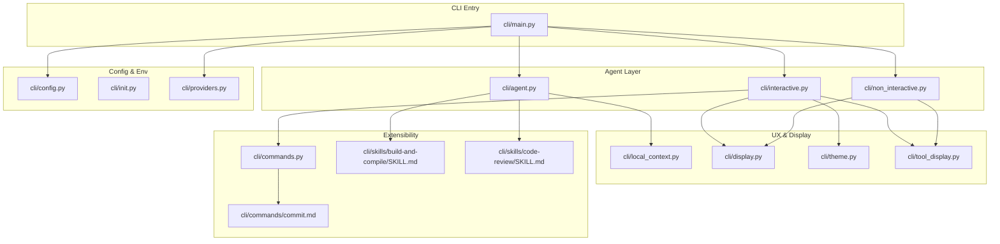
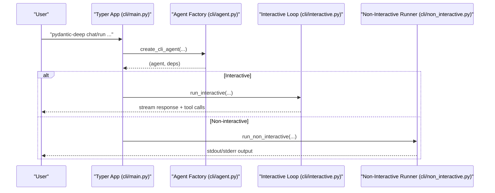
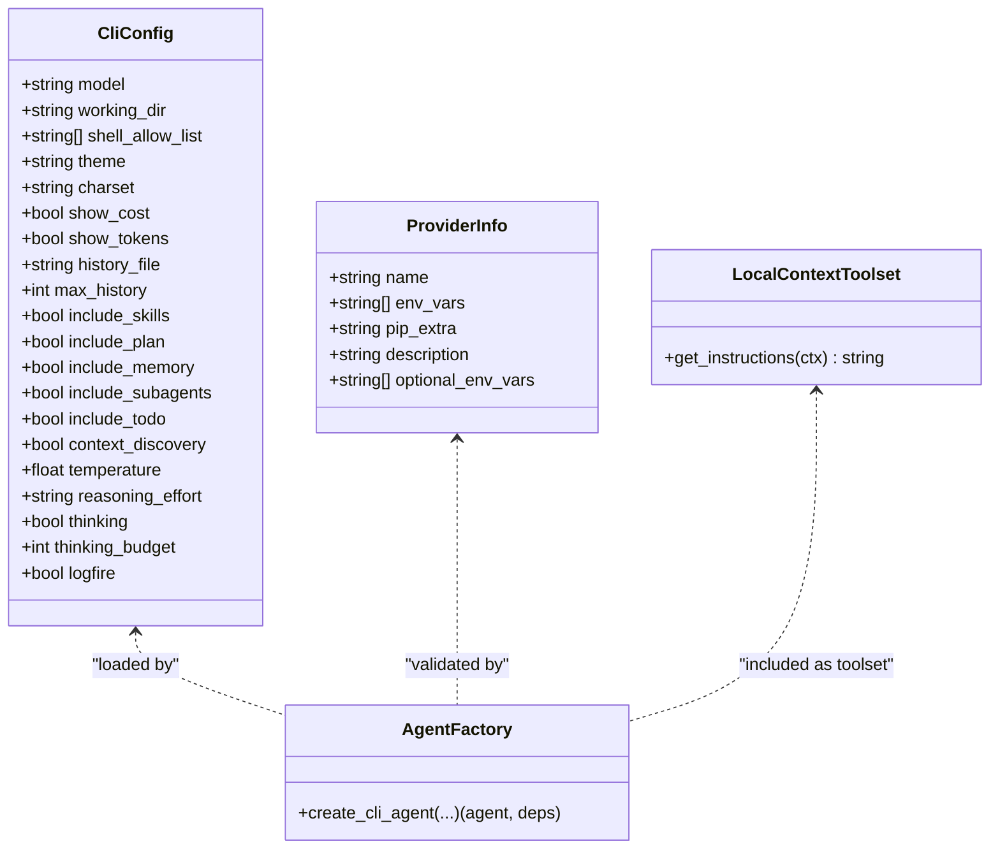
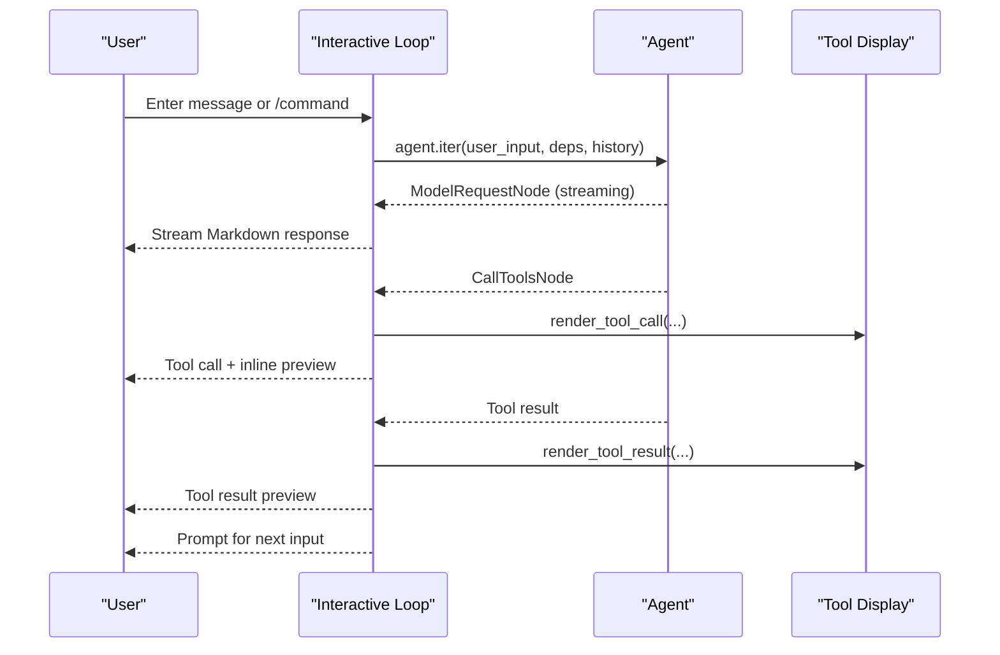
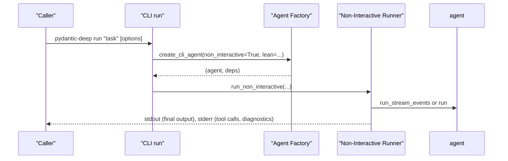
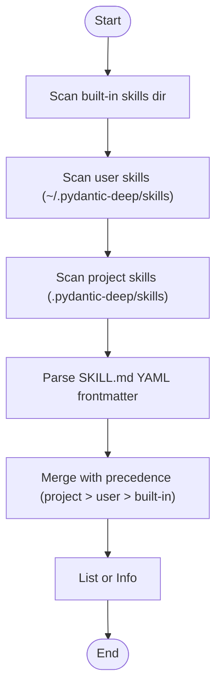
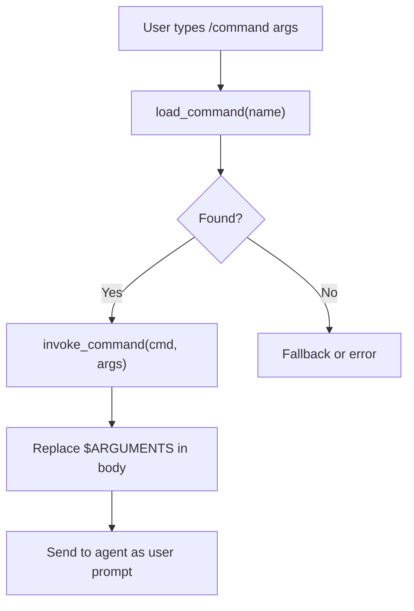
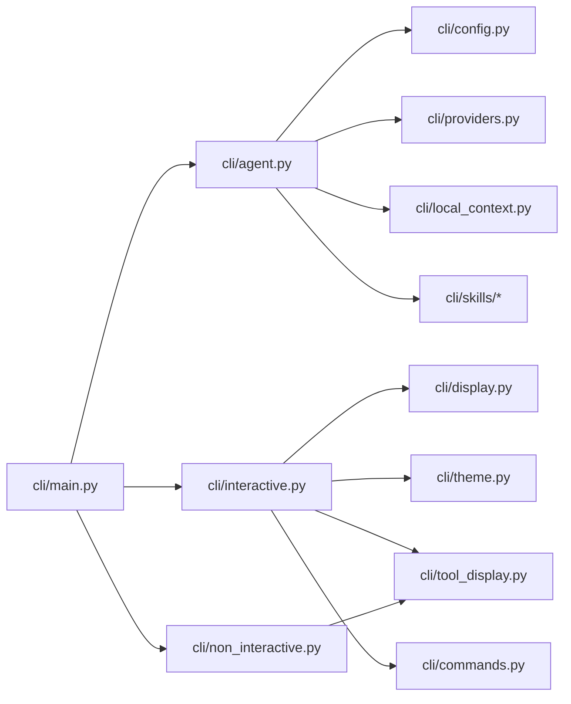

# CLI Interface

<cite>
**Referenced Files in This Document**
- [cli/main.py](file://cli/main.py)
- [cli/agent.py](file://cli/agent.py)
- [cli/interactive.py](file://cli/interactive.py)
- [cli/non_interactive.py](file://cli/non_interactive.py)
- [cli/config.py](file://cli/config.py)
- [cli/init.py](file://cli/init.py)
- [cli/providers.py](file://cli/providers.py)
- [cli/local_context.py](file://cli/local_context.py)
- [cli/display.py](file://cli/display.py)
- [cli/theme.py](file://cli/theme.py)
- [cli/tool_display.py](file://cli/tool_display.py)
- [cli/commands.py](file://cli/commands.py)
- [cli/commands/commit.md](file://cli/commands/commit.md)
- [cli/skills/build-and-compile/SKILL.md](file://cli/skills/build-and-compile/SKILL.md)
- [cli/skills/code-review/SKILL.md](file://cli/skills/code-review/SKILL.md)
</cite>

## Table of Contents
1. [Introduction](#introduction)
2. [Project Structure](#project-structure)
3. [Core Components](#core-components)
4. [Architecture Overview](#architecture-overview)
5. [Detailed Component Analysis](#detailed-component-analysis)
6. [Dependency Analysis](#dependency-analysis)
7. [Performance Considerations](#performance-considerations)
8. [Troubleshooting Guide](#troubleshooting-guide)
9. [Conclusion](#conclusion)
10. [Appendices](#appendices)

## Introduction
This document describes the CLI Interface for the terminal-based agent interaction system. It covers interactive chat mode, non-interactive batch operations, skill management, configuration and environment setup, provider integration, custom commands, and CLI customization. Practical workflows, automation patterns, troubleshooting, and performance tips are included to help both new and advanced users operate the CLI effectively.

## Project Structure
The CLI is organized around a Typer-based entry point with modular subsystems:
- Command routing and top-level commands (init, run, chat, config, skills, providers, threads)
- Agent factory for interactive and non-interactive modes
- Interactive chat loop with streaming, tool call visibility, and TODO lists
- Non-interactive executor for benchmarks and automation
- Configuration loader and writer with environment overrides
- Provider registry and validation
- Local context injection (git, project, runtime, directory tree)
- Display utilities, theming, and tool result formatting
- Custom command discovery and execution
- Skill discovery and scaffolding

**Diagram sources**
- [cli/main.py:1-705](file://cli/main.py#L1-L705)
- [cli/agent.py:1-299](file://cli/agent.py#L1-L299)
- [cli/interactive.py:1-2489](file://cli/interactive.py#L1-L2489)
- [cli/non_interactive.py:1-310](file://cli/non_interactive.py#L1-L310)
- [cli/config.py:1-254](file://cli/config.py#L1-L254)
- [cli/init.py:1-143](file://cli/init.py#L1-L143)
- [cli/providers.py:1-245](file://cli/providers.py#L1-L245)
- [cli/local_context.py:1-452](file://cli/local_context.py#L1-L452)
- [cli/display.py:1-229](file://cli/display.py#L1-L229)
- [cli/theme.py:1-213](file://cli/theme.py#L1-L213)
- [cli/tool_display.py:1-449](file://cli/tool_display.py#L1-L449)
- [cli/commands.py:1-135](file://cli/commands.py#L1-L135)
- [cli/commands/commit.md:1-24](file://cli/commands/commit.md#L1-L24)
- [cli/skills/build-and-compile/SKILL.md:1-58](file://cli/skills/build-and-compile/SKILL.md#L1-L58)
- [cli/skills/code-review/SKILL.md:1-47](file://cli/skills/code-review/SKILL.md#L1-L47)

**Section sources**
- [cli/main.py:1-705](file://cli/main.py#L1-L705)

## Core Components
- CLI entrypoint and command routing: defines top-level commands and subcommands (init, run, chat, config, skills, providers, threads).
- Agent factory: creates a configured agent with skills, planning, memory, subagents, and local context; supports non-interactive mode and lean prompts.
- Interactive chat: REPL-like loop with streaming responses, tool call visibility, TODO list, slash commands, and custom commands.
- Non-interactive executor: runs a single task, streams output, auto-approves tool calls, and supports sandboxed execution.
- Configuration system: loads TOML config, environment overrides, validates values, and exposes helpers for paths and values.
- Providers: registry of supported model providers, environment validation, and helpful error messages.
- Local context: detects git/project/runtime and builds a directory tree for system prompt injection.
- UX/display: theming, glyph sets, pretty markdown rendering, tool call/result formatting, and cost/token display.
- Custom commands: discovery from built-in, user, and project scopes; YAML frontmatter parsing; invocation templates.
- Skills: discovery from built-in and user directories; scaffolding; skill metadata parsing.

**Section sources**
- [cli/main.py:121-705](file://cli/main.py#L121-L705)
- [cli/agent.py:51-299](file://cli/agent.py#L51-L299)
- [cli/interactive.py:1-2489](file://cli/interactive.py#L1-L2489)
- [cli/non_interactive.py:1-310](file://cli/non_interactive.py#L1-L310)
- [cli/config.py:70-254](file://cli/config.py#L70-L254)
- [cli/providers.py:14-245](file://cli/providers.py#L14-L245)
- [cli/local_context.py:1-452](file://cli/local_context.py#L1-L452)
- [cli/display.py:1-229](file://cli/display.py#L1-L229)
- [cli/theme.py:1-213](file://cli/theme.py#L1-L213)
- [cli/tool_display.py:1-449](file://cli/tool_display.py#L1-L449)
- [cli/commands.py:1-135](file://cli/commands.py#L1-L135)

## Architecture Overview
The CLI composes a Typer application with subcommands. Interactive and non-interactive modes share a common agent factory that builds a pydantic-deep agent with optional middleware, hooks, and toolsets. The interactive loop streams model responses and tool call results, while non-interactive mode runs a single task and exits. Configuration, providers, and local context influence agent behavior and UX.

**Diagram sources**
- [cli/main.py:121-292](file://cli/main.py#L121-L292)
- [cli/agent.py:51-299](file://cli/agent.py#L51-L299)
- [cli/interactive.py:555-625](file://cli/interactive.py#L555-L625)
- [cli/non_interactive.py:86-212](file://cli/non_interactive.py#L86-L212)

## Detailed Component Analysis

### CLI Commands Reference
- init
  - Purpose: Initialize project scaffolding (.pydantic-deep/, skills, sessions, AGENT.md, default config).
  - Options: --dir/-d (project directory).
  - Behavior: Idempotent; copies built-in skills and creates default files if missing.
  - Example: pydantic-deep init --dir ./myproject
  - Section sources
    - [cli/main.py:121-133](file://cli/main.py#L121-L133)
    - [cli/init.py:41-91](file://cli/init.py#L41-L91)

- run (non-interactive)
  - Purpose: Execute a single task and exit; ideal for automation and benchmarks.
  - Options:
    - --model/-m, --working-dir/-w, --shell-allow-list, --quiet/-q, --no-stream, --sandbox, --runtime, --output-format/-f, --verbose/-v
    - --temperature/-t, --reasoning-effort, --thinking/--no-thinking, --thinking-budget, --model-settings, --lean
  - Behavior: Streams output; auto-approves tool calls; supports Docker sandbox; writes final output in requested format.
  - Example: pydantic-deep run "Write a test" --model openai:gpt-4.1 --output-format markdown
  - Section sources
    - [cli/main.py:135-214](file://cli/main.py#L135-L214)
    - [cli/non_interactive.py:86-212](file://cli/non_interactive.py#L86-L212)

- chat (interactive)
  - Purpose: Start an interactive chat session with streaming responses and tool call visibility.
  - Options:
    - --model/-m, --working-dir/-w, --sandbox, --runtime, --resume/-r, --sessions/-s, --auto-approve, --temperature/-t, --reasoning-effort, --thinking/--no-thinking, --thinking-budget, --model-settings, --fork
  - Behavior: Optional session resume/fork; permission handler for tool calls; slash commands and custom commands; file mention expansion (@path).
  - Example: pydantic-deep chat --model anthropic:claude-sonnet-4
  - Section sources
    - [cli/main.py:216-292](file://cli/main.py#L216-L292)
    - [cli/interactive.py:555-625](file://cli/interactive.py#L555-L625)

- config
  - config show: Print current configuration in a table.
  - config set KEY VALUE: Set a configuration value in TOML; validates keys.
  - Section sources
    - [cli/main.py:294-336](file://cli/main.py#L294-L336)
    - [cli/config.py:96-174](file://cli/config.py#L96-L174)

- skills
  - skills list [--dir]: List built-in and user skills with name, description, and source.
  - skills info NAME: Show skill details (parsed from SKILL.md).
  - skills create NAME [--dir]: Scaffold a new skill directory with template.
  - Section sources
    - [cli/main.py:338-492](file://cli/main.py#L338-L492)
    - [cli/skills/build-and-compile/SKILL.md:1-58](file://cli/skills/build-and-compile/SKILL.md#L1-L58)
    - [cli/skills/code-review/SKILL.md:1-47](file://cli/skills/code-review/SKILL.md#L1-L47)

- providers
  - providers list: Show supported providers, environment variables, and status.
  - providers check MODEL: Validate provider configuration and model string.
  - Section sources
    - [cli/main.py:498-556](file://cli/main.py#L498-L556)
    - [cli/providers.py:155-234](file://cli/providers.py#L155-L234)

- threads
  - threads list [--dir]: List saved conversation sessions with message counts.
  - threads delete THREAD_ID [--dir]: Delete a session by prefix match.
  - threads export THREAD_ID [--dir] --format/-f json|markdown: Export session history.
  - Section sources
    - [cli/main.py:557-697](file://cli/main.py#L557-L697)

### Interactive Chat Mode
- Features:
  - Streaming responses with spinner and Markdown rendering.
  - Tool call visibility with success/error states and inline previews.
  - Slash commands (/help, /clear, /compact, /context, /undo, /copy, /todos, /cost, /tokens, /model, /save, /load, /remember, /skills, /diff, /version, /bug, /quit, /exit).
  - Custom commands discovery and invocation (/command args).
  - File mentions (@path) expand to inlined file content.
  - Permission handler for tool calls; auto-approval for safe tools; manual approval for risky actions.
  - Session management: resume, fork, and export.
- UX customization:
  - Themes (default, classic, minimal).
  - Glyph sets (Unicode or ASCII).
  - Cost and token display.
- Section sources
  - [cli/interactive.py:1-2489](file://cli/interactive.py#L1-L2489)
  - [cli/display.py:147-229](file://cli/display.py#L147-L229)
  - [cli/theme.py:1-213](file://cli/theme.py#L1-L213)
  - [cli/tool_display.py:1-449](file://cli/tool_display.py#L1-L449)
  - [cli/commands.py:1-135](file://cli/commands.py#L1-L135)

### Non-Interactive Batch Operations
- Execution model:
  - Auto-approves tool calls; streams text to stdout; diagnostics to stderr.
  - Supports Docker sandbox runtime; cleans up sandbox on exit.
  - Output formats: text, JSON, Markdown.
- Options:
  - --quiet, --no-stream, --sandbox/--runtime, --output-format, --verbose, --lean, --model-settings, --temperature, --reasoning-effort, --thinking/--thinking-budget.
- Exit codes:
  - 0 success, 1 error, 2 API key error, 130 interrupt.
- Section sources
  - [cli/non_interactive.py:1-310](file://cli/non_interactive.py#L1-L310)

### Skill Management
- Discovery:
  - Built-in skills under cli/skills/.
  - User skills under ~/.pydantic-deep/skills/.
  - Project skills under .pydantic-deep/skills/.
- Scaffolding:
  - pydantic-deep skills create NAME [--dir]: Generates SKILL.md with YAML frontmatter.
- Metadata:
  - Parsed from SKILL.md YAML frontmatter (name, description, tags, version).
- Section sources
  - [cli/main.py:342-492](file://cli/main.py#L342-L492)
  - [cli/skills/build-and-compile/SKILL.md:1-58](file://cli/skills/build-and-compile/SKILL.md#L1-L58)
  - [cli/skills/code-review/SKILL.md:1-47](file://cli/skills/code-review/SKILL.md#L1-L47)

### Custom Commands
- Discovery scopes (project > user > built-in):
  - Built-in: cli/commands/*.md
  - User: ~/.pydantic-deep/commands/*.md
  - Project: .pydantic-deep/commands/*.md
- Frontmatter:
  - description, argument-hint.
  - Body supports $ARGUMENTS substitution.
- Invocation:
  - Type /command args in interactive mode; body replaces $ARGUMENTS and is sent to the agent.
- Section sources
  - [cli/commands.py:1-135](file://cli/commands.py#L1-L135)
  - [cli/commands/commit.md:1-24](file://cli/commands/commit.md#L1-L24)
  - [cli/interactive.py:124-135](file://cli/interactive.py#L124-L135)

### Configuration Management
- File location: .pydantic-deep/config.toml (project root).
- Fields (CliConfig): model, working_dir, shell_allow_list, theme, charset, show_cost, show_tokens, history_file, max_history, include_* toggles, temperature, reasoning_effort, thinking, thinking_budget, logfire.
- Loading precedence:
  - Environment variables (PYDANTIC_DEEP_*).
  - config.toml.
  - Defaults.
- Validation:
  - Warns for unknown theme/charset, negative max_history, missing provider prefix, non-existent working_dir.
- Helpers:
  - get_config_path(), get_project_dir(), get_sessions_dir(), get_history_path().
- Section sources
  - [cli/config.py:70-254](file://cli/config.py#L70-L254)
  - [cli/init.py:41-91](file://cli/init.py#L41-L91)

### Provider Integration
- Registry:
  - ProviderInfo includes name, env_vars, pip_extra, description, optional_env_vars.
  - Supported providers: openai, anthropic, google-* variants, groq, mistral, openrouter, deepseek, xai, cohere, cerebras, bedrock, azure, ollama, together, fireworks, huggingface, sambanova, github, litellm.
- Validation:
  - parse_model_string(model) -> (provider, model_name).
  - validate_provider_env(provider) -> missing env vars.
  - format_provider_error(model) -> helpful error message.
- Section sources
  - [cli/providers.py:14-245](file://cli/providers.py#L14-L245)
  - [cli/main.py:504-556](file://cli/main.py#L504-L556)

### Local Context Injection
- Git detection: branch, main branches, uncommitted changes.
- Project detection: language, package manager, monorepo type, test command.
- Runtime detection: Python, Node, Go, Rust versions when applicable.
- Directory tree: limited depth and entries for context awareness.
- Section sources
  - [cli/local_context.py:91-452](file://cli/local_context.py#L91-L452)

### Display and Theming
- Theme system: default, classic, minimal palettes.
- Glyph sets: Unicode and ASCII variants with spinner frames, icons, and separators.
- Rendering: pretty code blocks, welcome banner, cost/tokens formatting, error/warning panels.
- Section sources
  - [cli/theme.py:1-213](file://cli/theme.py#L1-L213)
  - [cli/display.py:1-229](file://cli/display.py#L1-L229)
  - [cli/tool_display.py:1-449](file://cli/tool_display.py#L1-L449)

### Agent Factory and Model Settings
- create_cli_agent():
  - Builds agent with skills, planning, memory, subagents, TODOs, local context, and web tools (optional).
  - Hooks: shell allow-list enforcement.
  - Middleware: loop detection (unless lean).
  - Model settings precedence: non-interactive defaults → config → CLI flags.
  - Working directory context injected into system prompt.
- Section sources
  - [cli/agent.py:51-299](file://cli/agent.py#L51-L299)

## Architecture Overview

**Diagram sources**
- [cli/config.py:70-94](file://cli/config.py#L70-L94)
- [cli/providers.py:14-23](file://cli/providers.py#L14-L23)
- [cli/local_context.py:405-438](file://cli/local_context.py#L405-L438)
- [cli/agent.py:51-106](file://cli/agent.py#L51-L106)

## Detailed Component Analysis

### Interactive Chat Flow

**Diagram sources**
- [cli/interactive.py:555-625](file://cli/interactive.py#L555-L625)
- [cli/tool_display.py:313-398](file://cli/tool_display.py#L313-L398)

### Non-Interactive Execution Flow

**Diagram sources**
- [cli/main.py:135-214](file://cli/main.py#L135-L214)
- [cli/agent.py:51-299](file://cli/agent.py#L51-L299)
- [cli/non_interactive.py:86-212](file://cli/non_interactive.py#L86-L212)

### Skill Discovery and Parsing

**Diagram sources**
- [cli/main.py:342-466](file://cli/main.py#L342-L466)

### Custom Command Lifecycle

**Diagram sources**
- [cli/commands.py:105-127](file://cli/commands.py#L105-L127)
- [cli/interactive.py:124-135](file://cli/interactive.py#L124-L135)

## Dependency Analysis
- Typer-driven CLI with subcommands; main.py orchestrates agent creation and delegates to interactive/non-interactive runners.
- Agent factory depends on configuration, providers, and local context; produces agent and deps for both modes.
- Interactive mode integrates with display, theming, and tool display modules for rich UX.
- Non-interactive mode streams tool calls and results to stderr; writes final output to stdout.
- Custom commands and skills are discovered from multiple scopes with clear precedence.

**Diagram sources**
- [cli/main.py:1-705](file://cli/main.py#L1-L705)
- [cli/agent.py:1-299](file://cli/agent.py#L1-L299)
- [cli/interactive.py:1-2489](file://cli/interactive.py#L1-L2489)
- [cli/non_interactive.py:1-310](file://cli/non_interactive.py#L1-L310)
- [cli/config.py:1-254](file://cli/config.py#L1-L254)
- [cli/providers.py:1-245](file://cli/providers.py#L1-L245)
- [cli/local_context.py:1-452](file://cli/local_context.py#L1-L452)
- [cli/display.py:1-229](file://cli/display.py#L1-L229)
- [cli/theme.py:1-213](file://cli/theme.py#L1-L213)
- [cli/tool_display.py:1-449](file://cli/tool_display.py#L1-L449)
- [cli/commands.py:1-135](file://cli/commands.py#L1-L135)

**Section sources**
- [cli/main.py:1-705](file://cli/main.py#L1-L705)

## Performance Considerations
- Use --lean for non-interactive benchmarks to reduce overhead (disables skills, subagents, todo).
- Prefer streaming (--no-stream false) for responsive feedback in interactive mode.
- Limit history with /compact to manage token usage; leverage context manager compaction when available.
- Choose appropriate sandbox runtime (--runtime) to balance safety and speed.
- Use --quiet to suppress diagnostics in automated pipelines; enable --verbose for debugging.
- Select providers with adequate environment variables pre-configured to avoid retries and delays.

[No sources needed since this section provides general guidance]

## Troubleshooting Guide
- Provider configuration issues:
  - Use pydantic-deep providers list and providers check MODEL to diagnose missing env vars or extras.
  - Section sources
    - [cli/providers.py:178-234](file://cli/providers.py#L178-L234)
    - [cli/main.py:504-556](file://cli/main.py#L504-L556)

- API key errors:
  - Non-interactive prints friendly hints with provider-specific env var names; interactive prints similar guidance and shows model initialization errors.
  - Section sources
    - [cli/non_interactive.py:39-55](file://cli/non_interactive.py#L39-L55)
    - [cli/interactive.py:294-304](file://cli/interactive.py#L294-L304)

- Configuration problems:
  - Validate with config show; fix unknown theme/charset; ensure working_dir exists; confirm TOML keys are valid.
  - Section sources
    - [cli/config.py:132-154](file://cli/config.py#L132-L154)
    - [cli/config.py:164-195](file://cli/config.py#L164-L195)

- Interactive UX issues:
  - Theme and charset can be overridden via PYDANTIC_DEEP_THEME and PYDANTIC_DEEP_CHARSET.
  - Section sources
    - [cli/config.py:113-131](file://cli/config.py#L113-L131)
    - [cli/theme.py:174-199](file://cli/theme.py#L174-L199)

- Sessions and threads:
  - Use threads list/delete/export to manage conversation history; resume sessions with --resume or --sessions.
  - Section sources
    - [cli/main.py:557-697](file://cli/main.py#L557-L697)

## Conclusion
The CLI Interface provides a robust, extensible terminal environment for AI-assisted development. It supports both interactive exploration and non-interactive automation, integrates with multiple model providers, and offers rich UX through theming, streaming, and tool call visibility. Configuration, skills, and custom commands enable tailored workflows for diverse development processes.

[No sources needed since this section summarizes without analyzing specific files]

## Appendices

### Practical Workflows and Automation Patterns
- One-shot automation:
  - pydantic-deep run "Generate tests for utils.py" --model openai:gpt-4.1 --output-format markdown --sandbox
- Interactive pairing:
  - pydantic-deep chat --model anthropic:claude-sonnet-4 --sessions
- Skill-driven tasks:
  - pydantic-deep skills list --dir ./my-skills
  - pydantic-deep skills create build-and-compile
- Provider validation:
  - pydantic-deep providers check openrouter:openai/gpt-5.2-codex
- Persistent memory:
  - pydantic-deep chat; /remember "Add auth guard to API"
- Custom command usage:
  - pydantic-deep chat; /commit "feat: add login flow"

[No sources needed since this section provides general guidance]