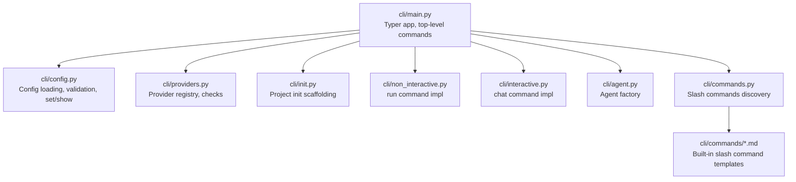
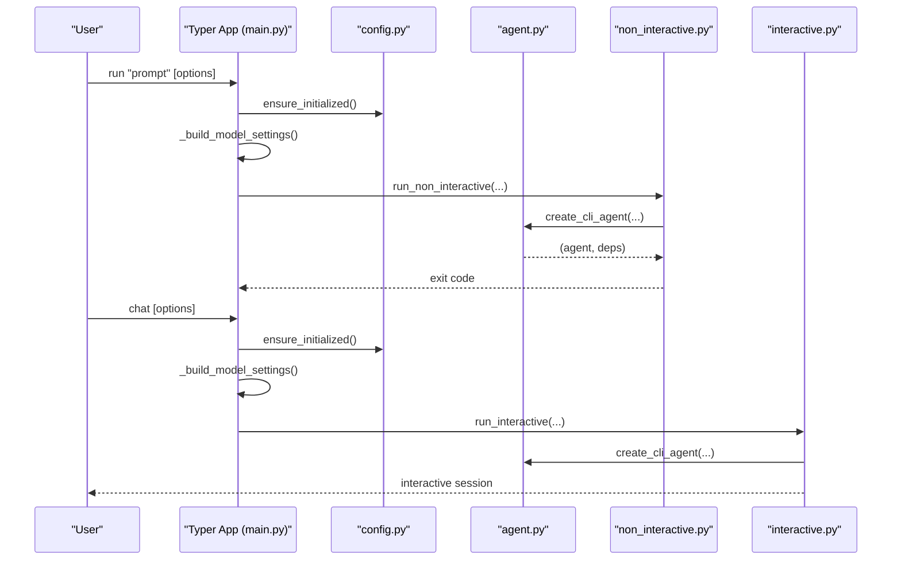
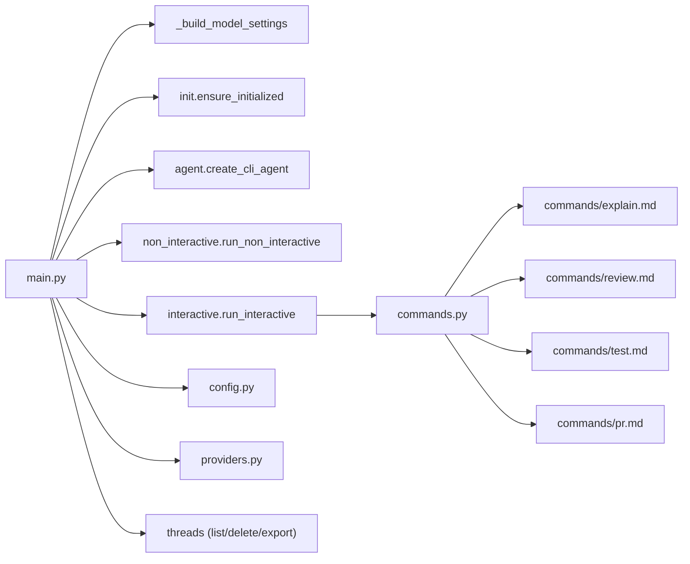

# Command Reference

<cite>
**Referenced Files in This Document**
- [main.py](file://cli/main.py)
- [config.py](file://cli/config.py)
- [providers.py](file://cli/providers.py)
- [init.py](file://cli/init.py)
- [non_interactive.py](file://cli/non_interactive.py)
- [interactive.py](file://cli/interactive.py)
- [agent.py](file://cli/agent.py)
- [commands.py](file://cli/commands.py)
- [commands/explain.md](file://cli/commands/explain.md)
- [commands/review.md](file://cli/commands/review.md)
- [commands/test.md](file://cli/commands/test.md)
- [commands/pr.md](file://cli/commands/pr.md)
</cite>

## Table of Contents
1. [Introduction](#introduction)
2. [Project Structure](#project-structure)
3. [Core Components](#core-components)
4. [Architecture Overview](#architecture-overview)
5. [Detailed Command Analysis](#detailed-command-analysis)
6. [Dependency Analysis](#dependency-analysis)
7. [Performance Considerations](#performance-considerations)
8. [Troubleshooting Guide](#troubleshooting-guide)
9. [Conclusion](#conclusion)

## Introduction
This document provides a comprehensive command reference for the CLI interface. It covers all top-level commands and subcommands, including run, chat, init, config, skills, providers, and threads. For each command, it explains syntax, required and optional parameters, options, and their effects on agent behavior. Practical examples illustrate common usage scenarios, parameter combinations, and output formats. Advanced options such as model settings, sandbox configuration, and streaming controls are documented, along with troubleshooting guidance for common errors and parameter conflicts.

## Project Structure
The CLI is implemented as a Typer application with subcommands grouped under main commands and sub-typer applications. Key modules include:
- Top-level CLI entry and commands: main.py
- Configuration management: config.py
- Provider registry and validation: providers.py
- Project scaffolding: init.py
- Non-interactive execution: non_interactive.py
- Interactive chat: interactive.py
- Agent creation and configuration: agent.py
- Custom slash commands: commands.py and markdown templates

**Diagram sources**
- [main.py:121-292](file://cli/main.py#L121-L292)
- [config.py:70-110](file://cli/config.py#L70-L110)
- [providers.py:14-152](file://cli/providers.py#L14-L152)
- [init.py:41-91](file://cli/init.py#L41-L91)
- [non_interactive.py:86-120](file://cli/non_interactive.py#L86-L120)
- [interactive.py:555-625](file://cli/interactive.py#L555-L625)
- [agent.py:51-106](file://cli/agent.py#L51-L106)
- [commands.py:31-42](file://cli/commands.py#L31-L42)

**Section sources**
- [main.py:1-705](file://cli/main.py#L1-L705)

## Core Components
- Typer application with top-level commands: run, chat, init, config, skills, providers, threads
- Subcommand groups:
  - config: show, set
  - skills: list, info, create
  - providers: list, check
  - threads: list, delete, export
- Shared model settings builder for run/chat
- Provider validation and environment checks
- Project initialization scaffolding
- Agent creation with configurable capabilities and middleware
- Interactive chat with streaming, tool-call visibility, and slash commands
- Non-interactive execution with streaming or buffered output and sandbox support

**Section sources**
- [main.py:121-292](file://cli/main.py#L121-L292)
- [config.py:70-110](file://cli/config.py#L70-L110)
- [providers.py:14-152](file://cli/providers.py#L14-L152)
- [init.py:41-91](file://cli/init.py#L41-L91)
- [agent.py:51-106](file://cli/agent.py#L51-L106)
- [interactive.py:555-625](file://cli/interactive.py#L555-L625)
- [non_interactive.py:86-120](file://cli/non_interactive.py#L86-L120)

## Architecture Overview
The CLI composes a Typer app with subcommands. Each command delegates to internal modules:
- run: ensures initialization, builds model settings, and executes non-interactive pipeline
- chat: ensures initialization, builds model settings, and starts interactive loop
- config: show and set operations backed by config loader and writer
- skills: discovers and displays skills, creates scaffolds
- providers: lists providers and validates environment
- threads: manages saved conversation sessions

**Diagram sources**
- [main.py:121-292](file://cli/main.py#L121-L292)
- [non_interactive.py:86-120](file://cli/non_interactive.py#L86-L120)
- [interactive.py:555-625](file://cli/interactive.py#L555-L625)
- [agent.py:51-106](file://cli/agent.py#L51-L106)
- [config.py:119-132](file://cli/config.py#L119-L132)

## Detailed Command Analysis

### run
Executes a single task non-interactively, streaming or buffering output, with optional sandboxing and model settings.

- Syntax
  - pydantic-deep run "<task>" [options]
- Arguments
  - task: string prompt describing the task
- Options
  - --model/-m: model string (provider:model-name)
  - --working-dir/-w: working directory for agent
  - --shell-allow-list: comma-separated allowed command prefixes
  - --quiet/-q: suppress diagnostics
  - --no-stream: buffer output instead of streaming
  - --sandbox: run in Docker sandbox
  - --runtime: sandbox runtime name (default: python-minimal)
  - --output-format/-f: text, json, markdown
  - --verbose/-v: enable verbose tool call logging
  - --temperature/-t: model temperature (0.0 deterministic)
  - --reasoning-effort: low, medium, high
  - --thinking/--no-thinking: enable extended thinking (Anthropic)
  - --thinking-budget: thinking budget in tokens (Anthropic)
  - --model-settings: JSON string of model settings
  - --lean: minimal system prompt for benchmarks
- Effects on agent behavior
  - Creates agent with non_interactive=True
  - Auto-approves tool calls (no human-in-the-loop)
  - Streams text by default; can buffer if --no-stream
  - Supports Docker sandbox backend when --sandbox
  - Applies model settings via _build_model_settings
- Output formats
  - text: rendered markdown to stdout
  - json: {"response": "..."} to stdout
  - markdown: rendered markdown to stdout
- Exit codes
  - 0 success, 1 generic error, 2 API key error, 130 interrupt
- Examples
  - pydantic-deep run "Write a test" --model openrouter:openai/gpt-4.1
  - pydantic-deep run "Fix bug" --sandbox --runtime python-minimal --output-format json
  - pydantic-deep run "Summarize" --thinking --thinking-budget 1000 --reasoning-effort high
- Advanced options
  - --model-settings '{"temperature": 0.3}'
  - --shell-allow-list "python,pip,npm"
  - --lean for deterministic, minimal-noise runs

**Section sources**
- [main.py:136-213](file://cli/main.py#L136-L213)
- [non_interactive.py:86-120](file://cli/non_interactive.py#L86-L120)
- [non_interactive.py:250-307](file://cli/non_interactive.py#L250-L307)
- [agent.py:197-222](file://cli/agent.py#L197-L222)

### chat
Starts an interactive chat session with streaming responses, tool-call visibility, and optional session management.

- Syntax
  - pydantic-deep chat [options]
- Options
  - --model/-m: model string
  - --working-dir/-w: working directory
  - --sandbox: run in Docker sandbox
  - --runtime: sandbox runtime name
  - --resume/-r: resume a session by ID
  - --sessions/-s: pick a previous session to resume
  - --auto-approve: auto-approve all tool calls (skip HITL)
  - --temperature/-t: model temperature
  - --reasoning-effort: low, medium, high
  - --thinking/--no-thinking: enable extended thinking (Anthropic)
  - --thinking-budget: thinking budget in tokens (Anthropic)
  - --model-settings: JSON string of model settings
  - --fork: fork from a resumed session (new session, same history)
- Effects on agent behavior
  - Creates agent with interactive features enabled
  - Human-in-the-loop approval for risky tools unless --auto-approve
  - Supports session resume via messages.json
  - Forking creates a new session with shared history
- Examples
  - pydantic-deep chat --sessions
  - pydantic-deep chat --resume abc123
  - pydantic-deep chat --model anthropic:claude-3.5 --thinking --thinking-budget 500

**Section sources**
- [main.py:216-291](file://cli/main.py#L216-L291)
- [interactive.py:555-625](file://cli/interactive.py#L555-L625)
- [agent.py:186-196](file://cli/agent.py#L186-L196)

### init
Initializes a project with the .pydantic-deep/ directory structure and scaffolding.

- Syntax
  - pydantic-deep init [--dir DIR]
- Options
  - --dir/-d: project directory (default: current working directory)
- Effects on agent behavior
  - Creates .pydantic-deep/, skills/, sessions/, AGENT.md, MEMORY.md, config.toml
  - Copies built-in skills if not present
- Examples
  - pydantic-deep init
  - pydantic-deep init --dir ../my-project

**Section sources**
- [main.py:121-133](file://cli/main.py#L121-L133)
- [init.py:41-91](file://cli/init.py#L41-L91)

### config
Manages configuration via show and set subcommands.

- Syntax
  - pydantic-deep config show
  - pydantic-deep config set <key> <value>
- Options
  - show: prints current configuration in a table
  - set: sets a configuration key=value
- Keys and types
  - model: string
  - working_dir: string or null
  - shell_allow_list: list of strings
  - theme: string
  - charset: string
  - show_cost: bool
  - show_tokens: bool
  - history_file: string
  - max_history: int
  - include_skills: bool
  - include_plan: bool
  - include_memory: bool
  - include_subagents: bool
  - include_todo: bool
  - context_discovery: bool
  - temperature: float
  - reasoning_effort: string
  - thinking: bool
  - thinking_budget: int
  - logfire: bool
- Precedence
  - CLI arguments > config file > defaults
- Environment overrides
  - PYDANTIC_DEEP_MODEL, PYDANTIC_DEEP_WORKING_DIR, PYDANTIC_DEEP_THEME, PYDANTIC_DEEP_CHARSET
- Examples
  - pydantic-deep config show
  - pydantic-deep config set model openrouter:openai/gpt-4.1

**Section sources**
- [main.py:294-336](file://cli/main.py#L294-L336)
- [config.py:70-110](file://cli/config.py#L70-L110)
- [config.py:113-130](file://cli/config.py#L113-L130)
- [config.py:164-174](file://cli/config.py#L164-L174)
- [config.py:176-195](file://cli/config.py#L176-L195)

### skills
Manages skills (built-in and user-defined).

- Syntax
  - pydantic-deep skills list [--dir DIR]
  - pydantic-deep skills info <name>
  - pydantic-deep skills create <name> [--dir DIR]
- Options
  - list: shows name, description, source (built-in/user)
  - info: prints skill details and body
  - create: generates a SKILL.md scaffold
- Discovery order
  - Built-in (cli/skills/) > User (~/.pydantic-deep/skills) > Project (.pydantic-deep/skills)
- Examples
  - pydantic-deep skills list
  - pydantic-deep skills info research-methodology
  - pydantic-deep skills create my-skill --dir ./skills

**Section sources**
- [main.py:338-496](file://cli/main.py#L338-L496)
- [main.py:404-428](file://cli/main.py#L404-L428)
- [main.py:430-466](file://cli/main.py#L430-L466)
- [main.py:468-492](file://cli/main.py#L468-L492)

### providers
Lists supported providers and checks model configuration.

- Syntax
  - pydantic-deep providers list
  - pydantic-deep providers check <model>
- Effects on agent behavior
  - Validates environment variables and optional extras
  - Provides helpful error messages and installation hints
- Examples
  - pydantic-deep providers list
  - pydantic-deep providers check openrouter:openai/gpt-5.2-codex

**Section sources**
- [main.py:498-556](file://cli/main.py#L498-L556)
- [providers.py:155-171](file://cli/providers.py#L155-L171)
- [providers.py:178-187](file://cli/providers.py#L178-L187)
- [providers.py:205-234](file://cli/providers.py#L205-L234)

### threads
Manages saved conversation threads.

- Syntax
  - pydantic-deep threads list [--dir DIR]
  - pydantic-deep threads delete <thread-id-or-prefix> [--dir DIR]
  - pydantic-deep threads export <thread-id-or-prefix> [--dir DIR --format json|markdown]
- Effects on agent behavior
  - Reads messages.json per session directory
  - Supports prefix-based lookup
- Examples
  - pydantic-deep threads list
  - pydantic-deep threads export abc123 --format json
  - pydantic-deep threads delete abc123

**Section sources**
- [main.py:557-696](file://cli/main.py#L557-L696)
- [interactive.py:635-642](file://cli/interactive.py#L635-L642)

### Slash Commands (Interactive)
Within chat, users can type /command to trigger custom or built-in commands. These are markdown templates with YAML frontmatter.

- Built-in slash commands
  - /help, /clear, /compact, /context, /undo, /copy, /todos, /cost, /tokens, /model, /save, /load, /remember, /diff, /version, /bug, /quit, /exit
- Custom slash commands
  - Discovered from cli/commands/*.md, ~/.pydantic-deep/commands/*.md, .pydantic-deep/commands/*.md (order of precedence)
  - Frontmatter supports description and argument-hint
  - Body may include $ARGUMENTS placeholder for substitution
- Examples
  - /explain main.py
  - /review staged
  - /test test_app.py
  - /pr main

**Section sources**
- [interactive.py:89-122](file://cli/interactive.py#L89-L122)
- [commands.py:44-69](file://cli/commands.py#L44-L69)
- [commands.py:105-127](file://cli/commands.py#L105-L127)
- [commands/explain.md:1-20](file://cli/commands/explain.md#L1-L20)
- [commands/review.md:1-26](file://cli/commands/review.md#L1-L26)
- [commands/test.md:1-22](file://cli/commands/test.md#L1-L22)
- [commands/pr.md:1-20](file://cli/commands/pr.md#L1-L20)

## Dependency Analysis
- run and chat depend on:
  - _build_model_settings for unified model settings
  - ensure_initialized for .pydantic-deep presence
  - create_cli_agent for agent construction
- config depends on:
  - CliConfig dataclass and loaders
  - Environment variable overrides
- providers depends on:
  - ProviderInfo registry and environment checks
- threads depends on:
  - sessions directory and messages.json parsing
- interactive depends on:
  - slash command discovery and custom command invocation
- non_interactive depends on:
  - sandbox backend creation and Docker support

**Diagram sources**
- [main.py:96-118](file://cli/main.py#L96-L118)
- [main.py:186-213](file://cli/main.py#L186-L213)
- [main.py:266-291](file://cli/main.py#L266-L291)
- [agent.py:51-106](file://cli/agent.py#L51-L106)
- [non_interactive.py:86-120](file://cli/non_interactive.py#L86-L120)
- [interactive.py:555-625](file://cli/interactive.py#L555-L625)
- [config.py:70-110](file://cli/config.py#L70-L110)
- [providers.py:14-152](file://cli/providers.py#L14-L152)
- [commands.py:31-42](file://cli/commands.py#L31-L42)

**Section sources**
- [main.py:96-118](file://cli/main.py#L96-L118)
- [agent.py:51-106](file://cli/agent.py#L51-L106)
- [non_interactive.py:86-120](file://cli/non_interactive.py#L86-L120)
- [interactive.py:555-625](file://cli/interactive.py#L555-L625)
- [commands.py:84-102](file://cli/commands.py#L84-L102)

## Performance Considerations
- Streaming vs buffering
  - run: default streaming for responsive output; use --no-stream to buffer
  - chat: streaming with spinner transitions; non-TTY mode writes raw text
- Sandbox overhead
  - --sandbox adds container startup and teardown costs; choose runtime carefully
- Model settings
  - temperature 0.0 improves determinism for benchmarks (--lean)
  - reasoning_effort and thinking budget influence latency and cost
- Tool call verbosity
  - --verbose increases stderr output volume; use selectively
- Cost tracking
  - show_cost and show_tokens enabled by default; consider disabling for very large runs

[No sources needed since this section provides general guidance]

## Troubleshooting Guide
- Provider configuration errors
  - Use pydantic-deep providers check <model> to diagnose missing env vars or extras
  - providers list shows ready/missing keys and usage examples
- API key issues
  - run and chat print helpful hints for setting provider keys
  - run_non_interactive/_print_api_error detects API key errors and suggests exports
- Missing Docker support
  - run with --sandbox requires pydantic-deep[sandbox]; non-installed prints install hint
- Unknown config keys
  - config set raises KeyError for invalid keys; see valid keys in CliConfig
- Threads not found
  - threads list/delete/export handle missing directories and prefix mismatches
- Parameter conflicts
  - --sessions triggers interactive picker; combine with --resume for explicit ID
  - --lean disables skills/memory/plan/subagents/todo for minimal overhead

**Section sources**
- [providers.py:205-234](file://cli/providers.py#L205-L234)
- [main.py:504-556](file://cli/main.py#L504-L556)
- [non_interactive.py:39-55](file://cli/non_interactive.py#L39-L55)
- [non_interactive.py:226-248](file://cli/non_interactive.py#L226-L248)
- [config.py:176-185](file://cli/config.py#L176-L185)
- [main.py:561-606](file://cli/main.py#L561-L606)
- [main.py:608-639](file://cli/main.py#L608-L639)
- [main.py:641-696](file://cli/main.py#L641-L696)

## Conclusion
The CLI offers a robust, extensible interface for running tasks and chatting with an AI agent. Commands integrate configuration, provider validation, and session/thread management. Use run for non-interactive automation, chat for interactive development, and the subcommands under config, skills, providers, and threads for lifecycle and environment management. Leverage advanced options like model settings, sandboxing, and streaming to tailor performance and safety to your workflow.