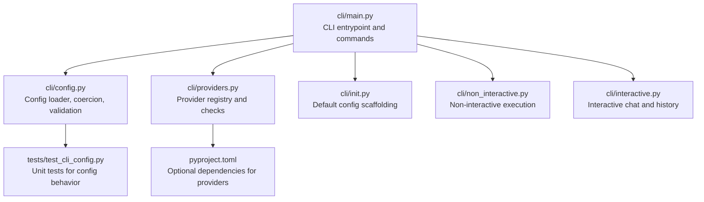
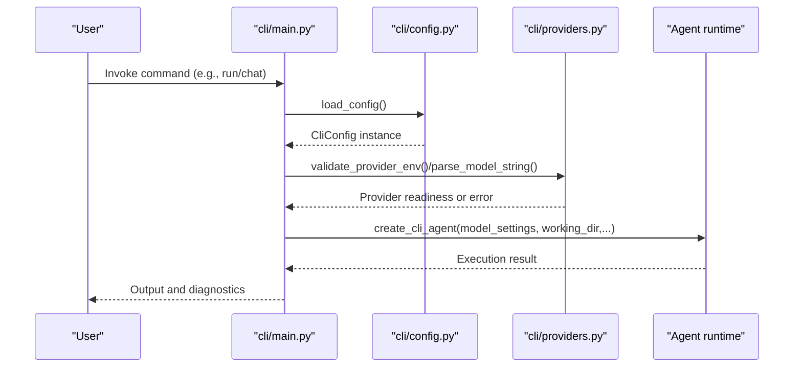
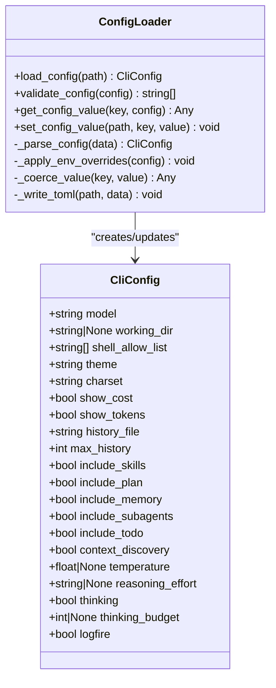
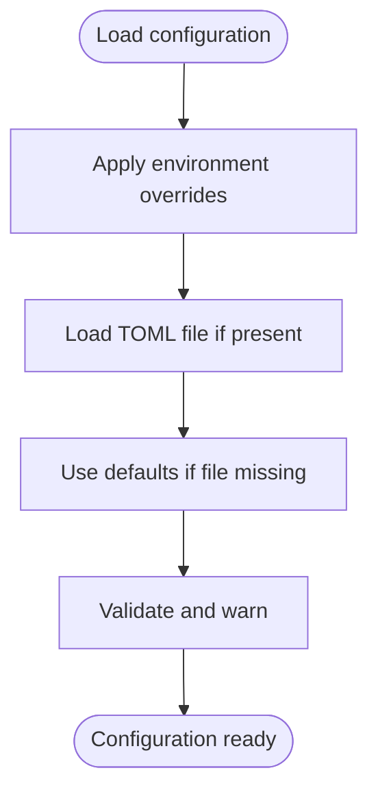
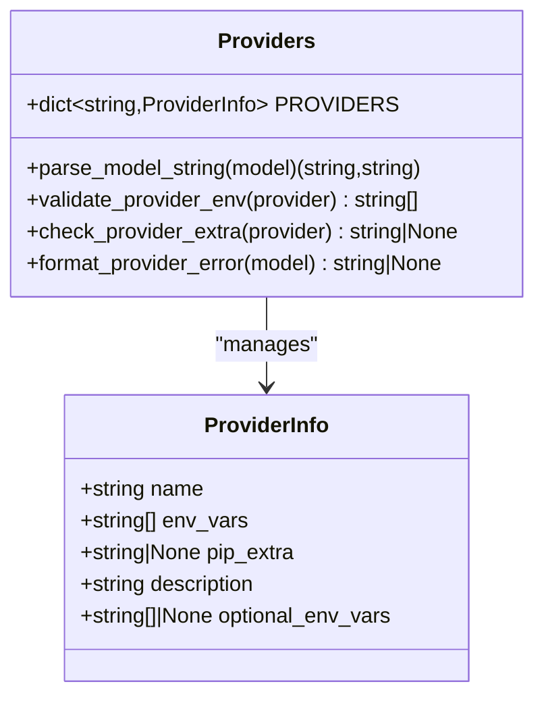
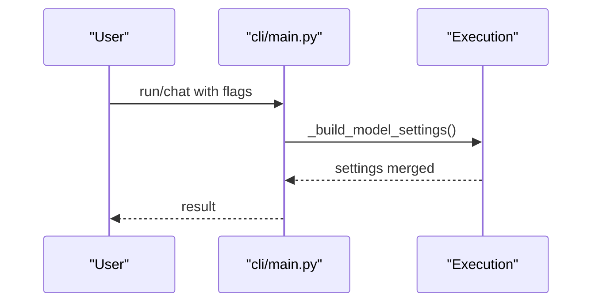
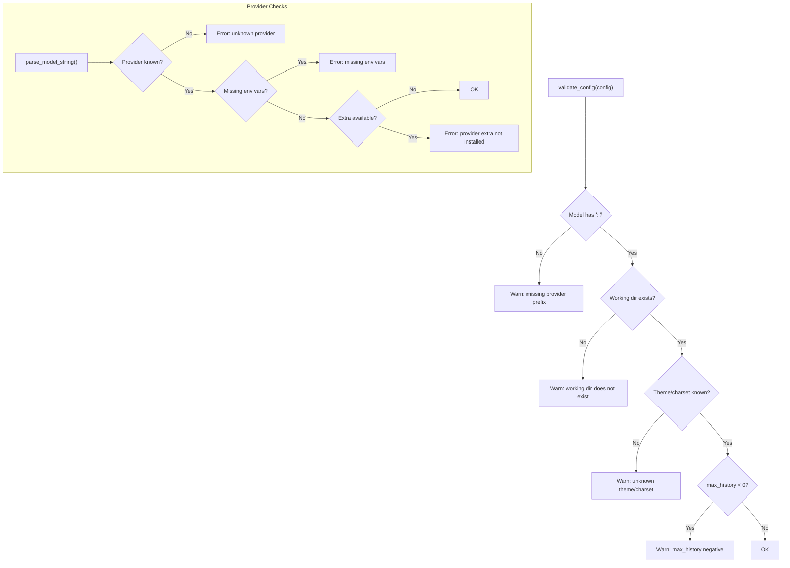
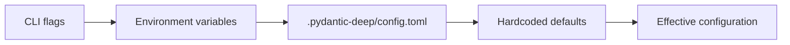
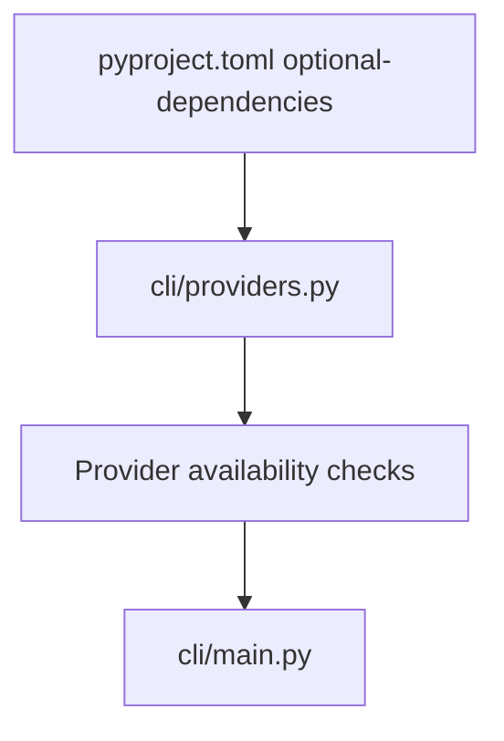

# Configuration Management

<cite>
**Referenced Files in This Document**
- [cli/config.py](file://cli/config.py)
- [cli/main.py](file://cli/main.py)
- [cli/providers.py](file://cli/providers.py)
- [cli/init.py](file://cli/init.py)
- [cli/non_interactive.py](file://cli/non_interactive.py)
- [cli/interactive.py](file://cli/interactive.py)
- [tests/test_cli_config.py](file://tests/test_cli_config.py)
- [pyproject.toml](file://pyproject.toml)
</cite>

## Table of Contents
1. [Introduction](#introduction)
2. [Project Structure](#project-structure)
3. [Core Components](#core-components)
4. [Architecture Overview](#architecture-overview)
5. [Detailed Component Analysis](#detailed-component-analysis)
6. [Dependency Analysis](#dependency-analysis)
7. [Performance Considerations](#performance-considerations)
8. [Troubleshooting Guide](#troubleshooting-guide)
9. [Conclusion](#conclusion)
10. [Appendices](#appendices)

## Introduction
This document explains configuration management for the CLI interface, focusing on how configuration is loaded, validated, and applied at runtime. It covers the configuration file format, environment variable overrides, runtime options, provider configuration, model selection, and authentication setup. It also documents precedence rules, validation and error handling, and best practices for secure configuration management.

## Project Structure
The CLI configuration system centers around a small set of modules:
- Configuration loader and validator
- Provider registry and model parsing
- CLI entrypoint and commands
- Initialization scaffolding for default configuration
- Tests validating behavior

**Diagram sources**
- [cli/main.py:1-705](file://cli/main.py#L1-L705)
- [cli/config.py:1-254](file://cli/config.py#L1-L254)
- [cli/providers.py:1-245](file://cli/providers.py#L1-L245)
- [cli/init.py:1-143](file://cli/init.py#L1-L143)
- [cli/non_interactive.py:1-310](file://cli/non_interactive.py#L1-L310)
- [cli/interactive.py:1-2489](file://cli/interactive.py#L1-L2489)
- [tests/test_cli_config.py:1-328](file://tests/test_cli_config.py#L1-L328)
- [pyproject.toml:1-211](file://pyproject.toml#L1-L211)

**Section sources**
- [cli/main.py:1-705](file://cli/main.py#L1-L705)
- [cli/config.py:1-254](file://cli/config.py#L1-L254)
- [cli/providers.py:1-245](file://cli/providers.py#L1-L245)
- [cli/init.py:1-143](file://cli/init.py#L1-L143)
- [pyproject.toml:1-211](file://pyproject.toml#L1-L211)

## Core Components
- Configuration dataclass and loader: Defines the schema, loads from a TOML file, applies environment variable overrides, validates values, and writes updates back to disk.
- Provider registry: Enumerates supported providers, required environment variables, and optional extras for installation.
- CLI commands: Expose configuration inspection and manipulation, provider readiness checks, and runtime model settings.
- Initialization scaffolding: Creates default configuration and directory structure.

Key responsibilities:
- Load and merge configuration from file and environment.
- Validate configuration and produce actionable warnings.
- Provide helpers to set configuration values and coerce types from strings.
- Offer provider diagnostics and model parsing.

**Section sources**
- [cli/config.py:70-110](file://cli/config.py#L70-L110)
- [cli/config.py:132-154](file://cli/config.py#L132-L154)
- [cli/config.py:176-228](file://cli/config.py#L176-L228)
- [cli/providers.py:25-152](file://cli/providers.py#L25-L152)
- [cli/main.py:294-336](file://cli/main.py#L294-L336)
- [cli/init.py:41-91](file://cli/init.py#L41-L91)

## Architecture Overview
The configuration pipeline follows a strict precedence order and integrates with provider validation and CLI commands.

**Diagram sources**
- [cli/main.py:86-94](file://cli/main.py#L86-L94)
- [cli/main.py:197-213](file://cli/main.py#L197-L213)
- [cli/main.py:280-291](file://cli/main.py#L280-L291)
- [cli/config.py:96-110](file://cli/config.py#L96-L110)
- [cli/providers.py:155-170](file://cli/providers.py#L155-L170)
- [cli/providers.py:178-186](file://cli/providers.py#L178-L186)

## Detailed Component Analysis

### Configuration Data Model and Loader
- Data model: A dataclass defines all configurable fields, defaults, and typed collections.
- Loading: Reads a TOML file from the project directory; if absent, uses defaults.
- Overrides: Applies environment variables after file loading.
- Validation: Produces warnings for invalid or suspicious values.
- Persistence: Writes TOML updates preserving existing keys and coercing types.

**Diagram sources**
- [cli/config.py:70-94](file://cli/config.py#L70-L94)
- [cli/config.py:96-110](file://cli/config.py#L96-L110)
- [cli/config.py:132-154](file://cli/config.py#L132-L154)
- [cli/config.py:157-161](file://cli/config.py#L157-L161)
- [cli/config.py:176-228](file://cli/config.py#L176-L228)

**Section sources**
- [cli/config.py:70-110](file://cli/config.py#L70-L110)
- [cli/config.py:132-154](file://cli/config.py#L132-L154)
- [cli/config.py:157-228](file://cli/config.py#L157-L228)
- [tests/test_cli_config.py:22-76](file://tests/test_cli_config.py#L22-L76)
- [tests/test_cli_config.py:104-154](file://tests/test_cli_config.py#L104-L154)
- [tests/test_cli_config.py:156-200](file://tests/test_cli_config.py#L156-L200)

### Environment Variable Handling and Precedence
- Environment variables override file values during load.
- Supported variables:
  - PYDANTIC_DEEP_MODEL
  - PYDANTIC_DEEP_WORKING_DIR
  - PYDANTIC_DEEP_THEME
  - PYDANTIC_DEEP_CHARSET
- Precedence order:
  - CLI arguments (highest)
  - Environment variables
  - Config file
  - Hardcoded defaults (lowest)

**Diagram sources**
- [cli/config.py:96-110](file://cli/config.py#L96-L110)
- [cli/config.py:113-129](file://cli/config.py#L113-L129)
- [cli/main.py:193-213](file://cli/main.py#L193-L213)

**Section sources**
- [cli/config.py:96-129](file://cli/config.py#L96-L129)
- [cli/main.py:193-213](file://cli/main.py#L193-L213)
- [tests/test_cli_config.py:289-328](file://tests/test_cli_config.py#L289-L328)

### Provider Configuration and Authentication Setup
- Provider registry enumerates supported providers, required environment variables, and optional extras.
- Model strings are parsed into provider and model name; defaults fall back to a known provider if no prefix is given.
- Provider checks surface missing environment variables and suggest installation commands.

**Diagram sources**
- [cli/providers.py:14-23](file://cli/providers.py#L14-L23)
- [cli/providers.py:25-152](file://cli/providers.py#L25-L152)
- [cli/providers.py:155-170](file://cli/providers.py#L155-L170)
- [cli/providers.py:178-186](file://cli/providers.py#L178-L186)
- [cli/providers.py:189-203](file://cli/providers.py#L189-L203)
- [cli/providers.py:205-233](file://cli/providers.py#L205-L233)

**Section sources**
- [cli/providers.py:25-152](file://cli/providers.py#L25-L152)
- [cli/providers.py:155-170](file://cli/providers.py#L155-L170)
- [cli/providers.py:205-233](file://cli/providers.py#L205-L233)

### Runtime Configuration Options and Model Settings
- CLI commands accept runtime flags that override configuration for a single run:
  - Model selection
  - Working directory
  - Shell allow list
  - Streaming/no-stream
  - Sandbox/runtime
  - Output format
  - Verbose/quiet
  - Temperature, reasoning effort, thinking, thinking budget
  - Model settings JSON
- These runtime flags take highest precedence over configuration.

**Diagram sources**
- [cli/main.py:136-213](file://cli/main.py#L136-L213)
- [cli/main.py:216-291](file://cli/main.py#L216-L291)
- [cli/main.py:96-118](file://cli/main.py#L96-L118)

**Section sources**
- [cli/main.py:136-213](file://cli/main.py#L136-L213)
- [cli/main.py:216-291](file://cli/main.py#L216-L291)
- [cli/main.py:96-118](file://cli/main.py#L96-L118)

### Configuration Validation and Error Handling
- Validation produces warnings for:
  - Missing provider prefix in model
  - Nonexistent working directory
  - Unknown theme or charset
  - Negative max history
- Provider checks surface missing environment variables and suggest fixes.
- Non-interactive mode prints helpful hints for API key errors.

**Diagram sources**
- [cli/config.py:132-154](file://cli/config.py#L132-L154)
- [cli/providers.py:155-170](file://cli/providers.py#L155-L170)
- [cli/providers.py:205-233](file://cli/providers.py#L205-L233)
- [cli/non_interactive.py:39-54](file://cli/non_interactive.py#L39-L54)

**Section sources**
- [cli/config.py:132-154](file://cli/config.py#L132-L154)
- [cli/providers.py:205-233](file://cli/providers.py#L205-L233)
- [cli/non_interactive.py:39-54](file://cli/non_interactive.py#L39-L54)

### Configuration Inheritance, Precedence, and Override Mechanisms
- Precedence (highest to lowest):
  - CLI arguments
  - Environment variables
  - Config file (.pydantic-deep/config.toml)
  - Hardcoded defaults
- Environment variables apply after file loading; CLI flags apply last.

**Diagram sources**
- [cli/config.py:96-110](file://cli/config.py#L96-L110)
- [cli/config.py:113-129](file://cli/config.py#L113-L129)
- [cli/main.py:193-213](file://cli/main.py#L193-L213)

**Section sources**
- [cli/config.py:96-129](file://cli/config.py#L96-L129)
- [cli/main.py:193-213](file://cli/main.py#L193-L213)

### Security Considerations and Best Practices
- Store secrets in environment variables, not in the config file.
- Prefer provider extras installation via optional dependencies declared in the project configuration.
- Avoid committing sensitive keys; use separate environments or secret managers.
- Validate provider readiness before running tasks to prevent accidental exposure of missing credentials.

**Section sources**
- [pyproject.toml:36-68](file://pyproject.toml#L36-L68)
- [cli/providers.py:189-203](file://cli/providers.py#L189-L203)

## Dependency Analysis
- Optional dependencies enable provider backends; installation is suggested when a provider’s extra is missing.
- Provider checks rely on environment variables; missing variables cause explicit errors with guidance.

**Diagram sources**
- [pyproject.toml:36-68](file://pyproject.toml#L36-L68)
- [cli/providers.py:189-203](file://cli/providers.py#L189-L203)

**Section sources**
- [pyproject.toml:36-68](file://pyproject.toml#L36-L68)
- [cli/providers.py:189-203](file://cli/providers.py#L189-L203)

## Performance Considerations
- Configuration loading is lightweight and occurs once per process invocation.
- Provider checks are O(1) lookups; environment checks are minimal.
- Avoid excessive writes to the config file; batch updates when possible.

## Troubleshooting Guide
Common issues and resolutions:
- Unknown provider or model string:
  - Use the provider list and check commands to see supported providers and required environment variables.
- Missing environment variables:
  - Export the required keys and retry. The provider checker suggests the first missing variable.
- Provider extra not installed:
  - Install the recommended optional dependency group for the provider.
- API key errors:
  - Non-interactive mode prints helpful hints suggesting correct environment variables for common providers.
- Invalid configuration values:
  - Fix warnings reported by validation (e.g., correct theme/charset, ensure working directory exists, avoid negative max history).

**Section sources**
- [cli/providers.py:504-555](file://cli/providers.py#L504-L555)
- [cli/providers.py:205-233](file://cli/providers.py#L205-L233)
- [cli/non_interactive.py:39-54](file://cli/non_interactive.py#L39-L54)
- [cli/config.py:132-154](file://cli/config.py#L132-L154)

## Conclusion
The CLI configuration system provides a robust, layered approach to managing runtime behavior. By combining a simple TOML file, environment variable overrides, and explicit provider checks, it enables flexible, secure, and predictable operation across diverse environments. Following the precedence rules and best practices ensures reliable configuration across development, CI, and production contexts.

## Appendices

### Configuration File Structure and Fields
- Location: .pydantic-deep/config.toml in the working directory.
- Fields include model, working_dir, shell_allow_list, theme, charset, show_cost, show_tokens, history_file, max_history, include_* toggles, temperature, reasoning_effort, thinking, thinking_budget, and logfire.
- Unknown keys are ignored during parsing.

**Section sources**
- [cli/config.py:70-94](file://cli/config.py#L70-L94)
- [cli/config.py:157-161](file://cli/config.py#L157-L161)
- [cli/init.py:34-38](file://cli/init.py#L34-L38)

### Environment Variables
- PYDANTIC_DEEP_MODEL: overrides model
- PYDANTIC_DEEP_WORKING_DIR: overrides working directory
- PYDANTIC_DEEP_THEME: overrides theme
- PYDANTIC_DEEP_CHARSET: overrides charset

**Section sources**
- [cli/config.py:113-129](file://cli/config.py#L113-L129)

### Provider Registry and Extras
- Providers define required environment variables and optional extras for installation.
- Use the providers list/check commands to diagnose configuration issues.

**Section sources**
- [cli/providers.py:25-152](file://cli/providers.py#L25-L152)
- [cli/providers.py:504-555](file://cli/providers.py#L504-L555)

### Example Scenarios
- Single-provider setup:
  - Set PYDANTIC_DEEP_MODEL to a provider:model string.
  - Ensure the provider’s environment variable is exported.
- Multi-provider usage:
  - Use CLI flags to select a provider/model per-run.
  - Keep a default provider in the config file for convenience.
- Environment-specific overrides:
  - Use environment variables to switch providers or directories per environment.
- Secure configuration:
  - Store API keys in environment variables and avoid committing secrets to the repository.

**Section sources**
- [cli/main.py:136-213](file://cli/main.py#L136-L213)
- [cli/providers.py:205-233](file://cli/providers.py#L205-L233)