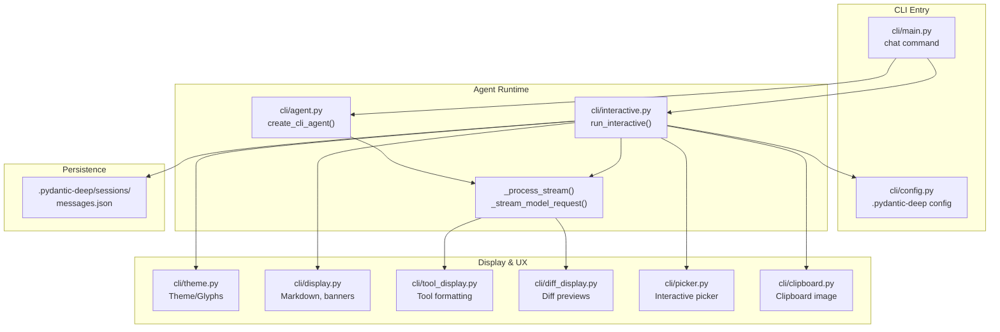
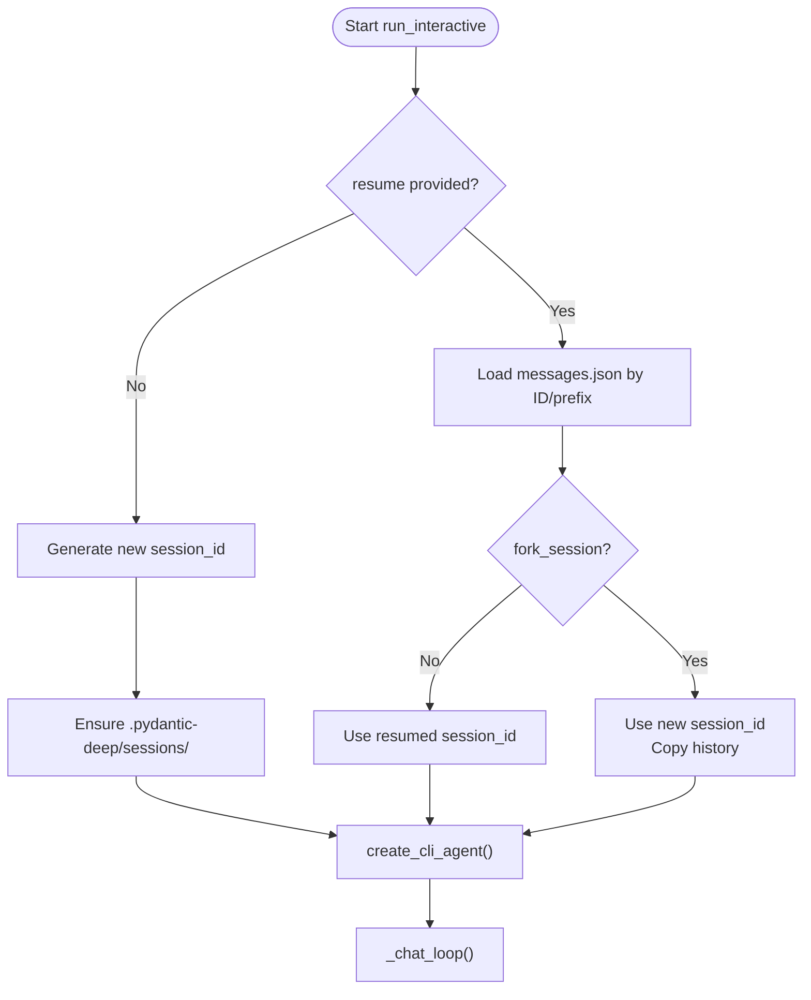
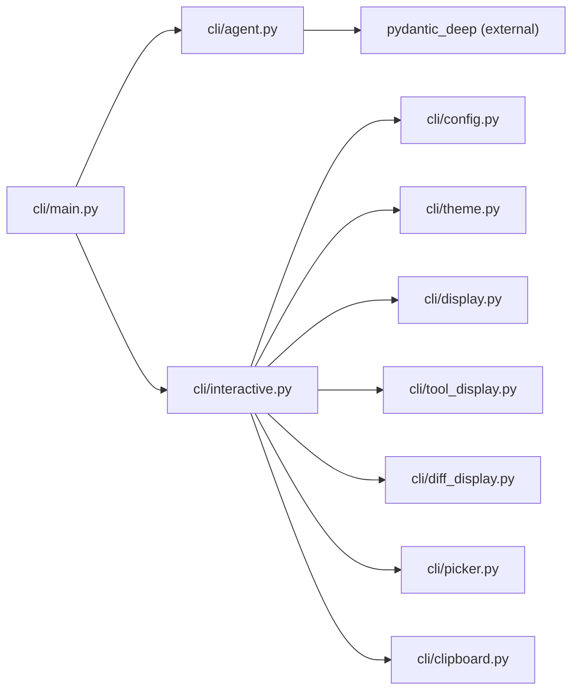

# Interactive Chat Mode

<cite>
**Referenced Files in This Document**
- [interactive.py](file://cli/interactive.py)
- [main.py](file://cli/main.py)
- [agent.py](file://cli/agent.py)
- [config.py](file://cli/config.py)
- [theme.py](file://cli/theme.py)
- [display.py](file://cli/display.py)
- [tool_display.py](file://cli/tool_display.py)
- [diff_display.py](file://cli/diff_display.py)
- [picker.py](file://cli/picker.py)
- [clipboard.py](file://cli/clipboard.py)
- [interactive_chat.py](file://examples/interactive_chat.py)
</cite>

## Table of Contents
1. [Introduction](#introduction)
2. [Project Structure](#project-structure)
3. [Core Components](#core-components)
4. [Architecture Overview](#architecture-overview)
5. [Detailed Component Analysis](#detailed-component-analysis)
6. [Dependency Analysis](#dependency-analysis)
7. [Performance Considerations](#performance-considerations)
8. [Troubleshooting Guide](#troubleshooting-guide)
9. [Conclusion](#conclusion)

## Introduction
This document explains the interactive chat mode functionality, covering how to start and manage sessions, persistence and resumption, conversation threading, chat-specific options (auto-approval, sandbox integration, model configuration), user interface elements and display formatting, theme customization, real-time interaction patterns, practical workflows, and security considerations including human-in-the-loop approvals.

## Project Structure
The interactive chat mode spans several CLI modules:
- Command entrypoint and options parsing
- Agent creation with middleware, permissions, and model settings
- Real-time streaming and event-driven display
- Session persistence and resumption
- Theme and glyph systems for UI
- Tool call formatting and diff previews
- File and image clipboard integration



**Diagram sources**
- [main.py:216-291](file://cli/main.py#L216-L291)
- [agent.py:51-295](file://cli/agent.py#L51-L295)
- [interactive.py:2144-2274](file://cli/interactive.py#L2144-L2274)
- [theme.py:14-212](file://cli/theme.py#L14-L212)
- [display.py:69-154](file://cli/display.py#L69-L154)
- [tool_display.py:313-397](file://cli/tool_display.py#L313-L397)
- [diff_display.py:21-82](file://cli/diff_display.py#L21-L82)
- [picker.py:110-264](file://cli/picker.py#L110-L264)
- [clipboard.py:31-106](file://cli/clipboard.py#L31-L106)

**Section sources**
- [main.py:216-291](file://cli/main.py#L216-L291)
- [agent.py:51-295](file://cli/agent.py#L51-L295)
- [interactive.py:2144-2274](file://cli/interactive.py#L2144-L2274)

## Core Components
- Chat command and options: The CLI chat command wires model selection, sandboxing, auto-approval, model settings, and session resumption/forking.
- Agent factory: Builds a CLI-configured agent with tools, memory, planning, subagents, and context management; supports permission handlers and hooks.
- Interactive loop: Manages user input, slash commands, streaming events, and real-time display with Rich and TTY detection.
- Persistence: Stores conversation histories in per-session JSON files and supports loading/resuming sessions.
- Display system: Provides theme-aware rendering, Markdown, tool call formatting, and diff previews.
- Security: Optional human-in-the-loop approval for sensitive tool calls with auto-approval mode.

**Section sources**
- [main.py:216-291](file://cli/main.py#L216-L291)
- [agent.py:51-295](file://cli/agent.py#L51-L295)
- [interactive.py:2144-2274](file://cli/interactive.py#L2144-L2274)
- [config.py:35-43](file://cli/config.py#L35-L43)
- [theme.py:14-212](file://cli/theme.py#L14-L212)
- [tool_display.py:313-397](file://cli/tool_display.py#L313-L397)
- [diff_display.py:21-82](file://cli/diff_display.py#L21-L82)

## Architecture Overview
The interactive chat pipeline integrates CLI options, agent creation, streaming, and display:

```mermaid
sequenceDiagram
participant User as "User"
participant CLI as "pydantic-deep chat"
participant Agent as "create_cli_agent()"
participant Loop as "run_interactive()"
participant Stream as "_process_stream()"
participant Display as "Rich/Terminal"
User->>CLI : "pydantic-deep chat [options]"
CLI->>Agent : create_cli_agent(model, sandbox, settings, session_id)
Agent-->>CLI : (agent, deps)
CLI->>Loop : run_interactive(...)
Loop->>Display : print_welcome_banner()
Loop->>User : Prompt with status bar
User->>Loop : Input or /command
alt Slash command
Loop->>Loop : _handle_command()
else User message
Loop->>Stream : _process_stream(prompt, deps, history)
Stream->>Agent : iter()/stream events
Agent-->>Stream : ModelRequest/ToolCall/FinalResult
Stream->>Display : Markdown, tool calls/results, diffs
end
Loop->>Loop : Update cost/context/status
Loop-->>User : Next prompt
```

**Diagram sources**
- [main.py:216-291](file://cli/main.py#L216-L291)
- [agent.py:51-295](file://cli/agent.py#L51-L295)
- [interactive.py:2043-2142](file://cli/interactive.py#L2043-L2142)
- [display.py:69-154](file://cli/display.py#L69-L154)

## Detailed Component Analysis

### Starting and Managing Interactive Sessions
- Entry point: The chat command parses model, working directory, sandbox/runtime, auto-approval, model settings, and session options (resume/fork).
- Session lifecycle:
  - New session: Generates a new session ID and initializes per-session directories.
  - Resume: Loads prior conversation history from messages.json and optionally forks to a new session while preserving history.
  - Persistence: Messages are stored under .pydantic-deep/sessions/<id>/messages.json.
- Status bar: Shows auto-approve state, TODO counts, cost, context usage, message count, and model.

Practical example paths:
- [Chat command definition:216-291](file://cli/main.py#L216-L291)
- [Session loading and resuming:2432-2485](file://cli/interactive.py#L2432-L2485)
- [Welcome banner and status bar:69-154](file://cli/display.py#L69-L154), (file://cli/interactive.py#L1964-L2041)

**Section sources**
- [main.py:216-291](file://cli/main.py#L216-L291)
- [interactive.py:2144-2274](file://cli/interactive.py#L2144-L2274)
- [interactive.py:2432-2485](file://cli/interactive.py#L2432-L2485)
- [display.py:69-154](file://cli/display.py#L69-L154)

### Session Persistence and Resumption
- Storage: Each session has a dedicated directory with messages.json containing the conversation history.
- Listing sessions: The threads list command enumerates sessions and counts messages.
- Loading: The interactive loader either picks a session or loads by ID prefix; empty resume triggers an interactive picker.
- Forking: When resuming with fork enabled, a new session ID is created but the history is copied from the resumed session.



**Diagram sources**
- [interactive.py:2144-2274](file://cli/interactive.py#L2144-L2274)
- [interactive.py:2432-2485](file://cli/interactive.py#L2432-L2485)
- [main.py:557-606](file://cli/main.py#L557-L606)

**Section sources**
- [interactive.py:2144-2274](file://cli/interactive.py#L2144-L2274)
- [interactive.py:2432-2485](file://cli/interactive.py#L2432-L2485)
- [main.py:557-606](file://cli/main.py#L557-L606)

### Conversation Threading and Streaming
- Streaming model responses: Uses agent.iter() and node.stream() to receive events (tool calls, deltas, final result). In TTY mode, transitions from spinner to Markdown rendering; in non-TTY, writes raw text.
- Tool call visibility: Streams tool calls and results with rich formatting, inline diffs for file edits, and elapsed time for long-running tools.
- Multimodal input: Supports pasted images via clipboard (macOS) embedded as binary content alongside text.

```mermaid
sequenceDiagram
participant Loop as "_chat_loop()"
participant Proc as "_process_stream()"
participant Node as "Agent nodes"
participant Live as "Live/Markdown"
participant Tools as "Tool calls"
Loop->>Proc : user_input, deps, history
Proc->>Node : agent.iter()/node.stream()
Node-->>Proc : PartStartEvent (tool?)
Proc->>Live : Stop spinner/start Markdown
Node-->>Proc : PartDeltaEvent (text)
Proc->>Live : Update Markdown
Node-->>Proc : FinalResultEvent
Proc->>Live : Stop Markdown
Proc-->>Loop : Updated history
Loop->>Tools : Stream tool calls/results
```

**Diagram sources**
- [interactive.py:555-625](file://cli/interactive.py#L555-L625)
- [interactive.py:433-493](file://cli/interactive.py#L433-L493)
- [interactive.py:509-553](file://cli/interactive.py#L509-L553)

**Section sources**
- [interactive.py:555-625](file://cli/interactive.py#L555-L625)
- [interactive.py:433-493](file://cli/interactive.py#L433-L493)
- [interactive.py:509-553](file://cli/interactive.py#L509-L553)

### Chat-Specific Options
- Model configuration: Flags for model, temperature, reasoning effort, thinking (Anthropic), thinking budget, and model-settings JSON override.
- Sandbox integration: Toggle Docker sandbox, runtime selection, with safe cleanup.
- Auto-approval: Skips human-in-the-loop approvals for tool calls.
- Working directory: Sets agent’s filesystem root for absolute paths.

Practical example paths:
- [Chat command options:216-291](file://cli/main.py#L216-L291)
- [Agent model settings merging:197-222](file://cli/agent.py#L197-L222)
- [Sandbox backend creation:1368-1387](file://cli/interactive.py#L1368-L1387)

**Section sources**
- [main.py:216-291](file://cli/main.py#L216-L291)
- [agent.py:197-222](file://cli/agent.py#L197-L222)
- [interactive.py:1368-1387](file://cli/interactive.py#L1368-L1387)

### User Interface Elements and Display Formatting
- Themes and glyphs: Configurable color palettes and Unicode/ASCII glyphs with automatic detection.
- Welcome banner: Shows version, model, working directory, git branch, detected project info, and runtime/test hints.
- Tool call formatting: One-line summaries with path abbreviations and previews; result previews with line limits.
- Diff rendering: Colored unified diffs with gutter bars and stats; inline previews after tool execution.
- Status bar: Shows auto-approve mode, TODOs, cost, context usage, message count, and model.

Practical example paths:
- [Theme and glyphs:14-212](file://cli/theme.py#L14-L212)
- [Welcome banner:69-154](file://cli/display.py#L69-L154)
- [Tool formatting:313-397](file://cli/tool_display.py#L313-L397)
- [Diff rendering:21-82](file://cli/diff_display.py#L21-L82)
- [Status bar formatting:1964-2041](file://cli/interactive.py#L1964-L2041)

**Section sources**
- [theme.py:14-212](file://cli/theme.py#L14-L212)
- [display.py:69-154](file://cli/display.py#L69-L154)
- [tool_display.py:313-397](file://cli/tool_display.py#L313-L397)
- [diff_display.py:21-82](file://cli/diff_display.py#L21-L82)
- [interactive.py:1964-2041](file://cli/interactive.py#L1964-L2041)

### Real-Time Interaction Patterns
- Instant triggers: Typing "/" opens a command picker; "@" opens a file picker; Ctrl+V pastes images (macOS).
- Multiline input: Triple-quote mode or pasted multi-line text; collapsed display for long pastes.
- Keyboard shortcuts: Ctrl+C interrupts, Ctrl+D exits, Ctrl+L clears screen, Ctrl+V image paste.
- Interactive selection: Arrow-key picker with fuzzy filtering for commands, files, and models.

Practical example paths:
- [Instant triggers and raw line editing:1471-1676](file://cli/interactive.py#L1471-L1676)
- [File picker:865-938](file://cli/interactive.py#L865-L938)
- [Command picker:826-863](file://cli/interactive.py#L826-L863)
- [Picker implementation:110-264](file://cli/picker.py#L110-L264)

**Section sources**
- [interactive.py:1471-1676](file://cli/interactive.py#L1471-L1676)
- [interactive.py:826-938](file://cli/interactive.py#L826-L938)
- [picker.py:110-264](file://cli/picker.py#L110-L264)

### Practical Workflows
- Start a new chat session with a model and working directory.
- Use slash commands for context, cost, tokens, model switching, saving/loading sessions, and skills listing.
- Approve tool calls when prompted; enable auto-approval to skip approvals.
- Resume a previous session or fork from it to preserve history while continuing in a new session.
- Paste images or files inline; use @mentions to include file contents.

Practical example paths:
- [Slash commands and handlers:1248-1336](file://cli/interactive.py#L1248-L1336)
- [Session list/export commands:557-696](file://cli/main.py#L557-L696)
- [Clipboard image paste:31-106](file://cli/clipboard.py#L31-L106)

**Section sources**
- [interactive.py:1248-1336](file://cli/interactive.py#L1248-L1336)
- [main.py:557-696](file://cli/main.py#L557-L696)
- [clipboard.py:31-106](file://cli/clipboard.py#L31-L106)

### Human-in-the-Loop and Security
- Permission handler: Prompts for approval on sensitive tools; shows contextual diffs for file edits and write previews.
- Safe tools: Certain tools are considered safe and auto-approved.
- Auto-approve mode: Disables approvals globally.
- Shell allow-list: Hooks can restrict shell commands to an allow-list.

Practical example paths:
- [Permission handler:238-278](file://cli/interactive.py#L238-L278)
- [Safe tools set:224-235](file://cli/interactive.py#L224-L235)
- [Shell allow-list hook:16-48](file://cli/agent.py#L16-L48)

**Section sources**
- [interactive.py:238-278](file://cli/interactive.py#L238-L278)
- [interactive.py:224-235](file://cli/interactive.py#L224-L235)
- [agent.py:16-48](file://cli/agent.py#L16-L48)

## Dependency Analysis
The interactive chat mode composes multiple subsystems with clear boundaries:



**Diagram sources**
- [main.py:216-291](file://cli/main.py#L216-L291)
- [agent.py:51-295](file://cli/agent.py#L51-L295)
- [interactive.py:2144-2274](file://cli/interactive.py#L2144-L2274)
- [config.py:35-43](file://cli/config.py#L35-L43)
- [theme.py:14-212](file://cli/theme.py#L14-L212)
- [display.py:69-154](file://cli/display.py#L69-L154)
- [tool_display.py:313-397](file://cli/tool_display.py#L313-L397)
- [diff_display.py:21-82](file://cli/diff_display.py#L21-L82)
- [picker.py:110-264](file://cli/picker.py#L110-L264)
- [clipboard.py:31-106](file://cli/clipboard.py#L31-L106)

**Section sources**
- [main.py:216-291](file://cli/main.py#L216-L291)
- [agent.py:51-295](file://cli/agent.py#L51-L295)
- [interactive.py:2144-2274](file://cli/interactive.py#L2144-L2274)

## Performance Considerations
- Streaming rendering: Uses Live contexts and incremental Markdown updates to minimize perceived latency.
- Context management: Tracks token usage and compacts history when approaching thresholds.
- TTY detection: Switches between Rich rendering and raw text output depending on environment.
- Sandbox overhead: Docker sandbox adds startup/cleanup costs; use only when needed.

[No sources needed since this section provides general guidance]

## Troubleshooting Guide
Common issues and resolutions:
- Model initialization failures: The system prints helpful hints for missing API keys and lists supported providers.
- Session loading: If a session has no history or fails to load, the system reports a message and continues.
- Clipboard image paste: Only supported on macOS with pngpaste or osascript; otherwise ignored.
- Interrupt handling: Press Ctrl+C twice quickly to exit cleanly; Ctrl+D at empty prompt also exits.

Practical example paths:
- [Model error printing:294-304](file://cli/interactive.py#L294-L304)
- [Session load failure handling:2461-2484](file://cli/interactive.py#L2461-L2484)
- [Clipboard image retrieval:31-106](file://cli/clipboard.py#L31-L106)

**Section sources**
- [interactive.py:294-304](file://cli/interactive.py#L294-L304)
- [interactive.py:2461-2484](file://cli/interactive.py#L2461-L2484)
- [clipboard.py:31-106](file://cli/clipboard.py#L31-L106)

## Conclusion
The interactive chat mode provides a robust, secure, and user-friendly conversational interface with rich streaming, session persistence, and human-in-the-loop controls. It supports flexible model configuration, sandboxing, and a polished display system with themes and diffs. Users can manage sessions, integrate external tools safely, and tailor the experience through configuration and keyboard-driven interactions.