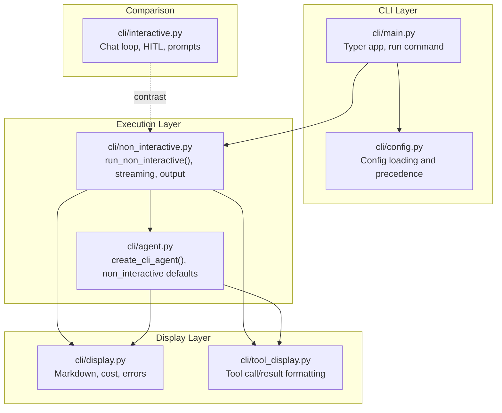
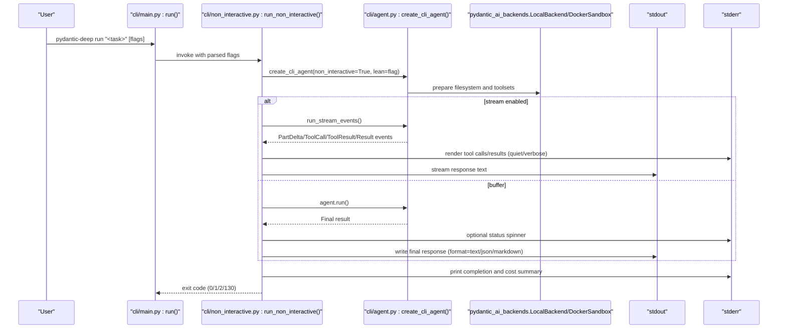
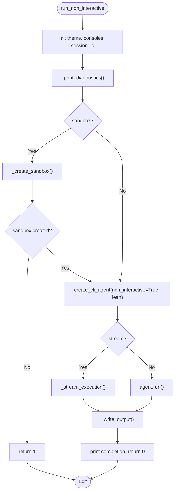
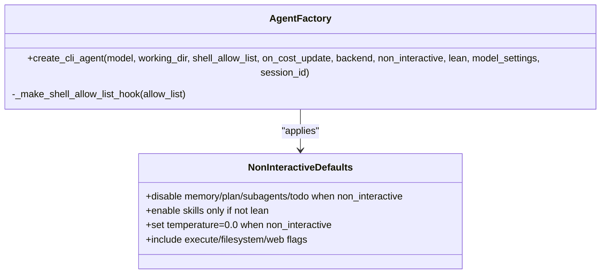
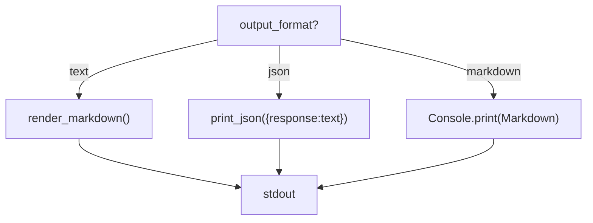
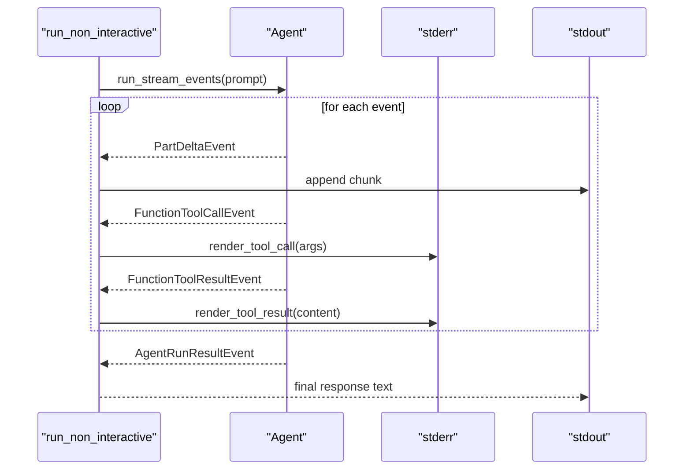
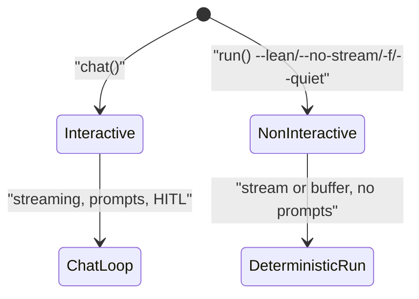
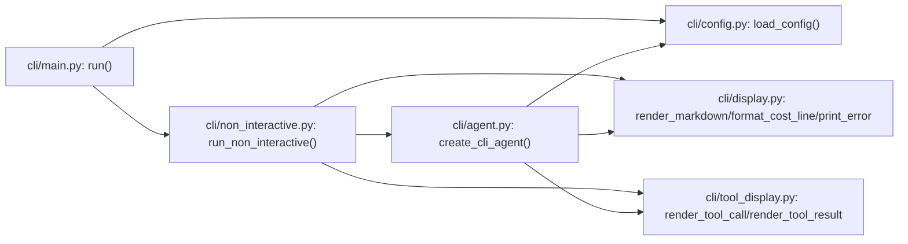

# Non-Interactive Mode

<cite>
**Referenced Files in This Document**
- [non_interactive.py](file://cli/non_interactive.py)
- [main.py](file://cli/main.py)
- [agent.py](file://cli/agent.py)
- [display.py](file://cli/display.py)
- [tool_display.py](file://cli/tool_display.py)
- [config.py](file://cli/config.py)
- [interactive.py](file://cli/interactive.py)
- [ci.yml](file://.github/workflows/ci.yml)
- [test_cli_non_interactive.py](file://tests/test_cli_non_interactive.py)
</cite>

## Table of Contents
1. [Introduction](#introduction)
2. [Project Structure](#project-structure)
3. [Core Components](#core-components)
4. [Architecture Overview](#architecture-overview)
5. [Detailed Component Analysis](#detailed-component-analysis)
6. [Dependency Analysis](#dependency-analysis)
7. [Performance Considerations](#performance-considerations)
8. [Troubleshooting Guide](#troubleshooting-guide)
9. [Conclusion](#conclusion)
10. [Appendices](#appendices)

## Introduction
This document explains non-interactive batch operations and benchmark mode functionality for automated, unattended execution. It covers how to run tasks without user interaction, configure batch processing parameters, and handle output formatting. It also compares interactive and non-interactive modes, including security implications and permission handling, and provides guidance for integrating with CI/CD pipelines. Examples of common batch operations, automation patterns, and performance optimization techniques are included, along with advice on output capture, logging, and result processing in automated environments.

## Project Structure
Non-interactive mode is implemented as a dedicated CLI command that delegates to a streamlined agent execution path. The key files involved are:
- Command entry and argument parsing
- Non-interactive execution engine
- Agent creation and configuration
- Display and output formatting utilities
- Interactive mode for comparison

**Diagram sources**
- [main.py:121-214](file://cli/main.py#L121-L214)
- [non_interactive.py:86-212](file://cli/non_interactive.py#L86-L212)
- [agent.py:51-295](file://cli/agent.py#L51-L295)
- [display.py:147-228](file://cli/display.py#L147-L228)
- [tool_display.py:174-448](file://cli/tool_display.py#L174-L448)
- [interactive.py:1-200](file://cli/interactive.py#L1-L200)

**Section sources**
- [main.py:121-214](file://cli/main.py#L121-L214)
- [non_interactive.py:86-212](file://cli/non_interactive.py#L86-L212)
- [agent.py:51-295](file://cli/agent.py#L51-L295)
- [display.py:147-228](file://cli/display.py#L147-L228)
- [tool_display.py:174-448](file://cli/tool_display.py#L174-L448)
- [interactive.py:1-200](file://cli/interactive.py#L1-L200)

## Core Components
- Non-interactive runner: orchestrates a single task, streams or buffers output, writes final output in requested format, and prints diagnostics to stderr.
- Agent factory: builds a CLI-configured agent with non-interactive defaults, including deterministic model settings and disabled interactive features.
- Display utilities: render markdown, format costs, and provide error/warning panels.
- Tool display: compact, readable tool call/result summaries and previews.
- Configuration: precedence of CLI flags, config file, and defaults.

Key behaviors:
- Auto-approval of tool calls (no Human-in-the-Loop).
- Deterministic model settings in non-interactive mode.
- Separate stdout/stderr channels for response and diagnostics.
- Output formatting options: text, JSON, markdown.

**Section sources**
- [non_interactive.py:86-212](file://cli/non_interactive.py#L86-L212)
- [agent.py:51-295](file://cli/agent.py#L51-L295)
- [display.py:147-228](file://cli/display.py#L147-L228)
- [tool_display.py:174-448](file://cli/tool_display.py#L174-L448)
- [config.py:96-154](file://cli/config.py#L96-L154)

## Architecture Overview
The non-interactive flow is a streamlined pipeline that bypasses interactive prompts and HITL, focusing on deterministic execution and fast output delivery.

**Diagram sources**
- [main.py:136-213](file://cli/main.py#L136-L213)
- [non_interactive.py:86-212](file://cli/non_interactive.py#L86-L212)
- [agent.py:51-295](file://cli/agent.py#L51-L295)

## Detailed Component Analysis

### Non-Interactive Runner
Responsibilities:
- Parse and apply flags for model, working directory, sandbox, output format, verbosity, and lean mode.
- Create agent with non-interactive defaults and optional sandbox backend.
- Stream or buffer response text, writing to stdout.
- Print diagnostics and cost info to stderr.
- Handle keyboard interrupts and API key errors with appropriate exit codes.

Key parameters:
- message: task prompt
- model, working_dir, shell_allow_list
- quiet, stream, sandbox, runtime, output_format, verbose, lean
- model_settings (temperature, reasoning effort, thinking)

Exit codes:
- 0: success
- 1: general error
- 2: API key error
- 130: interrupted

**Diagram sources**
- [non_interactive.py:86-212](file://cli/non_interactive.py#L86-L212)

**Section sources**
- [non_interactive.py:86-212](file://cli/non_interactive.py#L86-L212)

### Agent Factory (Non-Interactive Defaults)
Responsibilities:
- Load configuration and merge CLI overrides.
- Build hooks (e.g., shell allow-list) and middleware.
- Construct system instructions tailored for non-interactive/benchmarking.
- Configure toolsets and capabilities:
  - Skills: enabled unless lean
  - Plan, memory, subagents, todo: disabled for non-interactive
  - Execute and filesystem: enabled
  - Web tools: disabled by default
- Set deterministic model settings when non-interactive:
  - temperature = 0.0
  - reasoning effort and thinking per config or flags
- Cost tracking and context management enabled.

**Diagram sources**
- [agent.py:51-295](file://cli/agent.py#L51-L295)

**Section sources**
- [agent.py:51-295](file://cli/agent.py#L51-L295)

### Output Formatting and Display
- Output writer supports three formats:
  - text: renders markdown if stdout is a terminal, otherwise raw text
  - json: prints a JSON object containing the response
  - markdown: renders markdown with pretty code blocks
- Diagnostics and tool call/results are printed to stderr with rich markup and glyphs.
- Cost lines are formatted with tokens and cumulative totals.

**Diagram sources**
- [non_interactive.py:214-224](file://cli/non_interactive.py#L214-L224)
- [display.py:147-154](file://cli/display.py#L147-L154)

**Section sources**
- [non_interactive.py:214-224](file://cli/non_interactive.py#L214-L224)
- [display.py:147-188](file://cli/display.py#L147-L188)

### Streaming Execution
- Streams PartDeltaEvent chunks to stdout as they arrive.
- Emits tool call and result events to stderr with optional verbose details.
- Returns the final response text upon AgentRunResultEvent.

**Diagram sources**
- [non_interactive.py:250-306](file://cli/non_interactive.py#L250-L306)
- [tool_display.py:313-397](file://cli/tool_display.py#L313-L397)

**Section sources**
- [non_interactive.py:250-306](file://cli/non_interactive.py#L250-L306)
- [tool_display.py:313-397](file://cli/tool_display.py#L313-L397)

### Interactive vs Non-Interactive Modes
- Interactive mode enables Human-in-the-Loop, prompts, and a live chat loop with streaming responses and tool visibility.
- Non-interactive mode auto-approves tool calls, disables memory/plan/subagents/todo, and sets deterministic model settings for reproducible, fast runs.

**Diagram sources**
- [interactive.py:1-200](file://cli/interactive.py#L1-L200)
- [main.py:136-213](file://cli/main.py#L136-L213)
- [agent.py:186-196](file://cli/agent.py#L186-L196)

**Section sources**
- [interactive.py:1-200](file://cli/interactive.py#L1-L200)
- [main.py:136-213](file://cli/main.py#L136-L213)
- [agent.py:186-196](file://cli/agent.py#L186-L196)

## Dependency Analysis
- The run command depends on the non-interactive runner and configuration loading.
- The runner depends on the agent factory, display utilities, and tool display.
- The agent factory depends on configuration, providers, and backend selection (local or sandbox).

**Diagram sources**
- [main.py:136-213](file://cli/main.py#L136-L213)
- [non_interactive.py:86-212](file://cli/non_interactive.py#L86-L212)
- [agent.py:51-295](file://cli/agent.py#L51-L295)
- [display.py:147-228](file://cli/display.py#L147-L228)
- [tool_display.py:174-448](file://cli/tool_display.py#L174-L448)

**Section sources**
- [main.py:136-213](file://cli/main.py#L136-L213)
- [non_interactive.py:86-212](file://cli/non_interactive.py#L86-L212)
- [agent.py:51-295](file://cli/agent.py#L51-L295)
- [display.py:147-228](file://cli/display.py#L147-L228)
- [tool_display.py:174-448](file://cli/tool_display.py#L174-L448)

## Performance Considerations
- Deterministic model settings: temperature set to 0.0 in non-interactive mode improves reproducibility and reduces variability.
- Lean mode: disables skills, plan, subagents, todo, and context discovery to minimize overhead for benchmarks.
- Streaming vs buffering: streaming reduces perceived latency and allows early output; buffering can simplify output capture.
- Quiet mode: suppresses diagnostics to reduce noise and improve throughput.
- Sandbox: adds isolation and safety but introduces overhead; ensure runtime selection is appropriate for the workload.

[No sources needed since this section provides general guidance]

## Troubleshooting Guide
Common issues and resolutions:
- API key errors: The runner detects API key-related exceptions and prints provider-specific hints with environment variable suggestions. Exit code 2 indicates an API key problem.
- Interrupt handling: Keyboard interrupts return exit code 130.
- Sandbox setup: If Docker support is not installed, the runner prints a friendly message and exits with code 1.
- Verbose diagnostics: Use verbose flags to inspect tool arguments and results for debugging.
- Provider readiness: Use the providers list/check commands to validate model configuration.

**Section sources**
- [non_interactive.py:39-54](file://cli/non_interactive.py#L39-L54)
- [non_interactive.py:199-208](file://cli/non_interactive.py#L199-L208)
- [non_interactive.py:226-239](file://cli/non_interactive.py#L226-L239)
- [main.py:504-555](file://cli/main.py#L504-L555)

## Conclusion
Non-interactive mode provides a fast, deterministic, and automated path for running tasks without user interaction. By leveraging lean mode, streaming output, and structured output formatting, it is well-suited for batch processing, benchmarking, and CI/CD pipelines. Proper configuration of model settings, sandboxing, and output formats ensures predictable results and efficient automation.

[No sources needed since this section summarizes without analyzing specific files]

## Appendices

### How to Run Automated Tasks Without User Interaction
- Use the run command with flags for model, working directory, sandbox, output format, and verbosity.
- Prefer lean mode for benchmarks to reduce overhead.
- Use quiet mode to minimize diagnostic noise in automated logs.
- Choose output format based on downstream consumers (text for scripts, JSON for machine parsing, markdown for human-readable reports).

**Section sources**
- [main.py:136-213](file://cli/main.py#L136-L213)
- [non_interactive.py:86-120](file://cli/non_interactive.py#L86-L120)

### Security Implications and Permission Handling
- Non-interactive mode auto-approves tool calls, removing Human-in-the-Loop safeguards. Use shell allow-lists to restrict dangerous commands.
- Sandbox mode isolates execution; ensure Docker support is installed and runtime is appropriate.
- Environment variables for providers are validated; missing keys trigger API key error handling.

**Section sources**
- [agent.py:16-48](file://cli/agent.py#L16-L48)
- [non_interactive.py:30-54](file://cli/non_interactive.py#L30-L54)
- [non_interactive.py:226-239](file://cli/non_interactive.py#L226-L239)

### Batch Processing Workflows and CI/CD Integration
- CI jobs can invoke the run command to execute tasks deterministically.
- Capture stdout for the final response and stderr for diagnostics and costs.
- Use JSON output format for machine-friendly parsing in pipelines.
- Configure provider environment variables in CI secrets.

**Section sources**
- [.github/workflows/ci.yml:1-116](file://.github/workflows/ci.yml#L1-L116)
- [non_interactive.py:214-224](file://cli/non_interactive.py#L214-L224)

### Examples of Common Batch Operations
- Single-shot task execution with JSON output for downstream processing.
- Benchmark runs with lean mode and streaming to measure latency.
- Filesystem operations within a controlled working directory and allow-listed commands.

**Section sources**
- [test_cli_non_interactive.py:42-151](file://tests/test_cli_non_interactive.py#L42-L151)
- [non_interactive.py:86-120](file://cli/non_interactive.py#L86-L120)

### Performance Optimization Techniques
- Use lean mode for pure benchmarking scenarios.
- Prefer streaming for early feedback and reduced memory usage.
- Set quiet mode to minimize diagnostic overhead.
- Tune model settings (temperature, reasoning effort, thinking) for deterministic behavior.

**Section sources**
- [agent.py:197-222](file://cli/agent.py#L197-L222)
- [non_interactive.py:86-120](file://cli/non_interactive.py#L86-L120)

### Output Capture, Logging, and Result Processing
- stdout: final response text or JSON object.
- stderr: diagnostics, tool calls/results, costs, and errors.
- Use JSON output for structured parsing in automation.
- Leverage cost formatting for billing insights.

**Section sources**
- [non_interactive.py:214-224](file://cli/non_interactive.py#L214-L224)
- [display.py:167-188](file://cli/display.py#L167-L188)