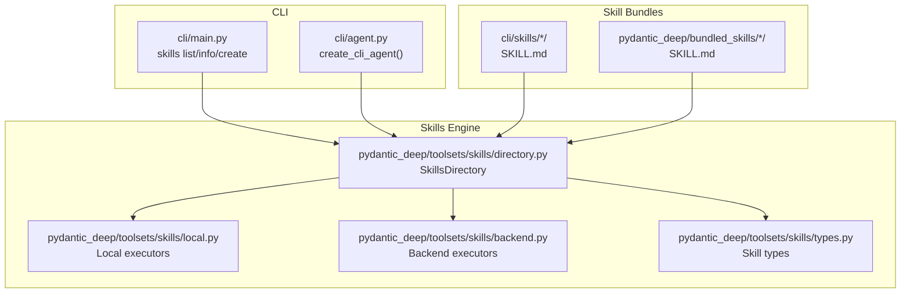
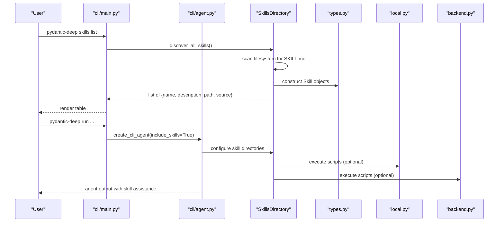
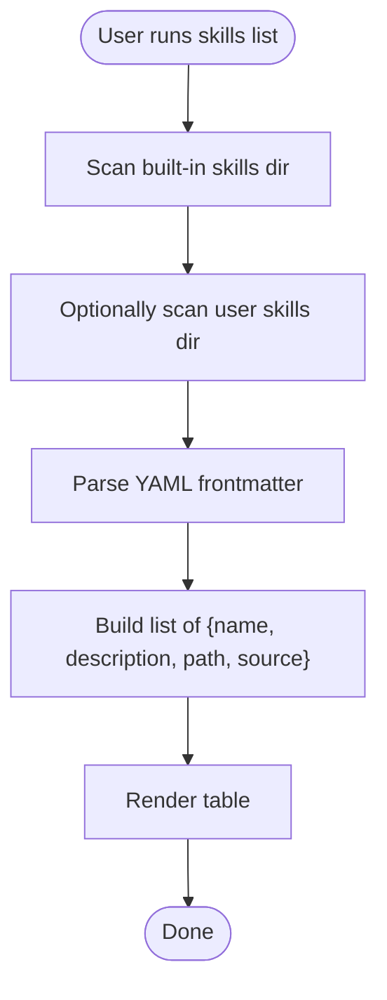
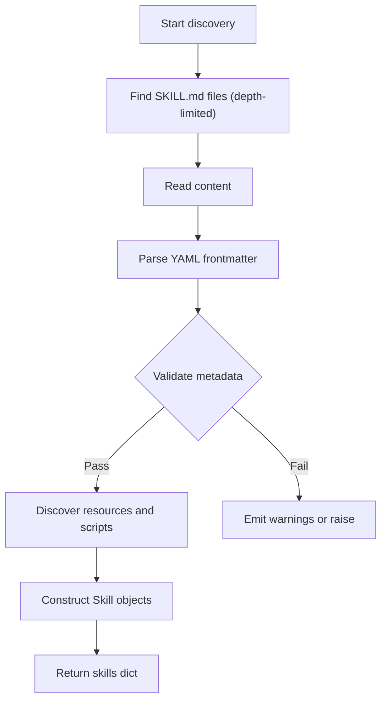
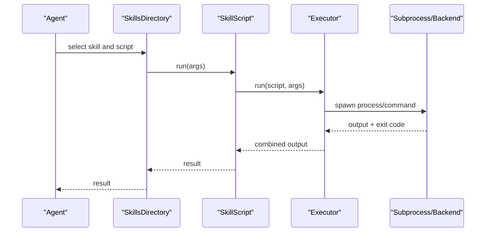
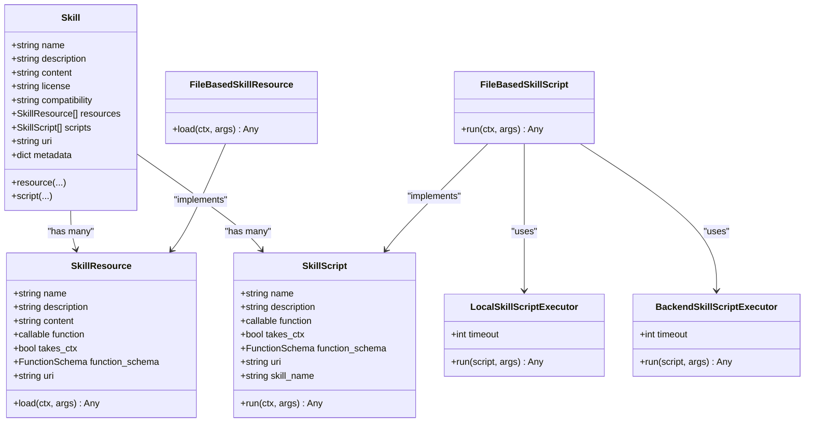
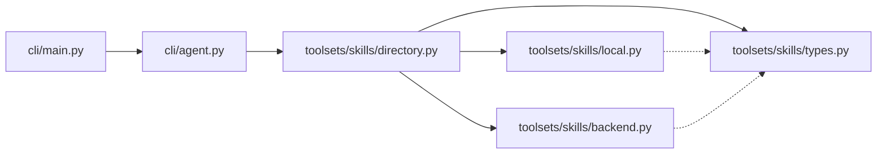

# Skill Management

<cite>
**Referenced Files in This Document**
- [cli/main.py](file://cli/main.py)
- [cli/agent.py](file://cli/agent.py)
- [pydantic_deep/toolsets/skills/directory.py](file://pydantic_deep/toolsets/skills/directory.py)
- [pydantic_deep/toolsets/skills/local.py](file://pydantic_deep/toolsets/skills/local.py)
- [pydantic_deep/toolsets/skills/backend.py](file://pydantic_deep/toolsets/skills/backend.py)
- [pydantic_deep/toolsets/skills/types.py](file://pydantic_deep/toolsets/skills/types.py)
- [cli/skills/environment-discovery/SKILL.md](file://cli/skills/environment-discovery/SKILL.md)
- [cli/skills/git-workflow/SKILL.md](file://cli/skills/git-workflow/SKILL.md)
- [cli/skills/code-review/SKILL.md](file://cli/skills/code-review/SKILL.md)
- [cli/skills/test-writer/SKILL.md](file://cli/skills/test-writer/SKILL.md)
- [cli/skills/skill-creator/SKILL.md](file://cli/skills/skill-creator/SKILL.md)
- [pydantic_deep/bundled_skills/skill-creator/SKILL.md](file://pydantic_deep/bundled_skills/skill-creator/SKILL.md)
- [examples/skills_usage.py](file://examples/skills_usage.py)
</cite>

## Table of Contents
1. [Introduction](#introduction)
2. [Project Structure](#project-structure)
3. [Core Components](#core-components)
4. [Architecture Overview](#architecture-overview)
5. [Detailed Component Analysis](#detailed-component-analysis)
6. [Dependency Analysis](#dependency-analysis)
7. [Performance Considerations](#performance-considerations)
8. [Troubleshooting Guide](#troubleshooting-guide)
9. [Conclusion](#conclusion)
10. [Appendices](#appendices)

## Introduction
This document explains the skills management system within the CLI interface. It covers how skills are discovered, listed, and retrieved; how to create and scaffold new skills; how skills integrate with the agent framework; and best practices for distribution, sharing, and deployment. It also documents skill metadata, versioning, dependencies, troubleshooting, debugging, and performance optimization.

## Project Structure
Skills are organized as directories containing a SKILL.md file with YAML frontmatter and optional supporting files. The CLI exposes commands to list, show details, and create skills. The underlying engine discovers skills from filesystem directories and supports both local and backend-backed execution.

**Diagram sources**
- [cli/main.py:338-496](file://cli/main.py#L338-L496)
- [cli/agent.py:168-184](file://cli/agent.py#L168-L184)
- [pydantic_deep/toolsets/skills/directory.py:444-532](file://pydantic_deep/toolsets/skills/directory.py#L444-L532)
- [pydantic_deep/toolsets/skills/local.py:88-313](file://pydantic_deep/toolsets/skills/local.py#L88-L313)
- [pydantic_deep/toolsets/skills/backend.py:397-565](file://pydantic_deep/toolsets/skills/backend.py#L397-L565)
- [pydantic_deep/toolsets/skills/types.py:75-521](file://pydantic_deep/toolsets/skills/types.py#L75-L521)

**Section sources**
- [cli/main.py:338-496](file://cli/main.py#L338-L496)
- [cli/agent.py:168-184](file://cli/agent.py#L168-L184)
- [pydantic_deep/toolsets/skills/directory.py:444-532](file://pydantic_deep/toolsets/skills/directory.py#L444-L532)

## Core Components
- CLI skills commands:
  - list: enumerates built-in and user skills with name, description, and source.
  - info: prints the full instructions and metadata for a named skill.
  - create: scaffolds a new skill directory with a minimal SKILL.md template.
- Skills discovery and loading:
  - SkillsDirectory finds SKILL.md files recursively up to a configured depth, parses YAML frontmatter, and builds Skill objects with resources and scripts.
- Executable scripts:
  - LocalSkillScriptExecutor runs Python scripts as subprocesses with timeouts.
  - BackendSkillScriptExecutor runs scripts inside a sandboxed backend environment.
- Types and decorators:
  - Skill, SkillResource, SkillScript define the data model.
  - Decorators attach resources and scripts to skills programmatically.

**Section sources**
- [cli/main.py:404-492](file://cli/main.py#L404-L492)
- [pydantic_deep/toolsets/skills/directory.py:444-532](file://pydantic_deep/toolsets/skills/directory.py#L444-L532)
- [pydantic_deep/toolsets/skills/local.py:88-313](file://pydantic_deep/toolsets/skills/local.py#L88-L313)
- [pydantic_deep/toolsets/skills/backend.py:397-565](file://pydantic_deep/toolsets/skills/backend.py#L397-L565)
- [pydantic_deep/toolsets/skills/types.py:75-521](file://pydantic_deep/toolsets/skills/types.py#L75-L521)

## Architecture Overview
The CLI integrates skills into the agent by configuring skill directories. At runtime, the agent uses the skills toolset to discover, load, and execute skills and their embedded resources/scripts.

**Diagram sources**
- [cli/main.py:404-492](file://cli/main.py#L404-L492)
- [cli/agent.py:168-184](file://cli/agent.py#L168-L184)
- [pydantic_deep/toolsets/skills/directory.py:444-532](file://pydantic_deep/toolsets/skills/directory.py#L444-L532)
- [pydantic_deep/toolsets/skills/local.py:88-313](file://pydantic_deep/toolsets/skills/local.py#L88-L313)
- [pydantic_deep/toolsets/skills/backend.py:397-565](file://pydantic_deep/toolsets/skills/backend.py#L397-L565)

## Detailed Component Analysis

### CLI Skills Commands
- skills list:
  - Scans built-in and optional user-provided directories for SKILL.md files.
  - Parses frontmatter to extract name and description.
  - Outputs a formatted table with source (built-in vs user).
- skills info:
  - Locates a skill by name and prints the full Markdown body after the frontmatter.
- skills create:
  - Generates a new skill directory with a minimal SKILL.md template.

**Diagram sources**
- [cli/main.py:347-428](file://cli/main.py#L347-L428)

**Section sources**
- [cli/main.py:404-492](file://cli/main.py#L404-L492)

### Skills Discovery and Metadata Parsing
- SkillsDirectory:
  - Recursively finds SKILL.md files up to a configurable depth.
  - Parses YAML frontmatter and validates metadata (name, description, compatibility).
  - Discovers resource files (.md, .json, .yaml, .yml, .csv, .xml, .txt) and Python scripts in root and scripts/.
  - Supports both local and backend-backed discovery.
- Metadata validation enforces:
  - Name format and length limits.
  - Description and compatibility length limits.
  - Instruction body length recommendation.

**Diagram sources**
- [pydantic_deep/toolsets/skills/directory.py:347-442](file://pydantic_deep/toolsets/skills/directory.py#L347-L442)

**Section sources**
- [pydantic_deep/toolsets/skills/directory.py:444-532](file://pydantic_deep/toolsets/skills/directory.py#L444-L532)

### Executable Scripts and Execution
- LocalSkillScriptExecutor:
  - Runs Python scripts as subprocesses with a timeout.
  - Passes arguments as command-line flags.
  - Captures stdout/stderr and exit codes.
- BackendSkillScriptExecutor:
  - Executes scripts inside a sandboxed backend environment.
  - Builds safe command strings and handles truncation and exit codes.

**Diagram sources**
- [pydantic_deep/toolsets/skills/local.py:112-182](file://pydantic_deep/toolsets/skills/local.py#L112-L182)
- [pydantic_deep/toolsets/skills/backend.py:133-189](file://pydantic_deep/toolsets/skills/backend.py#L133-L189)

**Section sources**
- [pydantic_deep/toolsets/skills/local.py:88-313](file://pydantic_deep/toolsets/skills/local.py#L88-L313)
- [pydantic_deep/toolsets/skills/backend.py:397-565](file://pydantic_deep/toolsets/skills/backend.py#L397-L565)

### Skill Types and Decorators
- Skill:
  - Holds metadata (name, description, license, compatibility), content, resources, and scripts.
  - Provides resource() and script() decorators to attach callable resources/scripts.
- SkillResource and SkillScript:
  - Represent static content, file-based resources, or callable resources/scripts.
- SkillWrapper:
  - A generic wrapper for decorator-based skill creation with typed dependencies.

**Diagram sources**
- [pydantic_deep/toolsets/skills/types.py:75-521](file://pydantic_deep/toolsets/skills/types.py#L75-L521)
- [pydantic_deep/toolsets/skills/local.py:35-313](file://pydantic_deep/toolsets/skills/local.py#L35-L313)
- [pydantic_deep/toolsets/skills/backend.py:46-279](file://pydantic_deep/toolsets/skills/backend.py#L46-L279)

**Section sources**
- [pydantic_deep/toolsets/skills/types.py:75-521](file://pydantic_deep/toolsets/skills/types.py#L75-L521)

### Skill Creation Workflows and Scaffolding
- Built-in guidance:
  - The skill-creator skill defines the recommended structure and frontmatter for new skills.
- CLI scaffolding:
  - The skills create command generates a new skill directory with a minimal SKILL.md template.
- Best practices:
  - Use lowercase, hyphenated names.
  - Keep descriptions concise and action-oriented.
  - Split long instruction bodies into separate resource files.
  - Include examples and edge-case guidance.

**Section sources**
- [cli/skills/skill-creator/SKILL.md:1-55](file://cli/skills/skill-creator/SKILL.md#L1-L55)
- [pydantic_deep/bundled_skills/skill-creator/SKILL.md:1-55](file://pydantic_deep/bundled_skills/skill-creator/SKILL.md#L1-L55)
- [cli/main.py:468-492](file://cli/main.py#L468-L492)

### Skill Distribution, Sharing, and Deployment Patterns
- Distribution:
  - Share skills as directories containing SKILL.md and optional resources/scripts.
  - Use version metadata in frontmatter to track releases.
- Sharing:
  - Publish skills to repositories or internal artifact stores.
  - Reference skills via filesystem paths or backend URIs.
- Deployment:
  - Local deployment: place skills under a project’s .pydantic-deep/skills or a user-specified directory.
  - Backend deployment: write skills to a backend filesystem and discover via BackendSkillsDirectory.

**Section sources**
- [cli/agent.py:168-184](file://cli/agent.py#L168-L184)
- [pydantic_deep/toolsets/skills/backend.py:397-565](file://pydantic_deep/toolsets/skills/backend.py#L397-L565)

### Skill Metadata Management, Versioning, and Dependencies
- Frontmatter fields:
  - name, description, tags, version, license, compatibility, and custom metadata.
- Versioning:
  - Use semantic versioning in the version field.
- Dependencies:
  - Define environment requirements in compatibility.
  - Use resources to embed schemas, examples, and templates.

**Section sources**
- [pydantic_deep/toolsets/skills/directory.py:44-120](file://pydantic_deep/toolsets/skills/directory.py#L44-L120)
- [pydantic_deep/toolsets/skills/types.py:180-234](file://pydantic_deep/toolsets/skills/types.py#L180-L234)

### Integration with the Agent Framework
- The CLI creates an agent with skills enabled and configures skill directories from:
  - An explicit override,
  - The project’s .pydantic-deep/skills,
  - Or the bundled skills directory.
- The agent can then use skills to enhance behavior, including executing scripts and loading resources.

**Section sources**
- [cli/agent.py:168-184](file://cli/agent.py#L168-L184)
- [examples/skills_usage.py:23-39](file://examples/skills_usage.py#L23-L39)

## Dependency Analysis
The skills subsystem is composed of cohesive modules with clear separation of concerns:
- CLI layer: commands to discover, list, show, and scaffold skills.
- Engine layer: discovery, parsing, validation, and execution.
- Types layer: data models and decorators.
- Executors: local and backend script execution.

**Diagram sources**
- [cli/main.py:338-496](file://cli/main.py#L338-L496)
- [cli/agent.py:168-184](file://cli/agent.py#L168-L184)
- [pydantic_deep/toolsets/skills/directory.py:444-532](file://pydantic_deep/toolsets/skills/directory.py#L444-L532)
- [pydantic_deep/toolsets/skills/local.py:88-313](file://pydantic_deep/toolsets/skills/local.py#L88-L313)
- [pydantic_deep/toolsets/skills/backend.py:397-565](file://pydantic_deep/toolsets/skills/backend.py#L397-L565)
- [pydantic_deep/toolsets/skills/types.py:75-521](file://pydantic_deep/toolsets/skills/types.py#L75-L521)

**Section sources**
- [cli/main.py:338-496](file://cli/main.py#L338-L496)
- [cli/agent.py:168-184](file://cli/agent.py#L168-L184)
- [pydantic_deep/toolsets/skills/directory.py:444-532](file://pydantic_deep/toolsets/skills/directory.py#L444-L532)

## Performance Considerations
- Depth-limited discovery:
  - SkillsDirectory limits recursion depth to avoid scanning very large trees.
- Instruction body length:
  - Long instruction bodies are discouraged; split into resources for better performance and maintainability.
- Script timeouts:
  - Local and backend executors enforce timeouts to prevent runaway scripts.
- Resource parsing:
  - JSON/YAML resources are parsed on demand; keep resource counts reasonable.

[No sources needed since this section provides general guidance]

## Troubleshooting Guide
- Missing or invalid frontmatter:
  - Validation warns or raises if required fields are absent or exceed limits.
- Script execution failures:
  - Local executor reports stderr and exit codes; backend executor reports truncation and exit codes.
- Path traversal and safety:
  - Resource and script discovery validates resolved paths to prevent escaping the skill directory.
- CLI commands:
  - skills list returns no skills if directories are empty or inaccessible.
  - skills info reports not found if the skill name is incorrect.

**Section sources**
- [pydantic_deep/toolsets/skills/directory.py:44-120](file://pydantic_deep/toolsets/skills/directory.py#L44-L120)
- [pydantic_deep/toolsets/skills/local.py:112-182](file://pydantic_deep/toolsets/skills/local.py#L112-L182)
- [pydantic_deep/toolsets/skills/backend.py:133-189](file://pydantic_deep/toolsets/skills/backend.py#L133-L189)
- [cli/main.py:404-492](file://cli/main.py#L404-L492)

## Conclusion
The skills management system provides a robust, extensible mechanism for discovering, describing, and executing reusable capabilities within the CLI and agent framework. By adhering to the SKILL.md format, using the CLI scaffolding, and leveraging the engine’s discovery and execution layers, teams can develop, distribute, and operate skills efficiently and safely.

## Appendices

### Example: Using Skills Programmatically
- Demonstrates listing skills, loading instructions, and invoking skills with a backend.

**Section sources**
- [examples/skills_usage.py:23-136](file://examples/skills_usage.py#L23-L136)

### Example Skills Included in the Repository
- environment-discovery: systematic environment exploration steps.
- git-workflow: commit messages, branching, conflict resolution, and safety rules.
- code-review: checklist across correctness, security, performance, style, and testing.
- test-writer: coverage strategy and guidelines for test generation.

**Section sources**
- [cli/skills/environment-discovery/SKILL.md:1-59](file://cli/skills/environment-discovery/SKILL.md#L1-L59)
- [cli/skills/git-workflow/SKILL.md:1-44](file://cli/skills/git-workflow/SKILL.md#L1-L44)
- [cli/skills/code-review/SKILL.md:1-47](file://cli/skills/code-review/SKILL.md#L1-L47)
- [cli/skills/test-writer/SKILL.md:1-47](file://cli/skills/test-writer/SKILL.md#L1-L47)