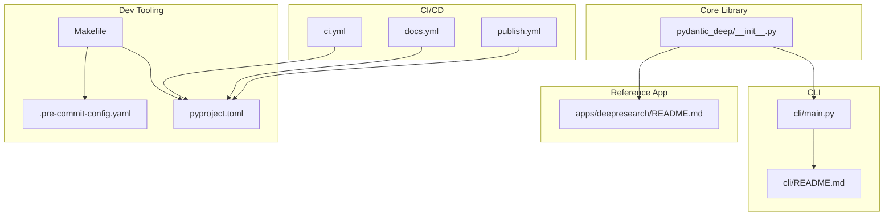
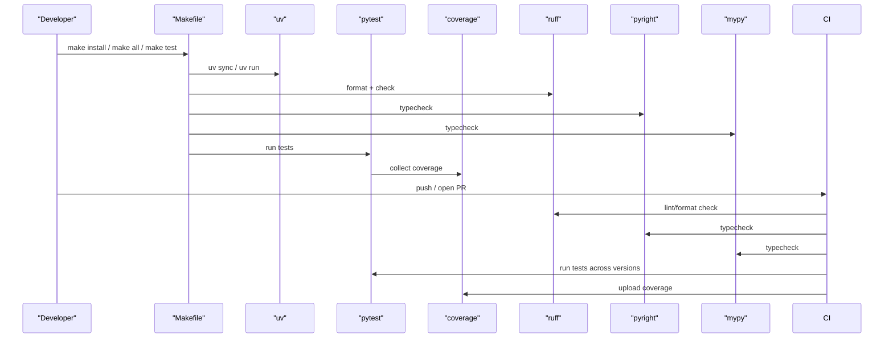
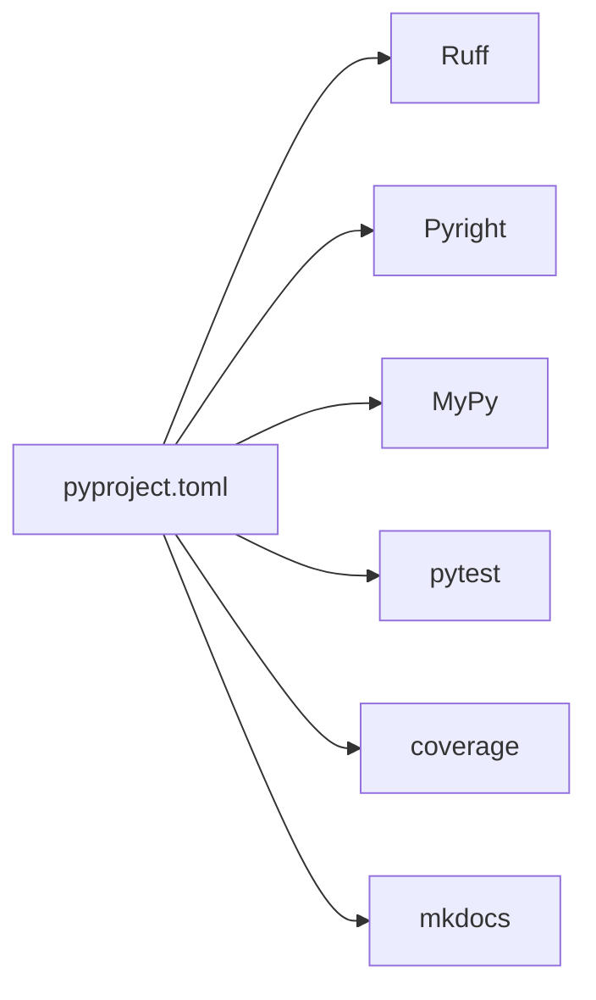
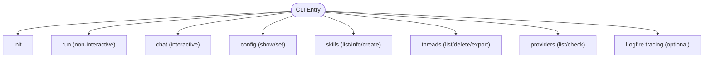

# Contributing and Development

<cite>
**Referenced Files in This Document**
- [CONTRIBUTING.md](file://CONTRIBUTING.md)
- [README.md](file://README.md)
- [pyproject.toml](file://pyproject.toml)
- [Makefile](file://Makefile)
- [.pre-commit-config.yaml](file://.pre-commit-config.yaml)
- [ci.yml](file://.github/workflows/ci.yml)
- [docs.yml](file://.github/workflows/docs.yml)
- [publish.yml](file://.github/workflows/publish.yml)
- [cli/README.md](file://cli/README.md)
- [apps/deepresearch/README.md](file://apps/deepresearch/README.md)
- [tests/conftest.py](file://tests/conftest.py)
- [cli/main.py](file://cli/main.py)
- [pydantic_deep/__init__.py](file://pydantic_deep/__init__.py)
- [mkdocs.yml](file://mkdocs.yml)
- [CHANGELOG.md](file://CHANGELOG.md)
- [cli/config.py](file://cli/config.py)
</cite>

## Table of Contents
1. [Introduction](#introduction)
2. [Project Structure](#project-structure)
3. [Core Components](#core-components)
4. [Architecture Overview](#architecture-overview)
5. [Detailed Component Analysis](#detailed-component-analysis)
6. [Dependency Analysis](#dependency-analysis)
7. [Performance Considerations](#performance-considerations)
8. [Troubleshooting Guide](#troubleshooting-guide)
9. [Conclusion](#conclusion)
10. [Appendices](#appendices)

## Introduction
This document provides comprehensive guidance for contributors and maintainers working on the project. It covers the development environment setup, build and test processes, code standards, contribution procedures, governance, release and versioning practices, and practical tips for debugging and performance optimization. The goal is to make contributions predictable, efficient, and aligned with the project’s quality and reliability expectations.

## Project Structure
The repository is organized around a core Python package, a CLI, and a reference application (DeepResearch). Development tooling is centralized via a Makefile and pre-commit hooks, with continuous integration managed by GitHub Actions. Documentation is built with MkDocs and deployed via GitHub Pages.

**Diagram sources**
- [pydantic_deep/__init__.py:1-377](file://pydantic_deep/__init__.py#L1-L377)
- [cli/main.py:1-705](file://cli/main.py#L1-L705)
- [cli/README.md:1-225](file://cli/README.md#L1-L225)
- [apps/deepresearch/README.md:1-255](file://apps/deepresearch/README.md#L1-L255)
- [Makefile:1-95](file://Makefile#L1-L95)
- [.pre-commit-config.yaml:1-49](file://.pre-commit-config.yaml#L1-L49)
- [pyproject.toml:1-211](file://pyproject.toml#L1-L211)
- [.github/workflows/ci.yml:1-116](file://.github/workflows/ci.yml#L1-L116)
- [.github/workflows/docs.yml:1-51](file://.github/workflows/docs.yml#L1-L51)
- [.github/workflows/publish.yml:1-18](file://.github/workflows/publish.yml#L1-L18)

**Section sources**
- [README.md:1-372](file://README.md#L1-L372)
- [pyproject.toml:1-211](file://pyproject.toml#L1-L211)
- [Makefile:1-95](file://Makefile#L1-L95)
- [.pre-commit-config.yaml:1-49](file://.pre-commit-config.yaml#L1-L49)
- [.github/workflows/ci.yml:1-116](file://.github/workflows/ci.yml#L1-L116)
- [.github/workflows/docs.yml:1-51](file://.github/workflows/docs.yml#L1-L51)
- [.github/workflows/publish.yml:1-18](file://.github/workflows/publish.yml#L1-L18)

## Core Components
- Development environment and commands are driven by a Makefile with targets for installing dependencies, formatting, linting, type checking, testing, and documentation building.
- Pre-commit hooks enforce formatting, linting, and type checks locally before commits.
- Continuous integration validates formatting, linting, type checking, tests across multiple Python versions, and builds documentation.
- The CLI entry point orchestrates commands, configuration, skills, threads, and provider checks.
- The core library exposes agent creation, toolsets, middleware, processors, and related types.

**Section sources**
- [CONTRIBUTING.md:1-70](file://CONTRIBUTING.md#L1-L70)
- [Makefile:1-95](file://Makefile#L1-L95)
- [.pre-commit-config.yaml:1-49](file://.pre-commit-config.yaml#L1-L49)
- [.github/workflows/ci.yml:1-116](file://.github/workflows/ci.yml#L1-L116)
- [cli/main.py:1-705](file://cli/main.py#L1-L705)
- [pydantic_deep/__init__.py:1-377](file://pydantic_deep/__init__.py#L1-L377)

## Architecture Overview
The development workflow integrates local tooling with CI/CD automation. Contributors run Make targets locally, which delegate to uv, pytest, coverage, ruff, pyright, and mypy. CI jobs mirror these checks on multiple Python versions and build documentation. Releases are published to PyPI from GitHub releases.

**Diagram sources**
- [Makefile:1-95](file://Makefile#L1-L95)
- [.github/workflows/ci.yml:1-116](file://.github/workflows/ci.yml#L1-L116)
- [pyproject.toml:86-108](file://pyproject.toml#L86-L108)

**Section sources**
- [Makefile:1-95](file://Makefile#L1-L95)
- [.github/workflows/ci.yml:1-116](file://.github/workflows/ci.yml#L1-L116)
- [pyproject.toml:86-108](file://pyproject.toml#L86-L108)

## Detailed Component Analysis

### Development Environment Setup
- Install dependencies and pre-commit hooks using the Makefile target designed for local development.
- The Makefile ensures uv and pre-commit are installed and sets up environments for multiple Python versions if needed.
- The project supports optional extras for sandbox, CLI, web, web tools, YAML, and logging.

Recommended initial setup:
- Clone the repository and run the installation target to synchronize dependencies and install pre-commit hooks.
- Optionally run the “install-all-python” target to prepare virtual environments for all supported Python versions.

**Section sources**
- [CONTRIBUTING.md:5-11](file://CONTRIBUTING.md#L5-L11)
- [Makefile:11-25](file://Makefile#L11-L25)
- [pyproject.toml:86-96](file://pyproject.toml#L86-L96)

### Build and Test Process
- Formatting and linting are enforced via Ruff; type checking is performed with both Pyright and MyPy.
- Tests run with pytest and produce coverage reports; coverage thresholds are enforced.
- The Makefile provides convenient targets for running all checks and generating coverage artifacts.
- CI mirrors these checks across multiple Python versions and uploads coverage to Coveralls.

Practical commands:
- make install — install dependencies and hooks
- make all — format + lint + typecheck + test + coverage
- make test — run tests and display coverage
- make test-all-python — run tests across Python 3.10–3.13 and combine coverage
- make docs / make docs-serve — build or serve documentation

**Section sources**
- [CONTRIBUTING.md:13-18](file://CONTRIBUTING.md#L13-L18)
- [Makefile:27-81](file://Makefile#L27-L81)
- [.github/workflows/ci.yml:39-90](file://.github/workflows/ci.yml#L39-L90)
- [pyproject.toml:141-172](file://pyproject.toml#L141-L172)

### Code Standards and Quality Gates
- Formatting and linting: Ruff is configured for line length, complexity limits, and specific ignores for long prompt strings.
- Static type checking: Both Pyright and MyPy are used; Pyright uses a pragmatic mode and excludes certain directories, while MyPy enforces strict mode with targeted overrides for tests.
- Test coverage: Coverage is enabled and configured to require 100% coverage across the library code.

Pre-commit hooks:
- Automatically run formatting, linting, and type checks before commits.

**Section sources**
- [pyproject.toml:110-140](file://pyproject.toml#L110-L140)
- [pyproject.toml:177-206](file://pyproject.toml#L177-L206)
- [.pre-commit-config.yaml:26-49](file://.pre-commit-config.yaml#L26-L49)
- [pyproject.toml:147-176](file://pyproject.toml#L147-L176)

### Contribution Procedures
- Fork the repository and create a branch from main.
- Ensure all checks pass locally (format, lint, typecheck, tests).
- Submit a pull request with a clear description.

Quick commands for contributors:
- make install, make all, make test
- Use uv run pytest for targeted test runs

**Section sources**
- [CONTRIBUTING.md:60-69](file://CONTRIBUTING.md#L60-L69)
- [CONTRIBUTING.md:29-39](file://CONTRIBUTING.md#L29-L39)

### Issue Reporting and Feature Requests
- Use the repository’s issue tracker for bug reports and feature requests.
- Provide clear reproduction steps, expected vs. actual behavior, and environment details.

**Section sources**
- [README.md:329-337](file://README.md#L329-L337)

### Pull Request Workflow
- Branch from main, make changes, run make all, and submit a PR with a concise description.
- CI jobs will validate formatting, linting, type checks, tests, and documentation builds.

**Section sources**
- [CONTRIBUTING.md:60-65](file://CONTRIBUTING.md#L60-L65)
- [.github/workflows/ci.yml:1-116](file://.github/workflows/ci.yml#L1-L116)

### Code Review Standards
- Reviews focus on correctness, maintainability, adherence to style, and completeness of tests.
- Ensure 100% coverage and passing type checks before merging.

**Section sources**
- [CONTRIBUTING.md:20-28](file://CONTRIBUTING.md#L20-L28)

### Project Governance and Maintainers
- Governance is informal: maintainers triage issues, review PRs, and approve releases.
- Release process is automated via GitHub Actions from published releases.

**Section sources**
- [.github/workflows/publish.yml:1-18](file://.github/workflows/publish.yml#L1-L18)
- [CHANGELOG.md:1-218](file://CHANGELOG.md#L1-L218)

### Community Engagement Practices
- Encourage respectful discussions, provide reproducible examples, and use the issue templates.
- Engage with documentation improvements and examples.

**Section sources**
- [README.md:329-337](file://README.md#L329-L337)

### Release Process and Versioning
- Versioning follows semantic versioning.
- Releases are published to PyPI from GitHub releases; CI builds documentation and deploys it to GitHub Pages.

Release-related CI:
- ci.yml: runs lint, type checks, tests, and documentation build.
- docs.yml: builds and deploys documentation to GitHub Pages.
- publish.yml: publishes the package to PyPI on release.

**Section sources**
- [CHANGELOG.md:1-218](file://CHANGELOG.md#L1-L218)
- [.github/workflows/ci.yml:1-116](file://.github/workflows/ci.yml#L1-L116)
- [.github/workflows/docs.yml:1-51](file://.github/workflows/docs.yml#L1-L51)
- [.github/workflows/publish.yml:1-18](file://.github/workflows/publish.yml#L1-L18)

### Debugging, Profiling, and Performance Optimization
- Use pytest with verbose and/or debug output for targeted test runs.
- Leverage coverage reports to identify untested code paths.
- For performance-sensitive areas, consider reducing tool call retries, enabling eviction processors, and using summarization processors to manage context size.
- Streamed output and structured outputs can reduce overhead in long-running operations.

**Section sources**
- [CONTRIBUTING.md:41-52](file://CONTRIBUTING.md#L41-L52)
- [pyproject.toml:147-176](file://pyproject.toml#L147-L176)
- [pydantic_deep/__init__.py:116-125](file://pydantic_deep/__init__.py#L116-L125)
- [pydantic_deep/__init__.py:95-103](file://pydantic_deep/__init__.py#L95-L103)

## Dependency Analysis
The project relies on a set of core libraries and optional extras. Development and documentation toolchains are grouped separately for maintainability.

**Diagram sources**
- [pyproject.toml:86-108](file://pyproject.toml#L86-L108)

**Section sources**
- [pyproject.toml:86-108](file://pyproject.toml#L86-L108)

## Performance Considerations
- Keep context lean: use summarization processors and eviction processors to manage token usage.
- Prefer streaming for long-running tasks to improve perceived responsiveness.
- Use structured outputs to reduce ambiguity and rework cycles.
- Minimize redundant tool calls by leveraging caching and checkpoints where appropriate.

[No sources needed since this section provides general guidance]

## Troubleshooting Guide
Common issues and remedies:
- Formatting/lint/typecheck failures: run make format and make lint; ensure pre-commit is installed and hooks are installed.
- Test failures: run make test or make test-all-python; inspect coverage reports and failing logs.
- CLI configuration problems: validate configuration precedence and environment overrides.
- Documentation build issues: use make docs or make docs-serve; verify MkDocs configuration.

**Section sources**
- [.pre-commit-config.yaml:1-49](file://.pre-commit-config.yaml#L1-L49)
- [Makefile:27-81](file://Makefile#L27-L81)
- [cli/config.py:96-154](file://cli/config.py#L96-L154)
- [mkdocs.yml:1-257](file://mkdocs.yml#L1-L257)

## Conclusion
By following the development workflow outlined here—local checks via Make and pre-commit, CI validation, and disciplined contribution practices—you can efficiently contribute to the project while maintaining high code quality and reliability. Adhering to the documented standards and release practices ensures smooth collaboration and consistent delivery.

[No sources needed since this section summarizes without analyzing specific files]

## Appendices

### Appendix A: Quick Commands Reference
- make install — Install dependencies and pre-commit hooks
- make all — Run formatting, linting, type checks, tests, and coverage
- make test — Run tests and display coverage
- make test-all-python — Run tests across Python 3.10–3.13 and combine coverage
- make docs / make docs-serve — Build or serve documentation
- make lint / make typecheck / make typecheck-both — Lint and type checks
- make format — Format code and apply fixes

**Section sources**
- [CONTRIBUTING.md:29-39](file://CONTRIBUTING.md#L29-L39)
- [Makefile:27-81](file://Makefile#L27-L81)

### Appendix B: CLI Entry Points and Responsibilities
The CLI entry point defines commands for running tasks, chatting, managing configuration, skills, threads, and providers. It also integrates optional Logfire tracing.

**Diagram sources**
- [cli/main.py:121-705](file://cli/main.py#L121-L705)

**Section sources**
- [cli/README.md:1-225](file://cli/README.md#L1-L225)
- [cli/main.py:1-705](file://cli/main.py#L1-L705)

### Appendix C: Testing Utilities and Fixtures
The test configuration includes fixtures for mocking subagent behavior, state backends, and temporary directories, ensuring reliable and isolated tests.

**Section sources**
- [tests/conftest.py:1-44](file://tests/conftest.py#L1-L44)