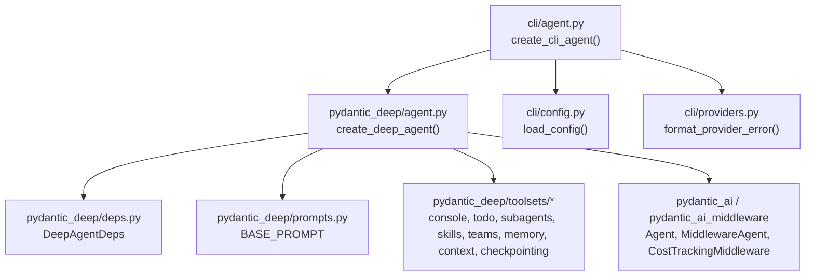
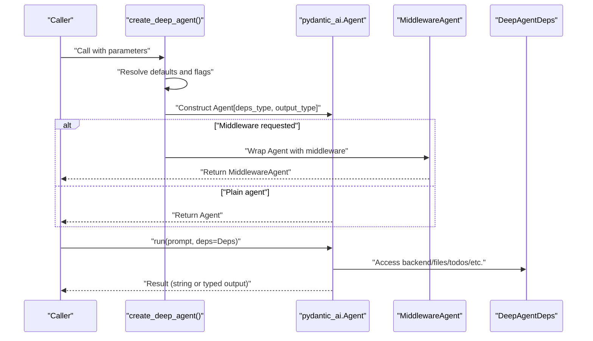
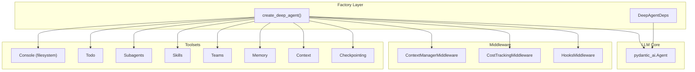

# Agent Creation and Factory

<cite>
**Referenced Files in This Document**
- [agent.py](file://pydantic_deep/agent.py)
- [types.py](file://pydantic_deep/types.py)
- [deps.py](file://pydantic_deep/deps.py)
- [prompts.py](file://pydantic_deep/prompts.py)
- [cli/agent.py](file://cli/agent.py)
- [cli/providers.py](file://cli/providers.py)
- [cli/config.py](file://cli/config.py)
- [docs/concepts/agents.md](file://docs/concepts/agents.md)
- [docs/examples/basic-usage.md](file://docs/examples/basic-usage.md)
- [docs/advanced/structured-output.md](file://docs/advanced/structured-output.md)
- [docs/advanced/subagents.md](file://docs/advanced/subagents.md)
- [tests/test_agent.py](file://tests/test_agent.py)
- [examples/basic_usage.py](file://examples/basic_usage.py)
</cite>

## Table of Contents
1. [Introduction](#introduction)
2. [Project Structure](#project-structure)
3. [Core Components](#core-components)
4. [Architecture Overview](#architecture-overview)
5. [Detailed Component Analysis](#detailed-component-analysis)
6. [Dependency Analysis](#dependency-analysis)
7. [Performance Considerations](#performance-considerations)
8. [Troubleshooting Guide](#troubleshooting-guide)
9. [Conclusion](#conclusion)
10. [Appendices](#appendices)

## Introduction
This document explains the Agent Creation and Factory section with a focus on the create_deep_agent() factory function and agent lifecycle management. It covers configuration parameters (model selection, instructions, output styling, toolsets, subagents, skills, memory, and advanced features), the factory’s dual overloads for string and structured output types, parameter validation and default resolution, practical examples, feature flag relationships, and troubleshooting guidance.

## Project Structure
The agent factory resides in the core library and integrates with toolsets, middleware, and dependency containers. CLI wrappers demonstrate real-world defaults and feature toggles.

**Diagram sources**
- [agent.py:196-936](file://pydantic_deep/agent.py#L196-L936)
- [deps.py:18-207](file://pydantic_deep/deps.py#L18-L207)
- [cli/agent.py:51-299](file://cli/agent.py#L51-L299)

**Section sources**
- [agent.py:196-936](file://pydantic_deep/agent.py#L196-L936)
- [cli/agent.py:51-299](file://cli/agent.py#L51-L299)

## Core Components
- Factory function: create_deep_agent() constructs a fully configured Agent with optional toolsets, middleware, and structured output support.
- Dependency container: DeepAgentDeps holds backend, files, todos, subagents, uploads, and context middleware.
- Default prompt: BASE_PROMPT defines baseline behavior and workflow expectations.
- CLI wrapper: create_cli_agent() applies sensible defaults for interactive use and environment integration.

Key responsibilities:
- Parameter normalization and defaults (model, backend, retries, context manager).
- Conditional inclusion of toolsets (todo, console, subagents, skills, memory, context, checkpointing, teams, web).
- Structured output wiring via output_type and DeferredToolRequests.
- Middleware composition (context manager, cost tracking, hooks, permissions).
- Lifecycle integration with Deps (initialization, cloning for subagents).

**Section sources**
- [agent.py:196-936](file://pydantic_deep/agent.py#L196-L936)
- [deps.py:18-207](file://pydantic_deep/deps.py#L18-L207)
- [prompts.py:5-66](file://pydantic_deep/prompts.py#L5-L66)
- [cli/agent.py:51-299](file://cli/agent.py#L51-L299)

## Architecture Overview
The factory composes an Agent with:
- Toolsets (optional) selected by feature flags.
- Optional structured output type.
- Optional middleware (context manager, cost tracking, hooks, permissions).
- A dynamic system prompt augmented by output style and context/memory.

**Diagram sources**
- [agent.py:196-936](file://pydantic_deep/agent.py#L196-L936)
- [cli/agent.py:236-295](file://cli/agent.py#L236-L295)

## Detailed Component Analysis

### Factory Function: create_deep_agent()
Dual overloads:
- String output: returns Agent[DeepAgentDeps, str].
- Structured output: returns Agent[DeepAgentDeps, OutputDataT] when output_type is provided.

Core configuration parameters:
- Model selection: model accepts a string provider/model or a Model instance.
- Instructions: base instructions or custom instructions; defaults to BASE_PROMPT.
- Output styling: output_style plus styles_dir to inject a style prompt into instructions.
- Toolsets and tools: include_todo, include_filesystem, include_subagents, include_skills, include_teams, include_web, tools, toolsets.
- Subagents: subagents list, include_general_purpose_subagent, max_nesting_depth, subagent_registry, subagent_extra_toolsets.
- Skills: skills (legacy dict or new Skill dataclass), skill_directories (paths or BackendSkillsDirectory).
- Backend: backend protocol; defaults to StateBackend.
- Context and memory: context_manager, context_manager_max_tokens, on_context_update, summarization_model, context_files, context_discovery, include_memory, memory_dir.
- History processing: history_processors, eviction_token_limit, patch_tool_calls.
- Execution and approvals: include_execute, interrupt_on (approval gating), retries.
- Cost and budget: cost_tracking, cost_budget_usd, on_cost_update.
- Middleware and hooks: middleware, permission_handler, middleware_context, hooks.
- Advanced: include_checkpoints, checkpoint_frequency, max_checkpoints, checkpoint_store, include_history_archive, history_messages_path, model_settings, instrument, plans_dir, edit_format, image_support, **agent_kwargs.

Parameter validation and defaults:
- Defaults are applied for model, backend, interrupt_on, and many other flags.
- Feature flags gate inclusion of toolsets and middleware.
- Structured output is combined with DeferredToolRequests when interrupt_on is used.

Lifecycle integration:
- The factory builds toolsets, augments instructions, sets up processors, and optionally wraps the agent with middleware.
- It exposes the context middleware for CLI commands via an internal attribute.

Practical examples:
- Basic agent creation and running with StateBackend.
- Custom instructions and model selection.
- Structured output with Pydantic models.
- Subagents with planner and custom subagents.
- CLI wrapper with lean/non-interactive modes and environment-driven defaults.

**Section sources**
- [agent.py:67-193](file://pydantic_deep/agent.py#L67-L193)
- [agent.py:196-936](file://pydantic_deep/agent.py#L196-L936)
- [docs/concepts/agents.md:1-47](file://docs/concepts/agents.md#L1-L47)
- [docs/examples/basic-usage.md:1-233](file://docs/examples/basic-usage.md#L1-L233)
- [docs/advanced/structured-output.md:1-219](file://docs/advanced/structured-output.md#L1-L219)
- [docs/advanced/subagents.md:189-246](file://docs/advanced/subagents.md#L189-L246)
- [examples/basic_usage.py:1-53](file://examples/basic_usage.py#L1-L53)

### Dependency Container: DeepAgentDeps
Purpose:
- Centralized state for agent execution: backend, in-memory files, todos, subagents, uploads, ask_user callback, context middleware, and sharing flags.

Key behaviors:
- Post-init syncs files with StateBackend.
- Provides helpers to summarize todos, files, subagents, and uploads.
- clone_for_subagent() creates isolated or shared subagent contexts respecting nesting depth and sharing flags.

Integration:
- Passed to agent.run() and used by tools to access backend and shared state.

**Section sources**
- [deps.py:18-207](file://pydantic_deep/deps.py#L18-L207)

### Default Prompt: BASE_PROMPT
- Defines core behavior, workflow, tool usage, file reading patterns, delegation, error handling, and progress updates.
- Applied as default instructions unless overridden.

**Section sources**
- [prompts.py:5-66](file://pydantic_deep/prompts.py#L5-L66)

### CLI Wrapper: create_cli_agent()
- Applies precedence: explicit args > config file > defaults.
- Enables/disables features based on lean/non_interactive flags.
- Builds hooks (e.g., shell allow-list), middleware (e.g., loop detection), and dynamic instructions.
- Sets up skills directories, context files, and per-session plans/messages storage.
- Returns (agent, deps) tuple ready for agent.run().

**Section sources**
- [cli/agent.py:51-299](file://cli/agent.py#L51-L299)
- [cli/config.py:96-134](file://cli/config.py#L96-L134)
- [cli/providers.py:205-234](file://cli/providers.py#L205-L234)

### Structured Output Overload
- When output_type is provided, the agent returns typed output instead of str.
- If interrupt_on is used, the factory combines output_type with DeferredToolRequests to preserve tool scheduling semantics.

Best practices:
- Use Pydantic models with clear field descriptions and constraints.
- Provide examples in instructions and handle validation errors.

**Section sources**
- [agent.py:157-193](file://pydantic_deep/agent.py#L157-L193)
- [agent.py:740-749](file://pydantic_deep/agent.py#L740-L749)
- [docs/advanced/structured-output.md:1-219](file://docs/advanced/structured-output.md#L1-L219)

### Subagents and Planner
- Built-in planner subagent can be included when include_plan and include_subagents are True.
- Subagents can have per-agent context toolsets and memory toolsets when include_memory is True.
- Max nesting depth controls recursive delegation.

**Section sources**
- [agent.py:477-494](file://pydantic_deep/agent.py#L477-L494)
- [agent.py:572-611](file://pydantic_deep/agent.py#L572-L611)
- [docs/advanced/subagents.md:189-246](file://docs/advanced/subagents.md#L189-L246)

### Output Styles
- output_style can be a built-in style name, a custom OutputStyle instance, or a style discovered from styles_dir.
- The resolved style is appended to the base instructions.

**Section sources**
- [agent.py:722-727](file://pydantic_deep/agent.py#L722-L727)

### Middleware and Cost Tracking
- ContextManagerMiddleware manages token budgets, auto-compression, and persistence.
- CostTrackingMiddleware tracks token usage and cost, with optional budget enforcement.
- Hooks and permissions can be integrated via middleware and hooks.

**Section sources**
- [agent.py:782-800](file://pydantic_deep/agent.py#L782-L800)
- [agent.py:913-931](file://pydantic_deep/agent.py#L913-L931)

### Practical Examples Index
- Basic agent creation and file operations.
- Custom instructions and model selection.
- Structured output with Pydantic models.
- Subagents with planner and custom subagents.
- CLI usage with lean/non-interactive modes.

**Section sources**
- [docs/examples/basic-usage.md:1-233](file://docs/examples/basic-usage.md#L1-L233)
- [docs/advanced/structured-output.md:1-219](file://docs/advanced/structured-output.md#L1-L219)
- [docs/advanced/subagents.md:189-246](file://docs/advanced/subagents.md#L189-L246)
- [examples/basic_usage.py:1-53](file://examples/basic_usage.py#L1-L53)

## Dependency Analysis
High-level relationships:
- create_deep_agent depends on toolsets, middleware, and the pydantic_ai Agent.
- DeepAgentDeps is injected into Agent runs and shared across tools.
- CLI wrapper composes environment-driven configuration and passes it to the factory.

**Diagram sources**
- [agent.py:196-936](file://pydantic_deep/agent.py#L196-L936)
- [deps.py:18-207](file://pydantic_deep/deps.py#L18-L207)

**Section sources**
- [agent.py:196-936](file://pydantic_deep/agent.py#L196-L936)
- [deps.py:18-207](file://pydantic_deep/deps.py#L18-L207)

## Performance Considerations
- Token budgeting: context_manager_max_tokens and eviction_token_limit help manage long conversations.
- Retry tuning: retries controls FunctionToolset and tool-level retry behavior.
- Image support: enabling image_support may increase payload sizes; use judiciously.
- Structured output: validation adds CPU overhead; ensure models are concise and constrained.
- Middleware: context manager and cost tracking add minimal overhead; disable for extremely lightweight scenarios.

[No sources needed since this section provides general guidance]

## Troubleshooting Guide
Common initialization issues and resolutions:
- Unknown provider or missing environment variables:
  - Use format_provider_error() to detect missing env vars or uninstalled extras and print actionable hints.
- Provider misconfiguration:
  - Validate provider environment and install extras as indicated by the formatter.
- CLI lean/non-interactive mode:
  - Some features (memory, plan, subagents, todo) are disabled in lean or non-interactive modes; adjust flags accordingly.
- Interrupt-on approvals:
  - When interrupt_on gates tools, ensure proper permission_handler or interactive flow is configured.
- Structured output validation errors:
  - Wrap agent calls in try/except and refine model constraints and instructions.
- Backend compatibility:
  - include_execute is auto-enabled for sandbox backends; otherwise, set include_execute explicitly.

**Section sources**
- [cli/providers.py:205-234](file://cli/providers.py#L205-L234)
- [cli/agent.py:186-196](file://cli/agent.py#L186-L196)
- [tests/test_agent.py:68-88](file://tests/test_agent.py#L68-L88)

## Conclusion
The create_deep_agent() factory provides a powerful, configurable entry point for building intelligent agents with planning, delegation, skills, and structured output. By leveraging feature flags, middleware, and a robust dependency container, it supports diverse use cases from interactive CLI sessions to production pipelines. Understanding parameter defaults, structured output wiring, and middleware composition enables reliable and efficient agent deployments.

[No sources needed since this section summarizes without analyzing specific files]

## Appendices

### Appendix A: Feature Flags and Component Activation
- include_todo → TodoToolset
- include_filesystem → ConsoleToolset (filesystem + optional execute)
- include_subagents → SubAgentToolset (+ planner when include_plan is True)
- include_skills → SkillsToolset
- include_teams → TeamToolset
- include_web → WebToolset
- include_memory → AgentMemoryToolset (main and per-subagent)
- include_checkpoints → CheckpointToolset + middleware
- context_manager → ContextManagerMiddleware
- cost_tracking → CostTrackingMiddleware
- hooks → HooksMiddleware
- permission_handler → MiddlewareAgent permission gating

**Section sources**
- [agent.py:506-718](file://pydantic_deep/agent.py#L506-L718)
- [agent.py:782-800](file://pydantic_deep/agent.py#L782-L800)
- [agent.py:913-931](file://pydantic_deep/agent.py#L913-L931)

### Appendix B: Choosing Configurations by Use Case
- Interactive CLI: use create_cli_agent() for lean defaults and environment-driven settings.
- Production agents: enable context manager, cost tracking, and structured output; tune retries and eviction.
- Research/code assistance: enable planner, subagents, skills, and memory; configure context files.
- Minimal footprint: disable non-essential toolsets and middleware; rely on string output.

**Section sources**
- [cli/agent.py:51-299](file://cli/agent.py#L51-L299)
- [docs/advanced/structured-output.md:188-213](file://docs/advanced/structured-output.md#L188-L213)