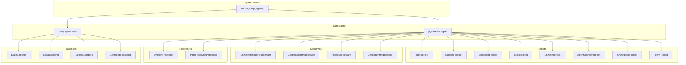
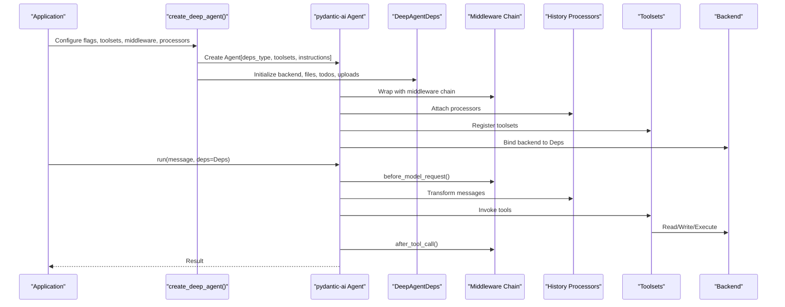
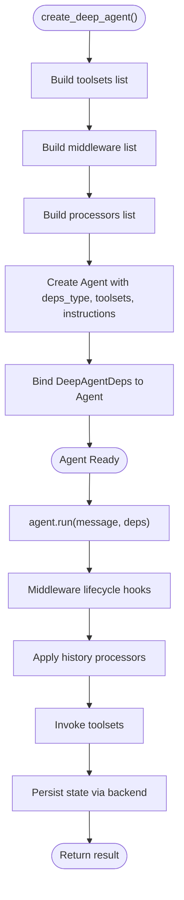
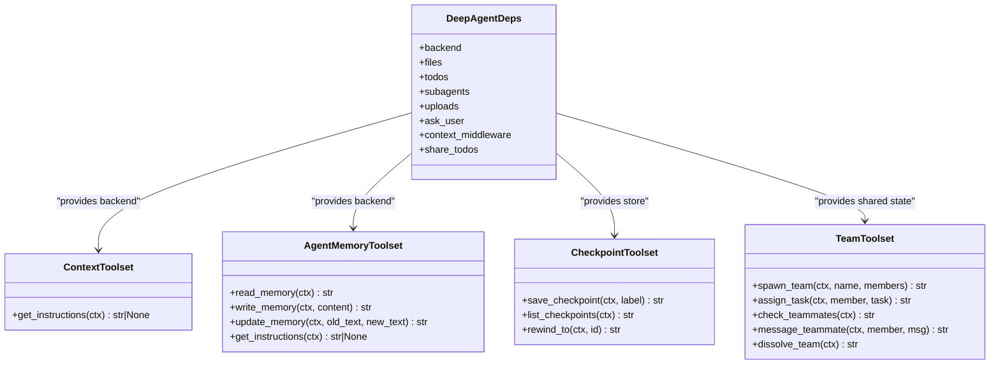
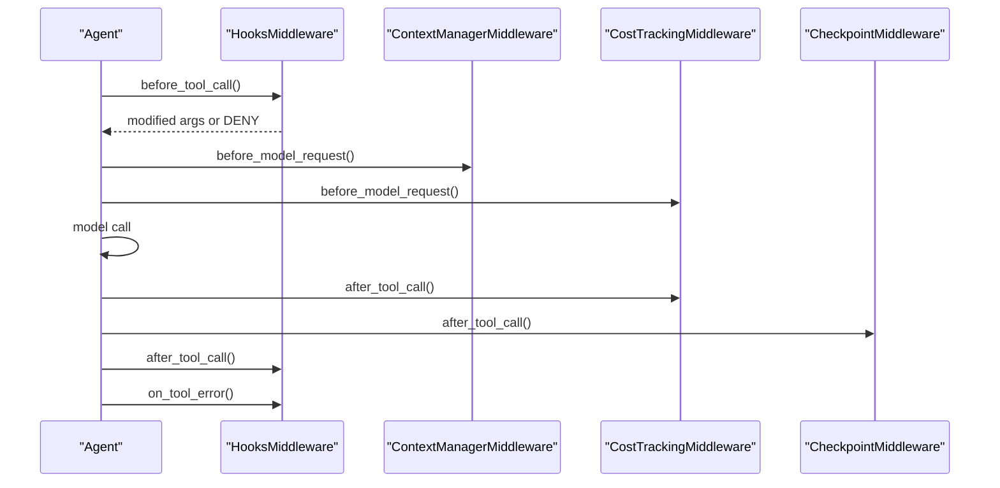
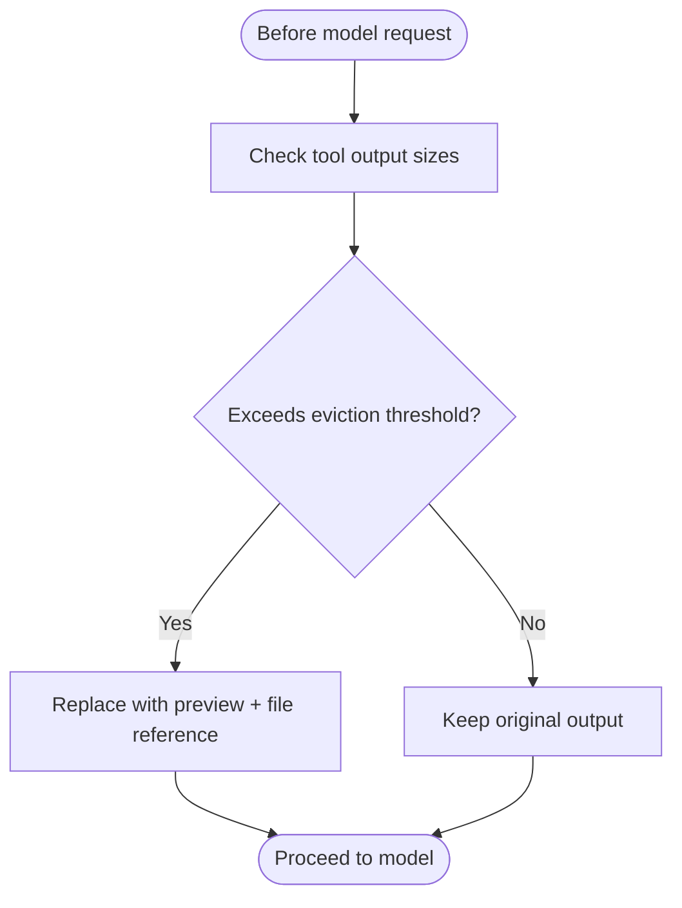
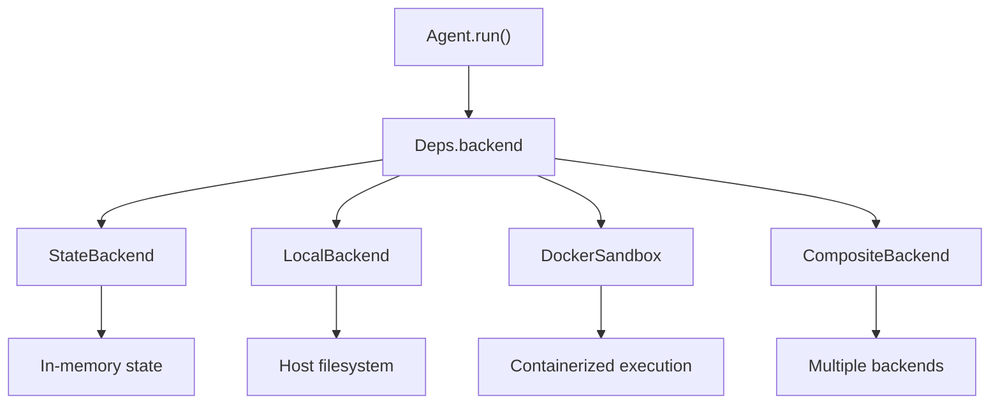
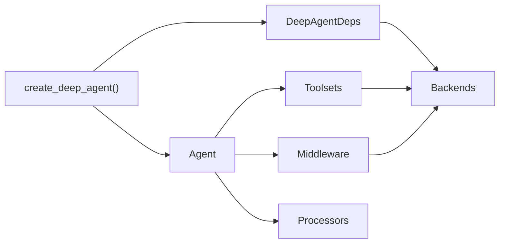

# Component Orchestration and Lifecycle

<cite>
**Referenced Files in This Document**
- [pydantic_deep/agent.py](file://pydantic_deep/agent.py)
- [pydantic_deep/__init__.py](file://pydantic_deep/__init__.py)
- [pydantic_deep/deps.py](file://pydantic_deep/deps.py)
- [pydantic_deep/prompts.py](file://pydantic_deep/prompts.py)
- [pydantic_deep/toolsets/__init__.py](file://pydantic_deep/toolsets/__init__.py)
- [pydantic_deep/toolsets/context.py](file://pydantic_deep/toolsets/context.py)
- [pydantic_deep/toolsets/memory.py](file://pydantic_deep/toolsets/memory.py)
- [pydantic_deep/toolsets/teams.py](file://pydantic_deep/toolsets/teams.py)
- [pydantic_deep/toolsets/checkpointing.py](file://pydantic_deep/toolsets/checkpointing.py)
- [pydantic_deep/middleware/hooks.py](file://pydantic_deep/middleware/hooks.py)
- [pydantic_deep/types.py](file://pydantic_deep/types.py)
- [cli/agent.py](file://cli/agent.py)
- [apps/deepresearch/src/deepresearch/agent.py](file://apps/deepresearch/src/deepresearch/agent.py)
</cite>

## Table of Contents
1. [Introduction](#introduction)
2. [Project Structure](#project-structure)
3. [Core Components](#core-components)
4. [Architecture Overview](#architecture-overview)
5. [Detailed Component Analysis](#detailed-component-analysis)
6. [Dependency Analysis](#dependency-analysis)
7. [Performance Considerations](#performance-considerations)
8. [Troubleshooting Guide](#troubleshooting-guide)
9. [Conclusion](#conclusion)
10. [Appendices](#appendices)

## Introduction
This document explains how the framework orchestrates multiple agent components, manages their lifecycle, and coordinates inter-component communication. It covers:
- How the agent is created and configured
- Initialization order and component assembly
- Toolsets, middleware, processors, and backends working together
- Dynamic component loading, conditional feature activation, and runtime switching
- Event handling and state synchronization
- Guidance for extending the orchestration system and adding custom component types

## Project Structure
The orchestration system centers around a factory that composes:
- A core agent (pydantic-ai Agent) with a typed dependency container (DeepAgentDeps)
- Multiple toolsets (Todo, Console/Filesystem, Subagents, Skills, Context, Memory, Checkpointing, Teams)
- Optional middleware (Context Manager, Cost Tracking, Hooks, Checkpointing)
- Processors (Eviction, Patch Tool Calls)
- Backends (State, Local, Docker, Composite) for file operations and execution

**Diagram sources**
- [pydantic_deep/agent.py:196-800](file://pydantic_deep/agent.py#L196-L800)
- [pydantic_deep/deps.py:18-207](file://pydantic_deep/deps.py#L18-L207)
- [pydantic_deep/toolsets/__init__.py:1-25](file://pydantic_deep/toolsets/__init__.py#L1-L25)
- [pydantic_deep/toolsets/context.py:150-208](file://pydantic_deep/toolsets/context.py#L150-L208)
- [pydantic_deep/toolsets/memory.py:130-231](file://pydantic_deep/toolsets/memory.py#L130-L231)
- [pydantic_deep/toolsets/teams.py:354-533](file://pydantic_deep/toolsets/teams.py#L354-L533)
- [pydantic_deep/toolsets/checkpointing.py:341-421](file://pydantic_deep/toolsets/checkpointing.py#L341-L421)
- [pydantic_deep/middleware/hooks.py:243-373](file://pydantic_deep/middleware/hooks.py#L243-L373)

**Section sources**
- [pydantic_deep/agent.py:196-800](file://pydantic_deep/agent.py#L196-L800)
- [pydantic_deep/__init__.py:1-377](file://pydantic_deep/__init__.py#L1-L377)

## Core Components
- Agent factory: Builds the Agent with toolsets, middleware, processors, and configuration flags.
- Dependency container: DeepAgentDeps holds backend, files, todos, subagents, uploads, and context middleware.
- Toolsets: Modular capabilities exposed as tools (filesystem, todo, subagents, skills, context, memory, teams, checkpointing).
- Middleware: Cross-cutting concerns (context management, cost tracking, hooks, checkpointing).
- Processors: History transformations (eviction, patch tool calls).
- Backends: Storage and execution environments (State, Local, Docker, Composite).

**Section sources**
- [pydantic_deep/agent.py:196-800](file://pydantic_deep/agent.py#L196-L800)
- [pydantic_deep/deps.py:18-207](file://pydantic_deep/deps.py#L18-L207)
- [pydantic_deep/toolsets/__init__.py:1-25](file://pydantic_deep/toolsets/__init__.py#L1-L25)
- [pydantic_deep/middleware/hooks.py:243-373](file://pydantic_deep/middleware/hooks.py#L243-L373)

## Architecture Overview
The orchestration follows a layered composition:
- Factory constructs the Agent and attaches toolsets and middleware.
- Toolsets contribute tools and optional system prompt augmentation.
- Middleware intercepts lifecycle events to enforce policies and enrich behavior.
- Processors transform message history before model requests.
- Backends provide storage and execution capabilities.

**Diagram sources**
- [pydantic_deep/agent.py:196-800](file://pydantic_deep/agent.py#L196-L800)
- [pydantic_deep/deps.py:18-207](file://pydantic_deep/deps.py#L18-L207)
- [pydantic_deep/toolsets/context.py:181-208](file://pydantic_deep/toolsets/context.py#L181-L208)
- [pydantic_deep/toolsets/memory.py:217-231](file://pydantic_deep/toolsets/memory.py#L217-L231)
- [pydantic_deep/toolsets/checkpointing.py:341-421](file://pydantic_deep/toolsets/checkpointing.py#L341-L421)
- [pydantic_deep/middleware/hooks.py:243-373](file://pydantic_deep/middleware/hooks.py#L243-L373)

## Detailed Component Analysis

### Agent Lifecycle and Initialization Order
- Construction: The factory builds toolsets, middleware, and processors, then creates the Agent with a typed dependency container.
- Dependency binding: DeepAgentDeps is attached to the Agent and receives the backend and optional context middleware.
- Runtime: On each run, middleware intercepts lifecycle events, processors transform history, toolsets execute actions against the backend.

**Diagram sources**
- [pydantic_deep/agent.py:196-800](file://pydantic_deep/agent.py#L196-L800)
- [pydantic_deep/deps.py:18-207](file://pydantic_deep/deps.py#L18-L207)

**Section sources**
- [pydantic_deep/agent.py:196-800](file://pydantic_deep/agent.py#L196-L800)
- [pydantic_deep/deps.py:18-207](file://pydantic_deep/deps.py#L18-L207)

### Toolsets Composition and Interactions
- TodoToolset: Manages task lists and integrates with subagents and context.
- ConsoleToolset: Filesystem operations and optional execute tool with approval gating.
- SubAgentToolset: Delegation to child agents with shared or isolated state.
- SkillsToolset: Loads modular skills from directories or backend resources.
- ContextToolset: Injects project context into system prompts (main/subagent).
- AgentMemoryToolset: Persistent memory per agent with read/update tools.
- TeamToolset: Multi-agent collaboration with shared todos and messaging.
- CheckpointToolset: Manual checkpoint controls and rewind signaling.

**Diagram sources**
- [pydantic_deep/deps.py:18-207](file://pydantic_deep/deps.py#L18-L207)
- [pydantic_deep/toolsets/context.py:150-208](file://pydantic_deep/toolsets/context.py#L150-L208)
- [pydantic_deep/toolsets/memory.py:130-231](file://pydantic_deep/toolsets/memory.py#L130-L231)
- [pydantic_deep/toolsets/checkpointing.py:448-565](file://pydantic_deep/toolsets/checkpointing.py#L448-L565)
- [pydantic_deep/toolsets/teams.py:354-533](file://pydantic_deep/toolsets/teams.py#L354-L533)

**Section sources**
- [pydantic_deep/toolsets/context.py:150-208](file://pydantic_deep/toolsets/context.py#L150-L208)
- [pydantic_deep/toolsets/memory.py:130-231](file://pydantic_deep/toolsets/memory.py#L130-L231)
- [pydantic_deep/toolsets/checkpointing.py:448-565](file://pydantic_deep/toolsets/checkpointing.py#L448-L565)
- [pydantic_deep/toolsets/teams.py:354-533](file://pydantic_deep/toolsets/teams.py#L354-L533)

### Middleware and Event Handling
- HooksMiddleware: Executes pre/post tool lifecycle hooks, supports command or handler modes, background execution, and argument/result modification.
- ContextManagerMiddleware: Tracks token usage, triggers summarization, and persists history when enabled.
- CostTrackingMiddleware: Tracks token usage and cost across runs.
- CheckpointMiddleware: Auto-saves checkpoints before model requests or after tool calls.

**Diagram sources**
- [pydantic_deep/middleware/hooks.py:243-373](file://pydantic_deep/middleware/hooks.py#L243-L373)
- [pydantic_deep/toolsets/checkpointing.py:341-421](file://pydantic_deep/toolsets/checkpointing.py#L341-L421)

**Section sources**
- [pydantic_deep/middleware/hooks.py:243-373](file://pydantic_deep/middleware/hooks.py#L243-L373)
- [pydantic_deep/toolsets/checkpointing.py:341-421](file://pydantic_deep/toolsets/checkpointing.py#L341-L421)

### Processors and History Transformation
- EvictionProcessor: Truncates large tool outputs and replaces them with previews to control token usage.
- PatchToolCallsProcessor: Fixes orphaned tool calls in history to resume interrupted conversations.

**Diagram sources**
- [pydantic_deep/agent.py:758-764](file://pydantic_deep/agent.py#L758-L764)
- [pydantic_deep/toolsets/checkpointing.py:341-421](file://pydantic_deep/toolsets/checkpointing.py#L341-L421)

**Section sources**
- [pydantic_deep/agent.py:758-764](file://pydantic_deep/agent.py#L758-L764)

### Backends and Runtime Switching
- Backends provide storage and execution environments. The factory binds a backend to DeepAgentDeps, enabling tools to read/write files and execute commands when supported.
- Runtime switching occurs by changing the backend instance passed to the factory or by modifying deps.backend at runtime.

**Diagram sources**
- [pydantic_deep/agent.py:474-475](file://pydantic_deep/agent.py#L474-L475)
- [pydantic_deep/deps.py:32-38](file://pydantic_deep/deps.py#L32-L38)

**Section sources**
- [pydantic_deep/agent.py:474-475](file://pydantic_deep/agent.py#L474-L475)
- [pydantic_deep/deps.py:32-38](file://pydantic_deep/deps.py#L32-L38)

### Conditional Feature Activation and Dynamic Loading
- Flags control inclusion of components (e.g., include_todo, include_filesystem, include_subagents, include_skills, include_memory, include_teams, include_web, include_checkpoints).
- Dynamic toolsets are added conditionally based on configuration and runtime context (e.g., per-subagent toolsets, context discovery).
- Skills can be loaded from directories or backend resources, and legacy formats are supported.

**Section sources**
- [pydantic_deep/agent.py:506-718](file://pydantic_deep/agent.py#L506-L718)
- [pydantic_deep/toolsets/context.py:73-96](file://pydantic_deep/toolsets/context.py#L73-L96)
- [pydantic_deep/toolsets/memory.py:69-80](file://pydantic_deep/toolsets/memory.py#L69-L80)

### Example Interaction Patterns
- Planner delegation: The factory can include a planner subagent with a dedicated toolset for creating structured plans.
- Audit and safety hooks: Research agent demonstrates pre/post tool hooks and a safety gate for execute tool.
- Team collaboration: Shared todos and peer-to-peer messaging among team members.

**Section sources**
- [pydantic_deep/agent.py:480-494](file://pydantic_deep/agent.py#L480-L494)
- [apps/deepresearch/src/deepresearch/agent.py:35-82](file://apps/deepresearch/src/deepresearch/agent.py#L35-L82)
- [pydantic_deep/toolsets/teams.py:354-533](file://pydantic_deep/toolsets/teams.py#L354-L533)

## Dependency Analysis
The orchestration system exhibits low coupling and high cohesion:
- Factory composes components and passes dependencies via DeepAgentDeps.
- Toolsets are loosely coupled; each contributes tools and optional system prompt augmentation.
- Middleware and processors are orthogonal concerns applied to the Agent pipeline.
- Backends are abstracted behind BackendProtocol, enabling runtime switching.

**Diagram sources**
- [pydantic_deep/agent.py:196-800](file://pydantic_deep/agent.py#L196-L800)
- [pydantic_deep/deps.py:18-207](file://pydantic_deep/deps.py#L18-L207)

**Section sources**
- [pydantic_deep/agent.py:196-800](file://pydantic_deep/agent.py#L196-L800)
- [pydantic_deep/deps.py:18-207](file://pydantic_deep/deps.py#L18-L207)

## Performance Considerations
- Token management: Use ContextManagerMiddleware with appropriate max_tokens and summarization model to avoid excessive context.
- Output eviction: Enable eviction processor to cap tool output sizes and reduce token usage.
- Retry tuning: Adjust toolset retries globally to balance robustness and latency.
- Streaming and incremental processing: Consider processors and middleware that operate incrementally to minimize repeated computation.

[No sources needed since this section provides general guidance]

## Troubleshooting Guide
- Permission and approvals: Use interrupt_on to require approvals for sensitive tools (e.g., execute, write_file). HooksMiddleware can enforce safety gates.
- Cost overrun: Enable cost tracking middleware and set budget limits to prevent unexpected expenses.
- History corruption: Use patch tool calls processor and checkpointing to recover from interrupted runs.
- Context overflow: Configure eviction thresholds and context manager budgets to keep conversations manageable.

**Section sources**
- [pydantic_deep/agent.py:758-764](file://pydantic_deep/agent.py#L758-L764)
- [pydantic_deep/toolsets/checkpointing.py:341-421](file://pydantic_deep/toolsets/checkpointing.py#L341-L421)
- [pydantic_deep/middleware/hooks.py:243-373](file://pydantic_deep/middleware/hooks.py#L243-L373)

## Conclusion
The framework’s orchestration system provides a flexible, extensible foundation for building intelligent agents. By composing toolsets, middleware, processors, and backends through a central factory, it enables dynamic feature activation, runtime switching, and robust lifecycle management. Developers can extend the system by adding new toolsets, middleware, or processors while maintaining consistency through DeepAgentDeps and the Agent pipeline.

[No sources needed since this section summarizes without analyzing specific files]

## Appendices

### Extending the Orchestration System
- Adding a custom toolset: Implement a FunctionToolset subclass and register it via toolsets parameter or factory flags.
- Adding middleware: Implement an AgentMiddleware subclass and include it in the middleware list.
- Adding processors: Implement a HistoryProcessor and prepend/insert into the processors list.
- Extending backends: Implement BackendProtocol or SandboxProtocol to integrate new storage or execution environments.

**Section sources**
- [pydantic_deep/toolsets/__init__.py:1-25](file://pydantic_deep/toolsets/__init__.py#L1-L25)
- [pydantic_deep/middleware/hooks.py:243-373](file://pydantic_deep/middleware/hooks.py#L243-L373)
- [pydantic_deep/agent.py:750-764](file://pydantic_deep/agent.py#L750-L764)

### CLI and Application Factories
- CLI factory: Wraps the deep agent factory with defaults and hooks tailored for command-line usage.
- Application factory: Demonstrates advanced configuration for research scenarios, including hooks, teams, and checkpointing.

**Section sources**
- [cli/agent.py:51-299](file://cli/agent.py#L51-L299)
- [apps/deepresearch/src/deepresearch/agent.py:376-430](file://apps/deepresearch/src/deepresearch/agent.py#L376-L430)