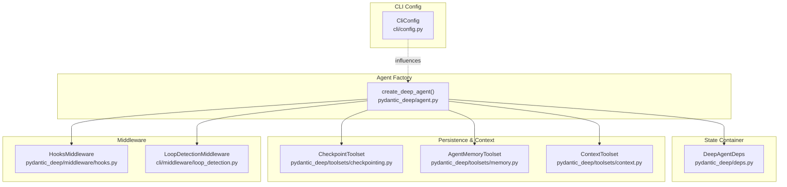
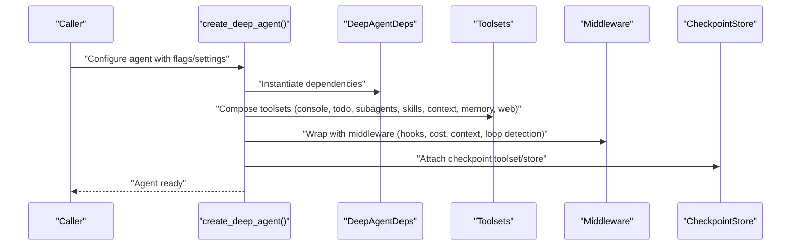
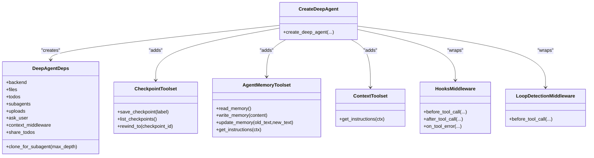
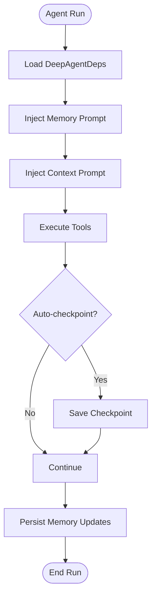
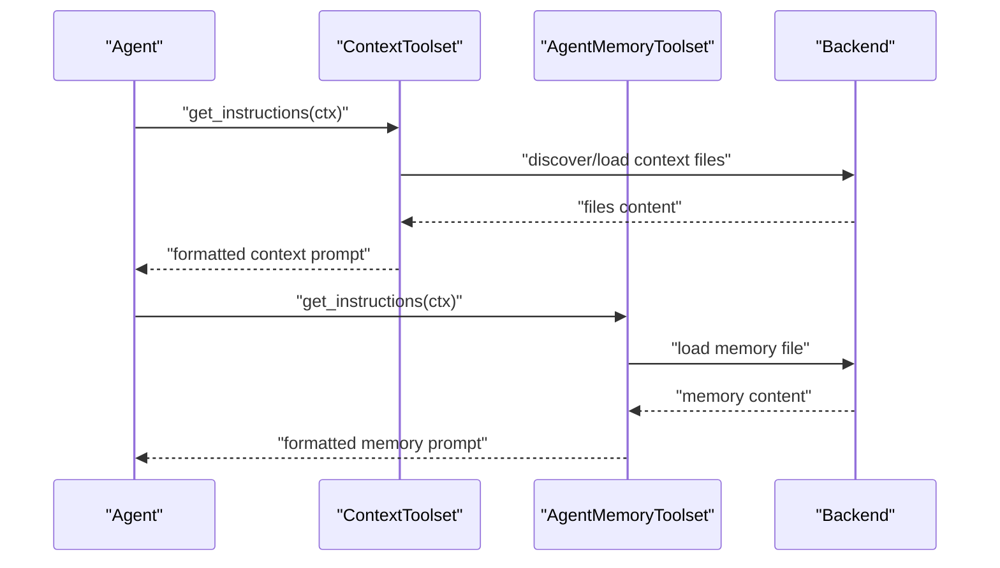
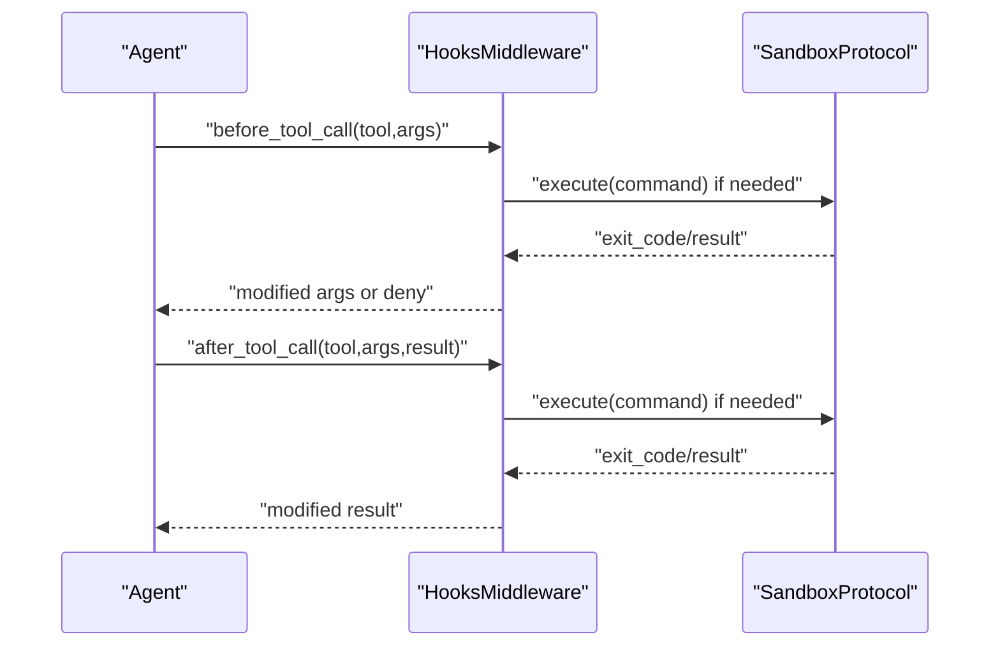
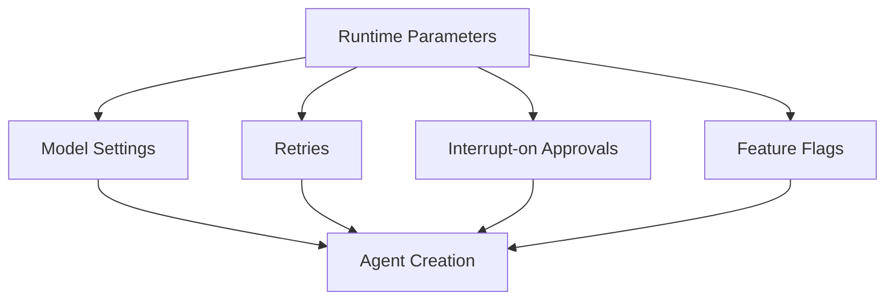
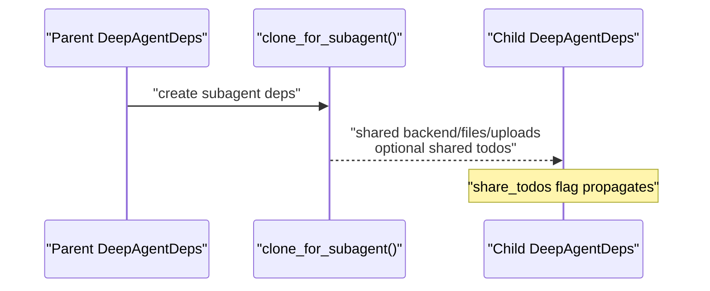
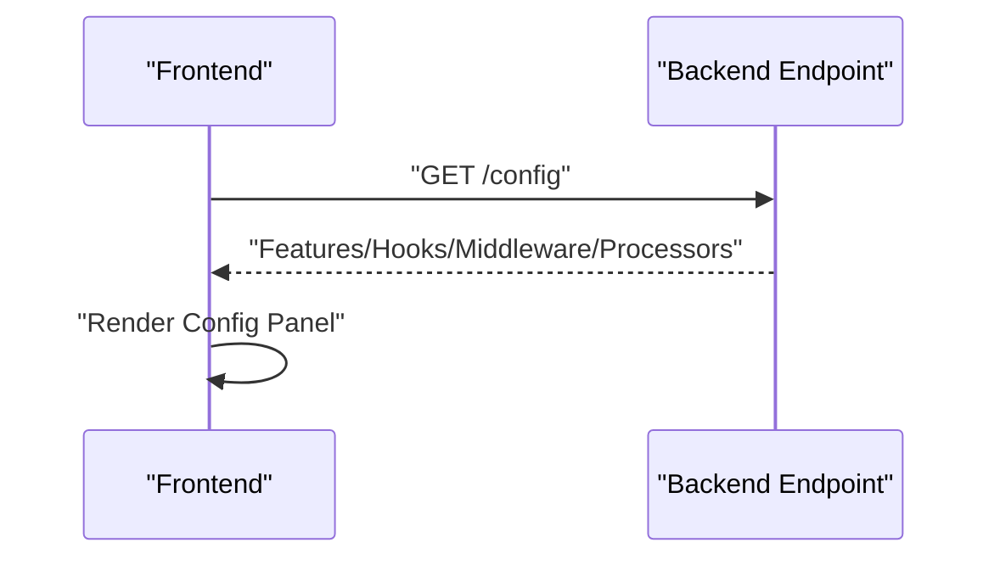
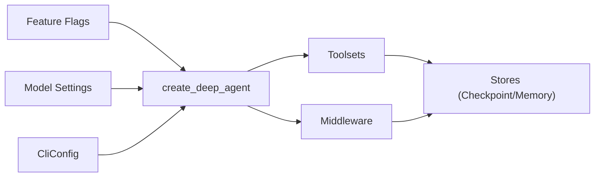

# Configuration and State Management

<cite>
**Referenced Files in This Document**
- [agent.py](file://pydantic_deep/agent.py)
- [deps.py](file://pydantic_deep/deps.py)
- [checkpointing.py](file://pydantic_deep/toolsets/checkpointing.py)
- [memory.py](file://pydantic_deep/toolsets/memory.py)
- [context.py](file://pydantic_deep/toolsets/context.py)
- [hooks.py](file://pydantic_deep/middleware/hooks.py)
- [types.py](file://pydantic_deep/types.py)
- [config.py](file://cli/config.py)
- [loop_detection.py](file://cli/middleware/loop_detection.py)
- [test_checkpointing.py](file://tests/test_checkpointing.py)
- [test_teams.py](file://tests/test_teams.py)
- [test_agent_extended.py](file://tests/test_agent_extended.py)
- [app.py](file://examples/full_app/app.py)
- [app.js](file://examples/full_app/static/app.js)
- [app.js](file://apps/deepresearch/static/app.js)
</cite>

## Table of Contents
1. [Introduction](#introduction)
2. [Project Structure](#project-structure)
3. [Core Components](#core-components)
4. [Architecture Overview](#architecture-overview)
5. [Detailed Component Analysis](#detailed-component-analysis)
6. [Dependency Analysis](#dependency-analysis)
7. [Performance Considerations](#performance-considerations)
8. [Troubleshooting Guide](#troubleshooting-guide)
9. [Conclusion](#conclusion)
10. [Appendices](#appendices)

## Introduction
This document explains configuration and state management in the system, focusing on agent configuration patterns, state persistence, and runtime parameter management. It covers:
- Feature flags and toggles
- Model settings and provider-specific parameters
- Retry policies and middleware configurations
- State management across agent runs, checkpointing integration, and memory persistence
- Dynamic instruction system and context injection
- Runtime state effects on agent behavior
- Examples of configuration inheritance, state sharing between parent and child agents, and persistent state management
- Best practices for configuration management, state migration, and debugging configuration issues

## Project Structure
The configuration and state management system spans several modules:
- Agent factory and configuration: central creation and composition of agent capabilities
- Dependency container: shared state across agent and subagent runs
- Toolsets for persistence and context: checkpointing, memory, and context injection
- Middleware: hooks and loop detection
- CLI configuration: environment-driven configuration precedence
- Tests: validation of checkpointing, state sharing, and retry propagation

**Diagram sources**
- [agent.py:196-800](file://pydantic_deep/agent.py#L196-L800)
- [deps.py:18-207](file://pydantic_deep/deps.py#L18-L207)
- [checkpointing.py:428-565](file://pydantic_deep/toolsets/checkpointing.py#L428-L565)
- [memory.py:130-231](file://pydantic_deep/toolsets/memory.py#L130-L231)
- [context.py:150-208](file://pydantic_deep/toolsets/context.py#L150-L208)
- [hooks.py:243-373](file://pydantic_deep/middleware/hooks.py#L243-L373)
- [loop_detection.py:23-70](file://cli/middleware/loop_detection.py#L23-L70)
- [config.py:70-110](file://cli/config.py#L70-L110)

**Section sources**
- [agent.py:196-800](file://pydantic_deep/agent.py#L196-L800)
- [deps.py:18-207](file://pydantic_deep/deps.py#L18-L207)
- [checkpointing.py:428-565](file://pydantic_deep/toolsets/checkpointing.py#L428-L565)
- [memory.py:130-231](file://pydantic_deep/toolsets/memory.py#L130-L231)
- [context.py:150-208](file://pydantic_deep/toolsets/context.py#L150-L208)
- [hooks.py:243-373](file://pydantic_deep/middleware/hooks.py#L243-L373)
- [loop_detection.py:23-70](file://cli/middleware/loop_detection.py#L23-L70)
- [config.py:70-110](file://cli/config.py#L70-L110)

## Core Components
- Agent factory: builds agents with configurable capabilities (tools, toolsets, subagents, skills, context, memory, checkpointing, hooks, middleware, cost tracking, and model settings).
- Dependency container: holds shared state (backend, files, todos, subagents, uploads, context middleware, and sharing flags).
- Persistence toolsets: checkpointing (save/list/rewind), memory (read/write/update), and context (inject project context).
- Middleware: hooks for pre/post tool lifecycle events and loop detection to prevent repeated tool calls.
- CLI configuration: TOML-based configuration with environment overrides and precedence rules.

Key runtime parameters include:
- Feature flags: include_todo, include_filesystem, include_subagents, include_skills, include_plan, include_checkpoints, include_memory, include_teams, include_web, context_discovery, image_support, patch_tool_calls, cost_tracking, context_manager, include_history_archive.
- Model settings: temperature, max_tokens, provider-specific keys (e.g., anthropic_thinking, openai_reasoning_effort).
- Retry policy: retries applied to toolsets and individual tools.
- Middleware: hooks, loop detection, and cost tracking.

**Section sources**
- [agent.py:196-472](file://pydantic_deep/agent.py#L196-L472)
- [deps.py:18-207](file://pydantic_deep/deps.py#L18-L207)
- [checkpointing.py:428-565](file://pydantic_deep/toolsets/checkpointing.py#L428-L565)
- [memory.py:130-231](file://pydantic_deep/toolsets/memory.py#L130-L231)
- [context.py:150-208](file://pydantic_deep/toolsets/context.py#L150-L208)
- [hooks.py:243-373](file://pydantic_deep/middleware/hooks.py#L243-L373)
- [loop_detection.py:23-70](file://cli/middleware/loop_detection.py#L23-L70)
- [config.py:70-110](file://cli/config.py#L70-L110)

## Architecture Overview
The agent configuration pipeline composes capabilities from feature flags and runtime parameters into a configured agent with:
- Toolsets for planning, filesystem, subagents, skills, context, memory, and optional web/search
- Middleware for hooks, cost tracking, context management, and loop detection
- Persistence via checkpointing and memory toolsets
- Dynamic instruction injection via context and memory toolsets

**Diagram sources**
- [agent.py:196-800](file://pydantic_deep/agent.py#L196-L800)
- [checkpointing.py:428-565](file://pydantic_deep/toolsets/checkpointing.py#L428-L565)
- [hooks.py:243-373](file://pydantic_deep/middleware/hooks.py#L243-L373)
- [loop_detection.py:23-70](file://cli/middleware/loop_detection.py#L23-L70)

## Detailed Component Analysis

### Agent Factory and Configuration Parameters
The agent factory accepts a broad set of parameters controlling capabilities and behavior:
- Feature flags: toggles for including various toolsets and capabilities
- Model settings: provider-specific parameters passed to the underlying model
- Retry policy: global and per-tool retries
- Middleware: hooks, cost tracking, context manager, loop detection
- Persistence: checkpointing and memory toolsets
- Context injection: context files and discovery

Configuration inheritance occurs when subagents reuse parent configuration:
- Subagents inherit console and todo toolsets by default
- Context and memory can be injected per subagent
- Sharing flags propagate to nested subagents

**Diagram sources**
- [agent.py:196-800](file://pydantic_deep/agent.py#L196-L800)
- [deps.py:18-207](file://pydantic_deep/deps.py#L18-L207)
- [checkpointing.py:428-565](file://pydantic_deep/toolsets/checkpointing.py#L428-L565)
- [memory.py:130-231](file://pydantic_deep/toolsets/memory.py#L130-L231)
- [context.py:150-208](file://pydantic_deep/toolsets/context.py#L150-L208)
- [hooks.py:243-373](file://pydantic_deep/middleware/hooks.py#L243-L373)
- [loop_detection.py:23-70](file://cli/middleware/loop_detection.py#L23-L70)

**Section sources**
- [agent.py:196-472](file://pydantic_deep/agent.py#L196-L472)
- [agent.py:506-718](file://pydantic_deep/agent.py#L506-L718)
- [deps.py:174-196](file://pydantic_deep/deps.py#L174-L196)

### State Management and Persistence
- Dependencies container: holds shared state across runs and subagents; supports cloning for subagents with controlled sharing (e.g., todos).
- Memory toolset: persistent memory per agent/subagent with read/write/update tools and system prompt injection.
- Checkpointing toolset: auto-save and manual save/list/rewind with pluggable store backends (in-memory and file-based).

**Diagram sources**
- [deps.py:18-207](file://pydantic_deep/deps.py#L18-L207)
- [memory.py:130-231](file://pydantic_deep/toolsets/memory.py#L130-L231)
- [checkpointing.py:341-421](file://pydantic_deep/toolsets/checkpointing.py#L341-L421)

**Section sources**
- [deps.py:18-207](file://pydantic_deep/deps.py#L18-L207)
- [memory.py:130-231](file://pydantic_deep/toolsets/memory.py#L130-L231)
- [checkpointing.py:341-421](file://pydantic_deep/toolsets/checkpointing.py#L341-L421)

### Dynamic Instruction System and Context Injection
- ContextToolset loads explicit or discovered context files and injects them into the system prompt with truncation and subagent filtering.
- AgentMemoryToolset loads persistent memory and injects a limited number of lines into the system prompt.
- Both integrate via get_instructions() to augment the agent’s dynamic instructions.

**Diagram sources**
- [context.py:181-208](file://pydantic_deep/toolsets/context.py#L181-L208)
- [memory.py:217-231](file://pydantic_deep/toolsets/memory.py#L217-L231)

**Section sources**
- [context.py:150-208](file://pydantic_deep/toolsets/context.py#L150-L208)
- [memory.py:130-231](file://pydantic_deep/toolsets/memory.py#L130-L231)

### Middleware Configurations
- HooksMiddleware: executes shell or Python handlers on tool lifecycle events (pre/post/use/failure), supporting allow/deny and result modification.
- LoopDetectionMiddleware: prevents repeated identical tool calls by tracking recent calls within a window.

**Diagram sources**
- [hooks.py:243-373](file://pydantic_deep/middleware/hooks.py#L243-L373)

**Section sources**
- [hooks.py:243-373](file://pydantic_deep/middleware/hooks.py#L243-L373)
- [loop_detection.py:23-70](file://cli/middleware/loop_detection.py#L23-L70)

### Runtime Parameter Management
- Model settings: temperature, max_tokens, provider-specific keys (e.g., anthropic_thinking, openai_reasoning_effort) passed to the model.
- Retries: global retries applied to toolsets and individual tools; validated in tests.
- Interrupt-on approvals: configure approvals for risky tools (e.g., execute, write_file).

**Diagram sources**
- [agent.py:496-504](file://pydantic_deep/agent.py#L496-L504)
- [agent.py:514-536](file://pydantic_deep/agent.py#L514-L536)
- [agent.py:729-756](file://pydantic_deep/agent.py#L729-L756)

**Section sources**
- [agent.py:496-504](file://pydantic_deep/agent.py#L496-L504)
- [agent.py:514-536](file://pydantic_deep/agent.py#L514-L536)
- [agent.py:729-756](file://pydantic_deep/agent.py#L729-L756)
- [test_agent_extended.py:127-156](file://tests/test_agent_extended.py#L127-L156)

### Configuration Inheritance and State Sharing
- Parent-to-child state sharing: DeepAgentDeps.clone_for_subagent supports shared or isolated todos and propagates share_todos flag.
- Subagent configuration inheritance: per-subagent context and memory toolsets can be injected.

**Diagram sources**
- [deps.py:174-196](file://pydantic_deep/deps.py#L174-L196)
- [agent.py:572-611](file://pydantic_deep/agent.py#L572-L611)

**Section sources**
- [deps.py:174-196](file://pydantic_deep/deps.py#L174-L196)
- [agent.py:572-611](file://pydantic_deep/agent.py#L572-L611)
- [test_teams.py:818-849](file://tests/test_teams.py#L818-L849)

### Frontend Configuration Exposure
- Backend endpoints expose feature configuration to the frontend for rendering panels (features, hooks, middleware, processors).
- Frontend JavaScript renders configuration sections for runtime, hooks, middleware, and processors.

**Diagram sources**
- [app.py:1712-1745](file://examples/full_app/app.py#L1712-L1745)
- [app.js:1717-1745](file://examples/full_app/static/app.js#L1717-L1745)
- [app.js:1920-1983](file://examples/full_app/static/app.js#L1920-L1983)
- [app.js:2638-2677](file://apps/deepresearch/static/app.js#L2638-L2677)
- [app.js:2704-2733](file://apps/deepresearch/static/app.js#L2704-L2733)

**Section sources**
- [app.py:1712-1745](file://examples/full_app/app.py#L1712-L1745)
- [app.js:1717-1745](file://examples/full_app/static/app.js#L1717-L1745)
- [app.js:1920-1983](file://examples/full_app/static/app.js#L1920-L1983)
- [app.js:2638-2677](file://apps/deepresearch/static/app.js#L2638-L2677)
- [app.js:2704-2733](file://apps/deepresearch/static/app.js#L2704-L2733)

## Dependency Analysis
The agent factory composes multiple subsystems with clear boundaries:
- Feature flags drive inclusion/exclusion of toolsets and middleware
- Dependencies are injected into tools and middleware
- Stores (checkpoint and memory) are pluggable backends
- CLI configuration influences defaults and environment overrides

**Diagram sources**
- [agent.py:196-800](file://pydantic_deep/agent.py#L196-L800)
- [config.py:70-110](file://cli/config.py#L70-L110)

**Section sources**
- [agent.py:196-800](file://pydantic_deep/agent.py#L196-L800)
- [config.py:70-110](file://cli/config.py#L70-L110)

## Performance Considerations
- Token budgeting and summarization: context manager middleware tracks usage and triggers summarization to keep within limits.
- Eviction processor: large tool outputs are truncated to manage token usage.
- Checkpoint pruning: maximum checkpoint counts prevent unbounded growth.
- Loop detection: prevents wasted cycles on repeated tool calls.

[No sources needed since this section provides general guidance]

## Troubleshooting Guide
Common issues and resolutions:
- Checkpointing not enabled: ensure include_checkpoints is True and a store is provided or available via deps.
- Rewind failures: verify checkpoint ID exists and handle RewindRequested appropriately in the caller.
- Memory not persisting: confirm memory_dir and agent_name are correct and backend supports writes.
- Hooks not firing: ensure hooks are provided and backend supports sandbox execution for command hooks.
- Loop detection blocking legitimate retries: adjust max_repeats and window_size.

Validation and testing references:
- Checkpoint store operations and list ordering
- Rewind exception handling
- Retry propagation to toolsets and tools
- State sharing behavior for todos

**Section sources**
- [test_checkpointing.py:145-227](file://tests/test_checkpointing.py#L145-L227)
- [test_checkpointing.py:648-684](file://tests/test_checkpointing.py#L648-L684)
- [test_agent_extended.py:127-156](file://tests/test_agent_extended.py#L127-L156)
- [test_teams.py:818-849](file://tests/test_teams.py#L818-L849)

## Conclusion
The configuration and state management system provides a flexible, composable framework for building agents with robust persistence, dynamic instructions, and safe middleware controls. By leveraging feature flags, model settings, retry policies, and middleware, developers can tailor agent behavior to diverse use cases while maintaining reliable state continuity across runs and subagents.

## Appendices

### Best Practices
- Prefer explicit configuration for production-grade agents; avoid relying solely on defaults.
- Use checkpointing for long-running or exploratory tasks; set appropriate max_checkpoints and frequency.
- Share state judiciously; use DeepAgentDeps.clone_for_subagent with share_todos only when necessary.
- Configure model settings thoughtfully; deterministic runs benefit from temperature=0.0.
- Use context and memory toolsets to maintain continuity across sessions.
- Employ hooks for safety gating and post-processing; ensure proper sandbox permissions.

### Configuration Migration Tips
- Backward compatibility: legacy skill and skill directory types are supported internally.
- Environment overrides: use PYDANTIC_DEEP_* variables to override config.toml values.
- Incremental adoption: introduce middleware and persistence gradually to validate behavior.

**Section sources**
- [types.py:45-84](file://pydantic_deep/types.py#L45-L84)
- [config.py:113-130](file://cli/config.py#L113-L130)