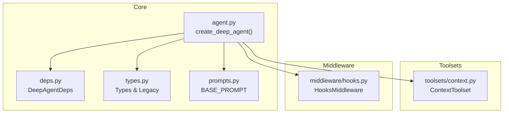
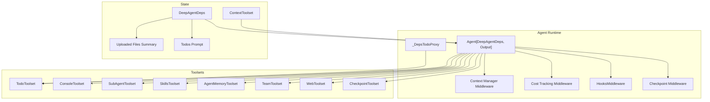
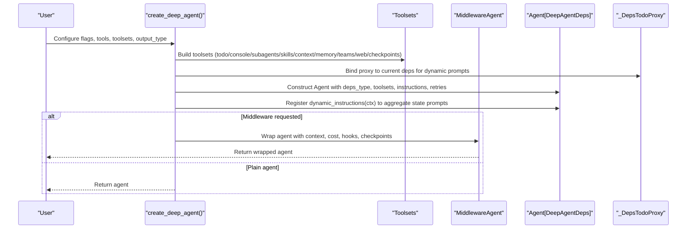
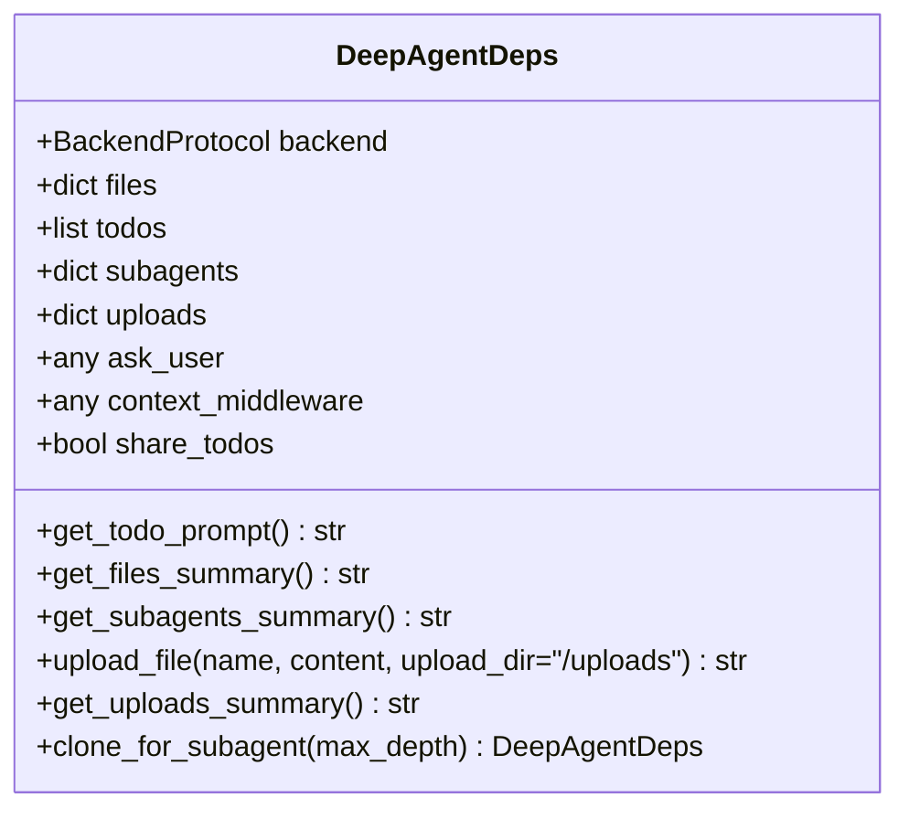
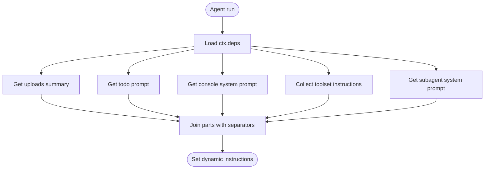
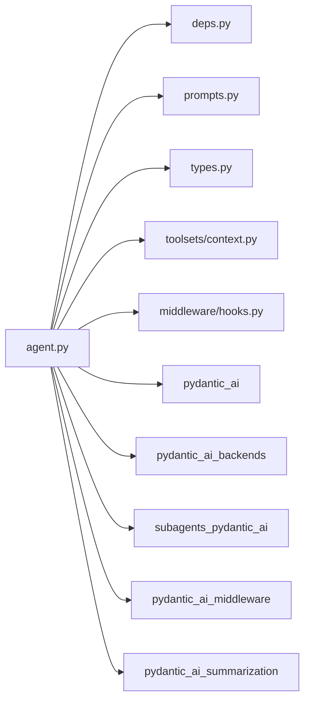

# Core Framework

<cite>
**Referenced Files in This Document**
- [agent.py](file://pydantic_deep/agent.py)
- [deps.py](file://pydantic_deep/deps.py)
- [types.py](file://pydantic_deep/types.py)
- [prompts.py](file://pydantic_deep/prompts.py)
- [context.py](file://pydantic_deep/toolsets/context.py)
- [hooks.py](file://pydantic_deep/middleware/hooks.py)
- [README.md](file://README.md)
- [basic_usage.py](file://examples/basic_usage.py)
- [custom_tools.py](file://examples/custom_tools.py)
</cite>

## Table of Contents
1. [Introduction](#introduction)
2. [Project Structure](#project-structure)
3. [Core Components](#core-components)
4. [Architecture Overview](#architecture-overview)
5. [Detailed Component Analysis](#detailed-component-analysis)
6. [Dependency Analysis](#dependency-analysis)
7. [Performance Considerations](#performance-considerations)
8. [Troubleshooting Guide](#troubleshooting-guide)
9. [Conclusion](#conclusion)
10. [Appendices](#appendices)

## Introduction
This document explains the Core Framework that powers the deep agent architecture. It focuses on the create_deep_agent() factory function, the dependency injection system via DeepAgentDeps, configuration management, agent lifecycle and state orchestration, and the modular feature flags that enable or disable capabilities such as planning, filesystem access, subagents, skills, memory, teams, and web tools. It also covers structured output types, dynamic system prompts, and practical examples for building and extending agents.

## Project Structure
The Core Framework centers around a small set of modules:
- Factory and orchestration: pydantic_deep/agent.py
- Dependency container: pydantic_deep/deps.py
- Types and legacy compatibility: pydantic_deep/types.py
- Default system prompt: pydantic_deep/prompts.py
- Modular toolsets and middleware: pydantic_deep/toolsets/*, pydantic_deep/middleware/*
- Examples demonstrating usage: examples/*

**Diagram sources**
- [agent.py](file://pydantic_deep/agent.py)
- [deps.py](file://pydantic_deep/deps.py)
- [types.py](file://pydantic_deep/types.py)
- [prompts.py](file://pydantic_deep/prompts.py)
- [context.py](file://pydantic_deep/toolsets/context.py)
- [hooks.py](file://pydantic_deep/middleware/hooks.py)

**Section sources**
- [agent.py](file://pydantic_deep/agent.py)
- [deps.py](file://pydantic_deep/deps.py)
- [types.py](file://pydantic_deep/types.py)
- [prompts.py](file://pydantic_deep/prompts.py)
- [context.py](file://pydantic_deep/toolsets/context.py)
- [hooks.py](file://pydantic_deep/middleware/hooks.py)

## Core Components
- create_deep_agent(): The primary factory that composes an Agent with toolsets, middleware, and dynamic system prompts based on configuration flags and runtime state.
- DeepAgentDeps: The dependency injection container holding backend, in-memory files, todos, subagents, uploads, and contextual helpers. It supports cloning for subagents and provides helpers for dynamic prompt construction.
- Types: Re-exports and legacy compatibility for skills, output types, and typed dictionaries.
- Prompts: Default system prompt template for the agent’s core behavior.
- Toolsets and Middleware: Pluggable modules that extend capabilities and enforce policies.

Key responsibilities:
- Orchestrate toolsets and middleware based on feature flags.
- Build dynamic system prompts from state (uploads, todos, context files, subagents).
- Support structured output via output_type and deferred tool requests.
- Provide hooks and middleware integration for policy enforcement and observability.

**Section sources**
- [agent.py](file://pydantic_deep/agent.py)
- [deps.py](file://pydantic_deep/deps.py)
- [types.py](file://pydantic_deep/types.py)
- [prompts.py](file://pydantic_deep/prompts.py)

## Architecture Overview
The Core Framework composes a pydantic-ai Agent with:
- Toolsets: todo, console/filesystem, subagents, skills, context, memory, teams, web, checkpoints.
- Middleware: context manager, cost tracking, hooks, checkpoints.
- Dynamic system prompts: constructed from DeepAgentDeps state and toolset instructions.
- Structured output: optional, with support for deferred tool requests when approvals are required.

**Diagram sources**
- [agent.py](file://pydantic_deep/agent.py)
- [deps.py](file://pydantic_deep/deps.py)
- [context.py](file://pydantic_deep/toolsets/context.py)
- [hooks.py](file://pydantic_deep/middleware/hooks.py)

**Section sources**
- [agent.py](file://pydantic_deep/agent.py)
- [deps.py](file://pydantic_deep/deps.py)
- [context.py](file://pydantic_deep/toolsets/context.py)
- [hooks.py](file://pydantic_deep/middleware/hooks.py)

## Detailed Component Analysis

### create_deep_agent() Factory
- Purpose: Compose a fully configured Agent with modular capabilities controlled by feature flags and configuration parameters.
- Key behaviors:
  - Feature flags: include_todo, include_filesystem, include_subagents, include_skills, include_general_purpose_subagent, include_plan, include_memory, include_teams, include_web, include_checkpoints, include_history_archive, context_manager, cost_tracking, hooks, middleware, instrument.
  - Dynamic system prompts: Builds a dynamic_instructions() that aggregates uploaded files, todos, console/system prompts, toolset instructions, and subagent descriptions.
  - Structured output: When output_type is provided, integrates with DeferredToolRequests if approvals are required.
  - History processors: eviction, patching, and context manager middleware are chained.
  - Middleware wrapping: If middleware, permission_handler, or cost tracking is present, wraps the agent in a MiddlewareAgent.
  - Subagent orchestration: Creates a subagent toolset with optional general-purpose subagent and per-subagent context/memory toolsets.
  - Skills toolset: Supports legacy SkillDirectory and dict-style skills, converting them to the modern Skill dataclass.
  - Context toolset: Loads explicit or discovered context files and truncates content for token efficiency.
  - Web toolset: Optional web search and HTTP tools.
  - Checkpoint toolset: Optional snapshotting and rewinding tools.
  - Output: Returns Agent[DeepAgentDeps, OutputDataT] or Agent[DeepAgentDeps, str].

**Diagram sources**
- [agent.py](file://pydantic_deep/agent.py)

**Section sources**
- [agent.py](file://pydantic_deep/agent.py)

### DeepAgentDeps Dependency Injection Container
- Responsibilities:
  - Holds backend, in-memory files, todos, subagents, uploads, ask_user callback, and context middleware reference.
  - Provides helpers to generate prompt sections for todos, files, and subagents.
  - Supports upload_file() with metadata inference (encoding, line count, MIME type).
  - clone_for_subagent() to isolate or share state among nested subagents.

**Diagram sources**
- [deps.py](file://pydantic_deep/deps.py)

**Section sources**
- [deps.py](file://pydantic_deep/deps.py)

### Dynamic System Prompts and State Integration
- The dynamic_instructions(ctx) function aggregates:
  - Uploaded files summary
  - Todo list prompt (via _DepsTodoProxy)
  - Console/system prompt
  - Toolset instructions (e.g., skills, context, memory)
  - Subagent descriptions (including general-purpose subagent)
- This ensures the agent always has the most relevant context for decision-making.

**Diagram sources**
- [agent.py](file://pydantic_deep/agent.py)

**Section sources**
- [agent.py](file://pydantic_deep/agent.py)

### Structured Output and Deferred Tool Requests
- When output_type is specified, the agent’s output_type is set accordingly.
- If interrupt_on is used (requiring approvals), the output_type is combined with DeferredToolRequests to allow the agent to request approvals before yielding structured results.
- This enables safe, policy-aware structured outputs.

**Section sources**
- [agent.py](file://pydantic_deep/agent.py)

### Context Toolset and Progressive Disclosure
- ContextToolset loads explicit or discovered context files and formats them for inclusion in the system prompt.
- Supports truncation and subagent allowlists to control what each subagent sees.
- Integrates with get_instructions() to contribute to dynamic system prompts.

**Section sources**
- [context.py](file://pydantic_deep/toolsets/context.py)
- [agent.py](file://pydantic_deep/agent.py)

### Hooks Middleware and Policy Enforcement
- HooksMiddleware executes pre/post tool lifecycle hooks, supporting both command and Python handler variants.
- Enforces exit code conventions (allow/deny) and supports background execution.
- Requires a SandboxProtocol backend for command hooks.

**Section sources**
- [hooks.py](file://pydantic_deep/middleware/hooks.py)
- [agent.py](file://pydantic_deep/agent.py)

### Practical Examples
- Basic usage: Demonstrates creating an agent, running a task, and inspecting generated files and uploads.
- Custom tools: Shows adding custom tools that interact with the backend and dependencies.

**Section sources**
- [basic_usage.py](file://examples/basic_usage.py)
- [custom_tools.py](file://examples/custom_tools.py)

## Dependency Analysis
- Internal dependencies:
  - agent.py depends on deps.py for DeepAgentDeps, types.py for type definitions, prompts.py for BASE_PROMPT, and toolsets/middleware modules for composition.
  - context.py is used by agent.py to build dynamic instructions and optionally inject per-subagent context.
  - hooks.py is integrated into middleware composition when hooks are provided.
- External dependencies:
  - pydantic_ai, pydantic_ai_backends, subagents_pydantic_ai, pydantic_ai_middleware, pydantic_ai_summarization.
- Coupling and cohesion:
  - High cohesion within agent.py for orchestration; moderate coupling to external toolsets and middleware.
  - DeepAgentDeps centralizes state, minimizing cross-module coupling.

**Diagram sources**
- [agent.py](file://pydantic_deep/agent.py)
- [deps.py](file://pydantic_deep/deps.py)
- [types.py](file://pydantic_deep/types.py)
- [prompts.py](file://pydantic_deep/prompts.py)
- [context.py](file://pydantic_deep/toolsets/context.py)
- [hooks.py](file://pydantic_deep/middleware/hooks.py)

**Section sources**
- [agent.py](file://pydantic_deep/agent.py)
- [README.md](file://README.md)

## Performance Considerations
- Token management:
  - Context manager middleware compresses context when nearing limits; configure context_manager_max_tokens and summarization_model.
  - Eviction processor can truncate large tool outputs to preserve context.
- Retry strategy:
  - Global retries applied to toolsets and tools to reduce transient failures.
- Streaming and incremental processing:
  - History processors and middleware can reduce context size and improve throughput.
- Cost tracking:
  - Cost tracking middleware provides budget controls and callbacks for cost monitoring.

[No sources needed since this section provides general guidance]

## Troubleshooting Guide
Common issues and remedies:
- Missing SandboxProtocol for hooks or execute tools:
  - Command hooks require a sandbox backend; ensure backend supports execute().
- Permission denials:
  - Use permission_handler or interrupt_on to control approvals; verify tool names match patterns.
- Large tool outputs:
  - Enable eviction_token_limit to truncate outputs and avoid context overflow.
- Structured output not returned:
  - If approvals are required, ensure output_type is combined with DeferredToolRequests via interrupt_on.
- Context not updating:
  - Confirm dynamic_instructions is registered and that context files are discoverable or explicitly provided.

**Section sources**
- [hooks.py](file://pydantic_deep/middleware/hooks.py)
- [agent.py](file://pydantic_deep/agent.py)

## Conclusion
The Core Framework provides a robust, modular foundation for building intelligent agents with planning, filesystem operations, subagents, skills, memory, teams, and web capabilities. Through DeepAgentDeps and create_deep_agent(), developers can compose agents tailored to specific needs while maintaining strong separation of concerns, dynamic context awareness, and extensibility via tools, middleware, and structured outputs.

[No sources needed since this section summarizes without analyzing specific files]

## Appendices

### Feature Flags and Capabilities
- include_todo: Enables todo toolset and dynamic todo prompt.
- include_filesystem: Enables console toolset with optional execute and approval gating.
- include_subagents: Enables subagent toolset with optional general-purpose subagent and nesting depth control.
- include_skills: Enables skills toolset with support for legacy and modern skill formats.
- include_memory: Enables persistent memory toolset for main and per-subagent contexts.
- include_teams: Enables team management toolset.
- include_web: Enables web search and HTTP tools.
- include_checkpoints: Enables checkpoint toolset and middleware.
- include_history_archive: Persists conversation history for post-compression lookup.
- context_manager: Enables token tracking, auto-compression, and persistence.
- cost_tracking: Enables cost tracking middleware with budget control.
- hooks: Enables lifecycle hooks middleware.
- instrument: Enables OpenTelemetry/logfire instrumentation.

**Section sources**
- [agent.py](file://pydantic_deep/agent.py)

### Example References
- Basic usage: [basic_usage.py](file://examples/basic_usage.py)
- Custom tools: [custom_tools.py](file://examples/custom_tools.py)