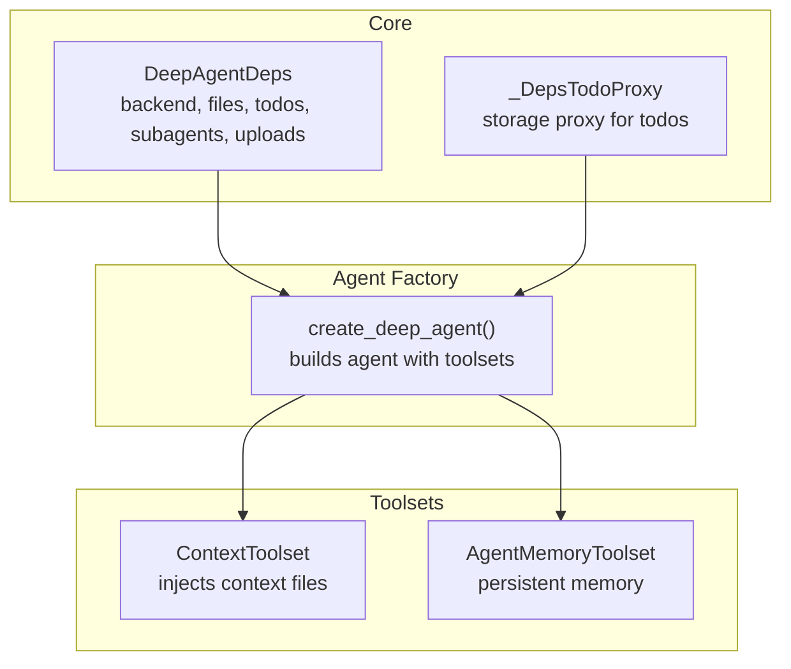
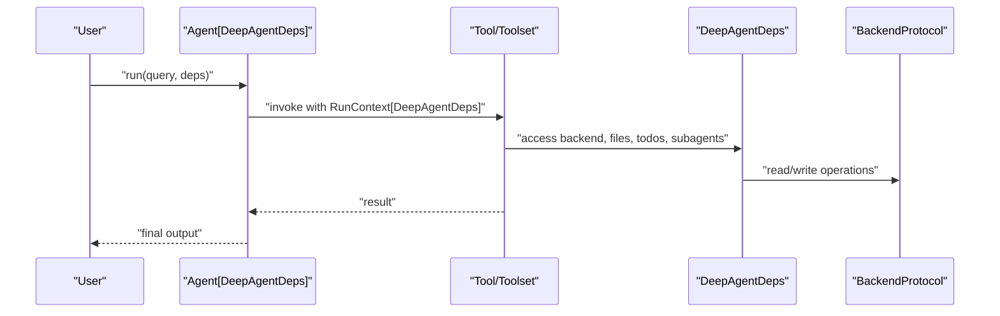
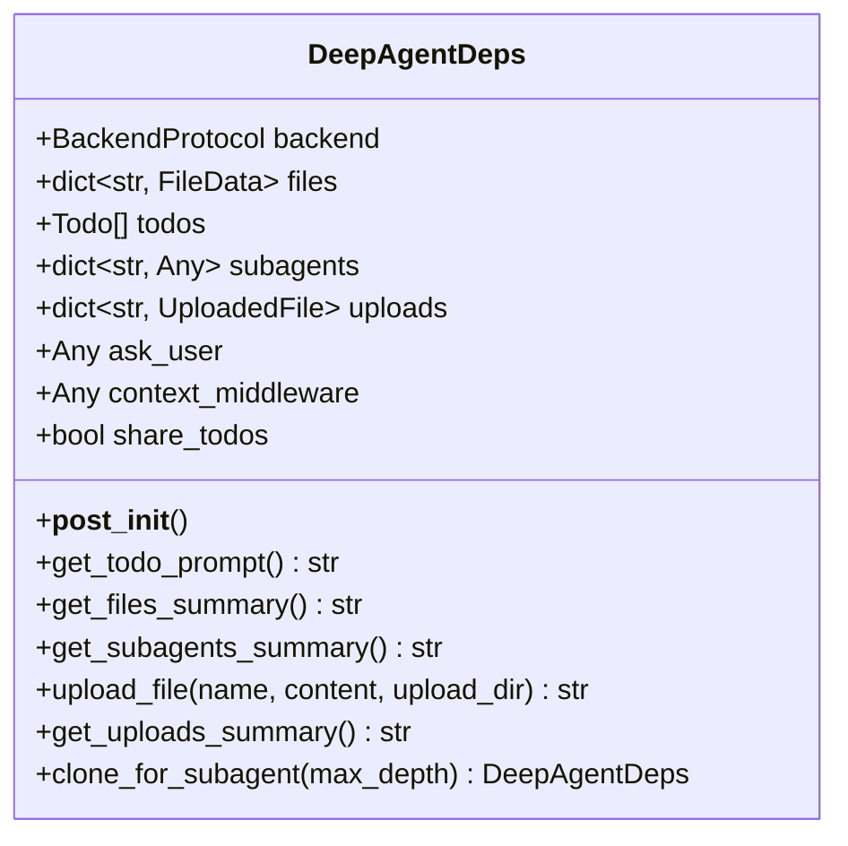
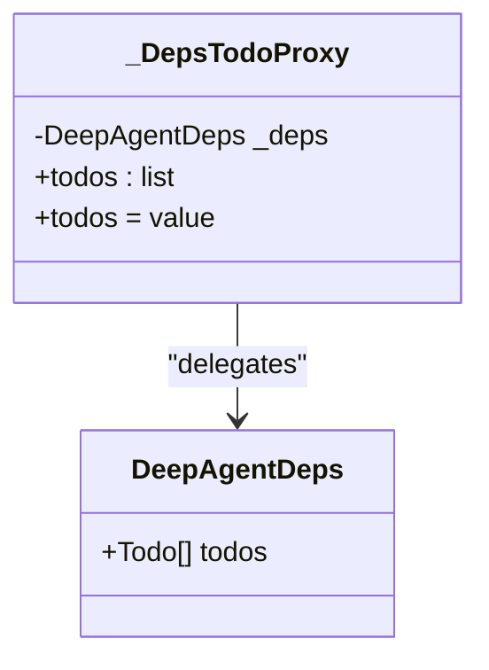
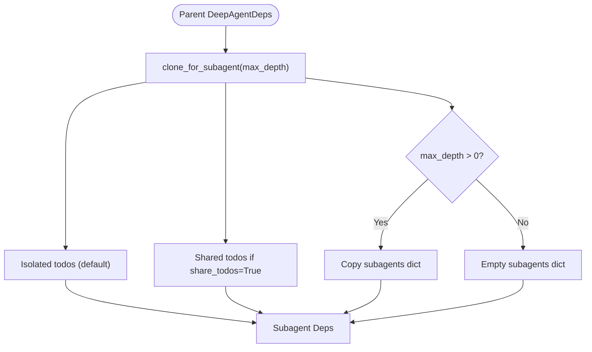
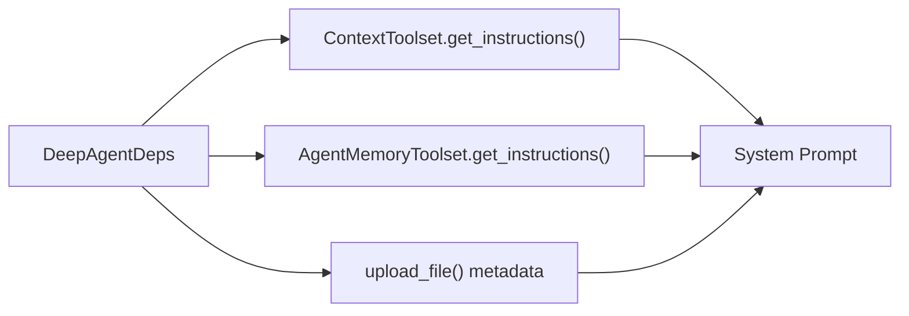
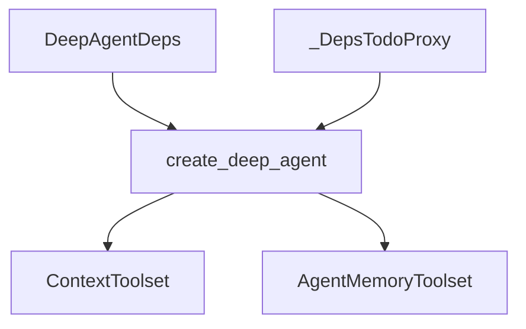

# Dependency Injection System

<cite>
**Referenced Files in This Document**
- [deps.py](file://pydantic_deep/deps.py)
- [agent.py](file://pydantic_deep/agent.py)
- [types.py](file://pydantic_deep/types.py)
- [context.py](file://pydantic_deep/toolsets/context.py)
- [memory.py](file://pydantic_deep/toolsets/memory.py)
- [app.py](file://examples/full_app/app.py)
- [test_agent.py](file://tests/test_agent.py)
- [test_teams.py](file://tests/test_teams.py)
</cite>

## Table of Contents
1. [Introduction](#introduction)
2. [Project Structure](#project-structure)
3. [Core Components](#core-components)
4. [Architecture Overview](#architecture-overview)
5. [Detailed Component Analysis](#detailed-component-analysis)
6. [Dependency Analysis](#dependency-analysis)
7. [Performance Considerations](#performance-considerations)
8. [Troubleshooting Guide](#troubleshooting-guide)
9. [Conclusion](#conclusion)
10. [Appendices](#appendices)

## Introduction
This document explains the Dependency Injection System centered on DeepAgentDeps and its role in coordinating agent capabilities, state persistence, and resource sharing across tools and subagents. It covers how dependencies are injected into tools, the lifecycle of dependency instances, state sharing patterns, and the _DepsTodoProxy mechanism for dynamic todo storage delegation. It also provides guidance on extending the dependency system, creating custom dependency types, and integrating with external systems such as backends, checkpoints, and memory.

## Project Structure
The dependency system is implemented in the core library and integrated throughout the agent factory and toolsets:

- DeepAgentDeps: central dependency container holding backend, files, todos, subagents, uploads, and callbacks.
- _DepsTodoProxy: dynamic proxy delegating todo storage to the current run’s DeepAgentDeps.
- create_deep_agent: constructs agents with toolsets that receive DeepAgentDeps via RunContext.
- Toolsets (context, memory) demonstrate how dependencies are accessed at runtime.

**Diagram sources**
- [deps.py:19-40](file://pydantic_deep/deps.py#L19-L40)
- [agent.py:42-65](file://pydantic_deep/agent.py#L42-L65)
- [agent.py:196-256](file://pydantic_deep/agent.py#L196-L256)
- [context.py:150-208](file://pydantic_deep/toolsets/context.py#L150-L208)
- [memory.py:130-231](file://pydantic_deep/toolsets/memory.py#L130-L231)

**Section sources**
- [deps.py:19-40](file://pydantic_deep/deps.py#L19-L40)
- [agent.py:196-256](file://pydantic_deep/agent.py#L196-L256)

## Core Components
- DeepAgentDeps: Holds shared state and resources:
  - backend: storage backend (StateBackend, Sandbox, CompositeBackend)
  - files: in-memory file cache synchronized with backend
  - todos: task list for planning
  - subagents: preconfigured subagents for delegation
  - uploads: metadata for uploaded files
  - ask_user: callback for interactive questions
  - context_middleware: middleware instance for context management
  - share_todos: flag controlling todo sharing with subagents
- _DepsTodoProxy: Implements TodoStorageProtocol and delegates read/write to the current run’s DeepAgentDeps.
- create_deep_agent: builds toolsets and passes DeepAgentDeps to tools via RunContext.

Key behaviors:
- StateBackend integration: __post_init__ synchronizes files with backend._files.
- Dynamic todo storage: _DepsTodoProxy binds to a specific DeepAgentDeps instance per run.
- Subagent isolation: clone_for_subagent creates isolated dependencies with optional shared todo list.

**Section sources**
- [deps.py:19-40](file://pydantic_deep/deps.py#L19-L40)
- [deps.py:41-49](file://pydantic_deep/deps.py#L41-L49)
- [deps.py:174-196](file://pydantic_deep/deps.py#L174-L196)
- [agent.py:42-65](file://pydantic_deep/agent.py#L42-L65)
- [agent.py:508-512](file://pydantic_deep/agent.py#L508-L512)
- [agent.py:546-558](file://pydantic_deep/agent.py#L546-L558)

## Architecture Overview
The dependency injection architecture ensures that:
- Agents receive a typed RunContext[DeepAgentDeps] in tools.
- Toolsets can access backend, files, todos, subagents, and uploads through ctx.deps.
- Subagents inherit a cloned dependency instance configured for isolation or shared state.

**Diagram sources**
- [agent.py:196-256](file://pydantic_deep/agent.py#L196-L256)
- [context.py:181-207](file://pydantic_deep/toolsets/context.py#L181-L207)
- [memory.py:170-230](file://pydantic_deep/toolsets/memory.py#L170-L230)

## Detailed Component Analysis

### DeepAgentDeps: Dependency Container
DeepAgentDeps encapsulates all state and resources needed by the agent and its tools. It supports:
- Backend integration with StateBackend for shared file caching.
- Todo management helpers (get_todo_prompt, get_files_summary, get_subagents_summary).
- File upload and metadata tracking (upload_file, get_uploads_summary).
- Subagent cloning with isolation or shared todo lists (clone_for_subagent).

**Diagram sources**
- [deps.py:19-40](file://pydantic_deep/deps.py#L19-L40)
- [deps.py:51-88](file://pydantic_deep/deps.py#L51-L88)
- [deps.py:108-172](file://pydantic_deep/deps.py#L108-L172)
- [deps.py:174-196](file://pydantic_deep/deps.py#L174-L196)

**Section sources**
- [deps.py:19-40](file://pydantic_deep/deps.py#L19-L40)
- [deps.py:51-88](file://pydantic_deep/deps.py#L51-L88)
- [deps.py:108-172](file://pydantic_deep/deps.py#L108-L172)
- [deps.py:174-196](file://pydantic_deep/deps.py#L174-L196)

### _DepsTodoProxy: Dynamic Todo Storage Delegation
The proxy enables the todo toolset to operate against the current run’s DeepAgentDeps without hardcoding a dependency instance. It:
- Implements TodoStorageProtocol for create_todo_toolset().
- Delegates todos property reads/writes to the bound DeepAgentDeps.
- Copies setter values to avoid reference sharing surprises.

**Diagram sources**
- [agent.py:42-65](file://pydantic_deep/agent.py#L42-L65)
- [deps.py:34](file://pydantic_deep/deps.py#L34)

**Section sources**
- [agent.py:42-65](file://pydantic_deep/agent.py#L42-L65)
- [test_agent.py:406-452](file://tests/test_agent.py#L406-L452)

### Subagent Dependency Cloning and State Sharing
Subagents receive a cloned DeepAgentDeps instance with controlled isolation:
- Same backend and shared files/uploads
- Isolated todos by default; optionally shared via share_todos
- Optional nested delegation via max_depth

**Diagram sources**
- [deps.py:174-196](file://pydantic_deep/deps.py#L174-L196)
- [agent.py:546-558](file://pydantic_deep/agent.py#L546-L558)

**Section sources**
- [deps.py:174-196](file://pydantic_deep/deps.py#L174-L196)
- [test_teams.py:818-849](file://tests/test_teams.py#L818-L849)

### State Persistence Mechanisms
- Context files: ContextToolset loads and injects project context into system prompts using ctx.deps.backend.
- Agent memory: AgentMemoryToolset persists MEMORY.md per agent/subagent and injects first N lines into system prompts.
- Uploads: DeepAgentDeps tracks uploaded files metadata for system prompt injection.

**Diagram sources**
- [context.py:181-207](file://pydantic_deep/toolsets/context.py#L181-L207)
- [memory.py:217-230](file://pydantic_deep/toolsets/memory.py#L217-L230)
- [deps.py:108-172](file://pydantic_deep/deps.py#L108-L172)

**Section sources**
- [context.py:181-207](file://pydantic_deep/toolsets/context.py#L181-L207)
- [memory.py:217-230](file://pydantic_deep/toolsets/memory.py#L217-L230)
- [deps.py:108-172](file://pydantic_deep/deps.py#L108-L172)

### Resource Coordination Across Agent Components
- Tools receive RunContext[DeepAgentDeps] and can access:
  - ctx.deps.backend for file operations
  - ctx.deps.files for in-memory cache
  - ctx.deps.todos for planning
  - ctx.deps.subagents for delegation
  - ctx.deps.uploads for uploaded file metadata
- Middleware and processors can access ctx.deps for context management and history processing.

**Section sources**
- [agent.py:196-256](file://pydantic_deep/agent.py#L196-L256)
- [context.py:181-207](file://pydantic_deep/toolsets/context.py#L181-L207)
- [memory.py:170-230](file://pydantic_deep/toolsets/memory.py#L170-L230)

### Examples of Custom Dependency Injection and State Management
- Custom tools accessing ctx.deps.backend and ctx.deps.todos.
- Per-session dependency creation with sandbox backend and checkpoint store.
- ContextToolset and AgentMemoryToolset demonstrating runtime backend usage.

**Section sources**
- [agent.py:508-512](file://pydantic_deep/agent.py#L508-L512)
- [agent.py:546-558](file://pydantic_deep/agent.py#L546-L558)
- [app.py:665-692](file://examples/full_app/app.py#L665-L692)
- [context.py:181-207](file://pydantic_deep/toolsets/context.py#L181-L207)
- [memory.py:170-230](file://pydantic_deep/toolsets/memory.py#L170-L230)

## Dependency Analysis
The dependency system exhibits:
- Centralized dependency container (DeepAgentDeps) with clear ownership of state.
- Loose coupling between tools and subagents via RunContext[DeepAgentDeps].
- Controlled sharing via clone_for_subagent and share_todos flag.
- Extensibility through custom toolsets and toolset factories.

**Diagram sources**
- [deps.py:19-40](file://pydantic_deep/deps.py#L19-L40)
- [agent.py:42-65](file://pydantic_deep/agent.py#L42-L65)
- [agent.py:196-256](file://pydantic_deep/agent.py#L196-L256)
- [context.py:150-208](file://pydantic_deep/toolsets/context.py#L150-L208)
- [memory.py:130-231](file://pydantic_deep/toolsets/memory.py#L130-L231)

**Section sources**
- [deps.py:19-40](file://pydantic_deep/deps.py#L19-L40)
- [agent.py:42-65](file://pydantic_deep/agent.py#L42-L65)
- [agent.py:196-256](file://pydantic_deep/agent.py#L196-L256)

## Performance Considerations
- StateBackend synchronization: __post_init__ ensures files are synchronized with backend._files to avoid redundant copies.
- Memory uploads: upload_file infers text metadata and formats human-readable sizes for system prompts.
- Context and memory injection: ContextToolset and AgentMemoryToolset truncate content to manage token budgets.
- Subagent cloning: clone_for_subagent avoids unnecessary copying when max_depth is 0.

[No sources needed since this section provides general guidance]

## Troubleshooting Guide
Common issues and resolutions:
- Todos not persisting across subagents: ensure share_todos is set to True when cloning; verify _DepsTodoProxy._deps is bound before setting todos.
- Missing context or memory in system prompts: confirm backend paths and permissions; verify ContextToolset and AgentMemoryToolset initialization.
- Upload metadata inconsistencies: check upload_file error handling and encoding detection.

**Section sources**
- [test_agent.py:406-452](file://tests/test_agent.py#L406-L452)
- [deps.py:122-123](file://pydantic_deep/deps.py#L122-L123)
- [context.py:181-207](file://pydantic_deep/toolsets/context.py#L181-L207)
- [memory.py:217-230](file://pydantic_deep/toolsets/memory.py#L217-L230)

## Conclusion
The Dependency Injection System centers on DeepAgentDeps as the single source of truth for agent state and resources. Through _DepsTodoProxy, the system enables dynamic delegation of todo storage to the current run’s dependency instance. Subagent cloning provides flexible isolation and sharing controls, while toolsets integrate seamlessly via RunContext[DeepAgentDeps]. This design supports extensibility, robust state persistence, and coordinated resource access across agent components.

[No sources needed since this section summarizes without analyzing specific files]

## Appendices

### Extending the Dependency System
- Add new fields to DeepAgentDeps for additional resources.
- Create toolsets that read from ctx.deps for runtime backend access.
- Use clone_for_subagent to propagate new fields when appropriate.

**Section sources**
- [deps.py:19-40](file://pydantic_deep/deps.py#L19-L40)
- [agent.py:196-256](file://pydantic_deep/agent.py#L196-L256)

### Integrating External Systems
- Backends: Use BackendProtocol-compatible backends (StateBackend, Sandbox, CompositeBackend) with ctx.deps.backend.
- Checkpoints: Initialize checkpoint stores and pass via deps for per-session persistence.
- Context and memory: Utilize ContextToolset and AgentMemoryToolset for system prompt injection.

**Section sources**
- [context.py:150-208](file://pydantic_deep/toolsets/context.py#L150-L208)
- [memory.py:130-231](file://pydantic_deep/toolsets/memory.py#L130-L231)
- [app.py:665-692](file://examples/full_app/app.py#L665-L692)