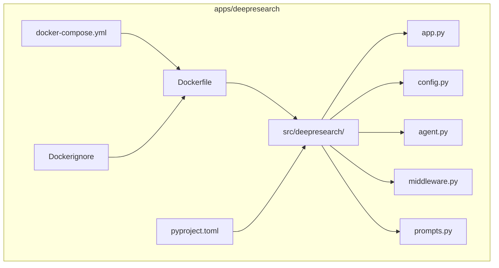
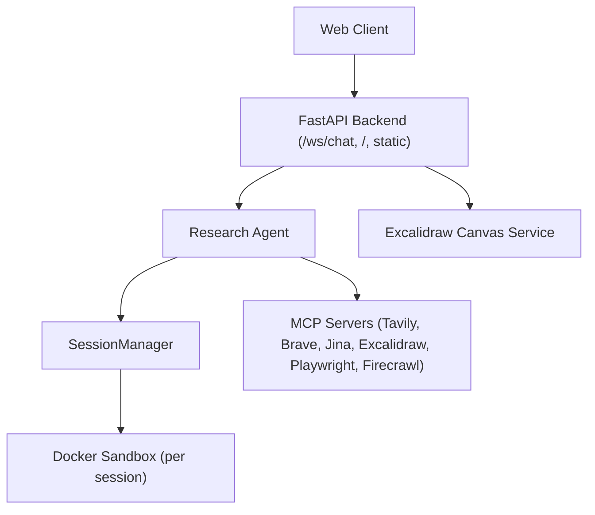
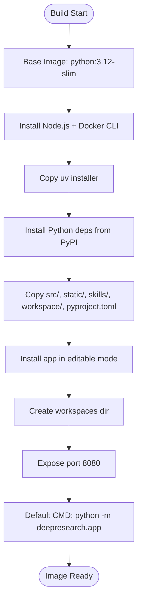
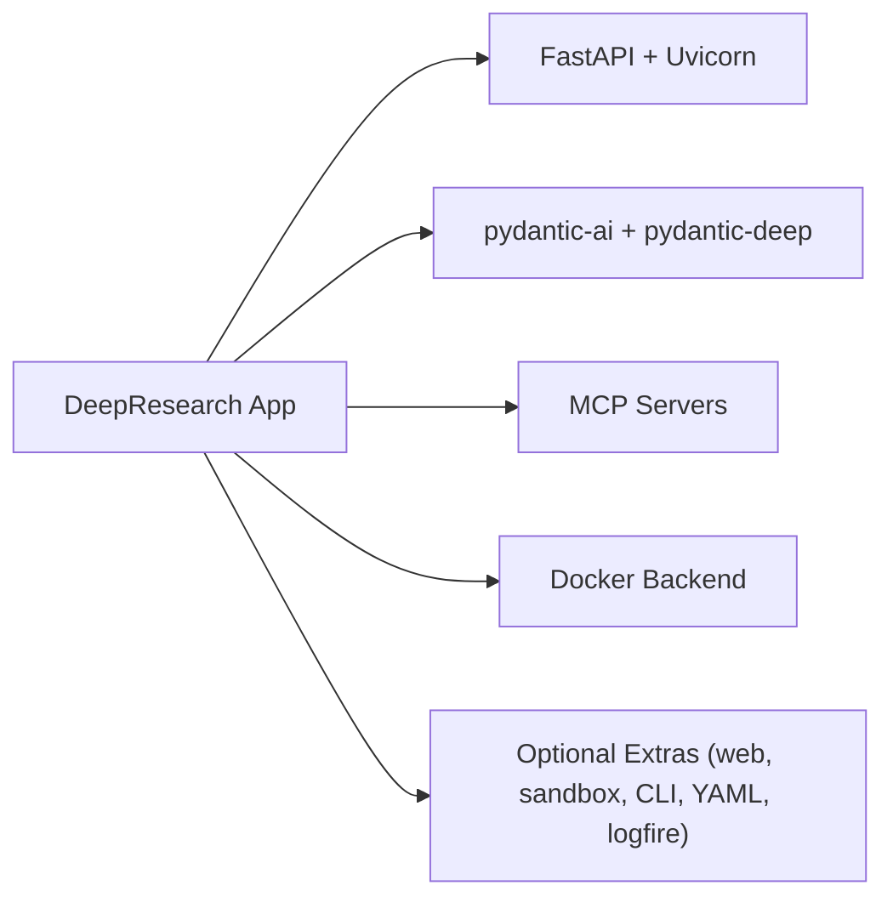

# Container Deployment

<cite>
**Referenced Files in This Document**
- [Dockerfile](file://apps/deepresearch/Dockerfile)
- [docker-compose.yml](file://apps/deepresearch/docker-compose.yml)
- [.dockerignore](file://apps/deepresearch/.dockerignore)
- [pyproject.toml](file://apps/deepresearch/pyproject.toml)
- [pyproject.toml](file://pyproject.toml)
- [app.py](file://apps/deepresearch/src/deepresearch/app.py)
- [config.py](file://apps/deepresearch/src/deepresearch/config.py)
- [agent.py](file://apps/deepresearch/src/deepresearch/agent.py)
- [middleware.py](file://apps/deepresearch/src/deepresearch/middleware.py)
- [prompts.py](file://apps/deepresearch/src/deepresearch/prompts.py)
- [docker-sandbox.md](file://docs/examples/docker-sandbox.md)
- [full-app.md](file://docs/examples/full-app.md)
- [ci.yml](file://.github/workflows/ci.yml)
- [publish.yml](file://.github/workflows/publish.yml)
</cite>

## Table of Contents
1. [Introduction](#introduction)
2. [Project Structure](#project-structure)
3. [Core Components](#core-components)
4. [Architecture Overview](#architecture-overview)
5. [Detailed Component Analysis](#detailed-component-analysis)
6. [Dependency Analysis](#dependency-analysis)
7. [Performance Considerations](#performance-considerations)
8. [Troubleshooting Guide](#troubleshooting-guide)
9. [Conclusion](#conclusion)
10. [Appendices](#appendices)

## Introduction
This document provides comprehensive guidance for container deployment of the research agent application. It covers Docker image building, multi-stage considerations, dependency management, and security practices. It also explains docker-compose configuration for development and staging environments, environment variable management, volume mounting strategies, networking, port configuration, health checks, resource limits, container registry setup, image tagging, and deployment automation. Guidance on container security, privilege management, and sandbox isolation is included for the research agent’s Docker-based capabilities.

## Project Structure
The research agent application resides under apps/deepresearch and includes:
- A Dockerfile for building the application image
- A docker-compose configuration for local development and service composition
- A .dockerignore to optimize build contexts
- pyproject.toml for project metadata and dependencies
- Application entry point and configuration modules

**Diagram sources**
- [Dockerfile](file://apps/deepresearch/Dockerfile)
- [docker-compose.yml](file://apps/deepresearch/docker-compose.yml)
- [.dockerignore](file://apps/deepresearch/.dockerignore)
- [pyproject.toml](file://apps/deepresearch/pyproject.toml)
- [app.py](file://apps/deepresearch/src/deepresearch/app.py)
- [config.py](file://apps/deepresearch/src/deepresearch/config.py)
- [agent.py](file://apps/deepresearch/src/deepresearch/agent.py)
- [middleware.py](file://apps/deepresearch/src/deepresearch/middleware.py)
- [prompts.py](file://apps/deepresearch/src/deepresearch/prompts.py)

**Section sources**
- [Dockerfile](file://apps/deepresearch/Dockerfile)
- [docker-compose.yml](file://apps/deepresearch/docker-compose.yml)
- [.dockerignore](file://apps/deepresearch/.dockerignore)
- [pyproject.toml](file://apps/deepresearch/pyproject.toml)

## Core Components
- Dockerfile defines the base image, system dependencies (Node.js and Docker CLI), uv installer, Python dependencies, application copy, and runtime command.
- docker-compose orchestrates the main application service and an Excalidraw canvas service, with commented examples for local development and Docker-based deployment.
- .dockerignore excludes build artifacts and caches to reduce image size and improve build reproducibility.
- pyproject.toml specifies project metadata, core dependencies, optional extras, and build configuration.
- Application entry point initializes FastAPI, loads environment variables, sets up CORS, static assets, WebSocket endpoints, and session management with Docker sandbox isolation.

**Section sources**
- [Dockerfile](file://apps/deepresearch/Dockerfile)
- [docker-compose.yml](file://apps/deepresearch/docker-compose.yml)
- [.dockerignore](file://apps/deepresearch/.dockerignore)
- [pyproject.toml](file://apps/deepresearch/pyproject.toml)
- [app.py](file://apps/deepresearch/src/deepresearch/app.py)

## Architecture Overview
The application exposes a FastAPI backend with WebSocket streaming and integrates with MCP servers for web search and URL reading. It supports Docker sandbox per user session for safe code execution and file operations. An Excalidraw canvas service provides real-time diagramming capabilities.

**Diagram sources**
- [app.py](file://apps/deepresearch/src/deepresearch/app.py)
- [config.py](file://apps/deepresearch/src/deepresearch/config.py)
- [full-app.md](file://docs/examples/full-app.md)

**Section sources**
- [app.py](file://apps/deepresearch/src/deepresearch/app.py)
- [config.py](file://apps/deepresearch/src/deepresearch/config.py)
- [full-app.md](file://docs/examples/full-app.md)

## Detailed Component Analysis

### Dockerfile Analysis
The Dockerfile establishes a Python 3.12 slim base, installs Node.js and Docker CLI for MCP tooling and sandbox container execution, copies the uv installer, installs Python dependencies from PyPI, copies application sources, installs the application in editable mode, prepares workspaces, exposes port 8080, and sets the default command.

**Diagram sources**
- [Dockerfile](file://apps/deepresearch/Dockerfile)

**Section sources**
- [Dockerfile](file://apps/deepresearch/Dockerfile)

### docker-compose Configuration
The compose file defines:
- An Excalidraw canvas service bound to port 3000
- A commented deepresearch service example showing build context, port mapping, environment file, environment variables, volume mounts (including Docker socket for sandbox containers), and dependency on the canvas service
- A commented volume definition for persistent workspaces

Environment variables commonly used include:
- Model selection and MCP server toggles
- Canvas connectivity URLs
- API keys for MCP servers (Tavily, Brave, Jina, Playwright, Firecrawl)

Volume mounting strategies:
- Mount Docker socket to enable sandbox container creation
- Mount a persistent volume for workspaces to preserve session data across restarts

Networking:
- The deepresearch service exposes port 8080 internally and can be mapped to a host port
- Services communicate via service names in the compose network

Health checks and resource limits:
- Health checks are not configured in the provided compose file
- CPU/memory limits are not configured in the provided compose file

**Section sources**
- [docker-compose.yml](file://apps/deepresearch/docker-compose.yml)

### Environment Variable Management
Environment variables are loaded at application startup and influence:
- Model selection
- MCP server availability and configuration
- Excalidraw canvas URL and synchronization
- Docker availability for sandboxing

Key variables include:
- MODEL_NAME
- EXCALIDRAW_CANVAS_URL
- EXCALIDRAW_SERVER_URL
- EXCALIDRAW_ENABLED
- TAVILY_API_KEY
- BRAVE_API_KEY
- JINA_API_KEY
- PLAYWRIGHT_MCP
- FIRECRAWL_API_KEY

These are read in the configuration module and used to conditionally create MCP servers and configure sandbox behavior.

**Section sources**
- [app.py](file://apps/deepresearch/src/deepresearch/app.py)
- [config.py](file://apps/deepresearch/src/deepresearch/config.py)

### Volume Mounting Strategies
Volumes are essential for:
- Persisting user workspaces across container restarts
- Enabling the application to access the Docker daemon for sandbox containers

Recommended mount points:
- Host path for workspaces directory to persist session data
- Docker socket mounted read-write to allow sandbox container lifecycle management

Security considerations:
- Limit access to the Docker socket to trusted users
- Use least-privilege access where possible

**Section sources**
- [docker-compose.yml](file://apps/deepresearch/docker-compose.yml)

### Container Networking and Port Configuration
- The application listens on port 8080 inside the container
- The compose file shows an example of mapping container port 8080 to a host port
- The Excalidraw canvas service listens on port 3000 inside the container and can be exposed to the host

Network isolation:
- Services share a compose-defined network
- Inter-service communication uses service names and internal ports

**Section sources**
- [Dockerfile](file://apps/deepresearch/Dockerfile)
- [docker-compose.yml](file://apps/deepresearch/docker-compose.yml)

### Health Checks and Monitoring
The provided configuration does not include health checks. It is recommended to add:
- HTTP health endpoints for readiness/liveness probes
- Container resource monitoring (CPU, memory, disk)

**Section sources**
- [docker-compose.yml](file://apps/deepresearch/docker-compose.yml)

### Resource Limits
The provided configuration does not specify CPU or memory limits. It is recommended to add:
- CPU shares and quotas
- Memory limits and reservations
- Swap limits if needed

**Section sources**
- [docker-compose.yml](file://apps/deepresearch/docker-compose.yml)

### Dependency Management
The application uses uv for dependency resolution and installation. The Dockerfile installs dependencies from PyPI and then installs the application in editable mode. The project’s pyproject.toml defines core dependencies and optional extras for web, sandbox, CLI, YAML, and logging.

Key observations:
- uv is copied into the image and used for system-wide installs
- Optional dependencies include web server support and sandbox backend
- The application’s pyproject.toml references local paths for development but relies on published packages in the container image

**Section sources**
- [Dockerfile](file://apps/deepresearch/Dockerfile)
- [pyproject.toml](file://apps/deepresearch/pyproject.toml)
- [pyproject.toml](file://pyproject.toml)

### Security Considerations
Security controls implemented in the application:
- Permission middleware blocks access to sensitive paths
- Safety hooks filter potentially dangerous commands in the execute tool
- Docker sandbox isolates file operations and code execution per user session
- Environment variables are used to gate optional MCP servers

Additional security recommendations:
- Run containers as non-root users
- Use read-only root filesystems where feasible
- Restrict Docker socket access to necessary components
- Scan images for vulnerabilities regularly
- Enforce network policies and minimize exposed ports

**Section sources**
- [middleware.py](file://apps/deepresearch/src/deepresearch/middleware.py)
- [agent.py](file://apps/deepresearch/src/deepresearch/agent.py)
- [docker-sandbox.md](file://docs/examples/docker-sandbox.md)

### Multi-stage Builds
The current Dockerfile is a single-stage build that installs system dependencies, uv, Python packages, and the application. While multi-stage builds are not present, they can be considered for:
- Separating build-time dependencies from runtime
- Reducing final image size by excluding build tools
- Using a builder stage with uv and a minimal runtime stage

[No sources needed since this section provides general guidance]

### Production Deployment Strategies
Production considerations:
- Use a container registry (e.g., GitHub Packages, Docker Hub) for storing images
- Implement image tagging with semantic versions
- Automate builds and deployments via CI/CD pipelines
- Configure secrets management for API keys and credentials
- Enable observability (logs, metrics, traces)
- Apply blue/green or rolling updates for zero-downtime deployments

**Section sources**
- [publish.yml](file://.github/workflows/publish.yml)
- [ci.yml](file://.github/workflows/ci.yml)

### Container Registry Setup and Image Tagging
- The repository includes a publish workflow that builds and publishes packages to PyPI
- For container images, use a registry and tag images with semantic versions (e.g., v0.1.0, latest)
- Store credentials securely and restrict access to registry accounts

**Section sources**
- [publish.yml](file://.github/workflows/publish.yml)

### Deployment Automation
- CI workflows validate code quality, run tests, and build documentation
- The publish workflow automates package publishing to PyPI
- Extend workflows to build and push container images to a registry

**Section sources**
- [ci.yml](file://.github/workflows/ci.yml)
- [publish.yml](file://.github/workflows/publish.yml)

## Dependency Analysis
The application’s runtime depends on:
- FastAPI and Uvicorn for the web server
- pydantic-ai and related packages for agent orchestration and toolsets
- pydantic-deep for research agent features
- Optional extras for web, sandbox, CLI, YAML, and logging
- MCP servers for web search and URL reading
- Docker backend for sandbox isolation

**Diagram sources**
- [pyproject.toml](file://apps/deepresearch/pyproject.toml)
- [pyproject.toml](file://pyproject.toml)

**Section sources**
- [pyproject.toml](file://apps/deepresearch/pyproject.toml)
- [pyproject.toml](file://pyproject.toml)

## Performance Considerations
- Use slim base images and minimize installed packages to reduce image size and attack surface
- Enable caching for uv installations and leverage incremental builds
- Tune container resource limits to prevent resource contention
- Use asynchronous processing and streaming for WebSocket endpoints
- Monitor and scale horizontally as needed

[No sources needed since this section provides general guidance]

## Troubleshooting Guide
Common issues and resolutions:
- Docker socket not accessible: Ensure the Docker socket is mounted and the container has sufficient privileges
- MCP servers failing to start: Verify API keys and network connectivity; the application retries without failing servers
- Port conflicts: Change port mappings in docker-compose to avoid conflicts
- Permission errors: Confirm that sensitive path patterns are blocked by middleware and that the sandbox is properly isolated

**Section sources**
- [config.py](file://apps/deepresearch/src/deepresearch/config.py)
- [middleware.py](file://apps/deepresearch/src/deepresearch/middleware.py)
- [docker-compose.yml](file://apps/deepresearch/docker-compose.yml)

## Conclusion
The research agent application is container-ready with a clear Dockerfile, docker-compose configuration, and environment-driven MCP server setup. By implementing proper volume mounting, security controls, and CI/CD automation, you can deploy a robust, scalable, and secure containerized research agent suitable for development, staging, and production environments.

[No sources needed since this section summarizes without analyzing specific files]

## Appendices

### A. Dockerfile Structure Summary
- Base image: python:3.12-slim
- System dependencies: Node.js and Docker CLI
- uv installer: copied into image
- Python dependencies: installed from PyPI
- Application: copied and installed in editable mode
- Workspaces: created and persisted via volumes
- Ports: 8080 exposed
- Command: python -m deepresearch.app

**Section sources**
- [Dockerfile](file://apps/deepresearch/Dockerfile)

### B. docker-compose Development Example
- Service: deepresearch (commented example)
- Ports: 8080:8080
- Env file: .env
- Environment variables: EXCALIDRAW_SERVER_URL, EXCALIDRAW_CANVAS_URL
- Volumes: Docker socket, workspaces volume
- Depends on: excalidraw-canvas

**Section sources**
- [docker-compose.yml](file://apps/deepresearch/docker-compose.yml)

### C. Environment Variables Reference
- MODEL_NAME: Model selection
- EXCALIDRAW_CANVAS_URL: Canvas URL
- EXCALIDRAW_SERVER_URL: MCP server URL
- EXCALIDRAW_ENABLED: Toggle canvas
- TAVILY_API_KEY, BRAVE_API_KEY, JINA_API_KEY, PLAYWRIGHT_MCP, FIRECRAWL_API_KEY: MCP server credentials

**Section sources**
- [config.py](file://apps/deepresearch/src/deepresearch/config.py)

### D. Security Best Practices Checklist
- Run as non-root user
- Use read-only root filesystem
- Limit Docker socket access
- Scan images for vulnerabilities
- Enforce network policies
- Manage secrets securely
- Regular audits and updates

**Section sources**
- [middleware.py](file://apps/deepresearch/src/deepresearch/middleware.py)
- [docker-sandbox.md](file://docs/examples/docker-sandbox.md)