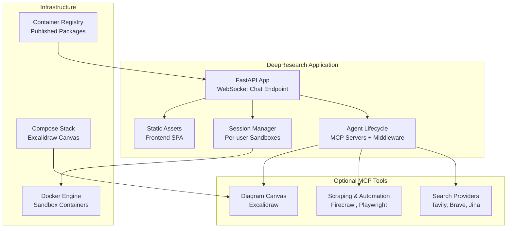
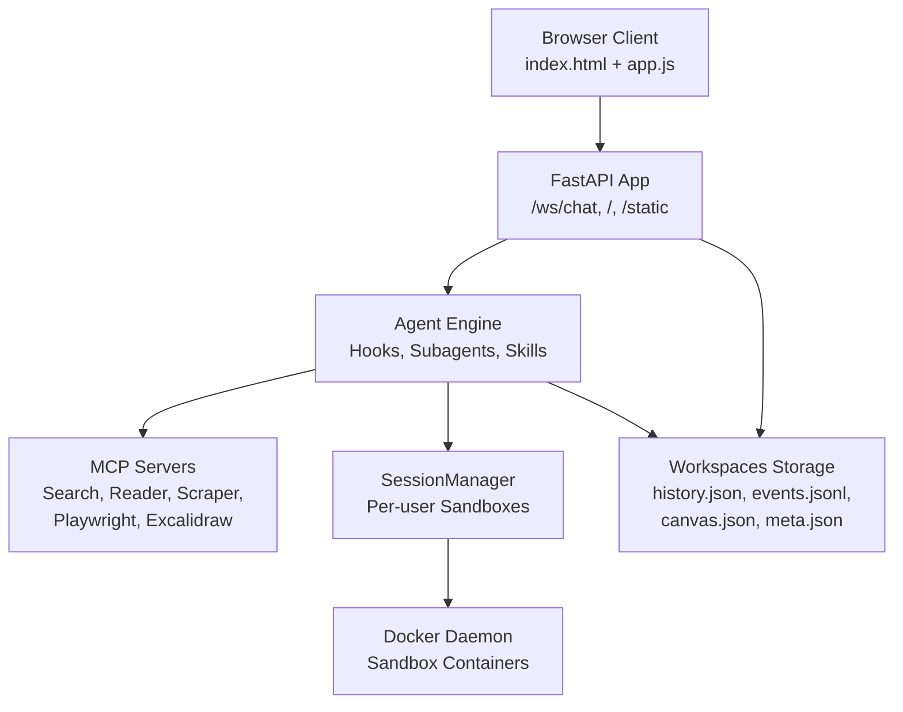
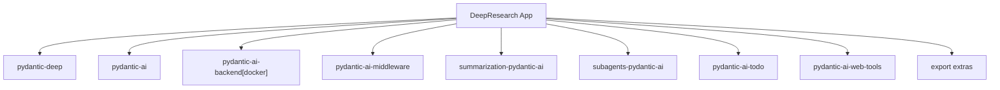

# Deployment and Operations

<cite>
**Referenced Files in This Document**
- [Dockerfile](file://apps/deepresearch/Dockerfile)
- [docker-compose.yml](file://apps/deepresearch/docker-compose.yml)
- [.dockerignore](file://apps/deepresearch/.dockerignore)
- [pyproject.toml](file://apps/deepresearch/pyproject.toml)
- [config.py](file://apps/deepresearch/src/deepresearch/config.py)
- [app.py](file://apps/deepresearch/src/deepresearch/app.py)
- [README.md](file://apps/deepresearch/README.md)
- [pyproject.toml](file://pyproject.toml)
- [Makefile](file://Makefile)
- [ci.yml](file://.github/workflows/ci.yml)
- [publish.yml](file://.github/workflows/publish.yml)
- [docs.yml](file://.github/workflows/docs.yml)
</cite>

## Table of Contents
1. [Introduction](#introduction)
2. [Project Structure](#project-structure)
3. [Core Components](#core-components)
4. [Architecture Overview](#architecture-overview)
5. [Detailed Component Analysis](#detailed-component-analysis)
6. [Dependency Analysis](#dependency-analysis)
7. [Performance Considerations](#performance-considerations)
8. [Troubleshooting Guide](#troubleshooting-guide)
9. [Conclusion](#conclusion)
10. [Appendices](#appendices)

## Introduction
This document provides comprehensive guidance for deploying and operating the DeepResearch application in production. It covers container deployment with Docker, development environment setup, production configuration, scaling considerations, infrastructure requirements, environment configuration, monitoring and logging, performance optimization, security hardening, backup strategies, update procedures, disaster recovery planning, operational metrics, alerting, troubleshooting, capacity planning, resource allocation, and cost optimization for various deployment scenarios.

## Project Structure
The DeepResearch application is organized as a FastAPI-based web service with optional MCP tool integrations, a Docker-based sandbox runtime, and a containerized packaging strategy. The repository includes:
- A FastAPI application with WebSocket streaming and per-user session management
- Optional MCP tool integrations for web search, URL reading, browser automation, and diagramming
- A Docker-based sandbox runtime for safe file operations and code execution
- Container packaging via Dockerfile and docker-compose for local and production deployments
- Development tooling and CI/CD workflows for testing, linting, type checking, and publishing

**Diagram sources**
- [app.py:636-690](file://apps/deepresearch/src/deepresearch/app.py#L636-L690)
- [config.py:58-151](file://apps/deepresearch/src/deepresearch/config.py#L58-L151)
- [docker-compose.yml:1-29](file://apps/deepresearch/docker-compose.yml#L1-L29)
- [Dockerfile:1-48](file://apps/deepresearch/Dockerfile#L1-L48)

**Section sources**
- [README.md:158-207](file://apps/deepresearch/README.md#L158-L207)
- [docker-compose.yml:1-29](file://apps/deepresearch/docker-compose.yml#L1-L29)
- [Dockerfile:1-48](file://apps/deepresearch/Dockerfile#L1-L48)

## Core Components
- FastAPI application with lifecycle management, CORS, static asset mounting, and WebSocket chat streaming
- Agent initialization with MCP servers, middleware, and session manager
- Per-user sandbox runtime via Docker-backed SessionManager
- Optional MCP tool integrations for search, scraping, automation, and diagrams
- Container packaging with Dockerfile and docker-compose

Key operational characteristics:
- Application exposes port 8080 and serves a single-page frontend
- MCP servers are optional and dynamically configured based on environment variables
- Sandbox runtime supports idle timeouts and cleanup loops
- Session persistence for message history and JSONL event logs

**Section sources**
- [app.py:103-121](file://apps/deepresearch/src/deepresearch/app.py#L103-L121)
- [app.py:636-690](file://apps/deepresearch/src/deepresearch/app.py#L636-L690)
- [config.py:58-151](file://apps/deepresearch/src/deepresearch/config.py#L58-L151)
- [app.py:562-601](file://apps/deepresearch/src/deepresearch/app.py#L562-L601)

## Architecture Overview
The system architecture integrates a FastAPI server with an agent engine, optional MCP tool integrations, and a Docker-based sandbox runtime. The diagram below maps the actual components and their relationships.

**Diagram sources**
- [app.py:692-720](file://apps/deepresearch/src/deepresearch/app.py#L692-L720)
- [app.py:636-690](file://apps/deepresearch/src/deepresearch/app.py#L636-L690)
- [config.py:58-151](file://apps/deepresearch/src/deepresearch/config.py#L58-L151)
- [app.py:562-601](file://apps/deepresearch/src/deepresearch/app.py#L562-L601)

## Detailed Component Analysis

### Container Deployment with Docker
- The application is packaged using a multi-stage Dockerfile that installs system dependencies (Node.js, Docker CLI), Python dependencies via uv, copies application sources, and exposes port 8080
- docker-compose defines the Excalidraw canvas service and includes commented instructions for running the DeepResearch service locally
- .dockerignore excludes unnecessary files and directories from the build context

Operational guidance:
- Build and run the containerized application using the provided Dockerfile
- Mount persistent volumes for workspaces to preserve session data across restarts
- Ensure Docker socket access is available for sandbox containers when enabling Excalidraw or requiring Docker-based tooling

**Section sources**
- [Dockerfile:1-48](file://apps/deepresearch/Dockerfile#L1-L48)
- [docker-compose.yml:1-29](file://apps/deepresearch/docker-compose.yml#L1-L29)
- [.dockerignore:1-9](file://apps/deepresearch/.dockerignore#L1-L9)

### Development Environment Setup
- Local development uses uv for dependency synchronization and optional extras for export features
- The Makefile provides targets for formatting, linting, type checking, testing, and documentation building
- The README outlines prerequisites (Python 3.12+, uv, Node.js, Docker) and quick start steps

Recommended setup:
- Install uv and Node.js as prerequisites
- Sync dependencies with uv and optionally enable export extras
- Start the Excalidraw canvas service via docker-compose for diagram support
- Run the application locally using uv

**Section sources**
- [README.md:12-62](file://apps/deepresearch/README.md#L12-L62)
- [Makefile:11-26](file://Makefile#L11-L26)
- [pyproject.toml:1-37](file://apps/deepresearch/pyproject.toml#L1-L37)

### Production Configuration
Environment variables and configuration:
- MODEL_NAME: LLM model selection (default: openai:gpt-4.1)
- Search providers: TAVILY_API_KEY, BRAVE_API_KEY, JINA_API_KEY
- Web scraping: FIRECRAWL_API_KEY
- Browser automation: PLAYWRIGHT_MCP=1
- Excalidraw: EXCALIDRAW_ENABLED, EXCALIDRAW_SERVER_URL, EXCALIDRAW_CANVAS_URL
- At least one search provider is recommended for research capabilities

Application behavior:
- MCP servers are optional and dynamically created based on environment variables
- Excalidraw requires Docker availability; otherwise it is skipped with a warning
- The application initializes agent toolsets and session manager during lifespan

**Section sources**
- [README.md:84-98](file://apps/deepresearch/README.md#L84-L98)
- [config.py:30-151](file://apps/deepresearch/src/deepresearch/config.py#L30-L151)
- [app.py:636-690](file://apps/deepresearch/src/deepresearch/app.py#L636-L690)

### Scaling Considerations
- Horizontal scaling: Run multiple instances behind a load balancer; ensure shared storage for workspaces
- Vertical scaling: Increase CPU/memory resources based on concurrent sessions and agent complexity
- SessionManager idle timeouts and cleanup loops help manage resource usage
- WebSocket connections scale with concurrent users; consider connection limits and keepalive settings

[No sources needed since this section provides general guidance]

### Infrastructure Requirements
- Compute: x86_64 hosts with sufficient CPU and memory for concurrent sessions and agent workloads
- Storage: Persistent volumes for workspaces to maintain session history, events, and artifacts
- Networking: Port 8080 exposed for the web service; optional port 3000 for Excalidraw canvas
- Security: Docker socket access for sandbox containers; restrict network policies and secrets management

[No sources needed since this section provides general guidance]

### Monitoring and Logging
- Logging configuration sets INFO level globally and reduces noise from third-party libraries
- Session events are persisted to JSONL files per session for auditability
- Frontend WebSocket events are logged alongside application logs

Recommendations:
- Centralize logs using a log aggregation solution (e.g., ELK, Loki)
- Add structured logging for operational metrics and error tracking
- Monitor container health, resource utilization, and MCP server availability

**Section sources**
- [app.py:103-121](file://apps/deepresearch/src/deepresearch/app.py#L103-L121)
- [app.py:271-284](file://apps/deepresearch/src/deepresearch/app.py#L271-L284)

### Performance Optimization
- Reduce MCP server startup failures by selectively enabling optional tools
- Persist and restore message history to minimize cold start overhead
- Tune SessionManager idle timeouts and cleanup intervals for workload patterns
- Optimize model selection and concurrency based on latency and throughput goals

**Section sources**
- [app.py:674-685](file://apps/deepresearch/src/deepresearch/app.py#L674-L685)
- [app.py:314-341](file://apps/deepresearch/src/deepresearch/app.py#L314-L341)

### Security Hardening
- Restrict Docker socket access to the application container only
- Manage API keys via secure secret management systems
- Enforce CORS policies appropriate for deployment domain
- Regularly update base images and dependencies to address vulnerabilities

[No sources needed since this section provides general guidance]

### Backup Strategies
- Back up the workspaces volume containing session histories, events, and artifacts
- Maintain periodic snapshots of persistent storage
- Include configuration files and environment variables in backups

[No sources needed since this section provides general guidance]

### Update Procedures
- Use CI/CD pipelines to validate changes across Python versions and generate coverage reports
- Publish packages to PyPI via automated workflows
- Roll out updates with blue-green or rolling deployment strategies to minimize downtime

**Section sources**
- [ci.yml:60-90](file://.github/workflows/ci.yml#L60-L90)
- [publish.yml:1-18](file://.github/workflows/publish.yml#L1-L18)

### Disaster Recovery Planning
- Maintain multiple replicas across availability zones
- Automate backups and test restoration procedures
- Define runbooks for restoring MCP server connectivity and sandbox runtime

[No sources needed since this section provides general guidance]

### Operational Metrics, Logging, Alerting, and Troubleshooting
- Metrics: Track request rates, response latencies, WebSocket connection counts, and MCP server health
- Logging: Centralize application logs and JSONL event streams
- Alerting: Monitor container health, error rates, and resource thresholds
- Troubleshooting: Review startup failure handling for MCP servers and Excalidraw availability

**Section sources**
- [app.py:674-685](file://apps/deepresearch/src/deepresearch/app.py#L674-L685)
- [config.py:43-56](file://apps/deepresearch/src/deepresearch/config.py#L43-L56)

### Capacity Planning, Resource Allocation, and Cost Optimization
- Estimate resource needs based on concurrent sessions, agent complexity, and MCP tool usage
- Right-size containers and orchestration resources; leverage auto-scaling policies
- Optimize costs by consolidating workloads, using reserved instances, and monitoring spend

[No sources needed since this section provides general guidance]

## Dependency Analysis
The application relies on a layered dependency structure:
- Core framework: pydantic-deep and pydantic-ai components
- Optional integrations: MCP toolsets, sandbox backend, web tools, and export extras
- Development and tooling: uv, ruff, pyright, mypy, pytest, mkdocs

**Diagram sources**
- [pyproject.toml:6-18](file://apps/deepresearch/pyproject.toml#L6-L18)
- [pyproject.toml:25-68](file://pyproject.toml#L25-L68)

**Section sources**
- [pyproject.toml:6-18](file://apps/deepresearch/pyproject.toml#L6-L18)
- [pyproject.toml:25-68](file://pyproject.toml#L25-L68)

## Performance Considerations
- Minimize MCP server startup failures by disabling problematic tools and retrying without them
- Persist and restore session state to reduce initialization overhead
- Tune SessionManager idle timeouts and cleanup intervals for workload patterns
- Optimize model selection and concurrency to balance latency and throughput

**Section sources**
- [app.py:674-685](file://apps/deepresearch/src/deepresearch/app.py#L674-L685)
- [app.py:314-341](file://apps/deepresearch/src/deepresearch/app.py#L314-L341)

## Troubleshooting Guide
Common issues and resolutions:
- Docker not available: Excalidraw is disabled with a warning; ensure Docker is running and accessible
- MCP server failures: Startup failures trigger retries without the problematic servers
- WebSocket disconnects: Gracefully handle disconnections and reconnect logic
- Session persistence errors: Verify workspace directory permissions and disk space

**Section sources**
- [config.py:125-127](file://apps/deepresearch/src/deepresearch/config.py#L125-L127)
- [app.py:674-685](file://apps/deepresearch/src/deepresearch/app.py#L674-L685)
- [app.py:734-742](file://apps/deepresearch/src/deepresearch/app.py#L734-L742)

## Conclusion
This guide consolidates production deployment strategies, operational procedures, and maintenance practices for DeepResearch. By leveraging Docker packaging, robust configuration management, scalable infrastructure, and comprehensive monitoring, teams can reliably operate the application in diverse environments while optimizing performance and cost.

## Appendices
- CI/CD pipeline configuration for linting, type checking, testing, and documentation builds
- Publishing workflow for automated PyPI releases
- Development tooling via Makefile targets

**Section sources**
- [ci.yml:14-116](file://.github/workflows/ci.yml#L14-L116)
- [publish.yml:1-18](file://.github/workflows/publish.yml#L1-L18)
- [docs.yml:18-51](file://.github/workflows/docs.yml#L18-L51)
- [Makefile:72-95](file://Makefile#L72-L95)