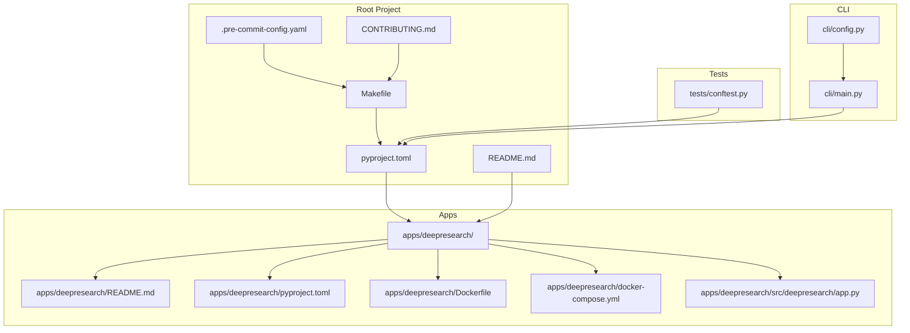
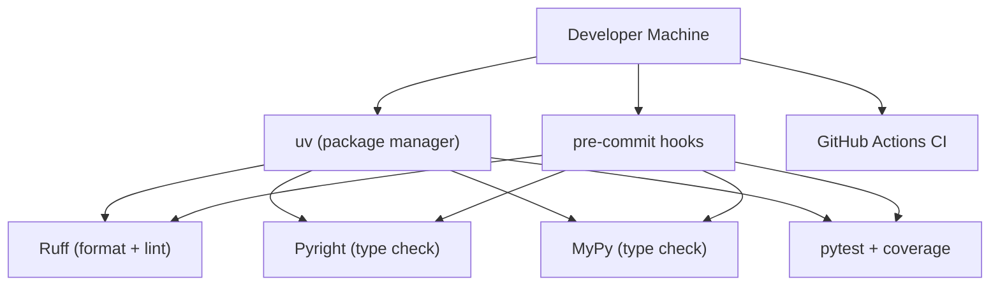
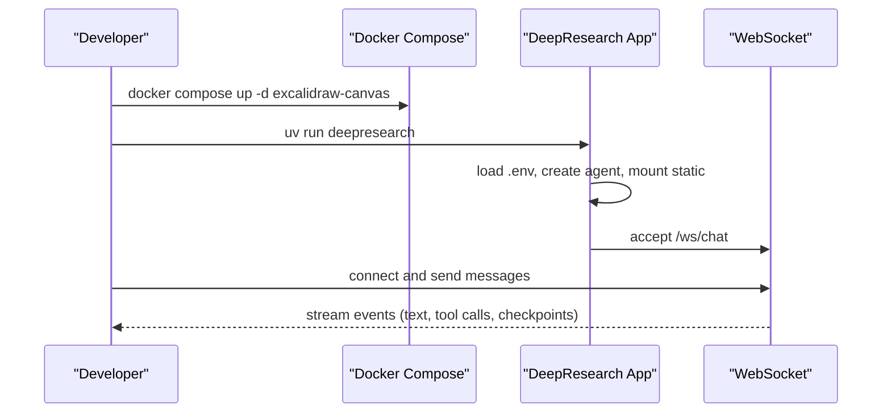
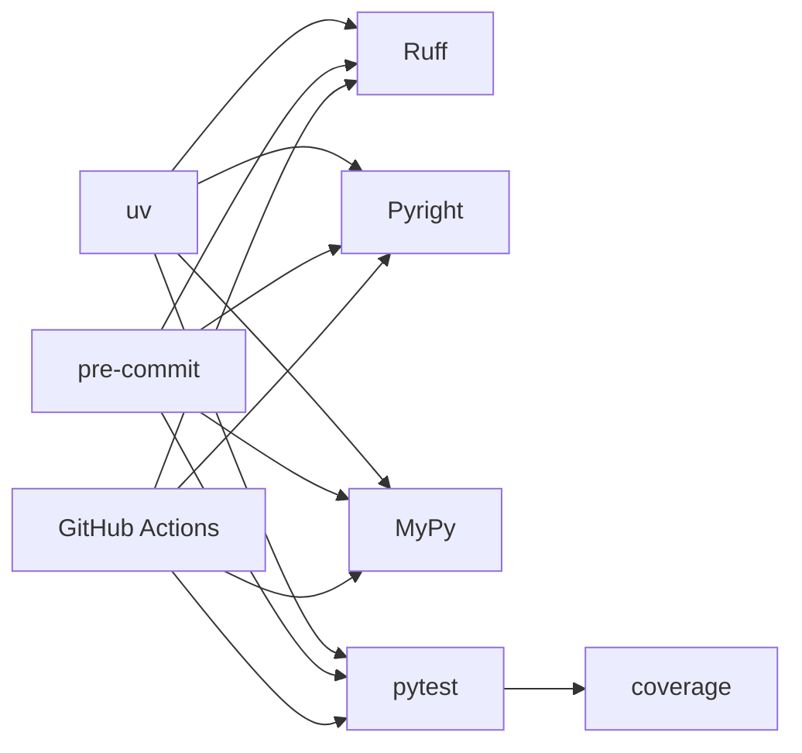

# Development Environment Setup

<cite>
**Referenced Files in This Document**
- [pyproject.toml](file://pyproject.toml)
- [Makefile](file://Makefile)
- [.pre-commit-config.yaml](file://.pre-commit-config.yaml)
- [CONTRIBUTING.md](file://CONTRIBUTING.md)
- [README.md](file://README.md)
- [apps/deepresearch/README.md](file://apps/deepresearch/README.md)
- [apps/deepresearch/pyproject.toml](file://apps/deepresearch/pyproject.toml)
- [apps/deepresearch/Dockerfile](file://apps/deepresearch/Dockerfile)
- [apps/deepresearch/docker-compose.yml](file://apps/deepresearch/docker-compose.yml)
- [apps/deepresearch/src/deepresearch/app.py](file://apps/deepresearch/src/deepresearch/app.py)
- [.github/workflows/ci.yml](file://.github/workflows/ci.yml)
- [tests/conftest.py](file://tests/conftest.py)
- [cli/main.py](file://cli/main.py)
- [cli/config.py](file://cli/config.py)
</cite>

## Table of Contents
1. [Introduction](#introduction)
2. [Project Structure](#project-structure)
3. [Core Components](#core-components)
4. [Architecture Overview](#architecture-overview)
5. [Detailed Component Analysis](#detailed-component-analysis)
6. [Dependency Analysis](#dependency-analysis)
7. [Performance Considerations](#performance-considerations)
8. [Troubleshooting Guide](#troubleshooting-guide)
9. [Conclusion](#conclusion)
10. [Appendices](#appendices)

## Introduction
This guide provides a complete development environment setup for contributors and maintainers. It covers local Python environment configuration with uv, dependency management, development workflow, code quality tools, IDE recommendations, debugging, local testing, development server startup, hot reloading, and contribution practices. It also includes troubleshooting steps for common issues.

## Project Structure
The repository is a multi-package workspace:
- Root project with core framework and CLI under development
- Example applications, including DeepResearch (FastAPI web app with sandboxed execution)
- Tests and documentation assets
- GitHub Actions CI workflows

**Diagram sources**
- [pyproject.toml](file://pyproject.toml)
- [Makefile](file://Makefile)
- [.pre-commit-config.yaml](file://.pre-commit-config.yaml)
- [CONTRIBUTING.md](file://CONTRIBUTING.md)
- [README.md](file://README.md)
- [apps/deepresearch/README.md](file://apps/deepresearch/README.md)
- [apps/deepresearch/pyproject.toml](file://apps/deepresearch/pyproject.toml)
- [apps/deepresearch/Dockerfile](file://apps/deepresearch/Dockerfile)
- [apps/deepresearch/docker-compose.yml](file://apps/deepresearch/docker-compose.yml)
- [apps/deepresearch/src/deepresearch/app.py](file://apps/deepresearch/src/deepresearch/app.py)
- [tests/conftest.py](file://tests/conftest.py)
- [cli/main.py](file://cli/main.py)
- [cli/config.py](file://cli/config.py)

**Section sources**
- [README.md](file://README.md)
- [apps/deepresearch/README.md](file://apps/deepresearch/README.md)

## Core Components
- Python environment and dependency management with uv and pyproject.toml
- Development workflow automation with Makefile recipes
- Pre-commit hooks for formatting, linting, and type checking
- CLI configuration and runtime settings
- DeepResearch development server with FastAPI and sandboxed execution
- Testing infrastructure with pytest and coverage

**Section sources**
- [pyproject.toml](file://pyproject.toml)
- [Makefile](file://Makefile)
- [.pre-commit-config.yaml](file://.pre-commit-config.yaml)
- [CONTRIBUTING.md](file://CONTRIBUTING.md)
- [cli/config.py](file://cli/config.py)

## Architecture Overview
The development environment integrates:
- uv for fast, deterministic dependency resolution and installation
- Ruff for formatting and linting
- Pyright and MyPy for static type checking
- pytest with coverage for unit and integration tests
- Pre-commit to enforce quality gates on commit
- GitHub Actions for CI across multiple Python versions

**Diagram sources**
- [pyproject.toml](file://pyproject.toml)
- [Makefile](file://Makefile)
- [.pre-commit-config.yaml](file://.pre-commit-config.yaml)
- [.github/workflows/ci.yml](file://.github/workflows/ci.yml)

## Detailed Component Analysis

### Python Environment Setup with uv
- Use uv for installing dependencies and synchronizing environments.
- The root pyproject.toml defines the project metadata, dependencies, optional extras, and development groups.
- Makefile targets wrap uv commands for convenience and consistency.

Key steps:
- Install dependencies with development and lint groups: make install
- Sync for all supported Python versions: make install-all-python
- Update lockfile and dependencies: make sync

Environment variables:
- PYTEST_PYTHON to select a specific interpreter for tests
- PYRIGHT_PYTHON to select a specific interpreter for Pyright

**Section sources**
- [pyproject.toml](file://pyproject.toml)
- [Makefile](file://Makefile)

### Dependency Management
- Core dependencies and optional extras are declared in pyproject.toml.
- Optional groups:
  - dev: testing, coverage, build, twine, pre-commit
  - lint: ruff, pyright, mypy
  - docs: mkdocs and related plugins
- DeepResearch app uses editable installs from sibling packages via [tool.uv.sources].

Recommendations:
- Prefer uv sync for reproducible environments
- Use extras selectively (e.g., web for FastAPI, sandbox for Docker)

**Section sources**
- [pyproject.toml](file://pyproject.toml)
- [apps/deepresearch/pyproject.toml](file://apps/deepresearch/pyproject.toml)

### Development Workflow with Makefile
Common recipes:
- install: uv sync with dev and lint groups, install pre-commit hooks
- sync: update dependencies and lockfile
- format: ruff format and fix
- lint: ruff format check and lint
- typecheck: pyright (and optionally mypy)
- test: run pytest with coverage, optionally pinned to a Python version
- test-all-python: run tests across 3.10–3.13
- testcov: run tests and generate HTML coverage report
- docs and docs-serve: build and serve MkDocs site
- all: run format + lint + typecheck + testcov

**Section sources**
- [Makefile](file://Makefile)
- [CONTRIBUTING.md](file://CONtributing.md)

### Pre-commit Hooks and Code Quality
- Pre-commit configuration runs:
  - Formatting and linting via Makefile targets
  - Type checking via Makefile targets
  - Text fixes and spell checking
- Hooks are installed automatically during make install.

Quality tools:
- Ruff: formatting and linting
- Pyright and MyPy: static type checking
- Coverage thresholds enforced in CI

**Section sources**
- [.pre-commit-config.yaml](file://.pre-commit-config.yaml)
- [pyproject.toml](file://pyproject.toml)
- [.github/workflows/ci.yml](file://.github/workflows/ci.yml)

### IDE Configuration Recommendations
- Use a Python extension that supports:
  - Virtual environment selection
  - Linting and formatting integration
  - Type checking output
- Configure the editor to use uv-managed interpreters for accurate type checking and linting.
- Enable automatic formatting on save via Ruff integration.

[No sources needed since this section provides general guidance]

### Debugging Setup
- CLI configuration:
  - Config file location: .pydantic-deep/config.toml in the working directory
  - Environment variable overrides for model, working directory, theme, charset
- CLI runtime:
  - Rich console output, sessions stored under .pydantic-deep/sessions/
  - Provider readiness checks and model validation

**Section sources**
- [cli/config.py](file://cli/config.py)
- [cli/main.py](file://cli/main.py)

### Local Testing Procedures
- Run tests with coverage: make test
- Run tests across all Python versions: make test-all-python
- Generate HTML coverage report: make testcov
- Pytest configuration:
  - Async mode auto
  - Tests collected from tests/
  - Coverage configured to include pydantic_deep and fail under threshold

**Section sources**
- [pyproject.toml](file://pyproject.toml)
- [Makefile](file://Makefile)
- [tests/conftest.py](file://tests/conftest.py)

### Development Server Startup and Hot Reloading
- DeepResearch development server:
  - Start Excalidraw canvas service via docker compose
  - Run the app with uv run deepresearch
  - Access http://localhost:8080
- The FastAPI app initializes agent lifecycles, middleware, and session management.

**Diagram sources**
- [apps/deepresearch/README.md](file://apps/deepresearch/README.md)
- [apps/deepresearch/docker-compose.yml](file://apps/deepresearch/docker-compose.yml)
- [apps/deepresearch/src/deepresearch/app.py](file://apps/deepresearch/src/deepresearch/app.py)

**Section sources**
- [apps/deepresearch/README.md](file://apps/deepresearch/README.md)
- [apps/deepresearch/docker-compose.yml](file://apps/deepresearch/docker-compose.yml)
- [apps/deepresearch/src/deepresearch/app.py](file://apps/deepresearch/src/deepresearch/app.py)

### Development Database Configuration
- The DeepResearch app uses per-session workspaces persisted on disk under workspaces/.
- There is no separate database service in the development stack; persistence is file-based.
- For sandboxed code execution, Docker is required.

**Section sources**
- [apps/deepresearch/src/deepresearch/app.py](file://apps/deepresearch/src/deepresearch/app.py)
- [apps/deepresearch/README.md](file://apps/deepresearch/README.md)

### Contribution Workflow, Branching, and Pull Requests
- Fork the repository and create your branch from main
- Ensure all checks pass: make all (format + lint + typecheck + test)
- Submit a PR with a clear description

Requirements enforced by CI:
- 100% test coverage
- Pass Pyright and MyPy
- Pass Ruff formatting and linting

**Section sources**
- [CONTRIBUTING.md](file://CONTRIBUTING.md)
- [.github/workflows/ci.yml](file://.github/workflows/ci.yml)

## Dependency Analysis
The development environment relies on:
- uv for deterministic dependency resolution
- Ruff for formatting and linting
- Pyright and MyPy for static type checking
- pytest and coverage for testing
- Pre-commit to run checks before committing
- GitHub Actions for CI across multiple Python versions

**Diagram sources**
- [pyproject.toml](file://pyproject.toml)
- [Makefile](file://Makefile)
- [.pre-commit-config.yaml](file://.pre-commit-config.yaml)
- [.github/workflows/ci.yml](file://.github/workflows/ci.yml)

**Section sources**
- [pyproject.toml](file://pyproject.toml)
- [Makefile](file://Makefile)
- [.pre-commit-config.yaml](file://.pre-commit-config.yaml)
- [.github/workflows/ci.yml](file://.github/workflows/ci.yml)

## Performance Considerations
- Use uv sync with frozen lockfiles for fast, reproducible installs
- Run type checks in parallel where possible (e.g., Pyright and MyPy)
- Limit coverage collection to relevant packages to reduce overhead
- Use docker compose for optional services (e.g., Excalidraw canvas) only when needed

[No sources needed since this section provides general guidance]

## Troubleshooting Guide
Common issues and resolutions:
- uv not installed: make install will echo installation instructions; install uv and rerun
- Pre-commit not installed: make install will echo installation instructions; install pre-commit and rerun
- Python version mismatch: use PYTEST_PYTHON or PYRIGHT_PYTHON to target a specific interpreter
- Docker socket access: DeepResearch requires Docker for sandboxed execution; ensure Docker is running
- Coverage failures: ensure 100% coverage and no excluded lines are counted as covered
- MCP server startup failures: the app retries without problematic servers; check logs for server-specific errors

**Section sources**
- [Makefile](file://Makefile)
- [apps/deepresearch/README.md](file://apps/deepresearch/README.md)
- [apps/deepresearch/src/deepresearch/app.py](file://apps/deepresearch/src/deepresearch/app.py)
- [pyproject.toml](file://pyproject.toml)

## Conclusion
This development environment leverages uv for fast dependency management, Makefile for consistent workflows, and pre-commit for automated quality checks. The DeepResearch app demonstrates a complete development server with sandboxed execution and optional services. Adhering to the contribution workflow and CI requirements ensures high-quality, maintainable code.

[No sources needed since this section summarizes without analyzing specific files]

## Appendices

### Appendix A: Quick Commands Reference
- Install dependencies: make install
- Run all checks: make all
- Lint: make lint
- Typecheck: make typecheck
- Tests with coverage: make testcov
- Serve docs: make docs-serve

**Section sources**
- [CONTRIBUTING.md](file://CONTRIBUTING.md)
- [Makefile](file://Makefile)