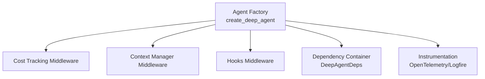
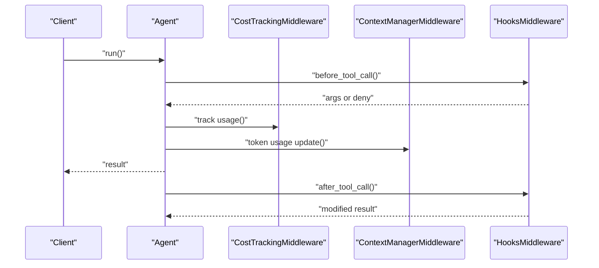
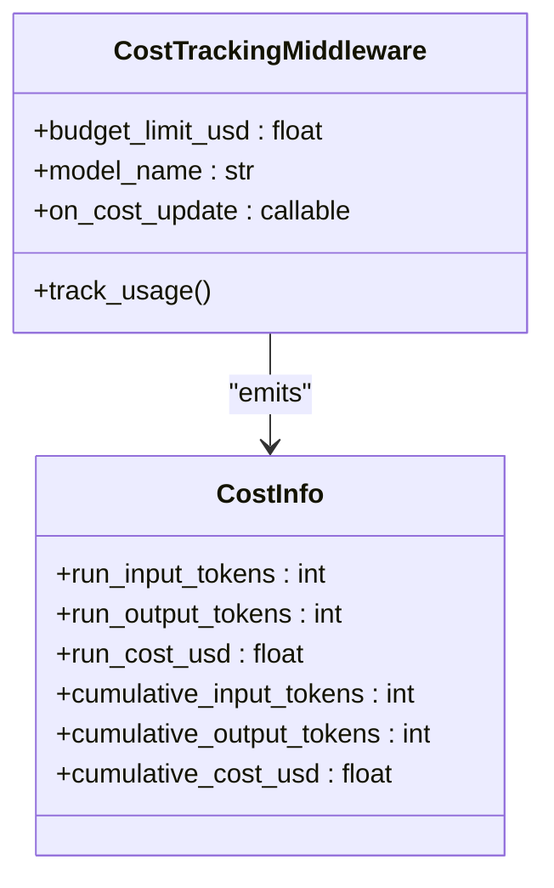
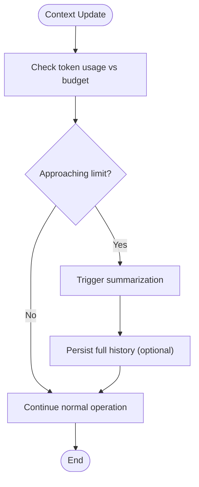
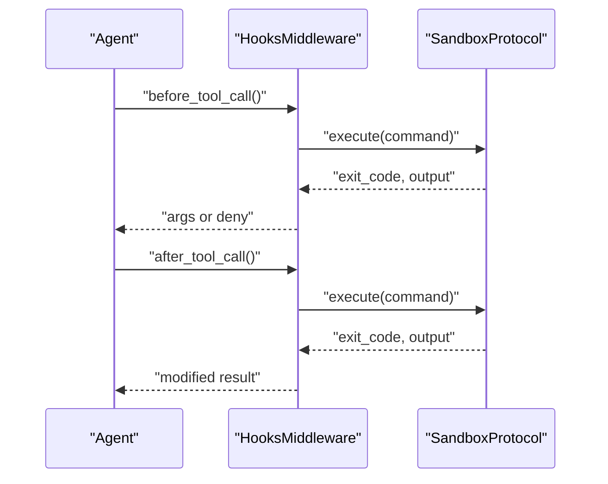
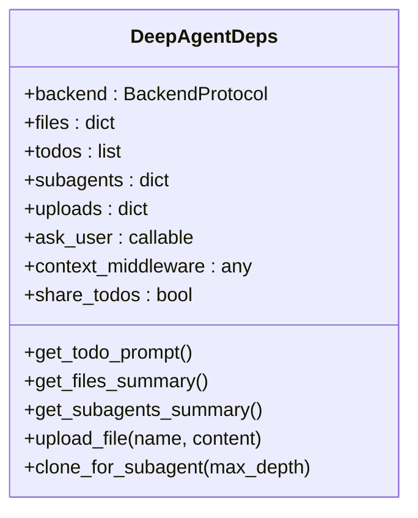
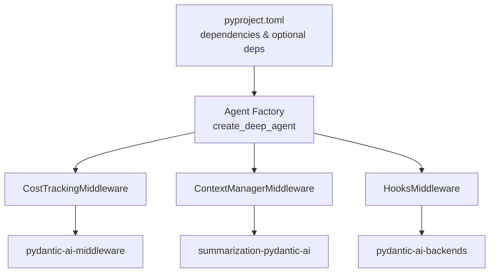
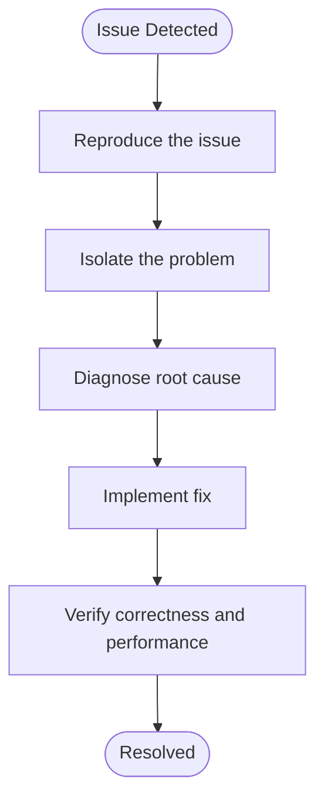

# Monitoring and Maintenance

<cite>
**Referenced Files in This Document**
- [cost-tracking.md](file://docs/advanced/cost-tracking.md)
- [test_cost_tracking.py](file://tests/test_cost_tracking.py)
- [agent.py](file://pydantic_deep/agent.py)
- [hooks.py](file://pydantic_deep/middleware/hooks.py)
- [deps.py](file://pydantic_deep/deps.py)
- [pyproject.toml](file://pyproject.toml)
- [pyproject.toml](file://apps/deepresearch/pyproject.toml)
- [SKILL.md](file://pydantic_deep/bundled_skills/systematic-debugging/1)
- [SKILL.md](file://cli/skills/systematic-debugging/1)
- [SKILL.md](file://pydantic_deep/bundled_skills/performant-code/1)
- [SKILL.md](file://pydantic_deep/bundled_skills/verification-strategy/1)
- [SKILL.md](file://cli/skills/verification-strategy/1)
</cite>

## Table of Contents
1. [Introduction](#introduction)
2. [Project Structure](#project-structure)
3. [Core Components](#core-components)
4. [Architecture Overview](#architecture-overview)
5. [Detailed Component Analysis](#detailed-component-analysis)
6. [Dependency Analysis](#dependency-analysis)
7. [Performance Considerations](#performance-considerations)
8. [Troubleshooting Guide](#troubleshooting-guide)
9. [Conclusion](#conclusion)
10. [Appendices](#appendices)

## Introduction
This document provides comprehensive guidance for monitoring and maintenance of the system, focusing on operational observability, performance tracking, and system maintenance procedures. It covers logging configuration, metrics collection, dashboard setup for system health monitoring, cost tracking implementation, resource usage monitoring, performance benchmarking, maintenance procedures for log rotation, database cleanup, and cache management, incident response procedures, troubleshooting workflows, system diagnostics, automated maintenance tasks, backup verification, system updates, capacity planning, resource optimization, and cost management strategies.

## Project Structure
The monitoring and maintenance capabilities are integrated into the agent factory and middleware subsystems. Key areas include:
- Cost tracking middleware for token usage and cost monitoring
- Context manager middleware for token tracking and auto-compression
- Hooks middleware for lifecycle event monitoring and enforcement
- Dependency injection container for shared state and resources
- Optional instrumentation for OpenTelemetry/Logfire

**Diagram sources**
- [agent.py:797-800](file://pydantic_deep/agent.py#L797-L800)
- [hooks.py:243-373](file://pydantic_deep/middleware/hooks.py#L243-L373)
- [deps.py:18-40](file://pydantic_deep/deps.py#L18-L40)

**Section sources**
- [agent.py:196-472](file://pydantic_deep/agent.py#L196-L472)
- [pyproject.toml:25-34](file://pyproject.toml#L25-L34)

## Core Components
- Cost tracking middleware: Tracks token usage and USD costs automatically, supports budget limits, and exposes callbacks for real-time monitoring.
- Context manager middleware: Provides token tracking and auto-compression to manage conversation length and reduce costs.
- Hooks middleware: Executes shell commands or Python handlers on tool lifecycle events (pre/post tool use, failure), enabling policy enforcement and auditing.
- Dependency container: Holds backend, files, todos, subagents, and uploads, supporting shared state across agent and subagent execution.
- Instrumentation: Optional OpenTelemetry/Logfire integration for emitting spans for LLM calls, tool invocations, and token usage.

**Section sources**
- [cost-tracking.md:1-85](file://docs/advanced/cost-tracking.md#L1-L85)
- [test_cost_tracking.py:29-152](file://tests/test_cost_tracking.py#L29-L152)
- [agent.py:364-375](file://pydantic_deep/agent.py#L364-L375)
- [hooks.py:243-373](file://pydantic_deep/middleware/hooks.py#L243-L373)
- [deps.py:18-40](file://pydantic_deep/deps.py#L18-L40)

## Architecture Overview
The monitoring and maintenance architecture integrates middleware layers around the agent to provide observability and control. The agent factory conditionally wraps the agent with middleware depending on configuration flags.

**Diagram sources**
- [agent.py:797-800](file://pydantic_deep/agent.py#L797-L800)
- [hooks.py:259-331](file://pydantic_deep/middleware/hooks.py#L259-L331)

## Detailed Component Analysis

### Cost Tracking Middleware
- Enabled by default via the agent factory; can be disabled or configured with budget limits and callbacks.
- Integrates with pydantic-ai-middleware to calculate costs using model-specific pricing and emit CostInfo updates.
- BudgetExceededError is raised when cumulative cost exceeds the configured limit.

**Diagram sources**
- [cost-tracking.md:59-85](file://docs/advanced/cost-tracking.md#L59-L85)
- [test_cost_tracking.py:50-74](file://tests/test_cost_tracking.py#L50-L74)

**Section sources**
- [cost-tracking.md:1-85](file://docs/advanced/cost-tracking.md#L1-L85)
- [test_cost_tracking.py:29-152](file://tests/test_cost_tracking.py#L29-L152)
- [agent.py:364-375](file://pydantic_deep/agent.py#L364-L375)

### Context Manager Middleware
- Manages token usage and triggers auto-compression when approaching token budgets.
- Supports callbacks for context usage updates and configurable summarization models.
- Persists full conversation history when enabled, enabling post-compression retrieval.

**Diagram sources**
- [agent.py:318-330](file://pydantic_deep/agent.py#L318-L330)
- [agent.py:782-795](file://pydantic_deep/agent.py#L782-L795)

**Section sources**
- [agent.py:318-330](file://pydantic_deep/agent.py#L318-L330)
- [agent.py:782-795](file://pydantic_deep/agent.py#L782-L795)

### Hooks Middleware
- Executes shell commands or Python handlers on tool lifecycle events.
- Enforces permissions and allows result modification for post-tool-use hooks.
- Supports background execution and error logging without propagating failures.

**Diagram sources**
- [hooks.py:259-331](file://pydantic_deep/middleware/hooks.py#L259-L331)
- [hooks.py:173-211](file://pydantic_deep/middleware/hooks.py#L173-L211)

**Section sources**
- [hooks.py:243-373](file://pydantic_deep/middleware/hooks.py#L243-L373)

### Dependency Container
- Provides shared state for backend, files, todos, subagents, and uploads.
- Supports cloning for subagents with options for shared or isolated state.
- Generates summaries for todos, files, and subagents to inject into system prompts.

**Diagram sources**
- [deps.py:18-40](file://pydantic_deep/deps.py#L18-L40)
- [deps.py:51-88](file://pydantic_deep/deps.py#L51-L88)
- [deps.py:90-150](file://pydantic_deep/deps.py#L90-L150)
- [deps.py:174-196](file://pydantic_deep/deps.py#L174-L196)

**Section sources**
- [deps.py:18-207](file://pydantic_deep/deps.py#L18-L207)

### Instrumentation and Observability
- Optional OpenTelemetry/Logfire instrumentation can be enabled to emit spans for LLM calls, tool invocations, and token usage.
- Requires installing optional dependencies and configuring the agent with instrument=True.

**Section sources**
- [agent.py:428-431](file://pydantic_deep/agent.py#L428-L431)
- [pyproject.toml:55-56](file://pyproject.toml#L55-L56)

## Dependency Analysis
The monitoring and maintenance features rely on optional dependencies and middleware integrations. The agent factory conditionally wraps the agent with middleware based on configuration flags.

**Diagram sources**
- [pyproject.toml:25-34](file://pyproject.toml#L25-L34)
- [pyproject.toml:36-68](file://pyproject.toml#L36-L68)
- [agent.py:797-800](file://pydantic_deep/agent.py#L797-L800)

**Section sources**
- [pyproject.toml:25-34](file://pyproject.toml#L25-L34)
- [pyproject.toml:36-68](file://pyproject.toml#L36-L68)
- [agent.py:797-800](file://pydantic_deep/agent.py#L797-L800)

## Performance Considerations
- Token budget management: Configure context_manager_max_tokens and on_context_update to monitor and control token usage.
- Auto-compression: Use ContextManagerMiddleware to summarize context when approaching token limits.
- Cost control: Set cost_budget_usd to prevent runaway costs and receive BudgetExceededError when exceeded.
- Instrumentation: Enable OpenTelemetry/Logfire for detailed performance metrics and tracing.

**Section sources**
- [agent.py:318-330](file://pydantic_deep/agent.py#L318-L330)
- [agent.py:364-375](file://pydantic_deep/agent.py#L364-L375)
- [agent.py:428-431](file://pydantic_deep/agent.py#L428-L431)

## Troubleshooting Guide
- Systematic debugging: Follow a structured approach to reproduce, isolate, diagnose, fix, and verify issues.
- Performance verification: Use verification strategies to ensure correctness and performance under constraints.
- Benchmarking: Apply performant code guidelines to handle large data and tight constraints efficiently.

**Diagram sources**
- [SKILL.md:12-16](file://pydantic_deep/bundled_skills/systematic-debugging/1#L12-L16)
- [SKILL.md:12-14](file://pydantic_deep/bundled_skills/verification-strategy/1#L12-L14)
- [SKILL.md:12-21](file://pydantic_deep/bundled_skills/performant-code/1#L12-L21)

**Section sources**
- [SKILL.md:1-89](file://pydantic_deep/bundled_skills/systematic-debugging/1#L1-L89)
- [SKILL.md:1-89](file://cli/skills/systematic-debugging/1#L1-L89)
- [SKILL.md:1-50](file://pydantic_deep/bundled_skills/verification-strategy/1#L1-L50)
- [SKILL.md:1-50](file://cli/skills/verification-strategy/1#L1-L50)
- [SKILL.md:1-71](file://pydantic_deep/bundled_skills/performant-code/1#L1-L71)

## Conclusion
The system provides robust monitoring and maintenance capabilities through middleware integration, dependency management, and optional instrumentation. Cost tracking, context management, hooks-based auditing, and structured debugging and verification practices form a comprehensive observability and maintenance framework. Proper configuration of middleware and instrumentation enables effective cost control, performance optimization, and reliable system operation.

## Appendices
- Installation and configuration references for optional dependencies and instrumentation are available in the project configuration files.

**Section sources**
- [pyproject.toml:36-68](file://pyproject.toml#L36-L68)
- [pyproject.toml:17-26](file://apps/deepresearch/pyproject.toml#L17-L26)