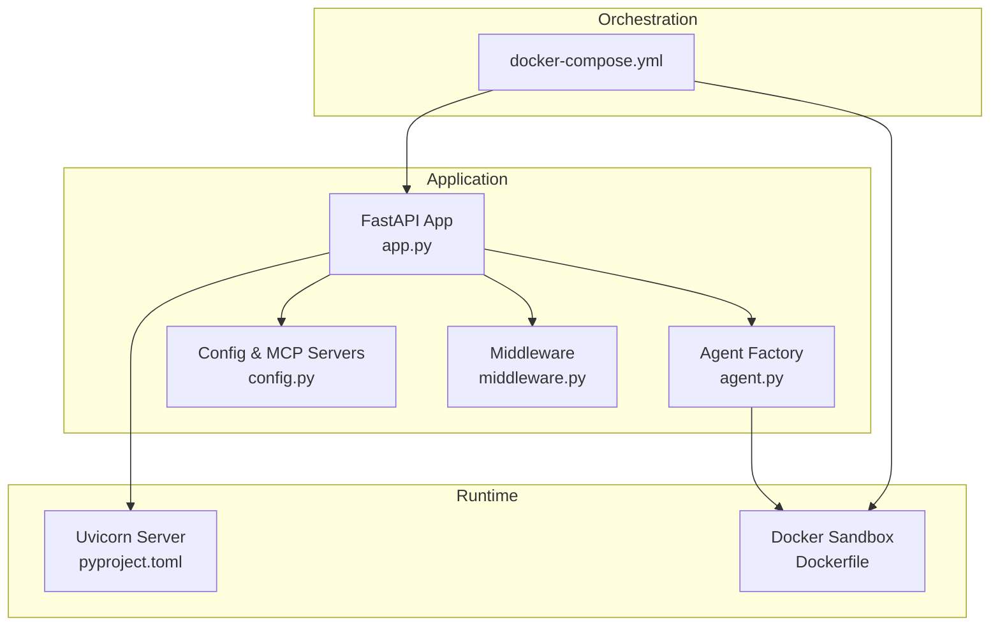
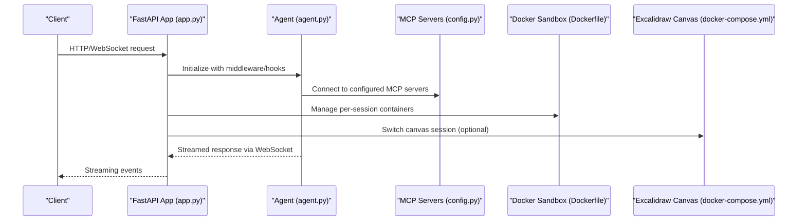
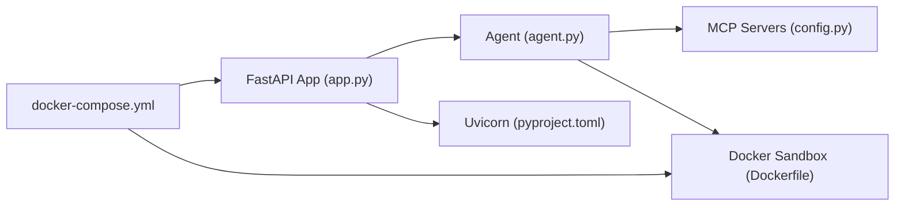

# Production Configuration

<cite>
**Referenced Files in This Document**
- [config.py](file://apps/deepresearch/src/deepresearch/config.py)
- [app.py](file://apps/deepresearch/src/deepresearch/app.py)
- [middleware.py](file://apps/deepresearch/src/deepresearch/middleware.py)
- [agent.py](file://apps/deepresearch/src/deepresearch/agent.py)
- [docker-compose.yml](file://apps/deepresearch/docker-compose.yml)
- [Dockerfile](file://apps/deepresearch/Dockerfile)
- [pyproject.toml](file://apps/deepresearch/pyproject.toml)
- [pyproject.toml](file://pyproject.toml)
- [ci.yml](file://.github/workflows/ci.yml)
- [publish.yml](file://.github/workflows/publish.yml)
</cite>

## Table of Contents
1. [Introduction](#introduction)
2. [Project Structure](#project-structure)
3. [Core Components](#core-components)
4. [Architecture Overview](#architecture-overview)
5. [Detailed Component Analysis](#detailed-component-analysis)
6. [Dependency Analysis](#dependency-analysis)
7. [Performance Considerations](#performance-considerations)
8. [Troubleshooting Guide](#troubleshooting-guide)
9. [Conclusion](#conclusion)
10. [Appendices](#appendices)

## Introduction
This document provides production-grade configuration guidance for the DeepResearch application. It covers environment variables, security hardening, performance tuning, configuration management across environments, secret handling, CORS and TLS setup, authentication mechanisms, logging and monitoring, alerting, backups and disaster recovery, and compliance and audit requirements. The guidance is grounded in the repository’s configuration files and application code.

## Project Structure
The DeepResearch application is organized as a FastAPI service with optional MCP tool integrations, Docker-based sandbox execution, and a modular agent architecture. Key configuration surfaces include environment variables loaded at runtime, middleware for auditing and permissions, and Docker Compose for local orchestration.

**Diagram sources**
- [app.py:692-704](file://apps/deepresearch/src/deepresearch/app.py#L692-L704)
- [agent.py:376-430](file://apps/deepresearch/src/deepresearch/agent.py#L376-L430)
- [config.py:58-151](file://apps/deepresearch/src/deepresearch/config.py#L58-L151)
- [middleware.py:33-122](file://apps/deepresearch/src/deepresearch/middleware.py#L33-L122)
- [Dockerfile:1-48](file://apps/deepresearch/Dockerfile#L1-L48)
- [docker-compose.yml:1-29](file://apps/deepresearch/docker-compose.yml#L1-L29)

**Section sources**
- [app.py:692-704](file://apps/deepresearch/src/deepresearch/app.py#L692-L704)
- [docker-compose.yml:1-29](file://apps/deepresearch/docker-compose.yml#L1-L29)
- [Dockerfile:1-48](file://apps/deepresearch/Dockerfile#L1-L48)

## Core Components
- Environment-driven configuration and MCP server provisioning
- Audit and permission middleware
- Agent lifecycle and hooks for safety and audit logging
- CORS and static asset serving
- Docker-based sandbox and container lifecycle management

Key configuration touchpoints:
- Environment variables for model selection, MCP server credentials, and Excalidraw integration
- Middleware for tool usage stats and path-based permission enforcement
- Agent hooks for post-tool-use audit logging and pre-tool-use safety gating
- CORS policy and static file mounting

**Section sources**
- [config.py:30-151](file://apps/deepresearch/src/deepresearch/config.py#L30-L151)
- [middleware.py:33-122](file://apps/deepresearch/src/deepresearch/middleware.py#L33-L122)
- [agent.py:35-81](file://apps/deepresearch/src/deepresearch/agent.py#L35-L81)
- [app.py:694-703](file://apps/deepresearch/src/deepresearch/app.py#L694-L703)

## Architecture Overview
The production runtime integrates FastAPI with Uvicorn, optional MCP tool servers, and a Docker sandbox. The agent is initialized at application startup with middleware and hooks, and sessions are managed with cleanup loops. Optional Excalidraw canvas is integrated via a dedicated service.

**Diagram sources**
- [app.py:636-690](file://apps/deepresearch/src/deepresearch/app.py#L636-L690)
- [agent.py:376-430](file://apps/deepresearch/src/deepresearch/agent.py#L376-L430)
- [config.py:58-151](file://apps/deepresearch/src/deepresearch/config.py#L58-L151)
- [Dockerfile:1-48](file://apps/deepresearch/Dockerfile#L1-L48)
- [docker-compose.yml:1-29](file://apps/deepresearch/docker-compose.yml#L1-L29)

## Detailed Component Analysis

### Environment Variables and Secret Management
- Model selection: MODEL_NAME
- MCP server credentials: TAVILY_API_KEY, BRAVE_API_KEY, JINA_API_KEY, FIRECRAWL_API_KEY
- Browser automation: PLAYWRIGHT_MCP
- Excalidraw integration: EXCALIDRAW_SERVER_URL, EXCALIDRAW_ENABLED
- Application paths and directories: APP_DIR, SKILLS_DIR, WORKSPACE_DIR, WORKSPACES_DIR, STATIC_DIR

Secret handling:
- Credentials are read from environment variables and passed to MCP servers or HTTP headers.
- The application loads environment variables at startup using a dotenv loader.
- For production, store secrets in a secure secret manager and mount them via environment files or platform-managed secrets.

Operational guidance:
- Use separate environment files (.env) per environment and avoid committing secrets to source control.
- Rotate API keys regularly and enforce least privilege for each provider.

**Section sources**
- [config.py:30-151](file://apps/deepresearch/src/deepresearch/config.py#L30-L151)
- [app.py:33-35](file://apps/deepresearch/src/deepresearch/app.py#L33-L35)

### Security Hardening and Authentication
- CORS: Broad allow-all origins, credentials, methods, and headers are configured. For production, restrict origins to trusted domains.
- Middleware:
  - AuditMiddleware: Tracks tool usage statistics for observability.
  - PermissionMiddleware: Blocks access to sensitive paths and patterns (e.g., .env, /etc/passwd, SSH keys).
- Safety gates: Pre-tool-use hook blocks dangerous shell commands to mitigate risk during code execution.

Recommendations:
- Enforce strict CORS policies aligned with your frontend origin(s).
- Add application-level authentication (e.g., JWT, session cookies) behind a reverse proxy or API gateway.
- Consider rate limiting and input validation at the ingress layer.

**Section sources**
- [app.py:694-700](file://apps/deepresearch/src/deepresearch/app.py#L694-L700)
- [middleware.py:33-122](file://apps/deepresearch/src/deepresearch/middleware.py#L33-L122)
- [agent.py:45-66](file://apps/deepresearch/src/deepresearch/agent.py#L45-L66)

### SSL/TLS and Transport Security
- The application exposes a port suitable for containerized deployments and expects transport encryption to be handled by a reverse proxy or ingress controller in production.
- For containerized deployments, configure TLS termination at the ingress or sidecar proxy.

**Section sources**
- [Dockerfile:45-47](file://apps/deepresearch/Dockerfile#L45-L47)
- [docker-compose.yml:14-25](file://apps/deepresearch/docker-compose.yml#L14-L25)

### Configuration Management Across Environments
- Local development: Use docker-compose to run the Excalidraw canvas service locally and the application with native Python.
- Containerized production: Build and run the application container with exposed port and environment variables mounted securely.

Environment-specific guidance:
- Development: Enable Excalidraw and local MCP servers; keep CORS permissive for local testing.
- Staging: Tighten CORS, enable stricter middleware, and use ephemeral secrets.
- Production: Restrict CORS, enforce authentication, rotate secrets, and monitor agent tool usage.

**Section sources**
- [docker-compose.yml:1-29](file://apps/deepresearch/docker-compose.yml#L1-L29)
- [Dockerfile:1-48](file://apps/deepresearch/Dockerfile#L1-L48)
- [pyproject.toml:28-30](file://apps/deepresearch/pyproject.toml#L28-L30)

### Credential Handling and MCP Server Provisioning
- MCP servers are provisioned conditionally based on environment variables:
  - Tavily, Brave Search, Jina Reader, Firecrawl, Playwright, and Excalidraw (when Docker is available).
- Excalidraw requires Docker availability; otherwise, it is skipped with a warning.

Operational guidance:
- Provide only the credentials for enabled MCP servers.
- Monitor MCP server health and implement retry/backoff strategies at the application layer.

**Section sources**
- [config.py:58-151](file://apps/deepresearch/src/deepresearch/config.py#L58-L151)

### Logging, Monitoring, and Alerting
- Logging:
  - Basic logging configuration with INFO level and formatted timestamps.
  - Library-specific log levels reduced to minimize noise.
- Audit and permissions:
  - AuditMiddleware maintains tool usage stats.
  - PermissionMiddleware denies sensitive path access attempts.
- Hooks:
  - POST_TOOL_USE hook logs tool usage for audit trails.
  - PRE_TOOL_USE hook enforces safety constraints for execute tool.

Monitoring recommendations:
- Integrate structured logging with a log aggregation platform (e.g., ELK, Loki).
- Export metrics for tool call counts and durations.
- Set alerts for unusual spikes in tool usage or repeated permission denials.

**Section sources**
- [app.py:103-120](file://apps/deepresearch/src/deepresearch/app.py#L103-L120)
- [middleware.py:33-122](file://apps/deepresearch/src/deepresearch/middleware.py#L33-L122)
- [agent.py:35-81](file://apps/deepresearch/src/deepresearch/agent.py#L35-L81)

### Performance Tuning and Resource Limits
- Agent configuration:
  - Context window and checkpointing are tuned for iterative refinement.
  - Subagent nesting depth and maximum number of agents are constrained.
- Session management:
  - Idle timeout and periodic cleanup loop are configured for sandbox containers.
- Docker sandbox:
  - The container image installs Node.js and Docker CLI to support MCP servers and sandbox execution.

Recommendations:
- Tune agent context window and checkpoint frequency based on workload.
- Limit concurrent sessions and per-session compute resources.
- Use resource quotas and CPU/memory limits in container orchestrators.

**Section sources**
- [agent.py:399-429](file://apps/deepresearch/src/deepresearch/agent.py#L399-L429)
- [app.py:644-649](file://apps/deepresearch/src/deepresearch/app.py#L644-L649)
- [Dockerfile:4-14](file://apps/deepresearch/Dockerfile#L4-L14)

### Scaling Configuration
- Horizontal scaling:
  - Stateless FastAPI service scales horizontally behind a load balancer.
  - Use sticky sessions only if required; otherwise rely on shared workspaces storage.
- Vertical scaling:
  - Increase CPU/RAM for the container based on agent complexity and concurrent sessions.
- MCP and sandbox overhead:
  - Provision sufficient capacity for MCP server processes and Docker sandbox containers.

**Section sources**
- [docker-compose.yml:1-29](file://apps/deepresearch/docker-compose.yml#L1-L29)
- [Dockerfile:1-48](file://apps/deepresearch/Dockerfile#L1-L48)

### Backup Strategies and Disaster Recovery
- Persistent workspaces:
  - The application writes session histories, metadata, and canvas snapshots under a workspaces directory.
- Recommendations:
  - Back up the workspaces volume regularly.
  - Snapshot the workspace directory periodically and retain multiple generations.
  - Test restoration procedures in a staging environment before production use.

**Section sources**
- [app.py:270-341](file://apps/deepresearch/src/deepresearch/app.py#L270-L341)

### Compliance, Audit Logging, and Data Protection
- Audit logging:
  - POST_TOOL_USE hook logs tool usage for audit trails.
  - PermissionMiddleware denies access to sensitive paths.
- Data protection:
  - Avoid storing secrets in application logs.
  - Sanitize logs to remove PII and sensitive data.
- Operational controls:
  - Enforce least privilege for MCP server credentials.
  - Restrict CORS and require authentication in production.

**Section sources**
- [agent.py:35-81](file://apps/deepresearch/src/deepresearch/agent.py#L35-L81)
- [middleware.py:77-121](file://apps/deepresearch/src/deepresearch/middleware.py#L77-L121)

## Dependency Analysis
The application depends on FastAPI, Uvicorn, pydantic-ai, and optional Docker-based tooling. The agent integrates multiple MCP servers and a Docker sandbox for safe execution.

**Diagram sources**
- [app.py:692-704](file://apps/deepresearch/src/deepresearch/app.py#L692-L704)
- [agent.py:376-430](file://apps/deepresearch/src/deepresearch/agent.py#L376-L430)
- [config.py:58-151](file://apps/deepresearch/src/deepresearch/config.py#L58-L151)
- [Dockerfile:1-48](file://apps/deepresearch/Dockerfile#L1-L48)
- [docker-compose.yml:1-29](file://apps/deepresearch/docker-compose.yml#L1-L29)
- [pyproject.toml:50-54](file://apps/deepresearch/pyproject.toml#L50-L54)

**Section sources**
- [pyproject.toml:50-54](file://apps/deepresearch/pyproject.toml#L50-L54)
- [pyproject.toml:25-34](file://pyproject.toml#L25-L34)

## Performance Considerations
- Reduce logging verbosity for libraries to minimize I/O overhead.
- Configure agent context window and checkpointing frequency to balance responsiveness and reliability.
- Use container resource limits and autoscaling to manage CPU and memory usage.
- Monitor MCP server latency and implement retry/backoff logic.

[No sources needed since this section provides general guidance]

## Troubleshooting Guide
Common issues and resolutions:
- MCP server startup failures:
  - The application detects failures and retries without problematic servers, logging the affected prefixes.
- Excalidraw not available:
  - If Docker is unavailable, Excalidraw is disabled with a warning; ensure Docker is installed and accessible.
- Permission denials:
  - PermissionMiddleware blocks sensitive paths; adjust tool arguments or file operations accordingly.
- CORS errors:
  - Update CORS configuration to match the frontend origin in production.

**Section sources**
- [app.py:670-685](file://apps/deepresearch/src/deepresearch/app.py#L670-L685)
- [config.py:125-126](file://apps/deepresearch/src/deepresearch/config.py#L125-L126)
- [middleware.py:98-121](file://apps/deepresearch/src/deepresearch/middleware.py#L98-L121)

## Conclusion
This production configuration guide consolidates environment variable usage, security hardening, performance tuning, and operational practices derived from the repository’s FastAPI application, agent factory, middleware, and Docker configuration. By enforcing strict CORS and authentication, managing secrets securely, monitoring tool usage, and backing up workspaces, you can operate DeepResearch reliably in development, staging, and production environments.

[No sources needed since this section summarizes without analyzing specific files]

## Appendices

### Appendix A: Environment Variables Reference
- MODEL_NAME: Select the model for the agent.
- TAVILY_API_KEY, BRAVE_API_KEY, JINA_API_KEY, FIRECRAWL_API_KEY: MCP server credentials.
- PLAYWRIGHT_MCP: Enables Playwright MCP server.
- EXCALIDRAW_SERVER_URL: Excalidraw canvas server URL.
- EXCALIDRAW_ENABLED: Enables Excalidraw when set to 1.
- APP_DIR, SKILLS_DIR, WORKSPACE_DIR, WORKSPACES_DIR, STATIC_DIR: Paths used by the application.

**Section sources**
- [config.py:30-25](file://apps/deepresearch/src/deepresearch/config.py#L30-L25)
- [app.py:33-35](file://apps/deepresearch/src/deepresearch/app.py#L33-L35)

### Appendix B: CI/CD and Publishing
- CI workflow validates linting, type checking, tests, and documentation builds.
- Publishing workflow builds and publishes artifacts to PyPI.

**Section sources**
- [ci.yml:1-116](file://.github/workflows/ci.yml#L1-L116)
- [publish.yml:1-18](file://.github/workflows/publish.yml#L1-L18)