# Advanced Implementation Patterns

<cite>
**Referenced Files in This Document**
- [README.md](file://README.md)
- [pydantic_deep/__init__.py](file://pydantic_deep/__init__.py)
- [pydantic_deep/agent.py](file://pydantic_deep/agent.py)
- [pydantic_deep/middleware/hooks.py](file://pydantic_deep/middleware/hooks.py)
- [pydantic_deep/processors/eviction.py](file://pydantic_deep/processors/eviction.py)
- [examples/file_uploads.py](file://examples/file_uploads.py)
- [examples/streaming.py](file://examples/streaming.py)
- [examples/human_in_the_loop.py](file://examples/human_in_the_loop.py)
- [examples/composite_backend.py](file://examples/composite_backend.py)
- [examples/subagents.py](file://examples/subagents.py)
- [examples/full_app/app.py](file://examples/full_app/app.py)
- [apps/deepresearch/src/deepresearch/agent.py](file://apps/deepresearch/src/deepresearch/agent.py)
- [cli/main.py](file://cli/main.py)
- [docs/advanced/middleware.md](file://docs/advanced/middleware.md)
</cite>

## Table of Contents
1. [Introduction](#introduction)
2. [Project Structure](#project-structure)
3. [Core Components](#core-components)
4. [Architecture Overview](#architecture-overview)
5. [Detailed Component Analysis](#detailed-component-analysis)
6. [Dependency Analysis](#dependency-analysis)
7. [Performance Considerations](#performance-considerations)
8. [Troubleshooting Guide](#troubleshooting-guide)
9. [Conclusion](#conclusion)
10. [Appendices](#appendices)

## Introduction
This document presents advanced implementation patterns for building production-grade agents with pydantic-deep. It focuses on sophisticated configurations, specialized integrations, and enterprise-ready capabilities such as file upload handling, streaming responses, human-in-the-loop workflows, and composite backend architectures. It also covers middleware integration, advanced state management, performance optimization, error handling, monitoring, and security hardening for large-scale deployments.

## Project Structure
The repository provides:
- A framework for building deep agents with planning, filesystem, subagents, skills, memory, and context management
- A CLI for terminal assistance
- A full-featured research application (DeepResearch) showcasing advanced features
- Extensive examples demonstrating file uploads, streaming, human-in-the-loop, composite backends, and subagents
- Comprehensive documentation for middleware, hooks, and advanced patterns

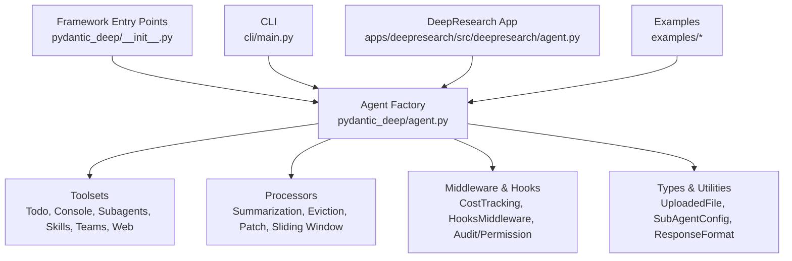

**Diagram sources**
- [pydantic_deep/__init__.py:105-135](file://pydantic_deep/__init__.py#L105-L135)
- [pydantic_deep/agent.py:196-472](file://pydantic_deep/agent.py#L196-L472)

**Section sources**
- [README.md:252-288](file://README.md#L252-L288)
- [pydantic_deep/__init__.py:105-206](file://pydantic_deep/__init__.py#L105-L206)

## Core Components
- Agent factory with modular toolsets and processors
- Hooks system for lifecycle auditing and safety gates
- Eviction processor for large tool outputs
- Streaming execution for real-time feedback
- Human-in-the-loop approvals for sensitive operations
- Composite backends for mixed storage strategies
- Subagents for task delegation and parallelism
- Middleware integration for cross-cutting concerns

**Section sources**
- [pydantic_deep/agent.py:196-472](file://pydantic_deep/agent.py#L196-L472)
- [pydantic_deep/middleware/hooks.py:243-362](file://pydantic_deep/middleware/hooks.py#L243-L362)
- [pydantic_deep/processors/eviction.py:110-271](file://pydantic_deep/processors/eviction.py#L110-L271)
- [examples/streaming.py:16-82](file://examples/streaming.py#L16-L82)
- [examples/human_in_the_loop.py:16-100](file://examples/human_in_the_loop.py#L16-L100)
- [examples/composite_backend.py:21-94](file://examples/composite_backend.py#L21-L94)
- [examples/subagents.py:15-114](file://examples/subagents.py#L15-L114)

## Architecture Overview
The agent architecture composes modular toolsets, processors, and middleware around a core Agent. Specialized integrations (e.g., Docker sandbox, MCP servers) are plugged in via toolsets and middleware. The CLI and DeepResearch app demonstrate production-ready patterns for streaming, human-in-the-loop, and composite backends.

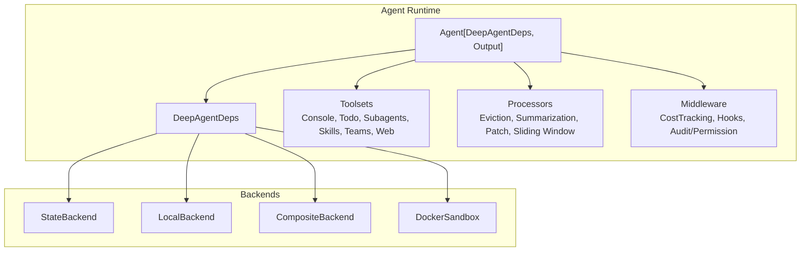

**Diagram sources**
- [pydantic_deep/agent.py:506-718](file://pydantic_deep/agent.py#L506-L718)
- [examples/composite_backend.py:34-40](file://examples/composite_backend.py#L34-L40)
- [examples/full_app/app.py:614-654](file://examples/full_app/app.py#L614-L654)

## Detailed Component Analysis

### File Upload Handling
Production-grade file upload handling supports:
- Uploading files via helper functions and direct deps APIs
- Automatic injection of upload metadata into system prompts
- Pagination hints for large files (offset/limit)
- Binary file awareness and preview generation

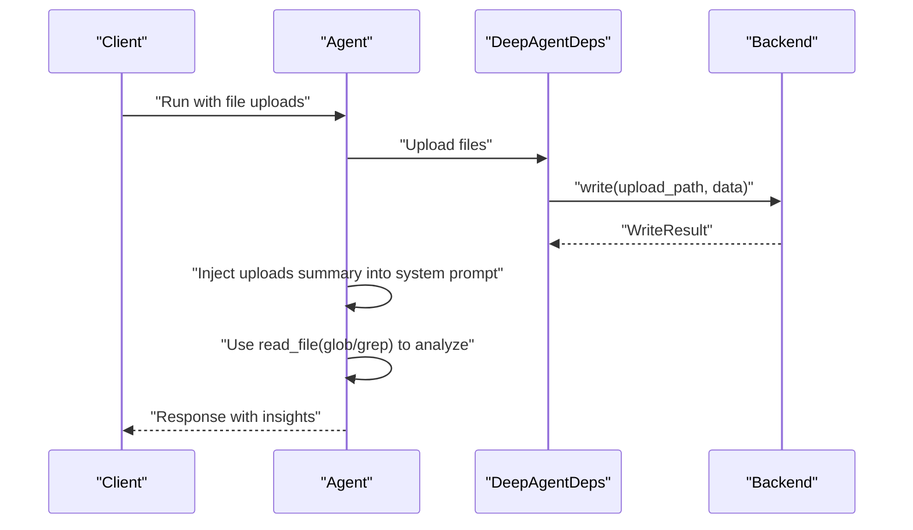

**Diagram sources**
- [examples/file_uploads.py:15-163](file://examples/file_uploads.py#L15-L163)

**Section sources**
- [examples/file_uploads.py:15-163](file://examples/file_uploads.py#L15-L163)

### Streaming Responses
Real-time streaming enables:
- Iterative execution with node-level events
- Live tool-call and response deltas
- Progress tracking and UI updates

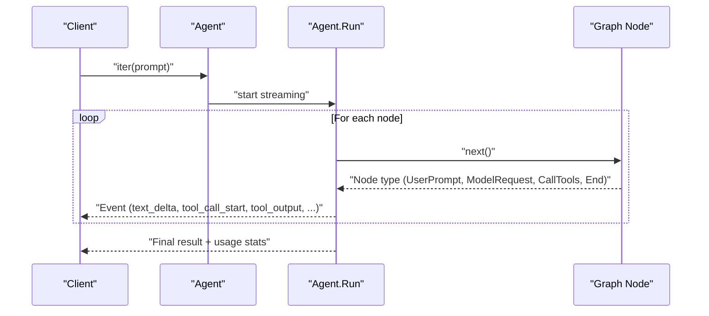

**Diagram sources**
- [examples/streaming.py:16-82](file://examples/streaming.py#L16-L82)

**Section sources**
- [examples/streaming.py:16-82](file://examples/streaming.py#L16-L82)

### Human-in-the-Loop Workflows
Sensitive operations can require user approval:
- Configure approvals per tool via interrupt_on
- Receive DeferredToolRequests and decide per-call
- Resume execution with approvals applied

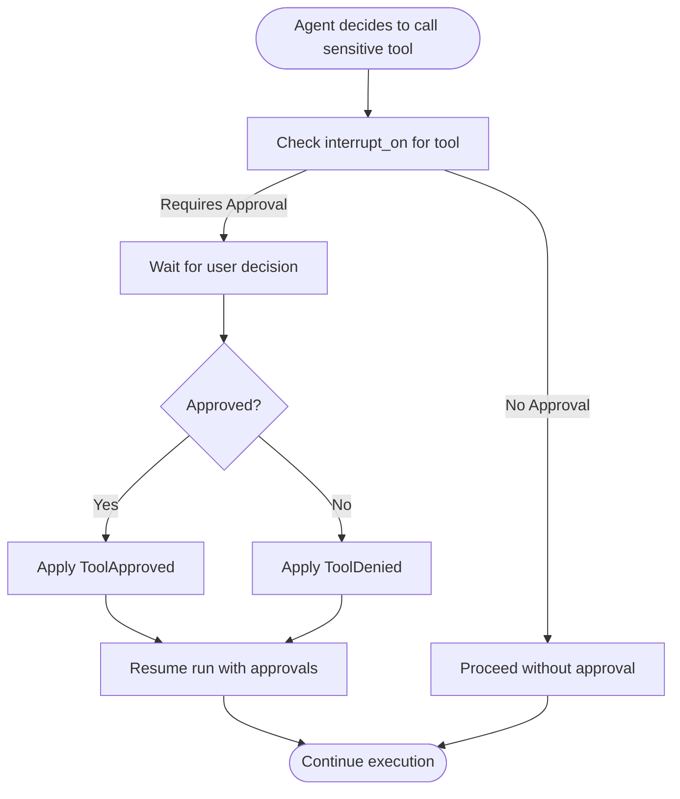

**Diagram sources**
- [examples/human_in_the_loop.py:16-100](file://examples/human_in_the_loop.py#L16-L100)

**Section sources**
- [examples/human_in_the_loop.py:16-100](file://examples/human_in_the_loop.py#L16-L100)

### Composite Backend Architectures
Mix persistent and ephemeral storage:
- Route paths to different backends
- Combine StateBackend (memory) and LocalBackend (disk)
- Use CompositeBackend for unified access

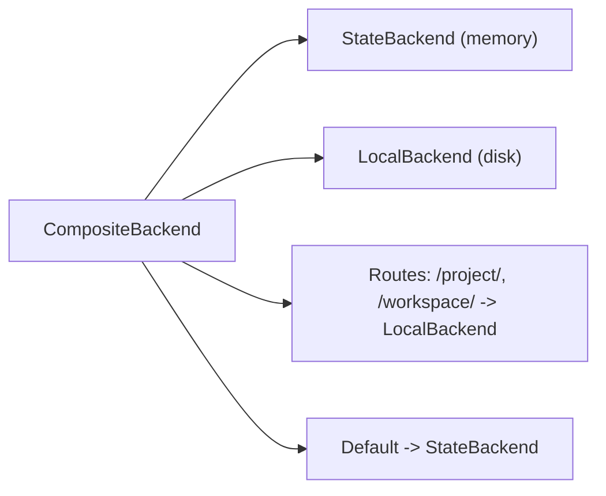

**Diagram sources**
- [examples/composite_backend.py:34-40](file://examples/composite_backend.py#L34-L40)

**Section sources**
- [examples/composite_backend.py:21-94](file://examples/composite_backend.py#L21-L94)

### Subagents and Parallel Execution
Delegate specialized tasks to subagents:
- Define custom subagents with tailored instructions
- Coordinate work and synthesize results
- Isolate context per subagent

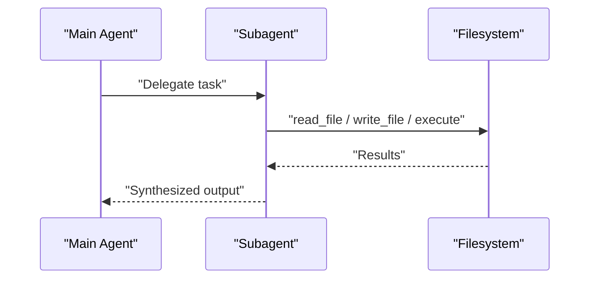

**Diagram sources**
- [examples/subagents.py:15-114](file://examples/subagents.py#L15-L114)

**Section sources**
- [examples/subagents.py:15-114](file://examples/subagents.py#L15-L114)

### Hooks and Middleware Integration
Claude Code-style lifecycle hooks:
- PRE_TOOL_USE: safety gates and audits
- POST_TOOL_USE: background auditing
- POST_TOOL_USE_FAILURE: failure handling

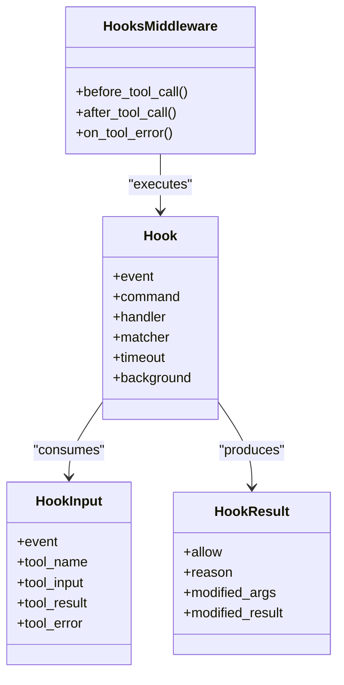

**Diagram sources**
- [pydantic_deep/middleware/hooks.py:243-362](file://pydantic_deep/middleware/hooks.py#L243-L362)

**Section sources**
- [pydantic_deep/middleware/hooks.py:1-373](file://pydantic_deep/middleware/hooks.py#L1-L373)
- [docs/advanced/middleware.md:1-114](file://docs/advanced/middleware.md#L1-L114)

### Advanced State Management
- Per-session Docker sandboxes via SessionManager
- In-memory and file-based checkpoint stores
- Rewind/fork/resume with patched tool calls
- Multi-user isolation with separate workspaces

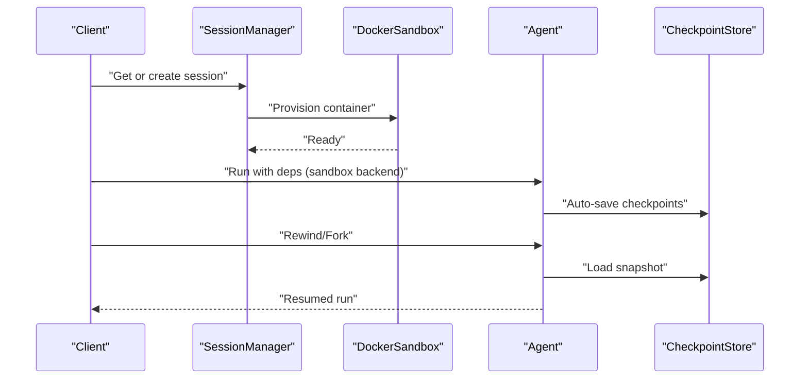

**Diagram sources**
- [examples/full_app/app.py:695-737](file://examples/full_app/app.py#L695-L737)

**Section sources**
- [examples/full_app/app.py:695-737](file://examples/full_app/app.py#L695-L737)

### DeepResearch Production Patterns
DeepResearch demonstrates:
- Planner subagent for structured planning
- Web search and browser automation via MCP servers
- Excalidraw diagrams and team collaboration
- Audit hooks and safety gates
- Context files and persistent memory

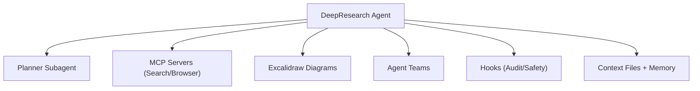

**Diagram sources**
- [apps/deepresearch/src/deepresearch/agent.py:376-430](file://apps/deepresearch/src/deepresearch/agent.py#L376-L430)

**Section sources**
- [apps/deepresearch/src/deepresearch/agent.py:376-430](file://apps/deepresearch/src/deepresearch/agent.py#L376-L430)

## Dependency Analysis
The agent composes multiple subsystems:
- Toolsets: Todo, Console, Subagents, Skills, Teams, Web
- Processors: Eviction, Summarization, Patch, Sliding Window
- Middleware: CostTracking, Hooks, Audit/Permission
- Backends: State, Local, Composite, Docker Sandbox

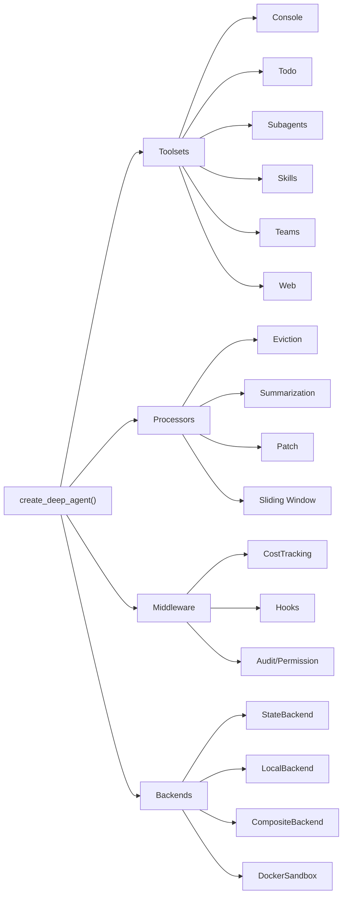

**Diagram sources**
- [pydantic_deep/agent.py:506-718](file://pydantic_deep/agent.py#L506-L718)
- [pydantic_deep/__init__.py:105-206](file://pydantic_deep/__init__.py#L105-L206)

**Section sources**
- [pydantic_deep/agent.py:506-718](file://pydantic_deep/agent.py#L506-L718)
- [pydantic_deep/__init__.py:105-206](file://pydantic_deep/__init__.py#L105-L206)

## Performance Considerations
- Context management: Use summarization and sliding window processors to cap token usage
- Large outputs: Evict oversized tool results to files and reference previews
- Streaming: Use agent.iter() to reduce perceived latency and enable UI responsiveness
- Sandboxing: Prefer DockerSandbox for isolation and reproducibility
- Middleware overhead: Minimize expensive hooks; use background hooks for non-blocking operations
- Cost tracking: Enforce budgets to avoid runaway token usage

[No sources needed since this section provides general guidance]

## Troubleshooting Guide
- Hook failures: Validate command hooks require a SandboxProtocol backend; use handler hooks for pure Python logic
- Permission denials: Ensure permission_handler is provided when middleware returns ToolDecision.ASK
- Approval workflows: Handle DeferredToolRequests and apply ToolApproved/ToolDenied per call ID
- Streaming issues: Confirm client consumes events and handles node transitions
- Composite backend routing: Verify route prefixes and default backend behavior

**Section sources**
- [pydantic_deep/middleware/hooks.py:202-211](file://pydantic_deep/middleware/hooks.py#L202-L211)
- [examples/human_in_the_loop.py:58-91](file://examples/human_in_the_loop.py#L58-L91)
- [examples/streaming.py:33-60](file://examples/streaming.py#L33-L60)
- [examples/composite_backend.py:34-40](file://examples/composite_backend.py#L34-L40)

## Conclusion
By combining modular toolsets, robust middleware, and advanced state management, pydantic-deep enables enterprise-grade agent implementations. The patterns demonstrated—file uploads, streaming, human-in-the-loop, composite backends, hooks, and subagents—provide a blueprint for scalable, secure, and observable systems suitable for production environments.

[No sources needed since this section summarizes without analyzing specific files]

## Appendices

### CLI Integration
The CLI supports streaming, sandboxing, and instrumentation for production monitoring.

**Section sources**
- [cli/main.py:121-292](file://cli/main.py#L121-L292)
- [cli/main.py:41-94](file://cli/main.py#L41-L94)

### Example Index
- File uploads: [examples/file_uploads.py:15-163](file://examples/file_uploads.py#L15-L163)
- Streaming: [examples/streaming.py:16-82](file://examples/streaming.py#L16-L82)
- Human-in-the-loop: [examples/human_in_the_loop.py:16-100](file://examples/human_in_the_loop.py#L16-L100)
- Composite backend: [examples/composite_backend.py:21-94](file://examples/composite_backend.py#L21-L94)
- Subagents: [examples/subagents.py:15-114](file://examples/subagents.py#L15-L114)
- Full app (FastAPI + WebSocket): [examples/full_app/app.py:1-800](file://examples/full_app/app.py#L1-L800)