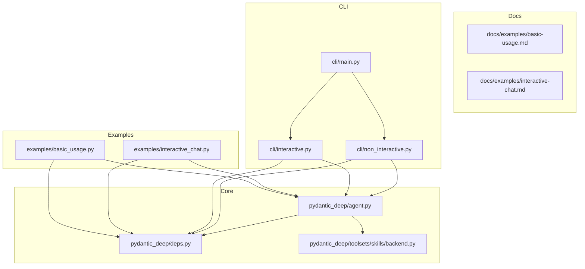
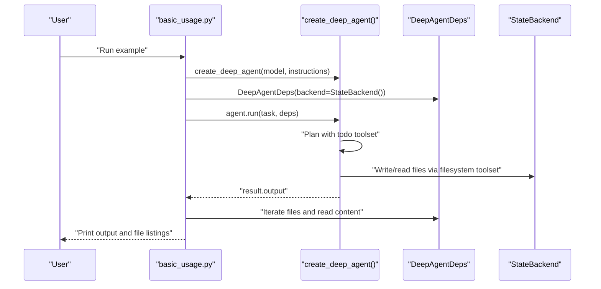
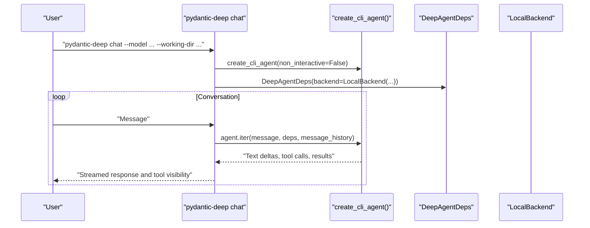
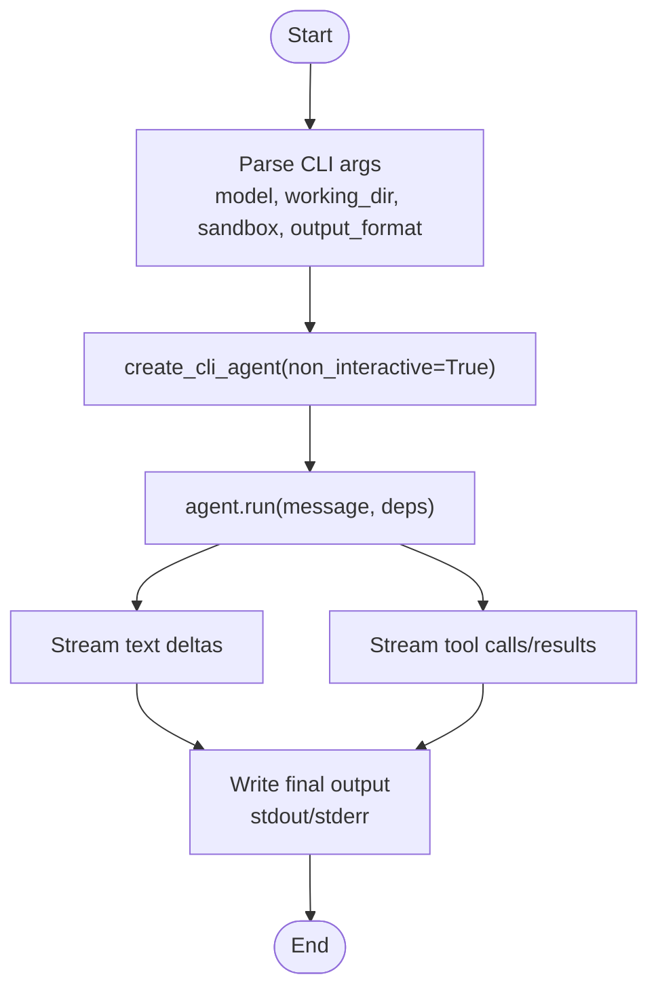
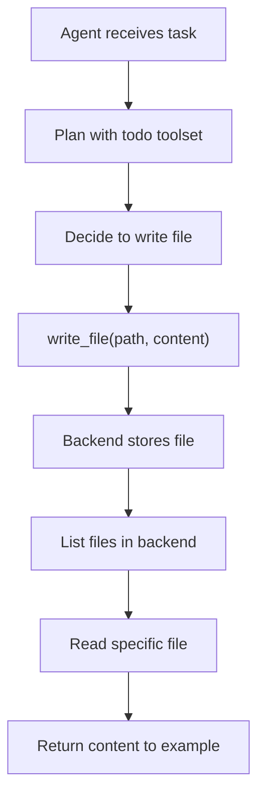
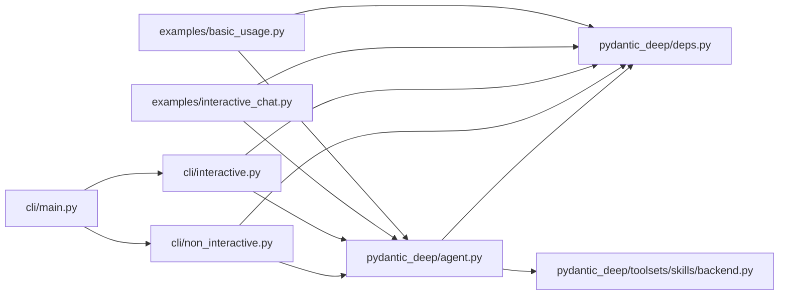

# Basic Usage Examples

<cite>
**Referenced Files in This Document**
- [basic_usage.py](file://examples/basic_usage.py)
- [basic-usage.md](file://docs/examples/basic-usage.md)
- [agent.py](file://pydantic_deep/agent.py)
- [deps.py](file://pydantic_deep/deps.py)
- [interactive_chat.py](file://examples/interactive_chat.py)
- [interactive-chat.md](file://docs/examples/interactive-chat.md)
- [interactive.py](file://cli/interactive.py)
- [non_interactive.py](file://cli/non_interactive.py)
- [main.py](file://cli/main.py)
- [backend.py](file://pydantic_deep/toolsets/skills/backend.py)
</cite>

## Table of Contents
1. [Introduction](#introduction)
2. [Project Structure](#project-structure)
3. [Core Components](#core-components)
4. [Architecture Overview](#architecture-overview)
5. [Detailed Component Analysis](#detailed-component-analysis)
6. [Dependency Analysis](#dependency-analysis)
7. [Performance Considerations](#performance-considerations)
8. [Troubleshooting Guide](#troubleshooting-guide)
9. [Conclusion](#conclusion)

## Introduction
This document explains the fundamental usage patterns of pydantic-deep through practical examples. It covers:
- Creating a deep agent with default toolsets
- Running tasks with non-interactive batch mode
- Interacting with the agent in an interactive chat loop
- Performing basic file operations via the filesystem toolset
- Understanding parameters, expected outputs, and common beginner pitfalls

The examples focus on the simplest path to get started, using in-memory storage and the default toolsets that include planning (todo), filesystem operations, subagents, and skills.

## Project Structure
The repository organizes examples, documentation, and core agent implementation across several directories:
- examples: runnable scripts demonstrating usage patterns
- docs/examples: comprehensive guides and expected outputs
- pydantic_deep: core agent factory and dependency container
- cli: command-line interface with interactive and non-interactive modes
- pydantic_deep/toolsets/skills: backend-aware skill discovery and execution

**Diagram sources**
- [basic_usage.py:1-53](file://examples/basic_usage.py#L1-L53)
- [interactive_chat.py:1-269](file://examples/interactive_chat.py#L1-L269)
- [agent.py:196-472](file://pydantic_deep/agent.py#L196-L472)
- [deps.py:18-207](file://pydantic_deep/deps.py#L18-L207)
- [interactive.py:1-200](file://cli/interactive.py#L1-L200)
- [non_interactive.py:86-212](file://cli/non_interactive.py#L86-L212)
- [main.py:121-291](file://cli/main.py#L121-L291)
- [backend.py:397-565](file://pydantic_deep/toolsets/skills/backend.py#L397-L565)

**Section sources**
- [basic_usage.py:1-53](file://examples/basic_usage.py#L1-L53)
- [basic-usage.md:1-233](file://docs/examples/basic-usage.md#L1-L233)
- [agent.py:196-472](file://pydantic_deep/agent.py#L196-L472)
- [deps.py:18-207](file://pydantic_deep/deps.py#L18-L207)
- [interactive_chat.py:1-269](file://examples/interactive_chat.py#L1-L269)
- [interactive-chat.md:1-368](file://docs/examples/interactive-chat.md#L1-L368)
- [interactive.py:1-200](file://cli/interactive.py#L1-L200)
- [non_interactive.py:86-212](file://cli/non_interactive.py#L86-L212)
- [main.py:121-291](file://cli/main.py#L121-L291)
- [backend.py:397-565](file://pydantic_deep/toolsets/skills/backend.py#L397-L565)

## Core Components
This section introduces the building blocks used in basic usage examples.

- DeepAgentDeps: Dependency container holding the backend, in-memory files, todo list, subagents, and upload metadata. It also exposes helpers to summarize state for the agent’s system prompt.
- create_deep_agent: Factory that builds an Agent with default toolsets (todo, filesystem, subagents, skills) and integrates dynamic system prompts based on current state.
- CLI wrappers: create_cli_agent and CLI commands (run, chat) configure the agent for non-interactive and interactive scenarios respectively.

Key responsibilities:
- DeepAgentDeps: central state for files, todos, subagents, and upload metadata; provides summaries for system prompts.
- create_deep_agent: composes toolsets, sets model and instructions, configures middleware and history processors, and returns an Agent ready to run.
- CLI create_cli_agent: applies defaults for interactive and non-interactive modes, sets up hooks, permissions, and context management.

**Section sources**
- [deps.py:18-207](file://pydantic_deep/deps.py#L18-L207)
- [agent.py:196-472](file://pydantic_deep/agent.py#L196-L472)
- [interactive.py:51-120](file://cli/interactive.py#L51-L120)
- [non_interactive.py:86-120](file://cli/non_interactive.py#L86-L120)

## Architecture Overview
The basic usage flow connects user input to the agent, which uses toolsets to plan and operate on files, then returns a response and usage statistics.

**Diagram sources**
- [basic_usage.py:14-52](file://examples/basic_usage.py#L14-L52)
- [agent.py:196-472](file://pydantic_deep/agent.py#L196-L472)
- [deps.py:18-207](file://pydantic_deep/deps.py#L18-L207)

## Detailed Component Analysis

### Basic Usage Example Walkthrough
This walkthrough follows the example script that demonstrates agent initialization, task execution, and file system operations.

Step-by-step:
1. Agent creation
   - The example constructs a deep agent with a model and custom instructions.
   - The agent includes default toolsets: todo, filesystem, subagents, and skills.
   - The agent factory integrates dynamic system prompts reflecting current state (e.g., todo list and files).

2. Dependency setup
   - A dependency container is created with an in-memory backend (StateBackend).
   - The container holds files, todos, and subagents for the run.

3. Task execution
   - The agent runs a task asynchronously, receiving a result object.
   - The result includes the agent’s textual output and usage statistics.

4. File inspection
   - The example enumerates files created during the run and reads a specific file from the backend.
   - It prints the file content to the console.

Expected outputs:
- Agent output: The agent’s response to the task.
- Files created: Paths and line counts of created files.
- File content: The content of the created file.

Parameters and configuration:
- model: LLM provider and model identifier.
- instructions: System prompt guiding the agent’s behavior.
- backend: Storage backend (StateBackend for in-memory files).
- include_todo, include_filesystem, include_subagents, include_skills: Flags controlling toolsets.

Common variations:
- Disable planning: Set include_todo=False.
- Custom instructions: Provide a tailored system prompt.
- Test without API: Use a test model for deterministic runs.

**Section sources**
- [basic_usage.py:14-52](file://examples/basic_usage.py#L14-L52)
- [basic-usage.md:18-90](file://docs/examples/basic-usage.md#L18-L90)
- [agent.py:196-472](file://pydantic_deep/agent.py#L196-L472)
- [deps.py:18-207](file://pydantic_deep/deps.py#L18-L207)

### Interactive Chat Mode Setup
Interactive chat enables a continuous conversation with streaming responses and visibility of tool calls. The CLI provides a chat command that configures the agent for interactive use.

Key elements:
- CLI chat command: Parses flags for model, working directory, sandbox, and model settings.
- Agent creation for chat: Uses create_cli_agent with interactive defaults, hooks, and context management.
- Streaming: The chat loop streams text deltas and displays tool calls/results in real time.
- Slash commands: Built-in commands for managing the session (e.g., quit, clear, files, todos).

**Diagram sources**
- [main.py:216-291](file://cli/main.py#L216-L291)
- [interactive.py:555-625](file://cli/interactive.py#L555-L625)
- [interactive-chat.md:27-69](file://docs/examples/interactive-chat.md#L27-L69)

**Section sources**
- [main.py:216-291](file://cli/main.py#L216-L291)
- [interactive.py:555-625](file://cli/interactive.py#L555-L625)
- [interactive-chat.md:19-69](file://docs/examples/interactive-chat.md#L19-L69)

### Non-Interactive Batch Processing
Non-interactive mode runs a single task and streams results to stdout, suitable for automation and benchmarks.

Highlights:
- CLI run command: Configures the agent for non-interactive execution with auto-approved tool calls.
- Streaming events: The example demonstrates how to stream text deltas and tool call events.
- Output formats: Text, JSON, or Markdown outputs are supported.
- Sandbox execution: Optional Docker sandbox for isolated file operations and code execution.

**Diagram sources**
- [non_interactive.py:86-212](file://cli/non_interactive.py#L86-L212)
- [main.py:135-214](file://cli/main.py#L135-L214)

**Section sources**
- [non_interactive.py:86-212](file://cli/non_interactive.py#L86-L212)
- [main.py:135-214](file://cli/main.py#L135-L214)

### File Operations Basics
The filesystem toolset allows reading, writing, editing, and executing files. In the basic example, the agent writes a calculator module and the example reads it back.

Key concepts:
- Writing files: The agent uses write_file to create content at a specified path.
- Reading files: The example reads a file from the backend and prints its content.
- Listing files: The example iterates over the files in the backend to show created files.
- Backend types: StateBackend for in-memory files; LocalBackend for host filesystem; DockerSandbox for isolated environments.

**Diagram sources**
- [basic_usage.py:30-48](file://examples/basic_usage.py#L30-L48)
- [deps.py:18-207](file://pydantic_deep/deps.py#L18-L207)

**Section sources**
- [basic_usage.py:30-48](file://examples/basic_usage.py#L30-L48)
- [deps.py:18-207](file://pydantic_deep/deps.py#L18-L207)

### Skills and Backend-Aware Discovery
Skills extend the agent’s capabilities with reusable instructions and optional scripts. The backend-aware skills directory discovers skills from a backend filesystem and can execute scripts within a sandbox.

Highlights:
- BackendSkillsDirectory: Discovers skills from a backend path and loads SKILL.md metadata.
- BackendSkillResource: Loads resources from backend paths.
- BackendSkillScriptExecutor: Executes scripts via backend execute() when available.
- Integration: Skills can be provided to create_deep_agent via skill_directories.

**Section sources**
- [backend.py:397-565](file://pydantic_deep/toolsets/skills/backend.py#L397-L565)
- [agent.py:623-662](file://pydantic_deep/agent.py#L623-L662)

## Dependency Analysis
This section maps how the basic usage components depend on each other.

**Diagram sources**
- [basic_usage.py:11-11](file://examples/basic_usage.py#L11-L11)
- [interactive_chat.py:24-24](file://examples/interactive_chat.py#L24-L24)
- [agent.py:196-472](file://pydantic_deep/agent.py#L196-L472)
- [deps.py:18-207](file://pydantic_deep/deps.py#L18-L207)
- [interactive.py:38-49](file://cli/interactive.py#L38-L49)
- [non_interactive.py:20-28](file://cli/non_interactive.py#L20-L28)
- [main.py:121-291](file://cli/main.py#L121-L291)
- [backend.py:397-565](file://pydantic_deep/toolsets/skills/backend.py#L397-L565)

**Section sources**
- [basic_usage.py:11-11](file://examples/basic_usage.py#L11-L11)
- [interactive_chat.py:24-24](file://examples/interactive_chat.py#L24-L24)
- [agent.py:196-472](file://pydantic_deep/agent.py#L196-L472)
- [deps.py:18-207](file://pydantic_deep/deps.py#L18-L207)
- [interactive.py:38-49](file://cli/interactive.py#L38-L49)
- [non_interactive.py:20-28](file://cli/non_interactive.py#L20-L28)
- [main.py:121-291](file://cli/main.py#L121-L291)
- [backend.py:397-565](file://pydantic_deep/toolsets/skills/backend.py#L397-L565)

## Performance Considerations
- Streaming: Prefer streaming responses in interactive scenarios to reduce perceived latency.
- Context management: The default agent includes context middleware that tracks token usage and can compress history to keep within model limits.
- Tool call retries: The agent factory sets retry counts on toolsets to handle transient failures.
- Sandbox execution: For non-interactive runs, consider sandbox backends to isolate execution and prevent side effects.

[No sources needed since this section provides general guidance]

## Troubleshooting Guide
Common beginner issues and resolutions:

- Missing API keys
  - Symptom: Provider initialization errors indicating missing API keys.
  - Resolution: Set the appropriate environment variables for your provider (e.g., OPENAI_API_KEY, ANTHROPIC_API_KEY).
  - Reference: The CLI prints helpful hints when API key errors occur.

- Model provider misconfiguration
  - Symptom: Errors indicating provider readiness checks fail.
  - Resolution: Verify provider and model strings and ensure required environment variables are set.

- Permission denied for file operations
  - Symptom: Errors when writing or editing files.
  - Resolution: Ensure the backend supports the operation and that the agent has appropriate permissions. In interactive mode, approval prompts may be required.

- Non-interactive mode tool call approvals
  - Symptom: Tool calls blocked in non-interactive runs.
  - Resolution: Non-interactive mode auto-approves tool calls; if approvals are still required, adjust interrupt_on settings.

- Sandbox not installed
  - Symptom: Docker support not available.
  - Resolution: Install sandbox extras and ensure Docker is running.

**Section sources**
- [non_interactive.py:39-55](file://cli/non_interactive.py#L39-L55)
- [interactive.py:294-304](file://cli/interactive.py#L294-L304)
- [main.py:504-555](file://cli/main.py#L504-L555)

## Conclusion
The basic usage examples demonstrate how to quickly create a capable agent, run tasks in both interactive and non-interactive modes, and perform essential file operations. By leveraging the default toolsets and dependency container, you can iterate rapidly and extend functionality with skills and subagents as your needs grow.