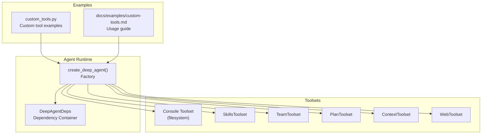
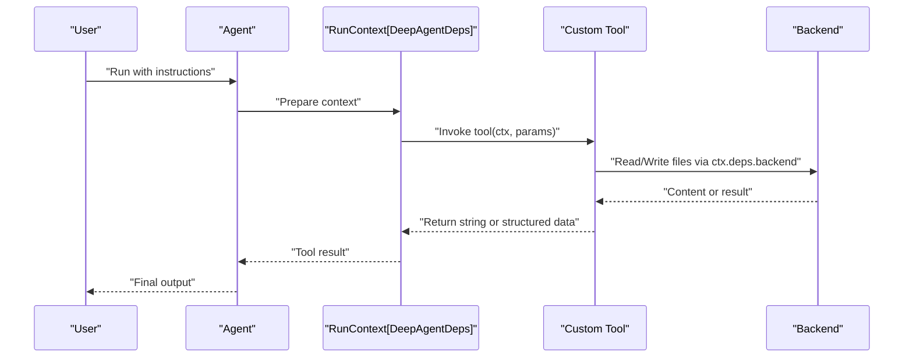
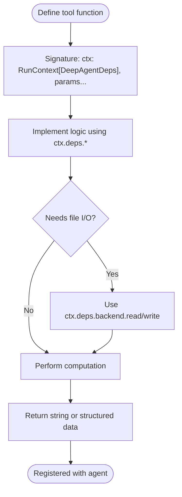
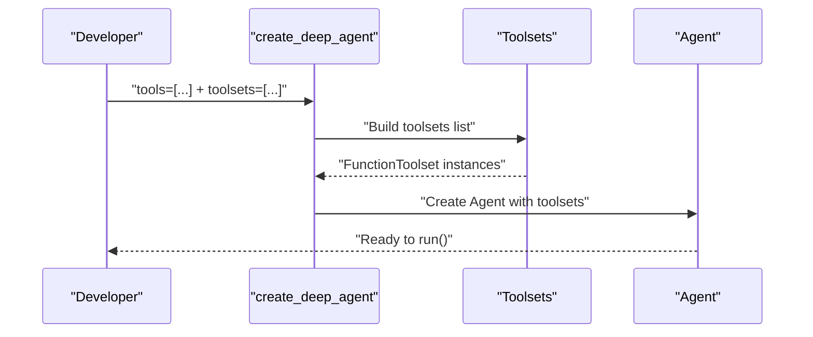
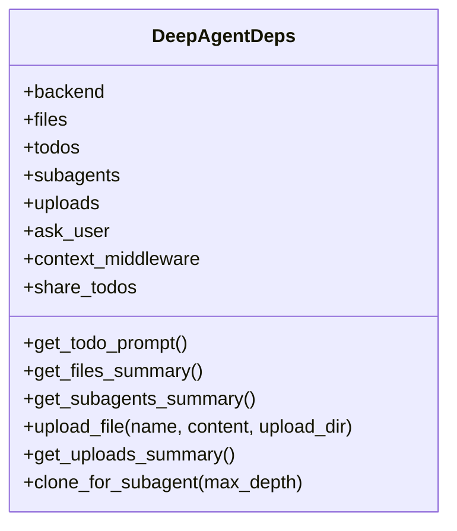
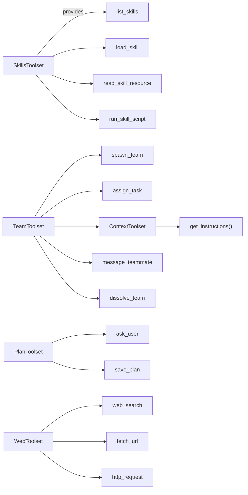
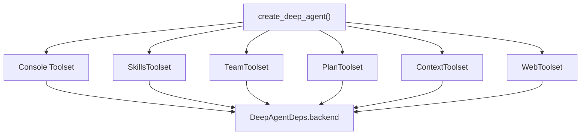

# Custom Tool Development

<cite>
**Referenced Files in This Document**
- [custom_tools.py](file://examples/custom_tools.py)
- [custom-tools.md](file://docs/examples/custom-tools.md)
- [agent.py](file://pydantic_deep/agent.py)
- [deps.py](file://pydantic_deep/deps.py)
- [types.py](file://pydantic_deep/types.py)
- [toolsets/__init__.py](file://pydantic_deep/toolsets/__init__.py)
- [toolsets/web.py](file://pydantic_deep/toolsets/web.py)
- [toolsets/context.py](file://pydantic_deep/toolsets/context.py)
- [toolsets/skills/toolset.py](file://pydantic_deep/toolsets/skills/toolset.py)
- [toolsets/teams.py](file://pydantic_deep/toolsets/teams.py)
- [toolsets/plan/toolset.py](file://pydantic_deep/toolsets/plan/toolset.py)
- [concepts/toolsets.md](file://docs/concepts/toolsets.md)
- [advanced/web-tools.md](file://docs/advanced/web-tools.md)
</cite>

## Table of Contents
1. [Introduction](#introduction)
2. [Project Structure](#project-structure)
3. [Core Components](#core-components)
4. [Architecture Overview](#architecture-overview)
5. [Detailed Component Analysis](#detailed-component-analysis)
6. [Dependency Analysis](#dependency-analysis)
7. [Performance Considerations](#performance-considerations)
8. [Troubleshooting Guide](#troubleshooting-guide)
9. [Conclusion](#conclusion)
10. [Appendices](#appendices)

## Introduction
This document explains how to develop custom tools for the pydantic-deep agent framework. It covers tool creation patterns, parameter handling, return value specifications, registration, dependency injection, and integration with the agent’s toolset system. It also provides best practices, error handling strategies, performance tips, and reusable templates for common tool types.

## Project Structure
The repository organizes tool development around:
- Agent factory and configuration
- Dependency injection container
- Built-in toolsets (filesystem, skills, teams, plan, context, web)
- Examples and documentation for custom tools

**Diagram sources**
- [agent.py:196-756](file://pydantic_deep/agent.py#L196-L756)
- [deps.py:18-50](file://pydantic_deep/deps.py#L18-L50)
- [toolsets/__init__.py:1-25](file://pydantic_deep/toolsets/__init__.py#L1-L25)
- [custom_tools.py:99-145](file://examples/custom_tools.py#L99-L145)
- [custom-tools.md:18-159](file://docs/examples/custom-tools.md#L18-L159)

**Section sources**
- [agent.py:196-756](file://pydantic_deep/agent.py#L196-L756)
- [deps.py:18-50](file://pydantic_deep/deps.py#L18-L50)
- [toolsets/__init__.py:1-25](file://pydantic_deep/toolsets/__init__.py#L1-L25)
- [custom_tools.py:99-145](file://examples/custom_tools.py#L99-L145)
- [custom-tools.md:18-159](file://docs/examples/custom-tools.md#L18-L159)

## Core Components
- Tool function signature: async functions accepting RunContext[DeepAgentDeps] and typed parameters, returning strings or structured data convertible to strings.
- Dependency injection: tools access ctx.deps.backend, ctx.deps.todos, ctx.deps.uploads, and other fields.
- Registration: tools can be passed to create_deep_agent(tools=[...]) or grouped into FunctionToolset and passed via toolsets=[...].
- Return value specifications: tools commonly return descriptive strings; structured outputs are supported when using output_type with the agent.

Practical examples:
- Time retrieval, logging to a file, and code complexity analysis are demonstrated in the custom tools example.

**Section sources**
- [custom_tools.py:18-96](file://examples/custom_tools.py#L18-L96)
- [custom-tools.md:194-233](file://docs/examples/custom-tools.md#L194-L233)
- [concepts/toolsets.md:344-361](file://docs/concepts/toolsets.md#L344-L361)

## Architecture Overview
The agent composes multiple toolsets and exposes them to the LLM. Custom tools integrate seamlessly because they follow the same function signature and dependency access pattern.

**Diagram sources**
- [agent.py:196-756](file://pydantic_deep/agent.py#L196-L756)
- [custom_tools.py:18-96](file://examples/custom_tools.py#L18-L96)
- [deps.py:18-50](file://pydantic_deep/deps.py#L18-L50)

## Detailed Component Analysis

### Custom Tool Creation Patterns
- Function signature: async def tool_name(ctx: RunContext[DeepAgentDeps], ...) -> str | Any
- Parameters: type-hinted, documented in docstring; optional with defaults
- Return values: strings are typical; structured data is supported when configuring output_type
- Error handling: return descriptive error messages instead of raising exceptions

**Diagram sources**
- [custom_tools.py:18-96](file://examples/custom_tools.py#L18-L96)
- [custom-tools.md:194-233](file://docs/examples/custom-tools.md#L194-L233)

**Section sources**
- [custom_tools.py:18-96](file://examples/custom_tools.py#L18-L96)
- [custom-tools.md:194-233](file://docs/examples/custom-tools.md#L194-L233)

### Tool Registration and Integration
- Direct registration: tools=[my_tool1, my_tool2]
- Grouped registration: toolsets=[FunctionToolset([tool1, tool2])]
- Agent factory composes toolsets and applies middleware, retries, and context managers

**Diagram sources**
- [agent.py:687-718](file://pydantic_deep/agent.py#L687-L718)
- [concepts/toolsets.md:221-269](file://docs/concepts/toolsets.md#L221-L269)

**Section sources**
- [agent.py:687-718](file://pydantic_deep/agent.py#L687-L718)
- [concepts/toolsets.md:221-269](file://docs/concepts/toolsets.md#L221-L269)

### Dependency Injection and State Management
- DeepAgentDeps provides backend, files, todos, subagents, uploads, ask_user, and context middleware
- Tools access ctx.deps.backend for file operations and ctx.deps.todos for task state
- Uploads metadata is tracked for display in system prompts

**Diagram sources**
- [deps.py:18-196](file://pydantic_deep/deps.py#L18-L196)

**Section sources**
- [deps.py:18-196](file://pydantic_deep/deps.py#L18-L196)

### Extending Existing Functionality
- SkillsToolset: load, list, read resource, run script
- TeamsToolset: spawn team, assign tasks, message teammates, dissolve team
- PlanToolset: ask_user, save_plan
- ContextToolset: inject project context files into system prompt
- WebToolset: web_search, fetch_url, http_request

**Diagram sources**
- [toolsets/skills/toolset.py:112-456](file://pydantic_deep/toolsets/skills/toolset.py#L112-L456)
- [toolsets/teams.py:354-532](file://pydantic_deep/toolsets/teams.py#L354-L532)
- [toolsets/plan/toolset.py:139-219](file://pydantic_deep/toolsets/plan/toolset.py#L139-L219)
- [toolsets/context.py:150-207](file://pydantic_deep/toolsets/context.py#L150-L207)
- [toolsets/web.py:214-407](file://pydantic_deep/toolsets/web.py#L214-L407)

**Section sources**
- [toolsets/skills/toolset.py:112-456](file://pydantic_deep/toolsets/skills/toolset.py#L112-L456)
- [toolsets/teams.py:354-532](file://pydantic_deep/toolsets/teams.py#L354-L532)
- [toolsets/plan/toolset.py:139-219](file://pydantic_deep/toolsets/plan/toolset.py#L139-L219)
- [toolsets/context.py:150-207](file://pydantic_deep/toolsets/context.py#L150-L207)
- [toolsets/web.py:214-407](file://pydantic_deep/toolsets/web.py#L214-L407)

### Parameter Handling and Return Value Specifications
- Parameters: type hints and defaults; documented in docstrings
- Return values: strings are standard; structured outputs supported via output_type
- Error handling: return descriptive messages instead of raising

**Section sources**
- [custom-tools.md:320-333](file://docs/examples/custom-tools.md#L320-L333)
- [concepts/toolsets.md:344-361](file://docs/concepts/toolsets.md#L344-L361)

### Integration with Agent’s Toolset System
- Agent factory builds toolsets list, sets retries, and applies middleware
- Toolsets can contribute dynamic system prompts (e.g., ContextToolset)
- Web tools require optional extras and can be configured for approval gating

**Section sources**
- [agent.py:496-504](file://pydantic_deep/agent.py#L496-L504)
- [agent.py:687-718](file://pydantic_deep/agent.py#L687-L718)
- [toolsets/context.py:181-207](file://pydantic_deep/toolsets/context.py#L181-L207)
- [advanced/web-tools.md:17-173](file://docs/advanced/web-tools.md#L17-L173)

## Dependency Analysis
The agent composes toolsets and middleware, and tools depend on the dependency container for backend access.

**Diagram sources**
- [agent.py:506-718](file://pydantic_deep/agent.py#L506-L718)
- [deps.py:18-50](file://pydantic_deep/deps.py#L18-L50)

**Section sources**
- [agent.py:506-718](file://pydantic_deep/agent.py#L506-L718)
- [deps.py:18-50](file://pydantic_deep/deps.py#L18-L50)

## Performance Considerations
- Prefer pagination for large file reads (offset/limit) to reduce token usage
- Use glob and grep to narrow scope before expensive operations
- Avoid repeated I/O by caching small, frequently accessed data in memory via DeepAgentDeps.files
- Minimize tool call overhead by batching operations when possible
- Use structured output types to reduce post-processing

[No sources needed since this section provides general guidance]

## Troubleshooting Guide
Common issues and resolutions:
- Tools crash instead of returning errors: ensure tools return descriptive strings instead of raising
- Missing backend dependencies for web tools: install extras and set required environment variables
- Permission errors for file operations: configure approvals via interrupt_on or dangerous capability markers
- Tool not visible to agent: confirm tool is registered via tools=[] or toolsets=[FunctionToolset(...)]

**Section sources**
- [concepts/toolsets.md:382-396](file://docs/concepts/toolsets.md#L382-L396)
- [advanced/web-tools.md:150-158](file://docs/advanced/web-tools.md#L150-L158)

## Conclusion
Custom tools integrate cleanly into the pydantic-deep agent framework by following a consistent function signature, accessing dependencies via ctx.deps, and returning descriptive strings. The agent factory composes toolsets and middleware, enabling powerful extensions such as skills, teams, planning, context injection, and web tools. Adhering to best practices ensures robust, maintainable, and performant tools.

[No sources needed since this section summarizes without analyzing specific files]

## Appendices

### Templates and Patterns for Common Tool Types
- Time retrieval tool: returns current timestamp
- Logging tool: writes entries to a log file via backend
- File analysis tool: reads content and computes simple metrics
- External API tool: fetches data from a remote service
- Structured output tool: returns a Pydantic model or typed dict when configured with output_type

**Section sources**
- [custom_tools.py:18-96](file://examples/custom_tools.py#L18-L96)
- [custom-tools.md:254-301](file://docs/examples/custom-tools.md#L254-L301)