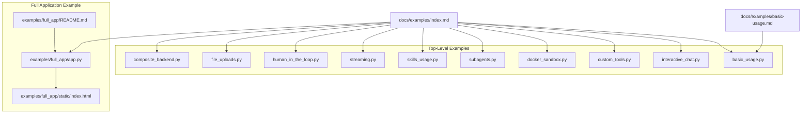
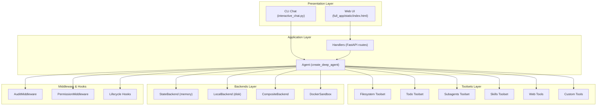
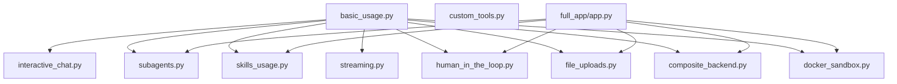

# Examples and Tutorials

<cite>
**Referenced Files in This Document**
- [README.md](file://README.md)
- [examples/basic_usage.py](file://examples/basic_usage.py)
- [examples/interactive_chat.py](file://examples/interactive_chat.py)
- [examples/custom_tools.py](file://examples/custom_tools.py)
- [examples/docker_sandbox.py](file://examples/docker_sandbox.py)
- [examples/full_app/app.py](file://examples/full_app/app.py)
- [examples/full_app/README.md](file://examples/full_app/README.md)
- [examples/full_app/static/index.html](file://examples/full_app/static/index.html)
- [examples/subagents.py](file://examples/subagents.py)
- [examples/skills_usage.py](file://examples/skills_usage.py)
- [examples/streaming.py](file://examples/streaming.py)
- [examples/human_in_the_loop.py](file://examples/human_in_the_loop.py)
- [examples/file_uploads.py](file://examples/file_uploads.py)
- [examples/composite_backend.py](file://examples/composite_backend.py)
- [docs/examples/index.md](file://docs/examples/index.md)
- [docs/examples/basic-usage.md](file://docs/examples/basic-usage.md)
</cite>

## Table of Contents
1. [Introduction](#introduction)
2. [Project Structure](#project-structure)
3. [Core Components](#core-components)
4. [Architecture Overview](#architecture-overview)
5. [Detailed Component Analysis](#detailed-component-analysis)
6. [Dependency Analysis](#dependency-analysis)
7. [Performance Considerations](#performance-considerations)
8. [Troubleshooting Guide](#troubleshooting-guide)
9. [Conclusion](#conclusion)
10. [Appendices](#appendices)

## Introduction
This document provides comprehensive examples and tutorials for building and operating autonomous agents with pydantic-deep. It covers practical implementation patterns, step-by-step tutorials, and best practices for:
- Basic usage and core workflows
- Interactive chat with streaming and tool visibility
- Custom tool development
- Docker sandbox integration for safe execution
- Full application examples with web UI, multi-user sessions, and production-grade features
- File operations, task execution, multi-agent systems, web integration, and deployment patterns

The goal is to enable progressive learning from simple scripts to complex, production-ready applications.

## Project Structure
The repository organizes examples and tutorials across:
- Top-level examples demonstrating individual features
- A full application example showcasing integrated capabilities
- Documentation pages that cross-reference runnable examples

**Diagram sources**
- [docs/examples/index.md](file://docs/examples/index.md)
- [examples/basic_usage.py](file://examples/basic_usage.py)
- [examples/interactive_chat.py](file://examples/interactive_chat.py)
- [examples/custom_tools.py](file://examples/custom_tools.py)
- [examples/docker_sandbox.py](file://examples/docker_sandbox.py)
- [examples/full_app/app.py](file://examples/full_app/app.py)
- [examples/full_app/README.md](file://examples/full_app/README.md)
- [examples/full_app/static/index.html](file://examples/full_app/static/index.html)

**Section sources**
- [docs/examples/index.md](file://docs/examples/index.md)
- [README.md](file://README.md)

## Core Components
This section highlights the essential building blocks demonstrated across examples and how they fit together in real-world scenarios.

- Agent creation and configuration
  - Use the default deep agent with optional toggles for toolsets, memory, hooks, and processors.
  - Reference: [examples/basic_usage.py](file://examples/basic_usage.py), [docs/examples/basic-usage.md](file://docs/examples/basic-usage.md)

- Filesystem operations
  - Create, read, edit, and execute files; use globbing and grepping; manage uploads.
  - Reference: [examples/file_uploads.py](file://examples/file_uploads.py), [examples/composite_backend.py](file://examples/composite_backend.py)

- Task execution and planning
  - Use the TODO list for multi-step planning and execution.
  - Reference: [examples/basic_usage.py](file://examples/basic_usage.py), [docs/examples/basic-usage.md](file://docs/examples/basic-usage.md)

- Subagents and delegation
  - Configure specialized subagents and coordinate work across agents.
  - Reference: [examples/subagents.py](file://examples/subagents.py)

- Skills and domain expertise
  - Discover, load, and apply skills from filesystem or programmatically.
  - Reference: [examples/skills_usage.py](file://examples/skills_usage.py)

- Streaming and progress tracking
  - Stream text deltas, tool calls, and intermediate results.
  - Reference: [examples/streaming.py](file://examples/streaming.py), [examples/interactive_chat.py](file://examples/interactive_chat.py)

- Human-in-the-loop approvals
  - Require approvals for sensitive operations like writing files or executing commands.
  - Reference: [examples/human_in_the_loop.py](file://examples/human_in_the_loop.py)

- Docker sandbox integration
  - Run code in isolated containers with pre-configured runtimes.
  - Reference: [examples/docker_sandbox.py](file://examples/docker_sandbox.py)

- Full application stack
  - Combine all features behind a FastAPI server with WebSocket streaming, multi-user sessions, and a web UI.
  - Reference: [examples/full_app/app.py](file://examples/full_app/app.py), [examples/full_app/README.md](file://examples/full_app/README.md), [examples/full_app/static/index.html](file://examples/full_app/static/index.html)

**Section sources**
- [examples/basic_usage.py](file://examples/basic_usage.py)
- [examples/file_uploads.py](file://examples/file_uploads.py)
- [examples/composite_backend.py](file://examples/composite_backend.py)
- [examples/subagents.py](file://examples/subagents.py)
- [examples/skills_usage.py](file://examples/skills_usage.py)
- [examples/streaming.py](file://examples/streaming.py)
- [examples/human_in_the_loop.py](file://examples/human_in_the_loop.py)
- [examples/docker_sandbox.py](file://examples/docker_sandbox.py)
- [examples/full_app/app.py](file://examples/full_app/app.py)
- [examples/full_app/README.md](file://examples/full_app/README.md)
- [examples/full_app/static/index.html](file://examples/full_app/static/index.html)
- [docs/examples/basic-usage.md](file://docs/examples/basic-usage.md)

## Architecture Overview
The examples demonstrate a layered architecture:
- Agent layer: orchestrates planning, tool use, and subagent delegation
- Toolsets layer: filesystem, todo, subagents, skills, web, and custom tools
- Backends layer: in-memory, local filesystem, Docker sandbox, and composite routing
- Middleware and hooks: audit, permissions, and lifecycle controls
- Presentation layer: CLI chat, streaming UI, and full web application

**Diagram sources**
- [examples/interactive_chat.py](file://examples/interactive_chat.py)
- [examples/full_app/static/index.html](file://examples/full_app/static/index.html)
- [examples/full_app/app.py](file://examples/full_app/app.py)
- [examples/composite_backend.py](file://examples/composite_backend.py)
- [examples/docker_sandbox.py](file://examples/docker_sandbox.py)

## Detailed Component Analysis

### Basic Usage Tutorial
Learn the fundamentals: creating an agent, enabling planning, and performing file operations.

- What you will learn
  - Create a deep agent with default toolsets
  - Use the TODO list for planning
  - Perform file operations (create, read, list)
  - Inspect usage statistics and todo state

- Step-by-step
  1. Create an agent with a model and instructions.
  2. Initialize dependencies with an in-memory backend.
  3. Run a multi-step task that creates a module and saves it to a file.
  4. Inspect created files and the todo list.
  5. Review token usage statistics.

- Code walkthrough
  - Agent creation and instructions: [examples/basic_usage.py](file://examples/basic_usage.py)
  - Running the agent and accessing results: [examples/basic_usage.py](file://examples/basic_usage.py)
  - Understanding dependencies and files: [examples/basic_usage.py](file://examples/basic_usage.py)

- Best practices
  - Keep instructions clear and scoped to the task.
  - Use the TODO list for complex, multi-step tasks.
  - Prefer saving outputs to files for traceability.

**Section sources**
- [examples/basic_usage.py](file://examples/basic_usage.py)
- [docs/examples/basic-usage.md](file://docs/examples/basic-usage.md)

### Interactive Chat Implementation
Build a CLI chatbot with streaming, tool visibility, and slash commands.

- What you will learn
  - Stream text deltas and tool calls
  - Display current TODOs and files
  - Handle slash commands (/quit, /clear, /files, /todos)
  - Manage conversation history across runs

- Step-by-step
  1. Create an agent with planning and filesystem capabilities.
  2. Initialize dependencies with an in-memory backend.
  3. Implement a streaming loop that prints text deltas and tool call events.
  4. Add a chat loop with input handling and command processing.
  5. Persist and reuse message history across turns.

- Code walkthrough
  - Streaming event handling: [examples/interactive_chat.py](file://examples/interactive_chat.py)
  - Chat loop and command handling: [examples/interactive_chat.py](file://examples/interactive_chat.py)
  - Agent initialization and instructions: [examples/interactive_chat.py](file://examples/interactive_chat.py)

- Best practices
  - Use streaming for responsive feedback.
  - Keep tool call visibility to aid transparency.
  - Provide clear slash commands for diagnostics.

**Section sources**
- [examples/interactive_chat.py](file://examples/interactive_chat.py)

### Custom Tool Development
Extend the agent with custom tools that integrate with the backend and dependencies.

- What you will learn
  - Define custom tools with typed parameters
  - Access dependencies (backend) inside tools
  - Combine custom logic with file operations
  - Use tools alongside built-in toolsets

- Step-by-step
  1. Define async tool functions with typed parameters.
  2. Use the backend to read/write files and append logs.
  3. Create an agent with custom tools and instruct it to use them.
  4. Run a multi-step task that leverages custom tools.

- Code walkthrough
  - Custom tools (time, logging, complexity analysis): [examples/custom_tools.py](file://examples/custom_tools.py)
  - Agent configuration with custom tools: [examples/custom_tools.py](file://examples/custom_tools.py)
  - Running the agent with custom tools: [examples/custom_tools.py](file://examples/custom_tools.py)

- Best practices
  - Keep tools focused and composable.
  - Use the backend consistently for persistence.
  - Provide clear tool descriptions in instructions.

**Section sources**
- [examples/custom_tools.py](file://examples/custom_tools.py)

### Docker Sandbox Integration
Run code in isolated containers with pre-configured runtimes for safe execution.

- What you will learn
  - Create a Docker sandbox with a default or custom runtime
  - Execute code and capture outputs
  - Use RuntimeConfig for pre-installed packages
  - Stop sandboxes cleanly

- Step-by-step
  1. Initialize a Docker sandbox with a base image or runtime.
  2. Create an agent configured for execution with interrupt-on approval.
  3. Use the sandbox as the backend for dependencies.
  4. Run tasks that create and execute code.
  5. Stop the sandbox to release resources.

- Code walkthrough
  - Basic sandbox example: [examples/docker_sandbox.py](file://examples/docker_sandbox.py)
  - RuntimeConfig usage: [examples/docker_sandbox.py](file://examples/docker_sandbox.py)
  - Custom runtime configuration: [examples/docker_sandbox.py](file://examples/docker_sandbox.py)

- Best practices
  - Choose runtimes aligned to your workload (e.g., data science).
  - Use interrupt-on for sensitive operations.
  - Always stop sandboxes to avoid resource leaks.

**Section sources**
- [examples/docker_sandbox.py](file://examples/docker_sandbox.py)

### Full Application Example
A production-ready FastAPI application with WebSocket streaming, multi-user sessions, and a web UI.

- What you will learn
  - Build a FastAPI app with WebSocket streaming
  - Manage per-session Docker containers with SessionManager
  - Integrate hooks, middleware, processors, and subagents
  - Serve a frontend with file upload, preview, and config panels

- Step-by-step
  1. Initialize shared agent and session manager with a runtime.
  2. Create routes for serving the UI and handling uploads.
  3. Implement a WebSocket endpoint that streams events to the client.
  4. Configure hooks (audit logger, safety gate) and middleware (audit, permissions).
  5. Enable skills, subagents, and processors for robust operation.
  6. Serve the frontend and expose file operations and previews.

- Code walkthrough
  - Agent creation with all features: [examples/full_app/app.py](file://examples/full_app/app.py)
  - Session management and sandbox lifecycle: [examples/full_app/app.py](file://examples/full_app/app.py)
  - WebSocket streaming protocol: [examples/full_app/app.py](file://examples/full_app/app.py)
  - Frontend HTML and tabs: [examples/full_app/static/index.html](file://examples/full_app/static/index.html)
  - Running the full app: [examples/full_app/README.md](file://examples/full_app/README.md)

- Best practices
  - Use RuntimeConfig for predictable environments.
  - Enforce safety with hooks and middleware.
  - Stream events for responsive UI.
  - Provide a config panel for observability.

**Section sources**
- [examples/full_app/app.py](file://examples/full_app/app.py)
- [examples/full_app/README.md](file://examples/full_app/README.md)
- [examples/full_app/static/index.html](file://examples/full_app/static/index.html)

### File Operations and Uploads
Work with files, upload content, and manage large or binary files.

- What you will learn
  - Upload files via helper functions or direct dependency methods
  - Analyze uploaded content with file tools
  - Paginate large files and summarize uploads
  - Handle binary files gracefully

- Step-by-step
  1. Use helper functions to upload files and run tasks.
  2. Upload files directly via dependencies with custom directories.
  3. Demonstrate large file handling with pagination hints.
  4. Upload binary files and observe metadata.

- Code walkthrough
  - Upload helpers and direct uploads: [examples/file_uploads.py](file://examples/file_uploads.py)
  - Large file pagination and grep usage: [examples/file_uploads.py](file://examples/file_uploads.py)
  - Binary file handling: [examples/file_uploads.py](file://examples/file_uploads.py)

- Best practices
  - Use offsets and limits for large files.
  - Summarize uploads in system prompts for context.
  - Treat binary files as opaque data unless decoding is safe.

**Section sources**
- [examples/file_uploads.py](file://examples/file_uploads.py)

### Composite Backend Patterns
Combine multiple backends for mixed storage strategies.

- What you will learn
  - Route operations by path prefixes
  - Mix ephemeral and persistent storage
  - Separate project files, workspace files, and temporary scratch space

- Step-by-step
  1. Create a workspace directory for persistent storage.
  2. Initialize memory and local backends.
  3. Configure a composite backend with routing rules.
  4. Run tasks that create files in different locations.
  5. Inspect memory-only and disk-persistent files.

- Code walkthrough
  - Composite backend setup and routing: [examples/composite_backend.py](file://examples/composite_backend.py)
  - Mixed storage usage: [examples/composite_backend.py](file://examples/composite_backend.py)

- Best practices
  - Use explicit routing for clarity.
  - Keep temporary files out of persistent storage.
  - Document intended storage semantics.

**Section sources**
- [examples/composite_backend.py](file://examples/composite_backend.py)

### Streaming and Progress Tracking
Track agent execution in real-time with streaming.

- What you will learn
  - Use agent iteration to process nodes as they execute
  - Track tool calls and model requests
  - Observe usage statistics and created files

- Step-by-step
  1. Initialize an agent with instructions.
  2. Iterate over execution nodes to monitor progress.
  3. Identify user prompts, model requests, tool calls, and completion.
  4. Retrieve final output and usage statistics.

- Code walkthrough
  - Streaming iteration and node inspection: [examples/streaming.py](file://examples/streaming.py)

- Best practices
  - Use streaming for long-running tasks.
  - Log node transitions for debugging.
  - Capture usage statistics for cost monitoring.

**Section sources**
- [examples/streaming.py](file://examples/streaming.py)

### Human-in-the-Loop Approvals
Require approvals for sensitive operations.

- What you will learn
  - Configure tools that require approval
  - Handle deferred tool requests
  - Approve or deny tool calls and continue execution

- Step-by-step
  1. Configure interrupt-on for sensitive tools.
  2. Run a task that triggers approvals.
  3. Simulate user decisions and continue execution.
  4. Inspect final output and created files.

- Code walkthrough
  - Approval configuration and handling: [examples/human_in_the_loop.py](file://examples/human_in_the_loop.py)

- Best practices
  - Enable approvals for destructive or sensitive operations.
  - Provide clear rationale for denials.
  - Automate approvals for low-risk operations where appropriate.

**Section sources**
- [examples/human_in_the_loop.py](file://examples/human_in_the_loop.py)

### Subagents and Multi-Agent Systems
Delegate specialized tasks to subagents and coordinate work.

- What you will learn
  - Define subagent configurations with names, descriptions, and instructions
  - Coordinate multiple subagents for distinct roles
  - Save outputs to organized file paths

- Step-by-step
  1. Define specialized subagents (e.g., code reviewer, documentation writer, test generator).
  2. Create an agent with custom subagents and general-purpose disabled.
  3. Provide a code artifact and delegate tasks to subagents.
  4. Inspect generated artifacts and synthesized results.

- Code walkthrough
  - Subagent configuration and delegation: [examples/subagents.py](file://examples/subagents.py)

- Best practices
  - Keep subagent instructions focused and scoped.
  - Use general-purpose subagents sparingly.
  - Organize outputs with clear file paths.

**Section sources**
- [examples/subagents.py](file://examples/subagents.py)

### Skills and Domain Expertise
Discover, load, and apply skills to extend capabilities.

- What you will learn
  - Discover skills from directories recursively
  - List available skills and load full instructions
  - Apply skills to code review and test generation

- Step-by-step
  1. Configure skill directories for discovery.
  2. List available skills and load detailed instructions.
  3. Use skills to guide agent behavior for specialized tasks.
  4. Inspect generated artifacts produced by skills.

- Code walkthrough
  - Skill discovery and loading: [examples/skills_usage.py](file://examples/skills_usage.py)
  - Applying skills to tasks: [examples/skills_usage.py](file://examples/skills_usage.py)

- Best practices
  - Use progressive disclosure with frontmatter and full instructions.
  - Keep skill directories organized and tagged.
  - Load skills on-demand to reduce context overhead.

**Section sources**
- [examples/skills_usage.py](file://examples/skills_usage.py)

## Dependency Analysis
This section maps how examples depend on each other and on core components.

**Diagram sources**
- [examples/basic_usage.py](file://examples/basic_usage.py)
- [examples/interactive_chat.py](file://examples/interactive_chat.py)
- [examples/custom_tools.py](file://examples/custom_tools.py)
- [examples/docker_sandbox.py](file://examples/docker_sandbox.py)
- [examples/subagents.py](file://examples/subagents.py)
- [examples/skills_usage.py](file://examples/skills_usage.py)
- [examples/streaming.py](file://examples/streaming.py)
- [examples/human_in_the_loop.py](file://examples/human_in_the_loop.py)
- [examples/file_uploads.py](file://examples/file_uploads.py)
- [examples/composite_backend.py](file://examples/composite_backend.py)
- [examples/full_app/app.py](file://examples/full_app/app.py)

**Section sources**
- [examples/basic_usage.py](file://examples/basic_usage.py)
- [examples/full_app/app.py](file://examples/full_app/app.py)

## Performance Considerations
- Streaming improves responsiveness for long tasks.
  - Reference: [examples/streaming.py](file://examples/streaming.py), [examples/interactive_chat.py](file://examples/interactive_chat.py)

- Use processors to manage conversation length and tool output size.
  - Sliding window processor trims history efficiently.
  - Eviction processor saves large tool outputs to files.
  - Patch tool calls processor repairs orphaned results on resume.
  - Reference: [examples/full_app/app.py](file://examples/full_app/app.py)

- Optimize file operations with pagination for large files.
  - Reference: [examples/file_uploads.py](file://examples/file_uploads.py)

- Docker sandbox performance tips
  - Use pre-configured runtimes to avoid repeated installs.
  - Reuse sandboxes across tasks when feasible.
  - Stop sandboxes after use to free resources.
  - Reference: [examples/docker_sandbox.py](file://examples/docker_sandbox.py)

[No sources needed since this section provides general guidance]

## Troubleshooting Guide
- Docker not available or not running
  - Symptom: Errors when initializing Docker sandbox.
  - Resolution: Install Docker and ensure the daemon is running; verify the Docker package is available.
  - Reference: [examples/docker_sandbox.py](file://examples/docker_sandbox.py)

- API key missing
  - Symptom: Authentication errors when calling models.
  - Resolution: Set the required environment variable (e.g., OPENAI_API_KEY or ANTHROPIC_API_KEY).
  - Reference: [docs/examples/index.md](file://docs/examples/index.md)

- Approvals required for sensitive operations
  - Symptom: Agent returns deferred approvals for write_file or execute.
  - Resolution: Approve or deny as needed; continue execution with deferred results.
  - Reference: [examples/human_in_the_loop.py](file://examples/human_in_the_loop.py)

- Permission middleware blocking file access
  - Symptom: Access to sensitive paths is blocked.
  - Resolution: Adjust permissions or use allowed paths.
  - Reference: [examples/full_app/app.py](file://examples/full_app/app.py)

- Large tool outputs causing context overflow
  - Symptom: Conversation trimmed or eviction triggered.
  - Resolution: Enable eviction processor and review tool output sizes.
  - Reference: [examples/full_app/app.py](file://examples/full_app/app.py)

**Section sources**
- [examples/docker_sandbox.py](file://examples/docker_sandbox.py)
- [docs/examples/index.md](file://docs/examples/index.md)
- [examples/human_in_the_loop.py](file://examples/human_in_the_loop.py)
- [examples/full_app/app.py](file://examples/full_app/app.py)

## Conclusion
These examples and tutorials provide a comprehensive path from basic agent usage to a full-featured web application with streaming, multi-user sessions, Docker sandboxing, and production-grade safety and observability. Use them as a foundation to build custom agents tailored to your workflows, integrating file operations, task execution, multi-agent coordination, and secure execution environments.

[No sources needed since this section summarizes without analyzing specific files]

## Appendices
- Quick-start recipes
  - Hello world: [examples/basic_usage.py](file://examples/basic_usage.py)
  - Create a file: [examples/basic_usage.py](file://examples/basic_usage.py)
  - Plan a task: [examples/basic_usage.py](file://examples/basic_usage.py)
  - Delegate to subagent: [examples/subagents.py](file://examples/subagents.py)
  - Use skills: [examples/skills_usage.py](file://examples/skills_usage.py)

- Running examples
  - Set your API key and run examples from the examples directory.
  - Reference: [docs/examples/index.md](file://docs/examples/index.md)

**Section sources**
- [docs/examples/index.md](file://docs/examples/index.md)
- [examples/basic_usage.py](file://examples/basic_usage.py)
- [examples/subagents.py](file://examples/subagents.py)
- [examples/skills_usage.py](file://examples/skills_usage.py)