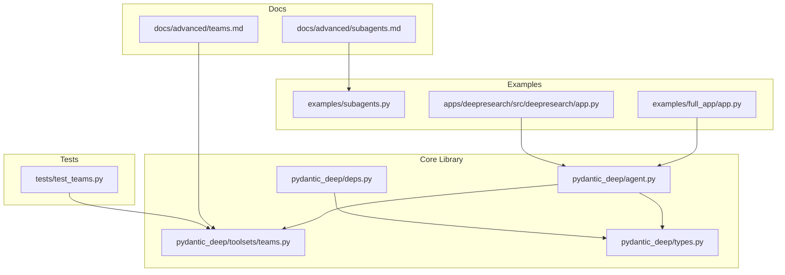
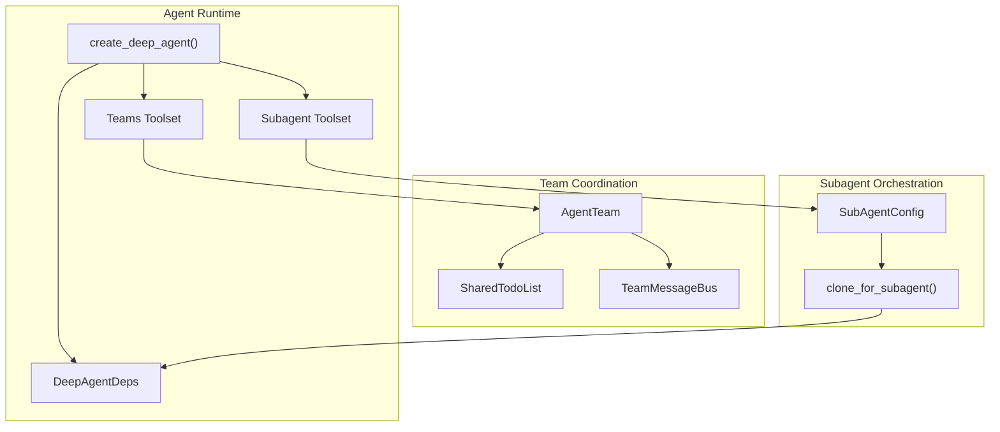
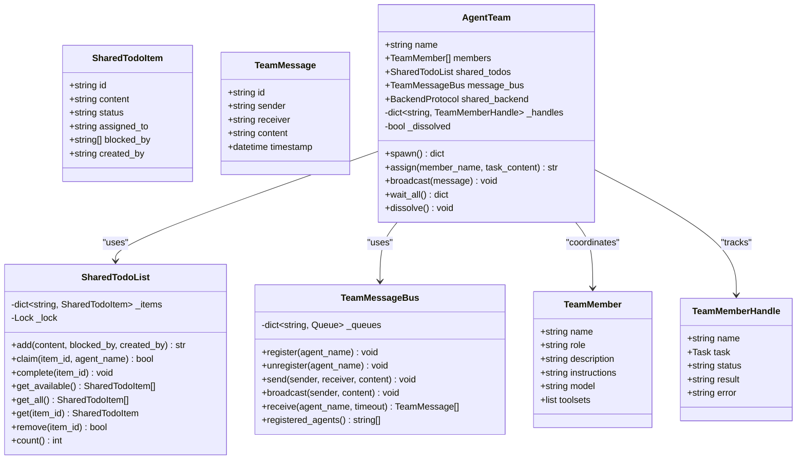
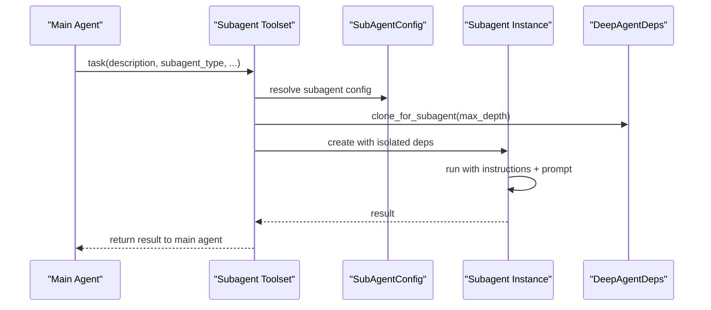
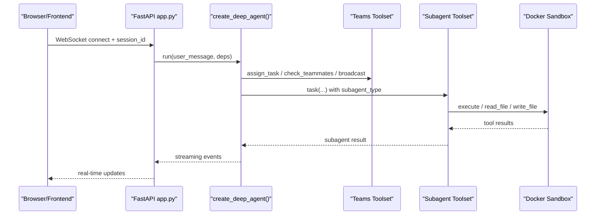
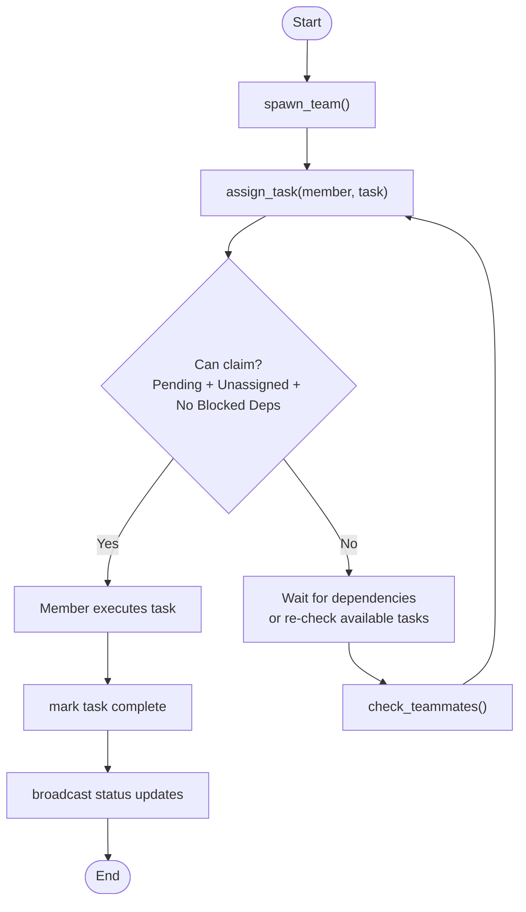
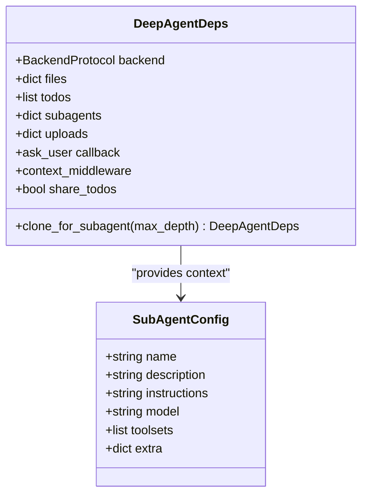
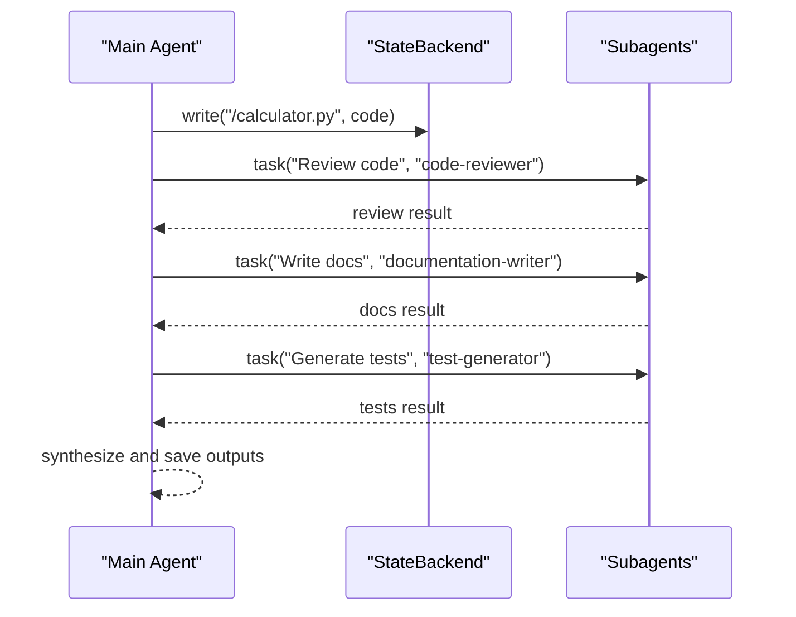
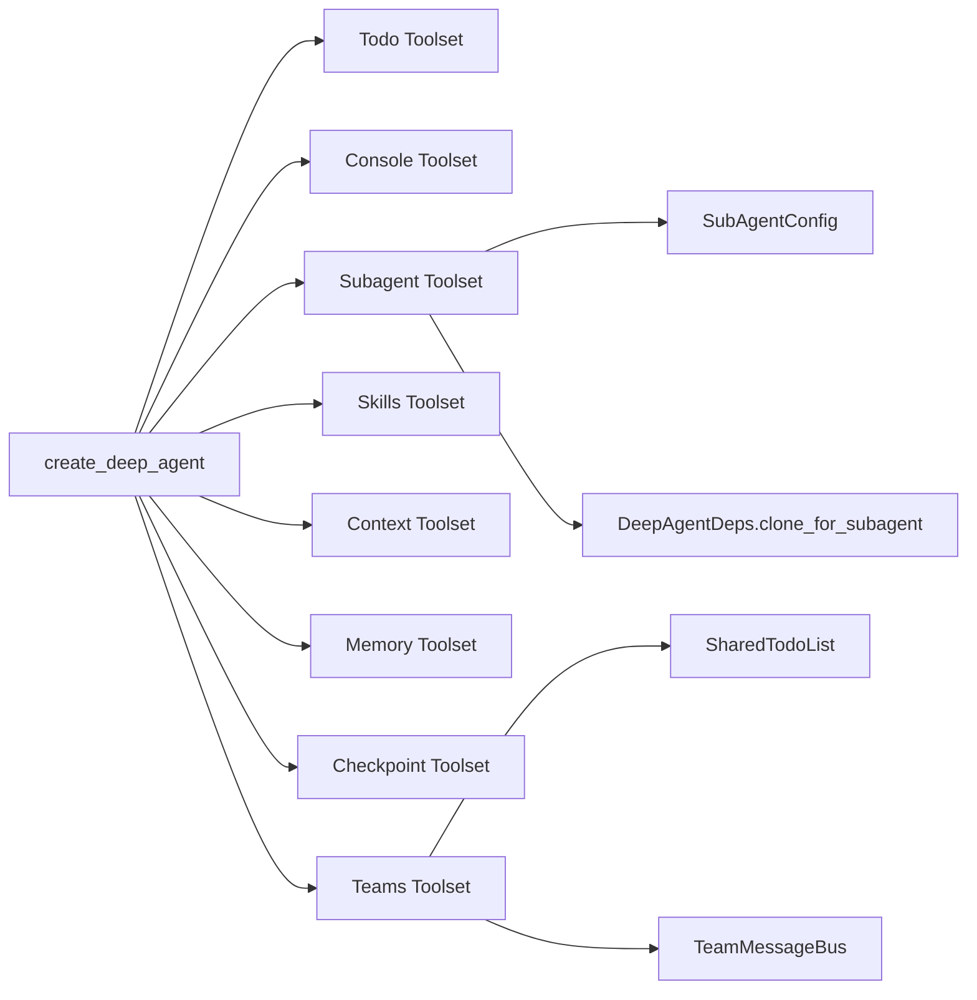

# Multi-Agent Systems

<cite>
**Referenced Files in This Document**
- [subagents.py](file://examples/subagents.py)
- [teams.py](file://pydantic_deep/toolsets/teams.py)
- [subagents.md](file://docs/advanced/subagents.md)
- [teams.md](file://docs/advanced/teams.md)
- [agent.py](file://pydantic_deep/agent.py)
- [deps.py](file://pydantic_deep/deps.py)
- [types.py](file://pydantic_deep/types.py)
- [app.py](file://examples/full_app/app.py)
- [app.py](file://apps/deepresearch/src/deepresearch/app.py)
- [test_teams.py](file://tests/test_teams.py)
</cite>

## Table of Contents
1. [Introduction](#introduction)
2. [Project Structure](#project-structure)
3. [Core Components](#core-components)
4. [Architecture Overview](#architecture-overview)
5. [Detailed Component Analysis](#detailed-component-analysis)
6. [Dependency Analysis](#dependency-analysis)
7. [Performance Considerations](#performance-considerations)
8. [Troubleshooting Guide](#troubleshooting-guide)
9. [Conclusion](#conclusion)
10. [Appendices](#appendices)

## Introduction
This document explains how to build and operate Multi-Agent Systems with pydantic-deep, focusing on team collaboration, subagent orchestration, and distributed task execution. It covers:
- Agent teams with shared state, peer-to-peer messaging, and coordinated task management
- Subagents for specialized delegation, context isolation, and parallel execution
- Practical examples and full application workflows
- Team configuration, role assignment, and conflict resolution strategies
- Scaling patterns and managing agent interactions

## Project Structure
The repository provides:
- Core multi-agent building blocks in pydantic_deep/toolsets
- Advanced documentation in docs/advanced
- End-to-end examples in examples/ and apps/
- Tests validating team behavior

**Diagram sources**
- [agent.py:196-800](file://pydantic_deep/agent.py#L196-L800)
- [deps.py:18-207](file://pydantic_deep/deps.py#L18-L207)
- [teams.py:1-533](file://pydantic_deep/toolsets/teams.py#L1-L533)
- [types.py:1-99](file://pydantic_deep/types.py#L1-L99)
- [subagents.md:1-471](file://docs/advanced/subagents.md#L1-L471)
- [teams.md:1-177](file://docs/advanced/teams.md#L1-L177)
- [subagents.py:1-114](file://examples/subagents.py#L1-L114)
- [app.py:579-737](file://examples/full_app/app.py#L579-L737)
- [app.py:636-737](file://apps/deepresearch/src/deepresearch/app.py#L636-L737)
- [test_teams.py:525-558](file://tests/test_teams.py#L525-L558)

**Section sources**
- [agent.py:196-800](file://pydantic_deep/agent.py#L196-L800)
- [deps.py:18-207](file://pydantic_deep/deps.py#L18-L207)
- [teams.py:1-533](file://pydantic_deep/toolsets/teams.py#L1-L533)
- [types.py:1-99](file://pydantic_deep/types.py#L1-L99)
- [subagents.md:1-471](file://docs/advanced/subagents.md#L1-L471)
- [teams.md:1-177](file://docs/advanced/teams.md#L1-L177)
- [subagents.py:1-114](file://examples/subagents.py#L1-L114)
- [app.py:579-737](file://examples/full_app/app.py#L579-L737)
- [app.py:636-737](file://apps/deepresearch/src/deepresearch/app.py#L636-L737)
- [test_teams.py:525-558](file://tests/test_teams.py#L525-L558)

## Core Components
- Agent teams: Shared TODO list, peer-to-peer message bus, and team lifecycle management
- Subagents: Specialized agents with isolated context, delegation, and optional nested delegation
- Shared state: DeepAgentDeps for backend, files, todos, uploads, and subagent registry
- Toolsets: Teams toolset and subagent toolset integrated into create_deep_agent()

Key capabilities:
- Spawn teams, assign tasks, broadcast messages, and dissolve teams
- Configure subagents with custom models, toolsets, and instructions
- Share or isolate todos between parent and subagents
- Enable dynamic agent factories and dual-mode subagent execution

**Section sources**
- [teams.py:252-307](file://pydantic_deep/toolsets/teams.py#L252-L307)
- [teams.py:354-533](file://pydantic_deep/toolsets/teams.py#L354-L533)
- [subagents.md:189-246](file://docs/advanced/subagents.md#L189-L246)
- [agent.py:196-800](file://pydantic_deep/agent.py#L196-L800)
- [deps.py:18-207](file://pydantic_deep/deps.py#L18-L207)

## Architecture Overview
The multi-agent architecture combines:
- Central agent with subagent toolset for delegation
- Optional team toolset for collaborative workflows
- Shared state via DeepAgentDeps (backend, files, todos, uploads)
- Async coordination primitives (locks, queues, tasks)

**Diagram sources**
- [agent.py:538-621](file://pydantic_deep/agent.py#L538-L621)
- [teams.py:252-307](file://pydantic_deep/toolsets/teams.py#L252-L307)
- [teams.py:354-533](file://pydantic_deep/toolsets/teams.py#L354-L533)
- [deps.py:174-196](file://pydantic_deep/deps.py#L174-L196)
- [types.py:29-32](file://pydantic_deep/types.py#L29-L32)

**Section sources**
- [agent.py:538-621](file://pydantic_deep/agent.py#L538-L621)
- [teams.py:252-307](file://pydantic_deep/toolsets/teams.py#L252-L307)
- [deps.py:174-196](file://pydantic_deep/deps.py#L174-L196)
- [types.py:29-32](file://pydantic_deep/types.py#L29-L32)

## Detailed Component Analysis

### Agent Teams: Shared State and Messaging
Agent teams coordinate through:
- SharedTodoList: Async-safe task management with claiming and dependencies
- TeamMessageBus: Peer-to-peer messaging with registration and broadcast
- AgentTeam: Lifecycle management (spawn, assign, broadcast, wait_all, dissolve)

**Diagram sources**
- [teams.py:21-129](file://pydantic_deep/toolsets/teams.py#L21-L129)
- [teams.py:136-217](file://pydantic_deep/toolsets/teams.py#L136-L217)
- [teams.py:224-245](file://pydantic_deep/toolsets/teams.py#L224-L245)
- [teams.py:252-307](file://pydantic_deep/toolsets/teams.py#L252-L307)

**Section sources**
- [teams.py:21-129](file://pydantic_deep/toolsets/teams.py#L21-L129)
- [teams.py:136-217](file://pydantic_deep/toolsets/teams.py#L136-L217)
- [teams.py:224-307](file://pydantic_deep/toolsets/teams.py#L224-L307)
- [teams.md:43-103](file://docs/advanced/teams.md#L43-L103)

### Subagents: Specialized Delegation and Parallel Execution
Subagents enable:
- Specialized roles with focused instructions
- Context isolation via clone_for_subagent()
- Optional general-purpose subagent and dynamic agent registry
- Dual-mode execution (sync, async, auto) and task management tools

**Diagram sources**
- [subagents.md:61-81](file://docs/advanced/subagents.md#L61-L81)
- [deps.py:174-196](file://pydantic_deep/deps.py#L174-L196)
- [agent.py:612-621](file://pydantic_deep/agent.py#L612-L621)

**Section sources**
- [subagents.md:189-246](file://docs/advanced/subagents.md#L189-L246)
- [subagents.md:363-424](file://docs/advanced/subagents.md#L363-L424)
- [deps.py:174-196](file://pydantic_deep/deps.py#L174-L196)
- [agent.py:612-621](file://pydantic_deep/agent.py#L612-L621)

### Full Application Examples: Complex Workflows and Inter-Agent Messaging
Two end-to-end applications demonstrate:
- Full-featured web app with subagents, skills, middleware, and streaming
- DeepResearch with MCP servers, plan mode, Excalidraw, and background tasks

**Diagram sources**
- [app.py:776-800](file://examples/full_app/app.py#L776-L800)
- [app.py:579-737](file://examples/full_app/app.py#L579-L737)
- [app.py:719-800](file://apps/deepresearch/src/deepresearch/app.py#L719-L800)
- [teams.py:354-533](file://pydantic_deep/toolsets/teams.py#L354-L533)
- [agent.py:538-621](file://pydantic_deep/agent.py#L538-L621)

**Section sources**
- [app.py:579-737](file://examples/full_app/app.py#L579-L737)
- [app.py:636-737](file://apps/deepresearch/src/deepresearch/app.py#L636-L737)
- [teams.py:354-533](file://pydantic_deep/toolsets/teams.py#L354-L533)
- [agent.py:538-621](file://pydantic_deep/agent.py#L538-L621)

### Team Configuration, Role Assignment, and Conflict Resolution
- Team configuration: spawn_team defines members with name, role, description, instructions
- Role assignment: assign_task adds a shared task and claims it for a member
- Conflict resolution: SharedTodoList checks dependencies and availability before claiming
- Messaging: broadcast and direct send enable coordination among members

**Diagram sources**
- [teams.py:382-450](file://pydantic_deep/toolsets/teams.py#L382-L450)
- [teams.py:66-84](file://pydantic_deep/toolsets/teams.py#L66-L84)
- [teams.py:93-108](file://pydantic_deep/toolsets/teams.py#L93-L108)

**Section sources**
- [teams.py:382-450](file://pydantic_deep/toolsets/teams.py#L382-L450)
- [teams.py:66-108](file://pydantic_deep/toolsets/teams.py#L66-L108)
- [teams.md:43-81](file://docs/advanced/teams.md#L43-L81)

### Shared State Management and Context Isolation
- DeepAgentDeps encapsulates backend, files, todos, uploads, and subagents
- clone_for_subagent controls context isolation:
  - Shared backend and files
  - Fresh or shared todos depending on share_todos
  - Optional nested delegation via max_depth
- Subagents inherit toolsets and context while maintaining isolated planning

**Diagram sources**
- [deps.py:18-196](file://pydantic_deep/deps.py#L18-L196)
- [types.py:29-32](file://pydantic_deep/types.py#L29-L32)

**Section sources**
- [deps.py:18-196](file://pydantic_deep/deps.py#L18-L196)
- [types.py:29-32](file://pydantic_deep/types.py#L29-L32)
- [subagents.md:82-107](file://docs/advanced/subagents.md#L82-L107)

### Examples from subagents.py: Creation, Delegation, and Parallel Patterns
- Defines specialized subagents (code-reviewer, documentation-writer, test-generator)
- Creates main agent with subagents and delegates multi-step tasks
- Demonstrates parallel execution via subagent toolset

**Diagram sources**
- [subagents.py:15-114](file://examples/subagents.py#L15-L114)

**Section sources**
- [subagents.py:15-114](file://examples/subagents.py#L15-L114)
- [subagents.md:189-246](file://docs/advanced/subagents.md#L189-L246)

## Dependency Analysis
- create_deep_agent wires toolsets: todo, console, subagent, skills, context, memory, checkpoint, teams, web
- Teams toolset depends on SharedTodoList and TeamMessageBus
- Subagent toolset depends on SubAgentConfig and DeepAgentDeps cloning
- Tests validate spawn, assign, and broadcast behaviors

**Diagram sources**
- [agent.py:506-718](file://pydantic_deep/agent.py#L506-L718)
- [teams.py:354-533](file://pydantic_deep/toolsets/teams.py#L354-L533)
- [deps.py:174-196](file://pydantic_deep/deps.py#L174-L196)
- [types.py:29-32](file://pydantic_deep/types.py#L29-L32)

**Section sources**
- [agent.py:506-718](file://pydantic_deep/agent.py#L506-L718)
- [test_teams.py:525-558](file://tests/test_teams.py#L525-L558)

## Performance Considerations
- Prefer depth 0 or 1 nesting for subagents to avoid exponential cost growth
- Use async subagent execution for long-running tasks to keep the main thread responsive
- Leverage eviction processors and sliding windows to manage context size
- Use share_todos judiciously—shared todos can reduce duplication but increase contention
- Scale teams by distributing tasks across members and minimizing cross-dependencies

[No sources needed since this section provides general guidance]

## Troubleshooting Guide
Common issues and resolutions:
- Team already active: Call dissolve_team before spawn_team
- Member not found: Use check_teammates to list available members
- Receiver not registered: Ensure agent is registered on the message bus
- Task not claimed: Verify dependencies are completed and task is pending/unassigned
- Subagent stuck: Check ask_parent limits and ensure parent can respond to questions

**Section sources**
- [teams.py:398-400](file://pydantic_deep/toolsets/teams.py#L398-L400)
- [teams.py:441-447](file://pydantic_deep/toolsets/teams.py#L441-L447)
- [teams.py:171-173](file://pydantic_deep/toolsets/teams.py#L171-L173)
- [teams.py:74-84](file://pydantic_deep/toolsets/teams.py#L74-L84)
- [subagents.md:400-424](file://docs/advanced/subagents.md#L400-L424)

## Conclusion
pydantic-deep provides robust primitives for multi-agent systems:
- Teams for shared state and peer-to-peer coordination
- Subagents for specialized, context-isolated delegation
- Rich toolsets and shared state management for scalable, distributed workflows

Adopt the patterns documented here to configure teams, assign roles, resolve conflicts, and scale agent interactions effectively.

[No sources needed since this section summarizes without analyzing specific files]

## Appendices

### Team Toolset API Summary
- spawn_team(team_name, members): Create and register a team
- assign_task(member_name, task_description): Add and claim a shared task
- check_teammates(): Inspect member statuses and shared tasks
- message_teammate(member_name, message): Send a direct message
- dissolve_team(): Shut down the team and release resources

**Section sources**
- [teams.py:354-533](file://pydantic_deep/toolsets/teams.py#L354-L533)
- [teams.md:13-22](file://docs/advanced/teams.md#L13-L22)

### Subagent Toolset API Summary
- task(description, subagent_type, mode="sync|async|auto", ...): Delegate to a subagent
- check_task(task_id), list_active_tasks(), soft_cancel_task(), hard_cancel_task(): Manage async tasks
- ask_parent(question, max_questions): Ask the parent for clarification

**Section sources**
- [subagents.md:389-424](file://docs/advanced/subagents.md#L389-L424)
- [subagents.md:400-424](file://docs/advanced/subagents.md#L400-L424)