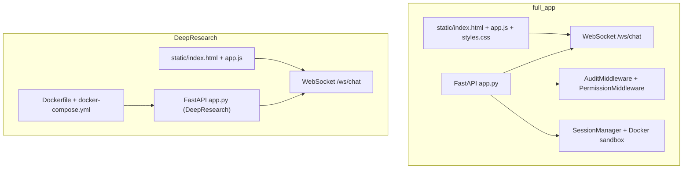
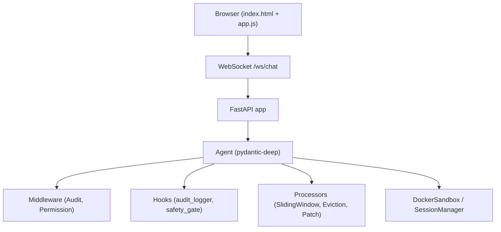
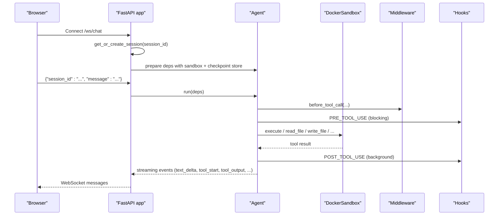
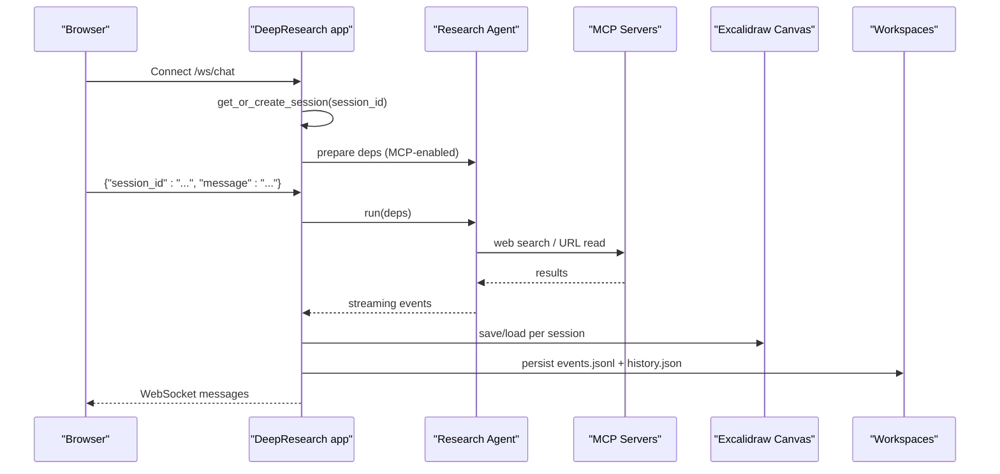
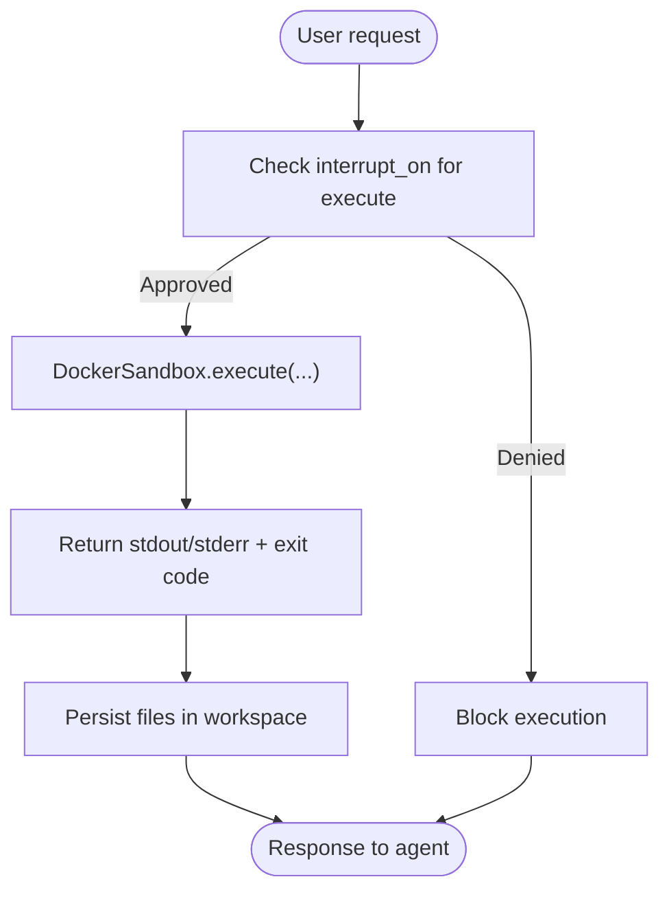
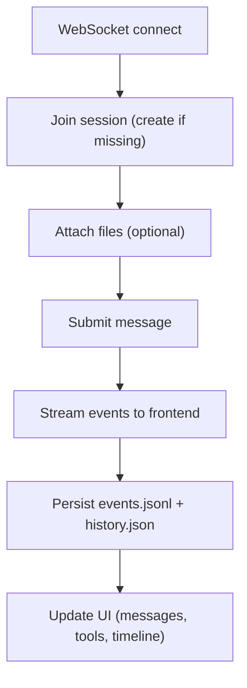
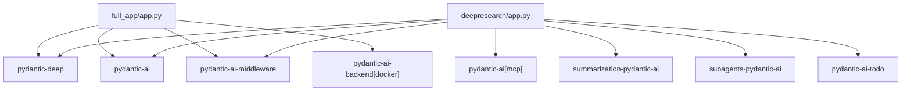

# Web Integration Examples

<cite>
**Referenced Files in This Document**
- [full_app/app.py](file://examples/full_app/app.py)
- [full_app/README.md](file://examples/full_app/README.md)
- [full_app/github_tools.py](file://examples/full_app/github_tools.py)
- [full_app/audit_middleware.py](file://examples/full_app/audit_middleware.py)
- [full_app/static/index.html](file://examples/full_app/static/index.html)
- [full_app/static/app.js](file://examples/full_app/static/app.js)
- [full_app/static/styles.css](file://examples/full_app/static/styles.css)
- [deepresearch/app.py](file://apps/deepresearch/src/deepresearch/app.py)
- [deepresearch/Dockerfile](file://apps/deepresearch/Dockerfile)
- [deepresearch/docker-compose.yml](file://apps/deepresearch/docker-compose.yml)
- [deepresearch/pyproject.toml](file://apps/deepresearch/pyproject.toml)
- [deepresearch/static/index.html](file://apps/deepresearch/static/index.html)
- [deepresearch/static/app.js](file://apps/deepresearch/static/app.js)
- [docker_sandbox.py](file://examples/docker_sandbox.py)
- [docker-sandbox.md](file://docs/examples/docker-sandbox.md)
</cite>

## Table of Contents
1. [Introduction](#introduction)
2. [Project Structure](#project-structure)
3. [Core Components](#core-components)
4. [Architecture Overview](#architecture-overview)
5. [Detailed Component Analysis](#detailed-component-analysis)
6. [Dependency Analysis](#dependency-analysis)
7. [Performance Considerations](#performance-considerations)
8. [Troubleshooting Guide](#troubleshooting-guide)
9. [Conclusion](#conclusion)
10. [Appendices](#appendices)

## Introduction
This document explains web integration patterns for pydantic-deep agent applications, focusing on:
- Complete web application implementation with agent integration (full_app example)
- DeepResearch application walkthrough (web-based agent interfaces, real-time communication, user interaction)
- Docker sandbox integration, containerized deployments, and security considerations
- Web API patterns, session management, and state persistence
- Deployment strategies and scaling considerations

It synthesizes the FastAPI + WebSocket streaming architecture, middleware and hooks for safety and observability, Docker sandboxing for safe code execution, and multi-user session isolation.

## Project Structure
Two primary examples demonstrate web integration:
- full_app: A feature-complete FastAPI application with WebSocket streaming, human-in-the-loop approvals, file uploads, and multi-user sessions with Docker sandbox isolation
- DeepResearch: A specialized research agent with MCP-powered web search, Excalidraw diagram canvas, and robust session persistence

**Diagram sources**
- [full_app/app.py:776-800](file://examples/full_app/app.py#L776-L800)
- [full_app/static/index.html:1-168](file://examples/full_app/static/index.html#L1-L168)
- [full_app/static/app.js:1-120](file://examples/full_app/static/app.js#L1-L120)
- [deepresearch/app.py:719-800](file://apps/deepresearch/src/deepresearch/app.py#L719-L800)
- [deepresearch/Dockerfile:1-48](file://apps/deepresearch/Dockerfile#L1-L48)
- [deepresearch/docker-compose.yml:1-29](file://apps/deepresearch/docker-compose.yml#L1-L29)

**Section sources**
- [full_app/README.md:115-137](file://examples/full_app/README.md#L115-L137)
- [full_app/app.py:743-760](file://examples/full_app/app.py#L743-L760)
- [deepresearch/app.py:692-711](file://apps/deepresearch/src/deepresearch/app.py#L692-L711)

## Core Components
- FastAPI application with WebSocket streaming for real-time agent interactions
- Session management with per-user Docker sandbox isolation and persistent workspaces
- Middleware for audit logging and permission enforcement
- Hooks for lifecycle monitoring and safety gating
- Frontend with responsive UI, file tree, live previews, and real-time event rendering
- Docker sandbox for safe code execution with optional runtime configurations

Key implementation references:
- WebSocket endpoint and streaming protocol: [full_app/app.py:776-800](file://examples/full_app/app.py#L776-L800), [deepresearch/app.py:719-800](file://apps/deepresearch/src/deepresearch/app.py#L719-L800)
- Session creation and sandbox isolation: [full_app/app.py:665-693](file://examples/full_app/app.py#L665-L693), [deepresearch/app.py:562-602](file://apps/deepresearch/src/deepresearch/app.py#L562-L602)
- Middleware and hooks: [full_app/audit_middleware.py:34-140](file://examples/full_app/audit_middleware.py#L34-L140), [full_app/app.py:355-370](file://examples/full_app/app.py#L355-L370)
- Frontend integration: [full_app/static/index.html:1-168](file://examples/full_app/static/index.html#L1-L168), [full_app/static/app.js:1-120](file://examples/full_app/static/app.js#L1-L120), [deepresearch/static/index.html:1-176](file://apps/deepresearch/static/index.html#L1-L176), [deepresearch/static/app.js:1-120](file://apps/deepresearch/static/app.js#L1-L120)

**Section sources**
- [full_app/app.py:302-370](file://examples/full_app/app.py#L302-L370)
- [full_app/audit_middleware.py:34-140](file://examples/full_app/audit_middleware.py#L34-L140)
- [full_app/static/index.html:1-168](file://examples/full_app/static/index.html#L1-L168)
- [deepresearch/app.py:478-580](file://apps/deepresearch/src/deepresearch/app.py#L478-L580)

## Architecture Overview
The applications use a layered architecture:
- Presentation layer: FastAPI routes and WebSocket handlers
- Domain layer: Agent orchestration with toolsets, subagents, skills, and processors
- Infrastructure layer: Docker sandbox, SessionManager, and persistence
- Frontend layer: Single-page app with WebSocket-driven UI updates

**Diagram sources**
- [full_app/app.py:743-760](file://examples/full_app/app.py#L743-L760)
- [full_app/app.py:776-800](file://examples/full_app/app.py#L776-L800)
- [full_app/app.py:579-655](file://examples/full_app/app.py#L579-L655)
- [full_app/audit_middleware.py:34-140](file://examples/full_app/audit_middleware.py#L34-L140)
- [full_app/app.py:355-370](file://examples/full_app/app.py#L355-L370)

## Detailed Component Analysis

### Full-App Example: Complete Web Application
The full_app example wires together all pydantic-deep features behind a FastAPI interface with WebSocket streaming.

- Agent creation with comprehensive toolsets, subagents, skills, processors, and hooks
- Session management with per-user Docker sandbox and persistent workspaces
- Middleware for audit and permission enforcement
- Frontend with file operations, live previews, and real-time event rendering

**Diagram sources**
- [full_app/app.py:665-693](file://examples/full_app/app.py#L665-L693)
- [full_app/app.py:776-800](file://examples/full_app/app.py#L776-L800)
- [full_app/app.py:579-655](file://examples/full_app/app.py#L579-L655)
- [full_app/audit_middleware.py:34-140](file://examples/full_app/audit_middleware.py#L34-L140)
- [full_app/app.py:355-370](file://examples/full_app/app.py#L355-L370)

**Section sources**
- [full_app/app.py:579-655](file://examples/full_app/app.py#L579-L655)
- [full_app/app.py:665-693](file://examples/full_app/app.py#L665-L693)
- [full_app/app.py:776-800](file://examples/full_app/app.py#L776-L800)
- [full_app/audit_middleware.py:34-140](file://examples/full_app/audit_middleware.py#L34-L140)
- [full_app/README.md:1-120](file://examples/full_app/README.md#L1-L120)

### DeepResearch Application Walkthrough
DeepResearch specializes in research tasks with MCP-powered web search, URL reading, and Excalidraw diagramming.

- WebSocket streaming with session persistence and replay
- Excalidraw canvas isolation per session with save/load
- JSONL event logging and timeline panels
- Background task monitoring and notifications

**Diagram sources**
- [deepresearch/app.py:562-602](file://apps/deepresearch/src/deepresearch/app.py#L562-L602)
- [deepresearch/app.py:719-800](file://apps/deepresearch/src/deepresearch/app.py#L719-L800)
- [deepresearch/Dockerfile:1-48](file://apps/deepresearch/Dockerfile#L1-L48)

**Section sources**
- [deepresearch/app.py:478-580](file://apps/deepresearch/src/deepresearch/app.py#L478-L580)
- [deepresearch/app.py:562-602](file://apps/deepresearch/src/deepresearch/app.py#L562-L602)
- [deepresearch/app.py:719-800](file://apps/deepresearch/src/deepresearch/app.py#L719-L800)
- [deepresearch/static/index.html:1-176](file://apps/deepresearch/static/index.html#L1-L176)
- [deepresearch/static/app.js:1-120](file://apps/deepresearch/static/app.js#L1-L120)

### Docker Sandbox Integration
Both examples rely on Docker sandboxing for safe code execution and file operations.

- DockerSandbox provides isolated execution with configurable images and work directories
- SessionManager automates per-session persistent storage and container lifecycle
- RuntimeConfig enables pre-installed environments (e.g., python-datascience)
- Human-in-the-loop approval for execute prevents unintended system access

**Diagram sources**
- [docker_sandbox.py:17-55](file://examples/docker_sandbox.py#L17-L55)
- [docker_sandbox.py:57-93](file://examples/docker_sandbox.py#L57-L93)
- [docker_sandbox.py:95-139](file://examples/docker_sandbox.py#L95-L139)
- [docs/examples/docker-sandbox.md:268-285](file://docs/examples/docker-sandbox.md#L268-L285)

**Section sources**
- [docker_sandbox.py:17-139](file://examples/docker_sandbox.py#L17-L139)
- [docs/examples/docker-sandbox.md:268-350](file://docs/examples/docker-sandbox.md#L268-L350)

### Web API Patterns, Session Management, and State Persistence
- WebSocket protocol defines standardized event types for streaming text, tool calls, approvals, and checkpoints
- SessionManager creates per-user Docker containers and persists workspaces to disk
- Frontend maintains state locally (localStorage) and renders real-time updates
- JSONL event logging enables session replay and timeline visualization

**Diagram sources**
- [full_app/app.py:776-800](file://examples/full_app/app.py#L776-L800)
- [deepresearch/app.py:719-800](file://apps/deepresearch/src/deepresearch/app.py#L719-L800)
- [deepresearch/app.py:271-284](file://apps/deepresearch/src/deepresearch/app.py#L271-L284)

**Section sources**
- [full_app/app.py:776-800](file://examples/full_app/app.py#L776-L800)
- [deepresearch/app.py:271-284](file://apps/deepresearch/src/deepresearch/app.py#L271-L284)
- [deepresearch/app.py:719-800](file://apps/deepresearch/src/deepresearch/app.py#L719-L800)

## Dependency Analysis
- full_app depends on pydantic-deep, pydantic-ai, pydantic-ai-middleware, and Docker backend
- DeepResearch adds pydantic-ai[mcp], summarization, subagents, and todo toolsets
- Both include SessionManager for container lifecycle and workspace persistence

**Diagram sources**
- [full_app/app.py:91-106](file://examples/full_app/app.py#L91-L106)
- [deepresearch/pyproject.toml:6-15](file://apps/deepresearch/pyproject.toml#L6-L15)

**Section sources**
- [full_app/app.py:91-106](file://examples/full_app/app.py#L91-L106)
- [deepresearch/pyproject.toml:6-15](file://apps/deepresearch/pyproject.toml#L6-L15)

## Performance Considerations
- Conversation trimming: SlidingWindowProcessor keeps recent messages to reduce latency and cost
- Large output handling: EvictionProcessor saves tool outputs exceeding token limits to files
- Streaming: WebSocket streaming minimizes perceived latency and improves UX
- Container reuse: SessionManager keeps idle containers warm within configured timeouts
- Frontend virtualization: Large file trees and timelines are rendered efficiently with incremental updates

[No sources needed since this section provides general guidance]

## Troubleshooting Guide
Common issues and resolutions:
- Docker not running: Ensure Docker daemon is available; examples require Docker for sandboxing
- Permission denials: PermissionMiddleware blocks sensitive paths; adjust tool usage or paths
- Execution timeouts: Set timeouts and review commands before approval
- WebSocket disconnects: Frontend attempts exponential backoff; verify network connectivity
- Session persistence failures: Confirm workspace directories are writable and mounted correctly

**Section sources**
- [docs/examples/docker-sandbox.md:268-350](file://docs/examples/docker-sandbox.md#L268-L350)
- [full_app/audit_middleware.py:104-140](file://examples/full_app/audit_middleware.py#L104-L140)
- [full_app/static/app.js:38-66](file://examples/full_app/static/app.js#L38-L66)

## Conclusion
The examples demonstrate robust web integration of pydantic-deep agents:
- A full-featured FastAPI application with comprehensive agent capabilities, sandboxing, and multi-user sessions
- A specialized research agent with MCP-powered search, Excalidraw integration, and session persistence
- Secure execution via Docker sandboxing, with middleware and hooks for safety and observability
- Scalable deployment patterns using Docker containers and SessionManager for per-user isolation

[No sources needed since this section summarizes without analyzing specific files]

## Appendices

### WebSocket Protocol Summary
- Client → Server: session join, user messages, approvals, cancellation, question answers
- Server → Client: session_created, start/status/text_delta/thinking_delta/tool events, response, todos_update, middleware_event, hook_event, done/error, approval_required, ask_user_question, checkpoint events, background_task_completed

**Section sources**
- [full_app/README.md:271-302](file://examples/full_app/README.md#L271-L302)
- [full_app/app.py:776-800](file://examples/full_app/app.py#L776-L800)
- [deepresearch/app.py:719-800](file://apps/deepresearch/src/deepresearch/app.py#L719-L800)

### Deployment Strategies and Scaling
- Containerization: Use Dockerfile to package the application and dependencies; expose port 8080
- Orchestration: docker-compose can manage multi-service setups (e.g., Excalidraw canvas)
- Scaling: Stateless FastAPI app scales horizontally; attach shared persistent storage for workspaces
- Security: Restrict Docker access, enforce timeouts, and apply middleware policies

**Section sources**
- [deepresearch/Dockerfile:1-48](file://apps/deepresearch/Dockerfile#L1-L48)
- [deepresearch/docker-compose.yml:1-29](file://apps/deepresearch/docker-compose.yml#L1-L29)
- [full_app/app.py:696-737](file://examples/full_app/app.py#L696-L737)