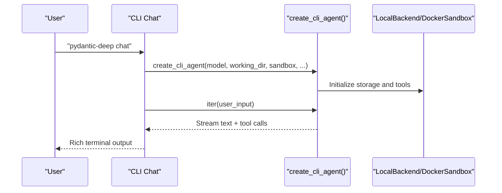
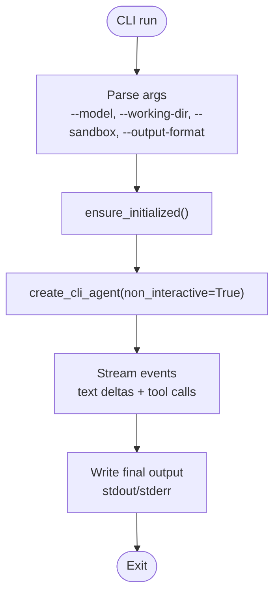
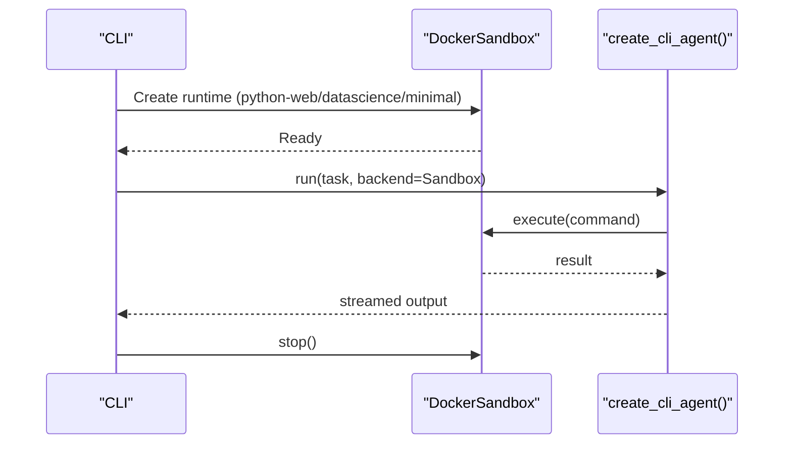
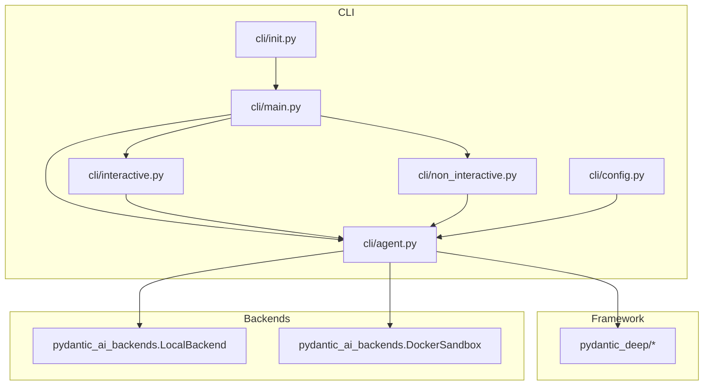

# Getting Started

<cite>
**Referenced Files in This Document**
- [README.md](file://README.md)
- [pyproject.toml](file://pyproject.toml)
- [cli/README.md](file://cli/README.md)
- [cli/main.py](file://cli/main.py)
- [cli/config.py](file://cli/config.py)
- [cli/init.py](file://cli/init.py)
- [cli/agent.py](file://cli/agent.py)
- [cli/interactive.py](file://cli/interactive.py)
- [cli/non_interactive.py](file://cli/non_interactive.py)
- [docs/installation.md](file://docs/installation.md)
- [examples/docker_sandbox.py](file://examples/docker_sandbox.py)
- [examples/basic_usage.py](file://examples/basic_usage.py)
</cite>

## Table of Contents
1. [Introduction](#introduction)
2. [Installation](#installation)
3. [Your First Agent](#your-first-agent)
4. [Essential Commands](#essential-commands)
5. [Configuration and Environment](#configuration-and-environment)
6. [Basic Usage Scenarios](#basic-usage-scenarios)
7. [Architecture Overview](#architecture-overview)
8. [Troubleshooting](#troubleshooting)
9. [Next Steps](#next-steps)

## Introduction
Pydantic Deep Agents provides a powerful framework for building autonomous AI agents with planning, filesystem access, subagents, memory, and unlimited context. It ships with:
- A full-featured CLI for terminal-based AI coding assistance
- A Python framework for building custom agents
- A reference application (DeepResearch) with a web UI

The quickest path to productivity is using the CLI to chat interactively, run single tasks, or execute in a Docker sandbox.

**Section sources**
- [README.md:64-103](file://README.md#L64-L103)

## Installation
Choose the simplest route for immediate results:

- Install the CLI-only package to get the terminal assistant right away:
  - With uv: uv add pydantic-deep[cli]
  - With pip: pip install pydantic-deep[cli]

- To use the Python framework for custom agents:
  - With uv: uv add pydantic-deep
  - With pip: pip install pydantic-deep

- Optional extras you may want later:
  - pydantic-deep[sandbox] for Docker sandbox support
  - pydantic-deep[web] for web server interfaces
  - pydantic-deep[all] for everything

Environment setup:
- Set your provider API key (e.g., ANTHROPIC_API_KEY, OPENAI_API_KEY)
- For Docker sandbox, ensure Docker is installed and running

Verify:
- The CLI is available as pydantic-deep
- Or import the framework in Python and run a simple agent

**Section sources**
- [docs/installation.md:1-77](file://docs/installation.md#L1-L77)
- [docs/installation.md:89-139](file://docs/installation.md#L89-L139)
- [pyproject.toml:36-68](file://pyproject.toml#L36-L68)

## Your First Agent
Start with the CLI’s interactive chat:
- Install pydantic-deep[cli]
- Set your API key
- Run pydantic-deep chat
- Ask it to create a small script or fix a problem in your project

Quick non-interactive run:
- pydantic-deep run "Create a README with headings and bullet points"

Tip: The CLI initializes a .pydantic-deep/ directory with scaffolding on first use, including a default config and skills.

**Section sources**
- [cli/README.md:18-24](file://cli/README.md#L18-L24)
- [cli/README.md:33-41](file://cli/README.md#L33-L41)
- [cli/README.md:42-50](file://cli/README.md#L42-L50)
- [cli/init.py:41-91](file://cli/init.py#L41-L91)

## Essential Commands
Interactive chat:
- pydantic-deep chat
- pydantic-deep chat --model provider:model-name

Single task (non-interactive):
- pydantic-deep run "Your task"
- pydantic-deep run "Your task" --quiet
- pydantic-deep run "Your task" --model provider:model-name

Docker sandbox:
- pydantic-deep run "Build a web scraper" --sandbox --runtime python-web
- pydantic-deep chat --sandbox --runtime python-datascience

Configuration:
- pydantic-deep config show
- pydantic-deep config set model openai:gpt-4.1

Skills:
- pydantic-deep skills list
- pydantic-deep skills info code-review
- pydantic-deep skills create my-skill

Threads (sessions):
- pydantic-deep threads list
- pydantic-deep threads delete abc12345

Provider info:
- pydantic-deep providers list
- pydantic-deep providers check openai:gpt-4.1

**Section sources**
- [cli/README.md:33-116](file://cli/README.md#L33-L116)
- [cli/main.py:121-292](file://cli/main.py#L121-L292)

## Configuration and Environment
Default configuration location:
- ~/.pydantic-deep/config.toml (per-user)

Key configuration options (subset):
- model: default provider/model
- working_dir: default filesystem root
- shell_allow_list: allowed shell command prefixes
- theme, charset: UI display preferences
- show_cost, show_tokens: cost/token display
- include_skills, include_plan, include_memory, include_subagents, include_todo
- context_discovery: auto-inject AGENT.md
- temperature, reasoning_effort, thinking, thinking_budget
- logfire: enable tracing

Environment variable overrides:
- PYDANTIC_DEEP_MODEL, PYDANTIC_DEEP_WORKING_DIR, PYDANTIC_DEEP_THEME, PYDANTIC_DEEP_CHARSET

Precedence:
- CLI flags > config file > defaults

**Section sources**
- [cli/config.py:70-94](file://cli/config.py#L70-L94)
- [cli/config.py:113-131](file://cli/config.py#L113-L131)
- [cli/config.py:157-162](file://cli/config.py#L157-L162)
- [cli/config.py:176-229](file://cli/config.py#L176-L229)
- [cli/README.md:98-116](file://cli/README.md#L98-L116)

## Basic Usage Scenarios
### Interactive Chat Mode
- Launch: pydantic-deep chat
- Features: slash commands (/help, /context, /model, /remember, /diff), tool call visibility, approvals, persistent memory, TODO list display
- Customize: set model, working directory, sandbox, auto-approve, thinking settings

**Diagram sources**
- [cli/interactive.py:555-625](file://cli/interactive.py#L555-L625)
- [cli/agent.py:51-295](file://cli/agent.py#L51-L295)

**Section sources**
- [cli/README.md:33-41](file://cli/README.md#L33-L41)
- [cli/interactive.py:1-120](file://cli/interactive.py#L1-L120)

### Running a Single Task (Non-Interactive)
- Use pydantic-deep run "Your task" for quick automation
- Use --quiet for clean stdout-only output
- Use --sandbox for isolated execution
- Use --output-format json/markdown/text

**Diagram sources**
- [cli/main.py:135-214](file://cli/main.py#L135-L214)
- [cli/non_interactive.py:86-212](file://cli/non_interactive.py#L86-L212)

**Section sources**
- [cli/README.md:42-50](file://cli/README.md#L42-L50)
- [cli/non_interactive.py:1-120](file://cli/non_interactive.py#L1-L120)

### Using Docker Sandbox
- Install pydantic-deep[sandbox]
- Run with --sandbox and choose a runtime (e.g., python-web, python-datascience)
- The agent executes commands inside a container for safety

**Diagram sources**
- [cli/non_interactive.py:226-248](file://cli/non_interactive.py#L226-L248)
- [examples/docker_sandbox.py:1-162](file://examples/docker_sandbox.py#L1-L162)

**Section sources**
- [cli/README.md:51-67](file://cli/README.md#L51-L67)
- [docs/installation.md:32-44](file://docs/installation.md#L32-L44)
- [examples/docker_sandbox.py:1-162](file://examples/docker_sandbox.py#L1-L162)

### Initial Agent Customization
- Change model/provider: pydantic-deep chat --model anthropic:claude-sonnet-4-20250514
- Limit shell commands: config shell_allow_list
- Adjust thinking/temperature: --thinking/--temperature or config
- Toggle features: skills, plan, memory, subagents, todo, context discovery

**Section sources**
- [cli/README.md:98-116](file://cli/README.md#L98-L116)
- [cli/agent.py:16-49](file://cli/agent.py#L16-L49)
- [cli/config.py:70-94](file://cli/config.py#L70-L94)

## Architecture Overview
At a high level, the CLI wraps the pydantic-deep framework:
- CLI entry points (Typer) dispatch to interactive or non-interactive modes
- create_cli_agent builds an agent with toolsets, memory, context, and hooks
- LocalBackend or DockerSandbox provide filesystem and execution backends
- Rich terminal UI displays streaming responses, tool calls, diffs, and costs

**Diagram sources**
- [cli/main.py:1-120](file://cli/main.py#L1-L120)
- [cli/agent.py:1-120](file://cli/agent.py#L1-L120)
- [cli/interactive.py:1-80](file://cli/interactive.py#L1-L80)
- [cli/non_interactive.py:1-80](file://cli/non_interactive.py#L1-L80)

**Section sources**
- [README.md:252-288](file://README.md#L252-L288)

## Troubleshooting
Common issues and fixes:
- Import errors: ensure Python 3.10+
- API key not found: set ANTHROPIC_API_KEY or OPENAI_API_KEY
- Docker permission denied (Linux): add user to docker group and re-login
- Provider not ready: use pydantic-deep providers list and providers check
- Sandbox not installed: pip install pydantic-deep[sandbox]
- No skills found: run pydantic-deep skills list or create a skill

Verification steps:
- pydantic-deep providers check openai:gpt-4.1
- pydantic-deep config show
- pydantic-deep threads list

**Section sources**
- [docs/installation.md:141-167](file://docs/installation.md#L141-L167)
- [cli/main.py:504-555](file://cli/main.py#L504-L555)
- [cli/non_interactive.py:39-55](file://cli/non_interactive.py#L39-L55)

## Next Steps
- Explore built-in skills: pydantic-deep skills list
- Learn the framework basics: examples/basic_usage.py
- Dive deeper: concepts, examples, and API docs in the repository

**Section sources**
- [cli/README.md:117-132](file://cli/README.md#L117-L132)
- [examples/basic_usage.py:1-53](file://examples/basic_usage.py#L1-L53)