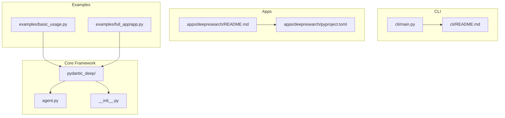
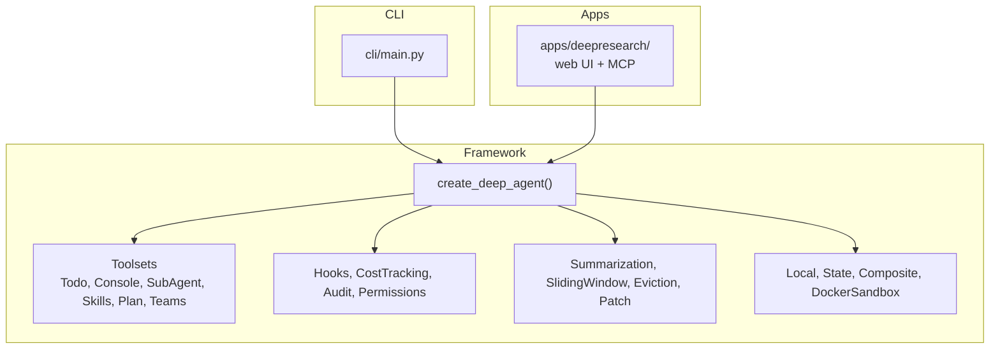
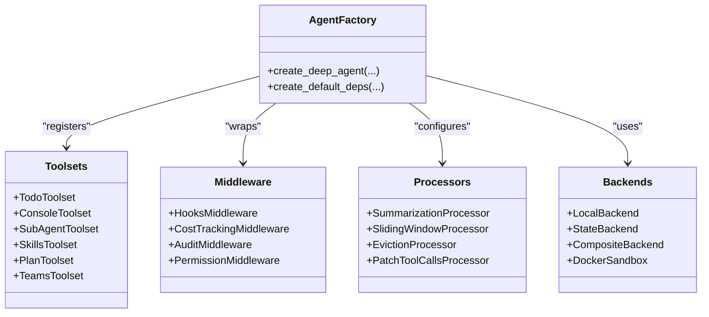
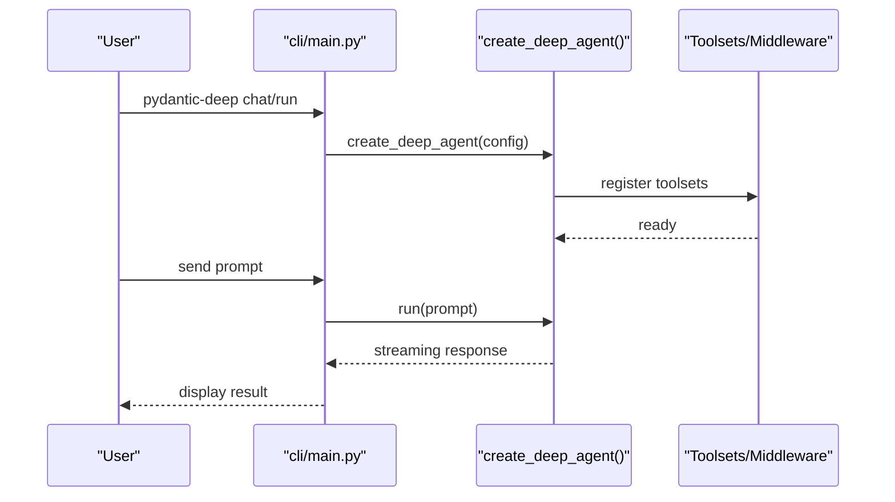
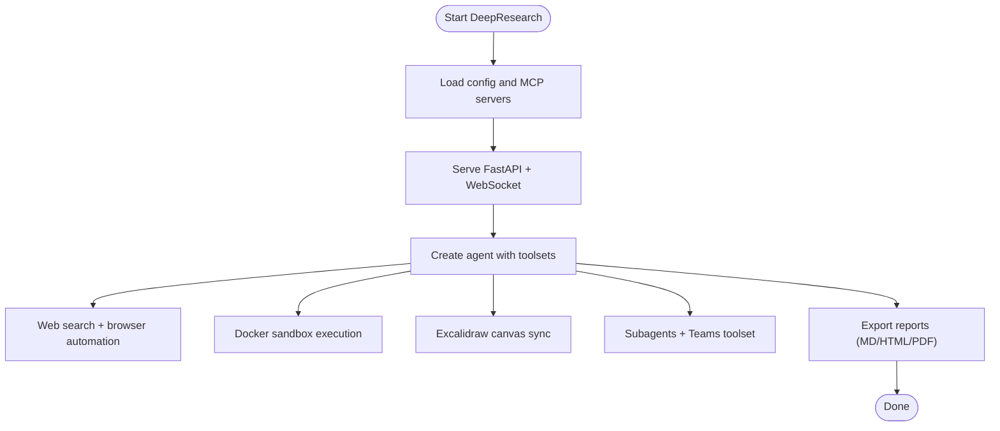
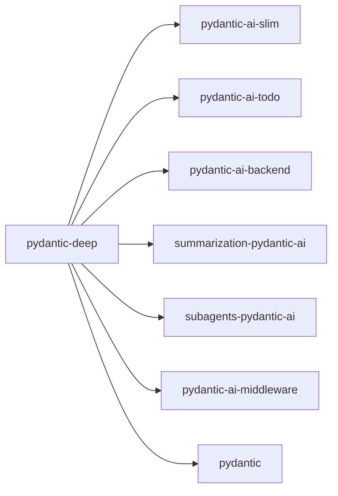

# Project Overview

<cite>
**Referenced Files in This Document**
- [README.md](file://README.md)
- [CLAUDE.md](file://CLAUDE.md)
- [pyproject.toml](file://pyproject.toml)
- [pydantic_deep/agent.py](file://pydantic_deep/agent.py)
- [pydantic_deep/__init__.py](file://pydantic_deep/__init__.py)
- [cli/main.py](file://cli/main.py)
- [cli/README.md](file://cli/README.md)
- [apps/deepresearch/README.md](file://apps/deepresearch/README.md)
- [apps/deepresearch/pyproject.toml](file://apps/deepresearch/pyproject.toml)
- [examples/basic_usage.py](file://examples/basic_usage.py)
- [examples/full_app/app.py](file://examples/full_app/app.py)
</cite>

## Table of Contents
1. [Introduction](#introduction)
2. [Project Structure](#project-structure)
3. [Core Components](#core-components)
4. [Architecture Overview](#architecture-overview)
5. [Detailed Component Analysis](#detailed-component-analysis)
6. [Dependency Analysis](#dependency-analysis)
7. [Performance Considerations](#performance-considerations)
8. [Troubleshooting Guide](#troubleshooting-guide)
9. [Conclusion](#conclusion)

## Introduction
Pydantic Deep Agents is a framework for building autonomous AI agents with planning, filesystem access, subagents, memory, and unlimited context. It implements the “deep agent pattern” — the same architecture powering Claude Code, Manus AI, and Devin. The project provides:
- A Python framework for constructing agents with planning, filesystem tools, subagents, skills, context management, and cost tracking
- A CLI that delivers a terminal AI assistant out of the box
- DeepResearch — a full-featured research agent with a web UI, web search, diagrams, and sandboxed code execution

Key benefits:
- Same architecture as leading autonomous agents
- Modular toolsets and middleware
- Unlimited context via summarization and sliding window processors
- Persistent memory and checkpointing
- Subagent delegation and agent teams
- Structured output with Pydantic models
- Human-in-the-loop controls and safety gates

Target use cases:
- Autonomous coding assistants
- Research agents with web search and diagrams
- Multi-agent orchestration and teams
- Benchmark-friendly environments with sandboxed execution
- Enterprise-grade agent development with middleware and hooks

How it differs from other agent frameworks:
- Deep agent pattern with integrated planning, subagents, memory, and context management
- Strong modularity with pluggable toolsets and middleware
- Rich CLI and reference application for rapid prototyping and production
- Extensive middleware and hooks for auditing, permissions, and safety

Practical examples:
- Plan and execute tasks with subagents
- Persist memory across sessions
- Manage long conversations with summarization
- Run isolated code in Docker sandboxes
- Export reports and collaborate with teams

**Section sources**
- [README.md:56-60](file://README.md#L56-L60)
- [README.md:252-288](file://README.md#L252-L288)
- [CLAUDE.md:32-171](file://CLAUDE.md#L32-L171)

## Project Structure
The repository is organized into:
- Core framework: pydantic_deep (agent factory, toolsets, middleware, processors)
- CLI: cli (terminal AI assistant with commands, skills, threads, config)
- Apps: apps/deepresearch (full-featured research agent with web UI)
- Examples: examples (basic usage, full app, streaming, subagents)
- Docs: docs (MkDocs site)
- Tests: tests (comprehensive coverage)

**Diagram sources**
- [pydantic_deep/agent.py:1-200](file://pydantic_deep/agent.py#L1-L200)
- [pydantic_deep/__init__.py:1-377](file://pydantic_deep/__init__.py#L1-L377)
- [cli/main.py:1-705](file://cli/main.py#L1-L705)
- [cli/README.md:1-225](file://cli/README.md#L1-L225)
- [apps/deepresearch/README.md:1-255](file://apps/deepresearch/README.md#L1-L255)
- [apps/deepresearch/pyproject.toml:1-37](file://apps/deepresearch/pyproject.toml#L1-L37)
- [examples/basic_usage.py:1-53](file://examples/basic_usage.py#L1-L53)
- [examples/full_app/app.py:1-200](file://examples/full_app/app.py#L1-L200)

**Section sources**
- [CLAUDE.md:22-31](file://CLAUDE.md#L22-L31)
- [pyproject.toml:1-211](file://pyproject.toml#L1-L211)

## Core Components
- Agent factory: create_deep_agent() builds a configurable agent with planning, filesystem, subagents, skills, memory, context management, and cost tracking
- Toolsets: TodoToolset (planning), Console toolset (filesystem), SubAgentToolset (delegation), SkillsToolset (domain expertise), Plan toolset (dedicated planner), Teams toolset (multi-agent coordination)
- Middleware and hooks: lifecycle hooks, cost tracking, audit/logging, permission gating
- Processors: summarization, sliding window, eviction, patch tool calls
- Backends: LocalBackend, StateBackend, CompositeBackend, DockerSandbox
- CLI: terminal assistant with interactive chat, non-interactive runs, skills management, threads, providers, and configuration
- DeepResearch: web UI research agent with web search, Excalidraw diagrams, sandboxed execution, and export

**Section sources**
- [pydantic_deep/agent.py:67-193](file://pydantic_deep/agent.py#L67-L193)
- [pydantic_deep/__init__.py:49-205](file://pydantic_deep/__init__.py#L49-L205)
- [cli/README.md:133-149](file://cli/README.md#L133-L149)
- [apps/deepresearch/README.md:64-83](file://apps/deepresearch/README.md#L64-L83)

## Architecture Overview
The architecture follows the deep agent pattern with modular components that can be composed and toggled. The CLI and DeepResearch applications demonstrate production-ready deployments built on the same core.

**Diagram sources**
- [pydantic_deep/agent.py:196-300](file://pydantic_deep/agent.py#L196-L300)
- [pydantic_deep/__init__.py:105-205](file://pydantic_deep/__init__.py#L105-L205)
- [cli/main.py:121-292](file://cli/main.py#L121-L292)
- [apps/deepresearch/README.md:185-207](file://apps/deepresearch/README.md#L185-L207)

**Section sources**
- [README.md:252-288](file://README.md#L252-L288)
- [CLAUDE.md:172-171](file://CLAUDE.md#L172-L171)

## Detailed Component Analysis

### Python Framework
The framework centers on create_deep_agent(), which composes:
- Planning via TodoToolset
- Filesystem operations via Console toolset
- Subagent delegation via SubAgentToolset
- Skills via SkillsToolset
- Context management via summarization and sliding window processors
- Memory via AgentMemoryToolset
- Teams via create_team_toolset
- Hooks and cost tracking via middleware

**Diagram sources**
- [pydantic_deep/agent.py:196-300](file://pydantic_deep/agent.py#L196-L300)
- [pydantic_deep/__init__.py:105-205](file://pydantic_deep/__init__.py#L105-L205)

**Section sources**
- [pydantic_deep/agent.py:67-193](file://pydantic_deep/agent.py#L67-L193)
- [pydantic_deep/__init__.py:49-205](file://pydantic_deep/__init__.py#L49-L205)

### CLI Terminal Assistant
The CLI provides:
- Interactive chat with Rich UI, tool approvals, and progress indicators
- Non-interactive runs for benchmarking and automation
- Skills management (list, info, create)
- Threads management (list, delete, export)
- Providers listing and validation
- Configuration management

**Diagram sources**
- [cli/main.py:121-292](file://cli/main.py#L121-L292)
- [cli/README.md:31-82](file://cli/README.md#L31-L82)

**Section sources**
- [cli/main.py:121-292](file://cli/main.py#L121-L292)
- [cli/README.md:25-82](file://cli/README.md#L25-L82)

### DeepResearch Reference Application
DeepResearch is a full-featured research agent with:
- Web UI (FastAPI + WebSocket)
- Web search (Tavily, Brave, Jina), browser automation (Playwright MCP), and scraping (Firecrawl)
- Excalidraw diagrams with live canvas
- Sandbox execution with Docker
- Subagents, plan mode, skills, checkpointing, teams, and export

**Diagram sources**
- [apps/deepresearch/README.md:185-207](file://apps/deepresearch/README.md#L185-L207)
- [apps/deepresearch/pyproject.toml:1-37](file://apps/deepresearch/pyproject.toml#L1-L37)

**Section sources**
- [apps/deepresearch/README.md:12-83](file://apps/deepresearch/README.md#L12-L83)
- [apps/deepresearch/README.md:158-207](file://apps/deepresearch/README.md#L158-L207)

### Practical Examples
- Basic usage: create a deep agent, configure instructions, and run a task with planning and filesystem operations
- Full app: demonstrate Docker sandbox, runtime configuration, custom tools, middleware, streaming, and multi-user support

**Section sources**
- [examples/basic_usage.py:14-48](file://examples/basic_usage.py#L14-L48)
- [examples/full_app/app.py:1-39](file://examples/full_app/app.py#L1-L39)

## Dependency Analysis
The framework integrates several external libraries and packages:
- pydantic-ai-slim: foundational agent engine
- pydantic-ai-todo: task planning and tracking
- pydantic-ai-backend: console tools, backends, Docker sandbox
- summarization-pydantic-ai: context management and processors
- subagents-pydantic-ai: subagent orchestration
- pydantic-ai-middleware: hooks, cost tracking, permissions
- pydantic: structured output with Pydantic models

**Diagram sources**
- [pyproject.toml:25-34](file://pyproject.toml#L25-L34)

**Section sources**
- [pyproject.toml:25-68](file://pyproject.toml#L25-L68)

## Performance Considerations
- Unlimited context: use summarization and sliding window processors to manage token budgets
- Large tool outputs: eviction processor writes large results to files and keeps lean context
- Streaming: enable streaming for responsive user experiences
- Sandboxed execution: Docker sandbox isolates potentially unsafe operations
- Cost tracking: enforce budgets and monitor token/USD usage

[No sources needed since this section provides general guidance]

## Troubleshooting Guide
Common areas to check:
- Provider configuration: verify model provider readiness and environment variables
- Docker availability: ensure Docker is running for sandboxed execution
- MCP servers: confirm optional services (Excalidraw, Playwright, Firecrawl) are configured as needed
- Permissions and hooks: audit logs and safety gates can block risky operations
- Sessions and threads: list, delete, and export conversation threads for debugging

**Section sources**
- [cli/main.py:504-555](file://cli/main.py#L504-L555)
- [apps/deepresearch/README.md:84-98](file://apps/deepresearch/README.md#L84-L98)

## Conclusion
Pydantic Deep Agents delivers a robust, modular framework for building autonomous agents with planning, filesystem access, subagents, memory, and unlimited context. Its CLI and DeepResearch application showcase production-ready deployments, while the core framework enables rapid experimentation and enterprise-grade features like middleware, hooks, and cost tracking. By following the deep agent pattern, teams can build powerful, safe, and scalable AI systems aligned with industry leaders.

[No sources needed since this section summarizes without analyzing specific files]