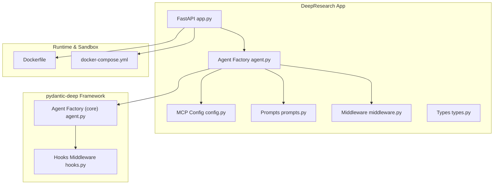
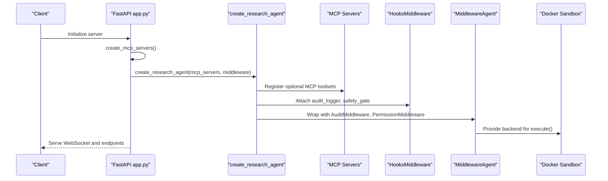
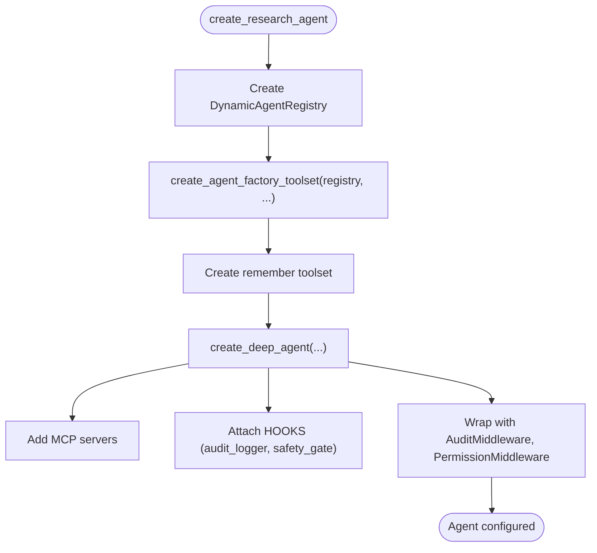
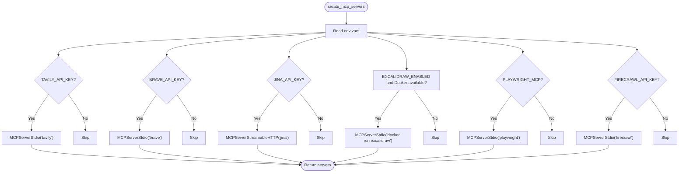
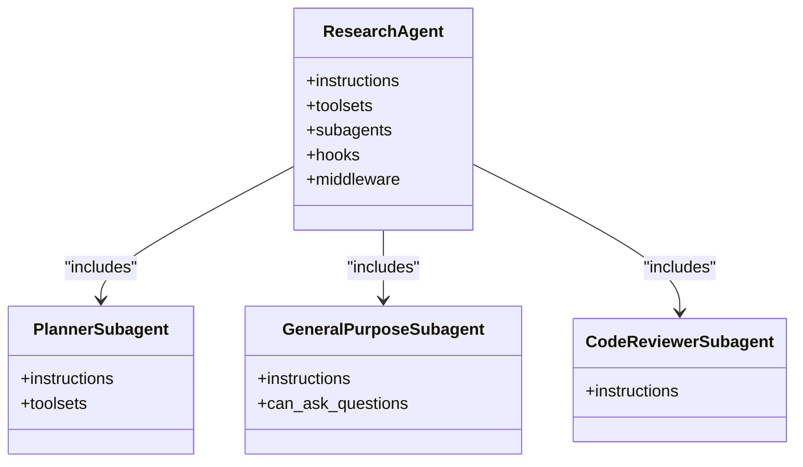
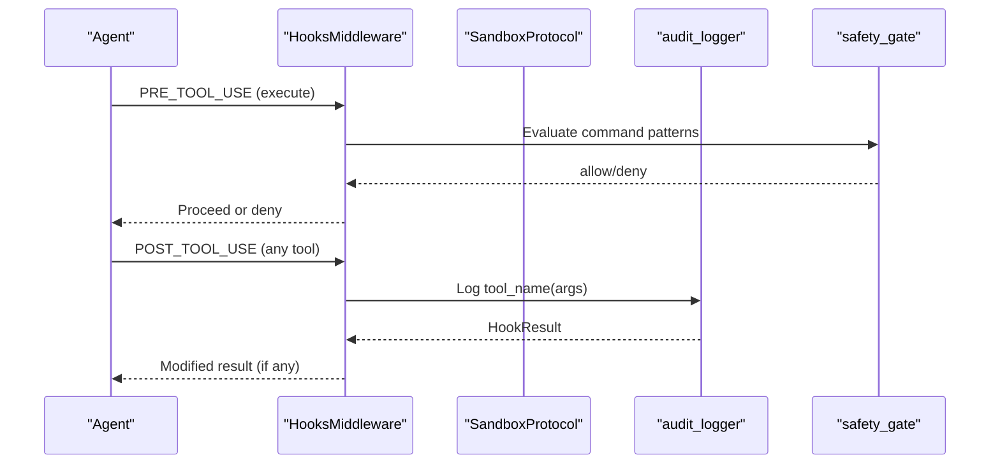
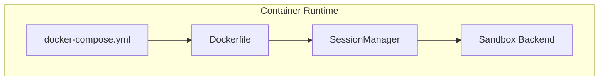
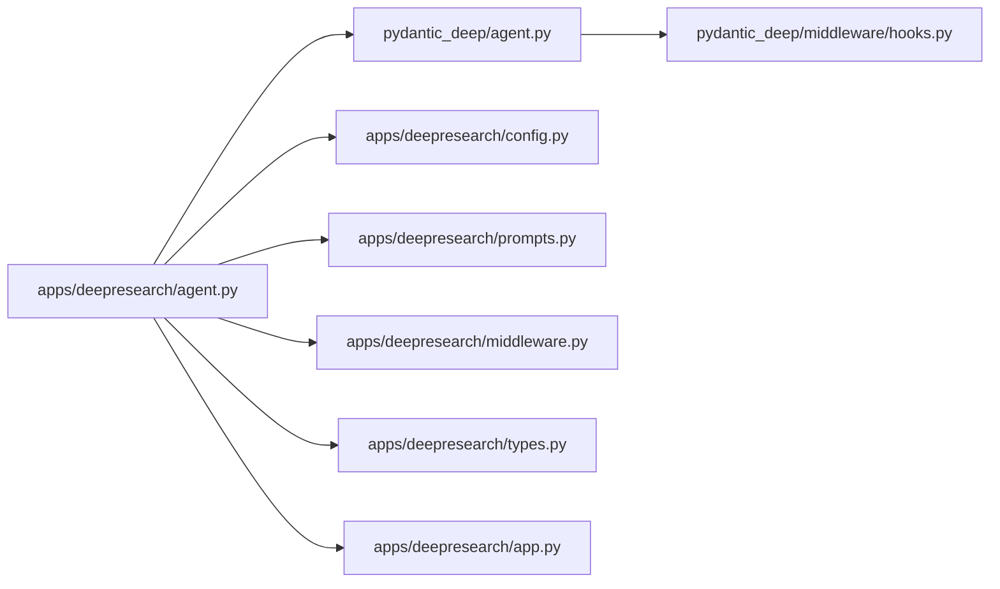

# Agent Factory Configuration

<cite>
**Referenced Files in This Document**
- [agent.py](file://apps/deepresearch/src/deepresearch/agent.py)
- [config.py](file://apps/deepresearch/src/deepresearch/config.py)
- [prompts.py](file://apps/deepresearch/src/deepresearch/prompts.py)
- [app.py](file://apps/deepresearch/src/deepresearch/app.py)
- [middleware.py](file://apps/deepresearch/src/deepresearch/middleware.py)
- [types.py](file://apps/deepresearch/src/deepresearch/types.py)
- [Dockerfile](file://apps/deepresearch/Dockerfile)
- [docker-compose.yml](file://apps/deepresearch/docker-compose.yml)
- [hooks.py](file://pydantic_deep/middleware/hooks.py)
- [agent.py](file://pydantic_deep/agent.py)
- [SKILL.md (research-methodology)](file://apps/deepresearch/skills/research-methodology/SKILL.md)
- [SKILL.md (report-writing)](file://apps/deepresearch/skills/report-writing/SKILL.md)
- [README.md (DeepResearch)](file://apps/deepresearch/README.md)
</cite>

## Table of Contents
1. [Introduction](#introduction)
2. [Project Structure](#project-structure)
3. [Core Components](#core-components)
4. [Architecture Overview](#architecture-overview)
5. [Detailed Component Analysis](#detailed-component-analysis)
6. [Dependency Analysis](#dependency-analysis)
7. [Performance Considerations](#performance-considerations)
8. [Troubleshooting Guide](#troubleshooting-guide)
9. [Conclusion](#conclusion)
10. [Appendices](#appendices)

## Introduction
This document explains the agent factory configuration system used by the DeepResearch application. It focuses on the create_research_agent function, MCP server integration, research-specific agent setup, the hooks system (audit_logger and safety_gate), subagent configuration (including code-reviewer and general-purpose agents), skills integration, research methodology prompts, plan mode configuration, and Docker sandbox setup. It also provides code example references for agent creation, MCP server configuration, and research agent initialization patterns.

## Project Structure
The DeepResearch application is organized around a FastAPI server that initializes a research-focused agent with integrated MCP servers, subagents, skills, and middleware. The agent factory resides in the research app module and composes capabilities from the pydantic-deep framework.

**Diagram sources**
- [app.py:636-692](file://apps/deepresearch/src/deepresearch/app.py#L636-L692)
- [agent.py:376-430](file://apps/deepresearch/src/deepresearch/agent.py#L376-L430)
- [config.py:58-151](file://apps/deepresearch/src/deepresearch/config.py#L58-L151)
- [prompts.py:1-320](file://apps/deepresearch/src/deepresearch/prompts.py#L1-L320)
- [middleware.py:1-122](file://apps/deepresearch/src/deepresearch/middleware.py#L1-L122)
- [agent.py:196-935](file://pydantic_deep/agent.py#L196-L935)
- [hooks.py:1-373](file://pydantic_deep/middleware/hooks.py#L1-L373)
- [Dockerfile:1-48](file://apps/deepresearch/Dockerfile#L1-L48)
- [docker-compose.yml:1-29](file://apps/deepresearch/docker-compose.yml#L1-L29)

**Section sources**
- [README.md (DeepResearch):158-207](file://apps/deepresearch/README.md#L158-L207)
- [app.py:636-692](file://apps/deepresearch/src/deepresearch/app.py#L636-L692)

## Core Components
- Agent factory: create_research_agent builds a research-capable agent with MCP servers, subagents, skills, hooks, and middleware.
- MCP server integration: create_mcp_servers dynamically configures optional web search, URL reading, browser automation, diagramming, and scraping tools.
- Research-specific setup: research methodology prompts, plan mode, and structured output for reports.
- Hooks system: audit_logger and safety_gate enforce auditing and safety policies.
- Subagents: code-reviewer, general-purpose, and dynamic agent factory for delegated tasks.
- Skills: modular knowledge packs for research methodology, report writing, and diagram design.
- Docker sandbox: per-user containers for safe code execution and file isolation.

**Section sources**
- [agent.py:376-430](file://apps/deepresearch/src/deepresearch/agent.py#L376-L430)
- [config.py:58-151](file://apps/deepresearch/src/deepresearch/config.py#L58-L151)
- [prompts.py:1-320](file://apps/deepresearch/src/deepresearch/prompts.py#L1-L320)
- [hooks.py:1-373](file://pydantic_deep/middleware/hooks.py#L1-L373)
- [middleware.py:1-122](file://apps/deepresearch/src/deepresearch/middleware.py#L1-L122)
- [agent.py:196-935](file://pydantic_deep/agent.py#L196-L935)

## Architecture Overview
The DeepResearch agent integrates multiple toolsets and middleware to enable autonomous research. The agent factory composes:
- Console toolset (filesystem, execute)
- Subagent toolset (task delegation)
- Skills toolset (domain knowledge)
- Plan toolset (planner subagent)
- MCP servers (web search, URL reading, diagrams, browser automation, scraping)
- Hooks middleware (audit and safety)
- Middleware stack (audit, permissions, cost tracking, context manager)
- Docker sandbox backend for safe execution

**Diagram sources**
- [app.py:636-692](file://apps/deepresearch/src/deepresearch/app.py#L636-L692)
- [agent.py:376-430](file://apps/deepresearch/src/deepresearch/agent.py#L376-L430)
- [config.py:58-151](file://apps/deepresearch/src/deepresearch/config.py#L58-L151)
- [hooks.py:243-372](file://pydantic_deep/middleware/hooks.py#L243-L372)
- [agent.py:894-935](file://pydantic_deep/agent.py#L894-L935)

## Detailed Component Analysis

### Agent Factory: create_research_agent
The factory constructs a research agent with:
- Model selection and instructions
- Toolsets: MCP servers, agent factory, remember tool
- Capabilities: todo, filesystem, execute, subagents, teams, skills, plan mode
- Subagent configurations: general-purpose, planner, code-reviewer
- Hooks: audit_logger (background), safety_gate (pre-tool-use)
- Middleware: AuditMiddleware, PermissionMiddleware
- Context management, checkpoints, image support, and more

**Diagram sources**
- [agent.py:376-430](file://apps/deepresearch/src/deepresearch/agent.py#L376-L430)
- [agent.py:196-935](file://pydantic_deep/agent.py#L196-L935)

**Section sources**
- [agent.py:376-430](file://apps/deepresearch/src/deepresearch/agent.py#L376-L430)
- [agent.py:196-935](file://pydantic_deep/agent.py#L196-L935)

### MCP Server Integration: create_mcp_servers
The configuration function builds optional MCP servers based on environment variables:
- Tavily (web search)
- Brave Search (web search)
- Jina (URL reader)
- Excalidraw (diagram canvas, Docker-based)
- Playwright (browser automation)
- Firecrawl (advanced scraping)

It checks availability (e.g., Docker for Excalidraw) and returns a list of AbstractToolset instances suitable for the agent.

**Diagram sources**
- [config.py:58-151](file://apps/deepresearch/src/deepresearch/config.py#L58-L151)

**Section sources**
- [config.py:58-151](file://apps/deepresearch/src/deepresearch/config.py#L58-L151)
- [README.md (DeepResearch):100-157](file://apps/deepresearch/README.md#L100-L157)

### Research-Specific Agent Setup
The research agent integrates:
- Research methodology prompts guiding plan mode, subagent dispatch, and report writing
- Plan mode via a planner subagent and plan toolset
- Subagent configurations for general-purpose and code-reviewer roles
- Skills toolset with research methodology, report writing, and diagram design
- Context files and memory tool for persistent notes

**Diagram sources**
- [agent.py:179-225](file://apps/deepresearch/src/deepresearch/agent.py#L179-L225)
- [prompts.py:1-320](file://apps/deepresearch/src/deepresearch/prompts.py#L1-L320)

**Section sources**
- [agent.py:179-225](file://apps/deepresearch/src/deepresearch/agent.py#L179-L225)
- [prompts.py:1-320](file://apps/deepresearch/src/deepresearch/prompts.py#L1-L320)

### Hooks System: audit_logger and safety_gate
The hooks system enforces:
- audit_logger: background POST_TOOL_USE hook logging tool usage
- safety_gate: PRE_TOOL_USE hook blocking dangerous commands for execute tool

**Diagram sources**
- [agent.py:35-81](file://apps/deepresearch/src/deepresearch/agent.py#L35-L81)
- [hooks.py:243-372](file://pydantic_deep/middleware/hooks.py#L243-L372)

**Section sources**
- [agent.py:35-81](file://apps/deepresearch/src/deepresearch/agent.py#L35-L81)
- [hooks.py:1-373](file://pydantic_deep/middleware/hooks.py#L1-L373)

### Subagent Configuration
Subagents are configured for:
- general-purpose: broad research tasks with question-asking capability
- planner: research strategy planning with ask_user integration
- code-reviewer: specialized code review with structured output

These are passed to the agent factory and integrated into the subagent toolset.

**Section sources**
- [agent.py:179-225](file://apps/deepresearch/src/deepresearch/agent.py#L179-L225)

### Skills Integration
Skills are loaded from:
- Programmatic skills (e.g., quick-reference)
- Skill directories under the app’s skills folder

Skills include research methodology, report writing, and diagram design.

**Section sources**
- [agent.py:271-338](file://apps/deepresearch/src/deepresearch/agent.py#L271-L338)
- [agent.py:624-662](file://pydantic_deep/agent.py#L624-L662)
- [SKILL.md (research-methodology):1-70](file://apps/deepresearch/skills/research-methodology/SKILL.md#L1-L70)
- [SKILL.md (report-writing):1-64](file://apps/deepresearch/skills/report-writing/SKILL.md#L1-L64)

### Research Methodology Prompts and Plan Mode
The research workflow prompts guide:
- Planning with the planner subagent
- Todo-based progress tracking
- Parallel subagent dispatch
- Failure handling and resilience
- Report writing with citations and structure

Plan mode is enabled via the planner subagent and plan toolset.

**Section sources**
- [prompts.py:1-320](file://apps/deepresearch/src/deepresearch/prompts.py#L1-L320)
- [agent.py:477-494](file://pydantic_deep/agent.py#L477-L494)

### Docker Sandbox Setup
The application uses Docker for:
- Per-user sandbox containers managed by SessionManager
- Safe code execution with execute tool
- File isolation and cleanup

The Dockerfile installs required system dependencies (Node.js, Docker CLI) and Python packages, exposing port 8080 and running the app module.

**Diagram sources**
- [Dockerfile:1-48](file://apps/deepresearch/Dockerfile#L1-L48)
- [docker-compose.yml:1-29](file://apps/deepresearch/docker-compose.yml#L1-L29)
- [app.py:562-601](file://apps/deepresearch/src/deepresearch/app.py#L562-L601)

**Section sources**
- [Dockerfile:1-48](file://apps/deepresearch/Dockerfile#L1-L48)
- [docker-compose.yml:1-29](file://apps/deepresearch/docker-compose.yml#L1-L29)
- [app.py:562-601](file://apps/deepresearch/src/deepresearch/app.py#L562-L601)

## Dependency Analysis
The agent factory composes capabilities from multiple modules and integrates them into a cohesive research agent.

**Diagram sources**
- [agent.py:1-430](file://apps/deepresearch/src/deepresearch/agent.py#L1-L430)
- [agent.py:1-935](file://pydantic_deep/agent.py#L1-L935)
- [config.py:1-151](file://apps/deepresearch/src/deepresearch/config.py#L1-L151)
- [prompts.py:1-320](file://apps/deepresearch/src/deepresearch/prompts.py#L1-L320)
- [middleware.py:1-122](file://apps/deepresearch/src/deepresearch/middleware.py#L1-L122)
- [hooks.py:1-373](file://pydantic_deep/middleware/hooks.py#L1-L373)
- [types.py:1-72](file://apps/deepresearch/src/deepresearch/types.py#L1-L72)
- [app.py:1-800](file://apps/deepresearch/src/deepresearch/app.py#L1-L800)

**Section sources**
- [agent.py:1-430](file://apps/deepresearch/src/deepresearch/agent.py#L1-L430)
- [agent.py:1-935](file://pydantic_deep/agent.py#L1-L935)

## Performance Considerations
- Token management and context compression reduce latency for long conversations.
- Checkpointing enables efficient rewinds and forks without reprocessing entire histories.
- Parallel subagent execution maximizes throughput for multi-topic research.
- Middleware and hooks add minimal overhead; background hooks avoid blocking user interactions.

[No sources needed since this section provides general guidance]

## Troubleshooting Guide
Common issues and resolutions:
- MCP server failures: The app detects failures and retries without problematic servers, printing a banner indicating remaining servers.
- Excalidraw not available: If Docker is not available, Excalidraw is skipped with a warning; disable via environment variable.
- Dangerous commands blocked: The safety_gate hook denies commands matching known dangerous patterns.
- Permission errors: PermissionMiddleware blocks access to sensitive paths; adjust tool usage or environment.

**Section sources**
- [app.py:604-629](file://apps/deepresearch/src/deepresearch/app.py#L604-L629)
- [config.py:107-127](file://apps/deepresearch/src/deepresearch/config.py#L107-L127)
- [agent.py:45-81](file://apps/deepresearch/src/deepresearch/agent.py#L45-L81)
- [middleware.py:77-122](file://apps/deepresearch/src/deepresearch/middleware.py#L77-L122)

## Conclusion
The DeepResearch agent factory integrates MCP servers, subagents, skills, hooks, and middleware to deliver a robust research environment. The configuration supports plan mode, parallel subagent execution, safe code execution in Docker sandboxes, and structured reporting. The hooks and middleware systems ensure auditing and safety, while the skills and prompts guide best practices for research methodology and report composition.

[No sources needed since this section summarizes without analyzing specific files]

## Appendices

### Code Example References
- Agent creation with MCP servers and middleware:
  - [app.py:636-692](file://apps/deepresearch/src/deepresearch/app.py#L636-L692)
- MCP server configuration:
  - [config.py:58-151](file://apps/deepresearch/src/deepresearch/config.py#L58-L151)
- Research agent initialization patterns:
  - [agent.py:376-430](file://apps/deepresearch/src/deepresearch/agent.py#L376-L430)
- Research methodology prompts:
  - [prompts.py:1-320](file://apps/deepresearch/src/deepresearch/prompts.py#L1-L320)
- Hooks usage (audit_logger, safety_gate):
  - [agent.py:35-81](file://apps/deepresearch/src/deepresearch/agent.py#L35-L81)
  - [hooks.py:1-373](file://pydantic_deep/middleware/hooks.py#L1-L373)
- Subagent configurations:
  - [agent.py:179-225](file://apps/deepresearch/src/deepresearch/agent.py#L179-L225)
- Skills integration:
  - [agent.py:271-338](file://apps/deepresearch/src/deepresearch/agent.py#L271-L338)
  - [SKILL.md (research-methodology):1-70](file://apps/deepresearch/skills/research-methodology/SKILL.md#L1-L70)
  - [SKILL.md (report-writing):1-64](file://apps/deepresearch/skills/report-writing/SKILL.md#L1-L64)
- Docker sandbox setup:
  - [Dockerfile:1-48](file://apps/deepresearch/Dockerfile#L1-L48)
  - [docker-compose.yml:1-29](file://apps/deepresearch/docker-compose.yml#L1-L29)
- Structured report types:
  - [types.py:1-72](file://apps/deepresearch/src/deepresearch/types.py#L1-L72)