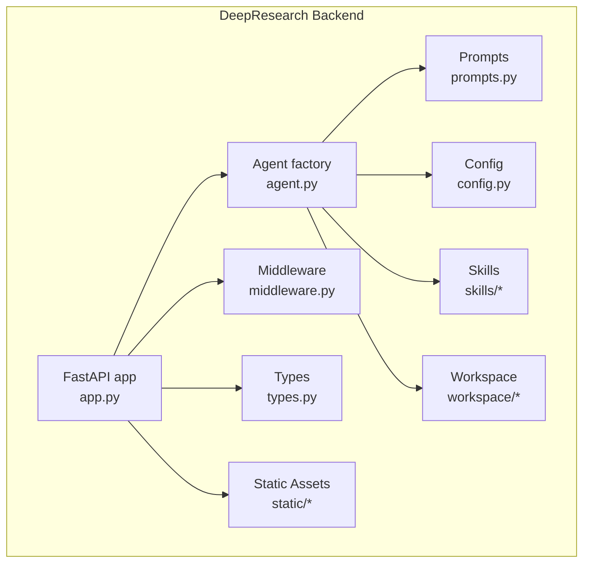
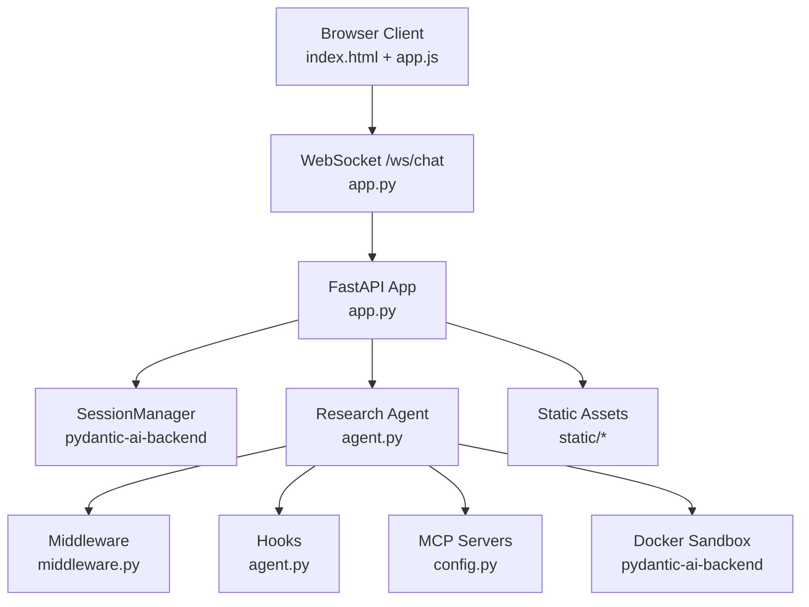
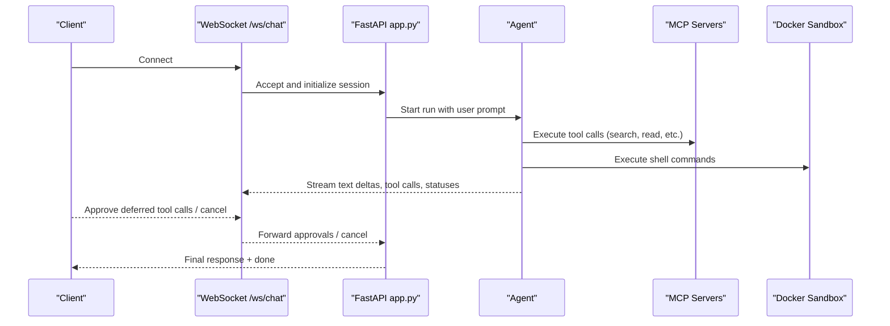
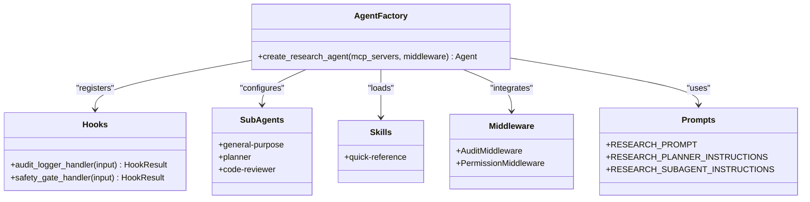
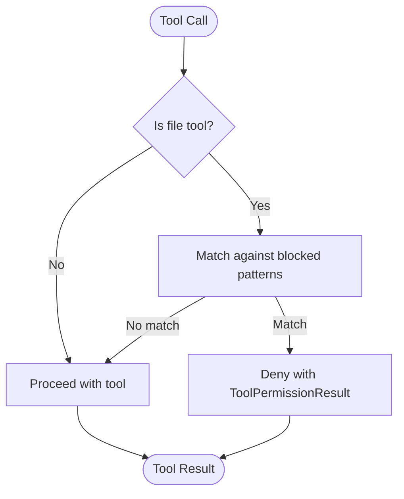
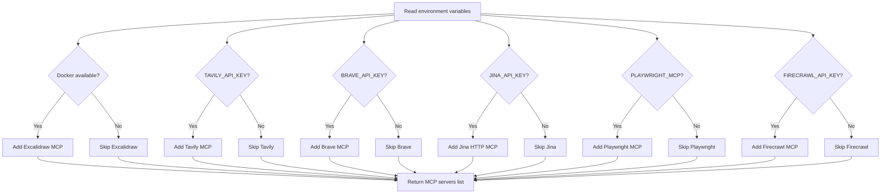
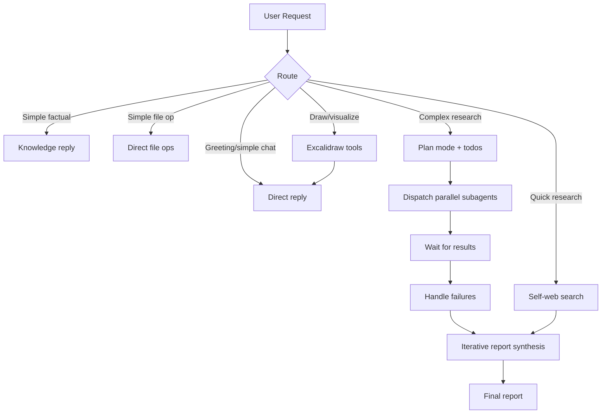
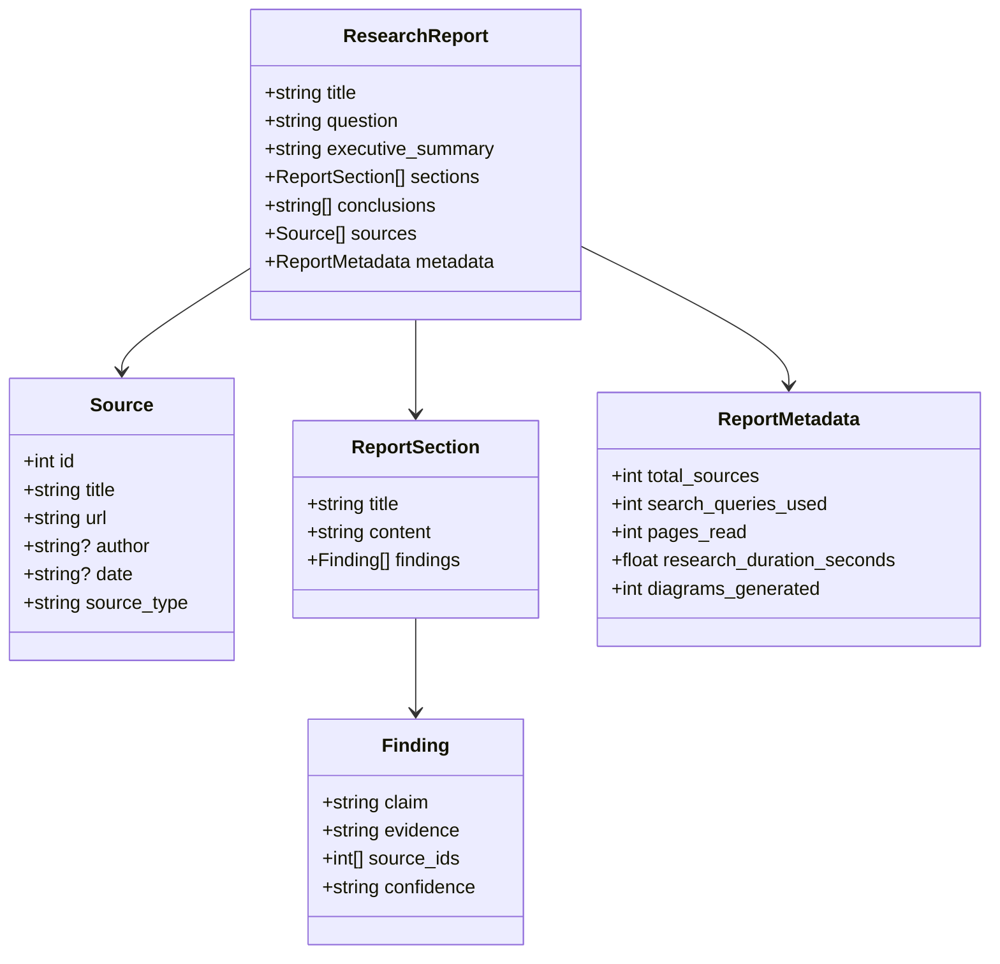
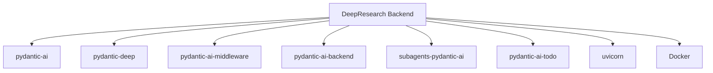

# Backend Architecture

<cite>
**Referenced Files in This Document**
- [app.py](file://apps/deepresearch/src/deepresearch/app.py)
- [agent.py](file://apps/deepresearch/src/deepresearch/agent.py)
- [config.py](file://apps/deepresearch/src/deepresearch/config.py)
- [middleware.py](file://apps/deepresearch/src/deepresearch/middleware.py)
- [prompts.py](file://apps/deepresearch/src/deepresearch/prompts.py)
- [types.py](file://apps/deepresearch/src/deepresearch/types.py)
- [DEEP.md](file://apps/deepresearch/workspace/DEEP.md)
- [MEMORY.md](file://apps/deepresearch/workspace/MEMORY.md)
- [SKILL.md (research-methodology)](file://apps/deepresearch/skills/research-methodology/SKILL.md)
- [SKILL.md (report-writing)](file://apps/deepresearch/skills/report-writing/SKILL.md)
- [SKILL.md (diagram-design)](file://apps/deepresearch/skills/diagram-design/SKILL.md)
- [Dockerfile](file://apps/deepresearch/Dockerfile)
- [README.md](file://apps/deepresearch/README.md)
</cite>

## Table of Contents
1. [Introduction](#introduction)
2. [Project Structure](#project-structure)
3. [Core Components](#core-components)
4. [Architecture Overview](#architecture-overview)
5. [Detailed Component Analysis](#detailed-component-analysis)
6. [Dependency Analysis](#dependency-analysis)
7. [Performance Considerations](#performance-considerations)
8. [Troubleshooting Guide](#troubleshooting-guide)
9. [Conclusion](#conclusion)
10. [Appendices](#appendices)

## Introduction
This document describes the DeepResearch backend architecture built on FastAPI and pydantic-ai. It covers the WebSocket streaming implementation for real-time responses, the agent factory configuration with hooks, subagents, skills, and research-specific instructions, the middleware system for security and compliance, configuration management for MCP servers and model settings, prompt engineering for research methodology, and the Pydantic models used throughout the application. It also includes code example references for agent creation, WebSocket handling, and middleware integration patterns.

## Project Structure
The DeepResearch backend resides under apps/deepresearch/src/deepresearch and includes:
- FastAPI application entry and routing
- Agent factory and configuration
- Middleware for auditing and permissions
- Prompt engineering for research methodology
- Pydantic models for structured reporting
- Configuration for MCP servers, model, and file paths
- Static assets and skills for research methodology, report writing, and diagram design
- Workspace context files injected into each session

**Diagram sources**
- [app.py:636-692](file://apps/deepresearch/src/deepresearch/app.py#L636-L692)
- [agent.py:376-430](file://apps/deepresearch/src/deepresearch/agent.py#L376-L430)
- [middleware.py:33-122](file://apps/deepresearch/src/deepresearch/middleware.py#L33-L122)
- [prompts.py:1-320](file://apps/deepresearch/src/deepresearch/prompts.py#L1-L320)
- [types.py:1-72](file://apps/deepresearch/src/deepresearch/types.py#L1-L72)
- [config.py:1-152](file://apps/deepresearch/src/deepresearch/config.py#L1-L152)

**Section sources**
- [README.md:158-207](file://apps/deepresearch/README.md#L158-L207)

## Core Components
- FastAPI application with lifecycle management, CORS, static file serving, and WebSocket endpoint for streaming chat.
- Agent factory that composes hooks, subagents, skills, and research-specific instructions into a configurable research agent.
- Middleware system for auditing tool usage and enforcing path-based permissions.
- Configuration module that dynamically creates MCP servers based on environment variables and Docker availability.
- Prompt engineering tailored to research planning, execution, and report synthesis.
- Pydantic models for structured research reports, findings, and metadata.

**Section sources**
- [app.py:636-692](file://apps/deepresearch/src/deepresearch/app.py#L636-L692)
- [agent.py:376-430](file://apps/deepresearch/src/deepresearch/agent.py#L376-L430)
- [middleware.py:33-122](file://apps/deepresearch/src/deepresearch/middleware.py#L33-L122)
- [config.py:58-152](file://apps/deepresearch/src/deepresearch/config.py#L58-L152)
- [prompts.py:1-320](file://apps/deepresearch/src/deepresearch/prompts.py#L1-L320)
- [types.py:1-72](file://apps/deepresearch/src/deepresearch/types.py#L1-L72)

## Architecture Overview
The backend integrates FastAPI with a research agent powered by pydantic-ai and pydantic-deep. The agent orchestrates MCP servers (web search, URL reading, browser automation, diagrams), file operations, code execution, subagents, teams, skills, and checkpoints. Middleware and hooks enforce security and compliance. WebSocket streaming delivers real-time updates to the frontend.

**Diagram sources**
- [app.py:719-912](file://apps/deepresearch/src/deepresearch/app.py#L719-L912)
- [agent.py:376-430](file://apps/deepresearch/src/deepresearch/agent.py#L376-L430)
- [middleware.py:33-122](file://apps/deepresearch/src/deepresearch/middleware.py#L33-L122)
- [config.py:58-152](file://apps/deepresearch/src/deepresearch/config.py#L58-L152)
- [Dockerfile:1-48](file://apps/deepresearch/Dockerfile#L1-L48)

## Detailed Component Analysis

### FastAPI Application and WebSocket Streaming
The FastAPI application initializes the agent with MCP servers and middleware during startup, mounts static assets, and exposes:
- Root route serving the frontend
- WebSocket endpoint for streaming chat
- REST endpoints for file operations, checkpoints, history, and configuration
- Health and export endpoints

WebSocket streaming implementation:
- Accepts WebSocket connections and manages per-session state
- Streams model text deltas, tool calls, tool arguments, thinking tokens, and status updates
- Handles approvals for deferred tool requests and cancellation signals
- Persists events to JSONL and maintains message history continuity

**Diagram sources**
- [app.py:719-912](file://apps/deepresearch/src/deepresearch/app.py#L719-L912)
- [app.py:981-1100](file://apps/deepresearch/src/deepresearch/app.py#L981-L1100)
- [app.py:1137-1371](file://apps/deepresearch/src/deepresearch/app.py#L1137-L1371)

**Section sources**
- [app.py:636-692](file://apps/deepresearch/src/deepresearch/app.py#L636-L692)
- [app.py:719-912](file://apps/deepresearch/src/deepresearch/app.py#L719-L912)
- [app.py:981-1100](file://apps/deepresearch/src/deepresearch/app.py#L981-L1100)
- [app.py:1137-1371](file://apps/deepresearch/src/deepresearch/app.py#L1137-L1371)

### Agent Factory Configuration: Hooks, Subagents, Skills, Instructions
The agent factory composes:
- Hooks: background audit logger and pre-tool-use safety gate for execute tool
- Subagent configurations: general-purpose, planner, and code-reviewer
- Programmatic skills: quick-reference
- Research-specific instructions and toolsets
- Middleware integration
- Context files injected into each session

**Diagram sources**
- [agent.py:376-430](file://apps/deepresearch/src/deepresearch/agent.py#L376-L430)
- [agent.py:35-81](file://apps/deepresearch/src/deepresearch/agent.py#L35-L81)
- [agent.py:179-225](file://apps/deepresearch/src/deepresearch/agent.py#L179-L225)
- [agent.py:271-338](file://apps/deepresearch/src/deepresearch/agent.py#L271-L338)
- [prompts.py:1-320](file://apps/deepresearch/src/deepresearch/prompts.py#L1-L320)
- [middleware.py:33-122](file://apps/deepresearch/src/deepresearch/middleware.py#L33-L122)

**Section sources**
- [agent.py:376-430](file://apps/deepresearch/src/deepresearch/agent.py#L376-L430)
- [agent.py:35-81](file://apps/deepresearch/src/deepresearch/agent.py#L35-L81)
- [agent.py:179-225](file://apps/deepresearch/src/deepresearch/agent.py#L179-L225)
- [agent.py:271-338](file://apps/deepresearch/src/deepresearch/agent.py#L271-L338)
- [prompts.py:1-320](file://apps/deepresearch/src/deepresearch/prompts.py#L1-L320)

### Middleware System: AuditMiddleware and PermissionMiddleware
- AuditMiddleware tracks tool usage statistics (call count, duration breakdown) and exposes them to the frontend.
- PermissionMiddleware enforces path-based restrictions for file-related tools to prevent access to sensitive locations.

**Diagram sources**
- [middleware.py:95-122](file://apps/deepresearch/src/deepresearch/middleware.py#L95-L122)

**Section sources**
- [middleware.py:33-122](file://apps/deepresearch/src/deepresearch/middleware.py#L33-L122)

### Configuration Management: MCP Servers, Model Settings, and File Paths
- MCP servers are created conditionally based on environment variables and Docker availability:
  - Tavily, Brave Search, Jina Reader, Excalidraw (Docker-based), Playwright, Firecrawl
- Model name is configurable via environment variable
- File paths for skills, workspace, workspaces, and static assets are defined and used throughout the app

**Diagram sources**
- [config.py:58-152](file://apps/deepresearch/src/deepresearch/config.py#L58-L152)

**Section sources**
- [config.py:1-152](file://apps/deepresearch/src/deepresearch/config.py#L1-L152)

### Prompt Engineering for Research Methodology
Research prompts guide the agent through:
- Memory and persistence strategies
- Routing for different request types
- Planning and execution workflows for complex research
- Parallel subagent orchestration
- Drawing and diagramming with Excalidraw
- Report structure and iterative synthesis

**Diagram sources**
- [prompts.py:1-320](file://apps/deepresearch/src/deepresearch/prompts.py#L1-L320)

**Section sources**
- [prompts.py:1-320](file://apps/deepresearch/src/deepresearch/prompts.py#L1-L320)

### Pydantic Models for Structured Reports
The application defines models for:
- Source references
- Research findings
- Report sections
- Report metadata
- Complete research reports

**Diagram sources**
- [types.py:1-72](file://apps/deepresearch/src/deepresearch/types.py#L1-L72)

**Section sources**
- [types.py:1-72](file://apps/deepresearch/src/deepresearch/types.py#L1-L72)

### Skills and Research Methodology
- research-methodology: search strategy, source evaluation, note-taking best practices
- report-writing: report structure, writing style, citation practices
- diagram-design: Excalidraw workflow, color palette, layout patterns, tips

**Section sources**
- [SKILL.md (research-methodology):1-70](file://apps/deepresearch/skills/research-methodology/SKILL.md#L1-L70)
- [SKILL.md (report-writing):1-64](file://apps/deepresearch/skills/report-writing/SKILL.md#L1-L64)
- [SKILL.md (diagram-design):1-113](file://apps/deepresearch/skills/diagram-design/SKILL.md#L1-L113)

### Workspace Context Files
- DEEP.md: session context guiding research workflow and file organization
- MEMORY.md: persistent memory context across sessions

**Section sources**
- [DEEP.md:1-12](file://apps/deepresearch/workspace/DEEP.md#L1-L12)
- [MEMORY.md:1-4](file://apps/deepresearch/workspace/MEMORY.md#L1-L4)

## Dependency Analysis
The backend integrates several libraries and services:
- pydantic-ai for agent orchestration and streaming
- pydantic-deep for agent framework, hooks, skills, and toolsets
- pydantic-ai-middleware for middleware system
- pydantic-ai-backend for Docker sandbox and file operations
- subagents-pydantic-ai for multi-agent orchestration
- pydantic-ai-todo for task planning
- uvicorn for ASGI server
- Docker for per-user sandbox containers

**Diagram sources**
- [Dockerfile:21-31](file://apps/deepresearch/Dockerfile#L21-L31)
- [README.md:225-236](file://apps/deepresearch/README.md#L225-L236)

**Section sources**
- [Dockerfile:1-48](file://apps/deepresearch/Dockerfile#L1-L48)
- [README.md:225-236](file://apps/deepresearch/README.md#L225-L236)

## Performance Considerations
- Streaming model output and tool events reduces perceived latency and improves interactivity.
- Middleware tracks tool call durations to inform UI metrics and potential optimization.
- Sliding window and eviction processors manage context size for long conversations.
- Checkpointing enables efficient rewinds and forks without recomputation.
- Docker-based sandbox isolates execution and prevents resource contention.

[No sources needed since this section provides general guidance]

## Troubleshooting Guide
Common issues and resolutions:
- MCP server startup failures: The application attempts to rebuild the agent without problematic servers and logs failed prefixes.
- Excalidraw disabled due to Docker unavailability: The configuration warns and skips Excalidraw when Docker is not available.
- PermissionMiddleware blocking sensitive paths: Review blocked patterns and adjust tool arguments accordingly.
- WebSocket disconnects: Events are persisted to JSONL and history is restored on reconnect.
- Export failures: Ensure optional dependencies (markdown, weasyprint) are installed for HTML/PDF exports.

**Section sources**
- [app.py:670-686](file://apps/deepresearch/src/deepresearch/app.py#L670-L686)
- [config.py:107-127](file://apps/deepresearch/src/deepresearch/config.py#L107-L127)
- [middleware.py:77-89](file://apps/deepresearch/src/deepresearch/middleware.py#L77-L89)
- [app.py:271-284](file://apps/deepresearch/src/deepresearch/app.py#L271-L284)
- [app.py:1865-1884](file://apps/deepresearch/src/deepresearch/app.py#L1865-L1884)

## Conclusion
The DeepResearch backend combines FastAPI, a configurable research agent, and a robust middleware and hooks system to deliver secure, real-time, and scalable autonomous research capabilities. Its modular design supports MCP integrations, subagents, skills, and structured reporting, while streaming and checkpointing enhance user experience and reliability.

[No sources needed since this section summarizes without analyzing specific files]

## Appendices

### Code Example References
- Agent creation with MCP servers and middleware:
  - [create_research_agent:376-430](file://apps/deepresearch/src/deepresearch/agent.py#L376-L430)
  - [lifespan initialization:636-692](file://apps/deepresearch/src/deepresearch/app.py#L636-L692)
- WebSocket handling and streaming:
  - [websocket_chat:719-912](file://apps/deepresearch/src/deepresearch/app.py#L719-L912)
  - [run_agent_with_streaming:981-1100](file://apps/deepresearch/src/deepresearch/app.py#L981-L1100)
  - [process_node and streaming helpers:1137-1371](file://apps/deepresearch/src/deepresearch/app.py#L1137-L1371)
- Middleware integration patterns:
  - [AuditMiddleware:33-75](file://apps/deepresearch/src/deepresearch/middleware.py#L33-L75)
  - [PermissionMiddleware:95-122](file://apps/deepresearch/src/deepresearch/middleware.py#L95-L122)
- Configuration management:
  - [create_mcp_servers:58-152](file://apps/deepresearch/src/deepresearch/config.py#L58-L152)
  - [environment variables and defaults:30-36](file://apps/deepresearch/src/deepresearch/config.py#L30-L36)
- Prompt engineering and skills:
  - [RESEARCH_PROMPT:3-320](file://apps/deepresearch/src/deepresearch/prompts.py#L3-L320)
  - [research-methodology skill:1-70](file://apps/deepresearch/skills/research-methodology/SKILL.md#L1-L70)
  - [report-writing skill:1-64](file://apps/deepresearch/skills/report-writing/SKILL.md#L1-L64)
  - [diagram-design skill:1-113](file://apps/deepresearch/skills/diagram-design/SKILL.md#L1-L113)
- Pydantic models:
  - [types.py:1-72](file://apps/deepresearch/src/deepresearch/types.py#L1-L72)