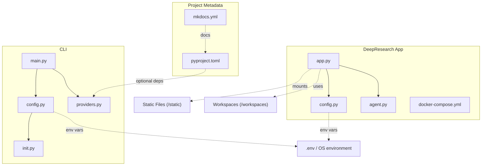
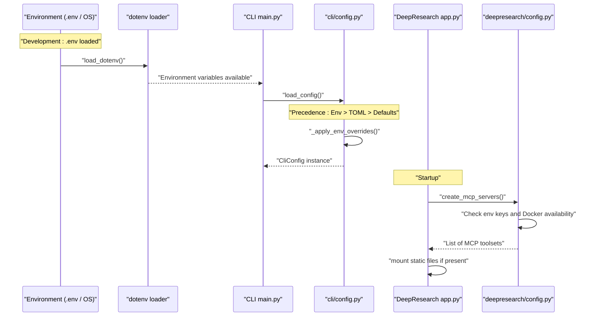
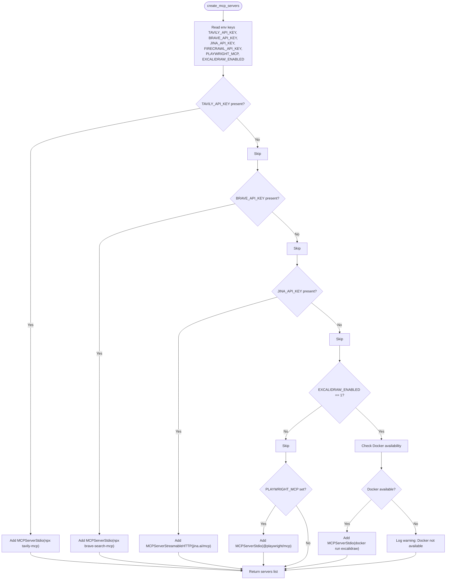
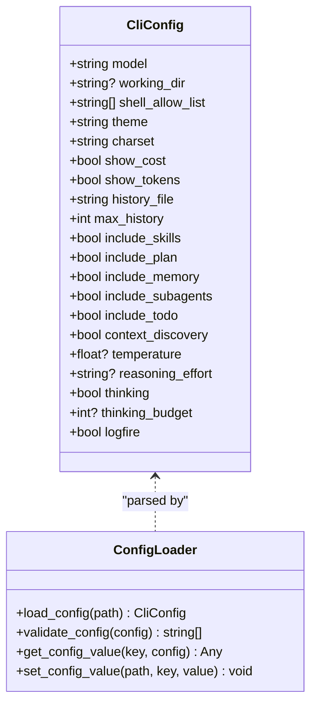
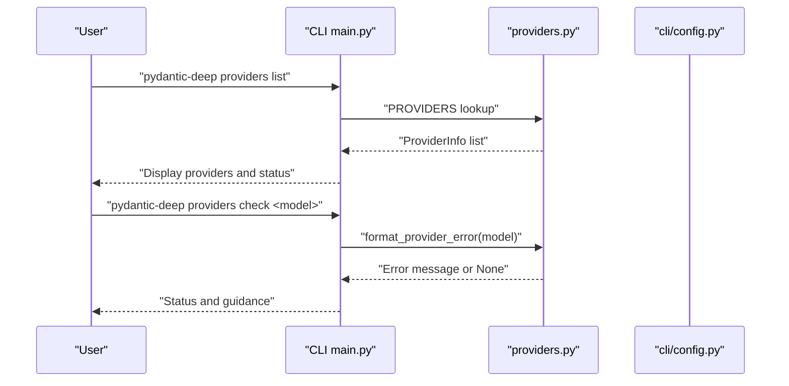
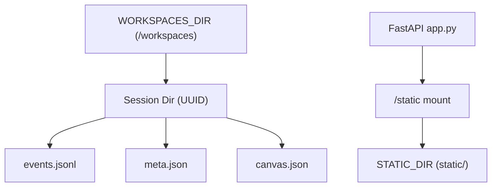
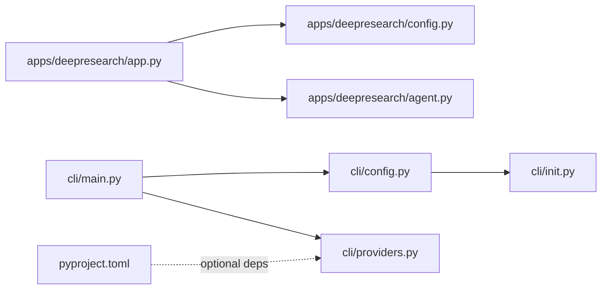

# Configuration Management

<cite>
**Referenced Files in This Document**
- [apps/deepresearch/src/deepresearch/config.py](file://apps/deepresearch/src/deepresearch/config.py)
- [apps/deepresearch/src/deepresearch/app.py](file://apps/deepresearch/src/deepresearch/app.py)
- [apps/deepresearch/src/deepresearch/agent.py](file://apps/deepresearch/src/deepresearch/agent.py)
- [apps/deepresearch/docker-compose.yml](file://apps/deepresearch/docker-compose.yml)
- [cli/config.py](file://cli/config.py)
- [cli/main.py](file://cli/main.py)
- [cli/init.py](file://cli/init.py)
- [cli/providers.py](file://cli/providers.py)
- [pyproject.toml](file://pyproject.toml)
- [mkdocs.yml](file://mkdocs.yml)
</cite>

## Table of Contents
1. [Introduction](#introduction)
2. [Project Structure](#project-structure)
3. [Core Components](#core-components)
4. [Architecture Overview](#architecture-overview)
5. [Detailed Component Analysis](#detailed-component-analysis)
6. [Dependency Analysis](#dependency-analysis)
7. [Performance Considerations](#performance-considerations)
8. [Troubleshooting Guide](#troubleshooting-guide)
9. [Conclusion](#conclusion)

## Introduction
This document explains the configuration management system across the project’s applications and CLI. It covers:
- MCP server configuration and environment-driven selection
- Model settings and provider validation
- File path management for workspaces, static assets, and skills
- Environment variable handling and precedence
- Configuration loading, validation, and fallback strategies
- Workspace directory structure and static file serving
- Development versus production settings
- Practical examples for configuration loading, environment setup, and runtime changes

## Project Structure
The configuration system spans two primary contexts:
- DeepResearch web application: static file serving, workspace persistence, MCP server orchestration, and environment-driven features
- CLI configuration: TOML-backed user settings with environment overrides and validation

**Diagram sources**
- [apps/deepresearch/src/deepresearch/app.py:692-712](file://apps/deepresearch/src/deepresearch/app.py#L692-L712)
- [apps/deepresearch/src/deepresearch/config.py:18-25](file://apps/deepresearch/src/deepresearch/config.py#L18-L25)
- [apps/deepresearch/src/deepresearch/agent.py:376-430](file://apps/deepresearch/src/deepresearch/agent.py#L376-L430)
- [apps/deepresearch/docker-compose.yml:1-29](file://apps/deepresearch/docker-compose.yml#L1-L29)
- [cli/main.py:86-94](file://cli/main.py#L86-L94)
- [cli/config.py:96-110](file://cli/config.py#L96-L110)
- [cli/init.py:41-91](file://cli/init.py#L41-L91)
- [cli/providers.py:25-152](file://cli/providers.py#L25-L152)
- [pyproject.toml:25-68](file://pyproject.toml#L25-L68)
- [mkdocs.yml:1-257](file://mkdocs.yml#L1-L257)

**Section sources**
- [apps/deepresearch/src/deepresearch/app.py:692-712](file://apps/deepresearch/src/deepresearch/app.py#L692-L712)
- [apps/deepresearch/src/deepresearch/config.py:18-25](file://apps/deepresearch/src/deepresearch/config.py#L18-L25)
- [cli/config.py:96-110](file://cli/config.py#L96-L110)

## Core Components
- DeepResearch configuration module defines:
  - Paths for skills, workspace, workspaces, and static assets
  - Model name selection via environment variable
  - Excalidraw canvas URL configuration
  - Dynamic MCP server creation based on environment availability and keys
- CLI configuration module defines:
  - TOML-backed configuration with environment variable overrides
  - Validation and coercion for typed fields
  - Helpers to initialize project structure and default configuration

Key responsibilities:
- Centralized path constants for consistent workspace and static asset resolution
- Environment-driven MCP server activation and Docker availability checks
- CLI config loading precedence: environment variables override TOML, which overrides defaults
- Provider registry and validation for model providers

**Section sources**
- [apps/deepresearch/src/deepresearch/config.py:18-152](file://apps/deepresearch/src/deepresearch/config.py#L18-L152)
- [cli/config.py:70-254](file://cli/config.py#L70-L254)

## Architecture Overview
The configuration architecture integrates environment variables, TOML files, and programmatic defaults with explicit precedence and validation.

**Diagram sources**
- [apps/deepresearch/src/deepresearch/app.py:33-35](file://apps/deepresearch/src/deepresearch/app.py#L33-L35)
- [cli/main.py:86-94](file://cli/main.py#L86-L94)
- [cli/config.py:96-130](file://cli/config.py#L96-L130)
- [apps/deepresearch/src/deepresearch/config.py:58-152](file://apps/deepresearch/src/deepresearch/config.py#L58-L152)

## Detailed Component Analysis

### DeepResearch Configuration Module
Responsibilities:
- Define absolute paths for skills, workspace, workspaces, and static assets
- Select model name from environment variable with a sensible default
- Configure Excalidraw canvas URL from environment
- Dynamically assemble MCP servers based on environment variables and Docker availability
- Provide a Docker availability check for Excalidraw integration

Configuration loading and validation:
- Paths are computed once at import time
- Model name is read from environment with a default fallback
- Excalidraw server URL is configurable via environment
- MCP server creation:
  - Tavily, Brave, Jina, Firecrawl: activated when respective API keys are present
  - Excalidraw: activated when enabled and Docker is available
  - Playwright: activated when a dedicated flag is set
- Docker availability check uses the Docker executable and a health check

Runtime behavior:
- Static files are mounted under /static if the directory exists
- Canvas operations read/write canvas.json per session under workspaces

**Diagram sources**
- [apps/deepresearch/src/deepresearch/config.py:43-152](file://apps/deepresearch/src/deepresearch/config.py#L43-L152)

**Section sources**
- [apps/deepresearch/src/deepresearch/config.py:18-152](file://apps/deepresearch/src/deepresearch/config.py#L18-L152)
- [apps/deepresearch/src/deepresearch/app.py:702-704](file://apps/deepresearch/src/deepresearch/app.py#L702-L704)
- [apps/deepresearch/docker-compose.yml:1-29](file://apps/deepresearch/docker-compose.yml#L1-L29)

### CLI Configuration Module
Responsibilities:
- Define default configuration fields with sensible defaults
- Load configuration from TOML with strict field filtering
- Apply environment variable overrides with explicit precedence
- Validate configuration and return warnings for invalid values
- Provide helpers to read/write TOML configuration and coerce types

Precedence and fallback:
- Default values are defined in the dataclass
- TOML file is parsed and only known fields are applied
- Environment variables override TOML and defaults
- Unknown keys in TOML are ignored

Validation:
- Model string validation ensures a provider prefix is present
- Working directory existence is validated
- Theme and charset are validated against known sets
- Numeric fields are validated for non-negativity

Type coercion:
- Boolean, integer, float, list, and string fields are coerced based on field names

**Diagram sources**
- [cli/config.py:70-94](file://cli/config.py#L70-L94)
- [cli/config.py:96-154](file://cli/config.py#L96-L154)
- [cli/config.py:176-229](file://cli/config.py#L176-L229)

**Section sources**
- [cli/config.py:70-254](file://cli/config.py#L70-L254)

### Environment Variable Handling and Provider Validation
- CLI loads environment variables early and supports Logfire instrumentation based on configuration or flags
- Provider registry maps provider prefixes to required environment variables and optional extras
- Provider validation checks for missing environment variables and suggests installation commands

**Diagram sources**
- [cli/main.py:504-555](file://cli/main.py#L504-L555)
- [cli/providers.py:155-234](file://cli/providers.py#L155-L234)

**Section sources**
- [cli/main.py:86-94](file://cli/main.py#L86-L94)
- [cli/providers.py:25-152](file://cli/providers.py#L25-L152)

### Workspace Directory Structure and Static File Serving
- Workspaces are stored under a dedicated directory with per-session subdirectories
- Static files are served under /static if the static directory exists
- Canvas state is persisted per session in canvas.json
- Initialization scaffolding creates default configuration and memory templates

**Diagram sources**
- [apps/deepresearch/src/deepresearch/app.py:270-312](file://apps/deepresearch/src/deepresearch/app.py#L270-L312)
- [apps/deepresearch/src/deepresearch/app.py:702-704](file://apps/deepresearch/src/deepresearch/app.py#L702-L704)
- [apps/deepresearch/src/deepresearch/config.py:18-25](file://apps/deepresearch/src/deepresearch/config.py#L18-L25)

**Section sources**
- [apps/deepresearch/src/deepresearch/app.py:270-312](file://apps/deepresearch/src/deepresearch/app.py#L270-L312)
- [apps/deepresearch/src/deepresearch/app.py:702-704](file://apps/deepresearch/src/deepresearch/app.py#L702-L704)
- [apps/deepresearch/src/deepresearch/config.py:18-25](file://apps/deepresearch/src/deepresearch/config.py#L18-L25)

### Development vs Production Settings
- Development:
  - .env loading via dotenv
  - Optional Docker-based Excalidraw service via docker-compose
  - Static directory mounted for local development
- Production:
  - Static assets served by upstream web server or CDN
  - MCP servers configured via environment variables
  - Optional Docker-based Excalidraw requires Docker availability

**Section sources**
- [apps/deepresearch/src/deepresearch/app.py:33-35](file://apps/deepresearch/src/deepresearch/app.py#L33-L35)
- [apps/deepresearch/docker-compose.yml:1-29](file://apps/deepresearch/docker-compose.yml#L1-L29)

## Dependency Analysis
- DeepResearch app depends on:
  - DeepResearch config for paths and MCP server creation
  - Agent factory for constructing the research agent with toolsets
- CLI main depends on:
  - CLI config for loading and displaying configuration
  - Providers for validating model strings and environment readiness
- Optional dependencies:
  - pyproject.toml lists optional extras for sandbox, CLI, web, web-tools, YAML, and logfire

**Diagram sources**
- [apps/deepresearch/src/deepresearch/app.py:88-97](file://apps/deepresearch/src/deepresearch/app.py#L88-L97)
- [apps/deepresearch/src/deepresearch/agent.py:376-430](file://apps/deepresearch/src/deepresearch/agent.py#L376-L430)
- [cli/main.py:86-94](file://cli/main.py#L86-L94)
- [cli/config.py:96-110](file://cli/config.py#L96-L110)
- [cli/init.py:41-91](file://cli/init.py#L41-L91)
- [pyproject.toml:36-68](file://pyproject.toml#L36-L68)

**Section sources**
- [pyproject.toml:36-68](file://pyproject.toml#L36-L68)

## Performance Considerations
- Environment checks (e.g., Docker availability) are lightweight subprocess calls; cache results if frequently invoked
- Static file mounting occurs once during app startup; ensure static directory presence is verified early
- MCP server startup failures are retried by removing problematic servers; keep server lists minimal in constrained environments

## Troubleshooting Guide
Common configuration issues and resolutions:
- Missing MCP API keys:
  - Ensure environment variables are exported and loaded by dotenv
  - Confirm Docker is available for Excalidraw if enabled
- Invalid CLI configuration:
  - Use the validation function to identify warnings (e.g., missing provider prefix, unknown theme/charset)
  - Correct values in TOML or set environment variables
- Provider configuration errors:
  - Use the provider check command to diagnose missing environment variables or missing extras
  - Install recommended optional dependencies as indicated

**Section sources**
- [apps/deepresearch/src/deepresearch/config.py:43-56](file://apps/deepresearch/src/deepresearch/config.py#L43-L56)
- [cli/config.py:132-154](file://cli/config.py#L132-L154)
- [cli/providers.py:205-234](file://cli/providers.py#L205-L234)

## Conclusion
The configuration management system combines environment variables, TOML files, and programmatic defaults with clear precedence and validation. DeepResearch centralizes path management and dynamically composes MCP servers based on environment readiness, while the CLI offers robust configuration loading, coercion, and validation. Together, they enable flexible development and production deployments with predictable fallbacks and strong diagnostics.