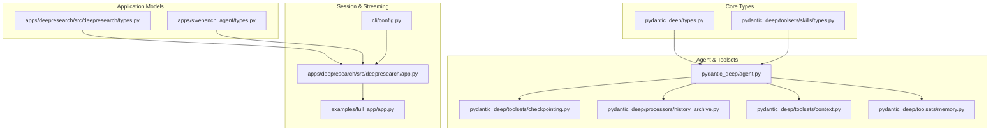
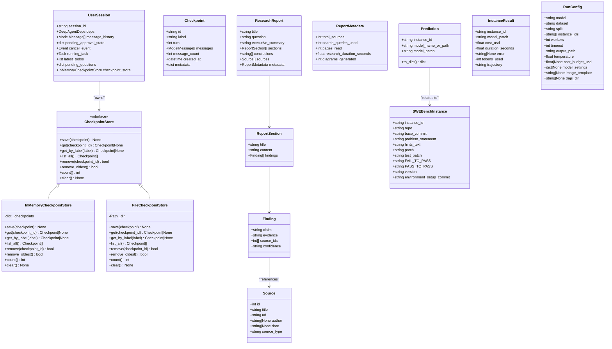
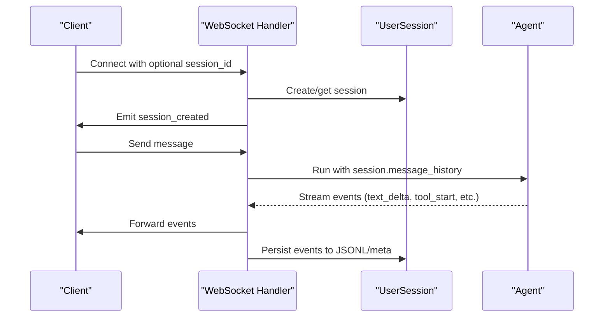
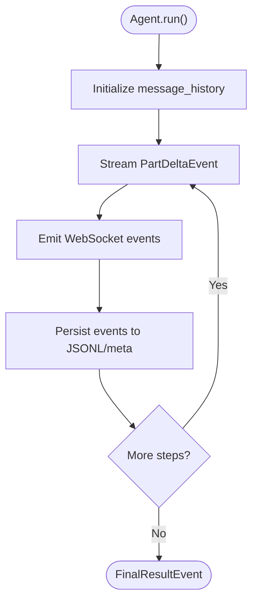
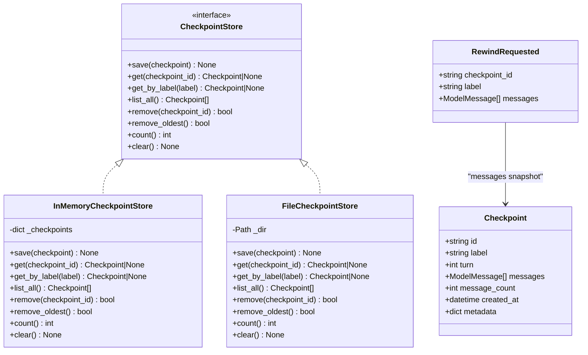
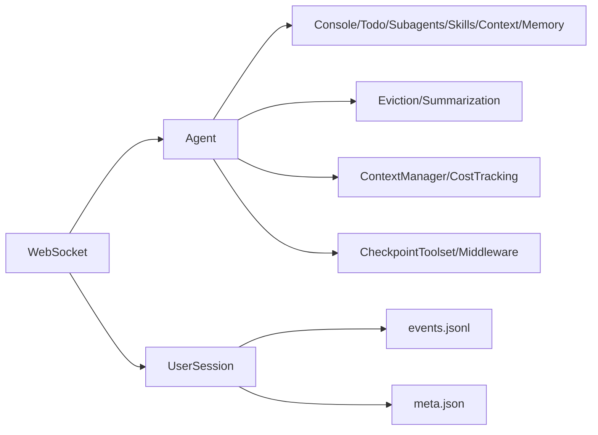

# Data Models and Types

<cite>
**Referenced Files in This Document**
- [types.py](file://pydantic_deep/types.py)
- [types.py](file://apps/deepresearch/src/deepresearch/types.py)
- [types.py](file://apps/swebench_agent/types.py)
- [agent.py](file://pydantic_deep/agent.py)
- [checkpointing.py](file://pydantic_deep/toolsets/checkpointing.py)
- [history_archive.py](file://pydantic_deep/processors/history_archive.py)
- [context.py](file://pydantic_deep/toolsets/context.py)
- [memory.py](file://pydantic_deep/toolsets/memory.py)
- [skills/types.py](file://pydantic_deep/toolsets/skills/types.py)
- [app.py](file://apps/deepresearch/src/deepresearch/app.py)
- [app.py](file://examples/full_app/app.py)
- [config.py](file://cli/config.py)
</cite>

## Table of Contents
1. [Introduction](#introduction)
2. [Project Structure](#project-structure)
3. [Core Components](#core-components)
4. [Architecture Overview](#architecture-overview)
5. [Detailed Component Analysis](#detailed-component-analysis)
6. [Dependency Analysis](#dependency-analysis)
7. [Performance Considerations](#performance-considerations)
8. [Troubleshooting Guide](#troubleshooting-guide)
9. [Conclusion](#conclusion)

## Introduction
This document explains the data models and type definitions used across the application, focusing on:
- UserSession dataclass for per-user session state
- Pydantic models for structured research reports
- Dataclasses for SWE-bench evaluation
- Type definitions for skills and agent interactions
- Serialization patterns, validation rules, and data transformation processes
- Message history management, checkpoint storage types, and session state persistence
- WebSocket message types and streaming semantics

## Project Structure
The data models and types span several modules:
- Core type definitions and re-exports
- Structured models for research reports
- Dataclasses for SWE-bench evaluation
- Agent configuration and toolset types
- Session state and persistence utilities
- WebSocket streaming and event types

**Diagram sources**
- [types.py:1-99](file://pydantic_deep/types.py#L1-L99)
- [skills/types.py:1-521](file://pydantic_deep/toolsets/skills/types.py#L1-L521)
- [types.py:1-72](file://apps/deepresearch/src/deepresearch/types.py#L1-L72)
- [types.py:1-77](file://apps/swebench_agent/types.py#L1-L77)
- [agent.py:1-1001](file://pydantic_deep/agent.py#L1-L1001)
- [checkpointing.py:1-603](file://pydantic_deep/toolsets/checkpointing.py#L1-L603)
- [history_archive.py:1-195](file://pydantic_deep/processors/history_archive.py#L1-L195)
- [context.py:1-208](file://pydantic_deep/toolsets/context.py#L1-L208)
- [memory.py:1-231](file://pydantic_deep/toolsets/memory.py#L1-L231)
- [app.py:241-308](file://apps/deepresearch/src/deepresearch/app.py#L241-L308)
- [app.py:1-200](file://examples/full_app/app.py#L1-L200)
- [config.py:1-254](file://cli/config.py#L1-L254)

**Section sources**
- [types.py:1-99](file://pydantic_deep/types.py#L1-L99)
- [skills/types.py:1-521](file://pydantic_deep/toolsets/skills/types.py#L1-L521)
- [types.py:1-72](file://apps/deepresearch/src/deepresearch/types.py#L1-L72)
- [types.py:1-77](file://apps/swebench_agent/types.py#L1-L77)
- [agent.py:1-1001](file://pydantic_deep/agent.py#L1-L1001)
- [checkpointing.py:1-603](file://pydantic_deep/toolsets/checkpointing.py#L1-L603)
- [history_archive.py:1-195](file://pydantic_deep/processors/history_archive.py#L1-L195)
- [context.py:1-208](file://pydantic_deep/toolsets/context.py#L1-L208)
- [memory.py:1-231](file://pydantic_deep/toolsets/memory.py#L1-L231)
- [app.py:241-308](file://apps/deepresearch/src/deepresearch/app.py#L241-L308)
- [app.py:1-200](file://examples/full_app/app.py#L1-L200)
- [config.py:1-254](file://cli/config.py#L1-L254)

## Core Components
- UserSession: Per-user session state container with message history, approvals, tasks, and checkpoint store.
- Pydantic models for research reports: Source, Finding, ReportSection, ReportMetadata, ResearchReport.
- SWE-bench dataclasses: SWEBenchInstance, Prediction, InstanceResult, RunConfig.
- Skill dataclasses: Skill, SkillResource, SkillScript, SkillWrapper.
- Checkpoint types: Checkpoint, CheckpointStore protocol, in-memory and file-backed stores.
- Context and memory toolsets: ContextFile, AgentMemoryToolset, and related utilities.
- History archive: Toolset and processor for searching persisted conversation history.
- CLI configuration: CliConfig dataclass and helpers for session and project directories.

**Section sources**
- [app.py:241-308](file://apps/deepresearch/src/deepresearch/app.py#L241-L308)
- [types.py:8-72](file://apps/deepresearch/src/deepresearch/types.py#L8-L72)
- [types.py:9-77](file://apps/swebench_agent/types.py#L9-L77)
- [skills/types.py:75-521](file://pydantic_deep/toolsets/skills/types.py#L75-L521)
- [checkpointing.py:59-603](file://pydantic_deep/toolsets/checkpointing.py#L59-L603)
- [context.py:35-208](file://pydantic_deep/toolsets/context.py#L35-L208)
- [memory.py:57-231](file://pydantic_deep/toolsets/memory.py#L57-L231)
- [history_archive.py:134-195](file://pydantic_deep/processors/history_archive.py#L134-L195)
- [config.py:70-254](file://cli/config.py#L70-L254)

## Architecture Overview
The data models integrate with agent configuration and toolsets to manage:
- Message history and streaming events
- Persistent session state and checkpoints
- Context and memory injection
- Structured output and report generation

**Diagram sources**
- [app.py:241-308](file://apps/deepresearch/src/deepresearch/app.py#L241-L308)
- [checkpointing.py:59-603](file://pydantic_deep/toolsets/checkpointing.py#L59-L603)
- [types.py:8-72](file://apps/deepresearch/src/deepresearch/types.py#L8-L72)
- [types.py:9-77](file://apps/swebench_agent/types.py#L9-L77)

## Detailed Component Analysis

### UserSession Dataclass
- Purpose: Encapsulates per-user session state, including message history, approvals, tasks, and checkpoint store.
- Fields:
  - session_id: Unique session identifier
  - deps: Agent dependencies
  - message_history: List of ModelMessage for conversation continuity
  - pending_approval_state: Approval gating state
  - cancel_event: Async cancellation signaling
  - running_task: Current async task
  - latest_todos: Active task list
  - pending_questions: Pending user questions
  - checkpoint_store: In-memory checkpoint store for rewinds/forks
- Persistence:
  - Events logged to JSONL per session
  - Metadata written to meta.json with timestamps and counts
- WebSocket integration:
  - Session creation and event streaming
  - Real-time updates for todos and tool usage

**Diagram sources**
- [app.py:739-1200](file://apps/deepresearch/src/deepresearch/app.py#L739-L1200)
- [app.py:788-816](file://examples/full_app/app.py#L788-L816)
- [app.py:241-308](file://apps/deepresearch/src/deepresearch/app.py#L241-L308)

**Section sources**
- [app.py:241-308](file://apps/deepresearch/src/deepresearch/app.py#L241-L308)
- [app.py:739-1200](file://apps/deepresearch/src/deepresearch/app.py#L739-L1200)
- [app.py:788-816](file://examples/full_app/app.py#L788-L816)

### Pydantic Models for Research Reports
- Source: Identifies a cited source with metadata
- Finding: A factual claim supported by evidence and source references
- ReportSection: A section with content and findings
- ReportMetadata: Metrics about the research process
- ResearchReport: Top-level report aggregating sections, findings, and metadata

Validation and serialization:
- Pydantic models enforce field types and defaults
- Nested lists and references ensure structured output suitable for downstream processing

**Section sources**
- [types.py:8-72](file://apps/deepresearch/src/deepresearch/types.py#L8-L72)

### SWE-bench Dataclasses
- SWEBenchInstance: Mirrors dataset columns for evaluation instances
- Prediction: Output format for predictions (JSONL)
- InstanceResult: Aggregated metrics and trajectory for each instance
- RunConfig: Evaluation run configuration including model, dataset, and output paths

Serialization:
- Prediction.to_dict produces a dictionary compatible with evaluation harness
- RunConfig supports optional fields and typed defaults

**Section sources**
- [types.py:9-77](file://apps/swebench_agent/types.py#L9-L77)

### Skill Dataclasses and Type Definitions
- SkillResource: Static or dynamic resource with function schema
- SkillScript: Executable script with function schema
- Skill: Composite skill with metadata, content, resources, and scripts
- SkillWrapper: Decorator-based wrapper for type-safe dependency injection

Validation and transformation:
- Validation ensures resources/scripts have either content/function or uri
- Function schemas are generated for callable resources/scripts
- Skill normalization enforces naming constraints

**Section sources**
- [skills/types.py:75-521](file://pydantic_deep/toolsets/skills/types.py#L75-L521)
- [types.py:34-39](file://pydantic_deep/types.py#L34-L39)

### Message History Management and Streaming
- Agent configuration:
  - history_processors: Eviction and summarization processors
  - context_manager: Automatic token tracking and compression
  - include_history_archive: Enables search tool over persisted messages
- Streaming events:
  - Text deltas, tool call deltas, tool outputs, and final response
  - WebSocket server emits structured event types

**Diagram sources**
- [agent.py:750-800](file://pydantic_deep/agent.py#L750-L800)
- [app.py:788-816](file://examples/full_app/app.py#L788-L816)

**Section sources**
- [agent.py:750-800](file://pydantic_deep/agent.py#L750-L800)
- [app.py:788-816](file://examples/full_app/app.py#L788-L816)

### Checkpoint Storage Types and Rewind/Fork
- Checkpoint: Immutable snapshot with id, label, turn, messages, metadata
- CheckpointStore protocol: Save, get, list, remove, prune, count, clear
- InMemoryCheckpointStore: Dict-backed store with insertion-order iteration
- FileCheckpointStore: JSON files with ModelMessagesTypeAdapter serialization
- RewindRequested: Exception to signal app-level rewind with message restoration
- fork_from_checkpoint: Utility to retrieve messages for new session initialization

**Diagram sources**
- [checkpointing.py:59-603](file://pydantic_deep/toolsets/checkpointing.py#L59-L603)

**Section sources**
- [checkpointing.py:59-603](file://pydantic_deep/toolsets/checkpointing.py#L59-L603)

### Context and Memory Toolsets
- ContextToolset: Loads and injects project context files into system prompt
- AgentMemoryToolset: Reads/writes/updaes persistent MEMORY.md files
- Both integrate with backend protocols and respect token budgets and truncation policies

**Section sources**
- [context.py:35-208](file://pydantic_deep/toolsets/context.py#L35-L208)
- [memory.py:57-231](file://pydantic_deep/toolsets/memory.py#L57-L231)

### History Archive Processor
- Provides search_conversation_history tool to query persisted messages.json
- Formats messages into readable excerpts with surrounding context
- Limits matches and respects maximum characters per message

**Section sources**
- [history_archive.py:134-195](file://pydantic_deep/processors/history_archive.py#L134-L195)

### CLI Configuration and Session Directories
- CliConfig: Dataclass for configuration with environment overrides
- Helpers: Project directory, sessions directory, history path resolution

**Section sources**
- [config.py:70-254](file://cli/config.py#L70-L254)

## Dependency Analysis
- UserSession depends on:
  - DeepAgentDeps for backend access
  - InMemoryCheckpointStore for rewinds/forks
  - JSONL and meta.json for persistence
- Agent configuration composes:
  - Toolsets (console, todo, subagents, skills, context, memory)
  - Processors (eviction, summarization)
  - Middleware (context manager, cost tracking)
  - Checkpoint toolset and middleware
- WebSocket server depends on:
  - Agent streaming events
  - UserSession for state continuity
  - JSONL persistence for replay

**Diagram sources**
- [app.py:241-308](file://apps/deepresearch/src/deepresearch/app.py#L241-L308)
- [agent.py:505-800](file://pydantic_deep/agent.py#L505-L800)

**Section sources**
- [app.py:241-308](file://apps/deepresearch/src/deepresearch/app.py#L241-L308)
- [agent.py:505-800](file://pydantic_deep/agent.py#L505-L800)

## Performance Considerations
- Token budgeting and eviction:
  - EvictionProcessor truncates large tool outputs to preserve context
  - ContextManagerMiddleware compresses context when nearing limits
- Checkpoint pruning:
  - Stores maintain bounded counts to avoid unbounded growth
- Streaming:
  - WebSocket events minimize payload sizes and batch updates
- File-based persistence:
  - JSONL and meta.json are append-only for low contention

## Troubleshooting Guide
- Validation failures:
  - Skill names must match normalized pattern; ensure names use lowercase, digits, and hyphens
  - Resources/scripts must define either content/function or uri
- Checkpoint issues:
  - RewindRequested indicates a checkpoint was selected; ensure the app catches and replays message_history
  - FileCheckpointStore requires valid JSON; verify serialization/deserialization paths
- WebSocket connectivity:
  - Session creation emits session_created; confirm client handles reconnects and resumption
  - Ensure message_history is preserved across runs for continuity

**Section sources**
- [skills/types.py:34-72](file://pydantic_deep/toolsets/skills/types.py#L34-L72)
- [checkpointing.py:87-107](file://pydantic_deep/toolsets/checkpointing.py#L87-L107)
- [app.py:739-775](file://apps/deepresearch/src/deepresearch/app.py#L739-L775)

## Conclusion
The application’s data models and types provide a robust foundation for agent interactions, session state management, and structured output. They integrate seamlessly with toolsets, middleware, and persistence mechanisms to support real-time streaming, checkpointing, and long-term memory. By leveraging Pydantic models, dataclasses, and typed protocols, the system ensures strong validation, predictable serialization, and scalable session handling.