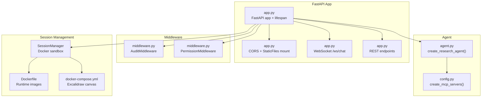
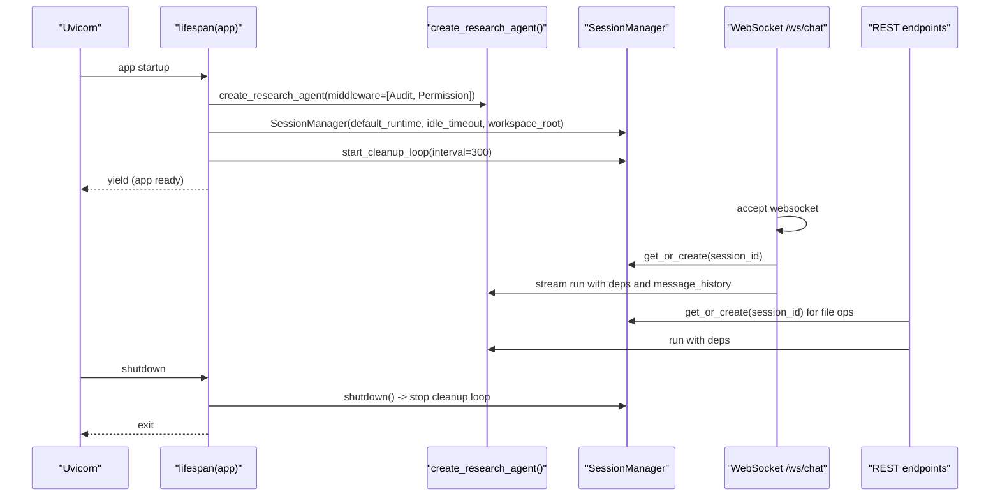
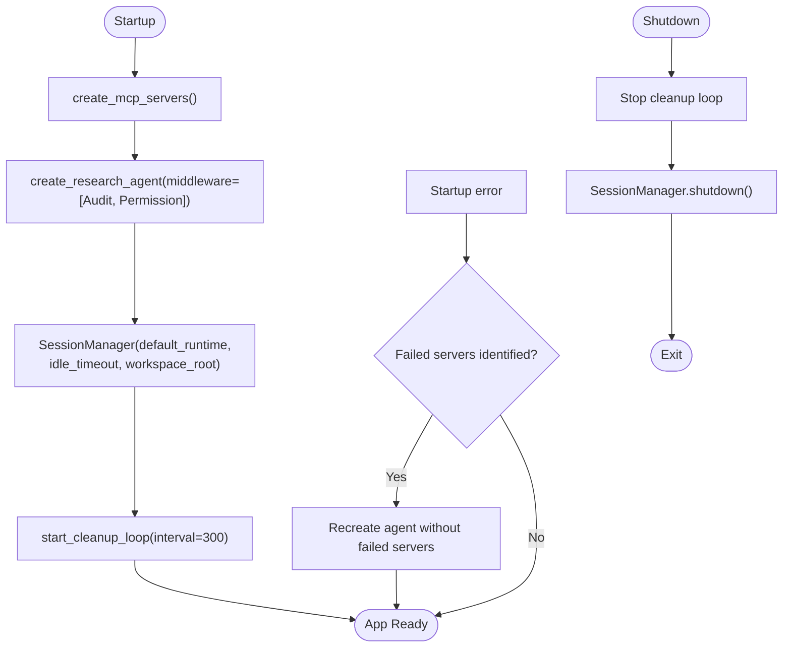
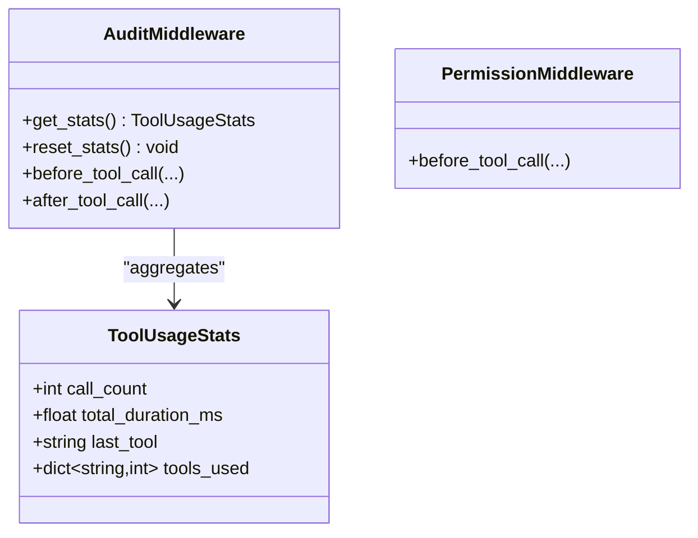
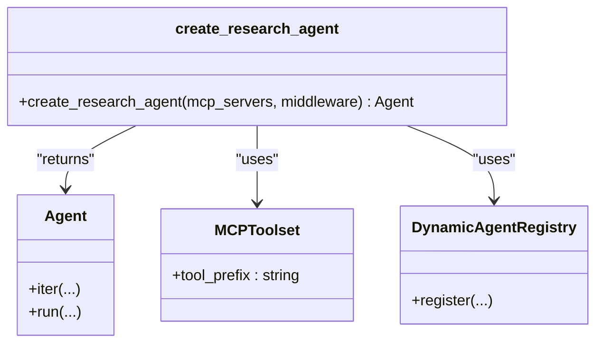
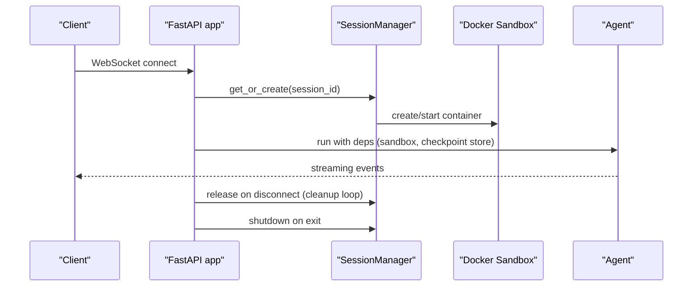
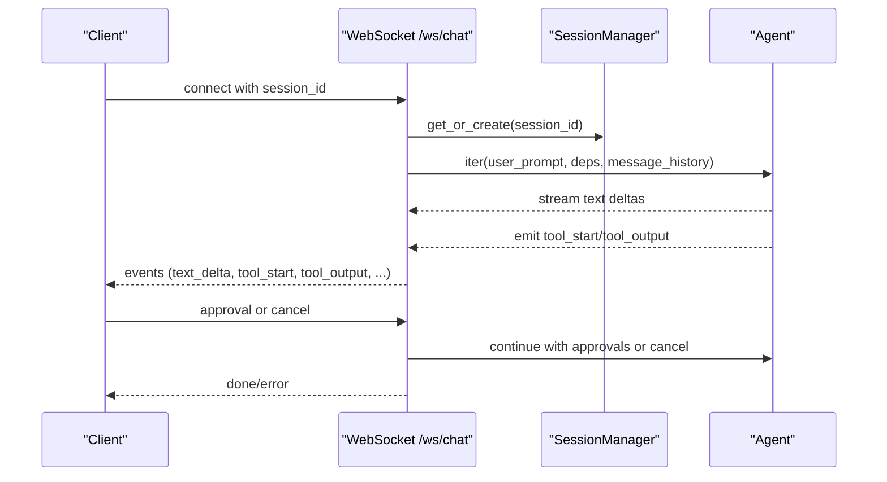
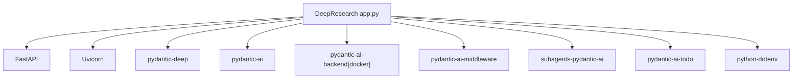

# FastAPI Application Structure

<cite>
**Referenced Files in This Document**
- [app.py](file://apps/deepresearch/src/deepresearch/app.py)
- [middleware.py](file://apps/deepresearch/src/deepresearch/middleware.py)
- [agent.py](file://apps/deepresearch/src/deepresearch/agent.py)
- [config.py](file://apps/deepresearch/src/deepresearch/config.py)
- [Dockerfile](file://apps/deepresearch/Dockerfile)
- [docker-compose.yml](file://apps/deepresearch/docker-compose.yml)
- [pyproject.toml](file://apps/deepresearch/pyproject.toml)
- [pyproject.toml](file://pyproject.toml)
</cite>

## Table of Contents
1. [Introduction](#introduction)
2. [Project Structure](#project-structure)
3. [Core Components](#core-components)
4. [Architecture Overview](#architecture-overview)
5. [Detailed Component Analysis](#detailed-component-analysis)
6. [Dependency Analysis](#dependency-analysis)
7. [Performance Considerations](#performance-considerations)
8. [Troubleshooting Guide](#troubleshooting-guide)
9. [Conclusion](#conclusion)

## Introduction
This document explains the FastAPI application structure for the DeepResearch service. It covers application initialization, CORS middleware configuration, static file serving, the lifespan manager for agent lifecycle, the application factory pattern, dependency injection via the lifespan context, graceful shutdown procedures, and the session management system including Docker sandbox initialization and cleanup loops. It also provides code example paths for startup, middleware registration, and resource cleanup patterns.

## Project Structure
The DeepResearch FastAPI application resides under apps/deepresearch and integrates tightly with the pydantic-deep framework. Key elements:
- FastAPI application factory and lifespan manager
- Middleware stack (AuditMiddleware, PermissionMiddleware)
- Agent factory and configuration
- Session management with Docker sandbox via SessionManager
- Static file serving and frontend routing
- WebSocket chat endpoint for streaming agent interactions

**Diagram sources**
- [app.py](file://apps/deepresearch/src/deepresearch/app.py)
- [middleware.py](file://apps/deepresearch/src/deepresearch/middleware.py)
- [agent.py](file://apps/deepresearch/src/deepresearch/agent.py)
- [config.py](file://apps/deepresearch/src/deepresearch/config.py)
- [Dockerfile](file://apps/deepresearch/Dockerfile)
- [docker-compose.yml](file://apps/deepresearch/docker-compose.yml)

**Section sources**
- [app.py](file://apps/deepresearch/src/deepresearch/app.py)
- [middleware.py](file://apps/deepresearch/src/deepresearch/middleware.py)
- [agent.py](file://apps/deepresearch/src/deepresearch/agent.py)
- [config.py](file://apps/deepresearch/src/deepresearch/config.py)
- [Dockerfile](file://apps/deepresearch/Dockerfile)
- [docker-compose.yml](file://apps/deepresearch/docker-compose.yml)

## Core Components
- Application factory and lifespan manager:
  - Creates the FastAPI app with CORS and static file mounting.
  - Initializes the agent and SessionManager during startup and performs graceful shutdown.
- Middleware stack:
  - AuditMiddleware: tracks tool usage stats.
  - PermissionMiddleware: blocks access to sensitive paths.
- Agent factory:
  - Builds a research agent with MCP servers, hooks, subagents, and skills.
- Session management:
  - SessionManager orchestrates per-user Docker sandboxes, persistence, and cleanup loops.
- Static file serving:
  - Mounts the static directory under /static and serves index.html at root.

**Section sources**
- [app.py](file://apps/deepresearch/src/deepresearch/app.py)
- [middleware.py](file://apps/deepresearch/src/deepresearch/middleware.py)
- [agent.py](file://apps/deepresearch/src/deepresearch/agent.py)
- [config.py](file://apps/deepresearch/src/deepresearch/config.py)

## Architecture Overview
The application follows a FastAPI application factory pattern with a lifespan manager. The lifespan initializes the agent and SessionManager, starts cleanup loops, and ensures graceful shutdown. Middleware is registered globally. The agent is configured with MCP servers, hooks, and toolsets. Sessions are isolated via Docker sandboxes managed by SessionManager.

**Diagram sources**
- [app.py](file://apps/deepresearch/src/deepresearch/app.py)
- [agent.py](file://apps/deepresearch/src/deepresearch/agent.py)
- [config.py](file://apps/deepresearch/src/deepresearch/config.py)

## Detailed Component Analysis

### Application Factory Pattern and Lifespan Manager
- The FastAPI app is created with a lifespan manager that:
  - Builds MCP servers via create_mcp_servers().
  - Creates the research agent with AuditMiddleware and PermissionMiddleware.
  - Initializes SessionManager with default runtime, idle timeout, and workspace root.
  - Starts a cleanup loop to release idle sessions periodically.
  - Handles startup failures by retrying without problematic MCP servers.
  - On shutdown, stops cleanup loops and shuts down SessionManager.

**Diagram sources**
- [app.py](file://apps/deepresearch/src/deepresearch/app.py)
- [agent.py](file://apps/deepresearch/src/deepresearch/agent.py)
- [config.py](file://apps/deepresearch/src/deepresearch/config.py)

**Section sources**
- [app.py](file://apps/deepresearch/src/deepresearch/app.py)

### Middleware Registration and Behavior
- CORS middleware is registered globally with allow-all origins/headers/methods.
- Static files are mounted under /static if the directory exists.
- Root route serves index.html if present.
- AuditMiddleware tracks tool call counts, durations, and breakdowns.
- PermissionMiddleware validates file tool arguments against blocked patterns.

**Diagram sources**
- [middleware.py](file://apps/deepresearch/src/deepresearch/middleware.py)

**Section sources**
- [app.py](file://apps/deepresearch/src/deepresearch/app.py)
- [middleware.py](file://apps/deepresearch/src/deepresearch/middleware.py)

### Agent Factory and Configuration
- The agent is created with:
  - Model name from environment.
  - Instructions combining base and research prompts.
  - Toolsets: MCP servers, agent factory, remember toolset.
  - Hooks: audit logger (background), safety gate (pre-tool-use).
  - Subagents: planner, general-purpose, code-reviewer.
  - Skills: research-methodology, report-writing, quick-reference.
  - Features: filesystem, execute, subagents, teams, checkpoints, plan mode, image support.

**Diagram sources**
- [agent.py](file://apps/deepresearch/src/deepresearch/agent.py)

**Section sources**
- [agent.py](file://apps/deepresearch/src/deepresearch/agent.py)
- [config.py](file://apps/deepresearch/src/deepresearch/config.py)

### Session Management and Docker Sandbox
- SessionManager manages per-user Docker sandboxes:
  - Isolation via container per session.
  - Persistent workspace storage under WORKSPACES_DIR.
  - Cleanup loop releases idle sessions.
  - Graceful shutdown releases all sessions.
- Dockerfile sets up Node.js and Docker CLI for MCP servers and sandbox containers.
- docker-compose defines the Excalidraw canvas service and optional deepresearch service.

**Diagram sources**
- [app.py](file://apps/deepresearch/src/deepresearch/app.py)
- [Dockerfile](file://apps/deepresearch/Dockerfile)
- [docker-compose.yml](file://apps/deepresearch/docker-compose.yml)

**Section sources**
- [app.py](file://apps/deepresearch/src/deepresearch/app.py)
- [Dockerfile](file://apps/deepresearch/Dockerfile)
- [docker-compose.yml](file://apps/deepresearch/docker-compose.yml)

### WebSocket Chat and Streaming
- The /ws/chat endpoint:
  - Accepts WebSocket connections.
  - Manages per-session state, message history, and background tasks.
  - Streams model text deltas, tool calls, tool outputs, and audit stats.
  - Supports approval flows for deferred tool requests.
  - Emits todos updates and handles cancellation.

**Diagram sources**
- [app.py](file://apps/deepresearch/src/deepresearch/app.py)

**Section sources**
- [app.py](file://apps/deepresearch/src/deepresearch/app.py)

### REST Endpoints and Static File Serving
- Static file serving:
  - Mounts the static directory under /static if it exists.
  - Root route serves index.html if present.
- REST endpoints:
  - Upload files to a session’s workspace.
  - List files in workspace and uploads.
  - Retrieve file content and binary previews.
  - Manage todos, checkpoints, and history.
  - Export reports to md/html/pdf.
  - Health check and session management APIs.

**Section sources**
- [app.py](file://apps/deepresearch/src/deepresearch/app.py)

## Dependency Analysis
External dependencies and integrations:
- FastAPI and Uvicorn for the web server.
- pydantic-deep and pydantic-ai for agent orchestration, toolsets, and middleware.
- pydantic-ai-backend[docker] for Docker sandbox support.
- pydantic-ai-middleware for agent middleware.
- subagents-pydantic-ai for dynamic subagents.
- pydantic-ai-todo for TODO management.
- python-dotenv for environment configuration.
- Optional export dependencies: markdown and weasyprint.

**Diagram sources**
- [pyproject.toml](file://apps/deepresearch/pyproject.toml)
- [pyproject.toml](file://pyproject.toml)

**Section sources**
- [pyproject.toml](file://apps/deepresearch/pyproject.toml)
- [pyproject.toml](file://pyproject.toml)

## Performance Considerations
- Streaming: WebSocket streaming reduces latency and improves UX for long-running agent runs.
- Cleanup loops: Periodic cleanup of idle sessions prevents resource accumulation.
- Middleware overhead: AuditMiddleware adds minimal overhead for stats collection.
- Docker runtime: Using python-datascience runtime pre-installs scientific libraries to reduce cold-start costs.
- Static files: Serving static assets via StaticFiles avoids application overhead for frontend resources.

## Troubleshooting Guide
Common issues and resolutions:
- MCP server startup failures:
  - The lifespan manager detects failures and retries without problematic servers. Check logs for failed server names and adjust environment variables accordingly.
- Docker availability:
  - Excalidraw MCP server requires Docker. If Docker is unavailable, the server is skipped with a warning. Ensure Docker daemon is running or disable EXCALIDRAW_ENABLED.
- PermissionMiddleware blocking:
  - If file tool calls are denied, verify the path does not match blocked patterns. Adjust paths or remove sensitive patterns.
- Session cleanup:
  - If sessions accumulate, verify the cleanup loop is running and idle timeouts are configured appropriately.
- WebSocket disconnections:
  - Ensure clients reconnect and resend session_id. Partial histories are saved on cancellation.

**Section sources**
- [app.py](file://apps/deepresearch/src/deepresearch/app.py)
- [middleware.py](file://apps/deepresearch/src/deepresearch/middleware.py)
- [config.py](file://apps/deepresearch/src/deepresearch/config.py)

## Conclusion
The DeepResearch FastAPI application employs a robust application factory pattern with a lifespan manager to initialize the agent and SessionManager, register middleware globally, and manage Docker sandboxed sessions. The system supports streaming WebSocket interactions, static file serving, and comprehensive session lifecycle management with periodic cleanup and graceful shutdown. The modular design enables easy extension with additional MCP servers, skills, and toolsets.