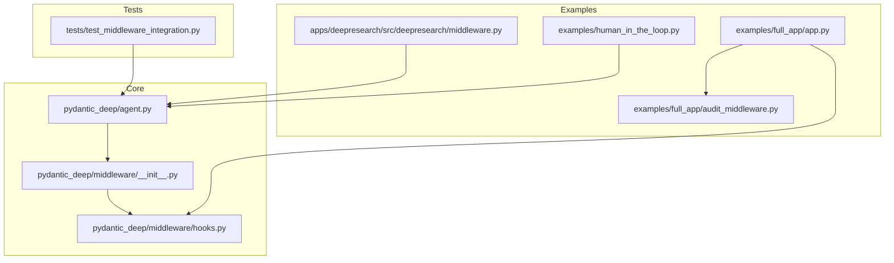
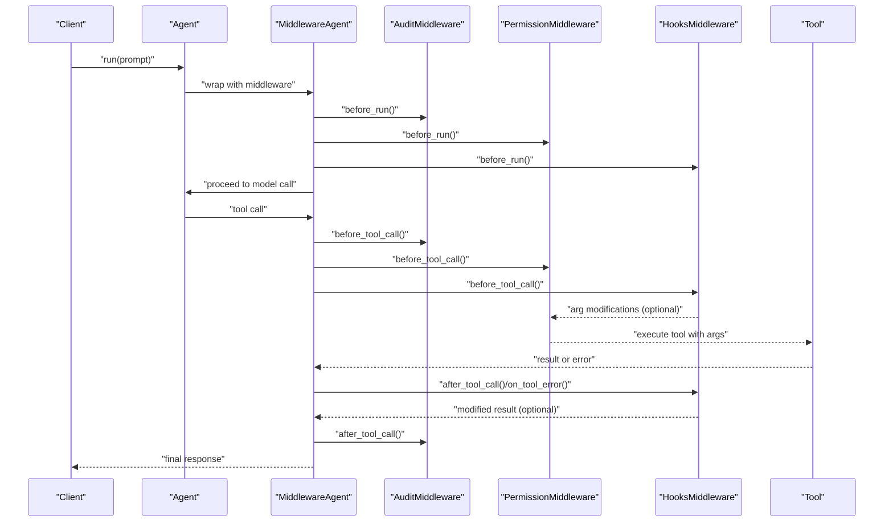
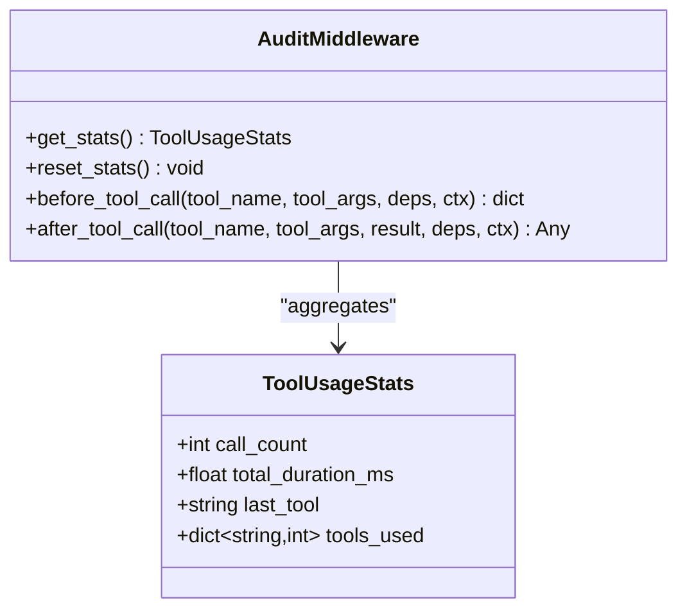
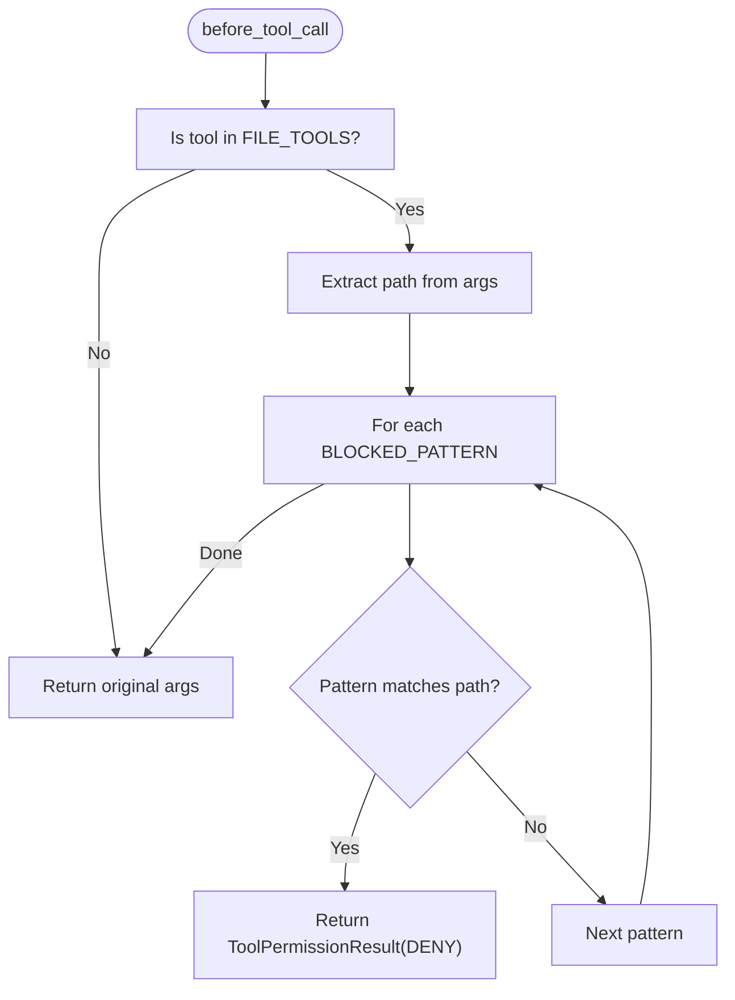
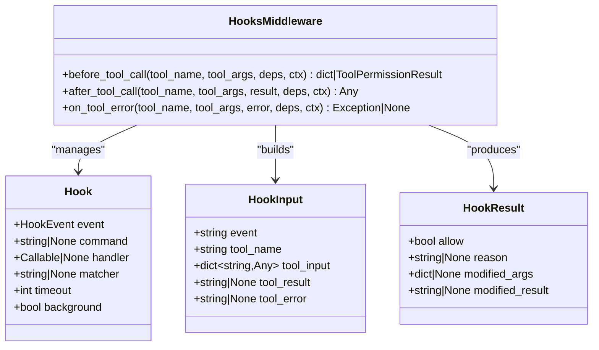
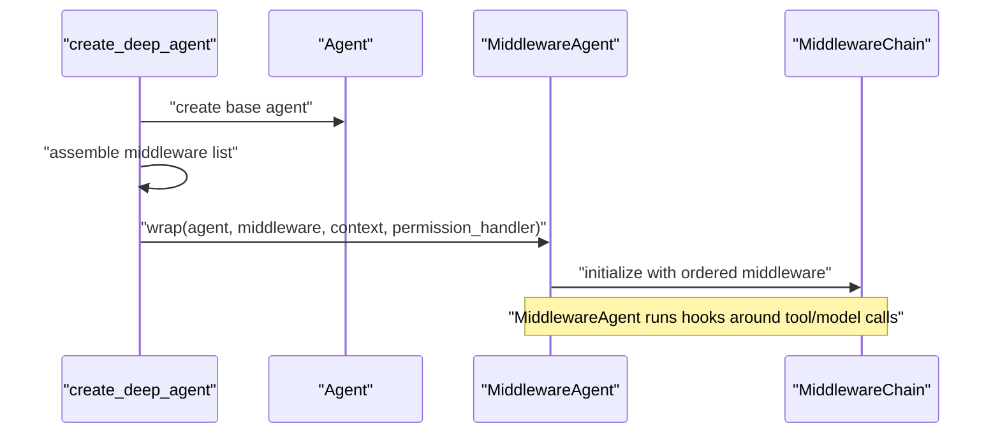
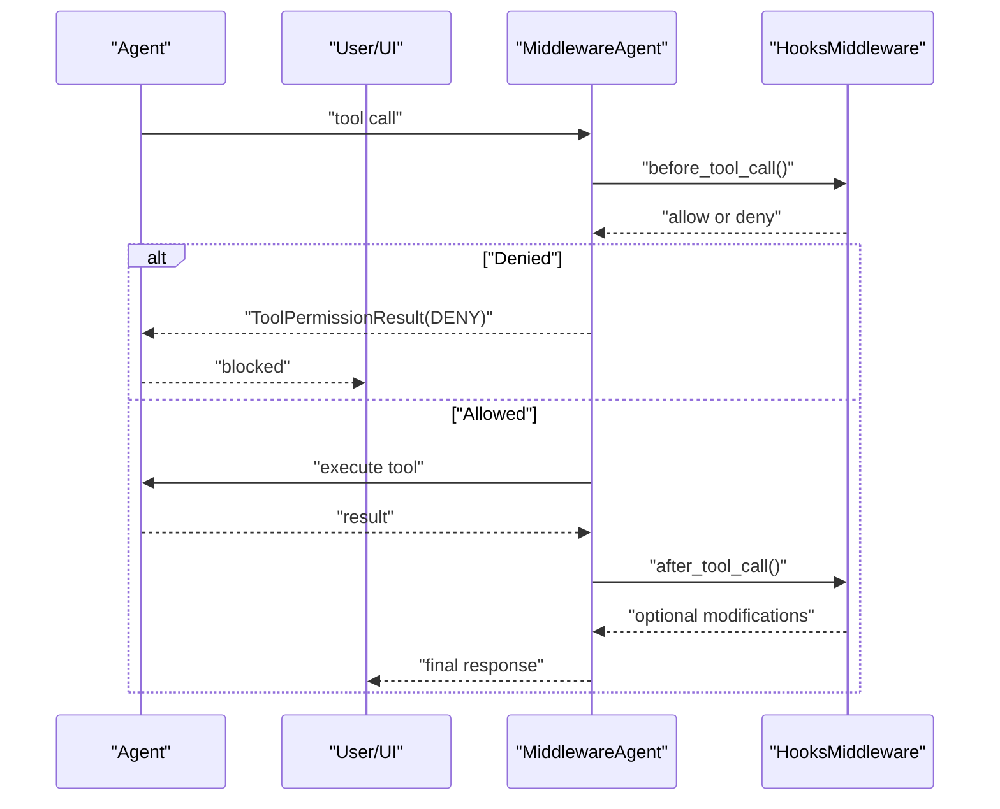
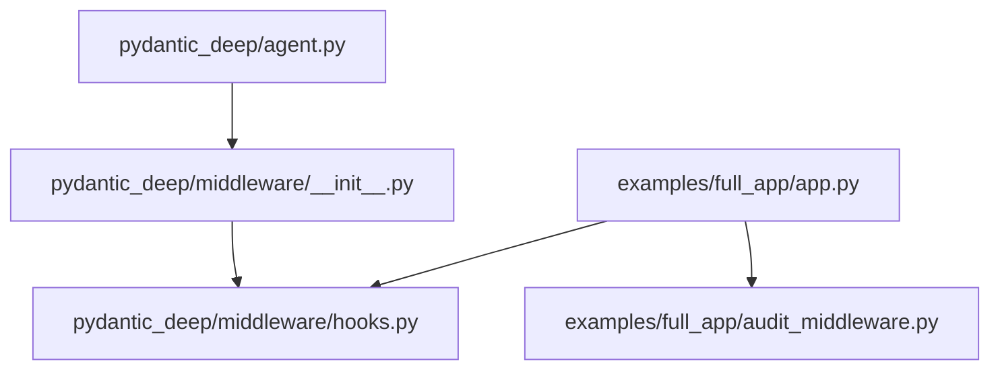

# Middleware System

<cite>
**Referenced Files in This Document**
- [hooks.py](file://pydantic_deep/middleware/hooks.py)
- [__init__.py](file://pydantic_deep/middleware/__init__.py)
- [audit_middleware.py](file://examples/full_app/audit_middleware.py)
- [middleware.py](file://apps/deepresearch/src/deepresearch/middleware.py)
- [agent.py](file://pydantic_deep/agent.py)
- [test_middleware_integration.py](file://tests/test_middleware_integration.py)
- [app.py](file://examples/full_app/app.py)
- [human_in_the_loop.py](file://examples/human_in_the_loop.py)
</cite>

## Table of Contents
1. [Introduction](#introduction)
2. [Project Structure](#project-structure)
3. [Core Components](#core-components)
4. [Architecture Overview](#architecture-overview)
5. [Detailed Component Analysis](#detailed-component-analysis)
6. [Dependency Analysis](#dependency-analysis)
7. [Performance Considerations](#performance-considerations)
8. [Troubleshooting Guide](#troubleshooting-guide)
9. [Conclusion](#conclusion)
10. [Appendices](#appendices)

## Introduction
This document explains the middleware system used to secure and govern agent tool usage. It covers two primary middleware implementations:
- AuditMiddleware: Tracks tool usage statistics for observability and real-time dashboards.
- PermissionMiddleware: Enforces safety by blocking access to sensitive paths and patterns.

It also documents the security hooks system (HooksMiddleware) that integrates with Claude Code-style lifecycle hooks for pre/post tool execution and failure handling. The document explains middleware chain execution, request/response processing, human-in-the-loop approval workflows, safety gates, and regulatory compliance features.

## Project Structure
The middleware system spans several modules:
- pydantic_deep/middleware: Core middleware abstractions and hooks integration.
- examples/full_app: Production-grade middleware and hooks usage with audit and permission enforcement.
- apps/deepresearch: Alternative middleware implementation for a research application.
- tests: Integration tests validating middleware wrapping and lifecycle hooks.
- examples/human_in_the_loop: Human-in-the-loop approval workflows for sensitive operations.

**Diagram sources**
- [agent.py:196-935](file://pydantic_deep/agent.py#L196-L935)
- [__init__.py:1-22](file://pydantic_deep/middleware/__init__.py#L1-L22)
- [hooks.py:1-373](file://pydantic_deep/middleware/hooks.py#L1-L373)
- [app.py:1-400](file://examples/full_app/app.py#L1-L400)
- [audit_middleware.py:1-140](file://examples/full_app/audit_middleware.py#L1-L140)
- [middleware.py:1-122](file://apps/deepresearch/src/deepresearch/middleware.py#L1-L122)
- [test_middleware_integration.py:1-281](file://tests/test_middleware_integration.py#L1-L281)
- [human_in_the_loop.py:1-100](file://examples/human_in_the_loop.py#L1-L100)

**Section sources**
- [agent.py:196-935](file://pydantic_deep/agent.py#L196-L935)
- [__init__.py:1-22](file://pydantic_deep/middleware/__init__.py#L1-L22)

## Core Components
- AuditMiddleware: Records tool call start/end times and aggregates usage statistics for real-time monitoring.
- PermissionMiddleware: Blocks file operations targeting sensitive paths and patterns using regular expressions.
- HooksMiddleware: Executes command or Python handler hooks on tool lifecycle events (pre/post tool use and post-tool-use-failure), enforcing safety gates and audit logging.

Key capabilities:
- Pre-execution checks with deny-on-first-match semantics.
- Post-execution result modification and background auditing.
- Integration with sandbox backends for command hooks.
- Human-in-the-loop workflows for sensitive tools.

**Section sources**
- [audit_middleware.py:34-84](file://examples/full_app/audit_middleware.py#L34-L84)
- [audit_middleware.py:104-140](file://examples/full_app/audit_middleware.py#L104-L140)
- [hooks.py:243-362](file://pydantic_deep/middleware/hooks.py#L243-L362)

## Architecture Overview
The middleware system integrates with the agent factory and wraps the underlying agent with a MiddlewareAgent when middleware or permission handlers are provided. The middleware chain runs around each tool call and model request, enabling cross-cutting concerns like auditing, permissions, and safety.

**Diagram sources**
- [agent.py:914-931](file://pydantic_deep/agent.py#L914-L931)
- [audit_middleware.py:54-84](file://examples/full_app/audit_middleware.py#L54-L84)
- [audit_middleware.py:111-140](file://examples/full_app/audit_middleware.py#L111-L140)
- [hooks.py:259-362](file://pydantic_deep/middleware/hooks.py#L259-L362)

## Detailed Component Analysis

### AuditMiddleware
Purpose:
- Track tool usage statistics (call count, durations, per-tool breakdown).
- Provide real-time stats for dashboards and sessions.

Behavior:
- Records start timestamps before tool calls.
- Computes elapsed time after tool completion and accumulates totals.
- Maintains global stats for the agent’s lifetime.

**Diagram sources**
- [audit_middleware.py:24-84](file://examples/full_app/audit_middleware.py#L24-L84)

**Section sources**
- [audit_middleware.py:34-84](file://examples/full_app/audit_middleware.py#L34-L84)

### PermissionMiddleware
Purpose:
- Prevent access to sensitive paths and patterns (e.g., system files, secrets, SSH keys).
- Enforce deny-on-first-match semantics for file-related tools.

Behavior:
- Filters tools that operate on file paths.
- Matches user-provided patterns and denies tool execution with a reason.

**Diagram sources**
- [audit_middleware.py:111-140](file://examples/full_app/audit_middleware.py#L111-L140)

**Section sources**
- [audit_middleware.py:104-140](file://examples/full_app/audit_middleware.py#L104-L140)

### HooksMiddleware (Security Hooks)
Purpose:
- Execute command or Python handler hooks on tool lifecycle events.
- Enforce safety gates and audit logging via pre/post hooks.

Lifecycle:
- PRE_TOOL_USE: Can deny tool execution or modify arguments.
- POST_TOOL_USE: Can modify results.
- POST_TOOL_USE_FAILURE: Observability on failures.

Execution model:
- Supports background hooks (fire-and-forget).
- Uses SandboxProtocol backend for command hooks.
- Parses exit codes and optional JSON output for modifications.

**Diagram sources**
- [hooks.py:243-362](file://pydantic_deep/middleware/hooks.py#L243-L362)
- [hooks.py:85-116](file://pydantic_deep/middleware/hooks.py#L85-L116)
- [hooks.py:130-171](file://pydantic_deep/middleware/hooks.py#L130-L171)

**Section sources**
- [hooks.py:243-362](file://pydantic_deep/middleware/hooks.py#L243-L362)

### Middleware Chain Execution and Integration
Integration points:
- Agent factory wraps the base agent with MiddlewareAgent when middleware, permission handlers, or cost tracking are present.
- Middleware chain order is controlled by the agent factory; context and cost middleware are appended automatically.

**Diagram sources**
- [agent.py:914-931](file://pydantic_deep/agent.py#L914-L931)

**Section sources**
- [agent.py:914-931](file://pydantic_deep/agent.py#L914-L931)
- [test_middleware_integration.py:67-127](file://tests/test_middleware_integration.py#L67-L127)

### Human-in-the-Loop Approval Workflows and Safety Gates
Human-in-the-loop:
- Tools configured with approval requirements produce DeferredToolRequests.
- The client collects approvals and resumes execution with DeferredToolResults.

Safety gates:
- HooksMiddleware supports PRE_TOOL_USE hooks that can deny execution based on patterns (e.g., dangerous commands in execute).
- Background audit hooks log tool usage after completion.

**Diagram sources**
- [hooks.py:259-331](file://pydantic_deep/middleware/hooks.py#L259-L331)
- [app.py:313-370](file://examples/full_app/app.py#L313-L370)
- [human_in_the_loop.py:35-96](file://examples/human_in_the_loop.py#L35-L96)

**Section sources**
- [app.py:313-370](file://examples/full_app/app.py#L313-L370)
- [human_in_the_loop.py:1-100](file://examples/human_in_the_loop.py#L1-L100)

## Dependency Analysis
- AuditMiddleware and PermissionMiddleware depend on pydantic_ai_middleware’s AgentMiddleware base class and ToolPermissionResult for deny decisions.
- HooksMiddleware depends on pydantic_ai_middleware’s AgentMiddleware and ToolDecision, plus SandboxProtocol for command hooks.
- The agent factory conditionally wraps the agent with MiddlewareAgent when middleware or permission handlers are provided.

**Diagram sources**
- [agent.py:914-931](file://pydantic_deep/agent.py#L914-L931)
- [__init__.py:3-11](file://pydantic_deep/middleware/__init__.py#L3-L11)
- [hooks.py:236-240](file://pydantic_deep/middleware/hooks.py#L236-L240)
- [app.py:54-106](file://examples/full_app/app.py#L54-L106)
- [audit_middleware.py:17-21](file://examples/full_app/audit_middleware.py#L17-L21)

**Section sources**
- [agent.py:914-931](file://pydantic_deep/agent.py#L914-L931)
- [__init__.py:3-11](file://pydantic_deep/middleware/__init__.py#L3-L11)

## Performance Considerations
- Background hooks avoid blocking tool execution; use them for non-critical auditing.
- Permission checks use regex matching; keep patterns concise and anchored to minimize overhead.
- AuditMiddleware maintains in-memory stats; reset periodically for long-running sessions.
- HooksMiddleware supports timeouts for command hooks to prevent stalls.

## Troubleshooting Guide
Common issues and resolutions:
- Command hooks failing: Ensure the backend implements SandboxProtocol and supports execute().
- Permission denials: Verify tool names match FILE_TOOLS and patterns are correct.
- Hook JSON parsing errors: Confirm stdout is valid JSON when returning modified_args/modified_result.
- Middleware not applied: Confirm middleware lists are provided to create_deep_agent or permission_handler is set.

**Section sources**
- [hooks.py:202-211](file://pydantic_deep/middleware/hooks.py#L202-L211)
- [audit_middleware.py:111-140](file://examples/full_app/audit_middleware.py#L111-L140)
- [hooks.py:156-170](file://pydantic_deep/middleware/hooks.py#L156-L170)

## Conclusion
The middleware system provides robust auditing, permission enforcement, and safety via hooks. AuditMiddleware offers visibility, PermissionMiddleware enforces path-based restrictions, and HooksMiddleware enables dynamic pre/post tool execution policies. Combined with human-in-the-loop workflows, the system supports both operational oversight and regulatory compliance.

## Appendices

### Code Examples and Patterns
- Middleware implementation and registration:
  - AuditMiddleware and PermissionMiddleware classes and usage in the full_app example.
  - Reference: [audit_middleware.py:34-140](file://examples/full_app/audit_middleware.py#L34-L140)
- Hooks integration:
  - Hook definitions and handler implementations for audit logging and safety gating.
  - Reference: [app.py:313-370](file://examples/full_app/app.py#L313-L370)
- Agent wrapping and middleware chain:
  - Agent factory wrapping behavior and middleware composition.
  - Reference: [agent.py:914-931](file://pydantic_deep/agent.py#L914-L931)
- Human-in-the-loop approval:
  - Configuring tools requiring approval and resuming execution with deferred results.
  - Reference: [human_in_the_loop.py:35-96](file://examples/human_in_the_loop.py#L35-L96)